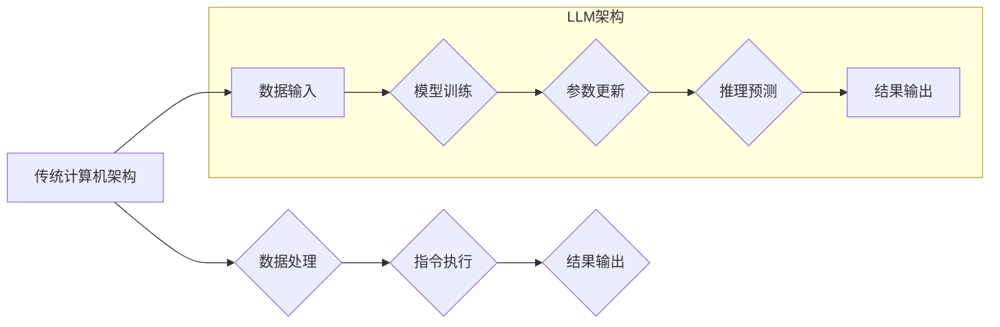

                 

## LLM作为新型计算机架构的探讨

> 关键词：大型语言模型 (LLM)、计算机架构、神经网络、自然语言处理 (NLP)、人工智能 (AI)、计算模型、软件定义

## 1. 背景介绍

随着人工智能技术的飞速发展，大型语言模型 (LLM) 已经展现出强大的能力，在自然语言处理 (NLP) 领域取得了突破性的进展。从文本生成、翻译到代码编写，LLM 正在改变着我们与计算机交互的方式。然而，LLM 的潜力远不止于此，它也为新型计算机架构的构建提供了新的思路。

传统计算机架构以冯·诺伊曼体系结构为基础，其核心是中央处理器 (CPU) 和内存。数据在 CPU 和内存之间进行传输，CPU 执行指令并处理数据。这种架构在过去几十年中取得了巨大成功，但随着数据规模和计算复杂度的不断增长，其局限性也逐渐显现。

LLM 的出现为打破传统架构的瓶颈提供了新的可能性。其本质是一种强大的神经网络，能够学习和理解复杂的语言模式。LLM 的参数数量巨大，其计算能力远超传统 CPU，并且其并行计算能力也更强。

## 2. 核心概念与联系

### 2.1  LLM 的核心概念

LLM 是指参数数量超过数十亿甚至数千亿的神经网络模型，通过大量的文本数据进行训练，能够理解和生成人类语言。其核心概念包括：

* **Transformer 架构:** LLM 通常基于 Transformer 架构，这种架构能够有效地处理序列数据，并具有强大的并行计算能力。
* **自注意力机制:** Transformer 架构的核心是自注意力机制，它能够捕捉文本序列中不同词语之间的关系，从而更好地理解上下文信息。
* **深度学习:** LLM 的训练基于深度学习算法，通过多层神经网络学习复杂的语言模式。

### 2.2  LLM 与新型计算机架构的联系

LLM 可以看作是一种新型的计算模型，其架构与传统计算机架构存在显著差异。

* **数据驱动:** LLM 的计算过程主要依赖于数据，其参数通过训练数据进行调整。
* **软硬件协同:** LLM 的训练和推理需要强大的软硬件协同，包括高性能计算平台、大规模存储系统和高效的算法优化。
* **可编程性:** LLM 可以通过微调参数来适应不同的任务，具有较高的可编程性。

**Mermaid 流程图：LLM作为新型计算机架构**



## 3. 核心算法原理 & 具体操作步骤

### 3.1  算法原理概述

LLM 的核心算法是基于深度学习的 Transformer 架构。Transformer 架构的核心是自注意力机制，它能够捕捉文本序列中不同词语之间的关系，从而更好地理解上下文信息。

### 3.2  算法步骤详解

1. **词嵌入:** 将文本中的每个词语映射到一个低维向量空间中，每个词语都对应一个唯一的向量表示。
2. **自注意力机制:** 计算每个词语与其上下文词语之间的注意力权重，并根据这些权重对词语进行加权求和，从而得到每个词语的上下文表示。
3. **多头注意力:** 使用多个自注意力头，每个头关注不同的方面，并将其结果进行融合，从而获得更丰富的上下文表示。
4. **前馈神经网络:** 对每个词语的上下文表示进行进一步处理，提取更深层次的语义信息。
5. **位置编码:** 将词语在序列中的位置信息编码到词语向量中，因为 Transformer 架构本身没有顺序信息。
6. **解码器:** 基于编码器的输出，生成目标文本序列。

### 3.3  算法优缺点

**优点:**

* 强大的文本理解能力
* 优秀的泛化能力
* 可处理长文本序列

**缺点:**

* 训练成本高
* 参数量大，需要大量的计算资源
* 缺乏可解释性

### 3.4  算法应用领域

* 自然语言理解
* 文本生成
* 机器翻译
* 代码生成
* 聊天机器人

## 4. 数学模型和公式 & 详细讲解 & 举例说明

### 4.1  数学模型构建

LLM 的数学模型主要基于神经网络，其核心是计算词语之间的注意力权重。

**注意力机制公式:**

$$
Attention(Q, K, V) = softmax(\frac{QK^T}{\sqrt{d_k}})V
$$

其中：

* $Q$：查询矩阵
* $K$：键矩阵
* $V$：值矩阵
* $d_k$：键向量的维度
* $softmax$：softmax 函数

### 4.2  公式推导过程

注意力机制的目的是计算每个词语与其上下文词语之间的相关性。

1. 计算查询矩阵 $Q$ 与键矩阵 $K$ 的点积，得到一个得分矩阵。
2. 对得分矩阵进行归一化，得到注意力权重。
3. 将注意力权重与值矩阵 $V$ 进行加权求和，得到每个词语的上下文表示。

### 4.3  案例分析与讲解

假设我们有一个句子 "The cat sat on the mat"，我们想要计算 "sat" 这个词语与其上下文词语之间的注意力权重。

1. 将每个词语映射到一个向量空间中，得到查询矩阵 $Q$、键矩阵 $K$ 和值矩阵 $V$。
2. 计算 $Q$ 与 $K$ 的点积，得到一个得分矩阵。
3. 对得分矩阵进行 softmax 归一化，得到注意力权重。
4. 将注意力权重与 $V$ 进行加权求和，得到 "sat" 的上下文表示。

## 5. 项目实践：代码实例和详细解释说明

### 5.1  开发环境搭建

* Python 3.7+
* PyTorch 或 TensorFlow
* CUDA 和 cuDNN (可选)

### 5.2  源代码详细实现

```python
import torch
import torch.nn as nn

class Transformer(nn.Module):
    def __init__(self, vocab_size, embedding_dim, num_heads, num_layers):
        super(Transformer, self).__init__()
        self.embedding = nn.Embedding(vocab_size, embedding_dim)
        self.transformer_layers = nn.ModuleList([
            nn.TransformerEncoderLayer(embedding_dim, num_heads)
            for _ in range(num_layers)
        ])

    def forward(self, x):
        x = self.embedding(x)
        for layer in self.transformer_layers:
            x = layer(x)
        return x
```

### 5.3  代码解读与分析

* `Transformer` 类定义了一个 Transformer 模型。
* `embedding` 层将词语映射到向量空间。
* `transformer_layers` 是一个列表，包含多个 Transformer Encoder Layer。
* `forward` 方法定义了模型的正向传播过程。

### 5.4  运行结果展示

训练好的 Transformer 模型可以用于各种 NLP 任务，例如文本生成、机器翻译等。

## 6. 实际应用场景

### 6.1  自然语言理解

LLM 可以用于理解文本的语义和情感，例如：

* 文本分类
* 问答系统
* 情感分析

### 6.2  文本生成

LLM 可以用于生成高质量的文本，例如：

* 文章写作
* 代码生成
* 聊天机器人

### 6.3  机器翻译

LLM 可以用于将文本从一种语言翻译成另一种语言，例如：

* Google Translate
* DeepL

### 6.4  未来应用展望

LLM 的应用场景还在不断扩展，未来可能应用于：

* 教育
* 医疗
* 法律
* 科学研究

## 7. 工具和资源推荐

### 7.1  学习资源推荐

* **书籍:**

    * "Deep Learning" by Ian Goodfellow, Yoshua Bengio, and Aaron Courville
    * "Speech and Language Processing" by Daniel Jurafsky and James H. Martin

* **在线课程:**

    * Coursera: "Deep Learning Specialization" by Andrew Ng
    * fast.ai: "Practical Deep Learning for Coders"

### 7.2  开发工具推荐

* **PyTorch:** https://pytorch.org/
* **TensorFlow:** https://www.tensorflow.org/
* **Hugging Face Transformers:** https://huggingface.co/transformers/

### 7.3  相关论文推荐

* "Attention Is All You Need" by Vaswani et al. (2017)
* "BERT: Pre-training of Deep Bidirectional Transformers for Language Understanding" by Devlin et al. (2018)

## 8. 总结：未来发展趋势与挑战

### 8.1  研究成果总结

LLM 的发展取得了显著成果，其强大的文本理解和生成能力为人工智能领域带来了新的突破。

### 8.2  未来发展趋势

* **模型规模和性能的提升:** 随着计算资源的不断发展，LLM 的规模和性能将继续提升。
* **模型效率的优化:** 研究人员将致力于开发更轻量级的 LLMs，使其能够在移动设备和嵌入式系统上运行。
* **多模态 LLMs:** 将文本与其他模态数据 (例如图像、音频) 相结合，构建更全面的 LLMs。
* **可解释性和安全性:** 研究人员将致力于提高 LLMs 的可解释性和安全性，使其能够更好地服务于人类社会。

### 8.3  面临的挑战

* **数据获取和标注:** 训练高质量的 LLMs 需要大量的文本数据，而数据获取和标注成本很高。
* **计算资源:** 训练大型 LLMs 需要大量的计算资源，这对于资源有限的机构来说是一个挑战。
* **伦理问题:** LLMs 的应用可能带来一些伦理问题，例如信息操纵和偏见放大，需要引起足够的重视。

### 8.4  研究展望

LLM 作为一种新型的计算模型，其发展潜力巨大。未来，我们将看到 LLMs 在更多领域得到应用，并为人类社会带来更多福祉。


## 9. 附录：常见问题与解答

### 9.1  LLM 与传统机器学习模型有什么区别？

LLM 是基于深度学习的 Transformer 架构，而传统机器学习模型通常基于逻辑回归、支持向量机等算法。LLM 能够学习更复杂的语言模式，并且具有更强的泛化能力。

### 9.2  如何训练一个 LLMs？

训练一个 LLMs 需要大量的文本数据和强大的计算资源。通常使用自监督学习的方式，通过预测下一个词语来训练模型。

### 9.3  LLM 的应用场景有哪些？

LLM 的应用场景非常广泛，包括自然语言理解、文本生成、机器翻译、代码生成等。

### 9.4  LLM 的伦理问题有哪些？

LLM 的应用可能带来一些伦理问题，例如信息操纵、偏见放大、隐私泄露等。需要引起足够的重视，并制定相应的规范和制度。


作者：禅与计算机程序设计艺术 / Zen and the Art of Computer Programming 
<end_of_turn>

