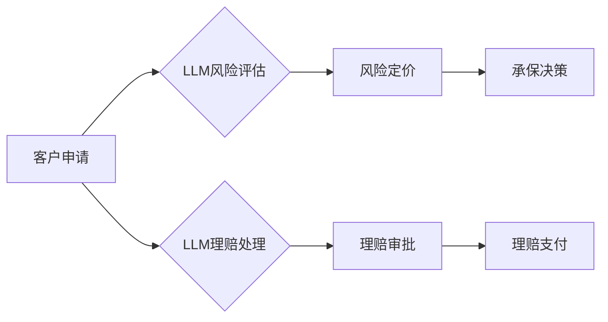

                 

## LLM在保险业的应用：风险评估与理赔

> 关键词：大型语言模型（LLM）、保险业、风险评估、理赔、自然语言处理（NLP）、机器学习（ML）、数据分析

## 1. 背景介绍

保险业作为一项古老而重要的金融服务，其核心在于预测和管理风险。传统上，保险公司依靠经验、统计数据和人工评估来判断风险和定价保单。然而，随着数据量的爆炸式增长和人工智能技术的快速发展，保险业面临着巨大的变革机遇。大型语言模型（LLM）作为人工智能领域的一项突破性技术，凭借其强大的自然语言理解和生成能力，为保险业的风险评估和理赔流程带来了新的可能性。

LLM的出现，为保险业带来了以下几方面的变革：

* **数据分析能力提升:** LLM能够处理海量文本数据，从客户申请、合同条款、新闻报道等各种来源中提取关键信息，并进行深度分析，识别潜在风险因素。
* **风险评估精准化:** LLM可以学习历史数据中的风险模式，并根据新的数据进行预测，从而提高风险评估的准确性和效率。
* **理赔流程自动化:** LLM可以自动理解理赔申请，提取相关信息，并与相关系统进行交互，加速理赔流程，降低人工成本。
* **客户服务体验提升:** LLM可以提供智能化的客户服务，例如回答常见问题、提供保单信息、协助理赔申请等，提升客户体验。

## 2. 核心概念与联系

**2.1 核心概念**

* **大型语言模型 (LLM):** 训练于海量文本数据上的深度学习模型，能够理解和生成人类语言。
* **风险评估:**  评估特定事件发生的可能性和潜在损失，为保险定价和承保决策提供依据。
* **理赔:**  根据保险合同条款，向被保险人支付保险金。

**2.2 架构图**



## 3. 核心算法原理 & 具体操作步骤

**3.1 算法原理概述**

LLM在保险业的应用主要基于以下核心算法：

* **自然语言处理 (NLP):** 用于处理和理解自然语言文本，例如提取关键信息、识别实体、分析情感等。
* **机器学习 (ML):** 用于从数据中学习模式和规律，例如预测风险、识别欺诈等。
* **深度学习 (DL):** 用于构建更复杂的模型，例如Transformer模型，能够更好地理解上下文关系和语义信息。

**3.2 算法步骤详解**

1. **数据收集和预处理:** 收集客户申请、合同条款、新闻报道等相关文本数据，并进行清洗、格式化和标注等预处理工作。
2. **模型训练:** 使用训练数据训练LLM模型，例如BERT、GPT等，使其能够理解和生成人类语言。
3. **风险评估:** 将客户申请文本输入到训练好的LLM模型中，模型会分析文本内容，提取相关特征，并根据历史数据和模型训练结果进行风险评估。
4. **理赔处理:** 将理赔申请文本输入到LLM模型中，模型会自动理解申请内容，提取相关信息，并与相关系统进行交互，例如查询保单信息、核实身份等。
5. **结果输出:** 模型输出风险评估结果、理赔审批结果等，并提供相应的建议和解释。

**3.3 算法优缺点**

**优点:**

* **自动化程度高:** LLM能够自动处理大量文本数据，提高效率和准确性。
* **数据分析能力强:** LLM能够从文本数据中提取隐藏的模式和规律，提供更深入的分析结果。
* **个性化服务:** LLM可以根据客户的具体情况进行个性化的风险评估和理赔处理。

**缺点:**

* **数据依赖性强:** LLM的性能取决于训练数据的质量和数量。
* **解释性不足:** LLM的决策过程较为复杂，难以解释其背后的逻辑。
* **伦理风险:** LLM可能存在偏见和歧视问题，需要进行充分的伦理评估和监管。

**3.4 算法应用领域**

* **风险评估:** 评估客户的信用风险、健康风险、财产风险等。
* **理赔处理:** 自动处理理赔申请、核实理赔信息、审批理赔请求等。
* **客户服务:** 提供智能化的客户服务，例如回答常见问题、提供保单信息、协助理赔申请等。
* **欺诈检测:** 识别和预防保险欺诈行为。

## 4. 数学模型和公式 & 详细讲解 & 举例说明

**4.1 数学模型构建**

LLM的风险评估模型通常基于概率论和统计学原理，例如贝叶斯定理和逻辑回归等。

**贝叶斯定理:** 用于计算事件发生的概率，根据先验概率和证据信息进行更新。

$$P(A|B) = \frac{P(B|A)P(A)}{P(B)}$$

其中：

* $P(A|B)$ 是事件 A 在事件 B 发生的条件概率。
* $P(B|A)$ 是事件 B 在事件 A 发生的条件概率。
* $P(A)$ 是事件 A 的先验概率。
* $P(B)$ 是事件 B 的概率。

**逻辑回归:** 用于预测二分类问题，例如客户是否会发生风险事件。

**4.2 公式推导过程**

逻辑回归模型的输出是一个概率值，表示事件发生的可能性。该概率值通过 sigmoid 函数计算得到：

$$P(y=1|x) = \frac{1}{1 + e^{-(w^Tx + b)}}$$

其中：

* $y$ 是事件发生的标签 (0 或 1)。
* $x$ 是输入特征向量。
* $w$ 是权重向量。
* $b$ 是偏置项。

**4.3 案例分析与讲解**

假设保险公司想要评估客户是否会发生车祸，可以使用 LLM 模型分析客户的驾驶记录、车辆信息、驾驶习惯等文本数据，并结合历史数据进行风险评估。

LLM 模型可以学习到以下风险因素：

* 年龄：年轻司机更容易发生车祸。
* 驾驶经验：经验丰富的司机驾驶技能更熟练。
* 车辆类型：大型车辆更容易造成严重事故。
* 驾驶习惯：经常超速、酒后驾驶等行为会增加风险。

根据这些风险因素，LLM 模型可以计算出客户发生车祸的概率，并根据该概率进行定价和承保决策。

## 5. 项目实践：代码实例和详细解释说明

**5.1 开发环境搭建**

* Python 3.7+
* TensorFlow 或 PyTorch 深度学习框架
* NLTK 或 SpaCy 自然语言处理库
* Jupyter Notebook 或 VS Code 开发环境

**5.2 源代码详细实现**

```python
# 导入必要的库
import tensorflow as tf
from transformers import AutoTokenizer, AutoModel

# 加载预训练模型和词典
model_name = "bert-base-uncased"
tokenizer = AutoTokenizer.from_pretrained(model_name)
model = AutoModel.from_pretrained(model_name)

# 定义输入文本
text = "我是一名经验丰富的司机，驾驶记录良好。"

# 对文本进行编码
inputs = tokenizer(text, return_tensors="tf")

# 将编码后的文本输入到模型中
outputs = model(**inputs)

# 获取模型输出
last_hidden_state = outputs.last_hidden_state

# 对输出进行分析和处理
# ...

```

**5.3 代码解读与分析**

* 代码首先导入必要的库，包括 TensorFlow 和 HuggingFace Transformers 库。
* 然后，加载预训练的 BERT 模型和词典。
* 定义输入文本，并使用 tokenizer 对文本进行编码，将文本转换为模型可以理解的格式。
* 将编码后的文本输入到模型中，获取模型输出。
* 最后，对模型输出进行分析和处理，例如提取关键信息、计算风险得分等。

**5.4 运行结果展示**

模型输出的 last_hidden_state 是一个包含文本语义信息的张量，可以用于后续的风险评估和分析。

## 6. 实际应用场景

**6.1 风险评估**

* **个人保险:** 评估客户的健康风险、意外风险、生命风险等，为个人保险定价和承保决策提供依据。
* **商业保险:** 评估企业的财产风险、责任风险、商业中断风险等，为企业保险定价和承保决策提供依据。

**6.2 理赔处理**

* **自动理赔:** 自动处理简单的理赔申请，例如车损理赔、医疗理赔等，提高理赔效率。
* **理赔欺诈检测:** 利用 LLM 分析理赔申请文本，识别潜在的欺诈行为，降低保险公司损失。

**6.3 客户服务**

* **智能客服:** 提供 24/7 的智能化客户服务，回答客户常见问题，提供保单信息，协助理赔申请等。
* **个性化推荐:** 根据客户的风险偏好和需求，推荐合适的保险产品。

**6.4 未来应用展望**

* **更精准的风险评估:** 利用更先进的 LLMs 和数据分析技术，实现更精准的风险评估，为客户提供更个性化的保险服务。
* **更智能化的理赔处理:** 利用 AI 和自动化技术，实现更智能化的理赔处理，减少人工干预，提高效率和准确性。
* **更丰富的客户服务:** 利用自然语言理解和生成技术，提供更丰富的客户服务，例如个性化咨询、情感分析等。

## 7. 工具和资源推荐

**7.1 学习资源推荐**

* **书籍:**
    * 《深度学习》 by Ian Goodfellow, Yoshua Bengio, and Aaron Courville
    * 《自然语言处理》 by Dan Jurafsky and James H. Martin
* **在线课程:**
    * Coursera: Deep Learning Specialization
    * Udacity: Natural Language Processing Nanodegree
* **博客和网站:**
    * Towards Data Science
    * Machine Learning Mastery

**7.2 开发工具推荐**

* **Python:** 广泛用于机器学习和深度学习开发。
* **TensorFlow:** 开源深度学习框架，提供丰富的工具和资源。
* **PyTorch:** 开源深度学习框架，以其灵活性和易用性而闻名。
* **HuggingFace Transformers:** 提供预训练的 LLMs 和工具，简化模型开发过程。

**7.3 相关论文推荐**

* **BERT: Pre-training of Deep Bidirectional Transformers for Language Understanding**
* **GPT-3: Language Models are Few-Shot Learners**
* **XLNet: Generalized Autoregressive Pretraining for Language Understanding**

## 8. 总结：未来发展趋势与挑战

**8.1 研究成果总结**

LLM在保险业的应用取得了显著的成果，例如提高了风险评估的准确性、加速了理赔处理的效率、提升了客户服务体验等。

**8.2 未来发展趋势**

* **模型规模和能力提升:** LLMs 将继续朝着更大的规模和更强的能力发展，能够处理更复杂的任务，提供更精准的分析结果。
* **多模态融合:** LLMs 将与其他模态数据，例如图像、音频、视频等融合，提供更全面的分析和服务。
* **边缘计算和部署:** LLMs 将部署到边缘设备，实现更快速的响应和更低的延迟。

**8.3 面临的挑战**

* **数据安全和隐私:** LLM 的训练和应用需要处理大量敏感数据，需要加强数据安全和隐私保护措施。
* **模型解释性和可信度:** LLM 的决策过程较为复杂，难以解释其背后的逻辑，需要提高模型的解释性和可信度。
* **伦理风险:** LLM 可能存在偏见和歧视问题，需要进行充分的伦理评估和监管。

**8.4 研究展望**

未来，LLM 在保险业的应用将继续深入发展，为保险公司和客户带来更多价值。需要加强对 LLMs 的研究和开发，解决其面临的挑战，并将其应用于更多场景，推动保险业的数字化转型。

## 9. 附录：常见问题与解答

**9.1 如何选择合适的 LLM 模型？**

选择合适的 LLM 模型取决于具体的应用场景和需求。例如，对于文本分类任务，可以使用 BERT 或 RoBERTa 模型；对于文本生成任务，可以使用 GPT 或 T5 模型。

**9.2 如何处理 LLM 模型的输出？**

LLM 模型的输出通常是一个概率分布或一个向量，需要根据具体的应用场景进行处理。例如，对于风险评估任务，可以将概率分布转换为风险得分；对于文本生成任务，可以将向量转换为文本。

**9.3 如何评估 LLM 模型的性能？**

可以使用准确率、召回率、F1-score 等指标评估 LLM 模型的性能。

**9.4 如何解决 LLM 模型的偏见和歧视问题？**

可以通过数据预处理、模型训练和评估等环节来解决 LLM 模型的偏见和歧视问题。例如，可以使用去偏见的数据集进行训练，并对模型输出进行公平性评估。


作者：禅与计算机程序设计艺术 / Zen and the Art of Computer Programming 
<end_of_turn>

