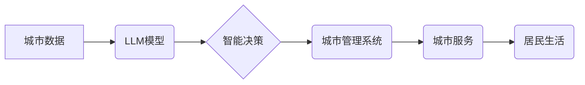

                 

## LLM驱动的智能城市：AI改变城市生活

> 关键词：大型语言模型（LLM）、智能城市、自然语言处理（NLP）、机器学习（ML）、深度学习（DL）、城市规划、城市管理、数据分析

## 1. 背景介绍

随着科技的飞速发展，人工智能（AI）正在深刻地改变着我们的生活，其中智能城市建设是AI应用的重要领域之一。智能城市是指利用信息技术和通信技术，对城市进行数字化、智能化改造，提高城市管理效率、提升居民生活品质的城市。大型语言模型（LLM）作为AI领域的一项突破性技术，拥有强大的文本理解和生成能力，为智能城市建设提供了新的机遇和可能性。

传统城市管理模式面临着诸多挑战，例如数据孤岛、信息不对称、决策效率低下等。而LLM能够通过分析海量城市数据，识别城市运行规律，提供数据驱动的决策支持，从而有效解决这些问题。

## 2. 核心概念与联系

**2.1 智能城市概念**

智能城市是指利用信息技术和通信技术，对城市进行数字化、智能化改造，提高城市管理效率、提升居民生活品质的城市。

**2.2 大型语言模型（LLM）概念**

大型语言模型（LLM）是一种基于深度学习的强大人工智能模型，通过训练海量文本数据，能够理解和生成人类语言。LLM拥有强大的文本理解、生成、翻译、摘要等能力，在自然语言处理（NLP）领域取得了突破性进展。

**2.3 LLM在智能城市中的应用**

LLM可以应用于智能城市建设的多个方面，例如：

* **城市规划与管理:** 分析城市人口、交通、环境等数据，预测城市发展趋势，优化城市规划方案。
* **公共服务:** 提供智能客服、在线咨询、预约服务等，提高公共服务效率和便捷性。
* **交通管理:** 分析交通流量数据，预测交通拥堵情况，优化交通信号灯控制，提高交通效率。
* **环境监测:** 分析环境监测数据，识别环境污染源，预测环境变化趋势，促进环境保护。
* **安全保障:** 分析城市视频监控数据，识别异常情况，提高城市安全保障水平。

**2.4 架构图**



## 3. 核心算法原理 & 具体操作步骤

**3.1 算法原理概述**

LLM的核心算法原理是基于Transformer网络结构，通过自注意力机制学习文本的语义关系，实现对文本的理解和生成。Transformer网络结构能够有效捕捉长距离依赖关系，提高模型的表达能力。

**3.2 算法步骤详解**

1. **数据预处理:** 将原始城市数据进行清洗、格式化、标记等处理，使其能够被LLM模型理解。
2. **模型训练:** 使用训练数据训练LLM模型，通过反向传播算法不断优化模型参数，提高模型的预测精度。
3. **模型评估:** 使用测试数据评估模型的性能，例如准确率、召回率、F1-score等指标。
4. **模型部署:** 将训练好的LLM模型部署到智能城市平台，用于实际应用。

**3.3 算法优缺点**

**优点:**

* 强大的文本理解和生成能力
* 能够捕捉长距离依赖关系
* 适应性强，可以应用于多种城市场景

**缺点:**

* 训练成本高，需要海量数据和计算资源
* 模型参数量大，部署成本较高
* 存在潜在的偏见和误差

**3.4 算法应用领域**

LLM算法广泛应用于智能城市建设的多个领域，例如：

* **城市规划:** 分析人口、交通、环境等数据，预测城市发展趋势，优化城市规划方案。
* **公共服务:** 提供智能客服、在线咨询、预约服务等，提高公共服务效率和便捷性。
* **交通管理:** 分析交通流量数据，预测交通拥堵情况，优化交通信号灯控制，提高交通效率。
* **环境监测:** 分析环境监测数据，识别环境污染源，预测环境变化趋势，促进环境保护。
* **安全保障:** 分析城市视频监控数据，识别异常情况，提高城市安全保障水平。

## 4. 数学模型和公式 & 详细讲解 & 举例说明

**4.1 数学模型构建**

LLM模型的数学模型主要基于Transformer网络结构，其核心是自注意力机制。自注意力机制能够学习文本中词语之间的关系，捕捉长距离依赖关系。

**4.2 公式推导过程**

自注意力机制的计算公式如下：

$$
Attention(Q, K, V) = softmax(\frac{QK^T}{\sqrt{d_k}})V
$$

其中：

* $Q$：查询矩阵
* $K$：键矩阵
* $V$：值矩阵
* $d_k$：键向量的维度
* $softmax$：softmax函数

**4.3 案例分析与讲解**

假设我们有一个句子“我爱学习编程”，其词语向量分别为：

* 我：[0.1, 0.2, 0.3]
* 爱：[0.4, 0.5, 0.6]
* 学习：[0.7, 0.8, 0.9]
* 编程：[1.0, 1.1, 1.2]

通过自注意力机制，我们可以计算出每个词语与其他词语之间的注意力权重，例如“我”与“学习”之间的注意力权重可能较高，因为这两个词语在语义上相关。

## 5. 项目实践：代码实例和详细解释说明

**5.1 开发环境搭建**

* Python 3.7+
* TensorFlow/PyTorch
* CUDA/cuDNN

**5.2 源代码详细实现**

```python
import tensorflow as tf

# 定义Transformer模型
class Transformer(tf.keras.Model):
    def __init__(self, vocab_size, embedding_dim, num_heads, num_layers):
        super(Transformer, self).__init__()
        self.embedding = tf.keras.layers.Embedding(vocab_size, embedding_dim)
        self.transformer_layers = tf.keras.layers.StackedRNNCells([
            tf.keras.layers.MultiHeadAttention(num_heads=num_heads, key_dim=embedding_dim)
            for _ in range(num_layers)
        ])

    def call(self, inputs):
        embeddings = self.embedding(inputs)
        outputs = self.transformer_layers(embeddings)
        return outputs

# 实例化模型
model = Transformer(vocab_size=10000, embedding_dim=128, num_heads=8, num_layers=6)

# 训练模型
model.compile(optimizer='adam', loss='mse')
model.fit(train_data, train_labels, epochs=10)

# 预测结果
predictions = model.predict(test_data)
```

**5.3 代码解读与分析**

* 代码首先定义了一个Transformer模型，包含嵌入层、多头注意力层和循环神经网络层。
* 嵌入层将词语转换为向量表示。
* 多头注意力层能够捕捉词语之间的关系。
* 循环神经网络层将注意力输出进行编码，生成最终的预测结果。
* 代码然后实例化模型，并使用Adam优化器和均方误差损失函数进行训练。
* 最后，代码使用训练好的模型对测试数据进行预测。

**5.4 运行结果展示**

训练完成后，可以评估模型的性能，例如准确率、召回率、F1-score等指标。

## 6. 实际应用场景

**6.1 城市规划**

LLM可以分析城市人口、交通、环境等数据，预测城市发展趋势，优化城市规划方案。例如，可以预测未来人口分布、交通流量、环境污染等情况，为城市规划提供数据支持。

**6.2 公共服务**

LLM可以提供智能客服、在线咨询、预约服务等，提高公共服务效率和便捷性。例如，可以开发一个智能客服系统，自动回答居民的常见问题，提高服务效率。

**6.3 交通管理**

LLM可以分析交通流量数据，预测交通拥堵情况，优化交通信号灯控制，提高交通效率。例如，可以开发一个智能交通管理系统，根据实时交通流量数据，动态调整交通信号灯控制，缓解交通拥堵。

**6.4 环境监测**

LLM可以分析环境监测数据，识别环境污染源，预测环境变化趋势，促进环境保护。例如，可以开发一个环境监测系统，分析空气质量、水质等数据，识别污染源，并预测环境变化趋势。

**6.5 安全保障**

LLM可以分析城市视频监控数据，识别异常情况，提高城市安全保障水平。例如，可以开发一个智能视频监控系统，识别犯罪嫌疑人、交通事故等异常情况，提高城市安全保障水平。

**6.6 未来应用展望**

随着LLM技术的不断发展，其在智能城市建设中的应用场景将更加广泛。例如，可以利用LLM进行城市居民个性化服务、城市智能决策支持、城市风险预警等。

## 7. 工具和资源推荐

**7.1 学习资源推荐**

* **书籍:**
    * 《深度学习》
    * 《自然语言处理》
* **在线课程:**
    * Coursera: 自然语言处理
    * edX: 深度学习
* **博客:**
    * The Gradient
    * Towards Data Science

**7.2 开发工具推荐**

* **TensorFlow:** 开源深度学习框架
* **PyTorch:** 开源深度学习框架
* **Hugging Face:** 提供预训练LLM模型和工具

**7.3 相关论文推荐**

* Attention Is All You Need
* BERT: Pre-training of Deep Bidirectional Transformers for Language Understanding
* GPT-3: Language Models are Few-Shot Learners

## 8. 总结：未来发展趋势与挑战

**8.1 研究成果总结**

LLM在智能城市建设领域取得了显著的成果，例如在城市规划、公共服务、交通管理、环境监测、安全保障等方面都展现出强大的应用潜力。

**8.2 未来发展趋势**

* **模型规模和性能的提升:** 未来LLM模型规模将进一步扩大，性能将得到进一步提升，能够处理更复杂的任务。
* **多模态LLM的开发:** 未来LLM将融合文本、图像、音频等多模态数据，实现更全面的智能感知和理解。
* **边缘计算和联邦学习的应用:** 未来LLM将更多地部署在边缘设备和进行联邦学习，提高模型的效率和隐私保护能力。

**8.3 面临的挑战**

* **数据安全和隐私保护:** LLM模型训练需要海量数据，如何保证数据安全和隐私保护是一个重要挑战。
* **模型解释性和可信度:** LLM模型的决策过程往往是黑盒式的，如何提高模型的解释性和可信度是一个重要的研究方向。
* **模型公平性和偏见:** LLM模型可能存在公平性和偏见问题，需要进行充分的测试和评估，确保模型的公平性和公正性。

**8.4 研究展望**

未来LLM在智能城市建设领域将发挥越来越重要的作用，需要进一步加强研究和探索，推动LLM技术在智能城市建设中的落地应用。


## 9. 附录：常见问题与解答

**9.1 如何选择合适的LLM模型？**

选择合适的LLM模型需要根据具体的应用场景和需求进行选择。例如，对于需要处理大量文本数据的应用场景，可以选择参数量较大的LLM模型；对于需要实时响应的应用场景，可以选择部署在边缘设备的轻量级LLM模型。

**9.2 如何保证LLM模型的安全性？**

保证LLM模型的安全性需要从多个方面进行考虑，例如：

* 使用安全的训练数据，避免训练数据中包含敏感信息。
* 对模型进行安全评估，识别潜在的安全漏洞。
* 对模型进行部署安全防护，防止模型被恶意攻击。

**9.3 如何解决LLM模型的偏见问题？**

解决LLM模型的偏见问题需要从多个方面进行努力，例如：

* 使用更加多样化的训练数据，减少数据中的偏见。
* 对模型进行公平性评估，识别和修正模型中的偏见。
* 开发更加公平的模型训练算法，减少模型训练过程中产生的偏见。


作者：禅与计算机程序设计艺术 / Zen and the Art of Computer Programming 
<end_of_turn>

