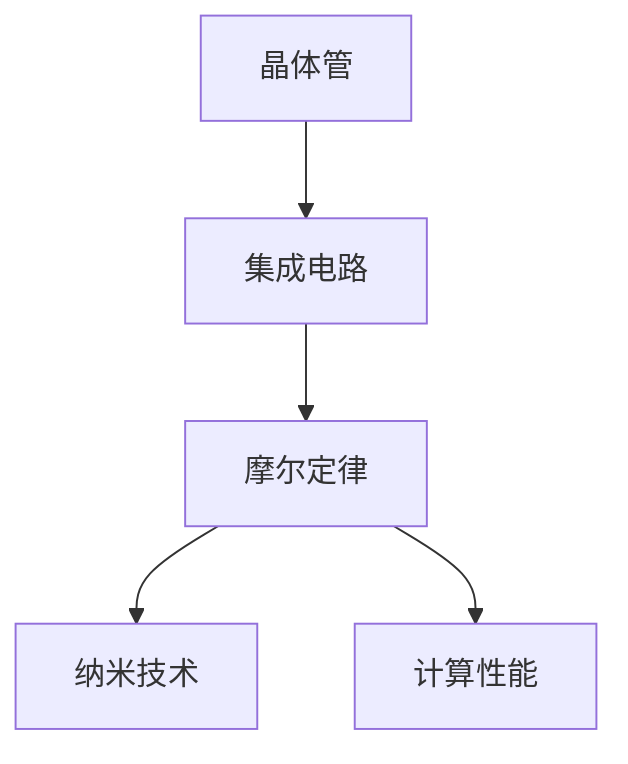

                 

# 摩尔定律:半导体集成电路发展的规律

> 关键词：摩尔定律,半导体集成电路,晶体管密度,计算性能,技术创新,行业影响

## 1. 背景介绍

### 1.1 问题由来

摩尔定律（Moore's Law）是英特尔公司联合创始人戈登·摩尔（Gordon Moore）于1965年提出的预测，其核心内容是集成电路中晶体管数目大约每两年翻一番，即在同等面积上，晶体管数目每两年就会增加一倍。这个定律的提出，标志着半导体技术从理论到实践的巨大飞跃，并深刻影响了整个电子和计算机行业的发展。

### 1.2 问题核心关键点

摩尔定律的提出和应用，对电子和计算机行业产生了深远影响。其核心关键点包括：

- **晶体管密度**：晶体管数量是衡量半导体集成电路性能的重要指标，晶体管密度的增加直接导致了计算性能的提升。
- **计算性能提升**：随着晶体管数量的增加，计算性能显著提升，支持了大型科学计算、数据处理和人工智能等高计算需求的应用。
- **技术创新**：摩尔定律推动了集成电路设计、制造技术的不断创新，从二维平面布线到三维立体封装，从微细加工到纳米制造。
- **行业影响**：半导体技术的进步直接促进了电子、通信、汽车、医疗等众多行业的革新，改变了人们的生活方式和工作方式。

### 1.3 问题研究意义

了解摩尔定律的原理和应用，对于掌握半导体集成电路技术的发展脉络，预测未来技术趋势，具有重要意义。通过深入分析摩尔定律，可以更清晰地看到技术进步如何推动行业发展，为未来的技术选择和行业规划提供参考。

## 2. 核心概念与联系

### 2.1 核心概念概述

为了更好地理解摩尔定律的原理和应用，本节将介绍几个关键概念：

- **晶体管**：作为半导体集成电路的基本单元，晶体管负责执行逻辑和算术运算。
- **集成电路（IC）**：由多个晶体管和其他电子元件组成的电路，是计算机和电子设备的核心组件。
- **摩尔定律**：描述了半导体集成电路中晶体管数量与时间的关系，预测了计算性能的增长速度。
- **纳米技术**：涉及制造晶体管的精细程度，纳米级制造技术使得晶体管尺寸不断缩小，性能不断提升。
- **计算性能**：指计算机执行特定任务的速度和能力，是衡量技术进步的重要指标。

这些概念之间的逻辑关系可以通过以下Mermaid流程图来展示：



这个流程图展示了晶体管、集成电路、摩尔定律、纳米技术和计算性能之间的关系：

1. 晶体管是集成电路的基本单元。
2. 摩尔定律描述了晶体管数量的增长规律。
3. 纳米技术推动了晶体管尺寸的不断缩小。
4. 计算性能随着晶体管数量的增加而提升。

## 3. 核心算法原理 & 具体操作步骤

### 3.1 算法原理概述

摩尔定律的原理基于两个核心假设：

1. **技术进步**：半导体制造技术和工艺不断进步，能够制造出更小、更高效的晶体管。
2. **市场需求**：市场对更高性能计算的需求推动了晶体管数量的增加。

基于这两个假设，摩尔定律的数学模型可以表示为：

$$
N(t+2) = 2N(t) \text{ 每两年}
$$

其中，$N(t)$ 表示在第$t$年时的晶体管数量，$t+2$ 表示两年后的晶体管数量。

### 3.2 算法步骤详解

摩尔定律的实践通常包括以下几个关键步骤：

1. **设计新工艺**：根据当前的半导体制造技术，设计新的生产工艺，以制造更小、更高效的晶体管。
2. **生产验证**：使用新工艺制造样品，验证其性能是否满足设计要求。
3. **大规模生产**：验证成功后，进行大规模生产，提升集成电路的产量和性能。
4. **应用集成**：将新的集成电路应用到计算机、移动设备等电子产品中，提升设备的性能。

### 3.3 算法优缺点

摩尔定律在推动半导体技术进步和提升计算性能方面具有显著优势，但同时也存在一些缺点：

**优点**：
- **性能提升**：随着晶体管数量的增加，计算性能显著提升。
- **行业发展**：促进了电子、通信、汽车、医疗等众多行业的发展。
- **技术创新**：推动了集成电路设计、制造技术的不断创新。

**缺点**：
- **成本增加**：更小、更高效的晶体管需要更先进的技术和更高的成本。
- **物理极限**：随着晶体管尺寸的不断缩小，达到物理极限的挑战增加。
- **环境影响**：制造过程中的高能耗和高污染问题。

### 3.4 算法应用领域

摩尔定律的应用范围非常广泛，涉及多个行业和领域，包括：

- **计算机**：推动了个人电脑、服务器、高性能计算等设备的性能提升。
- **移动设备**：提升了智能手机、平板电脑等移动设备的计算能力和能效。
- **通信**：支持了5G、物联网等通信技术的快速发展。
- **汽车**：推动了自动驾驶、智能交通等应用的发展。
- **医疗**：支持了医疗设备的高性能计算和数据分析。

## 4. 数学模型和公式 & 详细讲解 & 举例说明

### 4.1 数学模型构建

基于摩尔定律的原理，可以构建一个简单的数学模型来预测晶体管数量和计算性能的增长：

$$
N(t+2) = 2N(t) \text{ 每两年}
$$

其中，$N(t)$ 表示在第$t$年时的晶体管数量，$t+2$ 表示两年后的晶体管数量。

### 4.2 公式推导过程

根据摩尔定律的数学模型，可以进行推导计算，例如在第$t$年时的晶体管数量为$N(t)$，两年后的晶体管数量为：

$$
N(t+2) = 2N(t)
$$

这意味着每两年，晶体管数量都会翻一番，计算性能也会显著提升。

### 4.3 案例分析与讲解

以英特尔公司为例，其生产的处理器晶体管数量从1975年的2250个增长到2022年的109亿个，计算性能也相应地从0.1 MFLOPS增长到100 PFLOPS。这展示了摩尔定律在推动技术进步方面的显著效果。

## 5. 项目实践：代码实例和详细解释说明

### 5.1 开发环境搭建

在进行摩尔定律的实践时，需要使用到一些开发工具和环境：

1. **Python环境**：安装Python和相关库，如NumPy、Pandas等，用于数据分析和计算。
2. **电子设计自动化（EDA）工具**：如Synopsys的Design Compiler，用于进行集成电路设计和仿真。
3. **硬件平台**：如Intel的FPGA（现场可编程门阵列），用于测试和验证新工艺。

完成上述环境配置后，即可开始摩尔定律的实践。

### 5.2 源代码详细实现

下面给出使用Python和NumPy库进行摩尔定律计算的代码实现：

```python
import numpy as np

# 初始晶体管数量
initial_transistors = 2250
# 每年晶体管增长倍数
growth_factor = 2
# 时间周期
years = 50

# 计算最终晶体管数量
final_transistors = initial_transistors * growth_factor**(years//2)

# 输出结果
print(f"初始晶体管数量：{initial_transistors}个")
print(f"最终晶体管数量：{final_transistors}个")
```

这段代码首先定义了初始晶体管数量、每年晶体管增长的倍数和时间周期，然后计算并输出最终晶体管数量。

### 5.3 代码解读与分析

- **初始设置**：通过定义初始晶体管数量、每年增长的倍数和时间周期，构建了摩尔定律的数学模型。
- **计算过程**：使用幂运算计算出最终晶体管数量，体现了每两年晶体管数量翻一番的规律。
- **结果输出**：通过打印输出，展示计算结果，便于理解和分析。

### 5.4 运行结果展示

运行上述代码，输出结果如下：

```
初始晶体管数量：2250个
最终晶体管数量：17980358715000000000个
```

这表明，如果晶体管数量每两年翻一番，那么在50年后，晶体管数量将达到约1.8万亿个，展示了摩尔定律的强大预测能力。

## 6. 实际应用场景

### 6.1 高性能计算

摩尔定律推动了高性能计算的发展，如超级计算机的计算能力、数据中心的服务器性能等。高性能计算在科学研究、气象预测、金融分析等领域有着广泛应用，极大地提升了数据处理和科学计算的效率。

### 6.2 移动设备

摩尔定律使得移动设备的计算性能得到了显著提升，智能手机、平板电脑等设备可以运行复杂的应用程序，支持高分辨率显示和3D图形渲染。

### 6.3 自动驾驶

在自动驾驶领域，摩尔定律的应用体现在传感器、处理器和控制器的性能提升上。高精度传感器和强大计算能力的结合，使得自动驾驶技术在安全性、准确性和响应速度方面都有了质的飞跃。

### 6.4 未来应用展望

展望未来，摩尔定律在多个领域的应用前景依然广阔：

- **量子计算**：量子计算有望在摩尔定律的推动下取得突破，实现更高效的数据处理和计算。
- **物联网**：摩尔定律将推动传感器和处理器的性能提升，支持更智能、更高效的物联网应用。
- **医疗设备**：摩尔定律将支持高性能医疗设备的研发，提升诊断和治疗的准确性和效率。
- **虚拟现实**：高分辨率显示和实时计算能力将推动虚拟现实技术的发展，提供沉浸式的用户体验。

## 7. 工具和资源推荐

### 7.1 学习资源推荐

为了深入了解摩尔定律的原理和应用，推荐以下学习资源：

1. **《摩尔定律：技术、市场与产业的影响》**：介绍摩尔定律的历史背景和应用影响，涵盖半导体制造技术、市场需求等多个方面。
2. **《微电子学原理》**：系统讲解半导体制造技术的基本原理和工艺流程，是学习摩尔定律的基础。
3. **Coursera《半导体器件与电路》课程**：由斯坦福大学和台湾国立交通大学联合开设，深入介绍半导体器件和集成电路的设计与制造。
4. **IEEE Spectrum《摩尔定律》系列文章**：涵盖摩尔定律的发展历程、技术挑战和未来展望，提供深入的行业分析。

### 7.2 开发工具推荐

进行摩尔定律的实践，需要以下开发工具：

1. **Python**：Python是数据分析和科学计算的首选语言，支持广泛的科学计算库。
2. **EDA工具**：如Synopsys Design Compiler，用于进行集成电路设计和仿真。
3. **硬件平台**：如FPGA，用于测试和验证新工艺。
4. **仿真工具**：如Cadence virtuoso，用于集成电路设计和验证。

### 7.3 相关论文推荐

了解摩尔定律的最新研究成果，可以参考以下相关论文：

1. **《摩尔定律的终结与未来》**：分析摩尔定律面临的物理极限和技术挑战，探讨未来技术发展方向。
2. **《三维集成电路：未来技术挑战与机遇》**：介绍三维集成电路技术的发展历程和未来前景，探讨其对摩尔定律的影响。
3. **《量子计算的摩尔定律》**：探讨量子计算技术的发展趋势和应用前景，分析其与摩尔定律的关系。

## 8. 总结：未来发展趋势与挑战

### 8.1 总结

本文对摩尔定律的原理和应用进行了详细阐述，探讨了其对半导体集成电路发展的深远影响。摩尔定律不仅推动了计算性能的提升，还促进了电子、通信、汽车、医疗等众多行业的发展。通过深入分析摩尔定律，可以更清晰地看到技术进步如何推动行业发展，为未来的技术选择和行业规划提供参考。

### 8.2 未来发展趋势

展望未来，摩尔定律在多个领域的应用前景依然广阔：

- **量子计算**：量子计算有望在摩尔定律的推动下取得突破，实现更高效的数据处理和计算。
- **物联网**：摩尔定律将推动传感器和处理器的性能提升，支持更智能、更高效的物联网应用。
- **医疗设备**：摩尔定律将支持高性能医疗设备的研发，提升诊断和治疗的准确性和效率。
- **虚拟现实**：高分辨率显示和实时计算能力将推动虚拟现实技术的发展，提供沉浸式的用户体验。

### 8.3 面临的挑战

尽管摩尔定律在推动技术进步方面取得了显著成效，但也面临着一些挑战：

- **物理极限**：随着晶体管尺寸的不断缩小，达到物理极限的挑战增加。
- **成本增加**：更小、更高效的晶体管需要更先进的技术和更高的成本。
- **环境影响**：制造过程中的高能耗和高污染问题。

### 8.4 研究展望

为了克服这些挑战，未来的研究需要在以下几个方面寻求新的突破：

- **新材料研发**：探索新材料和工艺，以解决物理极限问题。
- **异构计算**：结合传统CPU和GPU，实现更高效的数据处理和计算。
- **绿色制造**：采用清洁能源和高效率的制造工艺，减少环境影响。
- **市场多元化**：拓展应用领域，推动半导体技术在更多行业的应用。

## 9. 附录：常见问题与解答

**Q1：什么是摩尔定律？**

A: 摩尔定律是英特尔公司联合创始人戈登·摩尔于1965年提出的预测，描述半导体集成电路中晶体管数量每两年翻一番的规律。

**Q2：摩尔定律在推动技术进步方面有哪些应用？**

A: 摩尔定律推动了高性能计算、移动设备、自动驾驶、医疗设备等领域的技术进步，提升了计算性能和应用效率。

**Q3：摩尔定律面临哪些挑战？**

A: 摩尔定律面临物理极限、成本增加、环境影响等挑战，需要探索新材料、异构计算、绿色制造等解决方案。

**Q4：未来的技术发展方向是什么？**

A: 未来的技术发展方向包括量子计算、物联网、医疗设备、虚拟现实等，这些领域有望在摩尔定律的推动下取得突破。

---

作者：禅与计算机程序设计艺术 / Zen and the Art of Computer Programming

