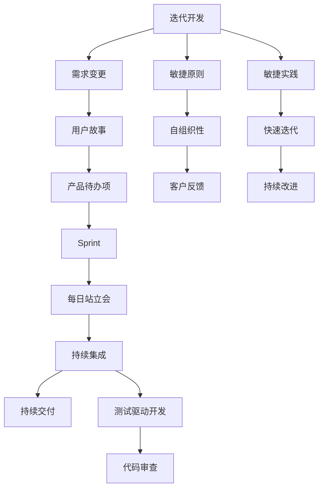

                 

# 敏捷开发的原则与实践分享

## 1. 背景介绍

敏捷开发(Agile Development)作为一种以人为核心、迭代开发、响应变化的软件开发方法，已经在软件工程界广泛应用，并成为软件开发的标准流程之一。敏捷开发的核心理念是"快速响应变化，持续交付价值"。该方法强调团队协作、客户反馈、快速迭代和持续改进，旨在提高开发效率，提升产品质量，降低开发风险。

### 1.1 问题由来
敏捷开发方法诞生于20世纪90年代末的商业软件开发环境中，最初是由一组软件工程师在传统瀑布式开发模型基础上提出的。传统的瀑布式开发模型强调项目规划、需求分析、设计、编码、测试、部署和维护的严格阶段性顺序执行。然而，这种模型在面对需求变化频繁、市场竞争激烈的软件开发环境时，显得过于死板，难以灵活应对变化。

敏捷开发的提出，正是为了解决瀑布模型在应对变化方面的不足。敏捷方法通过将开发过程划分为多个短周期的迭代，使开发团队能够灵活应对需求变化，及时响应客户反馈，快速交付高质量的软件产品。

### 1.2 问题核心关键点
敏捷开发的核心在于以下几个关键点：

- **迭代开发**：将开发过程划分为多个短期迭代周期，每个周期一般持续2到4周，通过快速交付功能的增量版本，持续改进产品。
- **客户反馈**：强调与客户的紧密互动，及时收集客户反馈，快速响应需求变更，避免产品与市场脱节。
- **团队协作**：注重团队成员之间的沟通与协作，提升团队效率，增强成员之间的信任与默契。
- **自组织性**：团队具有高度的自组织能力，成员自主决策，减少管理层对项目进度的严格控制。
- **持续集成与持续交付**：通过自动化测试和部署工具，实现代码的持续集成与持续交付，快速发现和修复缺陷。

敏捷开发方法不仅适用于软件开发，还广泛应用于项目管理、数据分析、人工智能等领域，通过快速迭代、持续交付和持续改进，提升项目的成功率和客户满意度。

## 2. 核心概念与联系

### 2.1 核心概念概述

为更好地理解敏捷开发的核心概念，本节将介绍几个密切相关的核心概念：

- **迭代**：将开发过程划分为多个短期周期，每个周期内完成一定数量的功能开发和测试。
- **需求变更**：客户需求可能会发生变化，敏捷开发通过快速迭代及时响应需求变更。
- **用户故事**：以客户视角描述产品需求的简短文本，便于团队理解客户需求。
- **产品待办项**：用于记录待完成的工作任务，并通过任务优先级排序决定开发顺序。
- **Sprint**：敏捷开发中最小的迭代周期，一般为2到4周，以Sprint结束时交付可用的产品增量为目标。
- **每日站立会**：团队成员每天进行短时间的站立会议，汇报工作进展和阻碍，保持沟通和协作。
- **持续集成与持续交付**：通过自动化测试和部署工具，实现代码的快速集成和交付，保证产品质量。
- **测试驱动开发(TDD)**：先编写测试代码，再编写功能代码，确保代码质量。
- **代码审查**：团队成员间互相审查代码，提升代码质量，避免潜在的错误。

这些核心概念之间的逻辑关系可以通过以下Mermaid流程图来展示：



这个流程图展示了下文提到的敏捷开发的各个核心概念及其相互关系：

1. 敏捷开发通过快速迭代、客户反馈和持续改进，实现产品迭代升级。
2. 敏捷开发强调自组织团队，以增强团队效率和成员间的信任与默契。
3. 敏捷开发采用用户故事、产品待办项等方法，帮助团队更好地理解客户需求和规划工作任务。
4. Sprint、每日站立会等实践帮助团队保持高效沟通和协作。
5. 持续集成与持续交付、测试驱动开发和代码审查等方法，确保产品质量和代码质量。

这些概念共同构成了敏捷开发的实践框架，使团队能够在快速变化的市场环境中，持续交付高质量的软件产品。

## 3. 核心算法原理 & 具体操作步骤
### 3.1 算法原理概述

敏捷开发是一种以人为核心的软件开发方法，其核心原理是"快速响应变化，持续交付价值"。敏捷开发的主要算法原理包括以下几点：

1. **迭代开发**：将开发过程划分为多个短期迭代周期，每个周期内完成一定数量的功能开发和测试。
2. **客户反馈**：通过与客户的紧密互动，及时收集客户反馈，快速响应需求变更。
3. **团队协作**：注重团队成员之间的沟通与协作，提升团队效率，增强成员之间的信任与默契。
4. **自组织性**：团队具有高度的自组织能力，成员自主决策，减少管理层对项目进度的严格控制。
5. **持续集成与持续交付**：通过自动化测试和部署工具，实现代码的持续集成与持续交付，快速发现和修复缺陷。
6. **测试驱动开发(TDD)**：先编写测试代码，再编写功能代码，确保代码质量。
7. **代码审查**：团队成员间互相审查代码，提升代码质量，避免潜在的错误。

### 3.2 算法步骤详解

敏捷开发的实现过程主要包括以下几个关键步骤：

**Step 1: 项目启动和规划**
- 确定项目目标和范围，定义关键需求和优先级。
- 建立跨职能的敏捷团队，明确团队成员的角色和职责。
- 制定项目规划，包括迭代周期、Sprint目标、关键里程碑等。

**Step 2: 创建产品待办项列表**
- 收集和整理客户需求，创建详细的用户故事。
- 将用户故事转化为产品待办项，明确每个待办项的功能和优先级。
- 使用敏捷工具如Jira、Trello等，将产品待办项列表可视化。

**Step 3: 迭代开发**
- 确定Sprint周期，一般为2到4周。
- 在每个Sprint开始前进行需求评审和Sprint计划会议，明确Sprint目标和任务分配。
- 团队成员在Sprint期间进行功能开发、测试、文档编写等，保持每日站立会，汇报进展和阻碍。
- 在Sprint结束时进行Sprint评审会议，展示Sprint成果，收集反馈意见，进行Sprint回顾会议，总结Sprint表现和改进措施。

**Step 4: 持续集成与持续交付**
- 实现代码的持续集成，自动构建、测试和集成新代码。
- 实现持续交付，自动化部署和发布新版本。
- 使用持续集成和持续交付工具如Jenkins、GitLab CI/CD等，提升自动化程度。

**Step 5: 客户反馈和持续改进**
- 定期与客户沟通，收集客户反馈和建议。
- 定期回顾敏捷开发过程，识别改进点，持续改进开发流程和团队协作方式。

### 3.3 算法优缺点

敏捷开发作为一种软件开发方法，具有以下优点：

1. **快速响应变化**：敏捷开发通过快速迭代和客户反馈，能够及时响应需求变更，保持产品与市场的同步。
2. **提升团队效率**：敏捷开发注重团队协作和沟通，通过自组织性提升团队效率和成员间的信任与默契。
3. **提高产品质量**：持续集成与持续交付、测试驱动开发和代码审查等方法，确保产品质量和代码质量。
4. **增强客户满意度**：通过与客户的紧密互动和及时响应需求，提升客户满意度和产品价值。

然而，敏捷开发也存在一些局限性：

1. **资源消耗高**：敏捷开发需要频繁进行迭代和客户沟通，消耗较多的人力和时间。
2. **缺乏标准化**：敏捷开发的方法和实践较为灵活，缺乏严格的标准化和规范，可能导致项目实施的不一致性。
3. **难以量化**：敏捷开发的评估和改进较为主观，难以通过严格的量化指标进行衡量。

尽管存在这些局限性，但就目前而言，敏捷开发依然是软件开发中最受欢迎的方法之一，其灵活性和适应性使其在快速变化的市场环境中具有显著优势。

### 3.4 算法应用领域

敏捷开发方法广泛应用于软件开发、项目管理、数据分析、人工智能等多个领域，通过快速迭代、持续交付和持续改进，提升项目的成功率和客户满意度。

- **软件开发**：敏捷开发是软件开发的标准流程之一，通过快速迭代和持续交付，提升开发效率和产品质量。
- **项目管理**：敏捷开发通过客户反馈和持续改进，帮助项目管理团队更高效地达成项目目标。
- **数据分析**：敏捷开发通过快速迭代和客户反馈，使数据分析团队能够及时响应业务需求，提供有价值的数据分析结果。
- **人工智能**：敏捷开发通过快速迭代和持续交付，加速人工智能模型的训练和部署，提升模型性能和应用价值。

## 4. 数学模型和公式 & 详细讲解 & 举例说明

### 4.1 数学模型构建

敏捷开发作为一种方法论，其数学模型主要围绕项目管理和团队协作展开。

定义一个敏捷项目 $P$，包含以下要素：

- $T$：项目周期（Sprint）集合。
- $S$：每个周期内的待办项集合。
- $V$：客户需求集合。
- $U$：用户故事集合。
- $C$：团队成员集合。
- $E$：团队内部沟通和协作方式。
- $M$：持续集成与持续交付工具集合。

其中，$T$、$S$、$V$、$U$、$C$、$E$、$M$ 通过一定的规则和方法，共同构成敏捷项目的数学模型。

### 4.2 公式推导过程

以下以敏捷开发中的Sprint计划会议为例，推导敏捷开发中的关键数学公式。

假设一个敏捷项目 $P$，包含 $n$ 个Sprint周期 $T=\{t_1,t_2,...,t_n\}$，每个Sprint周期内包含 $m$ 个待办项 $S=\{s_1,s_2,...,s_m\}$。

在Sprint计划会议中，团队成员对每个待办项进行评估，确定其优先级 $p_i \in [1,m]$，在Sprint周期内完成该待办项的概率 $c_i \in [0,1]$。

定义 $V_i$ 为第 $i$ 个待办项的价值，$C_i$ 为完成该待办项的成本。则敏捷开发中的Sprint计划会议可以表示为以下数学模型：

$$
\max \sum_{i=1}^{m} \frac{V_i \times p_i}{C_i} \times c_i
$$

其中，$\max$ 表示最大化待办项的价值，$p_i$ 和 $c_i$ 表示待办项的优先级和完成概率，$V_i$ 和 $C_i$ 表示待办项的价值和成本。

该模型的优化目标是最大化敏捷项目 $P$ 的总价值，即最大化敏捷项目的用户故事价值和客户满意度。

### 4.3 案例分析与讲解

假设一个敏捷开发团队正在进行一个用户故事数量为100个的Sprint。在Sprint计划会议中，团队成员对每个用户故事进行价值和成本评估，得到以下数据：

| 用户故事编号 | 价值(V) | 成本(C) | 优先级(p) | 完成概率(c) |
| --- | --- | --- | --- | --- |
| 1 | 10 | 5 | 3 | 0.9 |
| 2 | 8 | 3 | 2 | 0.8 |
| ... | ... | ... | ... | ... |
| 100 | 2 | 1 | 5 | 0.7 |

将数据代入上述数学模型，得到最优的Sprint计划为：

| 用户故事编号 | 价值(V) | 成本(C) | 优先级(p) | 完成概率(c) | 分配到Sprint | 完成情况 |
| --- | --- | --- | --- | --- | --- | --- |
| 1 | 10 | 5 | 3 | 0.9 | 是 | 已完成 |
| 2 | 8 | 3 | 2 | 0.8 | 是 | 已完成 |
| ... | ... | ... | ... | ... | ... | ... |
| 100 | 2 | 1 | 5 | 0.7 | 否 | 未完成 |

在Sprint结束后，团队进行Sprint回顾会议，评估Sprint表现，识别改进点，提升团队协作和效率。

## 5. 项目实践：代码实例和详细解释说明

### 5.1 开发环境搭建

在进行敏捷开发实践前，我们需要准备好开发环境。以下是使用JIRA和KANBAN进行敏捷开发的开发环境配置流程：

1. 安装JIRA：从官网下载并安装JIRA，用于项目管理和敏捷开发过程跟踪。

2. 创建项目：在JIRA中创建一个新项目，定义项目名称、描述和初始产品待办项。

3. 创建团队：在JIRA中创建一个新团队，分配项目成员和角色。

4. 配置KANBAN看板：在JIRA中创建KANBAN看板，定义待办项状态和流程。

5. 配置持续集成与持续交付工具：在JIRA中集成持续集成与持续交付工具如Jenkins、GitLab CI/CD等。

完成上述步骤后，即可在JIRA中进行敏捷开发实践。

### 5.2 源代码详细实现

下面我们以敏捷开发中的Sprint计划会议为例，给出使用JIRA进行敏捷开发过程管理的代码实现。

首先，定义产品待办项类：

```java
public class Story {
    private int id;
    private String title;
    private int value;
    private int cost;
    private int priority;
    private double completionProbability;
    
    public Story(int id, String title, int value, int cost, int priority, double completionProbability) {
        this.id = id;
        this.title = title;
        this.value = value;
        this.cost = cost;
        this.priority = priority;
        this.completionProbability = completionProbability;
    }
    
    // getter and setter methods
}
```

然后，定义敏捷开发项目类：

```java
public class AgileProject {
    private List<Story> stories;
    private List<Story> completedStories;
    
    public AgileProject(List<Story> stories) {
        this.stories = stories;
        this.completedStories = new ArrayList<>();
    }
    
    public List<Story> getStories() {
        return stories;
    }
    
    public List<Story> getCompletedStories() {
        return completedStories;
    }
    
    public void planSprint(Sprint sprint) {
        // implement Sprint planning logic
    }
    
    public void reviewSprint(Sprint sprint) {
        // implement Sprint review logic
    }
}
```

接着，定义Sprint类：

```java
public class Sprint {
    private AgileProject project;
    private List<Story> allocatedStories;
    
    public Sprint(AgileProject project) {
        this.project = project;
        this.allocatedStories = new ArrayList<>();
    }
    
    public AgileProject getProject() {
        return project;
    }
    
    public List<Story> getAllocatedStories() {
        return allocatedStories;
    }
    
    public void allocateStory(Story story) {
        // implement story allocation logic
        allocatedStories.add(story);
    }
    
    public void setAllocatedStories(List<Story> allocatedStories) {
        this.allocatedStories = allocatedStories;
    }
}
```

最后，启动敏捷开发流程：

```java
List<Story> stories = new ArrayList<>();
stories.add(new Story(1, "User Story 1", 10, 5, 3, 0.9));
stories.add(new Story(2, "User Story 2", 8, 3, 2, 0.8));
// add more stories...

AgileProject project = new AgileProject(stories);
Sprint sprint = new Sprint(project);

project.planSprint(sprint);
project.reviewSprint(sprint);
```

以上就是使用JIRA进行敏捷开发过程管理的完整代码实现。可以看到，通过定义产品待办项、敏捷开发项目和Sprint类，以及实现计划和回顾Sprint的方法，可以完成敏捷开发的基本流程。

### 5.3 代码解读与分析

让我们再详细解读一下关键代码的实现细节：

**Story类**：
- `Story`类用于表示用户故事，包含用户故事的编号、标题、价值、成本、优先级和完成概率等属性。

**AgileProject类**：
- `AgileProject`类用于表示敏捷开发项目，包含项目中所有用户故事和已完成用户故事。
- `planSprint`和`reviewSprint`方法分别用于计划和回顾Sprint，具体实现可以采用各种敏捷开发工具提供的API，如JIRA提供的敏捷板视图和报表功能。

**Sprint类**：
- `Sprint`类用于表示敏捷开发中的Sprint周期，包含分配的用户故事和已完成的用户故事。

通过定义这些类和实现相应的逻辑，我们可以在JIRA中完成敏捷开发的各个阶段，如计划Sprint、分配故事、回顾Sprint等。

当然，工业级的系统实现还需考虑更多因素，如敏捷工具的集成、Sprint任务的可视化、持续集成与持续交付的自动化等。但核心的敏捷开发流程基本与此类似。

## 6. 实际应用场景
### 6.1 智能客服系统

敏捷开发方法在智能客服系统的构建中得到了广泛应用。传统的客服系统依赖人工处理客户咨询，响应时间长、效率低。敏捷开发通过快速迭代和持续交付，使智能客服系统能够快速响应用户需求，提升服务质量。

在技术实现上，可以收集历史客服对话记录，构建敏捷团队，使用敏捷开发工具进行需求分析、Sprint规划、持续集成与持续交付等，实现对客户咨询的快速响应和处理。智能客服系统能够自动理解用户意图，匹配最合适的答案模板，实现高效、自然的客服交互。

### 6.2 金融舆情监测

金融机构需要实时监测市场舆论动向，以便及时应对负面信息传播，规避金融风险。敏捷开发通过快速迭代和持续交付，使金融舆情监测系统能够快速响应用户需求，提升监测效果。

在技术实现上，可以收集金融领域相关的新闻、报道、评论等文本数据，构建敏捷团队，使用敏捷开发工具进行需求分析、Sprint规划、持续集成与持续交付等，实现对金融舆情的实时监测和分析。监测系统能够自动抽取舆情信息，识别出潜在的金融风险，及时提醒相关人员处理。

### 6.3 个性化推荐系统

当前的推荐系统往往只依赖用户的历史行为数据进行物品推荐，无法深入理解用户的真实兴趣偏好。敏捷开发通过快速迭代和持续交付，使个性化推荐系统能够更好地挖掘用户行为背后的语义信息，从而提供更精准、多样的推荐内容。

在技术实现上，可以收集用户浏览、点击、评论、分享等行为数据，提取和用户交互的物品标题、描述、标签等文本内容。构建敏捷团队，使用敏捷开发工具进行需求分析、Sprint规划、持续集成与持续交付等，实现对用户兴趣的快速理解和推荐。推荐系统能够从文本内容中准确把握用户的兴趣点，生成个性化推荐列表。

### 6.4 未来应用展望

随着敏捷开发方法的不断演进，其在更多领域的应用前景将更加广阔。

在智慧医疗领域，敏捷开发方法可以应用于医疗数据分析、病历生成、治疗方案推荐等方面，提升医疗服务的智能化水平，辅助医生诊疗，加速新药开发进程。

在智能教育领域，敏捷开发方法可以应用于在线教育平台的开发、课程设计、学习评估等方面，因材施教，促进教育公平，提高教学质量。

在智慧城市治理中，敏捷开发方法可以应用于城市事件监测、舆情分析、应急指挥等方面，提高城市管理的自动化和智能化水平，构建更安全、高效的未来城市。

此外，在企业生产、社会治理、文娱传媒等众多领域，敏捷开发方法也将不断涌现，为传统行业数字化转型升级提供新的技术路径。相信随着敏捷开发方法的持续发展，其在各个行业的落地应用将更加广泛，推动人工智能技术更好服务于社会和人民。

## 7. 工具和资源推荐
### 7.1 学习资源推荐

为了帮助开发者系统掌握敏捷开发的方法和实践，这里推荐一些优质的学习资源：

1. 《敏捷软件开发：原则、模式与实践》：由Robert C. Martin著，是敏捷开发的经典之作，详细介绍了敏捷开发的核心理念和方法。

2. 《Scrum敏捷项目管理：基础与实践》：由Ken Schwaber著，详细介绍了Scrum敏捷项目管理框架，是敏捷项目管理的权威指南。

3. Agile Alliance网站：提供敏捷开发的最佳实践、案例分析和资源分享，是敏捷开发者的重要学习平台。

4. Agile Manifesto官网：提供敏捷开发的宣言、原则和实践，是敏捷开发的重要参考资料。

5. Coursera的《Agile Software Development with Scrum》课程：由Therese Harper和Trish Ginter联合开设，系统介绍了敏捷开发的方法和实践，适合初学者入门。

通过学习这些资源，相信你一定能够全面掌握敏捷开发的核心思想和实践方法，并应用于软件开发和项目管理中。

### 7.2 开发工具推荐

高效的敏捷开发离不开优秀的工具支持。以下是几款用于敏捷开发管理的常用工具：

1. JIRA：由Atlassian公司开发的项目管理和敏捷开发工具，提供全面的项目管理、任务跟踪和报告功能。

2. Trello：由Atlassian公司开发的KANBAN看板工具，简单易用，适合敏捷开发任务的可视化管理。

3. Jenkins：由CloudBees公司开发的持续集成与持续交付工具，支持多种编程语言和框架，集成自动化测试和部署功能。

4. GitLab CI/CD：由GitLab公司开发的持续集成与持续交付工具，提供强大的CI/CD流程管理和自动化部署功能。

5. Slack：由Slack公司开发的企业级即时通讯工具，支持团队沟通、协作和任务分配。

合理利用这些工具，可以显著提升敏捷开发项目的效率，加快产品迭代和交付的周期。

### 7.3 相关论文推荐

敏捷开发作为软件开发的方法论，已经取得了丰硕的研究成果。以下是几篇重要的相关论文，推荐阅读：

1. 《Extreme Programming Explains: Embrace Change》：由Kent Beck著，介绍了Extreme Programming（XP）的核心理念和方法，是敏捷开发的重要理论基础。

2. 《Scrum：How to Make Things Better》：由Ken Schwaber著，详细介绍了Scrum敏捷项目管理框架，是敏捷项目管理的权威指南。

3. 《Agile Software Development: Principles, Patterns, and Practices》：由Robert C. Martin著，系统介绍了敏捷开发的核心理念和实践方法。

4. 《Continuous Delivery: Reliable Software Releases through Build, Test, and Deployment Automation》：由Jez Humble和David Farley联合著，介绍了持续集成与持续交付的原理和方法，是CI/CD实践的重要参考资料。

这些论文代表了大规模敏捷开发方法的研究进展，通过学习这些前沿成果，可以帮助研究者把握学科前进方向，激发更多的创新灵感。

## 8. 总结：未来发展趋势与挑战
### 8.1 研究成果总结

敏捷开发作为一种软件开发方法，已经成为了软件开发领域的标准流程之一。通过快速迭代、客户反馈和持续改进，敏捷开发在提升开发效率、产品质量和客户满意度方面发挥了重要作用。其核心理念和实践方法被广泛应用于软件开发、项目管理、数据分析、人工智能等领域，成为构建高效、灵活的软件系统的重要手段。

### 8.2 未来发展趋势

展望未来，敏捷开发将呈现以下几个发展趋势：

1. **敏捷开发工具的智能化**：随着人工智能技术的进步，敏捷开发工具将更加智能化，能够自动生成需求文档、代码、测试用例等，提升开发效率和代码质量。

2. **敏捷开发流程的自动化**：通过引入自动化工具和自动化流程，敏捷开发将进一步减少人工干预，提升开发速度和质量。

3. **敏捷开发的标准化**：随着敏捷开发在各个领域的广泛应用，将逐步形成统一的标准化流程和方法，提升敏捷开发的可复用性和可靠性。

4. **敏捷开发的多模态融合**：随着多模态数据的增多，敏捷开发将更加注重融合视觉、语音、文本等多种数据源，提升系统智能和应用价值。

5. **敏捷开发与云服务结合**：随着云服务的普及，敏捷开发将与云服务深度结合，实现资源的灵活调度和自动化部署，提升系统可扩展性和可维护性。

6. **敏捷开发与DevOps的结合**：敏捷开发将与DevOps（开发运维一体化）紧密结合，实现开发、测试、部署、运维的一体化管理，提升系统交付速度和稳定性。

这些趋势将推动敏捷开发方法在更多领域得到应用，提升开发效率和产品质量，加速软件系统的迭代和交付。

### 8.3 面临的挑战

尽管敏捷开发已经取得了显著的成果，但在迈向更加智能化、普适化应用的过程中，它仍面临着诸多挑战：

1. **资源消耗高**：敏捷开发需要频繁进行迭代和客户沟通，消耗较多的人力和时间。如何在资源有限的情况下，保证敏捷开发的效率和效果，是一个重要挑战。

2. **团队协作困难**：敏捷开发强调团队协作和沟通，但不同的团队文化、工作习惯和沟通方式，可能导致团队协作的困难。如何提升团队协作效率，是敏捷开发需要解决的重要问题。

3. **需求变更频繁**：敏捷开发通过快速迭代和客户反馈，能够及时响应需求变更，但频繁的需求变更也带来了风险和成本。如何在保持敏捷性的同时，降低变更带来的风险，是敏捷开发的重要挑战。

4. **质量控制难度大**：敏捷开发通过快速迭代和持续交付，虽然提升了开发效率，但也带来了质量控制的难度。如何在保证快速迭代的同时，确保软件质量，是一个重要挑战。

5. **知识共享与转移困难**：敏捷开发需要团队成员共享知识和经验，但不同的团队成员和组织之间，知识共享和转移难度较大。如何提升知识共享效率，是敏捷开发需要解决的重要问题。

6. **技术债务积累**：敏捷开发通过快速迭代和持续交付，虽然提升了开发效率，但也可能带来技术债务的积累。如何避免技术债务的积累，是敏捷开发的重要挑战。

这些挑战需要通过不断的实践和改进，才能逐步解决。只有在实践中不断优化和改进敏捷开发方法，才能实现其真正的价值和意义。

### 8.4 研究展望

面对敏捷开发所面临的挑战，未来的研究需要在以下几个方面寻求新的突破：

1. **敏捷开发工具的智能化**：开发更加智能化的敏捷开发工具，减少人工干预，提升开发效率和代码质量。

2. **敏捷开发流程的标准化**：制定统一的标准化流程和方法，提升敏捷开发的可复用性和可靠性。

3. **敏捷开发与人工智能结合**：引入人工智能技术，提升敏捷开发的质量控制和知识共享效率。

4. **敏捷开发与云服务的结合**：实现敏捷开发与云服务的深度结合，提升系统的可扩展性和可维护性。

5. **敏捷开发与DevOps的结合**：实现敏捷开发与DevOps的一体化管理，提升系统交付速度和稳定性。

6. **敏捷开发与多模态数据的结合**：融合视觉、语音、文本等多种数据源，提升系统智能和应用价值。

通过这些研究方向，敏捷开发将更加灵活、高效、可靠，为构建高效、智能的软件系统提供坚实的基础。面向未来，敏捷开发需要与其他软件开发方法、人工智能技术、云服务等技术紧密结合，共同推动软件开发领域的发展和进步。

## 9. 附录：常见问题与解答

**Q1：敏捷开发是否适用于所有类型的项目？**

A: 敏捷开发适用于快速变化、需求不明确的项目，特别是在软件开发、项目管理、数据分析、人工智能等领域得到了广泛应用。但对于一些需求明确、技术复杂、涉及多学科的项目，敏捷开发可能需要结合其他方法，如瀑布模型、瀑布模型与敏捷的混合方法等。

**Q2：如何选择合适的敏捷开发工具？**

A: 敏捷开发工具的选择应该根据项目规模、团队规模和需求类型进行评估。一般而言，大型复杂项目可以使用JIRA、Trello等大型工具，而小型项目可以使用Confluence、Asana等轻量级工具。同时，工具的选择还应该考虑与团队使用的其他工具的集成和兼容性。

**Q3：敏捷开发中的Scrum和Kanban有什么区别？**

A: Scrum和Kanban都是敏捷开发中的两种方法，主要区别在于迭代周期和任务管理方式。Scrum以Sprint为迭代周期，每个Sprint包含多个任务，任务优先级由产品负责人决定；Kanban则强调看板管理，任务按照状态进行可视化，团队可以实时了解任务进展和瓶颈。

**Q4：敏捷开发中的持续集成与持续交付(CI/CD)如何实现？**

A: 持续集成与持续交付是通过自动化工具和流程实现的。持续集成工具如Jenkins、GitLab CI/CD等，可以自动构建、测试和部署代码，确保代码质量。持续交付工具通过自动化部署工具如Jenkins、GitLab CI/CD等，实现快速交付。CI/CD的实现需要开发、测试、运维等多个角色的协同合作。

**Q5：敏捷开发中的测试驱动开发(TDD)如何实现？**

A: 测试驱动开发通过先编写测试代码，再编写功能代码，确保代码质量。TDD的实现需要开发、测试、产品等多个角色的协同合作。在敏捷开发中，通常会使用自动化测试工具如Selenium、JUnit等，自动化测试用例的编写和执行。

通过上述问题的解答，相信你对敏捷开发有了更全面的了解，可以在实际开发中更好地应用敏捷开发方法和工具。敏捷开发作为软件开发的重要方法，将在更多领域发挥其优势，推动软件开发和应用的发展和进步。

