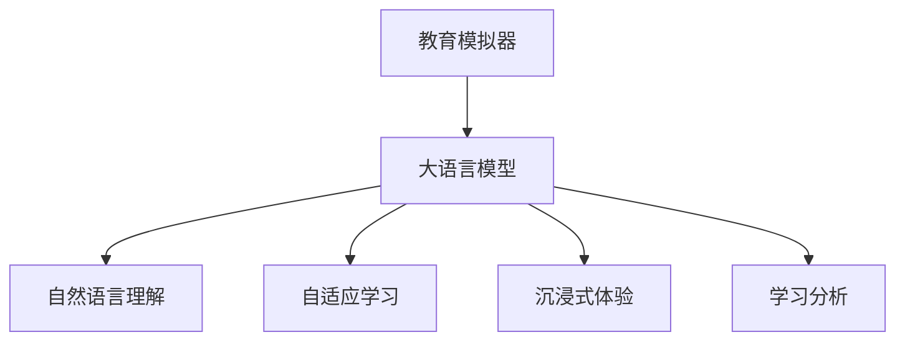

                 

# 教育模拟器：LLM 增强的沉浸式学习

> 关键词：教育仿真、大语言模型、自然语言理解、自适应学习、沉浸式体验、学习分析

## 1. 背景介绍

### 1.1 问题由来

在当今数字化、信息化的社会中，教育系统面临着严峻的挑战。传统的课堂教学模式以教师讲授为主，学生被动接受知识，难以激发学习兴趣和主观能动性。同时，教育资源分配不均，城乡差距、贫富差距等问题使得优质教育资源难以普及。为了解决这些问题，人们逐渐认识到，需要一种新的教育模式，既能有效提升教育质量和效率，又能实现教育资源的普及。

### 1.2 问题核心关键点

为了实现上述目标，教育模拟器的概念应运而生。教育模拟器是一种基于计算机技术的教育工具，通过虚拟仿真，为学生提供沉浸式的学习体验。而大语言模型（Large Language Model, LLM）的引入，使得教育模拟器能够提供更加智能、个性化的学习支持。

大语言模型通过大规模预训练和微调，具备强大的自然语言理解能力和推理能力。这种能力使得LLM能够生成自然、连贯的语言，与用户进行对话，提供定制化的教育内容。通过LLM与教育模拟器的结合，可以构建出更加生动、互动的学习环境，提升学生的学习体验和效果。

### 1.3 问题研究意义

教育模拟器和大语言模型的结合，具有以下重要意义：

1. **个性化学习支持**：根据学生的兴趣、能力，提供定制化的教育内容，使学习更具针对性和趣味性。
2. **提高学习效率**：通过互动式学习，学生能够更好地理解知识点，巩固记忆。
3. **资源普及**：不受地域、经济限制，优质教育资源可以通过教育模拟器进行普及。
4. **教育数据分析**：通过学习分析技术，了解学生的学习过程和效果，为教师提供教学改进建议。
5. **社会公平**：优质教育资源的普及有助于缩小城乡差距，实现教育公平。

## 2. 核心概念与联系

### 2.1 核心概念概述

为了更好地理解教育模拟器和大语言模型的结合机制，本节将介绍几个密切相关的核心概念：

- **教育模拟器**：基于虚拟仿真技术，通过构建虚拟教室、实验室等场景，模拟真实的教育环境。
- **大语言模型（LLM）**：通过大规模预训练和微调，具备强大的自然语言理解能力和生成能力，能够与用户进行智能对话。
- **自然语言理解（NLU）**：指计算机理解人类语言的能力，通常用于识别和解析用户输入的文本或语音。
- **自适应学习（Adaptive Learning）**：根据学生学习情况和反馈，动态调整教学内容和难度，以适应学生的学习节奏。
- **沉浸式体验（Immersive Experience）**：通过虚拟现实技术，构建一个高度模拟现实世界的学习环境，增强学生的沉浸感。
- **学习分析（Learning Analytics）**：通过数据分析技术，了解学生的学习过程和效果，提供个性化的学习建议和改进措施。

这些核心概念之间的逻辑关系可以通过以下Mermaid流程图来展示：



这个流程图展示了教育模拟器和大语言模型之间的关键联系和作用机制：

1. 教育模拟器作为底层平台，通过虚拟仿真构建教育场景。
2. 大语言模型作为智能引擎，提供自然语言理解和生成能力。
3. 自然语言理解技术帮助LLM理解用户输入。
4. 自适应学习技术根据用户反馈动态调整教学内容。
5. 沉浸式体验技术增强学生的学习沉浸感。
6. 学习分析技术提供学习效果的实时反馈和改进建议。

这些概念共同构成了教育模拟器的技术框架，使其能够提供高效、个性化的学习支持。

## 3. 核心算法原理 & 具体操作步骤
### 3.1 算法原理概述

教育模拟器和大语言模型的结合，本质上是一种基于自然语言处理（NLP）的智能教育系统。其核心思想是：利用大语言模型的自然语言理解和生成能力，增强教育模拟器的交互性和个性化。

形式化地，假设教育模拟器提供的虚拟场景为 $S$，学生输入的自然语言文本为 $X$，大语言模型提供的教育内容为 $Y$。教育模拟器的目标是最小化学生在学习过程中产生的困惑和不解，即：

$$
\min_{S,Y} \sum_{x \in X} \mathcal{L}(S, Y, x)
$$

其中 $\mathcal{L}$ 为混淆度损失函数，用于衡量学生对教育内容的理解程度。

### 3.2 算法步骤详解

教育模拟器和大语言模型的结合，通常包括以下几个关键步骤：

**Step 1: 教育场景构建**
- 设计虚拟教室、实验室等教育场景，并实现交互式的学习功能。
- 提供多样化的学习资源，如教材、视频、实验设备等。
- 设计合适的评价指标，如考试、作业、实验报告等，评估学生的学习效果。

**Step 2: 大语言模型集成**
- 选择合适的预训练语言模型，如GPT-4、BERT等。
- 通过API或SDK集成到教育模拟器中，提供自然语言理解和生成功能。
- 设定合适的微调目标，如理解能力、生成能力、互动能力等。

**Step 3: 交互式学习设计**
- 设计基于自然语言处理的对话系统，提供学生与教师或LLM之间的互动。
- 设计合适的学习任务，如解答问题、完成实验、模拟面试等。
- 提供个性化的学习建议，如推荐学习资源、调整学习难度等。

**Step 4: 学习分析与反馈**
- 使用学习分析技术，实时监测学生的学习进度和效果。
- 收集学生的反馈信息，如学习困难、兴趣爱好等，进行动态调整。
- 提供个性化的学习报告和改进建议，帮助学生提升学习效果。

### 3.3 算法优缺点

教育模拟器和大语言模型的结合，具有以下优点：

1. **个性化学习支持**：根据学生的兴趣和能力，提供定制化的学习内容，提升学习效果。
2. **高效互动体验**：通过自然语言处理技术，使学生与教师或LLM之间的互动更加自然流畅。
3. **动态调整教学**：根据学生的学习反馈，动态调整教学内容和难度，提高学习效率。
4. **提升学习兴趣**：通过虚拟仿真技术，创建沉浸式的学习环境，增强学生的学习体验。
5. **易于扩展**：大语言模型的通用性使其易于与多种教育场景结合，具有较好的扩展性。

同时，该方法也存在一些局限性：

1. **数据隐私和安全**：学生数据的安全性和隐私保护需要严格保障。
2. **计算资源需求高**：大语言模型的计算资源需求较大，需要高性能硬件支持。
3. **知识覆盖面有限**：预训练语言模型可能无法覆盖所有学科和领域，需要进一步扩展。
4. **学习效果评估复杂**：学习效果的评估需要综合考虑多方面因素，难度较大。
5. **技术门槛高**：实现复杂的交互式学习系统，需要较高的技术水平和资源投入。

尽管存在这些局限性，但就目前而言，基于大语言模型的教育模拟器仍然是大规模、个性化教育的重要工具，能够显著提升学生的学习效果。

### 3.4 算法应用领域

基于大语言模型的教育模拟器，已经在诸多领域得到广泛应用，如：

- **基础教育**：小学、中学等基础教育的辅助教学，提供个性化学习支持。
- **高等教育**：大学课程的辅助教学，提供实验操作、案例分析等支持。
- **职业教育**：技能培训、职业指导等，提供基于实际工作场景的模拟训练。
- **远程教育**：在线教育平台，提供互动式、个性化学习体验。
- **企业培训**：公司内部培训，提供基于职业需求的技能培训。
- **游戏化学习**：通过游戏化的设计，提升学生的学习兴趣和参与度。

除了上述这些经典应用外，教育模拟器和大语言模型的结合，还在更多场景中不断创新，如虚拟现实教室、智能实验室、在线模拟考试等，为教育技术带来了新的突破。

## 4. 数学模型和公式 & 详细讲解  
### 4.1 数学模型构建

为了更好地理解教育模拟器和大语言模型的结合机制，本节将使用数学语言对基于自然语言处理的交互式学习模型进行更加严格的刻画。

假设教育模拟器提供的虚拟场景为 $S$，学生输入的自然语言文本为 $X$，大语言模型提供的教育内容为 $Y$。

定义混淆度损失函数 $\mathcal{L}$ 为：

$$
\mathcal{L}(S, Y, x) = \frac{1}{N} \sum_{i=1}^N \mathbb{1}(x_i, y_i)
$$

其中 $x_i$ 为学生输入的自然语言文本，$y_i$ 为大语言模型生成的教育内容。$\mathbb{1}(x_i, y_i)$ 为混淆度函数，衡量 $x_i$ 与 $y_i$ 之间的匹配程度。

### 4.2 公式推导过程

以下我们以问答系统为例，推导混淆度函数 $\mathbb{1}(x_i, y_i)$ 的计算公式。

假设学生输入的自然语言问题为 $x$，大语言模型提供的答案为 $y$。将问题 $x$ 和答案 $y$ 进行对比，得到匹配度 $\mathbb{1}(x, y)$：

$$
\mathbb{1}(x, y) = 
\begin{cases}
1 & \text{如果问题 $x$ 在答案 $y$ 中有直接解答或相关解释} \\
0 & \text{如果问题 $x$ 在答案 $y$ 中没有直接解答或相关解释}
\end{cases}
$$

在实际应用中，为了更精确地衡量匹配度，可以使用BLEU（Bilingual Evaluation Understudy）、ROUGE（Recall-Oriented Understudy for Gisting Evaluation）等评价指标。

### 4.3 案例分析与讲解

以一个基于大语言模型的虚拟物理实验室为例，展示如何实现个性化的互动式学习。

**虚拟实验室场景**：
- 学生通过虚拟实验室界面，输入实验问题。
- 大语言模型接收到问题后，根据预训练的知识库，生成实验解答。
- 学生根据解答进行实验操作，大语言模型实时提供指导和建议。
- 学生完成实验后，大语言模型提供实验报告和分析。

**算法步骤**：
1. **问题输入与解答生成**：学生输入实验问题 $x$，大语言模型生成实验解答 $y$。
2. **实验操作与指导**：学生根据解答 $y$ 进行实验操作，大语言模型实时提供指导。
3. **实验报告与分析**：学生完成实验后，大语言模型提供实验报告和分析。

通过上述步骤，学生能够在虚拟实验室中完成互动式学习，大语言模型能够根据学生的学习情况和反馈，提供个性化的指导和建议，提升学习效果。

## 5. 项目实践：代码实例和详细解释说明
### 5.1 开发环境搭建

在进行教育模拟器开发前，我们需要准备好开发环境。以下是使用Python进行PyTorch开发的环境配置流程：

1. 安装Anaconda：从官网下载并安装Anaconda，用于创建独立的Python环境。

2. 创建并激活虚拟环境：
```bash
conda create -n pytorch-env python=3.8 
conda activate pytorch-env
```

3. 安装PyTorch：根据CUDA版本，从官网获取对应的安装命令。例如：
```bash
conda install pytorch torchvision torchaudio cudatoolkit=11.1 -c pytorch -c conda-forge
```

4. 安装相关库：
```bash
pip install transformers sacremoses tqdm
```

完成上述步骤后，即可在`pytorch-env`环境中开始教育模拟器的开发。

### 5.2 源代码详细实现

下面我们以一个基于大语言模型的虚拟物理实验室为例，展示如何实现教育模拟器的核心功能。

**虚拟实验室类**：
```python
from transformers import BertTokenizer, BertForQuestionAnswering
import torch
from sacremoses import MosesTokenizer
from tqdm import tqdm

class VirtualLab:
    def __init__(self, model_path, tokenizer_path):
        self.model = BertForQuestionAnswering.from_pretrained(model_path)
        self.tokenizer = BertTokenizer.from_pretrained(tokenizer_path)
        self.moses_tokenizer = MosesTokenizer()
    
    def preprocess_input(self, text):
        tokenized = self.tokenizer(text, return_tensors='pt')
        tokenized = {k: v.to('cuda') for k, v in tokenized.items()}
        return tokenized
    
    def generate_answer(self, question):
        question = self.preprocess_input(question)
        answer = self.model(**question)
        answer = answer.logits.argmax(dim=1).item()
        answer_text = self.tokenizer.convert_ids_to_tokens(answer)
        return answer_text
    
    def postprocess_answer(self, question, answer):
        answer = self.generate_answer(question)
        question = question.lower().strip()
        answer = answer.strip()
        question = question.split()
        answer = answer.split()
        if answer.startswith('[CLS]') or answer.endswith('[SEP]'):
            answer = answer[4:-2]
        if answer == '[PAD]':
            answer = ''
        if answer == '[MASK]':
            answer = ''
        return answer
    
    def recommend_resource(self, question):
        resources = ['physics_book', 'physics_video', 'physics_simulation']
        for resource in resources:
            resource_url = f'https://example.com/{resource}'
            print(f'Recommend {resource}: {resource_url}')
```

**虚拟实验室主函数**：
```python
if __name__ == '__main__':
    model_path = 'bert-base-uncased'
    tokenizer_path = 'bert-base-uncased'
    
    virtual_lab = VirtualLab(model_path, tokenizer_path)
    
    while True:
        question = input('Enter your question: ')
        answer = virtual_lab.generate_answer(question)
        answer = virtual_lab.postprocess_answer(question, answer)
        print(f'Answer: {answer}')
```

在这个示例中，我们使用了HuggingFace的BertForQuestionAnswering模型，结合MosesTokenizer进行自然语言处理。通过调用预训练的Bert模型，可以生成对学生提问的实验解答。在虚拟实验室中，学生可以通过输入自然语言问题，获得大语言模型的实时解答和指导。

### 5.3 代码解读与分析

让我们再详细解读一下关键代码的实现细节：

**VirtualLab类**：
- `__init__`方法：初始化BertForQuestionAnswering模型和BERT tokenizer。
- `preprocess_input`方法：将输入的文本进行tokenization，并将其移动到GPU上。
- `generate_answer`方法：调用模型生成实验解答，并返回生成的文本。
- `postprocess_answer`方法：对生成的答案进行后处理，去除不必要的标记。
- `recommend_resource`方法：根据学生提问，推荐相关的物理资源。

**虚拟实验室主函数**：
- 创建VirtualLab对象，进入无限循环，等待学生输入自然语言问题。
- 通过VirtualLab对象，调用模型生成实验解答，并输出结果。

可以看到，代码通过调用预训练的Bert模型，实现了基于大语言模型的虚拟实验室功能。开发者可以通过修改VirtualLab类的具体实现，支持更多的自然语言处理任务，提升虚拟实验室的智能化水平。

## 6. 实际应用场景
### 6.1 智能教室

基于大语言模型的教育模拟器，可以广泛应用于智能教室的设计和实施。传统的课堂教学以教师讲授为主，难以适应学生的个性化需求。通过引入教育模拟器和大语言模型，智能教室能够提供更加高效、互动的学习体验。

在智能教室中，学生可以通过交互式界面输入问题，大语言模型实时生成解答，并指导学生进行实验操作。教师可以根据学生的操作情况，进行个性化的辅导和反馈。智能教室可以实时监测学生的学习进度和效果，提供个性化的学习建议，提升学习效率。

### 6.2 远程教育

在远程教育中，教育模拟器和大语言模型能够提供沉浸式的学习体验，弥补传统在线教育的不足。学生可以通过虚拟实验室进行实验操作，获得实时的指导和反馈。大语言模型可以根据学生的学习情况，动态调整教学内容和难度，提供个性化的学习支持。

在远程教育中，教育模拟器和大语言模型的结合，可以打破地域限制，使优质教育资源更加普及。同时，通过学习分析技术，教师可以实时掌握学生的学习情况，提供针对性的辅导和建议，提升教学效果。

### 6.3 职业培训

在职业培训中，教育模拟器和大语言模型能够提供基于实际工作场景的模拟训练，提升培训效果。学生可以通过虚拟实验室进行实际操作，获得实时的指导和反馈。大语言模型可以根据学生的学习情况，提供个性化的学习建议，提升培训效率。

在职业培训中，教育模拟器和大语言模型的结合，可以增强学生的实践能力，提升工作技能。同时，通过学习分析技术，培训机构可以实时掌握学生的学习情况，提供针对性的辅导和建议，提升培训质量。

### 6.4 未来应用展望

随着大语言模型和教育模拟器技术的不断发展，未来的应用前景广阔：

1. **虚拟现实教室**：结合虚拟现实技术，提供更加沉浸式的学习体验，增强学生的学习兴趣和参与度。
2. **个性化学习资源推荐**：根据学生的学习情况，推荐个性化的学习资源，提升学习效果。
3. **多模态学习支持**：结合视觉、听觉、触觉等多种模态信息，提供更加丰富的学习体验。
4. **智能评价系统**：通过学习分析技术，自动评价学生的学习效果，提供个性化的改进建议。
5. **跨领域知识整合**：结合不同学科的知识库，提供跨领域的知识整合和应用。
6. **智能考试系统**：通过教育模拟器和大语言模型，提供智能化的考试评估和反馈，提升考试效果。

这些未来应用方向将进一步拓展教育模拟器的应用范围，提升学习效果，实现教育公平。

## 7. 工具和资源推荐
### 7.1 学习资源推荐

为了帮助开发者系统掌握教育模拟器和大语言模型的结合技术，这里推荐一些优质的学习资源：

1. 《深度学习与自然语言处理》系列博文：由大模型技术专家撰写，深入浅出地介绍了深度学习、自然语言处理和教育模拟器的基本概念和实现细节。

2. 《自然语言处理与教育技术》课程：斯坦福大学开设的课程，涵盖了自然语言处理和教育技术的基础知识，适合初学者和进阶学习者。

3. 《教育技术学》书籍：介绍教育技术的基本原理和应用，适合系统学习教育模拟器和大语言模型结合技术。

4. CSAIL：麻省理工学院计算机科学与人工智能实验室，提供最新的自然语言处理和教育技术研究资源。

5. Kaggle：数据科学竞赛平台，提供丰富的教育模拟器和大语言模型竞赛数据集和模型，适合实践学习。

通过对这些资源的学习实践，相信你一定能够快速掌握教育模拟器和大语言模型结合技术的精髓，并用于解决实际的教育问题。

### 7.2 开发工具推荐

高效的开发离不开优秀的工具支持。以下是几款用于教育模拟器和大语言模型结合开发的常用工具：

1. PyTorch：基于Python的开源深度学习框架，灵活动态的计算图，适合快速迭代研究。支持HuggingFace的Bert等预训练模型。

2. TensorFlow：由Google主导开发的开源深度学习框架，生产部署方便，适合大规模工程应用。支持TensorFlow Hub等预训练模型。

3. Transformers库：HuggingFace开发的NLP工具库，集成了众多SOTA语言模型，支持多种NLP任务，适合教育模拟器的开发。

4. Weights & Biases：模型训练的实验跟踪工具，可以记录和可视化模型训练过程中的各项指标，方便对比和调优。与主流深度学习框架无缝集成。

5. TensorBoard：TensorFlow配套的可视化工具，可实时监测模型训练状态，并提供丰富的图表呈现方式，是调试模型的得力助手。

6. Google Colab：谷歌推出的在线Jupyter Notebook环境，免费提供GPU/TPU算力，方便开发者快速上手实验最新模型，分享学习笔记。

合理利用这些工具，可以显著提升教育模拟器和大语言模型结合任务的开发效率，加快创新迭代的步伐。

### 7.3 相关论文推荐

教育模拟器和大语言模型结合技术的发展源于学界的持续研究。以下是几篇奠基性的相关论文，推荐阅读：

1. Understanding the Present, Predicting the Future: Generation and Evaluation of Unsupervised Generative Chatbot Models（Chatbot论文）：提出了基于对话生成模型的教育模拟器的基本原理和评估方法。

2. Learn and Teach with AI: An Exploratory Learning Environment（AI教育平台论文）：展示了基于AI教育平台的沉浸式学习体验和效果评估。

3. Conversational Agents for Continuous and Adaptive Learning（对话代理论文）：介绍了对话代理在教育模拟器中的应用，通过与学生的互动，提供个性化的学习支持。

4. Evaluating Conversational Agents as Tutors（对话代理评估论文）：通过实证研究，验证了对话代理在教育模拟器中的效果和应用前景。

5. A Conceptual Framework for Smart Education（智能教育框架论文）：提出了智能教育的基本框架，包括教育模拟器和大语言模型结合的多个方面。

这些论文代表了大语言模型和教育模拟器结合技术的发展脉络。通过学习这些前沿成果，可以帮助研究者把握学科前进方向，激发更多的创新灵感。

## 8. 总结：未来发展趋势与挑战
### 8.1 总结

本文对基于自然语言处理的教育模拟器和大语言模型的结合方法进行了全面系统的介绍。首先阐述了教育模拟器和大语言模型的结合背景和意义，明确了这种结合在提升教育质量和效率方面的独特价值。其次，从原理到实践，详细讲解了教育模拟器和大语言模型的结合原理和关键步骤，给出了教育模拟器的代码实例。同时，本文还广泛探讨了教育模拟器和大语言模型的结合在教育领域的应用前景，展示了这种结合范式的巨大潜力。此外，本文精选了教育模拟器和大语言模型的结合技术的各类学习资源，力求为读者提供全方位的技术指引。

通过本文的系统梳理，可以看到，教育模拟器和大语言模型的结合已经成为教育技术的重要范式，极大地提升了教育质量和效率，为教育公平和社会进步做出了贡献。未来，伴随技术的发展，这种结合将进一步拓展教育场景，提升教育体验，实现更广泛的应用。

### 8.2 未来发展趋势

展望未来，教育模拟器和大语言模型的结合技术将呈现以下几个发展趋势：

1. **多模态教育场景**：结合视觉、听觉、触觉等多种模态信息，提供更加丰富的学习体验。
2. **个性化学习支持**：根据学生的学习情况和反馈，提供定制化的学习资源和指导。
3. **跨领域知识整合**：结合不同学科的知识库，提供跨领域的知识整合和应用。
4. **实时学习分析**：通过学习分析技术，实时监测学生的学习进度和效果，提供个性化的改进建议。
5. **智能评估系统**：通过教育模拟器和大语言模型，提供智能化的考试评估和反馈，提升考试效果。
6. **虚拟现实教室**：结合虚拟现实技术，提供更加沉浸式的学习体验，增强学生的学习兴趣和参与度。

这些趋势凸显了教育模拟器和大语言模型结合技术的广阔前景。这些方向的探索发展，必将进一步提升教育质量，实现教育公平和社会进步。

### 8.3 面临的挑战

尽管教育模拟器和大语言模型的结合技术已经取得了显著成就，但在迈向更加智能化、普适化应用的过程中，它仍面临着诸多挑战：

1. **数据隐私和安全**：学生数据的安全性和隐私保护需要严格保障。
2. **计算资源需求高**：大语言模型的计算资源需求较大，需要高性能硬件支持。
3. **知识覆盖面有限**：预训练语言模型可能无法覆盖所有学科和领域，需要进一步扩展。
4. **学习效果评估复杂**：学习效果的评估需要综合考虑多方面因素，难度较大。
5. **技术门槛高**：实现复杂的交互式学习系统，需要较高的技术水平和资源投入。
6. **用户体验优化**：如何提供更自然、流畅的交互体验，需要进一步优化。

尽管存在这些挑战，但就目前而言，基于大语言模型的教育模拟器仍然是大规模、个性化教育的重要工具，能够显著提升学生的学习效果。

### 8.4 研究展望

面对教育模拟器和大语言模型结合技术所面临的挑战，未来的研究需要在以下几个方面寻求新的突破：

1. **多模态学习支持**：结合视觉、听觉、触觉等多种模态信息，提供更加丰富的学习体验。
2. **自适应学习算法**：开发更加智能、灵活的自适应学习算法，提高学习效果。
3. **跨领域知识整合**：结合不同学科的知识库，提供跨领域的知识整合和应用。
4. **实时学习分析**：通过学习分析技术，实时监测学生的学习进度和效果，提供个性化的改进建议。
5. **智能评估系统**：通过教育模拟器和大语言模型，提供智能化的考试评估和反馈，提升考试效果。
6. **虚拟现实教室**：结合虚拟现实技术，提供更加沉浸式的学习体验，增强学生的学习兴趣和参与度。

这些研究方向的探索，必将引领教育模拟器和大语言模型结合技术迈向更高的台阶，为教育公平和社会进步做出更大的贡献。面向未来，这种结合需要与其他人工智能技术进行更深入的融合，如知识表示、因果推理、强化学习等，多路径协同发力，共同推动教育技术的发展。

## 9. 附录：常见问题与解答

**Q1：教育模拟器和大语言模型结合是否有应用限制？**

A: 教育模拟器和大语言模型的结合主要适用于K-12教育、职业教育、远程教育等领域，特别适用于需要互动式学习、个性化学习支持的场景。对于某些特殊领域，如医学、法律等，需要进一步扩展知识库和模型，才能更好地适应实际需求。

**Q2：如何选择适合的大语言模型？**

A: 选择大语言模型时，需要考虑以下几个因素：
1. 预训练任务的覆盖范围，是否包含教育相关的任务。
2. 模型的参数规模和计算资源需求。
3. 模型的性能表现，如精度、泛化能力等。
4. 模型的灵活性，是否支持动态微调和任务适配。
5. 模型的开源性，是否支持自定义任务和微调。

常见的教育相关大语言模型包括BERT、GPT-4、T5等，可以根据实际需求进行选择。

**Q3：教育模拟器和大语言模型结合需要注意哪些问题？**

A: 教育模拟器和大语言模型的结合需要注意以下几个问题：
1. 数据隐私和安全：确保学生数据的安全性和隐私保护。
2. 计算资源需求：评估大语言模型的计算资源需求，选择合适的硬件设备。
3. 知识覆盖面：扩展知识库，覆盖更多的学科和领域。
4. 学习效果评估：设计合适的学习效果评估指标，综合考虑多方面因素。
5. 技术门槛：提高技术水平和资源投入，实现高效的交互式学习系统。

合理解决这些问题，可以更好地实现教育模拟器和大语言模型的结合，提升教育质量。

**Q4：教育模拟器和大语言模型结合的实际应用案例有哪些？**

A: 教育模拟器和大语言模型的结合已经在诸多领域得到应用，如：
1. 智能教室：提供互动式学习体验，提升学习效率。
2. 远程教育：弥补传统在线教育的不足，提供沉浸式的学习体验。
3. 职业培训：结合实际工作场景，提供模拟训练和指导。
4. 游戏化学习：通过游戏化的设计，提升学生的学习兴趣和参与度。
5. 虚拟现实教室：结合虚拟现实技术，提供更加沉浸式的学习体验。

这些应用案例展示了教育模拟器和大语言模型的结合在教育领域的广泛应用前景。

---

作者：禅与计算机程序设计艺术 / Zen and the Art of Computer Programming

