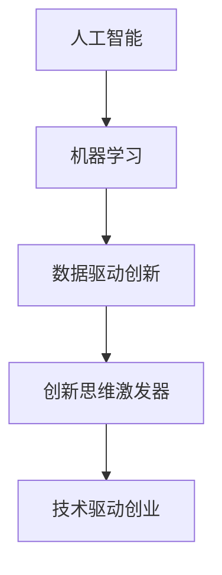

                 

# 数字创造力催化剂：AI驱动的创新思维激发器

> 关键词：人工智能,机器学习,数据驱动创新,创新思维激发,技术驱动创业,数据挖掘,大数据分析

## 1. 背景介绍

### 1.1 问题由来

在快速发展的数字化时代，人工智能（AI）技术的崛起成为推动创新和增长的关键驱动力。AI驱动的机器学习和数据挖掘技术不仅在科技行业引发了革命性的变化，也在其他领域引发了深刻的变革。尤其是在创业和创新领域，AI正成为“数字创造力催化剂”，帮助创业者和创新者解锁新的思维模式和商业机会。

人工智能技术，特别是深度学习和大数据分析，能够处理和分析海量数据，识别出隐藏的模式和趋势，从而为创新思维提供数据支持。然而，尽管AI技术强大，要真正发挥其在创新思维激发中的作用，还需理解其原理和应用，并探索如何在创业和创新中有效地利用AI。

### 1.2 问题核心关键点

AI驱动的创新思维激发器，旨在通过数据驱动的方式，识别和激发潜在的创新点。其核心关键点包括：

- 数据驱动的创新模式：利用数据挖掘和分析技术，从海量数据中发现新的商业机会和创新点。
- 人工智能辅助决策：通过机器学习模型和算法，辅助创业者进行决策分析，提高决策效率和准确性。
- 动态适应能力：AI系统具备高度的灵活性，能够适应不断变化的市场环境和创新需求。
- 数据安全与隐私：在利用数据进行创新时，必须重视数据隐私和安全问题，保障数据使用的合法性和安全性。

## 2. 核心概念与联系

### 2.1 核心概念概述

为了更好地理解AI如何驱动创新思维，本节将介绍几个关键概念：

- 人工智能（Artificial Intelligence, AI）：一种使计算机模拟人类智能的技术，包括学习、推理、感知、语言理解等能力。
- 机器学习（Machine Learning, ML）：一种使计算机通过数据学习并改进性能的技术，包括监督学习、无监督学习和强化学习等。
- 数据驱动创新（Data-Driven Innovation）：一种通过数据分析和机器学习模型，从数据中发现新趋势和机会的创新方法。
- 创新思维激发器（Innovation Catalyst）：一种利用AI技术，识别并激发创新点，驱动创业和商业创新的系统或工具。
- 技术驱动创业（Technology-Driven Entrepreneurship）：一种以AI和机器学习等先进技术为核心的创业模式。

这些概念之间的逻辑关系可以通过以下Mermaid流程图来展示：



这个流程图展示了一系列概念之间的联系：人工智能技术为机器学习提供了基础，机器学习通过分析数据，支持数据驱动创新，而数据驱动创新又通过创新思维激发器，推动技术驱动创业的发展。

## 3. 核心算法原理 & 具体操作步骤

### 3.1 算法原理概述

AI驱动的创新思维激发器主要基于以下算法原理：

- 监督学习（Supervised Learning）：利用有标注的数据，训练机器学习模型进行分类、预测等任务，从而识别潜在的创新点。
- 无监督学习（Unsupervised Learning）：通过分析无标注的数据，发现数据中的隐藏模式和结构，为创新思维提供新的角度。
- 强化学习（Reinforcement Learning）：通过与环境的交互，训练模型优化决策策略，为创新决策提供支持。

这些算法原理被广泛应用于各种数据驱动创新场景，包括市场分析、趋势预测、产品开发等。

### 3.2 算法步骤详解

AI驱动的创新思维激发器一般包括以下几个关键步骤：

**Step 1: 数据收集与预处理**
- 收集相关领域的数据，如市场趋势、用户行为、竞争情报等。
- 对数据进行清洗和预处理，去除噪音和异常值，确保数据质量。

**Step 2: 特征工程与数据建模**
- 选择合适的特征，构建特征向量。
- 根据任务需求，选择合适的机器学习模型，如线性回归、决策树、神经网络等。
- 使用模型对数据进行训练和验证，选择合适的模型参数。

**Step 3: 结果分析与策略制定**
- 利用训练好的模型对新数据进行预测，识别潜在的商业机会和创新点。
- 分析预测结果，制定具体的创新策略和行动计划。

**Step 4: 实施与监控**
- 根据制定的创新策略，实施具体的创新行动。
- 实时监控创新效果，根据反馈进行调整和优化。

### 3.3 算法优缺点

AI驱动的创新思维激发器具有以下优点：

- 高效性：能够快速处理和分析海量数据，发现潜在的创新机会。
- 客观性：基于数据驱动，减少人为偏见和主观判断。
- 动态适应性：能够根据市场环境的变化，灵活调整策略。

同时，该方法也存在一些局限性：

- 数据质量依赖性高：数据质量直接影响分析结果的准确性。
- 对数据隐私和安全要求高：需要确保数据使用的合法性和安全性。
- 模型复杂性：构建和训练复杂的模型需要较高的技术门槛。
- 数据获取难度大：获取高质量的数据可能面临较大挑战。

尽管存在这些局限性，但AI驱动的创新思维激发器已成为推动创业和创新的重要工具，其高效、客观的特点使其在各个领域得到了广泛应用。

### 3.4 算法应用领域

AI驱动的创新思维激发器在多个领域得到了应用，具体包括：

- **市场分析与趋势预测**：通过分析市场数据，预测市场趋势，识别潜在的商业机会。
- **用户行为分析**：利用用户行为数据，理解用户需求，优化产品和服务。
- **产品开发与创新**：通过分析用户反馈和市场数据，指导产品开发和创新。
- **竞争情报**：分析竞争对手的策略和市场表现，制定竞争策略。
- **创新决策支持**：为创业者提供数据驱动的决策支持，提升决策效率和准确性。

## 4. 数学模型和公式 & 详细讲解 & 举例说明

### 4.1 数学模型构建

本节将使用数学语言对AI驱动的创新思维激发器进行更严格的刻画。

假设我们有一个包含N个样本的训练集，每个样本由输入特征 $x_i$ 和对应的目标变量 $y_i$ 组成。构建一个线性回归模型 $f(x) = \theta^T x$，其中 $\theta$ 为模型参数。

### 4.2 公式推导过程

线性回归模型的目标是最小化均方误差：

$$
\min_{\theta} \frac{1}{N}\sum_{i=1}^N (y_i - f(x_i))^2
$$

使用梯度下降算法求解最优参数 $\theta$：

$$
\theta \leftarrow \theta - \eta \frac{1}{N}\sum_{i=1}^N (y_i - f(x_i))x_i
$$

其中 $\eta$ 为学习率，控制参数更新的步长。

### 4.3 案例分析与讲解

以一个简单的市场分析为例，假设我们收集了某电商平台的销售数据，目标是预测未来销量。

1. **数据收集与预处理**：
   - 收集平台销售数据，包括时间、产品类别、价格、销量等。
   - 清洗数据，去除异常值和噪音，确保数据质量。

2. **特征工程与数据建模**：
   - 选择时间、价格、类别等特征，构建特征向量。
   - 使用线性回归模型对数据进行训练，选择最优的模型参数。

3. **结果分析与策略制定**：
   - 利用训练好的模型对未来销量进行预测。
   - 分析预测结果，制定具体的营销策略。

## 5. 项目实践：代码实例和详细解释说明

### 5.1 开发环境搭建

在进行项目实践前，我们需要准备好开发环境。以下是使用Python进行TensorFlow开发的环境配置流程：

1. 安装Anaconda：从官网下载并安装Anaconda，用于创建独立的Python环境。

2. 创建并激活虚拟环境：
```bash
conda create -n tf-env python=3.7 
conda activate tf-env
```

3. 安装TensorFlow：根据CUDA版本，从官网获取对应的安装命令。例如：
```bash
conda install tensorflow -c pytorch -c conda-forge
```

4. 安装各类工具包：
```bash
pip install numpy pandas scikit-learn matplotlib tqdm jupyter notebook ipython
```

完成上述步骤后，即可在`tf-env`环境中开始项目实践。

### 5.2 源代码详细实现

这里我们以用户行为分析为例，给出使用TensorFlow对线性回归模型进行市场分析的PyTorch代码实现。

首先，定义市场分析任务的数据处理函数：

```python
import tensorflow as tf
from sklearn.model_selection import train_test_split
from sklearn.preprocessing import StandardScaler
from sklearn.metrics import mean_squared_error
import pandas as pd
import numpy as np

def load_data(file_path):
    data = pd.read_csv(file_path)
    features = data[['price', 'time', 'category']]
    target = data['sales']
    return features, target

def preprocess_data(features, target):
    features = features.values
    target = target.values
    features = StandardScaler().fit_transform(features)
    features_train, features_test, target_train, target_test = train_test_split(features, target, test_size=0.2, random_state=42)
    return features_train, features_test, target_train, target_test

def train_model(features_train, target_train, features_test, target_test):
    model = tf.keras.Sequential([
        tf.keras.layers.Dense(32, activation='relu', input_shape=(features_train.shape[1],)),
        tf.keras.layers.Dense(1)
    ])
    optimizer = tf.keras.optimizers.Adam(learning_rate=0.001)
    model.compile(optimizer=optimizer, loss='mse', metrics=['mse'])
    model.fit(features_train, target_train, epochs=100, batch_size=32, validation_data=(features_test, target_test))
    return model

def evaluate_model(model, features_test, target_test):
    mse = mean_squared_error(target_test, model.predict(features_test))
    print('Mean Squared Error:', mse)
```

然后，定义市场分析任务的训练和评估函数：

```python
def train_and_evaluate(file_path):
    features, target = load_data(file_path)
    features_train, features_test, target_train, target_test = preprocess_data(features, target)
    model = train_model(features_train, target_train, features_test, target_test)
    evaluate_model(model, features_test, target_test)
```

最后，启动市场分析流程：

```python
train_and_evaluate('sales_data.csv')
```

以上就是使用TensorFlow进行线性回归模型市场分析的完整代码实现。可以看到，得益于TensorFlow的强大封装，我们可以用相对简洁的代码完成线性回归模型的构建和评估。

### 5.3 代码解读与分析

让我们再详细解读一下关键代码的实现细节：

**load_data函数**：
- 定义数据读取和预处理函数，从CSV文件中读取数据，并分割特征和目标变量。

**preprocess_data函数**：
- 对特征和目标变量进行标准化处理，并将数据划分为训练集和测试集。

**train_model函数**：
- 定义线性回归模型的结构，使用Adam优化器和均方误差损失函数进行训练。
- 在训练过程中使用验证集进行评估，防止过拟合。

**evaluate_model函数**：
- 使用均方误差指标评估模型在测试集上的性能。

**train_and_evaluate函数**：
- 将上述函数整合在一起，依次执行数据加载、预处理、模型训练和评估。

可以看到，TensorFlow库使得模型构建和评估的代码实现变得简洁高效。开发者可以将更多精力放在数据处理、模型改进等高层逻辑上，而不必过多关注底层的实现细节。

当然，工业级的系统实现还需考虑更多因素，如模型的保存和部署、超参数的自动搜索、更灵活的任务适配层等。但核心的市场分析流程基本与此类似。

## 6. 实际应用场景

### 6.1 电商市场分析

基于AI驱动的创新思维激发器，电商企业可以进行深入的市场分析和趋势预测，从而制定更加精准的营销策略。

具体而言，可以通过收集电商平台的销售数据，构建线性回归模型，预测未来销量。结合市场趋势分析，制定具体的库存管理和促销策略。同时，利用用户行为分析，优化产品推荐和个性化营销，提升用户体验和转化率。

### 6.2 金融市场分析

金融企业可以利用AI驱动的创新思维激发器，进行市场分析和风险管理。

例如，通过分析历史交易数据，构建时间序列预测模型，预测股票价格变化。利用情感分析技术，分析市场情绪和舆情变化，制定投资策略。同时，利用机器学习模型，进行信用风险评估和欺诈检测，保障金融安全。

### 6.3 健康医疗数据分析

在健康医疗领域，AI驱动的创新思维激发器可以帮助医疗机构进行疾病预测和个性化治疗。

具体而言，可以收集患者的病历数据和基因数据，构建预测模型，预测患病风险和疾病发展趋势。结合临床试验数据，优化治疗方案，实现个性化医疗。同时，利用AI技术进行图像分析，提高疾病诊断的准确性和效率。

### 6.4 未来应用展望

随着AI技术的不断进步，基于AI驱动的创新思维激发器将在更多领域得到应用，为各行各业带来变革性影响。

在智慧城市治理中，AI技术可以帮助城市管理者进行智能交通、环境保护、公共安全等方面的决策分析，提高城市管理的自动化和智能化水平。

在教育领域，AI技术可以用于个性化教学、智能评估、学习路径推荐等方面，提高教育质量和效率。

在农业领域，AI技术可以用于精准农业、灾害预测、作物管理等方面，提高农业生产的科学性和可持续性。

总之，AI驱动的创新思维激发器将加速各行各业的数字化转型，推动人工智能技术在更多场景中的应用。

## 7. 工具和资源推荐

### 7.1 学习资源推荐

为了帮助开发者系统掌握AI驱动的创新思维激发器的理论基础和实践技巧，这里推荐一些优质的学习资源：

1. 《深度学习》系列书籍：由斯坦福大学教授Yoshua Bengio、Ian Goodfellow、Aaron Courville撰写，系统介绍了深度学习的基础知识和前沿技术。
2. 《机器学习实战》：实战性强的入门书籍，涵盖机器学习算法和实际应用的各个方面。
3. Kaggle在线平台：提供丰富的机器学习竞赛和数据集，帮助学习者实践机器学习技能。
4. Coursera《机器学习》课程：由斯坦福大学教授Andrew Ng开设的在线课程，讲解机器学习的基本原理和应用。
5. TensorFlow官方文档：提供全面、详细的TensorFlow使用指南，帮助开发者快速上手。

通过对这些资源的学习实践，相信你一定能够快速掌握AI驱动的创新思维激发器的精髓，并用于解决实际的商业问题。

### 7.2 开发工具推荐

高效的开发离不开优秀的工具支持。以下是几款用于AI驱动的创新思维激发器开发的常用工具：

1. TensorFlow：由Google主导开发的开源深度学习框架，生产部署方便，适合大规模工程应用。
2. PyTorch：基于Python的开源深度学习框架，灵活动态的计算图，适合快速迭代研究。
3. Weights & Biases：模型训练的实验跟踪工具，可以记录和可视化模型训练过程中的各项指标，方便对比和调优。
4. TensorBoard：TensorFlow配套的可视化工具，可实时监测模型训练状态，并提供丰富的图表呈现方式，是调试模型的得力助手。
5. Keras：高层次的深度学习框架，提供简单易用的API，适合初学者快速上手。

合理利用这些工具，可以显著提升AI驱动的创新思维激发器开发的效率，加快创新迭代的步伐。

### 7.3 相关论文推荐

AI驱动的创新思维激发器的发展源于学界的持续研究。以下是几篇奠基性的相关论文，推荐阅读：

1. Deep Learning（深度学习）：Yoshua Bengio等著，系统介绍了深度学习的基本原理和应用。
2. Pattern Recognition and Machine Learning（模式识别与机器学习）：Christopher M. Bishop著，深入讲解了机器学习的基本理论和技术。
3. Reinforcement Learning: An Introduction（强化学习入门）：Richard S. Sutton和Andrew G. Barto著，介绍了强化学习的基本概念和算法。
4. Neural Network and Deep Learning（神经网络和深度学习）：Michael Nielsen著，详细介绍了神经网络的基本原理和深度学习技术。
5. Machine Learning Yearning（机器学习实践指南）：Andrew Ng著，提供机器学习实践中的实用建议和经验分享。

这些论文代表了大规模数据驱动创新思维激发器的理论基础和发展脉络。通过学习这些前沿成果，可以帮助研究者把握学科前进方向，激发更多的创新灵感。

## 8. 总结：未来发展趋势与挑战

### 8.1 总结

本文对AI驱动的创新思维激发器的基本原理和应用进行了全面系统的介绍。首先阐述了AI驱动的创新思维激发器在创业和创新中的重要作用，明确了其在数据驱动创新中的核心地位。其次，从原理到实践，详细讲解了AI驱动的创新思维激发器的数学模型和关键步骤，给出了项目开发的完整代码实例。同时，本文还广泛探讨了AI驱动的创新思维激发器在多个领域的应用前景，展示了其广泛的适用性和潜力。

通过本文的系统梳理，可以看到，AI驱动的创新思维激发器已经成为推动创业和创新的重要工具，其高效、客观的特点使其在各个领域得到了广泛应用。未来，伴随AI技术的不断进步，AI驱动的创新思维激发器必将引领创新思维的变革，推动人工智能技术在更多领域的落地应用。

### 8.2 未来发展趋势

展望未来，AI驱动的创新思维激发器将呈现以下几个发展趋势：

1. 智能化水平提升：随着深度学习和大数据分析技术的不断进步，AI驱动的创新思维激发器将具备更高的智能化水平，能够进行更复杂的分析和预测。
2. 跨领域应用拓展：AI驱动的创新思维激发器将在更多领域得到应用，如医疗、金融、农业、城市治理等，为各行各业带来新的创新机会。
3. 数据驱动的模型优化：利用大数据和机器学习技术，优化AI驱动的创新思维激发器的模型结构和参数设置，提升模型精度和效率。
4. 动态适应能力增强：AI驱动的创新思维激发器将具备更高的动态适应能力，能够根据市场环境和用户需求的变化，实时调整策略和模型。
5. 模型透明性和可解释性提升：提高模型的透明性和可解释性，使创业者能够更好地理解模型的工作机制和决策依据。

这些趋势凸显了AI驱动的创新思维激发器的广泛应用前景和深远影响。这些方向的探索发展，必将进一步提升AI驱动的创新思维激发器的应用范围和效果，推动人工智能技术在更多场景中的应用。

### 8.3 面临的挑战

尽管AI驱动的创新思维激发器已经取得了瞩目成就，但在迈向更加智能化、普适化应用的过程中，它仍面临诸多挑战：

1. 数据质量和获取：高质量数据是AI驱动的创新思维激发器成功的关键，但获取高质量数据可能面临较大的成本和难度。
2. 模型复杂性和可解释性：构建和训练复杂的AI模型需要较高的技术门槛，同时模型的透明性和可解释性仍然有待提升。
3. 算法和计算资源的消耗：随着模型的复杂性和数据量的增加，计算资源的需求也在不断增加，如何高效利用计算资源是关键问题。
4. 数据隐私和安全：在使用数据进行创新时，必须重视数据隐私和安全问题，确保数据使用的合法性和安全性。
5. 跨领域应用难度：不同领域的数据和问题具有较大差异，将AI驱动的创新思维激发器应用于特定领域时，需要针对性地进行改进和优化。

这些挑战需要各方共同努力，通过技术创新、数据共享、政策支持等方式，逐步解决。只有克服这些挑战，才能充分发挥AI驱动的创新思维激发器的潜力，推动人工智能技术在更多领域的落地应用。

### 8.4 研究展望

未来，AI驱动的创新思维激发器需要在以下几个方面进行深入研究：

1. 跨领域应用的技术：开发适应不同领域需求的AI驱动的创新思维激发器，提升其跨领域应用能力。
2. 数据高效利用技术：研究如何高效利用数据，提升AI驱动的创新思维激发器的性能和效率。
3. 动态适应技术：研究AI驱动的创新思维激发器的动态适应能力，使其能够根据环境变化进行实时调整。
4. 模型透明性和可解释性：提升模型的透明性和可解释性，使开发者和用户能够更好地理解和信任模型。
5. 数据隐私和安全技术：研究数据隐私保护和安全技术，保障数据使用的合法性和安全性。

这些研究方向的探索，必将进一步推动AI驱动的创新思维激发器的应用和优化，使其在更多领域发挥更大的作用。

## 9. 附录：常见问题与解答

**Q1：AI驱动的创新思维激发器是否适用于所有行业？**

A: AI驱动的创新思维激发器在多个领域得到了广泛应用，但不同行业具有不同的数据和问题特点，应用时需要针对性地进行改进和优化。例如，在医疗和金融领域，数据的质量和隐私问题尤为关键，需要进行特殊处理。

**Q2：如何选择合适的机器学习模型？**

A: 选择合适的机器学习模型需要考虑多个因素，如数据类型、问题类型、模型复杂度等。一般来说，可以通过交叉验证和模型评估指标来选择最优的模型。同时，可以结合领域知识和专家经验，进行模型选择和调参。

**Q3：AI驱动的创新思维激发器如何与传统分析方法结合？**

A: AI驱动的创新思维激发器可以与传统分析方法结合，提供更全面、准确的分析结果。例如，结合数据分析和机器学习技术，可以更准确地预测市场趋势和用户行为。

**Q4：AI驱动的创新思维激发器面临的最大挑战是什么？**

A: AI驱动的创新思维激发器面临的最大挑战是数据质量和获取。高质量数据是模型成功的基础，但获取高质量数据可能面临较大的成本和难度。此外，模型复杂性和透明性也是重要挑战，需要持续优化和改进。

**Q5：AI驱动的创新思维激发器如何提高模型的透明性和可解释性？**

A: 提高模型的透明性和可解释性需要结合领域知识和数据特征，进行详细的特征工程和模型解释。例如，在金融领域，可以使用可解释的机器学习模型，如决策树和逻辑回归，进行决策解释。

这些问题的回答，可以帮助开发者更好地理解AI驱动的创新思维激发器的应用和优化，推动其在更多领域的应用和优化。

