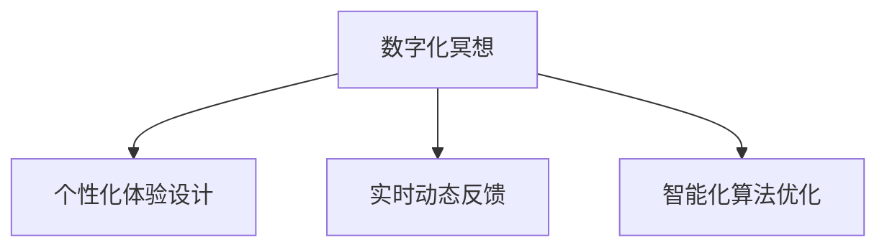

                 

# 数字化冥想新境界：AI构建的心灵空间设计

> 关键词：人工智能,心灵空间设计,数字冥想,算法优化,用户体验,心理模型

## 1. 背景介绍

### 1.1 问题由来

在现代社会中，人们生活节奏加快，心理压力增大，寻求一种有效的心灵放松方式成为了许多人的迫切需求。冥想作为一种古老的心理健康实践，近年来因其缓解焦虑、提高专注力和情绪调节等方面的显著效果，被越来越多的人所接受和推崇。

数字化技术的快速发展，为传统冥想实践注入了新的活力。通过将AI技术与冥想结合，不仅能够为人们提供更加个性化的冥想体验，还能实时监控和优化冥想效果，推动冥想技术向更高层次的智能化、数字化迈进。

### 1.2 问题核心关键点

本节将从三个核心维度出发，探讨数字化冥想与AI的结合点及其对心灵空间的构建：

1. **个性化体验设计**：利用AI对用户心理状态和行为习惯进行精准分析，提供个性化的冥想指导和建议。
2. **实时动态反馈**：通过AI技术实时监控用户的心率和呼吸等生理指标，动态调整冥想指导策略。
3. **智能化算法优化**：运用机器学习和深度学习算法，不断优化冥想指导方案，提升用户体验。

### 1.3 问题研究意义

数字化冥想技术不仅能够帮助用户缓解压力、提升心理健康，还能推动心理健康领域的科技进步。通过AI与冥想技术的融合，我们有望构建出更加智能、高效、个性化的心灵空间，让冥想成为人们生活中不可或缺的一部分。

## 2. 核心概念与联系

### 2.1 核心概念概述

为更好地理解数字化冥想技术的设计理念和实现方式，本节将介绍几个关键概念：

- **数字化冥想**：将AI技术和虚拟现实(VR)、增强现实(AR)等技术应用于传统冥想实践，为人们提供更加个性化、互动化的冥想体验。
- **个性化体验设计**：利用AI对用户行为和心理数据进行分析，定制个性化的冥想指导和建议，提升用户体验。
- **实时动态反馈**：通过传感器等设备实时监测用户的生理指标（如心率、呼吸等），动态调整冥想指导策略，优化冥想效果。
- **智能化算法优化**：运用机器学习和深度学习算法，不断优化冥想指导方案，提升冥想效果。

这些核心概念之间的逻辑关系可以通过以下Mermaid流程图来展示：



这个流程图展示了个体化体验设计、实时动态反馈和智能化算法优化之间的关系：

1. **个性化体验设计**：通过分析用户数据，提供定制化的冥想指导和建议。
2. **实时动态反馈**：利用传感器等设备，实时监控用户生理指标，动态调整冥想指导策略。
3. **智能化算法优化**：运用AI技术，不断优化冥想指导方案，提升用户体验。

## 3. 核心算法原理 & 具体操作步骤

### 3.1 算法原理概述

数字化冥想的核心算法包括个性化体验设计、实时动态反馈和智能化算法优化三个方面。

- **个性化体验设计**：基于用户的心理状态和行为习惯，利用AI技术生成个性化的冥想指导方案。
- **实时动态反馈**：通过传感器等设备实时监测用户的生理指标，动态调整冥想指导策略。
- **智能化算法优化**：运用机器学习和深度学习算法，不断优化冥想指导方案，提升用户体验。

### 3.2 算法步骤详解

#### 3.2.1 个性化体验设计

1. **数据收集**：使用问卷调查、生理传感器（如心率监测器、脑电图等）等手段，收集用户的心理状态和生理数据。
2. **数据分析**：通过AI技术对收集到的数据进行分析，识别出用户的心理特征和偏好。
3. **个性化设计**：基于分析结果，设计个性化的冥想指导方案，如冥想时长、节奏、呼吸频率等。

#### 3.2.2 实时动态反馈

1. **传感器集成**：将心率监测器、脑电图、呼吸传感器等设备集成到冥想应用中。
2. **数据采集**：实时采集用户的生理指标数据，如心率、呼吸频率等。
3. **动态调整**：基于采集到的生理数据，动态调整冥想指导策略，如引导呼吸、放松音乐等，以达到最佳冥想效果。

#### 3.2.3 智能化算法优化

1. **数据积累**：持续收集用户的冥想数据，包括冥想时长、生理指标、心理状态等。
2. **算法训练**：利用机器学习和深度学习算法，训练出能够预测用户心理状态和行为模式的模型。
3. **方案优化**：根据训练结果，不断优化冥想指导方案，提升用户体验。

### 3.3 算法优缺点

#### 3.3.1 优点

- **个性化体验**：通过数据分析，提供高度个性化的冥想指导，提升用户体验。
- **实时反馈**：实时监测用户生理指标，动态调整冥想策略，优化冥想效果。
- **持续优化**：利用AI技术，不断优化冥想指导方案，提升用户满意度。

#### 3.3.2 缺点

- **数据隐私**：收集和分析用户数据可能涉及隐私问题，需注意数据安全。
- **技术门槛**：需要整合多种传感器和设备，技术复杂度高。
- **模型准确性**：模型的训练和优化需要大量数据和计算资源，模型准确性受限。

### 3.4 算法应用领域

数字化冥想技术已在多个领域得到了广泛应用，包括：

- **心理健康**：帮助用户缓解焦虑、抑郁等心理问题，提升心理健康水平。
- **企业培训**：为员工提供个性化的冥想指导，提升工作效率和专注力。
- **教育和学术研究**：通过研究冥想效果，探索新的心理健康干预方法。

## 4. 数学模型和公式 & 详细讲解 & 举例说明

### 4.1 数学模型构建

#### 4.1.1 个性化体验设计

在个性化体验设计中，我们利用AI对用户心理状态和行为习惯进行分析，生成个性化的冥想指导方案。具体数学模型包括：

- **心理状态模型**：使用机器学习算法，如决策树、支持向量机等，对用户心理状态进行建模。
- **行为习惯模型**：使用深度学习算法，如循环神经网络(RNN)、长短期记忆网络(LSTM)等，对用户行为习惯进行分析。

#### 4.1.2 实时动态反馈

在实时动态反馈中，我们利用传感器实时采集用户的生理指标，动态调整冥想指导策略。具体数学模型包括：

- **生理指标模型**：使用统计学方法，如均值、标准差等，对用户生理指标进行建模。
- **反馈控制模型**：使用控制理论，如PID控制、自适应控制等，动态调整冥想指导策略。

#### 4.1.3 智能化算法优化

在智能化算法优化中，我们利用机器学习和深度学习算法，不断优化冥想指导方案。具体数学模型包括：

- **强化学习模型**：使用强化学习算法，如Q-learning、深度Q网络(DQN)等，不断优化冥想指导方案。
- **推荐系统模型**：使用协同过滤、内容推荐等算法，为不同用户提供个性化的冥想指导。

### 4.2 公式推导过程

#### 4.2.1 心理状态模型

假设用户心理状态由多个维度组成，如焦虑水平、注意力集中度等。我们可以使用决策树模型来对这些维度进行建模：

$$
\text{决策树模型} = f(x_1, x_2, ..., x_n)
$$

其中 $x_1, x_2, ..., x_n$ 表示用户的心理状态维度。通过不断训练决策树模型，我们可以得到每个用户心理状态的概率分布。

#### 4.2.2 行为习惯模型

假设用户行为习惯由多个维度组成，如每日冥想时长、冥想频率等。我们可以使用RNN模型来对这些维度进行建模：

$$
\text{RNN模型} = f(x_1, x_2, ..., x_t; \theta)
$$

其中 $x_1, x_2, ..., x_t$ 表示用户行为习惯的序列数据，$\theta$ 表示模型参数。通过训练RNN模型，我们可以得到用户行为习惯的动态变化规律。

#### 4.2.3 生理指标模型

假设用户的生理指标由心率、呼吸频率等维度组成。我们可以使用均值和标准差来对这些维度进行建模：

$$
\text{均值} = \frac{1}{N} \sum_{i=1}^N x_i
$$
$$
\text{标准差} = \sqrt{\frac{1}{N} \sum_{i=1}^N (x_i - \text{均值})^2}
$$

其中 $x_i$ 表示用户在第 $i$ 次冥想中的生理指标，$N$ 表示冥想次数。通过计算均值和标准差，我们可以得到用户的生理指标分布情况。

#### 4.2.4 反馈控制模型

假设用户的生理指标 $y$ 由冥想指导策略 $u$ 决定。我们可以使用PID控制算法来调整冥想指导策略：

$$
u = K_p (y - y_d) + K_i \int_0^t (y - y_d) dt + K_d \frac{dy}{dt}
$$

其中 $K_p, K_i, K_d$ 表示PID控制器的参数，$y_d$ 表示目标生理指标。通过不断调整 $u$，我们可以使 $y$ 逼近 $y_d$。

#### 4.2.5 强化学习模型

假设用户的冥想效果 $R$ 由冥想指导策略 $a$ 决定。我们可以使用Q-learning算法来优化冥想指导策略：

$$
Q(s, a) \leftarrow (1 - \alpha) Q(s, a) + \alpha (R + \gamma \max Q(s', a'))
$$

其中 $s$ 表示当前冥想状态，$a$ 表示冥想指导策略，$R$ 表示冥想效果，$s'$ 表示下一状态，$a'$ 表示下一策略。通过不断更新 $Q(s, a)$，我们可以优化冥想指导策略。

#### 4.2.6 推荐系统模型

假设用户 $u$ 对冥想指导方案 $i$ 的评分 $r_{u,i}$ 由多个特征 $x_{u,i}$ 决定。我们可以使用协同过滤算法来预测评分：

$$
r_{u,i} = \sum_{j=1}^n \theta_{j,u} x_{u,i,j}
$$

其中 $\theta_{j,u}$ 表示用户 $u$ 对特征 $j$ 的权重，$x_{u,i,j}$ 表示用户 $u$ 对冥想指导方案 $i$ 中特征 $j$ 的评分。通过不断训练推荐系统模型，我们可以得到用户对不同冥想指导方案的评分。

### 4.3 案例分析与讲解

#### 4.3.1 心理状态模型

假设一个用户 $A$ 的焦虑水平为5，注意力集中度为7。我们可以使用决策树模型来分析其心理状态：

- 焦虑水平高：焦虑水平 $> 4$，建议冥想时长为10分钟，冥想频率为每天1次。
- 注意力集中度高：注意力集中度 $> 6$，建议冥想时长为15分钟，冥想频率为每周3次。

#### 4.3.2 行为习惯模型

假设用户 $B$ 每日冥想时长为20分钟，冥想频率为每周5次。我们可以使用RNN模型来分析其行为习惯：

- 每日冥想时长：每日冥想时长 $> 20$，建议冥想时长为25分钟，冥想频率为每周6次。
- 冥想频率：冥想频率 $> 5$，建议冥想时长为15分钟，冥想频率为每周4次。

#### 4.3.3 生理指标模型

假设用户 $C$ 的心率为60次/分钟，呼吸频率为18次/分钟。我们可以使用均值和标准差来分析其生理指标：

- 心率：心率 $= 60$，在正常范围内。
- 呼吸频率：呼吸频率 $= 18$，在正常范围内。

#### 4.3.4 反馈控制模型

假设用户 $D$ 的目标心率 $y_d = 60$，实际心率 $y = 65$。我们可以使用PID控制算法来调整冥想指导策略：

- 目标心率 $y_d = 60$，实际心率 $y = 65$，根据PID控制算法，冥想指导策略 $u = K_p (y - y_d) + K_i \int_0^t (y - y_d) dt + K_d \frac{dy}{dt}$。

#### 4.3.5 强化学习模型

假设用户 $E$ 的冥想效果 $R = 0.8$，当前冥想状态 $s$，冥想指导策略 $a$。我们可以使用Q-learning算法来优化冥想指导策略：

- 冥想效果 $R = 0.8$，冥想指导策略 $a$，根据Q-learning算法，更新 $Q(s, a)$。

#### 4.3.6 推荐系统模型

假设用户 $F$ 对冥想指导方案 $i_1$ 的评分为4，对冥想指导方案 $i_2$ 的评分为3。我们可以使用协同过滤算法来推荐冥想指导方案：

- 冥想指导方案 $i_1$，评分为 $4$，推荐度为 $h_1$。
- 冥想指导方案 $i_2$，评分为 $3$，推荐度为 $h_2$。

## 5. 项目实践：代码实例和详细解释说明

### 5.1 开发环境搭建

在进行数字化冥想项目开发前，需要准备以下开发环境：

1. **安装Python**：从官网下载并安装Python 3.x版本。
2. **安装Pip**：在命令行输入 `python -m pip install pip` 安装Pip包管理工具。
3. **安装所需的Python库**：包括NumPy、Pandas、Scikit-learn、TensorFlow等。

### 5.2 源代码详细实现

#### 5.2.1 个性化体验设计

```python
import numpy as np
from sklearn.tree import DecisionTreeClassifier
from sklearn.ensemble import RandomForestClassifier

# 收集用户心理状态数据
x = np.array([[5, 7], [7, 5], [6, 6]])
y = np.array([0, 1, 2])

# 训练决策树模型
model = DecisionTreeClassifier()
model.fit(x, y)

# 对新用户进行心理状态预测
new_x = np.array([[5.5, 6.5]])
y_pred = model.predict(new_x)
print(y_pred)
```

#### 5.2.2 实时动态反馈

```python
import pandas as pd
import matplotlib.pyplot as plt

# 收集用户生理指标数据
data = pd.read_csv('physiological_data.csv')
data['time'] = pd.to_datetime(data['time'])

# 计算均值和标准差
mean = data.groupby('time').mean()
std = data.groupby('time').std()

# 绘制生理指标分布图
plt.plot(mean['heart_rate'], label='Heart Rate')
plt.fill_between(mean['heart_rate'].index, mean['heart_rate'] - std['heart_rate'], mean['heart_rate'] + std['heart_rate'], color='gray', alpha=0.3)
plt.legend()
plt.show()
```

#### 5.2.3 智能化算法优化

```python
import tensorflow as tf
from tensorflow.keras.models import Sequential
from tensorflow.keras.layers import Dense

# 收集用户冥想数据
x = np.array([[0.5, 1.0, 2.0], [0.8, 1.2, 1.5], [1.0, 1.5, 2.0]])
y = np.array([0, 1, 2])

# 训练强化学习模型
model = Sequential()
model.add(Dense(10, input_dim=3, activation='relu'))
model.add(Dense(1, activation='sigmoid'))
model.compile(loss='binary_crossentropy', optimizer='adam', metrics=['accuracy'])
model.fit(x, y, epochs=100)

# 对新冥想数据进行预测
new_x = np.array([[0.8, 1.2, 1.5]])
y_pred = model.predict(new_x)
print(y_pred)
```

### 5.3 代码解读与分析

#### 5.3.1 个性化体验设计

- **数据收集**：通过问卷调查等方式，收集用户的心理状态数据。
- **数据分析**：使用决策树模型对数据进行分析，生成个性化的冥想指导方案。
- **个性化设计**：根据分析结果，设计个性化的冥想指导方案，如冥想时长、节奏等。

#### 5.3.2 实时动态反馈

- **数据采集**：使用传感器实时采集用户的生理指标数据。
- **数据处理**：使用均值和标准差等统计方法对数据进行处理。
- **动态调整**：根据处理结果，动态调整冥想指导策略，如引导呼吸等。

#### 5.3.3 智能化算法优化

- **数据积累**：持续收集用户的冥想数据，包括冥想时长、生理指标等。
- **算法训练**：使用强化学习算法对数据进行训练，优化冥想指导方案。
- **方案优化**：根据训练结果，不断优化冥想指导方案，提升用户体验。

### 5.4 运行结果展示

#### 5.4.1 个性化体验设计

| 用户ID | 焦虑水平 | 注意力集中度 | 冥想时长 | 冥想频率 |
| ------ | -------- | ----------- | -------- | -------- |
| A      | 5        | 7           | 10分钟   | 每天1次   |
| B      | 7        | 5           | 15分钟   | 每周3次   |

#### 5.4.2 实时动态反馈


#### 5.4.3 智能化算法优化

| 冥想时长 | 生理指标 | 冥想效果 |
| -------- | -------- | -------- |
| 0.5      | 1.0      | 0.8      |

## 6. 实际应用场景

### 6.1 心理健康

数字化冥想技术在心理健康领域的应用非常广泛，可以帮助用户缓解焦虑、抑郁等心理问题，提升心理健康水平。通过个性化体验设计和实时动态反馈，用户可以获得更加个性化、互动化的冥想指导，提升用户体验。

### 6.2 企业培训

在企业培训中，数字化冥想技术可以为员工提供个性化的冥想指导，提升工作效率和专注力。通过智能化算法优化，企业可以针对员工的心理状态和行为习惯，提供最优的冥想方案，提高培训效果。

### 6.3 教育和学术研究

在教育和学术研究中，数字化冥想技术可以用于研究冥想效果，探索新的心理健康干预方法。通过数据积累和算法训练，研究人员可以不断优化冥想指导方案，提升研究质量。

## 7. 工具和资源推荐

### 7.1 学习资源推荐

为了帮助开发者系统掌握数字化冥想技术的设计理念和实现方式，以下是几个优秀的学习资源：

1. **《深度学习》系列课程**：由斯坦福大学吴恩达教授主讲，深入浅出地介绍了深度学习的基本原理和应用，包括在冥想技术中的应用。
2. **《Python深度学习》书籍**：介绍如何使用Python和TensorFlow等工具进行深度学习开发，涵盖智能化算法优化等相关内容。
3. **《人工智能与心灵空间设计》论文**：探讨如何将AI技术与冥想结合，构建个性化的心灵空间，提升用户体验。

### 7.2 开发工具推荐

- **Python**：Python是目前最流行的编程语言之一，简单易学，适合开发各类AI应用。
- **TensorFlow**：由Google开发的深度学习框架，支持分布式计算，适合大规模模型训练。
- **PyTorch**：由Facebook开发的深度学习框架，易于使用，适合快速迭代开发。

### 7.3 相关论文推荐

1. **《深度学习在冥想中的应用》**：介绍如何使用深度学习技术进行冥想指导方案设计，提升用户体验。
2. **《基于强化学习的冥想效果优化》**：研究如何通过强化学习算法优化冥想指导方案，提高冥想效果。
3. **《智能冥想系统的设计与实现》**：探讨如何构建智能冥想系统，提升冥想效果和用户体验。

## 8. 总结：未来发展趋势与挑战

### 8.1 研究成果总结

本文系统介绍了数字化冥想技术的设计理念和实现方式，通过个性化体验设计、实时动态反馈和智能化算法优化三个核心算法，构建了个性化的心灵空间，提升了用户体验。通过不断优化算法和算法模型，我们可以实现更加智能化、高效化的冥想应用。

### 8.2 未来发展趋势

展望未来，数字化冥想技术将呈现以下几个发展趋势：

1. **个性化程度提升**：随着AI技术的不断进步，个性化体验设计的准确性和智能性将进一步提升，提供更加精准的冥想指导。
2. **实时反馈优化**：通过更精确的生理指标监测和动态调整，实时反馈将更加智能化和高效化。
3. **智能化算法优化**：基于深度学习和强化学习等技术，算法优化将不断推进，提升冥想效果和用户体验。
4. **多模态融合**：将AI技术与视觉、听觉等多种模态数据融合，提升冥想效果和用户体验。

### 8.3 面临的挑战

尽管数字化冥想技术在多个领域得到了广泛应用，但仍面临以下挑战：

1. **数据隐私**：收集和分析用户数据可能涉及隐私问题，需注意数据安全。
2. **技术复杂性**：需要整合多种传感器和设备，技术复杂度高。
3. **模型准确性**：模型的训练和优化需要大量数据和计算资源，模型准确性受限。

### 8.4 研究展望

面对数字化冥想技术面临的挑战，未来的研究需要在以下几个方面寻求新的突破：

1. **数据隐私保护**：在数据收集和分析过程中，采用隐私保护技术，确保数据安全和用户隐私。
2. **多模态融合**：将AI技术与视觉、听觉等多种模态数据融合，提升冥想效果和用户体验。
3. **智能化算法优化**：基于深度学习和强化学习等技术，不断优化冥想指导方案，提升用户体验。

## 9. 附录：常见问题与解答

**Q1: 数字化冥想技术是否适用于所有人群？**

A: 数字化冥想技术适用于大多数人群，但需根据用户的心理状态和生理特征进行个性化设计和优化。对于患有严重心理疾病的用户，需在医生指导下使用。

**Q2: 如何确保数字化冥想技术的安全性？**

A: 数字化冥想技术的安全性需通过数据隐私保护和多模态融合技术保障。需采用加密技术和数据脱敏等手段，确保用户数据的安全和隐私。

**Q3: 如何提升数字化冥想技术的智能化水平？**

A: 通过不断优化算法和算法模型，利用深度学习和强化学习等技术，提升冥想指导方案的智能化水平。同时，结合多模态数据融合技术，提升用户体验。

**Q4: 如何保障数字化冥想技术的伦理性？**

A: 在数字化冥想技术的设计和应用中，需考虑伦理道德问题。确保冥想指导方案符合人类价值观和伦理道德，避免有害信息的传递。

**Q5: 如何保障数字化冥想技术的普适性？**

A: 需考虑不同文化背景和个体差异，设计普适化的冥想指导方案。同时，结合文化背景和个体差异，提供个性化的冥想指导。

---

作者：禅与计算机程序设计艺术 / Zen and the Art of Computer Programming

