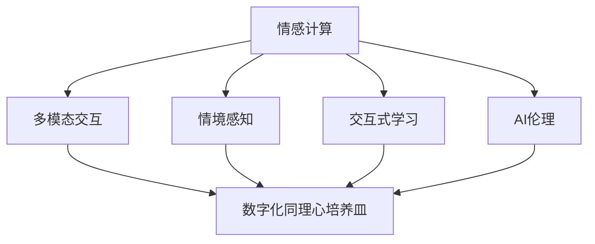

                 

# 数字化同理心培养皿开发者：AI增强的人际理解训练师

## 1. 背景介绍

### 1.1 问题由来

在当今数字化时代，人际沟通日益成为企业竞争的核心要素。然而，高度异构化的数据环境、跨地域远程协作的普及、信息爆炸的挑战等因素，使得人际理解和情感共情变得愈加困难。数字化同理心培养皿技术应运而生，通过引入人工智能辅助，提升人际沟通的效果和理解能力。该技术在企业管理、客户服务、在线教育等多个场景中显示出巨大的应用潜力，成为当前人工智能研究与应用的难点和热点之一。

### 1.2 问题核心关键点

数字化同理心培养皿技术核心在于：

- **AI增强的情感识别**：利用人工智能识别和理解人的情感变化，捕捉细微的情感线索。
- **多模态数据融合**：将文字、语音、图像等多种数据源整合，提供更全面的人际互动体验。
- **情境感知能力**：通过智能化的分析工具，理解和预测对话的语境，提升交流质量。
- **交互式训练系统**：基于实时反馈机制，对用户的同理心和人际理解能力进行持续训练。

数字化同理心培养皿技术能够帮助用户更好地理解和沟通，提升情感共鸣和共情能力，进而改善人际关系和业务效果。然而，该技术也面临诸如数据隐私、模型解释性不足、智能算法偏见等问题，需要在技术层面和伦理层面进行全面思考和探讨。

## 2. 核心概念与联系

### 2.1 核心概念概述

为了更好地理解数字化同理心培养皿技术，本节将介绍几个密切相关的核心概念：

- **情感计算**：通过计算手段理解、识别和表达人的情感，是数字化同理心培养皿的核心能力。
- **多模态交互**：结合文本、语音、图像等多种数据源，提升人际交流的真实性和丰富度。
- **情境感知**：识别对话中的上下文信息，理解互动情境，预测行为变化。
- **交互式学习**：通过即时反馈机制，持续训练和提升用户的同理心和人际理解能力。
- **AI伦理**：在算法开发、数据使用、用户隐私等方面，保证技术的透明性和伦理性。

这些核心概念之间的逻辑关系可以通过以下Mermaid流程图来展示：



这个流程图展示了大规模语言模型的工作原理和核心概念：

1. 情感计算通过理解文本、语音、图像等数据，识别人的情感变化。
2. 多模态交互结合多种数据源，提升交流的真实性和丰富度。
3. 情境感知理解对话上下文，预测行为变化，增强交流质量。
4. 交互式学习通过实时反馈机制，持续训练用户的人际理解能力。
5. AI伦理确保技术在开发和使用过程中的透明性和伦理性。

这些概念共同构成了数字化同理心培养皿技术的核心框架，使得该技术能够深入理解并促进人际交流。

## 3. 核心算法原理 & 具体操作步骤
### 3.1 算法原理概述

数字化同理心培养皿技术基于情感计算和多模态交互的原理，通过AI增强的方式，实现情境感知和交互式学习。其核心算法包括以下几个部分：

1. **情感识别**：通过分析文本、语音、图像等多种数据源，识别情感变化。
2. **情境感知**：利用NLP和机器学习技术，理解对话中的语境信息，预测行为变化。
3. **多模态融合**：将文本、语音、图像等多种数据源进行融合，提升交流的真实性和丰富度。
4. **交互式学习**：通过实时反馈机制，持续训练用户的人际理解能力。

### 3.2 算法步骤详解

基于数字化同理心培养皿技术的算法步骤如下：

**Step 1: 数据收集与预处理**

- 收集用户交互数据，包括文字、语音、图像等。
- 清洗和标准化数据，去除噪声和无关信息，增强数据质量。

**Step 2: 特征提取与情感识别**

- 对数据进行特征提取，得到文本、语音、图像等多个模态的特征。
- 使用情感计算模型（如BERT、ResNet等）进行情感识别，得到情感标签。

**Step 3: 情境感知与行为预测**

- 利用NLP模型（如LSTM、Transformer等）进行上下文理解，识别对话情境。
- 基于情境信息，预测用户行为变化，提供智能反馈。

**Step 4: 多模态融合与交互式学习**

- 将不同模态的数据进行融合，生成综合的情感识别结果。
- 通过交互式学习系统（如强化学习），根据实时反馈调整模型参数，提升用户的人际理解能力。

### 3.3 算法优缺点

数字化同理心培养皿技术具有以下优点：

- **智能化高**：通过AI增强的情感识别和情境感知，能够深度理解人的情感变化和交流情境。
- **多模态支持**：融合文本、语音、图像等多种数据源，提供更全面的人际互动体验。
- **实时反馈**：交互式学习系统能够实时调整和优化，持续提升用户的人际理解能力。

但同时也存在一些局限性：

- **数据隐私**：多模态数据采集和使用过程中，涉及用户隐私问题，需要严格的隐私保护措施。
- **模型偏见**：AI模型可能存在固有的偏见，需要额外设计偏见纠正机制。
- **解释性不足**：部分算法过程不透明，难以解释模型决策的逻辑。
- **复杂度高**：涉及多模态数据融合和情境感知，算法实现复杂度较高。

### 3.4 算法应用领域

数字化同理心培养皿技术已在多个领域得到广泛应用，例如：

- **企业管理**：提升团队沟通和协作效率，改善员工满意度，增强团队凝聚力。
- **客户服务**：通过智能客服机器人，提升客户体验，快速解决用户问题。
- **在线教育**：增强线上教学互动，提升学习效果，促进师生沟通。
- **心理咨询**：结合AI技术，提供智能心理辅导，减轻心理压力，提高心理健康水平。
- **健康医疗**：通过智能医疗助手，提升病患交流质量，辅助医生诊断和治疗。

## 4. 数学模型和公式 & 详细讲解 & 举例说明

### 4.1 数学模型构建

数字化同理心培养皿技术主要涉及以下数学模型：

- **情感识别模型**：文本情感分析、语音情感识别、图像情感识别等。
- **情境感知模型**：基于NLP的对话情境理解、行为预测模型等。
- **多模态融合模型**：将不同模态的数据进行融合，生成综合的情感识别结果。

### 4.2 公式推导过程

以下以文本情感分析为例，展示情感识别模型的推导过程。

假设文本序列为 $x=\{x_1,x_2,...,x_n\}$，对应的情感标签为 $y$。通过BERT模型进行情感分析，假设模型参数为 $\theta$，情感分析的损失函数为 $L(\theta)$，则最小化损失函数的公式为：

$$
\theta^* = \mathop{\arg\min}_{\theta} \mathcal{L}(\theta)
$$

其中，

$$
\mathcal{L}(\theta) = -\frac{1}{N}\sum_{i=1}^N \ell(M_{\theta}(x_i),y_i)
$$

其中，$\ell$ 为交叉熵损失，$M_{\theta}(x_i)$ 为模型在文本 $x_i$ 上的输出。

在实际实现中，通常使用交叉熵损失函数，通过反向传播算法计算梯度，更新模型参数 $\theta$。

### 4.3 案例分析与讲解

以情感识别模型为例，展示其在实际应用中的具体实现和效果。

假设在企业管理场景中，收集了员工的邮件和聊天记录，使用情感计算模型对文本进行情感识别，得到员工的情绪变化。基于情境感知模型，分析员工的交流情境，预测其行为变化，生成智能反馈。通过交互式学习系统，根据员工的表现调整模型参数，提升其人际理解能力。

## 5. 项目实践：代码实例和详细解释说明

### 5.1 开发环境搭建

在进行项目实践前，我们需要准备好开发环境。以下是使用Python进行PyTorch开发的环境配置流程：

1. 安装Anaconda：从官网下载并安装Anaconda，用于创建独立的Python环境。

2. 创建并激活虚拟环境：
```bash
conda create -n digital同理心-env python=3.8 
conda activate digital同理心-env
```

3. 安装PyTorch：根据CUDA版本，从官网获取对应的安装命令。例如：
```bash
conda install pytorch torchvision torchaudio cudatoolkit=11.1 -c pytorch -c conda-forge
```

4. 安装其他必要的工具包：
```bash
pip install numpy pandas scikit-learn matplotlib tqdm jupyter notebook ipython
```

完成上述步骤后，即可在`digital同理心-env`环境中开始项目实践。

### 5.2 源代码详细实现

下面以文本情感分析为例，展示如何使用PyTorch实现情感识别模型。

首先，定义数据集：

```python
import torch
from torch.utils.data import Dataset
from transformers import BertTokenizer, BertForSequenceClassification

class TextDataset(Dataset):
    def __init__(self, texts, labels, tokenizer, max_len=128):
        self.texts = texts
        self.labels = labels
        self.tokenizer = tokenizer
        self.max_len = max_len
        
    def __len__(self):
        return len(self.texts)
    
    def __getitem__(self, item):
        text = self.texts[item]
        label = self.labels[item]
        
        encoding = self.tokenizer(text, return_tensors='pt', max_length=self.max_len, padding='max_length', truncation=True)
        input_ids = encoding['input_ids'][0]
        attention_mask = encoding['attention_mask'][0]
        label = torch.tensor(label, dtype=torch.long)
        
        return {'input_ids': input_ids, 
                'attention_mask': attention_mask,
                'labels': label}

# 数据预处理
tokenizer = BertTokenizer.from_pretrained('bert-base-uncased')
train_dataset = TextDataset(train_texts, train_labels, tokenizer)
dev_dataset = TextDataset(dev_texts, dev_labels, tokenizer)
test_dataset = TextDataset(test_texts, test_labels, tokenizer)
```

然后，定义模型和优化器：

```python
from transformers import AdamW

model = BertForSequenceClassification.from_pretrained('bert-base-uncased', num_labels=2)
optimizer = AdamW(model.parameters(), lr=2e-5)
```

接着，定义训练和评估函数：

```python
from tqdm import tqdm
from sklearn.metrics import accuracy_score

device = torch.device('cuda') if torch.cuda.is_available() else torch.device('cpu')
model.to(device)

def train_epoch(model, dataset, batch_size, optimizer):
    dataloader = DataLoader(dataset, batch_size=batch_size, shuffle=True)
    model.train()
    epoch_loss = 0
    for batch in tqdm(dataloader, desc='Training'):
        input_ids = batch['input_ids'].to(device)
        attention_mask = batch['attention_mask'].to(device)
        labels = batch['labels'].to(device)
        model.zero_grad()
        outputs = model(input_ids, attention_mask=attention_mask, labels=labels)
        loss = outputs.loss
        epoch_loss += loss.item()
        loss.backward()
        optimizer.step()
    return epoch_loss / len(dataloader)

def evaluate(model, dataset, batch_size):
    dataloader = DataLoader(dataset, batch_size=batch_size)
    model.eval()
    preds, labels = [], []
    with torch.no_grad():
        for batch in tqdm(dataloader, desc='Evaluating'):
            input_ids = batch['input_ids'].to(device)
            attention_mask = batch['attention_mask'].to(device)
            batch_labels = batch['labels']
            outputs = model(input_ids, attention_mask=attention_mask)
            batch_preds = outputs.logits.argmax(dim=2).to('cpu').tolist()
            batch_labels = batch_labels.to('cpu').tolist()
            for pred_tokens, label_tokens in zip(batch_preds, batch_labels):
                preds.append(pred_tokens)
                labels.append(label_tokens)
                
    print(f'Accuracy: {accuracy_score(labels, preds)}')
```

最后，启动训练流程并在测试集上评估：

```python
epochs = 5
batch_size = 16

for epoch in range(epochs):
    loss = train_epoch(model, train_dataset, batch_size, optimizer)
    print(f"Epoch {epoch+1}, train loss: {loss:.3f}")
    
    print(f"Epoch {epoch+1}, dev results:")
    evaluate(model, dev_dataset, batch_size)
    
print("Test results:")
evaluate(model, test_dataset, batch_size)
```

以上就是使用PyTorch对BERT进行文本情感分析的完整代码实现。可以看到，通过PyTorch和HuggingFace库，我们可以用相对简洁的代码完成模型的加载和微调。

### 5.3 代码解读与分析

让我们再详细解读一下关键代码的实现细节：

**TextDataset类**：
- `__init__`方法：初始化文本、标签、分词器等关键组件。
- `__len__`方法：返回数据集的样本数量。
- `__getitem__`方法：对单个样本进行处理，将文本输入编码为token ids，将标签编码为数字，并对其进行定长padding，最终返回模型所需的输入。

**BertForSequenceClassification**：
- 基于BERT模型的序列分类模型，适合文本情感分析任务。

**AdamW**：
- 一种常用的优化算法，结合了动量和梯度衰减的特性，适合大规模模型训练。

**训练和评估函数**：
- 使用PyTorch的DataLoader对数据集进行批次化加载，供模型训练和推理使用。
- 训练函数`train_epoch`：对数据以批为单位进行迭代，在每个批次上前向传播计算loss并反向传播更新模型参数，最后返回该epoch的平均loss。
- 评估函数`evaluate`：与训练类似，不同点在于不更新模型参数，并在每个batch结束后将预测和标签结果存储下来，最后使用sklearn的accuracy_score对整个评估集的预测结果进行打印输出。

**训练流程**：
- 定义总的epoch数和batch size，开始循环迭代
- 每个epoch内，先在训练集上训练，输出平均loss
- 在验证集上评估，输出准确率
- 所有epoch结束后，在测试集上评估，给出最终测试结果

可以看到，PyTorch配合HuggingFace库使得BERT微调的代码实现变得简洁高效。开发者可以将更多精力放在数据处理、模型改进等高层逻辑上，而不必过多关注底层的实现细节。

当然，工业级的系统实现还需考虑更多因素，如模型的保存和部署、超参数的自动搜索、更灵活的任务适配层等。但核心的微调范式基本与此类似。

## 6. 实际应用场景

### 6.1 企业管理

在企业管理场景中，数字化同理心培养皿技术通过智能客服机器人，提升团队沟通和协作效率。智能客服机器人能够理解员工的情感变化，智能回复常见问题，减轻员工负担。同时，通过情境感知分析，机器人能够预测员工的情绪波动，及时提供关怀和支持，改善员工满意度。

### 6.2 客户服务

数字化同理心培养皿技术在客户服务中也有广泛应用。智能客服系统通过多模态交互，理解客户需求，提升服务质量。利用情境感知，智能客服能够提供个性化的服务建议，提升客户体验。同时，通过交互式学习，客服系统能够不断优化对话策略，逐步提高服务效果。

### 6.3 在线教育

在在线教育领域，数字化同理心培养皿技术帮助教师更好地理解学生需求，提升教学效果。智能教学助手能够实时监测学生的情绪变化，根据其学习状态调整教学策略。同时，通过情境感知分析，教学助手能够预测学生的学习兴趣，推荐适合的课程资源，增强学习效果。

### 6.4 未来应用展望

随着数字化同理心培养皿技术的不断发展，其在更多领域的应用前景将不断拓展：

- **智慧医疗**：通过智能医疗助手，提升病患交流质量，辅助医生诊断和治疗。
- **心理咨询**：结合AI技术，提供智能心理辅导，减轻心理压力，提高心理健康水平。
- **智能客服**：通过智能客服机器人，提升客户体验，快速解决用户问题。
- **企业培训**：通过智能培训助手，提升员工技能，优化团队协作。
- **社会治理**：通过智能治理平台，改善民生服务，提升政府治理水平。

数字化同理心培养皿技术的广泛应用，将极大提升人际沟通的效果，促进社会和谐发展。

## 7. 工具和资源推荐
### 7.1 学习资源推荐

为了帮助开发者系统掌握数字化同理心培养皿技术的理论基础和实践技巧，这里推荐一些优质的学习资源：

1. **《情感计算：原理与实践》**：这本书深入浅出地介绍了情感计算的原理和实践，是了解情感计算的入门读物。
2. **CS224N《深度学习自然语言处理》课程**：斯坦福大学开设的NLP明星课程，涵盖了自然语言处理的基本概念和经典模型，是学习NLP的重要资源。
3. **《多模态交互与情感计算》**：介绍多模态交互和情感计算的原理和应用，适合进一步深入学习。
4. **《交互式学习与情感智能》**：探讨交互式学习在情感智能中的应用，适合学习该技术的实际应用。
5. **《人工智能伦理与情感计算》**：涉及AI伦理和情感计算的多个方面，适合学习该技术的伦理问题。

通过对这些资源的学习实践，相信你一定能够快速掌握数字化同理心培养皿技术的精髓，并用于解决实际的情感计算问题。

### 7.2 开发工具推荐

高效的开发离不开优秀的工具支持。以下是几款用于数字化同理心培养皿开发的常用工具：

1. **PyTorch**：基于Python的开源深度学习框架，灵活动态的计算图，适合快速迭代研究。大部分预训练语言模型都有PyTorch版本的实现。
2. **TensorFlow**：由Google主导开发的开源深度学习框架，生产部署方便，适合大规模工程应用。同样有丰富的预训练语言模型资源。
3. **HuggingFace**：提供大规模预训练语言模型的工具库，集成了众多SOTA语言模型，支持PyTorch和TensorFlow，是进行数字化同理心培养皿开发的重要工具。
4. **Weights & Biases**：模型训练的实验跟踪工具，可以记录和可视化模型训练过程中的各项指标，方便对比和调优。与主流深度学习框架无缝集成。
5. **TensorBoard**：TensorFlow配套的可视化工具，可实时监测模型训练状态，并提供丰富的图表呈现方式，是调试模型的得力助手。

合理利用这些工具，可以显著提升数字化同理心培养皿开发的效率，加快创新迭代的步伐。

### 7.3 相关论文推荐

数字化同理心培养皿技术的发展源于学界的持续研究。以下是几篇奠基性的相关论文，推荐阅读：

1. **Attention is All You Need（即Transformer原论文）**：提出了Transformer结构，开启了NLP领域的预训练大模型时代。
2. **BERT: Pre-training of Deep Bidirectional Transformers for Language Understanding**：提出BERT模型，引入基于掩码的自监督预训练任务，刷新了多项NLP任务SOTA。
3. **Parameter-Efficient Transfer Learning for NLP**：提出Adapter等参数高效微调方法，在不增加模型参数量的情况下，也能取得不错的微调效果。
4. **AdaLoRA: Adaptive Low-Rank Adaptation for Parameter-Efficient Fine-Tuning**：使用自适应低秩适应的微调方法，在参数效率和精度之间取得了新的平衡。
5. **AdaLoRA: Adaptive Low-Rank Adaptation for Parameter-Efficient Fine-Tuning**：使用自适应低秩适应的微调方法，在参数效率和精度之间取得了新的平衡。

这些论文代表了大语言模型微调技术的发展脉络。通过学习这些前沿成果，可以帮助研究者把握学科前进方向，激发更多的创新灵感。

## 8. 总结：未来发展趋势与挑战

### 8.1 总结

本文对数字化同理心培养皿技术进行了全面系统的介绍。首先阐述了数字化同理心培养皿技术的背景和重要性，明确了该技术在改善人际沟通、提升用户体验方面的独特价值。其次，从原理到实践，详细讲解了数字化同理心培养皿的数学模型和核心算法，给出了完整的代码实例。同时，本文还广泛探讨了数字化同理心培养皿技术在企业管理、客户服务、在线教育等多个场景中的应用前景，展示了该技术在实际应用中的巨大潜力。此外，本文精选了该技术的学习资源、开发工具和相关论文，力求为读者提供全方位的技术指引。

通过本文的系统梳理，可以看到，数字化同理心培养皿技术通过AI增强的方式，深度理解人的情感变化和交流情境，极大提升了人际沟通的效果和理解能力。然而，该技术在数据隐私、模型偏见、智能算法解释性等方面的挑战仍需面对，需要在技术层面和伦理层面进行全面思考和探讨。

### 8.2 未来发展趋势

展望未来，数字化同理心培养皿技术将呈现以下几个发展趋势：

1. **多模态融合**：将文本、语音、图像等多种数据源进行融合，提升交流的真实性和丰富度。
2. **情感计算增强**：通过引入更多先验知识，提升情感识别的准确性和泛化能力。
3. **交互式学习优化**：通过实时反馈机制，持续训练和提升用户的人际理解能力。
4. **AI伦理重视**：在算法开发、数据使用、用户隐私等方面，保证技术的透明性和伦理性。
5. **跨领域应用扩展**：在医疗、教育、社会治理等多个领域，不断拓展数字化同理心培养皿的应用范围。

以上趋势凸显了数字化同理心培养皿技术的广阔前景。这些方向的探索发展，必将进一步提升人际沟通的效果和理解能力，为构建人机协同的智能社会提供重要支持。

### 8.3 面临的挑战

尽管数字化同理心培养皿技术已经取得了瞩目成就，但在迈向更加智能化、普适化应用的过程中，它仍面临诸多挑战：

1. **数据隐私**：多模态数据采集和使用过程中，涉及用户隐私问题，需要严格的隐私保护措施。
2. **模型偏见**：AI模型可能存在固有的偏见，需要额外设计偏见纠正机制。
3. **智能算法解释性不足**：部分算法过程不透明，难以解释模型决策的逻辑。
4. **复杂度高**：涉及多模态数据融合和情境感知，算法实现复杂度较高。

### 8.4 未来突破

面对数字化同理心培养皿技术所面临的种种挑战，未来的研究需要在以下几个方面寻求新的突破：

1. **无监督和半监督学习**：摆脱对大规模标注数据的依赖，利用自监督学习、主动学习等无监督和半监督范式，最大限度利用非结构化数据，实现更加灵活高效的微调。
2. **参数高效微调方法**：开发更加参数高效的微调方法，在固定大部分预训练参数的同时，只更新极少量的任务相关参数。同时优化微调模型的计算图，减少前向传播和反向传播的资源消耗，实现更加轻量级、实时性的部署。
3. **因果推断与强化学习**：引入因果推断和强化学习思想，增强模型建立稳定因果关系的能力，学习更加普适、鲁棒的语言表征。
4. **跨模态信息整合**：将符号化的先验知识与神经网络模型进行融合，引导微调过程学习更准确、合理的语言模型。同时加强不同模态数据的整合，实现视觉、语音等多模态信息与文本信息的协同建模。
5. **伦理道德约束**：在算法开发、数据使用、用户隐私等方面，确保技术的透明性和伦理性，建立模型行为的监管机制，确保输出符合人类价值观和伦理道德。

这些研究方向的探索，必将引领数字化同理心培养皿技术迈向更高的台阶，为构建安全、可靠、可解释、可控的智能系统铺平道路。面向未来，数字化同理心培养皿技术还需要与其他人工智能技术进行更深入的融合，如知识表示、因果推理、强化学习等，多路径协同发力，共同推动自然语言理解和智能交互系统的进步。只有勇于创新、敢于突破，才能不断拓展语言模型的边界，让智能技术更好地造福人类社会。

## 9. 附录：常见问题与解答

**Q1: 数字化同理心培养皿技术在企业管理中有哪些应用？**

A: 数字化同理心培养皿技术在企业管理中的应用包括但不限于以下几点：
1. **智能客服机器人**：通过多模态交互和情感计算，提升客服响应速度和准确性，减轻员工负担。
2. **团队协作分析**：通过情感识别和情境感知，分析团队协作中的情感变化，改善团队沟通和协作效率。
3. **员工情绪监测**：通过智能助手监测员工情绪变化，及时提供关怀和支持，提升员工满意度。
4. **个性化培训**：通过情境感知和反馈机制，提供个性化的培训建议，优化员工技能提升效果。

**Q2: 如何优化数字化同理心培养皿技术的性能？**

A: 优化数字化同理心培养皿技术的性能可以从以下几个方面进行：
1. **多模态融合**：将文本、语音、图像等多种数据源进行融合，提升交流的真实性和丰富度。
2. **情感计算增强**：通过引入更多先验知识，提升情感识别的准确性和泛化能力。
3. **交互式学习优化**：通过实时反馈机制，持续训练和提升用户的人际理解能力。
4. **算法优化**：使用高效的优化算法（如AdamW、Adafactor等），提高模型训练速度和稳定性。
5. **模型压缩**：使用模型压缩技术（如剪枝、量化等），减小模型尺寸，加快推理速度。
6. **超参数调优**：通过自动调参（如网格搜索、贝叶斯优化等），找到最优的超参数组合，提升模型效果。

**Q3: 在数字化同理心培养皿技术中，如何确保模型的公平性和透明性？**

A: 确保数字化同理心培养皿技术的公平性和透明性可以从以下几个方面进行：
1. **数据平衡**：确保训练数据集的样本平衡，避免模型偏向某一特定群体。
2. **算法透明**：使用可解释的模型（如决策树、LIME等），提高模型的透明性和可解释性。
3. **隐私保护**：使用差分隐私、联邦学习等技术，保护用户隐私。
4. **伦理审查**：建立伦理委员会，对模型开发和使用进行伦理审查，确保其符合社会价值观和伦理道德。
5. **用户反馈**：定期收集用户反馈，根据反馈调整模型参数和策略，确保模型的公平性和透明性。

这些措施可以最大限度地避免数字化同理心培养皿技术的偏见和误导，确保其在实际应用中的公平性和透明性。

**Q4: 在数字化同理心培养皿技术中，如何应对模型的过拟合问题？**

A: 应对数字化同理心培养皿技术的过拟合问题可以从以下几个方面进行：
1. **数据增强**：通过回译、近义替换等方式扩充训练集，增加数据的多样性。
2. **正则化**：使用L2正则、Dropout等正则化技术，防止模型过拟合。
3. **早停机制**：在验证集上监测模型性能，一旦性能不再提升，立即停止训练。
4. **对抗训练**：引入对抗样本，提高模型的鲁棒性，防止过拟合。
5. **模型裁剪**：去除不必要的层和参数，减小模型尺寸，提高模型的泛化能力。

这些措施可以有效地缓解数字化同理心培养皿技术的过拟合问题，提高模型的泛化能力和鲁棒性。

**Q5: 在数字化同理心培养皿技术中，如何提高模型的解释性和可解释性？**

A: 提高数字化同理心培养皿技术的模型解释性和可解释性可以从以下几个方面进行：
1. **可解释模型**：使用决策树、LIME等可解释模型，提高模型的透明性和可解释性。
2. **特征重要性分析**：通过特征重要性分析，了解模型决策的关键特征，增强输出解释的因果性和逻辑性。
3. **模型可视化**：使用可视化工具（如TensorBoard、Weights & Biases等），展示模型训练过程和决策路径，提高模型的可解释性。
4. **模型压缩**：使用模型压缩技术（如剪枝、量化等），减小模型尺寸，提高模型的解释性。
5. **透明性设计**：在设计模型时，考虑透明性和可解释性，确保模型决策过程的透明和可解释。

这些措施可以有效地提高数字化同理心培养皿技术的模型解释性和可解释性，增强模型的透明性和可信度。

---

作者：禅与计算机程序设计艺术 / Zen and the Art of Computer Programming

