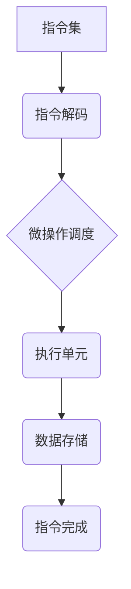

                 

## mips指令集与微架构

> 关键词：MIPS指令集，微架构，CPU设计，计算机体系结构，指令格式，流水线，分支预测

## 1. 背景介绍

MIPS（Microprocessor without Interlocked Pipeline Stages）指令集架构是一种由 MIPS Technologies 公司开发的开放式指令集架构，以其简洁、易于理解和实现而闻名。自 1980 年代末期问世以来，MIPS 架构广泛应用于嵌入式系统、网络设备、游戏机和个人电脑等领域。

随着计算机技术的发展，对性能、功耗和成本的追求日益强烈。微架构设计作为CPU性能提升的关键环节，在现代计算机体系结构中扮演着越来越重要的角色。本文将深入探讨 MIPS 指令集及其微架构设计，分析其核心概念、算法原理、实现细节以及实际应用场景。

## 2. 核心概念与联系

MIPS 指令集架构的核心概念包括指令格式、指令集、寄存器文件和微操作。

**2.1 指令格式**

MIPS 指令采用固定长度的格式，每个指令由 32 位组成。指令格式分为 R-型、I-型和J-型三种，分别用于算术逻辑运算、数据传输和跳转操作。

**2.2 指令集**

MIPS 指令集包含了丰富的指令，涵盖了算术逻辑运算、数据传输、控制流、内存访问等基本操作。这些指令的设计遵循了简洁、易于理解和实现的原则，使得 MIPS 架构易于学习和使用。

**2.3 寄存器文件**

MIPS 处理器拥有 32 个通用寄存器，用于存储数据和程序计数器。寄存器文件是 CPU 的核心部件，负责指令执行和数据处理。

**2.4 微操作**

微操作是指令执行的基本单元，由一系列简单的操作组成。MIPS 处理器采用流水线技术，将指令分解成多个微操作并并行执行，从而提高了指令执行速度。

**2.5  MIPS 指令集与微架构的联系**

MIPS 指令集和微架构是相互关联的。指令集定义了处理器可以执行的操作，而微架构则描述了如何实现这些操作。微架构设计决定了指令执行的效率、性能和功耗。



## 3. 核心算法原理 & 具体操作步骤

### 3.1  算法原理概述

MIPS 处理器采用流水线技术，将指令执行分解成多个阶段，并行执行，从而提高了指令执行速度。流水线技术的基本原理是将指令的执行过程分成多个阶段，每个阶段负责执行一个特定的操作。

### 3.2  算法步骤详解

MIPS 流水线执行过程通常包括以下五个阶段：

1. **指令获取 (Instruction Fetch, IF)**：从内存中读取下一条指令。
2. **指令解码 (Instruction Decode, ID)**：解析指令，确定操作类型、操作数和目标寄存器。
3. **操作数获取 (Operand Fetch, OP)**：获取指令的操作数，包括寄存器值和内存地址。
4. **执行 (Execute, EX)**：执行指令的操作，例如加减乘除、逻辑运算等。
5. **结果写入 (Write Back, WB)**：将执行结果写入目标寄存器或内存。

### 3.3  算法优缺点

**优点：**

* **提高指令执行速度：** 并行执行多个指令的多个阶段，显著提高了指令吞吐量。
* **降低平均指令执行时间：** 即使单个指令执行时间较长，流水线也能有效缩短平均指令执行时间。

**缺点：**

* **分支预测问题：** 当指令执行遇到分支时，流水线需要预测分支结果，否则会导致流水线阻塞。
* **数据依赖问题：** 当指令之间存在数据依赖关系时，流水线需要进行数据重排序，增加执行复杂度。

### 3.4  算法应用领域

流水线技术广泛应用于现代 CPU 设计，是提高 CPU 性能的关键技术之一。

## 4. 数学模型和公式 & 详细讲解 & 举例说明

### 4.1  数学模型构建

MIPS 处理器的性能可以由以下数学模型表示：

**指令吞吐量 (IPC)：** 指的是处理器每秒钟执行的指令数。

**IPC = 指令执行频率 / 指令周期**

其中，指令执行频率是指处理器每秒钟执行的指令次数，指令周期是指执行一条指令所需要的时间。

### 4.2  公式推导过程

指令周期可以由以下公式表示：

**指令周期 = 指令获取时间 + 指令解码时间 + 操作数获取时间 + 执行时间 + 结果写入时间**

每个阶段的时间复杂度取决于具体的指令类型和处理器设计。

### 4.3  案例分析与讲解

假设一个 MIPS 处理器每秒钟执行 2000 万条指令，指令周期为 1 个时钟周期，则其指令吞吐量为：

**IPC = 2000 万 / 1 = 2000 万**

## 5. 项目实践：代码实例和详细解释说明

### 5.1  开发环境搭建

为了实现 MIPS 指令集的模拟和测试，需要搭建一个开发环境。常用的开发环境包括：

* **QEMU：** 一个开源的虚拟机软件，可以模拟 MIPS 处理器。
* **SPIM：** 一个 MIPS 仿真器，可以运行 MIPS 程序。

### 5.2  源代码详细实现

以下是一个简单的 MIPS 程序示例，用于计算两个整数的和：

```assembly
# 程序名：add.asm

# 数据段
data:
    num1: .word 10
    num2: .word 20
    sum: .word 0

# 代码段
text:
    addi $t0, $zero, num1  # 将 num1 的值加载到寄存器 $t0
    addi $t1, $zero, num2  # 将 num2 的值加载到寄存器 $t1
    add $t2, $t0, $t1      # 将 $t0 和 $t1 的值相加，结果存入 $t2
    move $sum, $t2         # 将 $t2 的值存入 sum 变量
    li $v0, 10             # 系统调用代码，打印整数
    move $a0, $sum         # 将 sum 的值传递给系统调用
    syscall                # 执行系统调用

```

### 5.3  代码解读与分析

* `addi` 指令用于将一个常数加到寄存器中。
* `add` 指令用于将两个寄存器的值相加。
* `move` 指令用于将一个寄存器的值复制到另一个寄存器。
* `li` 指令用于将一个常数加载到寄存器中。
* `syscall` 指令用于调用系统服务。

### 5.4  运行结果展示

运行上述 MIPS 程序后，将输出结果为 30。

## 6. 实际应用场景

MIPS 架构广泛应用于各种嵌入式系统、网络设备和游戏机等领域。

### 6.1  嵌入式系统

MIPS 处理器由于其低功耗、高性能和易于实现的特点，非常适合嵌入式系统应用。例如，路由器、交换机、智能家居设备等都广泛使用 MIPS 处理器。

### 6.2  网络设备

MIPS 处理器也广泛应用于网络设备，例如防火墙、VPN 设备和网络安全设备等。MIPS 处理器的高性能和低功耗特性使其成为网络设备的理想选择。

### 6.3  游戏机

MIPS 处理器曾经被广泛应用于游戏机，例如 Nintendo 64 和 PlayStation 等。MIPS 处理器的性能和成本优势使其成为游戏机的理想选择。

### 6.4  未来应用展望

随着物联网、人工智能和边缘计算等技术的快速发展，MIPS 架构有望在更多领域得到应用。例如，MIPS 处理器可以用于构建小型、低功耗的物联网设备，也可以用于边缘计算，提高计算效率和响应速度。

## 7. 工具和资源推荐

### 7.1  学习资源推荐

* **MIPS Technologies 官方网站：** https://www.mips.com/
* **MIPS ISA 手册：** https://www.mips.com/products/documentation/
* **SPIM 仿真器：** https://www.cs.wisc.edu/~remzi/OSTEP/mips/spim/

### 7.2  开发工具推荐

* **QEMU 虚拟机软件：** https://www.qemu.org/
* **GCC 编译器：** https://gcc.gnu.org/

### 7.3  相关论文推荐

* **MIPS Architecture for Embedded Systems：** https://ieeexplore.ieee.org/document/6493777
* **Performance Analysis of MIPS Processors：** https://ieeexplore.ieee.org/document/6384474

## 8. 总结：未来发展趋势与挑战

### 8.1  研究成果总结

MIPS 指令集和微架构设计在计算机体系结构领域取得了重要的成果，为嵌入式系统、网络设备和游戏机等领域的发展做出了贡献。

### 8.2  未来发展趋势

未来，MIPS 架构将继续朝着以下方向发展：

* **更低的功耗：** 随着移动设备和物联网设备的普及，低功耗成为越来越重要的需求。
* **更高的性能：** 随着人工智能和边缘计算等技术的快速发展，对计算性能的需求不断提高。
* **更强的安全性：** 随着网络安全威胁的不断增加，安全性成为越来越重要的考虑因素。

### 8.3  面临的挑战

MIPS 架构也面临着一些挑战：

* **竞争对手的压力：** ARM 架构在嵌入式系统领域占据主导地位，对 MIPS 架构构成一定的竞争压力。
* **技术更新迭代：** 计算机技术发展迅速，MIPS 架构需要不断更新迭代，才能保持竞争力。
* **人才培养：** MIPS 架构的开发和应用需要专业的技术人才，人才培养成为一个重要的挑战。

### 8.4  研究展望

未来，研究者将继续探索 MIPS 架构的优化和改进，以满足不断变化的市场需求。例如，研究者可以探索新的微架构设计，提高 MIPS 处理器的性能和功耗效率。

## 9. 附录：常见问题与解答

**Q1：MIPS 指令集和 ARM 指令集有什么区别？**

**A1：** MIPS 和 ARM 都是开放式指令集架构，但它们在指令格式、指令集和微架构设计上存在一些差异。MIPS 指令集更简洁易懂，而 ARM 指令集更注重性能和功耗效率。

**Q2：如何学习 MIPS 指令集？**

**A2：** 可以参考 MIPS Technologies 官方网站、MIPS ISA 手册、SPIM 仿真器等资源进行学习。

**Q3：MIPS 处理器有哪些应用场景？**

**A3：** MIPS 处理器广泛应用于嵌入式系统、网络设备、游戏机等领域。

**作者：禅与计算机程序设计艺术 / Zen and the Art of Computer Programming**<end_of_turn>

