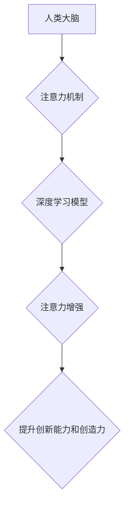

                 

## 人类注意力增强：提升创新能力和创造力激发

> 关键词：注意力增强、深度学习、神经网络、认知科学、创新能力、创造力、脑机接口

## 1. 背景介绍

在当今信息爆炸的时代，人类面临着前所未有的信息过载挑战。我们每天需要处理海量的文字、图像、音频等信息，这使得注意力成为我们获取知识、做出决策、进行创造性思考的关键能力。然而，随着科技的进步，人们的注意力也日益分散，容易被各种干扰所打断，这严重阻碍了我们的学习、工作和生活效率。

注意力增强技术旨在通过技术手段提升人类的注意力水平，帮助我们更好地集中精力，提高信息处理效率，从而激发创新能力和创造力。近年来，随着深度学习和人工智能技术的快速发展，注意力增强技术取得了显著进展，并逐渐应用于各个领域，例如教育、医疗、游戏等。

## 2. 核心概念与联系

### 2.1 注意力机制

注意力机制是深度学习领域的重要研究方向，其灵感来源于人类的视觉注意力机制。人类在观察世界时，不会同时关注所有信息，而是会根据自身需求和兴趣选择性地关注某些特定的信息，而忽略其他无关的信息。

深度学习中的注意力机制模仿了这种选择性关注的行为，通过学习一个“注意力权重”来决定模型对不同输入信息的关注程度。注意力权重可以根据输入信息的特征和上下文信息进行动态调整，从而使模型能够更加有效地提取关键信息。

### 2.2 人工智能与注意力增强

人工智能技术，特别是深度学习技术，为注意力增强技术的发展提供了强大的工具。深度学习模型能够学习复杂的模式和关系，并根据学习到的知识进行预测和决策。

通过将注意力机制融入到深度学习模型中，可以使模型更加关注重要的信息，提高模型的学习效率和预测精度。例如，在自然语言处理领域，注意力机制可以帮助模型更好地理解文本的语义，从而提高机器翻译、文本摘要等任务的性能。

### 2.3 脑机接口与注意力增强

脑机接口 (Brain-Computer Interface, BCI) 技术是将大脑与外部设备连接起来的一种技术，它可以读取大脑的电信号，并将其转化为控制外部设备的指令。

BCI 技术与注意力增强技术相结合，可以实现更加精准和有效的注意力控制。例如，通过BCI技术可以实时监测用户的注意力状态，并根据用户的注意力水平动态调整外部设备的刺激强度，从而帮助用户更好地集中注意力。

**Mermaid 流程图**



## 3. 核心算法原理 & 具体操作步骤

### 3.1 算法原理概述

注意力机制的核心算法原理是通过学习一个注意力权重来决定模型对不同输入信息的关注程度。注意力权重可以根据输入信息的特征和上下文信息进行动态调整，从而使模型能够更加有效地提取关键信息。

常见的注意力机制算法包括：

* **自注意力机制 (Self-Attention):**  用于处理序列数据，例如文本和音频。它可以学习每个单词或音素与其他单词或音素之间的关系，从而更好地理解序列的语义。
* **交叉注意力机制 (Cross-Attention):** 用于处理多个序列之间的关系，例如机器翻译和文本摘要。它可以学习两个序列之间的对应关系，从而更好地理解两个序列之间的语义。

### 3.2 算法步骤详解

**自注意力机制的具体操作步骤如下：**

1. **计算查询 (Query)、键 (Key) 和值 (Value) 向量:** 将输入序列中的每个单词或音素映射到三个向量：查询向量、键向量和值向量。
2. **计算注意力权重:** 使用查询向量和键向量之间的相似度计算注意力权重。
3. **加权求和:** 使用注意力权重对值向量进行加权求和，得到每个单词或音素的上下文表示。

**交叉注意力机制的具体操作步骤如下：**

1. **计算两个序列的查询、键和值向量。**
2. **计算两个序列之间的注意力权重。**
3. **使用注意力权重对两个序列的值向量进行加权求和，得到两个序列之间的上下文表示。**

### 3.3 算法优缺点

**注意力机制的优点:**

* 可以有效地提取关键信息，提高模型的学习效率和预测精度。
* 可以处理长序列数据，例如文本和音频。
* 可以学习不同输入信息的复杂关系。

**注意力机制的缺点:**

* 计算复杂度较高，训练时间较长。
* 容易受到噪声数据的影响。
* 难以解释注意力权重的含义。

### 3.4 算法应用领域

注意力机制在各个领域都有广泛的应用，例如：

* **自然语言处理:** 机器翻译、文本摘要、问答系统、情感分析等。
* **计算机视觉:** 图像识别、目标检测、图像分割等。
* **语音识别:** 语音转文本、语音合成等。
* **推荐系统:** 商品推荐、内容推荐等。

## 4. 数学模型和公式 & 详细讲解 & 举例说明

### 4.1 数学模型构建

注意力机制的数学模型可以概括为以下公式：

$$
\text{Attention}(Q, K, V) = \text{softmax}\left(\frac{Q K^T}{\sqrt{d_k}}\right) V
$$

其中：

* $Q$：查询向量
* $K$：键向量
* $V$：值向量
* $d_k$：键向量的维度
* $\text{softmax}$：softmax 函数，用于将注意力权重归一化到 [0, 1] 之间。

### 4.2 公式推导过程

注意力机制的公式推导过程可以分为以下几个步骤：

1. 计算查询向量 $Q$ 和键向量 $K$ 之间的点积，即 $QK^T$。
2. 将点积结果除以 $\sqrt{d_k}$，以规范化向量长度。
3. 使用 softmax 函数对规范化后的点积结果进行归一化，得到注意力权重。
4. 将注意力权重与值向量 $V$ 进行加权求和，得到最终的上下文表示。

### 4.3 案例分析与讲解

**举例说明：**

假设我们有一个句子 "The cat sat on the mat"，我们想使用自注意力机制来理解每个单词的上下文关系。

1. 将每个单词映射到查询向量、键向量和值向量。
2. 计算每个单词的查询向量与其他单词的键向量的点积。
3. 使用 softmax 函数对点积结果进行归一化，得到每个单词的注意力权重。
4. 将注意力权重与每个单词的值向量进行加权求和，得到每个单词的上下文表示。

通过这种方式，我们可以学习到每个单词与其他单词之间的关系，从而更好地理解句子的语义。

## 5. 项目实践：代码实例和详细解释说明

### 5.1 开发环境搭建

* **操作系统:** Ubuntu 20.04 LTS
* **编程语言:** Python 3.8
* **深度学习框架:** TensorFlow 2.x
* **其他依赖:** numpy, pandas, matplotlib

### 5.2 源代码详细实现

```python
import tensorflow as tf

# 定义自注意力机制
def self_attention(query, key, value, mask=None):
    # 计算注意力权重
    attention_weights = tf.matmul(query, key, transpose_b=True) / tf.math.sqrt(tf.cast(key.shape[-1], tf.float32))
    if mask is not None:
        attention_weights += (mask * -1e9)
    attention_weights = tf.nn.softmax(attention_weights, axis=-1)
    # 加权求和
    context = tf.matmul(attention_weights, value)
    return context

# 示例代码
# 定义输入数据
query = tf.random.normal([3, 4, 64])
key = tf.random.normal([3, 4, 64])
value = tf.random.normal([3, 4, 64])

# 计算注意力上下文表示
context = self_attention(query, key, value)

# 打印结果
print(context.shape)
```

### 5.3 代码解读与分析

* `self_attention` 函数实现了自注意力机制的核心逻辑。
* `tf.matmul` 函数用于计算矩阵乘法。
* `tf.math.sqrt` 函数用于计算平方根。
* `tf.nn.softmax` 函数用于计算 softmax 函数。
* `mask` 参数用于屏蔽某些输入信息，例如在机器翻译中，可以屏蔽源语言中已经翻译过的单词。

### 5.4 运行结果展示

运行上述代码后，会输出一个形状为 `(3, 4, 64)` 的张量，表示每个单词的上下文表示。

## 6. 实际应用场景

### 6.1 教育领域

注意力增强技术可以帮助学生更好地集中注意力，提高学习效率。例如，可以开发一款智能学习软件，根据学生的注意力状态动态调整学习内容和难度，并提供个性化的学习建议。

### 6.2 医疗领域

注意力增强技术可以帮助医生更好地诊断和治疗疾病。例如，可以开发一款脑机接口设备，实时监测患者的注意力状态，并根据患者的注意力水平调整治疗方案。

### 6.3 游戏领域

注意力增强技术可以提升游戏玩家的沉浸感和体验。例如，可以开发一款游戏，通过调整游戏场景和音效，根据玩家的注意力状态动态改变游戏难度和挑战性。

### 6.4 未来应用展望

随着注意力增强技术的不断发展，其应用场景将会更加广泛。例如，可以应用于自动驾驶、机器人控制、虚拟现实等领域。

## 7. 工具和资源推荐

### 7.1 学习资源推荐

* **书籍:**
    * "深度学习" by Ian Goodfellow, Yoshua Bengio, and Aaron Courville
    * "Attention Is All You Need" by Vaswani et al.
* **在线课程:**
    * Coursera: Deep Learning Specialization
    * Udacity: Deep Learning Nanodegree

### 7.2 开发工具推荐

* **TensorFlow:** https://www.tensorflow.org/
* **PyTorch:** https://pytorch.org/

### 7.3 相关论文推荐

* "Attention Is All You Need"
* "BERT: Pre-training of Deep Bidirectional Transformers for Language Understanding"
* "Transformer-XL: Attentive Language Models Beyond a Fixed-Length Context"

## 8. 总结：未来发展趋势与挑战

### 8.1 研究成果总结

注意力机制在深度学习领域取得了显著进展，并广泛应用于各个领域。

### 8.2 未来发展趋势

* **更有效的注意力机制:** 研究更有效的注意力机制，例如可解释性更强、计算效率更高的注意力机制。
* **跨模态注意力:** 研究跨模态注意力机制，例如将文本、图像、音频等不同模态的信息融合在一起。
* **脑机接口与注意力增强:** 将脑机接口技术与注意力增强技术结合，实现更加精准和有效的注意力控制。

### 8.3 面临的挑战

* **计算复杂度:** 现有的注意力机制计算复杂度较高，难以应用于大规模数据处理。
* **可解释性:** 注意力机制的决策过程难以解释，这限制了其在一些安全敏感领域的应用。
* **数据标注:** 训练注意力机制需要大量的标注数据，这在一些领域难以获取。

### 8.4 研究展望

未来，注意力增强技术将继续朝着更有效、更可解释、更广泛应用的方向发展。


## 9. 附录：常见问题与解答

**Q1: 注意力机制和深度学习有什么关系？**

**A1:** 注意力机制是深度学习领域的重要研究方向，它可以帮助深度学习模型更好地理解输入信息，提高模型的学习效率和预测精度。

**Q2: 注意力机制有哪些应用场景？**

**A2:** 注意力机制在各个领域都有广泛的应用，例如自然语言处理、计算机视觉、语音识别、推荐系统等。

**Q3: 如何评估注意力机制的性能？**

**A3:** 注意力机制的性能可以通过各种指标进行评估，例如准确率、召回率、F1-score等。

**作者：禅与计算机程序设计艺术 / Zen and the Art of Computer Programming**<end_of_turn>

