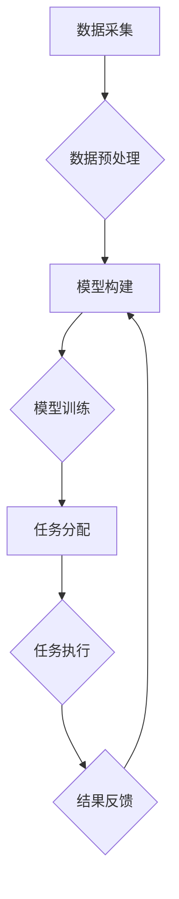

                 

## 人类计算：释放人类潜力的工具

> 关键词：人工智能、计算模型、人类认知、数据分析、机器学习、深度学习、认知科学

### 1. 背景介绍

在信息爆炸的时代，人类面临着海量数据的处理和分析挑战。传统计算模式逐渐难以满足日益增长的需求。人工智能（AI）的兴起为人类计算提供了一种全新的视角和解决方案。AI技术通过模拟人类认知过程，赋予机器学习、推理和决策的能力，从而帮助人类更高效地处理信息、洞察数据，并释放人类的潜能。

人类计算的概念源于对人类认知能力的理解和模拟。它强调将人类的智慧和创造力与计算技术相结合，构建一种协同工作模式。人类计算不仅仅是机器代替人类，而是将机器作为人类的工具，帮助人类更高效地完成复杂的任务。

### 2. 核心概念与联系

**2.1 人类计算的本质**

人类计算的核心在于将人类的智慧和机器的计算能力相结合，形成一个协同工作系统。

* **人类的智慧:** 包括人类的创造力、批判性思维、情感智能和社会认知等。
* **机器的计算能力:** 包括机器的快速处理速度、海量数据存储和分析能力、以及对复杂模式的识别能力。

**2.2 人类计算的架构**

人类计算的架构通常包括以下几个关键要素：

* **数据采集和预处理:** 收集来自各种来源的数据，并进行清洗、转换和格式化等预处理工作。
* **模型构建和训练:** 基于人类认知模型，构建相应的计算模型，并利用机器学习算法进行训练。
* **任务分配和执行:** 根据任务需求，将任务分配给合适的计算单元，包括人类和机器。
* **结果反馈和优化:** 收集任务执行结果，并进行反馈和优化，不断提升人类计算系统的效率和准确性。



**2.3 人类计算的优势**

* **提高效率:** 通过自动化重复性任务，释放人类的精力，专注于更具创造性和战略性的工作。
* **增强准确性:** 机器可以进行快速、精确的数据分析，帮助人类做出更明智的决策。
* **拓展能力:** 人类计算可以结合人类的智慧和机器的计算能力，拓展人类解决问题的边界。

### 3. 核心算法原理 & 具体操作步骤

**3.1 算法原理概述**

人类计算的核心算法原理是基于机器学习和深度学习技术。

* **机器学习:** 是一种人工智能技术，通过训练机器模型，使其能够从数据中学习规律，并进行预测或分类。
* **深度学习:** 是一种更高级的机器学习技术，利用多层神经网络模拟人类大脑的结构和功能，能够处理更复杂的数据和任务。

**3.2 算法步骤详解**

1. **数据收集和预处理:** 收集相关数据，并进行清洗、转换和格式化等预处理工作。
2. **模型选择:** 根据任务需求选择合适的机器学习模型，例如线性回归、逻辑回归、决策树、支持向量机等。
3. **模型训练:** 利用训练数据训练模型，调整模型参数，使其能够准确地预测或分类。
4. **模型评估:** 使用测试数据评估模型的性能，例如准确率、召回率、F1-score等。
5. **模型部署:** 将训练好的模型部署到实际应用场景中，用于进行预测或分类。

**3.3 算法优缺点**

* **优点:**
    * 自动化学习，无需人工编程。
    * 能够处理海量数据，发现隐藏的模式。
    * 性能不断提升，应用范围不断扩展。
* **缺点:**
    * 需要大量的数据进行训练。
    * 模型解释性较差，难以理解模型的决策过程。
    * 容易受到数据偏差的影响。

**3.4 算法应用领域**

* **图像识别:** 人脸识别、物体检测、图像分类等。
* **自然语言处理:** 文本分类、情感分析、机器翻译等。
* **推荐系统:** 商品推荐、内容推荐、用户画像等。
* **医疗诊断:** 疾病预测、影像分析、药物研发等。
* **金融风险控制:** 欺诈检测、信用评估、投资决策等。

### 4. 数学模型和公式 & 详细讲解 & 举例说明

**4.1 数学模型构建**

人类计算的数学模型通常基于概率论、统计学和线性代数等数学基础。

* **概率论:** 用于描述随机事件的发生概率，例如预测用户点击某个广告的概率。
* **统计学:** 用于分析数据分布、识别模式和进行假设检验，例如分析用户行为数据，识别潜在的客户群体。
* **线性代数:** 用于处理矩阵和向量运算，例如在深度学习中，使用矩阵和向量进行神经网络的权重更新。

**4.2 公式推导过程**

例如，在机器学习中，常用的线性回归模型的公式如下：

$$
y = \theta_0 + \theta_1x_1 + \theta_2x_2 + ... + \theta_nx_n + \epsilon
$$

其中：

* $y$ 是预测值。
* $\theta_0, \theta_1, ..., \theta_n$ 是模型参数。
* $x_1, x_2, ..., x_n$ 是输入特征。
* $\epsilon$ 是误差项。

通过最小化模型误差，可以求解出最优的模型参数。

**4.3 案例分析与讲解**

例如，在推荐系统中，可以使用协同过滤算法进行用户行为预测。协同过滤算法基于用户的历史行为数据，预测用户对某个物品的评分或偏好。

假设有两个用户 A 和 B，他们都对电影 X 和 Y 进行了评分。如果 A 对 X 的评分很高，而 B 对 Y 的评分也很高，那么可以推测 A 可能也会喜欢 Y。

### 5. 项目实践：代码实例和详细解释说明

**5.1 开发环境搭建**

* **操作系统:** Linux 或 macOS
* **编程语言:** Python
* **深度学习框架:** TensorFlow 或 PyTorch
* **其他工具:** Jupyter Notebook、Git

**5.2 源代码详细实现**

以下是一个简单的深度学习模型训练代码示例，使用 TensorFlow 框架：

```python
import tensorflow as tf

# 定义模型结构
model = tf.keras.models.Sequential([
    tf.keras.layers.Dense(64, activation='relu', input_shape=(10,)),
    tf.keras.layers.Dense(10, activation='softmax')
])

# 编译模型
model.compile(optimizer='adam',
              loss='sparse_categorical_crossentropy',
              metrics=['accuracy'])

# 训练模型
model.fit(x_train, y_train, epochs=10)

# 评估模型
loss, accuracy = model.evaluate(x_test, y_test)
print('Loss:', loss)
print('Accuracy:', accuracy)
```

**5.3 代码解读与分析**

* **模型结构:** 使用两层全连接神经网络，第一层有 64 个神经元，激活函数为 ReLU，输入特征维度为 10；第二层有 10 个神经元，激活函数为 softmax，用于分类任务。
* **模型编译:** 使用 Adam 优化器，损失函数为 sparse_categorical_crossentropy，用于多分类任务，评估指标为准确率。
* **模型训练:** 使用训练数据训练模型 10 个 epochs。
* **模型评估:** 使用测试数据评估模型的性能，输出损失值和准确率。

**5.4 运行结果展示**

训练完成后，可以查看模型的损失值和准确率，评估模型的性能。

### 6. 实际应用场景

**6.1 人工智能客服**

利用自然语言处理技术，构建智能客服系统，能够自动处理用户咨询、订单查询、售后服务等任务，提高客户服务效率。

**6.2 智能医疗诊断**

利用机器学习算法，分析患者的病历、影像数据等信息，辅助医生进行疾病诊断，提高诊断准确率。

**6.3 个性化教育**

根据学生的学习进度和能力，提供个性化的学习内容和教学方式，提高学习效率和效果。

**6.4 自动驾驶**

利用计算机视觉、传感器数据融合等技术，实现车辆自动驾驶，提高交通安全和效率。

**6.5 金融风险控制**

利用机器学习算法，分析用户的交易行为、信用记录等信息，识别潜在的金融风险，降低金融机构的损失。

**6.4 未来应用展望**

随着人工智能技术的不断发展，人类计算将在更多领域得到应用，例如：

* **科学研究:** 加速科学发现，解决复杂科学问题。
* **艺术创作:** 辅助人类进行艺术创作，探索新的艺术形式。
* **社会治理:** 提高社会管理效率，促进社会公平正义。

### 7. 工具和资源推荐

**7.1 学习资源推荐**

* **在线课程:** Coursera、edX、Udacity 等平台提供丰富的 AI 课程。
* **书籍:** 《深度学习》、《机器学习实战》等经典书籍。
* **开源项目:** TensorFlow、PyTorch 等开源深度学习框架。

**7.2 开发工具推荐**

* **编程语言:** Python
* **深度学习框架:** TensorFlow、PyTorch
* **数据分析工具:** Pandas、NumPy
* **可视化工具:** Matplotlib、Seaborn

**7.3 相关论文推荐**

* **AlphaGo论文:** DeepMind 的 AlphaGo 论文，展示了深度学习在围棋领域的突破。
* **BERT论文:** Google 的 BERT 论文，介绍了一种新的预训练语言模型，在自然语言处理任务中取得了优异的性能。

### 8. 总结：未来发展趋势与挑战

**8.1 研究成果总结**

人类计算领域取得了显著的进展，例如：

* **深度学习算法的突破:** 深度学习算法在图像识别、自然语言处理等领域取得了突破性进展。
* **计算模型的复杂化:** 人类计算模型越来越复杂，能够模拟人类认知过程的更多方面。
* **应用场景的拓展:** 人类计算应用场景不断拓展，覆盖了医疗、金融、教育等多个领域。

**8.2 未来发展趋势**

* **更强大的计算能力:** 随着硬件技术的进步，人类计算模型将更加强大，能够处理更复杂的数据和任务。
* **更智能的算法:** 人工智能算法将更加智能，能够更好地理解人类语言和行为。
* **更广泛的应用场景:** 人类计算将应用于更多领域，改变人们的生活方式。

**8.3 面临的挑战**

* **数据安全和隐私:** 人类计算需要处理大量数据，如何保证数据安全和隐私是一个重要挑战。
* **算法解释性和可信度:** 人工智能算法的决策过程难以理解，如何提高算法的解释性和可信度是一个关键问题。
* **伦理和社会影响:** 人类计算的应用可能会带来伦理和社会问题，需要进行深入的思考和讨论。

**8.4 研究展望**

未来，人类计算研究将继续探索以下方向：

* **更有效的学习算法:** 研究更有效的学习算法，能够更快、更准确地学习数据。
* **更强大的计算模型:** 建立更强大的计算模型，能够模拟人类认知过程的更多方面。
* **更广泛的应用场景:** 将人类计算应用于更多领域，解决更多现实问题。

### 9. 附录：常见问题与解答

**9.1 如何选择合适的机器学习模型？**

选择合适的机器学习模型需要根据具体任务需求和数据特点进行选择。例如，对于分类任务，可以考虑使用逻辑回归、决策树、支持向量机等模型；对于回归任务，可以考虑使用线性回归、支持向量回归等模型。

**9.2 如何评估机器学习模型的性能？**

常用的机器学习模型性能评估指标包括准确率、召回率、F1-score、AUC等。

**9.3 如何解决数据偏差问题？**

数据偏差会导致机器学习模型的性能下降。可以采用以下方法解决数据偏差问题：

* **数据收集:** 收集更全面、更均衡的数据。
* **数据预处理:** 对数据进行清洗、转换和规范化，减少数据偏差的影响。
* **模型训练:** 使用正则化技术，防止模型过拟合。


作者：禅与计算机程序设计艺术 / Zen and the Art of Computer Programming 
<end_of_turn>

