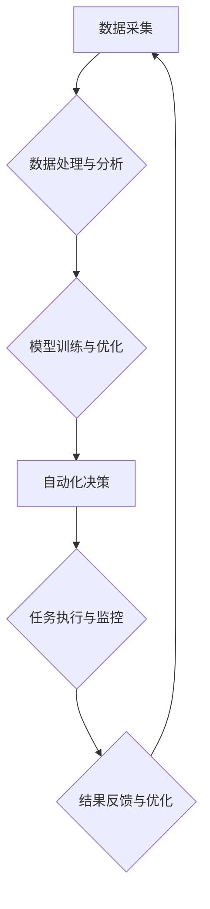

                 

## 从0到1：打造全自动化创业模式

> 关键词：自动化、创业模式、人工智能、机器学习、流程优化、数据驱动、效率提升、可持续发展

### 1. 背景介绍

在当今科技飞速发展的时代，创业者们面临着前所未有的机遇和挑战。传统创业模式的局限性日益凸显，而自动化技术正在为创业者们提供全新的可能性。全自动化创业模式，即通过人工智能、机器学习等技术，实现创业流程的自动化，从产品研发到市场推广，再到客户服务，所有环节都由智能系统完成，极大地提升了创业效率和可持续发展能力。

### 2. 核心概念与联系

**2.1 全自动化创业模式的核心概念**

全自动化创业模式的核心概念在于将创业流程中的重复性、规则性任务自动化，解放人力资源，专注于更具创造性和战略性的工作。

**2.2 全自动化创业模式的架构**



**2.3 核心概念联系**

数据采集、数据处理与分析、模型训练与优化、自动化决策、任务执行与监控、结果反馈与优化，这些环节相互关联，构成一个闭环系统。数据驱动着整个系统的运行，模型训练与优化不断提升系统的智能化水平，自动化决策和任务执行实现流程的自动化，结果反馈与优化则保证系统的持续改进。

### 3. 核心算法原理 & 具体操作步骤

**3.1 算法原理概述**

全自动化创业模式的核心算法主要包括机器学习、深度学习、自然语言处理等人工智能技术。这些算法能够从海量数据中学习模式，自动完成决策和任务执行。

**3.2 算法步骤详解**

1. **数据采集:** 收集与创业模式相关的各种数据，例如市场数据、用户数据、产品数据等。
2. **数据预处理:** 对采集到的数据进行清洗、转换、格式化等处理，使其能够被算法模型所使用。
3. **特征工程:** 从原始数据中提取出具有代表性的特征，这些特征能够反映数据的本质属性，并为算法模型提供输入。
4. **模型选择:** 根据创业模式的特点和需求，选择合适的机器学习算法模型，例如回归模型、分类模型、聚类模型等。
5. **模型训练:** 使用训练数据对选定的算法模型进行训练，使其能够学习数据中的模式和规律。
6. **模型评估:** 使用测试数据对训练好的模型进行评估，评估模型的准确率、效率等指标。
7. **模型优化:** 根据评估结果，对模型参数进行调整，不断优化模型的性能。
8. **模型部署:** 将训练好的模型部署到生产环境中，使其能够实时处理新的数据，并自动完成决策和任务执行。

**3.3 算法优缺点**

**优点:**

* **提高效率:** 自动化流程可以大幅度提高创业效率，解放人力资源，专注于更具战略性的工作。
* **降低成本:** 自动化可以减少人工成本，提高资源利用率，降低创业成本。
* **提升准确性:** 机器学习算法能够从海量数据中学习模式，提高决策的准确性。
* **提供个性化体验:** 通过数据分析，可以为用户提供个性化的产品和服务。

**缺点:**

* **数据依赖:** 机器学习算法依赖于高质量的数据，数据质量直接影响算法的性能。
* **模型复杂性:** 训练和维护复杂的机器学习模型需要专业技术人员。
* **伦理风险:** 自动化决策可能会带来伦理风险，例如算法偏见、数据隐私等问题。

**3.4 算法应用领域**

全自动化创业模式的算法可以应用于创业模式的各个环节，例如：

* **市场调研:** 自动分析市场数据，预测市场趋势，识别潜在客户。
* **产品研发:** 自动生成产品设计方案，优化产品功能，加速产品迭代。
* **营销推广:** 自动化广告投放，精准推送营销信息，提高转化率。
* **客户服务:** 自动回复客户咨询，解决常见问题，提升客户满意度。

### 4. 数学模型和公式 & 详细讲解 & 举例说明

**4.1 数学模型构建**

全自动化创业模式的数学模型通常基于统计学、概率论和机器学习算法。例如，可以使用回归模型预测市场需求，使用分类模型识别潜在客户，使用聚类模型分析用户行为。

**4.2 公式推导过程**

具体的公式推导过程取决于所使用的算法模型。例如，线性回归模型的损失函数为均方误差，其公式为：

$$
L(w) = \frac{1}{n} \sum_{i=1}^{n} (y_i - \hat{y}_i)^2
$$

其中：

* $L(w)$ 为损失函数
* $w$ 为模型参数
* $n$ 为样本数量
* $y_i$ 为真实值
* $\hat{y}_i$ 为预测值

**4.3 案例分析与讲解**

假设我们想要预测某个产品的销量，可以使用线性回归模型。我们可以收集历史销售数据，包括产品价格、广告投入、季节因素等，作为训练数据。通过训练模型，我们可以得到一个预测公式，例如：

$$
\hat{y} = b_0 + b_1 x_1 + b_2 x_2 + ... + b_n x_n
$$

其中：

* $\hat{y}$ 为预测销量
* $b_0, b_1, b_2, ..., b_n$ 为模型参数
* $x_1, x_2, ..., x_n$ 为输入特征，例如产品价格、广告投入等

通过输入不同的特征值，我们可以预测不同情况下产品的销量。

### 5. 项目实践：代码实例和详细解释说明

**5.1 开发环境搭建**

为了实现全自动化创业模式，我们需要搭建一个开发环境，包括操作系统、编程语言、机器学习框架等。例如，我们可以使用Python语言，结合TensorFlow或PyTorch机器学习框架，搭建一个开发环境。

**5.2 源代码详细实现**

以下是一个简单的代码实例，演示如何使用Python语言和Scikit-learn机器学习库，实现一个简单的客户分类模型：

```python
from sklearn.datasets import load_iris
from sklearn.model_selection import train_test_split
from sklearn.linear_model import LogisticRegression
from sklearn.metrics import accuracy_score

# 加载iris数据集
iris = load_iris()
X = iris.data
y = iris.target

# 将数据划分为训练集和测试集
X_train, X_test, y_train, y_test = train_test_split(X, y, test_size=0.2, random_state=42)

# 创建LogisticRegression模型
model = LogisticRegression()

# 训练模型
model.fit(X_train, y_train)

# 预测测试集结果
y_pred = model.predict(X_test)

# 计算模型准确率
accuracy = accuracy_score(y_test, y_pred)
print(f"模型准确率: {accuracy}")
```

**5.3 代码解读与分析**

这段代码首先加载了iris数据集，然后将数据划分为训练集和测试集。接着，创建了一个LogisticRegression模型，并使用训练集训练模型。最后，使用测试集预测结果，并计算模型的准确率。

**5.4 运行结果展示**

运行这段代码后，会输出模型的准确率。例如，输出结果可能为：

```
模型准确率: 0.975
```

这表示模型在测试集上的准确率为97.5%。

### 6. 实际应用场景

**6.1 市场营销自动化**

全自动化创业模式可以用于市场营销自动化，例如：

* 自动化广告投放: 根据用户数据，自动选择合适的广告平台和广告内容，并进行精准投放。
* 个性化推荐: 根据用户行为数据，自动推荐个性化的产品和服务。
* 邮件营销自动化: 根据用户行为和时间，自动发送个性化的邮件营销信息。

**6.2 产品研发自动化**

全自动化创业模式可以用于产品研发自动化，例如：

* 自动化产品设计: 根据市场需求和用户反馈，自动生成产品设计方案。
* 自动化测试: 自动执行产品测试，提高测试效率和覆盖率。
* 自动化部署: 自动部署产品到生产环境，减少部署时间和风险。

**6.3 客户服务自动化**

全自动化创业模式可以用于客户服务自动化，例如：

* 自动回复客户咨询: 使用聊天机器人自动回复客户常见问题，提高客户服务效率。
* 自动化故障处理: 使用机器学习算法自动识别和处理客户故障，减少人工干预。
* 个性化客户服务: 根据客户数据，提供个性化的客户服务方案。

**6.4 未来应用展望**

随着人工智能技术的不断发展，全自动化创业模式将应用于更多领域，例如：

* 自动化决策: 使用机器学习算法自动完成决策，例如投资决策、招聘决策等。
* 自动化创作: 使用人工智能技术自动创作内容，例如文章、音乐、绘画等。
* 自动化管理: 使用人工智能技术自动管理企业运营，例如财务管理、人力资源管理等。

### 7. 工具和资源推荐

**7.1 学习资源推荐**

* **书籍:**

    * 《深度学习》
    * 《机器学习实战》
    * 《Python机器学习》

* **在线课程:**

    * Coursera: 深度学习、机器学习
    * edX: 人工智能、机器学习
    * Udacity: 机器学习工程师

**7.2 开发工具推荐**

* **编程语言:** Python
* **机器学习框架:** TensorFlow, PyTorch, scikit-learn
* **云平台:** AWS, Azure, Google Cloud

**7.3 相关论文推荐**

* **AlphaGo论文:** https://arxiv.org/abs/1607.02886
* **BERT论文:** https://arxiv.org/abs/1810.04805
* **GPT-3论文:** https://arxiv.org/abs/2005.14165

### 8. 总结：未来发展趋势与挑战

**8.1 研究成果总结**

全自动化创业模式是人工智能技术应用于创业领域的最新成果，它能够极大地提高创业效率和可持续发展能力。

**8.2 未来发展趋势**

未来，全自动化创业模式将朝着以下方向发展：

* **更智能化:** 算法模型将更加智能化，能够更好地理解和处理复杂数据。
* **更个性化:** 系统将能够根据用户的个性化需求提供更加个性化的服务。
* **更安全可靠:** 系统的安全性和可靠性将得到进一步提升，能够更好地应对各种风险挑战。

**8.3 面临的挑战**

全自动化创业模式也面临着一些挑战：

* **数据质量:** 算法模型的性能依赖于高质量的数据，数据质量问题将影响系统的准确性和可靠性。
* **算法解释性:** 许多机器学习算法的决策过程难以解释，这可能会导致信任问题和伦理风险。
* **人才短缺:** 全自动化创业模式需要专业的人才进行开发和维护，人才短缺将成为制约发展的瓶颈。

**8.4 研究展望**

未来，我们需要继续加强对全自动化创业模式的研究，解决算法解释性、数据质量和人才短缺等问题，推动其健康发展。


### 9. 附录：常见问题与解答

**9.1 如何选择合适的算法模型？**

选择合适的算法模型取决于创业模式的特点和需求。例如，如果需要预测连续数值，可以使用回归模型；如果需要分类数据，可以使用分类模型；如果需要发现数据中的聚类结构，可以使用聚类模型。

**9.2 如何保证数据质量？**

数据质量是算法模型性能的关键因素。我们需要采取措施保证数据准确性、完整性和一致性。例如，可以使用数据清洗工具去除脏数据，使用数据验证规则检查数据格式，使用数据标准化方法统一数据格式。

**9.3 如何解决算法解释性问题？**

许多机器学习算法的决策过程难以解释，这可能会导致信任问题和伦理风险。我们可以使用可解释机器学习算法，例如决策树、线性回归等，或者使用模型解释技术，例如SHAP值、LIME等，来提高算法的解释性。


作者：禅与计算机程序设计艺术 / Zen and the Art of Computer Programming 
<end_of_turn>

