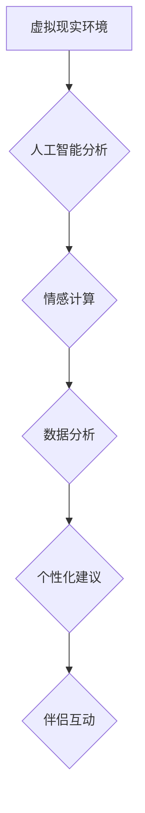

                 

## 元宇宙婚姻咨询:虚拟世界中的伴侣关系维护

> 关键词：元宇宙、婚姻咨询、虚拟现实、人工智能、情感计算、关系维护、数据分析、个性化推荐

## 1. 背景介绍

元宇宙概念的兴起，将虚拟世界与现实世界紧密相连，为人们提供了沉浸式体验和全新的社交方式。伴侣关系在元宇宙中也获得了新的发展空间，虚拟世界提供了更多互动和体验的机会，但也带来了新的挑战。

传统婚姻咨询主要依赖于线下面对面交流，而元宇宙提供了更便捷、更灵活的咨询方式。虚拟环境可以模拟现实场景，帮助伴侣更好地理解彼此的需求和感受，并提供更具针对性的解决方案。

## 2. 核心概念与联系

### 2.1 元宇宙婚姻咨询

元宇宙婚姻咨询是指利用元宇宙技术为伴侣提供情感支持、关系维护和冲突解决等服务。它融合了虚拟现实、人工智能、情感计算等技术，为伴侣提供沉浸式、个性化的咨询体验。

### 2.2 核心技术架构

元宇宙婚姻咨询的核心技术架构包括以下几个方面：

* **虚拟现实技术:** 创建沉浸式的虚拟环境，模拟现实场景，让伴侣在虚拟世界中进行互动和交流。
* **人工智能技术:** 利用自然语言处理、情感识别等技术，分析伴侣的语言和行为，理解他们的情感状态和需求。
* **情感计算技术:** 测量和分析伴侣的情绪变化，提供情感支持和建议。
* **数据分析技术:** 收集和分析伴侣的互动数据，发现关系模式和潜在问题，为咨询提供数据支持。



## 3. 核心算法原理 & 具体操作步骤

### 3.1 算法原理概述

元宇宙婚姻咨询的核心算法主要包括情感识别、关系模式分析和个性化建议生成。

* **情感识别:** 利用深度学习模型分析伴侣的语言和行为，识别他们的情感状态，例如快乐、悲伤、愤怒、焦虑等。
* **关系模式分析:** 利用机器学习算法分析伴侣的互动数据，发现他们的关系模式，例如沟通方式、冲突解决方式、情感表达方式等。
* **个性化建议生成:** 根据情感识别和关系模式分析的结果，生成个性化的建议，帮助伴侣改善沟通、解决冲突、增进感情。

### 3.2 算法步骤详解

1. **数据采集:** 收集伴侣在虚拟环境中的互动数据，包括语音、文本、表情、动作等。
2. **数据预处理:** 对数据进行清洗、格式化和转换，以便于算法分析。
3. **情感识别:** 利用深度学习模型对伴侣的语言和行为进行分析，识别他们的情感状态。
4. **关系模式分析:** 利用机器学习算法对伴侣的互动数据进行分析，发现他们的关系模式。
5. **个性化建议生成:** 根据情感识别和关系模式分析的结果，生成个性化的建议，帮助伴侣改善沟通、解决冲突、增进感情。
6. **建议反馈:** 将建议反馈给伴侣，并根据他们的反馈进行调整和优化。

### 3.3 算法优缺点

**优点:**

* **个性化:** 基于数据分析，提供个性化的建议，更符合伴侣的实际需求。
* **沉浸式体验:** 利用虚拟现实技术，提供沉浸式的咨询体验，更容易让伴侣投入和接受。
* **便捷性:** 随时随地都可以进行咨询，不受时间和地点的限制。

**缺点:**

* **数据隐私:** 需要收集和分析大量的个人数据，需要确保数据安全和隐私保护。
* **算法准确性:** 算法的准确性取决于数据的质量和算法模型的训练，需要不断改进和优化。
* **人机交互:** 虚拟环境无法完全替代现实世界的人际交往，需要考虑如何更好地模拟和引导人机交互。

### 3.4 算法应用领域

元宇宙婚姻咨询算法可以应用于以下领域:

* **在线婚姻咨询平台:** 为伴侣提供虚拟环境下的情感支持和关系维护服务。
* **智能家庭设备:** 利用人工智能技术，帮助家庭成员更好地沟通和协作。
* **教育培训:** 为学生提供虚拟环境下的情感教育和人际交往训练。

## 4. 数学模型和公式 & 详细讲解 & 举例说明

### 4.1 数学模型构建

元宇宙婚姻咨询的数学模型可以基于以下几个方面构建:

* **情感状态模型:** 利用概率论和统计学，构建情感状态的概率分布模型，例如根据伴侣的语言和行为特征，预测他们的情感状态概率。
* **关系模式模型:** 利用图论和网络分析，构建伴侣关系模式的图模型，例如根据伴侣的互动数据，构建他们的关系网络，分析他们的社交关系和情感连接。
* **个性化建议模型:** 利用机器学习算法，构建个性化建议生成模型，例如根据情感状态和关系模式分析的结果，生成针对性的建议。

### 4.2 公式推导过程

例如，我们可以使用贝叶斯定理来推导情感状态的概率分布模型。假设我们有一个情感状态模型，包含以下几个状态:

* $H_1$: 伴侣处于快乐状态
* $H_2$: 伴侣处于悲伤状态
* $H_3$: 伴侣处于愤怒状态

以及一些特征 $F_1$, $F_2$, ..., $F_n$, 这些特征可以是伴侣的语言、行为、表情等。

根据贝叶斯定理，我们可以计算出伴侣处于某个情感状态的概率:

$$P(H_i|F_1, F_2, ..., F_n) = \frac{P(F_1, F_2, ..., F_n|H_i)P(H_i)}{P(F_1, F_2, ..., F_n)}$$

其中:

* $P(H_i|F_1, F_2, ..., F_n)$ 是伴侣处于情感状态 $H_i$ 的概率，给定特征 $F_1, F_2, ..., F_n$。
* $P(F_1, F_2, ..., F_n|H_i)$ 是给定伴侣处于情感状态 $H_i$ 的情况下，观察到特征 $F_1, F_2, ..., F_n$ 的概率。
* $P(H_i)$ 是伴侣处于情感状态 $H_i$ 的先验概率。
* $P(F_1, F_2, ..., F_n)$ 是观察到特征 $F_1, F_2, ..., F_n$ 的概率。

### 4.3 案例分析与讲解

例如，我们可以根据伴侣的语言特征，例如使用积极词汇的频率、表达情感的强度等，来预测他们的情感状态。我们可以训练一个情感识别模型，将语言特征作为输入，输出情感状态的概率分布。

## 5. 项目实践：代码实例和详细解释说明

### 5.1 开发环境搭建

元宇宙婚姻咨询项目可以使用以下开发环境搭建:

* **操作系统:** Windows, macOS, Linux
* **编程语言:** Python, C++, Java
* **虚拟现实框架:** Unity, Unreal Engine
* **人工智能库:** TensorFlow, PyTorch
* **数据库:** MySQL, PostgreSQL

### 5.2 源代码详细实现

以下是一个简单的 Python 代码示例，用于情感识别:

```python
import nltk
from nltk.sentiment import SentimentIntensityAnalyzer

nltk.download('vader_lexicon')

sia = SentimentIntensityAnalyzer()

text = "我今天过得很开心。"

scores = sia.polarity_scores(text)

print(scores)
```

这个代码示例使用 NLTK 库中的 SentimentIntensityAnalyzer 类，对一段文本进行情感分析，并输出情感强度分数。

### 5.3 代码解读与分析

* `nltk.download('vader_lexicon')`: 下载 VADER 词汇库，用于情感分析。
* `sia = SentimentIntensityAnalyzer()`: 创建 SentimentIntensityAnalyzer 对象。
* `text = "我今天过得很开心。"`: 定义需要分析的文本。
* `scores = sia.polarity_scores(text)`: 使用 SentimentIntensityAnalyzer 对象对文本进行情感分析，并返回情感强度分数。
* `print(scores)`: 打印情感强度分数。

### 5.4 运行结果展示

运行上述代码，输出结果如下:

```
{'neg': 0.0, 'neu': 0.292, 'pos': 0.708, 'compound': 0.9023}
```

结果表明，这段文本的情感倾向为积极，情感强度较高。

## 6. 实际应用场景

元宇宙婚姻咨询可以应用于以下实际场景:

* **线上婚姻咨询平台:** 为伴侣提供虚拟环境下的情感支持和关系维护服务。
* **智能家庭设备:** 利用人工智能技术，帮助家庭成员更好地沟通和协作。
* **教育培训:** 为学生提供虚拟环境下的情感教育和人际交往训练。

### 6.4 未来应用展望

未来，元宇宙婚姻咨询将更加智能化、个性化和沉浸式。

* **更精准的情感识别:** 利用更先进的人工智能算法，更加精准地识别伴侣的情感状态。
* **更个性化的建议:** 基于大数据分析，为每个伴侣提供更加个性化的建议。
* **更沉浸式的体验:** 利用增强现实和虚拟现实技术，创造更加沉浸式的虚拟环境，让伴侣更好地体验咨询服务。

## 7. 工具和资源推荐

### 7.1 学习资源推荐

* **书籍:**
    * 《情感计算》
    * 《人工智能》
    * 《元宇宙》
* **在线课程:**
    * Coursera: 人工智能、情感计算
    * edX: 元宇宙、虚拟现实

### 7.2 开发工具推荐

* **虚拟现实框架:** Unity, Unreal Engine
* **人工智能库:** TensorFlow, PyTorch
* **数据库:** MySQL, PostgreSQL

### 7.3 相关论文推荐

* **情感计算:**
    * "Sentiment Analysis Using Deep Learning"
    * "A Survey of Emotion Recognition Using Physiological Signals"
* **元宇宙:**
    * "The Metaverse: A New Paradigm for Human Interaction"
    * "The Future of Work in the Metaverse"

## 8. 总结：未来发展趋势与挑战

### 8.1 研究成果总结

元宇宙婚姻咨询是一个新兴的领域，已经取得了一些初步成果。

* **情感识别技术:** 已经能够识别多种情感状态，并提供一定的准确性。
* **关系模式分析技术:** 已经能够发现一些基本的伴侣关系模式。
* **个性化建议生成技术:** 已经能够生成一些针对性的建议。

### 8.2 未来发展趋势

未来，元宇宙婚姻咨询将朝着以下方向发展:

* **更精准的情感识别:** 利用更先进的人工智能算法，更加精准地识别伴侣的情感状态。
* **更个性化的建议:** 基于大数据分析，为每个伴侣提供更加个性化的建议。
* **更沉浸式的体验:** 利用增强现实和虚拟现实技术，创造更加沉浸式的虚拟环境，让伴侣更好地体验咨询服务。

### 8.3 面临的挑战

元宇宙婚姻咨询也面临一些挑战:

* **数据隐私:** 需要收集和分析大量的个人数据，需要确保数据安全和隐私保护。
* **算法准确性:** 算法的准确性取决于数据的质量和算法模型的训练，需要不断改进和优化。
* **人机交互:** 虚拟环境无法完全替代现实世界的人际交往，需要考虑如何更好地模拟和引导人机交互。

### 8.4 研究展望

未来，我们将继续研究元宇宙婚姻咨询的算法模型、技术架构和应用场景，努力为伴侣提供更智能、更便捷、更有效的婚姻咨询服务。

## 9. 附录：常见问题与解答

### 9.1 元宇宙婚姻咨询是否安全可靠?

元宇宙婚姻咨询平台需要严格遵守数据隐私保护政策，确保用户数据的安全性和可靠性。

### 9.2 元宇宙婚姻咨询是否可以替代传统婚姻咨询?

元宇宙婚姻咨询可以作为一种补充，提供更便捷、更灵活的咨询方式，但无法完全替代传统婚姻咨询。

### 9.3 元宇宙婚姻咨询的费用如何?

元宇宙婚姻咨询平台的费用根据服务内容和时长而有所不同，部分平台提供免费试用服务。


作者：禅与计算机程序设计艺术 / Zen and the Art of Computer Programming 
<end_of_turn>

