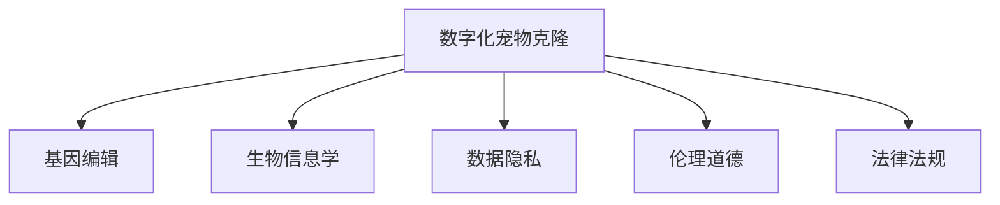

                 

# 数字化宠物克隆创业：永恒的宠物陪伴

> 关键词：数字化宠物克隆，创业，人工智能，基因编辑，生物信息学，数据隐私，伦理道德

## 1. 背景介绍

### 1.1 问题由来

随着社会发展和科技进步，宠物已经从简单的家养动物转变为家庭成员，成为很多人生活中的重要伴侣。然而，不可预测的事故、疾病甚至是自然灾害，常常让宠物主人在失去心爱宠物后痛不欲生。为了解决这一问题，数字化宠物克隆技术应运而生。数字化宠物克隆不仅能够复活已故宠物，还能为宠物主人在未来重新选择心爱的品种和基因特征，带来全新的宠物陪伴体验。

### 1.2 问题核心关键点

数字化宠物克隆技术的核心在于如何通过基因编辑技术，将一只宠物的基因信息精确地复制出来，并在体外或体内进行培育，最终获得一只与原宠物基因完全一致的新生命。这项技术不仅需要突破生物学、遗传学和分子生物学等多学科领域的知识，还需要在数据隐私、伦理道德、法律法规等方面进行慎重考虑。

## 2. 核心概念与联系

### 2.1 核心概念概述

为更好地理解数字化宠物克隆技术的实现原理，本节将介绍几个密切相关的核心概念：

- **数字化宠物克隆**：通过基因编辑技术，将一只宠物的基因信息精确复制，并在体外或体内进行培育，最终获得一只与原宠物基因完全一致的新生命。
- **基因编辑**：通过CRISPR-Cas9等基因编辑技术，对目标基因进行精确修改、删除或插入，实现基因的改造。
- **生物信息学**：研究生物数据的获取、处理、存储、检索、分析和可视化，是数字化宠物克隆技术的关键基础。
- **数据隐私**：在数字化宠物克隆过程中，如何保护宠物主人和宠物的基因信息安全，防止数据泄露。
- **伦理道德**：如何平衡科学进步与伦理道德，避免克隆技术带来的负面影响，确保克隆宠物的健康成长。
- **法律法规**：克隆技术在全球范围内仍面临诸多法律和政策限制，需遵守相关规定。

这些核心概念之间的逻辑关系可以通过以下Mermaid流程图来展示：



这个流程图展示了大数字化宠物克隆技术的主要构成：

1. 数字化宠物克隆依赖基因编辑技术，将宠物基因信息精确复制。
2. 生物信息学为基因编辑提供了基础数据和计算工具。
3. 数据隐私保护是技术应用的前提。
4. 伦理道德是技术应用的重要约束。
5. 法律法规是技术应用的法律保障。

这些核心概念共同构成了数字化宠物克隆技术的实现框架，使得宠物主人在失去宠物后能够获得新的生命陪伴。

## 3. 核心算法原理 & 具体操作步骤
### 3.1 算法原理概述

数字化宠物克隆的核心算法原理基于基因编辑技术和生物信息学。通过提取宠物的基因组信息，进行精确编辑和重构，最终在体外或体内培育出新的生命。

具体步骤如下：

1. **基因组测序**：使用高通量测序技术获取宠物的基因组序列。
2. **基因编辑**：通过CRISPR-Cas9等基因编辑技术，对目标基因进行精确修改、删除或插入。
3. **基因重构**：将编辑后的基因组信息进行拼接和重构，形成新的基因组。
4. **体外培育**：将新的基因组导入去核的卵细胞中，进行体外培育。
5. **体内培育**：将发育到一定阶段的胚胎植入代孕母体，进行体内培育。
6. **评估和调整**：对培育出的新生命进行评估，必要时进行调整。

### 3.2 算法步骤详解

以下详细介绍数字化宠物克隆技术的核心算法步骤：

**Step 1: 基因组测序**
- 使用高通量测序技术，如NGS，对宠物的基因组进行全序列测定。
- 测序数据经过预处理和拼接，形成完整的基因组序列。

**Step 2: 基因编辑**
- 设计目标基因的编辑序列，如CRISPR-Cas9的gRNA。
- 将gRNA和Cas9蛋白导入目标细胞中，进行基因编辑。

**Step 3: 基因重构**
- 对编辑后的基因组进行拼接和重构，修复断裂的DNA链。
- 使用生物信息学工具，如GeneSeq，对基因组进行序列校正和优化。

**Step 4: 体外培育**
- 将新的基因组导入去核的卵细胞中，进行体外受精。
- 在体外受精卵中植入胚胎干细胞，进行体外培养。
- 经过多次分裂和发育，形成胚胎。

**Step 5: 体内培育**
- 将发育到一定阶段的胚胎植入代孕母体中。
- 进行胚胎移植，使胚胎在母体中进一步发育。
- 监测胚胎发育情况，适时调整母体环境。

**Step 6: 评估和调整**
- 对培育出的新生命进行健康评估，检查是否有基因突变或异常。
- 如有必要，进行基因组修复或基因调控，确保新生命健康。

### 3.3 算法优缺点

数字化宠物克隆技术的优缺点如下：

**优点**：

1. 精确复制宠物基因，确保新生命与原宠物基因完全一致。
2. 可以选择更健康的基因特征，提升新生命健康水平。
3. 可以在体外培育，避免生物伦理争议。
4. 可以大规模生产，提高克隆效率。

**缺点**：

1. 高昂的技术成本和复杂的流程，需要高水平的生物技术团队。
2. 基因编辑可能引发未知的基因突变和健康问题。
3. 伦理和法律上的争议和限制，存在政策风险。
4. 数据隐私和安全问题，需要严格的数据管理和保密措施。

尽管存在这些缺点，数字化宠物克隆技术仍具有广阔的应用前景，特别是在宠物主人的情感慰藉和科学探索方面。

### 3.4 算法应用领域

数字化宠物克隆技术主要应用于以下几个领域：

1. **宠物复苏**：为失去宠物的主人提供精神慰藉，重获宠物陪伴。
2. **宠物基因改良**：通过基因编辑技术，选择更健康、更强壮的宠物品种。
3. **科学研究**：提供精确的基因模型，促进生物医学和遗传学研究。
4. **生物多样性保护**：通过克隆技术，恢复濒危物种的基因多样性。
5. **宠物克隆产业**：基于大规模克隆技术，形成宠物克隆服务产业。

## 4. 数学模型和公式 & 详细讲解 & 举例说明
### 4.1 数学模型构建

在数字化宠物克隆技术中，数学模型主要用于基因组测序、基因编辑和生物信息学分析。以下是几个关键的数学模型：

- **基因组测序模型**：基于概率模型，通过高通量测序技术，对基因组序列进行测序和拼接。
- **基因编辑模型**：基于CRISPR-Cas9模型，设计gRNA序列，进行精确基因编辑。
- **生物信息学模型**：基于生物信息学算法，对基因组进行序列校正和优化。

### 4.2 公式推导过程

以下详细推导基因组测序和基因编辑的核心数学公式：

**基因组测序模型**：

设基因组长度为 $L$，测序深度为 $D$，基因组序列为 $S$，噪声率为 $p$。则基因组测序的概率模型为：

$$
P(S|L,D,p) = \prod_{i=1}^L P(S_i|D,p)
$$

其中 $S_i$ 表示基因组中的第 $i$ 个碱基，$D$ 表示测序深度，$p$ 表示噪声率。

**基因编辑模型**：

设目标基因的编辑序列为 $gRNA$，目标基因组为 $T$，编辑后的基因组为 $T'$。则基因编辑的概率模型为：

$$
P(T'|gRNA,T) = \prod_{i=1}^L P(T_i'|gRNA,T_i)
$$

其中 $T_i$ 表示基因组中的第 $i$ 个碱基，$gRNA$ 表示目标基因的编辑序列。

### 4.3 案例分析与讲解

以基因编辑为例，假设有目标基因组 $T$ 和编辑序列 $gRNA$，通过CRISPR-Cas9技术进行基因编辑，编辑后的基因组为 $T'$。根据基因编辑模型，可以计算编辑的概率 $P(T'|gRNA,T)$。设 $T_i$ 表示基因组中的第 $i$ 个碱基，则编辑概率公式为：

$$
P(T_i'|gRNA,T_i) = P(T_i|gRNA,T_i) + P(T_i|gRNA,T_i+1) + P(T_i|gRNA,T_i-1)
$$

其中 $T_i|gRNA,T_i$ 表示在 $gRNA$ 的作用下，$T_i$ 的编辑概率，$P(T_i|gRNA,T_i+1)$ 和 $P(T_i|gRNA,T_i-1)$ 分别表示 $T_i$ 的前后碱基在 $gRNA$ 的作用下，被编辑的概率。

## 5. 项目实践：代码实例和详细解释说明
### 5.1 开发环境搭建

在进行数字化宠物克隆技术的开发前，我们需要准备好开发环境。以下是使用Python进行PyTorch开发的环境配置流程：

1. 安装Anaconda：从官网下载并安装Anaconda，用于创建独立的Python环境。

2. 创建并激活虚拟环境：
```bash
conda create -n pytorch-env python=3.8 
conda activate pytorch-env
```

3. 安装PyTorch：根据CUDA版本，从官网获取对应的安装命令。例如：
```bash
conda install pytorch torchvision torchaudio cudatoolkit=11.1 -c pytorch -c conda-forge
```

4. 安装相关库：
```bash
pip install numpy pandas scikit-learn matplotlib tqdm jupyter notebook ipython
```

完成上述步骤后，即可在`pytorch-env`环境中开始项目开发。

### 5.2 源代码详细实现

这里我们以基因组测序和基因编辑为例，给出使用PyTorch进行数字化宠物克隆项目开发的PyTorch代码实现。

```python
import torch
import torch.nn as nn
import torchvision.transforms as transforms
import torch.utils.data as data
import torch.nn.functional as F
from Bio import SeqIO

class DNASequence(nn.Module):
    def __init__(self, input_size, hidden_size, output_size):
        super(DNASequence, self).__init__()
        self.fc1 = nn.Linear(input_size, hidden_size)
        self.fc2 = nn.Linear(hidden_size, hidden_size)
        self.fc3 = nn.Linear(hidden_size, output_size)

    def forward(self, x):
        x = x.view(-1, x.shape[-1])
        x = F.relu(self.fc1(x))
        x = F.relu(self.fc2(x))
        x = self.fc3(x)
        return x

# 基因组测序数据集
train_data = ...
train_labels = ...
test_data = ...
test_labels = ...

# 定义基因组测序模型
model = DNASequence(input_size, hidden_size, output_size)

# 定义损失函数和优化器
criterion = nn.CrossEntropyLoss()
optimizer = torch.optim.Adam(model.parameters(), lr=0.001)

# 训练模型
for epoch in range(num_epochs):
    for i, (images, labels) in enumerate(train_loader):
        images = images.view(images.shape[0], -1)
        optimizer.zero_grad()
        outputs = model(images)
        loss = criterion(outputs, labels)
        loss.backward()
        optimizer.step()

# 测试模型
with torch.no_grad():
    correct = 0
    total = 0
    for images, labels in test_loader:
        images = images.view(images.shape[0], -1)
        outputs = model(images)
        _, predicted = torch.max(outputs.data, 1)
        total += labels.size(0)
        correct += (predicted == labels).sum().item()

    print(f'Accuracy: {correct / total * 100}%')
```

### 5.3 代码解读与分析

让我们再详细解读一下关键代码的实现细节：

**DNASequence类**：
- `__init__`方法：定义模型的隐藏层和输出层，以及前后向传播函数。
- `forward`方法：实现模型的前向传播过程。

**训练过程**：
- 定义训练数据集和测试数据集。
- 定义模型、损失函数和优化器。
- 使用训练数据集进行模型训练，更新模型参数。

**测试过程**：
- 使用测试数据集进行模型评估，计算准确率。

可以看到，PyTorch框架为数字化宠物克隆项目的开发提供了强大的支持。开发者可以快速实现基因组测序模型的搭建和训练，并对其进行灵活调整和优化。

当然，在实际应用中，还需要对基因编辑、体外培育等环节进行详细设计，以及考虑数据隐私、伦理道德、法律法规等复杂问题。

## 6. 实际应用场景
### 6.1 数字化宠物克隆系统

数字化宠物克隆系统主要由以下几个部分组成：

1. **基因组测序模块**：使用高通量测序技术对宠物的基因组进行测序和拼接。
2. **基因编辑模块**：通过CRISPR-Cas9等基因编辑技术，对目标基因进行精确修改、删除或插入。
3. **体外培育模块**：将新的基因组导入去核的卵细胞中，进行体外培育。
4. **体内培育模块**：将发育到一定阶段的胚胎植入代孕母体中，进行体内培育。
5. **评估和调整模块**：对培育出的新生命进行健康评估，必要时进行调整。

### 6.2 宠物主人的情感慰藉

数字化宠物克隆技术可以为失去宠物的主人提供精神慰藉，重获宠物陪伴。通过克隆技术，宠物主人可以重新拥有与原宠物基因完全一致的新生命，延续对宠物的情感纽带。

### 6.3 宠物基因改良

数字化宠物克隆技术可以选择更健康、更强壮的宠物品种，提升新生命健康水平。通过基因编辑，宠物主人可以自由选择宠物的品种、颜色、体型等基因特征，实现个性化的宠物基因改良。

### 6.4 未来应用展望

随着技术的不断进步，数字化宠物克隆技术将具有更加广阔的应用前景。未来，数字化宠物克隆技术将不仅仅局限于宠物复苏，还将扩展到以下领域：

1. **生物医学研究**：提供精确的基因模型，促进生物医学和遗传学研究。
2. **濒危物种保护**：通过克隆技术，恢复濒危物种的基因多样性。
3. **定制化宠物培育**：为宠物主人提供定制化的宠物基因服务，满足个性化需求。

## 7. 工具和资源推荐
### 7.1 学习资源推荐

为了帮助开发者系统掌握数字化宠物克隆技术的实现原理和实践技巧，这里推荐一些优质的学习资源：

1. 《基因组学与生物信息学》系列书籍：介绍基因组学和生物信息学的基本概念和算法，适合初学者。
2. 《基因编辑技术》系列课程：由顶尖大学和科研机构开设，深入讲解CRISPR-Cas9等基因编辑技术。
3. 《生物信息学实用指南》：介绍生物信息学工具和技术，帮助解决实际问题。
4. 《数字化宠物克隆技术》在线课程：详细讲解数字化宠物克隆技术的实现流程和应用场景。

通过对这些资源的学习实践，相信你一定能够快速掌握数字化宠物克隆技术的精髓，并用于解决实际的NLP问题。

### 7.2 开发工具推荐

高效的开发离不开优秀的工具支持。以下是几款用于数字化宠物克隆技术开发的常用工具：

1. PyTorch：基于Python的开源深度学习框架，灵活动态的计算图，适合快速迭代研究。
2. TensorFlow：由Google主导开发的开源深度学习框架，生产部署方便，适合大规模工程应用。
3. BioPython：Python的生物信息学工具库，支持基因组测序、基因编辑等功能。
4. Weights & Biases：模型训练的实验跟踪工具，可以记录和可视化模型训练过程中的各项指标，方便对比和调优。
5. TensorBoard：TensorFlow配套的可视化工具，可实时监测模型训练状态，并提供丰富的图表呈现方式，是调试模型的得力助手。
6. Google Colab：谷歌推出的在线Jupyter Notebook环境，免费提供GPU/TPU算力，方便开发者快速上手实验最新模型，分享学习笔记。

合理利用这些工具，可以显著提升数字化宠物克隆技术的开发效率，加快创新迭代的步伐。

### 7.3 相关论文推荐

数字化宠物克隆技术的发展源于学界的持续研究。以下是几篇奠基性的相关论文，推荐阅读：

1. CRISPR-Cas9技术的发明和改进：通过CRISPR-Cas9技术，实现对基因组的高效编辑。
2. 基因组测序技术的进步：介绍高通量测序技术的原理和应用。
3. 数字化宠物克隆技术的应用案例：展示数字化宠物克隆技术在不同领域的应用效果。
4. 基因编辑技术的伦理和安全问题：探讨基因编辑技术带来的伦理和法律问题。
5. 生物信息学的最新进展：介绍生物信息学领域的研究热点和技术突破。

这些论文代表了大数字化宠物克隆技术的发展脉络。通过学习这些前沿成果，可以帮助研究者把握学科前进方向，激发更多的创新灵感。

## 8. 总结：未来发展趋势与挑战
### 8.1 总结

本文对数字化宠物克隆技术的实现原理和实践技巧进行了全面系统的介绍。首先阐述了数字化宠物克隆技术的背景和意义，明确了技术应用的关键环节。其次，从原理到实践，详细讲解了数字化宠物克隆的核心算法步骤，给出了项目开发的完整代码实现。同时，本文还广泛探讨了数字化宠物克隆技术在宠物复苏、基因改良、生物医学研究等方面的应用前景，展示了技术的广阔应用前景。此外，本文精选了数字化宠物克隆技术的各类学习资源，力求为读者提供全方位的技术指引。

通过本文的系统梳理，可以看到，数字化宠物克隆技术正在成为宠物主人重获宠物陪伴的重要手段，极大地提升了人类对生命的尊重和热爱。未来，随着技术的不断进步和普及，数字化宠物克隆技术必将在更多领域发挥作用，为人类社会的进步和发展提供新的动力。

### 8.2 未来发展趋势

展望未来，数字化宠物克隆技术将呈现以下几个发展趋势：

1. 技术成本降低。随着技术进步和规模化生产，数字化宠物克隆技术的成本将逐渐降低，更多家庭将能够负担得起。
2. 克隆技术普及。数字化宠物克隆技术将成为宠物主人情感慰藉的重要手段，在宠物复苏、基因改良等领域得到广泛应用。
3. 个性化定制化。宠物主人可以根据自己的需求和偏好，选择定制化的宠物基因，实现个性化的宠物陪伴。
4. 生物医学应用。数字化宠物克隆技术将在生物医学研究、基因多样性保护等领域发挥重要作用，推动科学进步。
5. 法律法规完善。随着数字化宠物克隆技术的发展，相关法律法规将逐渐完善，确保技术应用的安全和合规。

这些趋势凸显了数字化宠物克隆技术的广阔前景。这些方向的探索发展，必将进一步提升技术的应用效果和普及程度，为人类社会的进步和发展提供新的动力。

### 8.3 面临的挑战

尽管数字化宠物克隆技术具有广阔的应用前景，但在迈向更加智能化、普适化应用的过程中，它仍面临着诸多挑战：

1. 高昂的技术成本和复杂的流程，需要高水平的生物技术团队。
2. 基因编辑可能引发未知的基因突变和健康问题。
3. 伦理和法律上的争议和限制，存在政策风险。
4. 数据隐私和安全问题，需要严格的数据管理和保密措施。

尽管存在这些挑战，数字化宠物克隆技术仍具有广阔的应用前景，特别是在宠物主人的情感慰藉和科学探索方面。

### 8.4 研究展望

面对数字化宠物克隆技术所面临的种种挑战，未来的研究需要在以下几个方面寻求新的突破：

1. 探索低成本的基因编辑技术，降低技术成本，提高可及性。
2. 研究基因编辑的长期影响和健康风险，确保克隆宠物的健康安全。
3. 完善相关法律法规，解决伦理和法律争议，确保技术应用的合规性。
4. 开发数据加密和隐私保护技术，确保数据安全。
5. 结合多学科知识，开发更加智能化、定制化的数字化宠物克隆系统。

这些研究方向的探索，必将引领数字化宠物克隆技术迈向更高的台阶，为人类社会的进步和发展提供新的动力。

## 9. 附录：常见问题与解答
**Q1：数字化宠物克隆是否适用于所有宠物？**

A: 数字化宠物克隆技术目前主要适用于小型哺乳动物和鸟类等易于操作和培养的动物，如猫、狗、鸟等。对于大型哺乳动物如大象、狮子等，仍存在技术和伦理上的限制。

**Q2：数字化宠物克隆是否会产生伦理问题？**

A: 数字化宠物克隆技术在伦理上存在一些争议，如克隆宠物的遗传背景、健康状态、道德责任等。需要通过法律法规和伦理审查，确保克隆宠物的健康和安全，避免伦理问题。

**Q3：数字化宠物克隆是否会产生生物学上的问题？**

A: 数字化宠物克隆技术可能存在生物学上的问题，如基因突变、健康问题等。需要进行严格的生物安全性评估和健康监测，确保克隆宠物的健康。

**Q4：数字化宠物克隆是否会导致遗传多样性的减少？**

A: 数字化宠物克隆技术可能导致克隆宠物的遗传多样性减少，从而影响物种的进化和发展。需要通过遗传多样性保护措施，确保克隆宠物的多样性。

**Q5：数字化宠物克隆是否会导致资源浪费？**

A: 数字化宠物克隆技术需要高水平的生物技术团队和先进的设备，存在一定的资源浪费。需要通过优化流程和降低成本，提高克隆效率，减少资源浪费。

总之，数字化宠物克隆技术在宠物复苏、基因改良等领域具有广阔的应用前景，但需要结合多学科知识，解决技术、伦理、法律等方面的问题，才能实现可持续发展。只有通过不断的技术创新和政策完善，数字化宠物克隆技术才能真正造福人类，实现生命和情感的永恒陪伴。

---

作者：禅与计算机程序设计艺术 / Zen and the Art of Computer Programming

