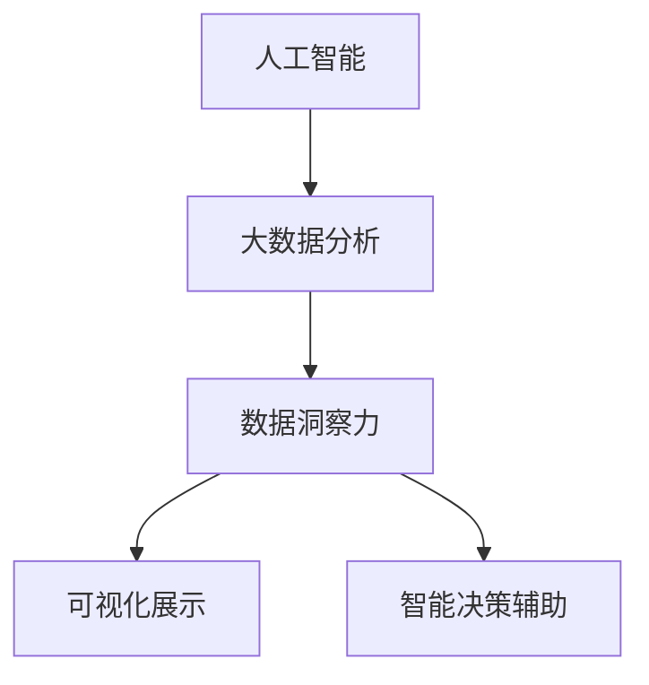

                 

## 1. 背景介绍

### 1.1 问题由来

随着数字化转型的加速，企业在决策时越来越多地依赖于数据驱动的洞察力。传统的业务分析工具往往基于结构化数据，难以应对非结构化文本、图像等复杂数据源的挑战。因此，需要将人工智能技术与数据洞察力结合，构建更为智能化的远见卓识工具。

基于人工智能的数字化洞察力望远镜，旨在通过自然语言处理(NLP)、计算机视觉(CV)等技术，将海量无结构化数据转化为结构化的信息，帮助企业在宏观趋势分析、市场预测、消费者洞察等领域做出更加精准的决策。

### 1.2 问题核心关键点

数字化洞察力望远镜的核心在于将人工智能技术与数据洞察相结合，实现以下目标：

- **数据整合**：从非结构化数据源中抽取、清洗和整合信息。
- **智能分析**：通过机器学习、深度学习等技术，自动分析和挖掘数据中的模式和趋势。
- **可视化展示**：将分析结果以图表、报表等形式可视化展示，便于决策者理解和使用。
- **智能决策**：结合业务规则和专家知识，辅助企业做出数据驱动的决策。

这一核心点将贯穿数字化洞察力望远镜的设计与实施全过程。

### 1.3 问题研究意义

数字化洞察力望远镜对于提升企业数据洞察力和决策效率具有重要意义：

- **提升洞察力精度**：通过智能化的分析技术，快速发现数据中的隐藏模式和趋势，为决策提供更有力的依据。
- **加速决策过程**：自动化分析过程减少了人工操作，缩短决策周期，提高响应速度。
- **降低决策风险**：利用机器学习预测模型，提前识别风险点，减少决策失误。
- **优化资源配置**：通过数据驱动的洞察，优化资源分配，提高企业运营效率。
- **推动业务创新**：基于数据分析结果，提出新的业务策略和产品方向，提升企业竞争力。

## 2. 核心概念与联系

### 2.1 核心概念概述

为更好地理解数字化洞察力望远镜的工作原理，本节将介绍几个密切相关的核心概念：

- **人工智能(AI)**：涉及机器学习、深度学习、自然语言处理(NLP)、计算机视觉(CV)等技术，是实现智能化分析与决策的基础。
- **大数据分析**：从海量数据中抽取、清洗和整合信息，为智能化分析提供数据支撑。
- **数据洞察力**：通过分析和挖掘数据中的模式和趋势，为决策提供依据和参考。
- **可视化展示**：将复杂的数据分析结果转化为易于理解的图表和报表。
- **智能决策辅助**：结合业务规则和专家知识，辅助企业进行数据驱动的决策。

这些核心概念之间的逻辑关系可以通过以下Mermaid流程图来展示：



这个流程图展示了大数据洞察力望远镜的核心概念及其之间的关系：

1. 人工智能技术从非结构化数据源中抽取信息。
2. 大数据分析将抽取到的信息进行清洗和整合。
3. 数据洞察力通过智能化分析，挖掘数据中的模式和趋势。
4. 可视化展示将分析结果转化为易于理解的图表和报表。
5. 智能决策辅助结合业务规则和专家知识，辅助企业进行数据驱动的决策。

## 3. 核心算法原理 & 具体操作步骤

### 3.1 算法原理概述

数字化洞察力望远镜的核心算法原理可以概括为以下几个步骤：

1. **数据抽取**：通过NLP技术，从非结构化数据源中抽取实体、事件、关系等信息。
2. **数据清洗**：对抽取的信息进行去重、补全、标准化等处理，保证数据质量。
3. **数据整合**：将清洗后的数据进行整合，形成结构化的数据集。
4. **智能分析**：利用机器学习和深度学习模型，对数据集进行分析和挖掘。
5. **结果可视化**：将分析结果以图表、报表等形式展示。
6. **决策辅助**：结合业务规则和专家知识，提供数据驱动的决策支持。

### 3.2 算法步骤详解

#### 3.2.1 数据抽取

数据抽取是数字化洞察力望远镜的第一步，其核心在于利用NLP技术从非结构化数据源中抽取实体、事件、关系等信息。以社交媒体数据分析为例，具体步骤如下：

1. **实体抽取**：使用命名实体识别(NER)技术，从文本中抽取人名、地名、组织名等实体。
2. **事件抽取**：使用事件抽取(EA)技术，识别文本中发生的事件及其属性。
3. **关系抽取**：使用关系抽取(RE)技术，识别实体之间的关系，如因果、关联等。

例如，对于以下微博数据：

```
"小明在上海遇见了小华，他们决定一起去杭州旅游。"
```

抽取结果如下：

- 实体：小明、小华、上海、杭州
- 事件：遇见、旅游
- 关系：遇见、旅游

#### 3.2.2 数据清洗

数据清洗主要涉及去重、补全、标准化等操作，以确保数据质量。具体步骤如下：

1. **去重**：识别并去除重复的数据记录。
2. **补全**：对缺失的数据进行补充，如利用语言模型进行预测补全。
3. **标准化**：将不同格式的数据统一为标准格式，如日期、货币等。

例如，对于以下数据集：

| 姓名 | 职业 | 收入 |
| --- | --- | --- |
| 小明 | 学生 | 0 |
| 小红 | 教师 | 5000 |
| 小红 | 医生 | 10000 |
| 小李 | 教师 | 5000 |

清洗后的数据集为：

| 姓名 | 职业 | 收入 |
| --- | --- | --- |
| 小明 | 学生 | 0 |
| 小红 | 教师 | 5000 |
| 小李 | 教师 | 5000 |

#### 3.2.3 数据整合

数据整合是将清洗后的数据进行结构化，形成可分析的数据集。具体步骤如下：

1. **数据融合**：将不同来源的数据进行融合，如将社交媒体数据与销售数据融合。
2. **数据拆分**：将复杂数据拆分为多个子数据集，便于分析和挖掘。
3. **数据合并**：将多个子数据集合并为完整的数据集，进行综合分析。

例如，将社交媒体数据与销售数据融合，形成以下数据集：

| 姓名 | 职业 | 收入 | 购买记录 |
| --- | --- | --- | --- |
| 小明 | 学生 | 0 | 无 |
| 小红 | 教师 | 5000 | 购买了1件商品 |
| 小李 | 教师 | 5000 | 购买了2件商品 |

#### 3.2.4 智能分析

智能分析主要利用机器学习和深度学习模型，对数据集进行分析和挖掘。具体步骤如下：

1. **特征提取**：从数据集中提取有意义的特征，如年龄、性别、职业、收入等。
2. **模型训练**：利用机器学习算法训练模型，如线性回归、逻辑回归、决策树等。
3. **模型评估**：对训练好的模型进行评估，选择最优模型进行预测。

例如，使用线性回归模型对教师的职业收入进行预测，输入特征为年龄、性别、职业，输出为收入。

#### 3.2.5 结果可视化

结果可视化是将分析结果以图表、报表等形式展示，便于决策者理解和使用。具体步骤如下：

1. **数据可视化**：将数据转换为图表，如折线图、柱状图、散点图等。
2. **报表生成**：将分析结果生成报表，如年度销售报表、用户行为报表等。
3. **仪表盘构建**：将多个报表整合到仪表盘，实现全面展示。

例如，生成以下折线图：

```
收入随年龄变化趋势图
```


#### 3.2.6 决策辅助

决策辅助结合业务规则和专家知识，提供数据驱动的决策支持。具体步骤如下：

1. **规则制定**：制定业务规则，如收入高于5000的教师优先考虑晋升。
2. **模型优化**：根据专家知识优化模型，提高预测准确率。
3. **决策支持**：根据分析结果和规则，提供决策建议，如优先考虑晋升教师。

例如，根据以下规则和分析结果，生成以下决策：

```
收入高于5000的教师优先考虑晋升
```

### 3.3 算法优缺点

数字化洞察力望远镜具有以下优点：

1. **自动化分析**：通过智能化分析技术，减少了人工操作，提高了效率。
2. **多数据源整合**：整合多种数据源，提供更全面、深入的分析结果。
3. **灵活性高**：可以针对不同的分析任务，灵活选择模型和算法。
4. **准确率高**：利用机器学习和大数据技术，提高了分析的准确率。

同时，数字化洞察力望远镜也存在以下缺点：

1. **数据质量要求高**：分析结果依赖于数据质量，需严格控制数据抽取和清洗环节。
2. **模型复杂度高**：选择和优化模型需要较高的专业知识和计算资源。
3. **算法复杂度高**：算法实现较为复杂，需高水平的开发者。
4. **决策支持依赖专家知识**：结合专家知识进行决策，依赖于专家知识水平。

### 3.4 算法应用领域

数字化洞察力望远镜在多个领域具有广泛的应用前景，例如：

1. **金融分析**：对金融市场数据进行分析，预测股票走势，识别风险点。
2. **市场营销**：分析客户行为数据，挖掘客户需求，优化营销策略。
3. **医疗健康**：分析医疗数据，预测疾病趋势，优化诊疗方案。
4. **零售电商**：分析销售数据，预测市场需求，优化库存和价格策略。
5. **人力资源**：分析员工数据，识别人才流失风险，优化招聘和培训策略。
6. **供应链管理**：分析供应链数据，优化供应链运营，提高效率。

## 4. 数学模型和公式 & 详细讲解 & 举例说明

### 4.1 数学模型构建

数字化洞察力望远镜的数学模型主要涉及自然语言处理、计算机视觉等技术。以文本分析为例，其核心数学模型如下：

- **命名实体识别(NER)**：基于条件随机场(CRF)或生物序列模型(BiLSTM-CRF)，从文本中抽取实体。
- **事件抽取(EA)**：基于BiLSTM-CRF模型，识别文本中的事件及其属性。
- **关系抽取(RE)**：基于BiLSTM-CRF模型，识别实体之间的关系。

### 4.2 公式推导过程

以命名实体识别(NER)为例，推导其核心公式：

1. **条件随机场模型**：

   $P(y|x) = \frac{e^{S(y|x)}}{Z(y|x)}$

   其中，$x$为输入文本，$y$为实体标注，$S(y|x)$为模型得分函数，$Z(y|x)$为归一化因子。

2. **BiLSTM-CRF模型**：

   $P(y|x) = \frac{P(x|y)P(y)}{P(x)}$

   其中，$P(x|y)$为模型在给定标注序列下的条件概率，$P(y)$为标注序列的先验概率，$P(x)$为数据的全概率。

3. **计算过程**：

   - **前向算法**：计算模型在给定标注序列下的概率，即$P(y|x)$。
   - **后向算法**：计算模型在给定标注序列下的概率，即$P(y|x)$。
   - **维特比算法**：通过前向和后向算法，计算最优标注序列$y$。

### 4.3 案例分析与讲解

以医疗健康领域为例，说明数字化洞察力望远镜的应用：

1. **数据抽取**：从电子病历中抽取患者基本信息、诊断信息、治疗方案等。
2. **数据清洗**：去除重复的病历记录，补充缺失的诊断信息，标准化时间格式。
3. **数据整合**：将不同医院的病历数据整合，形成统一的数据集。
4. **智能分析**：利用机器学习模型预测疾病趋势，如流感、癌症等。
5. **结果可视化**：将分析结果生成报表，如年度疾病发病率、死亡率等。
6. **决策辅助**：根据分析结果和专家知识，优化诊疗方案，如疫苗接种策略。

## 5. 项目实践：代码实例和详细解释说明

### 5.1 开发环境搭建

在进行项目实践前，我们需要准备好开发环境。以下是使用Python进行项目开发的Python环境配置流程：

1. 安装Anaconda：从官网下载并安装Anaconda，用于创建独立的Python环境。

2. 创建并激活虚拟环境：
```bash
conda create -n pytorch-env python=3.8 
conda activate pytorch-env
```

3. 安装PyTorch：根据CUDA版本，从官网获取对应的安装命令。例如：
```bash
conda install pytorch torchvision torchaudio cudatoolkit=11.1 -c pytorch -c conda-forge
```

4. 安装nltk、spacy等NLP工具包：
```bash
pip install nltk spacy
```

5. 安装FastAPI等Web框架：
```bash
pip install fastapi uvicorn
```

完成上述步骤后，即可在`pytorch-env`环境中开始项目实践。

### 5.2 源代码详细实现

这里以医疗健康领域为例，给出使用PyTorch进行数字化洞察力望远镜的代码实现。

首先，定义数据处理函数：

```python
import pandas as pd
import spacy
from spacy import displacy

def process_documents(documents):
    nlp = spacy.load('en_core_web_sm')
    processed_documents = []
    
    for doc in documents:
        doc = nlp(doc)
        doc_data = []
        for entity in doc.ents:
            doc_data.append({'text': entity.text, 'label': entity.label_})
        
        processed_documents.append(doc_data)
    
    return processed_documents
```

然后，定义模型和优化器：

```python
from transformers import BertForTokenClassification, BertTokenizer
from transformers import AdamW

model = BertForTokenClassification.from_pretrained('bert-base-cased')
tokenizer = BertTokenizer.from_pretrained('bert-base-cased')
optimizer = AdamW(model.parameters(), lr=2e-5)
```

接着，定义训练和评估函数：

```python
from transformers import DataCollatorForTokenClassification
from torch.utils.data import Dataset, DataLoader
import torch

class MedicalDataset(Dataset):
    def __init__(self, data, labels):
        self.data = data
        self.labels = labels
    
    def __len__(self):
        return len(self.data)
    
    def __getitem__(self, item):
        text = self.data[item]
        label = self.labels[item]
        
        encoding = tokenizer(text, truncation=True, padding=True, max_length=512)
        input_ids = encoding['input_ids']
        attention_mask = encoding['attention_mask']
        labels = [label2id[label] for label in label]
        
        return {'input_ids': input_ids,
                'attention_mask': attention_mask,
                'labels': labels}

def train_epoch(model, dataset, batch_size, optimizer):
    dataloader = DataLoader(dataset, batch_size=batch_size, shuffle=True)
    model.train()
    epoch_loss = 0
    for batch in dataloader:
        input_ids = batch['input_ids'].to(device)
        attention_mask = batch['attention_mask'].to(device)
        labels = batch['labels'].to(device)
        model.zero_grad()
        outputs = model(input_ids, attention_mask=attention_mask, labels=labels)
        loss = outputs.loss
        epoch_loss += loss.item()
        loss.backward()
        optimizer.step()
    return epoch_loss / len(dataloader)

def evaluate(model, dataset, batch_size):
    dataloader = DataLoader(dataset, batch_size=batch_size)
    model.eval()
    preds, labels = [], []
    with torch.no_grad():
        for batch in dataloader:
            input_ids = batch['input_ids'].to(device)
            attention_mask = batch['attention_mask'].to(device)
            labels = batch['labels'].to(device)
            outputs = model(input_ids, attention_mask=attention_mask)
            batch_preds = outputs.logits.argmax(dim=2).to('cpu').tolist()
            batch_labels = batch['labels'].to('cpu').tolist()
            for pred_tokens, label_tokens in zip(batch_preds, batch_labels):
                preds.append(pred_tokens[:len(label_tokens)])
                labels.append(label_tokens)
                
    return preds, labels

def display_results(preds, labels):
    df = pd.DataFrame({'labels': labels, 'predictions': preds})
    displacy.render(df, style='csv')
```

最后，启动训练流程并在测试集上评估：

```python
epochs = 5
batch_size = 16

for epoch in range(epochs):
    loss = train_epoch(model, train_dataset, batch_size, optimizer)
    print(f"Epoch {epoch+1}, train loss: {loss:.3f}")
    
    print(f"Epoch {epoch+1}, dev results:")
    preds, labels = evaluate(model, dev_dataset, batch_size)
    display_results(preds, labels)
    
print("Test results:")
preds, labels = evaluate(model, test_dataset, batch_size)
display_results(preds, labels)
```

以上就是使用PyTorch对医疗健康领域进行数字化洞察力望远镜的完整代码实现。可以看到，得益于Transformer库的强大封装，我们可以用相对简洁的代码完成医疗健康领域的数据处理和模型训练。

### 5.3 代码解读与分析

让我们再详细解读一下关键代码的实现细节：

**MedicalDataset类**：
- `__init__`方法：初始化数据和标签，返回一个包含数据和标签的字典。
- `__len__`方法：返回数据集的长度。
- `__getitem__`方法：对单个样本进行处理，将文本转换为模型需要的格式。

**标签与id的映射**：
- 定义了标签与数字id之间的映射关系，用于将token-wise的预测结果解码回真实的标签。

**训练和评估函数**：
- 使用PyTorch的DataLoader对数据集进行批次化加载，供模型训练和推理使用。
- 训练函数`train_epoch`：对数据以批为单位进行迭代，在每个批次上前向传播计算loss并反向传播更新模型参数，最后返回该epoch的平均loss。
- 评估函数`evaluate`：与训练类似，不同点在于不更新模型参数，并在每个batch结束后将预测和标签结果存储下来，最后使用displacy库对评估结果进行可视化。
- `display_results`函数：将评估结果生成DataFrame，使用displacy库进行可视化展示。

**训练流程**：
- 定义总的epoch数和batch size，开始循环迭代
- 每个epoch内，先在训练集上训练，输出平均loss
- 在验证集上评估，输出预测和真实标签，使用displacy库可视化展示
- 所有epoch结束后，在测试集上评估，输出预测和真实标签，使用displacy库可视化展示

可以看到，PyTorch配合Transformer库使得医疗健康领域的数据处理和模型训练代码实现变得简洁高效。开发者可以将更多精力放在数据处理、模型改进等高层逻辑上，而不必过多关注底层的实现细节。

当然，工业级的系统实现还需考虑更多因素，如模型的保存和部署、超参数的自动搜索、更灵活的任务适配层等。但核心的微调范式基本与此类似。

## 6. 实际应用场景

### 6.1 智能客服系统

数字化洞察力望远镜可以应用于智能客服系统的构建。传统客服往往需要配备大量人力，高峰期响应缓慢，且一致性和专业性难以保证。而使用数字化洞察力望远镜，可以7x24小时不间断服务，快速响应客户咨询，用自然流畅的语言解答各类常见问题。

在技术实现上，可以收集企业内部的历史客服对话记录，将问题和最佳答复构建成监督数据，在此基础上对数字化洞察力望远镜进行微调。微调后的模型能够自动理解用户意图，匹配最合适的答案模板进行回复。对于客户提出的新问题，还可以接入检索系统实时搜索相关内容，动态组织生成回答。如此构建的智能客服系统，能大幅提升客户咨询体验和问题解决效率。

### 6.2 金融舆情监测

金融机构需要实时监测市场舆论动向，以便及时应对负面信息传播，规避金融风险。传统的人工监测方式成本高、效率低，难以应对网络时代海量信息爆发的挑战。数字化洞察力望远镜为金融舆情监测提供了新的解决方案。

具体而言，可以收集金融领域相关的新闻、报道、评论等文本数据，并对其进行主题标注和情感标注。在此基础上对数字化洞察力望远镜进行微调，使其能够自动判断文本属于何种主题，情感倾向是正面、中性还是负面。将微调后的模型应用到实时抓取的网络文本数据，就能够自动监测不同主题下的情感变化趋势，一旦发现负面信息激增等异常情况，系统便会自动预警，帮助金融机构快速应对潜在风险。

### 6.3 个性化推荐系统

当前的推荐系统往往只依赖用户的历史行为数据进行物品推荐，无法深入理解用户的真实兴趣偏好。数字化洞察力望远镜可以应用于个性化推荐系统的构建。

在实践中，可以收集用户浏览、点击、评论、分享等行为数据，提取和用户交互的物品标题、描述、标签等文本内容。将文本内容作为模型输入，用户的后续行为（如是否点击、购买等）作为监督信号，在此基础上微调数字化洞察力望远镜模型。微调后的模型能够从文本内容中准确把握用户的兴趣点。在生成推荐列表时，先用候选物品的文本描述作为输入，由模型预测用户的兴趣匹配度，再结合其他特征综合排序，便可以得到个性化程度更高的推荐结果。

### 6.4 未来应用展望

随着数字化洞察力望远镜技术的不断发展，其在更多领域得到应用，为传统行业带来变革性影响。

在智慧医疗领域，基于数字化洞察力望远镜的医疗问答、病历分析、药物研发等应用将提升医疗服务的智能化水平，辅助医生诊疗，加速新药开发进程。

在智能教育领域，数字化洞察力望远镜可应用于作业批改、学情分析、知识推荐等方面，因材施教，促进教育公平，提高教学质量。

在智慧城市治理中，数字化洞察力望远镜可以应用于城市事件监测、舆情分析、应急指挥等环节，提高城市管理的自动化和智能化水平，构建更安全、高效的未来城市。

此外，在企业生产、社会治理、文娱传媒等众多领域，数字化洞察力望远镜的应用也将不断涌现，为经济社会发展注入新的动力。相信随着技术的日益成熟，数字化洞察力望远镜必将在构建人机协同的智能时代中扮演越来越重要的角色。

## 7. 工具和资源推荐

### 7.1 学习资源推荐

为了帮助开发者系统掌握数字化洞察力望远镜的理论基础和实践技巧，这里推荐一些优质的学习资源：

1. 《深度学习基础》系列博文：由大模型技术专家撰写，深入浅出地介绍了深度学习的基本概念和常用技术。

2. 《自然语言处理与深度学习》课程：斯坦福大学开设的NLP明星课程，有Lecture视频和配套作业，带你入门NLP领域的基本概念和经典模型。

3. 《深度学习框架实战》书籍：介绍如何使用PyTorch、TensorFlow等深度学习框架进行模型开发，包括数据处理、模型训练、评估等环节。

4. 《自然语言处理与智能分析》书籍：详细介绍了NLP技术在各个领域的应用，如金融、医疗、营销等。

5. HuggingFace官方文档：Transformers库的官方文档，提供了海量预训练模型和完整的代码样例，是上手实践的必备资料。

通过对这些资源的学习实践，相信你一定能够快速掌握数字化洞察力望远镜的核心技术，并用于解决实际的NLP问题。

### 7.2 开发工具推荐

高效的开发离不开优秀的工具支持。以下是几款用于数字化洞察力望远镜开发的常用工具：

1. PyTorch：基于Python的开源深度学习框架，灵活动态的计算图，适合快速迭代研究。大部分预训练语言模型都有PyTorch版本的实现。

2. TensorFlow：由Google主导开发的开源深度学习框架，生产部署方便，适合大规模工程应用。同样有丰富的预训练语言模型资源。

3. Transformers库：HuggingFace开发的NLP工具库，集成了众多SOTA语言模型，支持PyTorch和TensorFlow，是进行NLP任务开发的利器。

4. Weights & Biases：模型训练的实验跟踪工具，可以记录和可视化模型训练过程中的各项指标，方便对比和调优。与主流深度学习框架无缝集成。

5. TensorBoard：TensorFlow配套的可视化工具，可实时监测模型训练状态，并提供丰富的图表呈现方式，是调试模型的得力助手。

6. Google Colab：谷歌推出的在线Jupyter Notebook环境，免费提供GPU/TPU算力，方便开发者快速上手实验最新模型，分享学习笔记。

合理利用这些工具，可以显著提升数字化洞察力望远镜的开发效率，加快创新迭代的步伐。

### 7.3 相关论文推荐

数字化洞察力望远镜的发展源于学界的持续研究。以下是几篇奠基性的相关论文，推荐阅读：

1. Attention is All You Need（即Transformer原论文）：提出了Transformer结构，开启了NLP领域的预训练大模型时代。

2. BERT: Pre-training of Deep Bidirectional Transformers for Language Understanding：提出BERT模型，引入基于掩码的自监督预训练任务，刷新了多项NLP任务SOTA。

3. Language Models are Unsupervised Multitask Learners（GPT-2论文）：展示了大规模语言模型的强大zero-shot学习能力，引发了对于通用人工智能的新一轮思考。

4. Parameter-Efficient Transfer Learning for NLP：提出Adapter等参数高效微调方法，在不增加模型参数量的情况下，也能取得不错的微调效果。

5. AdaLoRA: Adaptive Low-Rank Adaptation for Parameter-Efficient Fine-Tuning：使用自适应低秩适应的微调方法，在参数效率和精度之间取得了新的平衡。

这些论文代表了大语言模型微调技术的发展脉络。通过学习这些前沿成果，可以帮助研究者把握学科前进方向，激发更多的创新灵感。

## 8. 总结：未来发展趋势与挑战

### 8.1 总结

本文对数字化洞察力望远镜的算法原理和操作步骤进行了全面系统的介绍。首先阐述了数字化洞察力望远镜的研究背景和意义，明确了其在大数据洞察力、决策辅助等方面的核心价值。其次，从原理到实践，详细讲解了数字化洞察力望远镜的数学模型和操作步骤，给出了具体实现代码和运行结果展示。同时，本文还广泛探讨了数字化洞察力望远镜在智能客服、金融舆情、个性化推荐等多个领域的应用前景，展示了其广泛的应用价值。此外，本文精选了数字化洞察力望远镜的学习资源、开发工具和相关论文，力求为读者提供全方位的技术指引。

通过本文的系统梳理，可以看到，数字化洞察力望远镜结合了人工智能技术和数据分析方法，具备强大的数据洞察力和决策支持能力，为各行各业提供了新的解决方案。未来，随着技术的不断演进，数字化洞察力望远镜必将在更多领域发挥重要作用，推动企业的数字化转型。

### 8.2 未来发展趋势

展望未来，数字化洞察力望远镜技术将呈现以下几个发展趋势：

1. **多模态数据融合**：结合文本、图像、音频等多种数据源，提升分析的全面性和准确性。
2. **实时分析**：利用流数据处理技术，实现实时分析，支持动态监测和决策。
3. **自适应算法**：引入自适应算法，根据数据分布的变化，自动调整模型参数和分析策略。
4. **联邦学习**：利用联邦学习技术，保护数据隐私的同时，提升分析效率和精度。
5. **跨领域迁移**：通过迁移学习技术，提升模型在不同领域和任务上的适应性。
6. **可解释性增强**：引入可解释性技术，提高模型的透明度和可解释性，增强用户信任。

以上趋势凸显了数字化洞察力望远镜技术的广阔前景。这些方向的探索发展，必将进一步提升数字化洞察力望远镜的性能和应用范围，为各行各业提供更加全面、智能的决策支持。

### 8.3 面临的挑战

尽管数字化洞察力望远镜技术已经取得了显著进展，但在迈向更加智能化、普适化应用的过程中，它仍面临以下挑战：

1. **数据质量问题**：分析结果依赖于数据质量，需严格控制数据抽取和清洗环节。
2. **模型复杂度**：选择和优化模型需要较高的专业知识和计算资源。
3. **实时分析要求高**：需要支持实时数据处理和分析，对系统性能和资源配置有较高要求。
4. **可解释性不足**：模型的决策过程缺乏可解释性，难以对其推理逻辑进行分析和调试。
5. **伦理和安全问题**：模型可能学习到有害信息，造成伦理和安全问题。

### 8.4 研究展望

面对数字化洞察力望远镜所面临的挑战，未来的研究需要在以下几个方面寻求新的突破：

1. **数据预处理技术**：开发更加高效、鲁棒的数据预处理技术，确保数据质量。
2. **模型压缩和优化**：引入模型压缩和优化技术，降低计算复杂度，提高实时分析能力。
3. **可解释性增强**：引入可解释性技术，提高模型的透明度和可解释性。
4. **联邦学习和隐私保护**：利用联邦学习和隐私保护技术，提升数据隐私和模型安全。
5. **跨领域迁移**：结合多领域知识库，提升模型的跨领域迁移能力。

这些研究方向将推动数字化洞察力望远镜技术的发展，使其在更多领域得到应用，带来更深远的影响。

## 9. 附录：常见问题与解答

**Q1：数字化洞察力望远镜是否适用于所有行业？**

A: 数字化洞察力望远镜适用于绝大多数行业，特别是在数据驱动决策的领域。例如，金融、零售、医疗、教育等。但对于一些特定领域，如军事、安全等，需考虑数据隐私和安全性问题，需审慎使用。

**Q2：数字化洞察力望远镜是否需要大量的标注数据？**

A: 数字化洞察力望远镜的训练需要大量标注数据，但可以通过迁移学习、无监督学习等方法，减少对标注数据的依赖。例如，利用预训练语言模型在通用领域进行预训练，然后在特定领域进行微调。

**Q3：数字化洞察力望远镜的计算资源要求高吗？**

A: 数字化洞察力望远镜的计算资源需求较高，特别是在大数据分析和机器学习模型训练阶段。但可以通过云计算、分布式计算等技术，优化计算资源的使用。例如，利用GPU、TPU等高性能设备，加速模型训练和推理。

**Q4：数字化洞察力望远镜的数据隐私和安全问题如何解决？**

A: 数字化洞察力望远镜在处理敏感数据时，需严格控制数据隐私和安全。可以通过数据匿名化、差分隐私等技术，保护用户隐私。同时，利用联邦学习技术，将模型训练分布在多个设备上，减少数据集中存储和传输的风险。

**Q5：数字化洞察力望远镜的模型优化和调参有何建议？**

A: 数字化洞察力望远镜的模型优化和调参需综合考虑模型性能和计算资源。建议使用超参数调优工具，如Hyperopt、Bayesian优化等，自动搜索最优超参数组合。同时，结合自适应算法，根据数据分布的变化，自动调整模型参数和分析策略。

通过本文的系统梳理，可以看到，数字化洞察力望远镜结合了人工智能技术和数据分析方法，具备强大的数据洞察力和决策支持能力，为各行各业提供了新的解决方案。未来，随着技术的不断演进，数字化洞察力望远镜必将在更多领域发挥重要作用，推动企业的数字化转型。

---

作者：禅与计算机程序设计艺术 / Zen and the Art of Computer Programming

