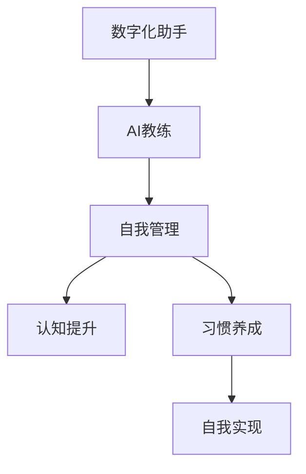

                 

# 数字化自我实现助手：AI辅助的个人成长教练

> 关键词：数字化助手, 人工智能, 个人成长教练, AI, 自我管理, 自我实现, 认知提升, 习惯养成

## 1. 背景介绍

### 1.1 问题由来

在信息化时代，个人成长和自我实现变得更加复杂和多样。如何在繁杂的信息流中保持自我、实现梦想？如何在快节奏的生活中找到平衡、提升效能？AI技术正为这些问题提供一种全新的解答——AI辅助的个人成长教练。

数字化助手和AI教练的出现，是基于人工智能和大数据技术的发展，结合人类行为心理学和认知科学，提供个性化、智能化的成长建议和指导。它们能够从海量数据中提取模式和趋势，提供符合个体需求的学习、工作和生活的优化方案，帮助人们实现自我超越和全面发展。

### 1.2 问题核心关键点

数字化自我实现助手的核心在于如何结合AI技术和心理学原理，构建一个智能、定制化的个人成长系统。关键点包括：

- **个性化定制**：根据用户的行为和偏好，提供定制化的成长计划和学习资源。
- **数据驱动**：通过收集和分析用户数据，持续改进成长方案。
- **动态适应**：能够根据用户反馈和状态调整建议，动态适应成长需求。
- **系统性整合**：整合学习、工作、健康等多个维度的建议，提供全面的成长方案。
- **自我激励**：通过及时反馈和正向激励，增强用户的自我驱动力。

## 2. 核心概念与联系

### 2.1 核心概念概述

为更好地理解数字化自我实现助手的原理和架构，本节将介绍几个关键概念：

- **数字化助手**：基于人工智能技术的助手，能够提供个性化建议、自动化任务执行等功能，帮助用户高效管理生活。
- **AI教练**：通过分析用户数据，提供专业化的成长建议和指导，帮助用户实现自我提升。
- **自我管理**：通过目标设定、时间管理、习惯养成等方法，提升个人效率和效能。
- **认知提升**：通过学习新知识和技能，提升认知能力和思维水平。
- **习惯养成**：通过建立良好的习惯，形成高效、自律的生活模式。
- **自我实现**：通过追求自我价值和目标，实现个人成长和全面发展。

这些核心概念之间的逻辑关系可以通过以下Mermaid流程图来展示：



这个流程图展示了从数字化助手到AI教练，再到自我管理、认知提升、习惯养成，最终实现自我实现的成长路径。

## 3. 核心算法原理 & 具体操作步骤
### 3.1 算法原理概述

数字化自我实现助手的核心算法原理基于推荐系统和个性化学习。其核心思想是：通过收集用户的行为数据，分析用户偏好和需求，推荐最适合的成长建议和学习资源，帮助用户实现自我提升。

具体而言，数字化自我实现助手一般包括以下几个步骤：

1. **数据收集**：收集用户在学习、工作、生活中的各项数据，如阅读记录、工作日志、健康数据等。
2. **模型训练**：使用机器学习算法，训练用户行为模型，识别用户的学习模式和偏好。
3. **内容推荐**：根据用户行为模型，推荐个性化的学习资源、任务安排和生活建议。
4. **反馈调整**：根据用户的反馈和实际效果，调整推荐算法和内容，优化个性化方案。

### 3.2 算法步骤详解

以下详细讲解基于机器学习的数字化自我实现助手的具体操作步骤：

**Step 1: 数据收集与处理**

- **数据类型**：用户在学习、工作、健康、社交等各个方面的数据，包括文本、时间戳、数值、布尔值等。
- **数据采集方式**：通过应用内记录、外部API、手动输入等方式，持续收集用户数据。
- **数据存储与管理**：使用数据库（如MySQL、MongoDB等）存储和管理用户数据，确保数据的安全性和隐私性。

**Step 2: 特征工程与用户画像**

- **特征提取**：从原始数据中提取有意义的特征，如阅读时长、锻炼频率、工作节奏等。
- **用户画像**：根据用户行为数据，构建用户画像，识别用户的兴趣、需求和挑战。
- **行为预测**：使用预测模型（如随机森林、XGBoost等）预测用户的行为趋势，识别成长的关键节点和转折点。

**Step 3: 个性化推荐算法**

- **推荐模型**：选择合适的推荐算法（如协同过滤、基于内容的推荐、深度学习等），生成个性化的学习、工作和健康建议。
- **推荐引擎**：使用推荐系统引擎（如TensorFlow、PyTorch等）实现推荐算法，实时生成推荐内容。
- **推荐展示**：将推荐内容展示给用户，可以通过应用界面、邮件、推送等方式进行展示。

**Step 4: 用户反馈与模型优化**

- **用户反馈**：收集用户对推荐内容的反馈，包括满意度、完成度、建议等。
- **模型优化**：根据用户反馈，调整推荐算法和内容，优化个性化方案。
- **动态调整**：根据用户状态和目标变化，动态调整成长计划，持续提供符合需求的建议。

### 3.3 算法优缺点

数字化自我实现助手的优点包括：

- **个性化程度高**：通过收集和分析用户数据，提供高度个性化的成长方案。
- **持续改进**：基于用户反馈不断优化推荐算法，提升用户体验。
- **全面覆盖**：整合学习、工作、健康等多个维度的建议，提供全面的成长支持。
- **智能化决策**：通过机器学习算法，实现智能化的决策和推荐。

但该方法也存在一些缺点：

- **数据隐私问题**：收集和存储用户数据可能涉及隐私泄露的风险。
- **依赖数据质量**：推荐效果依赖于数据的准确性和全面性，数据质量不高可能导致错误推荐。
- **模型复杂度**：推荐算法复杂，需要大量的计算资源和时间成本。
- **用户参与度**：依赖用户积极反馈和参与，用户不活跃可能导致推荐效果不佳。
- **泛化能力有限**：推荐系统往往基于历史数据，对于新领域和新情境的适应性有限。

### 3.4 算法应用领域

数字化自我实现助手广泛应用于多个领域，帮助用户实现全面发展：

- **学习与教育**：提供个性化的学习资源、任务安排和进度跟踪，帮助用户高效学习。
- **职业发展**：提供职业技能培训、职业规划和绩效提升建议，帮助用户提升职业竞争力。
- **健康管理**：提供健康饮食、运动和心理调适建议，帮助用户保持身心健康。
- **个人理财**：提供理财规划、投资建议和财务监控，帮助用户实现财务自由。
- **家庭生活**：提供家庭关系管理、家务安排和亲子教育建议，帮助用户和谐家庭生活。
- **社交网络**：提供社交策略和网络维护建议，帮助用户提升社交质量和人际关系。

此外，数字化自我实现助手还可应用于企业培训、心理咨询等多个场景，助力用户实现个人和组织的双重成长。

## 4. 数学模型和公式 & 详细讲解 & 举例说明

### 4.1 数学模型构建

本节将使用数学语言对基于机器学习的数字化自我实现助手的原理进行严格刻画。

记用户行为数据为 $X = \{x_1, x_2, ..., x_n\}$，其中 $x_i$ 表示第 $i$ 次行为数据。目标是对用户行为进行建模，预测其未来的行为趋势。

假设用户行为可以用线性模型 $f(x;w) = w_0 + \sum_{i=1}^n w_ix_i$ 来表示，其中 $w = (w_0, w_1, ..., w_n)^T$ 为模型参数。

目标函数为最小化预测误差，即：

$$
\min_{w} \frac{1}{N} \sum_{i=1}^N ||y_i - f(x_i;w)||^2
$$

其中 $y$ 为用户行为标签，如阅读时长、锻炼频率等。

### 4.2 公式推导过程

以下我们以阅读时长预测为例，推导线性回归模型的计算公式。

设用户阅读时长为 $y$，预测模型为 $f(x;w) = w_0 + \sum_{i=1}^n w_ix_i$。线性回归模型的目标是最小化预测误差：

$$
\min_{w} \frac{1}{N} \sum_{i=1}^N (y_i - f(x_i;w))^2
$$

根据最小二乘法，可以求解出最优参数 $w$：

$$
w = (X^TX)^{-1}X^Ty
$$

其中 $X^TX$ 为特征矩阵的伪逆，$X^Ty$ 为特征矩阵与标签矩阵的乘积。

### 4.3 案例分析与讲解

假设有一组用户阅读数据如下：

| 用户ID | 日期       | 阅读时长(min) | 阅读天数 |
|--------|------------|---------------|----------|
| 1      | 2023-01-01 | 120           | 3        |
| 1      | 2023-01-02 | 90            | 2        |
| 1      | 2023-01-03 | 150           | 2        |
| 2      | 2023-01-01 | 60            | 2        |
| 2      | 2023-01-02 | 45            | 1        |
| 2      | 2023-01-03 | 90            | 2        |

使用线性回归模型预测用户阅读时长，步骤如下：

1. **数据准备**：将日期和阅读时长作为特征，构建特征矩阵 $X$ 和标签矩阵 $y$。
2. **模型训练**：使用最小二乘法求解模型参数 $w$。
3. **预测用户行为**：使用训练好的模型对新数据进行预测，如用户ID为3，日期为2023-01-04的阅读时长。

## 5. 项目实践：代码实例和详细解释说明
### 5.1 开发环境搭建

在进行自我实现助手项目实践前，我们需要准备好开发环境。以下是使用Python进行TensorFlow开发的环境配置流程：

1. 安装Anaconda：从官网下载并安装Anaconda，用于创建独立的Python环境。

2. 创建并激活虚拟环境：
```bash
conda create -n tf-env python=3.8 
conda activate tf-env
```

3. 安装TensorFlow：根据CUDA版本，从官网获取对应的安装命令。例如：
```bash
conda install tensorflow -c tf -c conda-forge
```

4. 安装各类工具包：
```bash
pip install numpy pandas scikit-learn matplotlib tqdm jupyter notebook ipython
```

完成上述步骤后，即可在`tf-env`环境中开始自我实现助手实践。

### 5.2 源代码详细实现

下面我们以阅读时长预测为例，给出使用TensorFlow进行机器学习预测的PyTorch代码实现。

首先，定义数据处理函数：

```python
import pandas as pd
from sklearn.model_selection import train_test_split

def read_data(file_path):
    data = pd.read_csv(file_path)
    return data.dropna()

def split_data(data, test_size=0.2):
    X_train, X_test, y_train, y_test = train_test_split(data.drop('阅读时长', axis=1), 
                                                     data['阅读时长'], 
                                                     test_size=test_size, 
                                                     random_state=42)
    return X_train, X_test, y_train, y_test

def prepare_data(X_train, X_test):
    features = X_train.columns.tolist()
    return features, X_train, X_test
```

然后，定义模型训练和预测函数：

```python
import tensorflow as tf
from tensorflow.keras.models import Sequential
from tensorflow.keras.layers import Dense
from tensorflow.keras.optimizers import Adam

def build_model(features):
    model = Sequential([
        Dense(10, input_shape=(len(features),), activation='relu'),
        Dense(1, activation='linear')
    ])
    model.compile(optimizer=Adam(0.001), loss='mse', metrics=['mae'])
    return model

def train_model(model, X_train, X_test, y_train, y_test):
    history = model.fit(X_train, y_train, epochs=100, batch_size=32, validation_data=(X_test, y_test))
    return history

def predict(model, X_new):
    return model.predict(X_new)
```

接着，启动训练流程并在测试集上评估：

```python
features, X_train, X_test = prepare_data(X_train, X_test)
model = build_model(features)
history = train_model(model, X_train, X_test, y_train, y_test)

print('Training Loss:', history.history['loss'])
print('Validation Loss:', history.history['val_loss'])
```

以上就是使用TensorFlow进行阅读时长预测的完整代码实现。可以看到，通过简单的函数调用和模型训练，我们便完成了预测模型的构建和评估。

### 5.3 代码解读与分析

让我们再详细解读一下关键代码的实现细节：

**read_data和split_data函数**：
- `read_data`函数：读取用户数据，并去除缺失值。
- `split_data`函数：将数据集分为训练集和测试集，设定测试集大小和随机种子。

**prepare_data函数**：
- 提取特征名，并将数据集转换为模型可接受的格式。

**build_model函数**：
- 构建简单的全连接神经网络模型，包含一个隐层和一个输出层，使用ReLU和线性激活函数。

**train_model函数**：
- 训练模型，设定训练轮数和批次大小，并在测试集上进行验证。

**predict函数**：
- 使用训练好的模型对新数据进行预测。

这些函数组合在一起，便完成了整个机器学习模型的构建和评估流程。TensorFlow的高级API使得模型的设计和训练变得简单高效，适合快速迭代和优化。

当然，实际的自我实现助手系统还需要更多复杂的组件，如用户界面、数据收集器、推荐引擎等，但核心的算法原理和计算流程与上述代码类似。

## 6. 实际应用场景
### 6.1 学生学习计划

数字化自我实现助手可以为学生提供个性化的学习计划和资源推荐，帮助他们高效学习。例如，可以分析学生的阅读记录、学习时间和成绩，推荐适合的阅读材料、课程和练习题。同时，根据学生的反馈和进度，动态调整学习计划，确保学习效果。

**具体实现**：
- **数据收集**：收集学生的学习日志、成绩和反馈。
- **模型训练**：训练预测模型，预测学生的学习需求和挑战。
- **推荐资源**：根据预测结果推荐学习材料和任务。
- **反馈优化**：根据学生的反馈和效果，调整推荐算法和内容。

### 6.2 职业人士技能提升

在职场上，职业人士需要不断学习新技能，提升自身竞争力。数字化自我实现助手可以帮助他们制定职业发展计划，推荐相关课程和认证，提供绩效提升建议。

**具体实现**：
- **数据收集**：收集职业人士的学习记录、工作任务和反馈。
- **模型训练**：训练预测模型，识别职业发展关键节点和机会。
- **资源推荐**：推荐相关课程、认证和培训资源。
- **绩效提升**：提供绩效提升建议和职场规划。

### 6.3 个人健康管理

健康管理是数字化自我实现助手的另一大应用场景。通过分析用户的健康数据和生活习惯，提供个性化的健康建议和行动计划。

**具体实现**：
- **数据收集**：收集用户的健康数据、饮食记录和锻炼记录。
- **模型训练**：训练预测模型，预测健康状态和风险。
- **健康建议**：提供饮食、锻炼和心理调适建议。
- **行动计划**：制定个性化健康行动计划，帮助用户实现健康目标。

### 6.4 未来应用展望

随着技术的发展，数字化自我实现助手将呈现出更多可能性，进一步拓展其在个人成长中的应用范围：

1. **多模态数据融合**：结合文字、图像、音频等多种数据源，提供更全面、多维度的分析和建议。
2. **自适应学习**：根据用户状态和反馈，动态调整学习内容和节奏，提供更灵活的学习方案。
3. **社会情感分析**：分析用户的社交网络和情感状态，提供心理健康支持和社交策略建议。
4. **自动化任务执行**：集成自动化工具，帮助用户自动化执行任务，如日程安排、邮件管理等，提升效率。
5. **跨领域知识融合**：结合不同领域的知识和资源，提供跨领域的成长建议和学习资源。
6. **人机协同交互**：提供语音交互、自然语言处理等技术，实现更自然、高效的用户互动。

这些趋势展示了数字化自我实现助手的广阔前景，将进一步提升用户的生活质量和成长速度。

## 7. 工具和资源推荐
### 7.1 学习资源推荐

为了帮助开发者系统掌握数字化自我实现助手的理论基础和实践技巧，这里推荐一些优质的学习资源：

1. **《机器学习实战》系列博文**：由知名机器学习专家撰写，涵盖机器学习原理、算法和应用实践，适合初学者和进阶学习者。
2. **Coursera《机器学习》课程**：由斯坦福大学Andrew Ng教授开设的机器学习课程，系统介绍机器学习的基本概念和经典算法。
3. **TensorFlow官方文档**：提供全面的TensorFlow开发指南和API文档，适合深入学习和实践。
4. **Kaggle数据科学竞赛**：通过参与实际数据竞赛，学习数据分析、机器学习和模型优化的方法。
5. **《深度学习》书籍**：全面介绍深度学习的基本原理和算法，适合系统学习和研究。

通过对这些资源的学习实践，相信你一定能够快速掌握数字化自我实现助手的精髓，并用于解决实际的个人成长问题。

### 7.2 开发工具推荐

高效的开发离不开优秀的工具支持。以下是几款用于数字化自我实现助手开发的常用工具：

1. **TensorFlow**：基于Python的深度学习框架，灵活性高，支持分布式计算，适合大规模模型训练。
2. **PyTorch**：基于Python的深度学习框架，易于使用，适合快速迭代和研究。
3. **Jupyter Notebook**：交互式开发环境，支持代码编写、数据可视化等功能，适合调试和测试。
4. **Keras**：高层神经网络API，提供简洁的API接口，方便模型构建和训练。
5. **Scikit-learn**：简单易用的机器学习库，提供多种经典算法和数据预处理工具。
6. **Pandas**：数据处理和分析库，支持多种数据格式和操作。

合理利用这些工具，可以显著提升数字化自我实现助手的开发效率，加快创新迭代的步伐。

### 7.3 相关论文推荐

数字化自我实现助手的研究源于学界的持续探索。以下是几篇奠基性的相关论文，推荐阅读：

1. **《深度学习》**：Ian Goodfellow等著，全面介绍深度学习的基本原理和算法。
2. **《机器学习》**：Tom Mitchell著，介绍机器学习的基本概念和应用。
3. **《认知计算》**：George Pólya和Rüdiger Jäkel著，研究认知科学和计算科学的结合。
4. **《个性化推荐系统》**：Daniel Lemire等著，详细介绍推荐系统算法和应用。
5. **《多模态数据分析》**：Jinbo Bi等著，研究多模态数据的融合和分析方法。

这些论文代表了大数据和机器学习的研究进展，对于深入理解数字化自我实现助手的原理和应用具有重要意义。

## 8. 总结：未来发展趋势与挑战
### 8.1 总结

本文对基于机器学习的数字化自我实现助手进行了全面系统的介绍。首先阐述了数字化助手和AI教练的概念及其在个人成长中的重要价值。其次，从原理到实践，详细讲解了机器学习推荐系统和个性化学习的数学原理和操作步骤，给出了系统的代码实现。同时，本文还广泛探讨了数字化自我实现助手的实际应用场景，展示了其在教育、职业发展、健康管理等多个领域的应用潜力。最后，本文精选了学习资源、开发工具和相关论文，力求为读者提供全方位的技术指引。

通过本文的系统梳理，可以看到，数字化自我实现助手作为AI技术的重要应用之一，正在深刻影响个人成长和自我实现。结合机器学习和心理学原理，数字化自我实现助手为个人提供了全面、个性化、智能化的成长方案，帮助用户实现自我超越。未来，随着技术的不断进步，数字化自我实现助手的应用领域将进一步拓展，为人类社会带来更加广泛而深远的影响。

### 8.2 未来发展趋势

展望未来，数字化自我实现助手将呈现以下几个发展趋势：

1. **智能化水平提升**：随着算法和模型的不断优化，数字化自我实现助手的推荐精度和个性化程度将进一步提升。
2. **多模态数据融合**：结合文字、图像、音频等多种数据源，提供更全面、多维度的分析和建议。
3. **自适应学习**：根据用户状态和反馈，动态调整学习内容和节奏，提供更灵活的学习方案。
4. **社会情感分析**：分析用户的社交网络和情感状态，提供心理健康支持和社交策略建议。
5. **自动化任务执行**：集成自动化工具，帮助用户自动化执行任务，如日程安排、邮件管理等，提升效率。
6. **跨领域知识融合**：结合不同领域的知识和资源，提供跨领域的成长建议和学习资源。

这些趋势展示了数字化自我实现助手的广阔前景，将进一步提升用户的生活质量和成长速度。

### 8.3 面临的挑战

尽管数字化自我实现助手已经取得了显著进展，但在实现全面、个性化、智能化的成长方案时，仍面临诸多挑战：

1. **数据隐私问题**：收集和存储用户数据可能涉及隐私泄露的风险。
2. **数据质量问题**：推荐效果依赖于数据的准确性和全面性，数据质量不高可能导致错误推荐。
3. **模型复杂度**：推荐算法复杂，需要大量的计算资源和时间成本。
4. **用户参与度**：依赖用户积极反馈和参与，用户不活跃可能导致推荐效果不佳。
5. **泛化能力有限**：推荐系统往往基于历史数据，对于新领域和新情境的适应性有限。
6. **伦理和安全问题**：需要确保推荐内容的公正性、无害性，避免误导和歧视。

这些挑战需要学界和业界共同努力，才能进一步提升数字化自我实现助手的推荐效果和用户体验。

### 8.4 研究展望

面对数字化自我实现助手所面临的挑战，未来的研究需要在以下几个方面寻求新的突破：

1. **提升数据隐私保护**：开发隐私保护算法和数据匿名化技术，确保用户数据的安全性。
2. **增强数据质量控制**：引入数据清洗和质量控制算法，提高数据的准确性和全面性。
3. **优化模型结构**：简化推荐模型结构，减少计算资源消耗，提升模型效率。
4. **提升用户参与度**：设计更友好、更智能的用户界面，增强用户参与度和互动性。
5. **扩展泛化能力**：引入跨领域知识融合和多模态数据分析方法，提高推荐系统的泛化能力。
6. **加强伦理和安全性**：制定推荐内容的伦理和安全标准，确保内容的公正性和无害性。

这些研究方向将推动数字化自我实现助手的不断进步，为人类社会带来更加全面、智能、安全的成长支持。总之，数字化自我实现助手需要从数据、算法、用户、伦理等多个维度进行全面优化，才能真正实现其理想的效果，助力用户实现自我超越和全面发展。

## 9. 附录：常见问题与解答

**Q1：数字化自我实现助手如何保护用户隐私？**

A: 数字化自我实现助手需要采取多种措施保护用户隐私：
1. **数据匿名化**：在数据收集和存储过程中，对敏感信息进行匿名化处理，确保用户数据不可识别。
2. **数据加密**：使用加密算法保护数据传输和存储过程中的安全。
3. **访问控制**：设置严格的访问权限，确保只有授权人员可以访问和处理用户数据。
4. **用户控制**：允许用户自主选择数据收集和使用，提供隐私设置选项。

通过这些措施，可以有效保护用户隐私，确保数字化自我实现助手的安全性和可靠性。

**Q2：推荐系统如何提高数据质量？**

A: 提高推荐系统数据质量的关键在于数据清洗和特征工程。
1. **数据清洗**：去除噪声和异常数据，确保数据的准确性和完整性。
2. **特征工程**：提取有意义的特征，去除无关特征，构建高质量的用户画像。
3. **数据验证**：使用测试集和验证集评估推荐模型的效果，及时发现和修正数据问题。
4. **模型优化**：根据推荐效果反馈，优化模型参数和算法，提升数据质量。

通过这些方法，可以提高推荐系统数据质量，增强推荐效果和用户满意度。

**Q3：如何提高数字化自我实现助手的智能化水平？**

A: 提高数字化自我实现助手的智能化水平，需要从多个方面进行优化：
1. **算法优化**：使用更先进的推荐算法，如深度学习、协同过滤、注意力机制等。
2. **模型融合**：结合多种模型和数据源，提升推荐系统的综合性能。
3. **数据增强**：通过数据增强技术，丰富训练数据的多样性，提高模型的泛化能力。
4. **用户反馈**：积极收集用户反馈，根据用户需求和效果调整推荐内容。
5. **多模态融合**：结合文字、图像、音频等多种数据源，提供多维度的分析和建议。

通过这些方法，可以有效提升数字化自我实现助手的智能化水平，实现更高效、更个性化的推荐服务。

**Q4：如何增强数字化自我实现助手的跨领域适应性？**

A: 增强数字化自我实现助手的跨领域适应性，需要结合多领域知识和资源：
1. **领域知识整合**：将不同领域的专业知识和资源整合到推荐系统中，提供跨领域的成长建议。
2. **多模态融合**：结合文字、图像、音频等多种数据源，提供多维度的分析和建议。
3. **领域自适应**：针对不同领域的特点，设计专门的推荐算法和模型，提升适应性。
4. **用户需求分析**：通过用户行为和反馈，分析不同领域的需求和偏好，提供个性化推荐。

通过这些方法，可以增强数字化自我实现助手的跨领域适应性，提供更全面、个性化的成长方案。

**Q5：如何确保数字化自我实现助手的推荐内容公正性和无害性？**

A: 确保数字化自我实现助手的推荐内容公正性和无害性，需要制定伦理和安全性标准：
1. **内容审查**：建立严格的内容审查机制，防止有害信息和虚假内容的推荐。
2. **伦理导向**：在推荐算法和模型中引入伦理导向的评估指标，过滤和惩罚有害内容。
3. **人工审核**：结合人工审核和用户反馈，及时发现和处理有害信息。
4. **隐私保护**：确保用户数据的安全性和隐私保护，防止数据泄露和滥用。

通过这些措施，可以有效确保数字化自我实现助手的推荐内容公正性和无害性，保障用户的利益和权益。

---

作者：禅与计算机程序设计艺术 / Zen and the Art of Computer Programming

