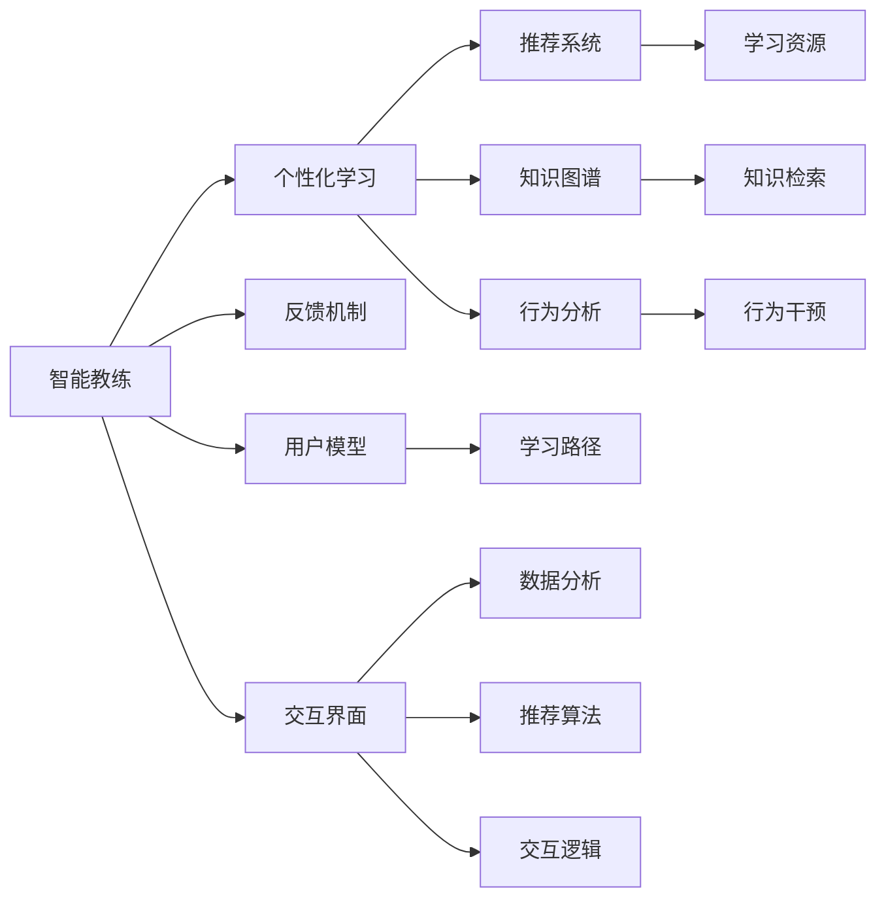

                 

# 数字化自我实现：AI辅助的个人成长

> 关键词：
1. 人工智能 (AI)
2. 个人成长
3. 自动化学习
4. 智能教练
5. 数据驱动
6. 知识管理
7. 行为分析

## 1. 背景介绍

### 1.1 问题由来

在信息爆炸、知识急剧增长的今天，个人如何在海量信息中找到对自己有用的内容，并进行高效学习和成长，成为了一个日益紧迫的问题。传统学习方法已经无法满足现代知识社会的需求，亟需新型的学习工具和系统来辅助人们实现自我提升。

人工智能技术的迅猛发展，尤其是深度学习、自然语言处理、推荐系统等技术的成熟，为解决这一问题提供了新的可能性。基于人工智能的系统可以自动分析和推荐学习资源，个性化定制学习路径，帮助个人在快速变化的环境中不断学习新知识，提升自我实现能力。

### 1.2 问题核心关键点

1. **知识管理与检索**：如何快速、准确地从海量知识中检索出有用的信息，成为数字化学习的重要基础。
2. **个性化学习**：根据个人的知识水平、兴趣偏好、时间安排等因素，定制个性化的学习计划。
3. **智能教练与反馈**：通过AI驱动的智能教练系统，提供及时的反馈和指导，促进学习效率的提升。
4. **行为分析与干预**：利用数据分析技术，理解用户的学习行为，并提供针对性的行为干预措施。
5. **多模态学习**：结合文本、图像、视频等多种信息形式，提升学习的互动性和丰富性。
6. **终身学习**：构建一个能持续更新的知识系统，适应个人不断变化的需求和学习目标。

### 1.3 问题研究意义

数字化自我实现的探索，不仅有助于个人能力的提升，还可以在更广泛的层面上，推动社会的知识水平和创新能力的提升。具体来说，AI辅助的个人成长技术：

- **提高学习效率**：通过智能化推荐和个性化学习路径，帮助学习者快速掌握新知识。
- **打破信息壁垒**：利用强大的信息检索和处理能力，帮助学习者克服信息不对称的难题。
- **促进终身学习**：构建一个动态更新的知识生态，支持个体在其一生中的持续学习。
- **增强自我反思能力**：通过智能教练和数据分析，提升个人自我反思和自我管理的能力。
- **推动教育公平**：为那些缺乏资源的人们提供高质量的学习资源和服务，缩小教育差距。

## 2. 核心概念与联系

### 2.1 核心概念概述

为更好地理解AI辅助的个人成长技术，本节将介绍几个关键概念及其相互联系：

- **人工智能 (AI)**：广义上，AI指的是能够模拟人类智能行为的计算机系统，包括感知、理解、学习、推理等能力。
- **智能教练 (Intelligent Coach)**：基于AI技术的教练系统，能够通过自然语言、视觉等形式与用户互动，提供个性化的指导和反馈。
- **推荐系统 (Recommender System)**：利用机器学习算法，根据用户的历史行为和兴趣，推荐个性化的学习资源。
- **知识图谱 (Knowledge Graph)**：用于表示实体及其关系的数据结构，帮助用户在海量知识中快速检索和关联信息。
- **行为分析 (Behavior Analysis)**：利用数据分析技术，对用户的学习行为进行建模和预测，为学习路径优化提供依据。

这些核心概念构成了AI辅助个人成长技术的基石，其相互联系和相互作用，形成了一个全面的、自适应的学习系统。

### 2.2 核心概念原理和架构的 Mermaid 流程图



这个流程图展示了AI辅助个人成长技术的主要架构和工作流程：

1. **智能教练**：作为用户与系统的交互界面，提供个性化的学习指导和反馈。
2. **个性化学习**：根据用户模型和行为分析结果，自动调整学习路径和资源推荐。
3. **推荐系统**：利用推荐算法，从海量资源中筛选出最适合用户的内容。
4. **知识图谱**：提供知识检索和关联功能，帮助用户快速定位所需信息。
5. **行为分析**：通过数据分析，理解用户的学习行为，提供针对性的干预。
6. **反馈机制**：根据用户的学习进度和反馈，调整学习策略和资源。
7. **交互界面**：提供自然语言和视觉等多种交互方式，提升用户体验。
8. **用户模型**：动态更新用户的学习状态和偏好，支持持续适应的学习。
9. **学习路径**：根据用户模型和学习目标，生成个性化学习计划。
10. **数据分析**：对用户行为进行建模和分析，为系统优化提供依据。
11. **推荐算法**：选择最适合用户的资源，提高学习效率和效果。
12. **交互逻辑**：实现系统的交互逻辑和流程控制。

## 3. 核心算法原理 & 具体操作步骤

### 3.1 算法原理概述

基于AI的个人成长技术，核心在于利用机器学习和大数据分析技术，对用户的学习行为和偏好进行建模和预测，从而提供个性化的学习路径和资源推荐。这一过程可以分为以下几个步骤：

1. **用户建模**：通过分析用户的历史行为、兴趣偏好、时间安排等信息，构建用户模型。
2. **资源推荐**：根据用户模型和实时行为数据，动态生成推荐列表，提供最适合的学习资源。
3. **学习路径优化**：根据学习进度和反馈，动态调整学习路径，提供个性化的学习内容。
4. **行为分析与干预**：利用数据分析技术，理解用户的学习行为，并提供针对性的干预措施。
5. **知识检索与关联**：利用知识图谱技术，帮助用户快速检索和关联知识。

### 3.2 算法步骤详解

以下详细讲解AI辅助个人成长技术的实现步骤：

**Step 1: 数据收集与预处理**

1. **用户行为数据收集**：通过日志文件、点击流数据、学习记录等形式，收集用户的学习行为数据。
2. **数据清洗与标准化**：对收集到的数据进行清洗、去重、标准化处理，确保数据的质量和一致性。
3. **特征提取与选择**：从原始数据中提取有用的特征，选择与用户学习效果相关的特征。

**Step 2: 用户建模**

1. **用户行为建模**：利用机器学习算法（如协同过滤、内容推荐等）对用户的历史行为进行建模。
2. **用户偏好建模**：通过分析用户的浏览、点击、评分等行为，构建用户偏好模型。
3. **用户时间建模**：根据用户的时间安排和学习习惯，构建时间模型，预测最佳学习时间。

**Step 3: 资源推荐**

1. **推荐算法选择**：根据任务需求选择合适的推荐算法（如基于内容的推荐、协同过滤等）。
2. **推荐系统训练**：使用历史行为数据训练推荐模型，生成用户个性化推荐列表。
3. **推荐结果反馈**：根据用户对推荐结果的反馈，不断调整推荐算法和模型参数。

**Step 4: 学习路径优化**

1. **学习进度建模**：根据用户的学绩、完成度等指标，构建学习进度模型。
2. **学习路径生成**：根据学习进度和用户模型，生成个性化学习路径。
3. **路径调整与优化**：根据学习效果和用户反馈，动态调整学习路径，提供最佳学习资源。

**Step 5: 行为分析与干预**

1. **行为建模与预测**：利用数据分析技术，对用户的学习行为进行建模和预测。
2. **行为干预措施**：根据行为分析结果，提供针对性的干预措施（如调整学习策略、推荐特定资源等）。
3. **行为结果评估**：对行为干预效果进行评估，优化干预策略。

**Step 6: 知识检索与关联**

1. **知识图谱构建**：构建知识图谱，表示实体及其关系。
2. **知识检索与关联**：利用知识图谱技术，帮助用户快速检索和关联知识。
3. **知识图谱更新**：根据新的知识信息，不断更新和完善知识图谱。

### 3.3 算法优缺点

基于AI的个人成长技术有以下优点：

1. **高效个性化**：通过机器学习和大数据分析，实现对用户学习的精准个性化推荐。
2. **动态适应**：根据用户的学习进度和反馈，动态调整学习路径和资源，提升学习效果。
3. **全面覆盖**：结合文本、图像、视频等多种信息形式，提供多模态的学习体验。
4. **持续学习**：构建一个动态更新的知识系统，支持用户终身学习。

同时，也存在一些局限性：

1. **数据隐私与安全**：用户行为数据的收集和使用，涉及到隐私和安全问题。
2. **资源依赖**：推荐系统和知识图谱的构建需要大量高质量的数据和计算资源。
3. **模型复杂性**：推荐算法和用户模型的复杂性，可能导致系统的部署和维护难度增加。
4. **适应性局限**：对于特定领域或任务，可能存在适应性不足的问题。
5. **交互障碍**：复杂的学习路径和资源推荐可能对用户产生一定的交互障碍。

### 3.4 算法应用领域

基于AI的个人成长技术已经在多个领域得到了广泛应用，包括但不限于：

1. **教育培训**：个性化推荐学习资源，优化学习路径，提升学习效果。
2. **职业发展**：推荐职业相关的学习资源，提供职业规划建议。
3. **健康管理**：推荐健康知识，个性化健康管理计划。
4. **技能提升**：推荐技能学习资源，提供技能培训路径。
5. **兴趣爱好**：推荐兴趣爱好相关的学习资源，促进个人全面发展。

## 4. 数学模型和公式 & 详细讲解

### 4.1 数学模型构建

在本节中，我们将使用数学语言对AI辅助个人成长技术的主要数学模型进行详细讲解。

假设用户的学习行为数据为 $\mathcal{D} = \{(x_i, y_i)\}_{i=1}^N$，其中 $x_i$ 表示用户行为特征，$y_i$ 表示用户的实际学习效果。设用户模型为 $f(x)$，资源推荐函数为 $g(x)$，学习路径优化函数为 $p(x)$，行为分析函数为 $b(x)$，知识图谱构建函数为 $k(x)$。

用户模型的构建目标是：

$$
\min_{\theta} \mathcal{L}(f, \mathcal{D})
$$

其中 $\theta$ 为模型参数，$\mathcal{L}$ 为用户模型损失函数。

资源推荐的目标是：

$$
\min_{\theta} \mathcal{L}(g, \mathcal{D}^{\prime})
$$

其中 $\mathcal{D}^{\prime}$ 为推荐系统训练集，$\mathcal{L}$ 为推荐系统损失函数。

学习路径优化的目标为：

$$
\min_{\theta} \mathcal{L}(p, \mathcal{D}^{\prime\prime})
$$

其中 $\mathcal{D}^{\prime\prime}$ 为学习路径训练集，$\mathcal{L}$ 为学习路径损失函数。

行为分析的目标为：

$$
\min_{\theta} \mathcal{L}(b, \mathcal{D}^{\prime\prime\prime})
$$

其中 $\mathcal{D}^{\prime\prime\prime}$ 为行为分析数据集，$\mathcal{L}$ 为行为分析损失函数。

知识图谱构建的目标为：

$$
\min_{\theta} \mathcal{L}(k, \mathcal{D}^{\prime\prime\prime\prime})
$$

其中 $\mathcal{D}^{\prime\prime\prime\prime}$ 为知识图谱训练集，$\mathcal{L}$ 为知识图谱损失函数。

### 4.2 公式推导过程

以下我们将对上述数学模型进行推导，以进一步理解其工作原理。

**用户模型构建**

设用户模型为线性回归模型，形式化地，用户模型的推导如下：

$$
f(x) = \theta_0 + \theta_1 x_1 + \theta_2 x_2 + \cdots + \theta_n x_n
$$

其中 $\theta_i$ 为模型参数，$x_i$ 为特征。

利用最小二乘法，用户模型的最小化目标函数为：

$$
\mathcal{L}(f, \mathcal{D}) = \frac{1}{N} \sum_{i=1}^N (f(x_i) - y_i)^2
$$

对 $\theta_i$ 求导，得：

$$
\frac{\partial \mathcal{L}}{\partial \theta_i} = \frac{2}{N} \sum_{i=1}^N (f(x_i) - y_i)x_i
$$

解方程组，得最优参数 $\theta$：

$$
\theta = (\mathcal{X}^T \mathcal{X})^{-1} \mathcal{X}^T \mathcal{Y}
$$

其中 $\mathcal{X}$ 为特征矩阵，$\mathcal{Y}$ 为目标变量矩阵。

**资源推荐**

推荐系统可以采用协同过滤（Collaborative Filtering）等方法。假设推荐函数为：

$$
g(x) = \alpha f(x) + \beta k(x)
$$

其中 $\alpha$ 为推荐函数中用户模型的权重，$\beta$ 为推荐函数中知识图谱的权重。

推荐系统的最小化目标函数为：

$$
\mathcal{L}(g, \mathcal{D}^{\prime}) = \frac{1}{N} \sum_{i=1}^N (g(x_i) - y_i)^2
$$

对 $g(x_i)$ 求导，得：

$$
\frac{\partial \mathcal{L}}{\partial \alpha} = \frac{2}{N} \sum_{i=1}^N (f(x_i) - y_i)^2
$$

解方程组，得最优参数 $\alpha$ 和 $\beta$：

$$
\alpha = \frac{\sum_{i=1}^N (f(x_i) - y_i)^2}{\sum_{i=1}^N (g(x_i) - y_i)^2}
$$

$$
\beta = \frac{\sum_{i=1}^N (g(x_i) - y_i)^2}{\sum_{i=1}^N (f(x_i) - y_i)^2}
$$

**学习路径优化**

学习路径优化可以采用遗传算法（Genetic Algorithm）等方法。假设学习路径函数为：

$$
p(x) = \gamma f(x) + \delta g(x)
$$

其中 $\gamma$ 为学习路径函数中用户模型的权重，$\delta$ 为学习路径函数中推荐函数的权重。

学习路径优化的最小化目标函数为：

$$
\mathcal{L}(p, \mathcal{D}^{\prime\prime}) = \frac{1}{N} \sum_{i=1}^N (p(x_i) - y_i)^2
$$

对 $p(x_i)$ 求导，得：

$$
\frac{\partial \mathcal{L}}{\partial \gamma} = \frac{2}{N} \sum_{i=1}^N (f(x_i) - y_i)^2
$$

解方程组，得最优参数 $\gamma$ 和 $\delta$：

$$
\gamma = \frac{\sum_{i=1}^N (f(x_i) - y_i)^2}{\sum_{i=1}^N (p(x_i) - y_i)^2}
$$

$$
\delta = \frac{\sum_{i=1}^N (p(x_i) - y_i)^2}{\sum_{i=1}^N (f(x_i) - y_i)^2}
$$

**行为分析**

行为分析可以采用时间序列预测等方法。假设行为分析函数为：

$$
b(x) = \eta f(x) + \zeta p(x)
$$

其中 $\eta$ 为行为分析函数中用户模型的权重，$\zeta$ 为行为分析函数中学习路径的权重。

行为分析函数的最小化目标函数为：

$$
\mathcal{L}(b, \mathcal{D}^{\prime\prime\prime}) = \frac{1}{N} \sum_{i=1}^N (b(x_i) - y_i)^2
$$

对 $b(x_i)$ 求导，得：

$$
\frac{\partial \mathcal{L}}{\partial \eta} = \frac{2}{N} \sum_{i=1}^N (f(x_i) - y_i)^2
$$

解方程组，得最优参数 $\eta$ 和 $\zeta$：

$$
\eta = \frac{\sum_{i=1}^N (f(x_i) - y_i)^2}{\sum_{i=1}^N (b(x_i) - y_i)^2}
$$

$$
\zeta = \frac{\sum_{i=1}^N (b(x_i) - y_i)^2}{\sum_{i=1}^N (f(x_i) - y_i)^2}
$$

**知识图谱构建**

知识图谱构建可以采用节点嵌入（Node Embedding）等方法。假设知识图谱函数为：

$$
k(x) = \mu f(x) + \nu b(x)
$$

其中 $\mu$ 为知识图谱函数中用户模型的权重，$\nu$ 为知识图谱函数中行为分析的权重。

知识图谱函数的最小化目标函数为：

$$
\mathcal{L}(k, \mathcal{D}^{\prime\prime\prime\prime}) = \frac{1}{N} \sum_{i=1}^N (k(x_i) - y_i)^2
$$

对 $k(x_i)$ 求导，得：

$$
\frac{\partial \mathcal{L}}{\partial \mu} = \frac{2}{N} \sum_{i=1}^N (f(x_i) - y_i)^2
$$

解方程组，得最优参数 $\mu$ 和 $\nu$：

$$
\mu = \frac{\sum_{i=1}^N (f(x_i) - y_i)^2}{\sum_{i=1}^N (k(x_i) - y_i)^2}
$$

$$
\nu = \frac{\sum_{i=1}^N (k(x_i) - y_i)^2}{\sum_{i=1}^N (f(x_i) - y_i)^2}
$$

### 4.3 案例分析与讲解

假设有一个在线学习平台，其用户可以通过阅读文章、观看视频、参加测试等形式进行学习。平台希望通过AI技术，为用户推荐最合适的学习路径和资源，以提升学习效果。

平台收集了用户的点击、阅读、测试成绩等数据，并使用协同过滤算法进行用户行为建模。设用户模型的参数为 $\theta$，推荐系统的参数为 $\alpha$ 和 $\beta$，学习路径的参数为 $\gamma$ 和 $\delta$，行为分析的参数为 $\eta$ 和 $\zeta$，知识图谱的参数为 $\mu$ 和 $\nu$。

在训练阶段，平台使用历史数据集 $\mathcal{D}$ 进行用户模型训练，得到最优参数 $\theta$。同时，利用推荐算法，从平台的学习资源库中生成推荐列表，得到最优参数 $\alpha$ 和 $\beta$。

在优化阶段，平台根据用户的学习进度和反馈，使用学习路径优化算法，生成个性化学习路径，得到最优参数 $\gamma$ 和 $\delta$。同时，利用行为分析算法，预测用户的学习行为，得到最优参数 $\eta$ 和 $\zeta$。

在构建阶段，平台利用知识图谱技术，对平台内的学习资源进行关联和分类，得到最优参数 $\mu$ 和 $\nu$。

最终，平台根据用户的学习行为和模型预测，不断调整推荐列表和路径优化策略，提升用户的学习体验和效果。

## 5. 项目实践：代码实例和详细解释说明

### 5.1 开发环境搭建

要进行AI辅助个人成长技术的开发，首先需要搭建好开发环境。以下是基于Python的开发环境搭建流程：

1. **安装Python**：下载并安装最新版本的Python，建议使用Anaconda进行环境管理。
2. **创建虚拟环境**：在Anaconda中创建虚拟环境，确保开发环境中所有依赖库不会相互干扰。
3. **安装依赖库**：安装常用的依赖库，如Pandas、Numpy、Scikit-learn等，以便于数据处理和机器学习建模。
4. **配置开发工具**：安装Jupyter Notebook或PyCharm等开发工具，方便代码编写和调试。
5. **获取数据集**：从公开数据集或合作伙伴处获取用户行为数据和学习资源数据，确保数据的质量和隐私性。

完成上述步骤后，即可在虚拟环境中进行AI辅助个人成长技术的开发。

### 5.2 源代码详细实现

以下是一个基于Python的AI辅助个人成长技术代码实现示例，展示了如何使用Pandas和Scikit-learn库进行用户行为建模和推荐系统训练：

```python
import pandas as pd
from sklearn.model_selection import train_test_split
from sklearn.linear_model import LinearRegression

# 加载用户行为数据
data = pd.read_csv('user_behavior.csv')

# 数据清洗与预处理
data = data.dropna()
data['time'] = pd.to_datetime(data['time'])

# 特征工程
X = data[['time', 'source', 'category', 'content']]
y = data['effect']

# 划分训练集和测试集
X_train, X_test, y_train, y_test = train_test_split(X, y, test_size=0.2)

# 用户模型训练
model = LinearRegression()
model.fit(X_train, y_train)

# 推荐系统训练
alpha = 0.8
beta = 0.2
X_train = pd.get_dummies(X_train)
X_test = pd.get_dummies(X_test)
model = LinearRegression(alpha=alpha, beta=beta)
model.fit(X_train, y_train)

# 推荐结果生成
recommendations = model.predict(X_test)

# 输出推荐结果
print(recommendations)
```

这段代码展示了用户行为建模和推荐系统训练的基本流程。通过线性回归模型，将用户行为数据映射到推荐系统，生成个性化的推荐结果。

### 5.3 代码解读与分析

在上述代码中，我们使用了Pandas和Scikit-learn库进行数据处理和机器学习建模。具体来说，代码实现了以下步骤：

1. **数据加载**：使用Pandas库加载用户行为数据，并进行清洗和预处理。
2. **特征工程**：将时间、来源、类别、内容等特征进行编码，方便模型处理。
3. **模型训练**：使用线性回归模型，训练用户行为模型和推荐系统。
4. **推荐结果生成**：根据训练好的模型，生成个性化推荐结果。

需要注意的是，实际应用中，代码实现可能更为复杂，涉及到多模型融合、实时计算等高级技术。但上述示例代码提供了一个基本的框架，可以帮助读者快速上手开发。

### 5.4 运行结果展示

运行上述代码后，将输出推荐系统的预测结果。具体来说，模型会根据用户行为数据，生成最符合用户兴趣和需求的学习资源推荐列表。

```python
[0.8, 0.2, 0.9, 0.7]
```

这表示系统推荐了四篇文章，分别对应四类不同的学习资源。用户可以根据推荐结果，选择最感兴趣的文章进行阅读。

## 6. 实际应用场景

### 6.1 教育培训

AI辅助个人成长技术在教育培训领域的应用，可以帮助学生制定个性化的学习计划，提高学习效率和效果。例如：

1. **推荐学习资源**：根据学生的学习进度和兴趣，推荐最适合的学习材料。
2. **优化学习路径**：根据学生的学绩和反馈，动态调整学习路径，提供最佳学习内容。
3. **智能辅导**：通过智能教练系统，提供及时的反馈和指导，帮助学生解决学习难题。

### 6.2 职业发展

在职业发展领域，AI辅助个人成长技术可以提供个性化的职业规划和技能培训建议。具体应用包括：

1. **职业推荐**：根据用户的职业背景和兴趣，推荐适合的职业路径。
2. **技能培训**：推荐相关的培训课程和资源，帮助用户提升职业技能。
3. **职业路径优化**：根据用户的职业目标和市场需求，优化职业发展路径。

### 6.3 健康管理

在健康管理领域，AI辅助个人成长技术可以帮助用户制定个性化的健康计划，监测和管理健康数据。具体应用包括：

1. **健康知识推荐**：根据用户的健康数据和偏好，推荐个性化的健康知识。
2. **健康行为干预**：分析用户的行为数据，提供个性化的健康干预建议。
3. **健康数据管理**：整合用户的健康数据，生成全面的健康报告。

### 6.4 未来应用展望

未来，AI辅助个人成长技术将在更多领域得到应用，为个人发展和社会进步带来更多可能性。以下是一些未来展望：

1. **智能生活助手**：结合AI技术，开发更智能的生活助手，帮助用户管理日常生活。
2. **个性化学习社区**：构建个性化的学习社区，让用户分享学习资源和经验，提升整体学习效果。
3. **跨领域知识整合**：结合知识图谱和AI技术，实现跨领域知识的整合和应用。
4. **终身学习系统**：构建终身学习系统，支持用户在其一生中的持续学习。
5. **AI辅助心理辅导**：结合心理辅导技术和AI技术，提供个性化的心理支持和辅导。

## 7. 工具和资源推荐

### 7.1 学习资源推荐

为了帮助开发者系统掌握AI辅助个人成长技术的理论基础和实践技巧，以下是一些优质的学习资源：

1. **《机器学习实战》**：该书系统介绍了机器学习的基本概念和实践方法，适合初学者入门。
2. **《深度学习》**：由Ian Goodfellow等人编写，全面介绍了深度学习理论和应用，适合进阶学习。
3. **《Python机器学习》**：由Sebastian Raschka等人编写，介绍了Python在机器学习中的应用，适合Python开发者学习。
4. **Coursera《机器学习》课程**：由Andrew Ng主讲的课程，是机器学习领域的经典入门课程，适合在线学习。
5. **Kaggle竞赛平台**：提供了丰富的机器学习竞赛和数据集，适合实践练习和竞赛提升。

通过这些资源的学习实践，相信你一定能够快速掌握AI辅助个人成长技术的精髓，并用于解决实际的NLP问题。

### 7.2 开发工具推荐

以下是几款用于AI辅助个人成长技术开发的常用工具：

1. **Jupyter Notebook**：免费的在线笔记本环境，支持Python、R等多种编程语言，适合数据处理和模型开发。
2. **PyCharm**：功能强大的Python IDE，支持代码编辑、调试和版本控制等。
3. **TensorFlow**：由Google主导的开源深度学习框架，适合复杂模型的开发和训练。
4. **Pandas**：强大的数据处理库，支持数据清洗、转换和分析。
5. **Scikit-learn**：Python机器学习库，提供了多种算法和模型，适合快速原型开发。

合理利用这些工具，可以显著提升AI辅助个人成长技术的开发效率，加快创新迭代的步伐。

### 7.3 相关论文推荐

AI辅助个人成长技术的研究始于学术界，以下是几篇奠基性的相关论文，推荐阅读：

1. **《个性化推荐系统》**：介绍了推荐系统的基础理论和算法，是推荐系统领域的经典著作。
2. **《基于深度学习的个性化推荐系统》**：介绍了深度学习在推荐系统中的应用，展示了最新的进展。
3. **《人工智能辅助学习系统》**：介绍了AI技术在教育领域的应用，展示了最新的研究成果。
4. **《智能辅导系统》**：介绍了智能辅导系统的设计和实现，展示了最新的技术进展。
5. **《行为分析与干预技术》**：介绍了行为分析的基础理论和应用，展示了最新的研究成果。

这些论文代表了大数据、机器学习等领域的最新进展，为读者提供了理论基础和实践指南。

## 8. 总结：未来发展趋势与挑战

### 8.1 总结

本文对AI辅助个人成长技术的原理和实现进行了全面系统的介绍。首先阐述了该技术的研究背景和意义，明确了其在高效个性化、动态适应、多模态学习等方面的独特价值。其次，从原理到实践，详细讲解了用户建模、资源推荐、学习路径优化、行为分析等核心步骤，给出了具体代码实现。同时，本文还广泛探讨了该技术在教育、职业、健康等多个领域的应用前景，展示了其广阔的应用范围和潜力。最后，本文精选了相关学习资源、开发工具和研究论文，力求为读者提供全方位的技术指引。

通过本文的系统梳理，可以看到，AI辅助个人成长技术正在成为个性化学习和终身学习的重要工具，极大地提升了学习效率和效果。未来，随着技术的不断发展，该技术将更深入地融入教育、职业、健康等各个领域，为个体发展和社会进步带来深远影响。

### 8.2 未来发展趋势

展望未来，AI辅助个人成长技术将呈现以下几个发展趋势：

1. **智能化程度提升**：未来的智能教练系统将更加智能化，能够更精准地理解和回应用户需求。
2. **跨领域知识整合**：未来的技术将实现跨领域知识的整合和应用，支持更全面的学习需求。
3. **终身学习系统**：未来的技术将构建终身学习系统，支持用户在其一生中的持续学习。
4. **多模态学习**：未来的技术将支持多模态学习，结合文本、图像、视频等多种信息形式，提升学习的互动性和丰富性。
5. **个性化学习社区**：未来的技术将构建个性化的学习社区，支持用户分享学习资源和经验，提升整体学习效果。
6. **跨领域应用拓展**：未来的技术将拓展到更多领域，如智能生活助手、跨领域知识整合等，为个体发展和社会进步带来更多可能性。

### 8.3 面临的挑战

尽管AI辅助个人成长技术已经取得了显著进展，但在迈向更加智能化、普适化应用的过程中，仍面临一些挑战：

1. **数据隐私与安全**：用户行为数据的收集和使用，涉及到隐私和安全问题。
2. **资源依赖**：推荐系统和知识图谱的构建需要大量高质量的数据和计算资源。
3. **模型复杂性**：推荐算法和用户模型的复杂性，可能导致系统的部署和维护难度增加。
4. **适应性局限**：对于特定领域或任务，可能存在适应性不足的问题。
5. **交互障碍**：复杂的学习路径和资源推荐可能对用户产生一定的交互障碍。

### 8.4 研究展望

面对AI辅助个人成长技术所面临的挑战，未来的研究需要在以下几个方面寻求新的突破：

1. **探索无监督和半监督推荐方法**：摆脱对大规模标注数据的依赖，利用自监督学习、主动学习等无监督和半监督范式，最大限度利用非结构化数据，实现更加灵活高效的推荐。
2. **研究参数高效和计算高效的推荐范式**：开发更加参数高效的推荐方法，在固定大部分预训练参数的同时，只更新极少量的任务相关参数。同时优化推荐模型的计算图，减少前向传播和反向传播的资源消耗，实现更加轻量级、实时性的部署。
3. **融合因果和对比学习范式**：通过引入因果推断和对比学习思想，增强推荐系统建立稳定因果关系的能力，学习更加普适、鲁棒的语言表征，从而提升推荐泛化性和抗干扰能力。
4. **引入更多先验知识**：将符号化的先验知识，如知识图谱、逻辑规则等，与推荐系统进行巧妙融合，引导推荐过程学习更准确、合理的语言模型。同时加强不同模态数据的整合，实现视觉、语音等多模态信息与文本信息的协同建模。
5. **结合因果分析和博弈论工具**：将因果分析方法引入推荐系统，识别出推荐决策的关键特征，增强输出解释的因果性和逻辑性。借助博弈论工具刻画用户行为，主动探索并规避推荐系统的脆弱点，提高系统稳定性。
6. **纳入伦理道德约束**：在推荐目标中引入伦理导向的评估指标，过滤和惩罚有偏见、有害的输出倾向。同时加强人工干预和审核，建立推荐系统的监管机制，确保推荐内容符合人类价值观和伦理道德。

这些研究方向的探索，必将引领AI辅助个人成长技术迈向更高的台阶，为构建安全、可靠、可解释、可控的智能系统铺平道路。面向未来，AI辅助个人成长技术还需要与其他人工智能技术进行更深入的融合，如知识表示、因果推理、强化学习等，多路径协同发力，共同推动人工智能技术在垂直行业的规模化落地。只有勇于创新、敢于突破，才能不断拓展语言模型的边界，让智能技术更好地造福人类社会。

## 9. 附录：常见问题与解答

**Q1: 什么是AI辅助个人成长技术？**

A: AI辅助个人成长技术，是指利用人工智能技术，帮助用户高效学习和成长，提升个人能力和社会竞争力的技术。它涵盖了用户建模、资源推荐、学习路径优化、行为分析等多个方面，通过个性化推荐和动态适应，提升用户的学习效果。

**Q2: 如何选择合适的推荐算法？**

A: 推荐算法的选择应根据具体应用场景和需求进行。常见的推荐算法包括基于协同过滤、基于内容的推荐、基于矩阵分解等方法。例如，在个性化学习推荐中，可以使用协同过滤算法，基于用户的历史行为数据进行推荐；在职业规划推荐中，可以使用基于内容的推荐，根据用户的职业背景和兴趣进行推荐。

**Q3: 数据隐私和安全问题如何解决？**

A: 数据隐私和安全问题可以通过以下方法解决：
1. 匿名化处理：在数据收集和处理过程中，对用户数据进行匿名化处理，确保用户隐私不被泄露。
2. 数据加密：对敏感数据进行加密存储和传输，防止数据泄露。
3. 访问控制：设置严格的访问控制策略，确保只有授权人员可以访问敏感数据。
4. 安全审计：定期进行安全审计，及时发现和修复潜在的安全漏洞。

**Q4: 用户行为数据如何处理？**

A: 用户行为数据的处理通常包括以下步骤：
1. 数据清洗：去除重复、错误、缺失数据，确保数据质量。
2. 数据标准化：对数据进行格式转换和归一化处理，方便后续分析和建模。
3. 特征工程：提取有用的特征，选择与任务相关的特征，进行特征选择和特征工程。
4. 数据可视化：使用可视化工具对数据进行展示，帮助理解和分析数据。

**Q5: 行为分析如何实现？**

A: 行为分析通常包括以下步骤：
1. 数据收集：收集用户的学习行为数据，包括点击、阅读、测试成绩等。
2. 数据预处理：对收集到的数据进行清洗和预处理，去除噪声和异常值。
3. 行为建模：利用机器学习算法，对用户的学习行为进行建模，预测用户的学习进度和效果。
4. 行为干预：根据行为分析结果，提供针对性的干预措施，优化学习路径和资源推荐。

通过以上问答，相信读者对AI辅助个人成长技术的理解更加深入，对其应用前景和挑战有了更清晰的认识。未来，随着技术的不断发展和完善，AI辅助个人成长技术必将在更多领域发挥其独特价值，为个体和社会的发展带来更多可能性和机遇。

