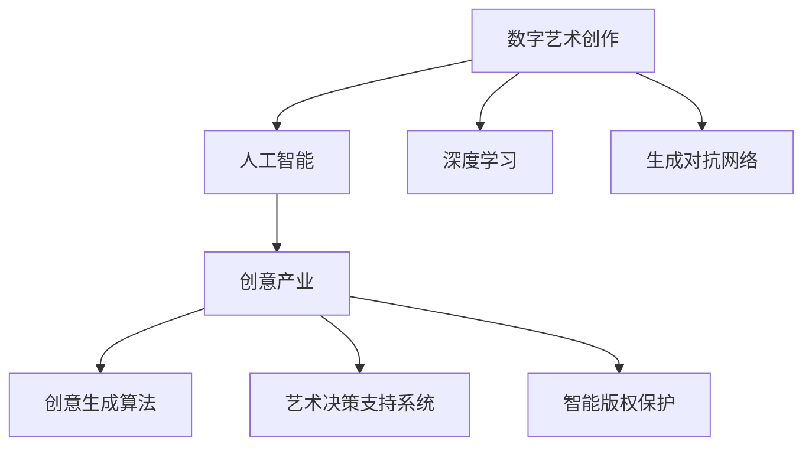

                 

# 数字化艺术创作创业：AI辅助的创意产业

> 关键词：数字艺术创作, 人工智能, 创意产业, 深度学习, 生成对抗网络, 艺术决策支持系统, 创意生成算法, 版权保护

## 1. 背景介绍

### 1.1 问题由来
近年来，随着人工智能技术的飞速发展，特别是深度学习和大数据分析技术在艺术创作中的应用，数字化艺术创作和创业的门槛正在不断降低，创新空间也日益广阔。人工智能赋予了艺术创作新的可能性，使得普通人也可以参与到艺术创作中，大幅提升了创作效率，拓宽了艺术表达的维度。

但与此同时，数字化艺术创作领域也面临着诸多挑战，如版权保护、艺术决策的科学化、作品质量保证等。这些问题需要结合人工智能技术，通过精准的艺术决策支持系统、高效的创意生成算法、智能版权保护等手段，为数字化艺术创作创业提供全面支持。

### 1.2 问题核心关键点
1. **艺术创作与人工智能结合**：如何利用人工智能技术辅助艺术创作，提升创作效率和艺术作品的多样性。
2. **创意生成算法**：基于深度学习等技术，实现自动化、个性化和创造性的艺术生成。
3. **艺术决策支持系统**：基于数据分析和机器学习，辅助艺术家进行决策，如主题选择、风格调优等。
4. **智能版权保护**：利用区块链和人工智能技术，确保数字化艺术作品的版权归属和分发效率。
5. **创意产业生态构建**：建立包含创意生成、艺术决策、版权保护等环节的数字化艺术创作创业生态。

### 1.3 问题研究意义
1. **降低创作门槛**：借助人工智能技术，使艺术创作变得更加普惠和民主，让更多人参与到艺术创作中。
2. **提升创作效率**：通过自动化和智能化手段，大幅提升艺术创作的速度和多样性，满足日益增长的艺术需求。
3. **优化艺术决策**：利用数据和算法，为艺术家提供科学的决策支持，优化创作过程，提升作品质量。
4. **加强版权保护**：确保数字化艺术作品的原创性和归属，保护创作者的权益，促进健康有序的艺术市场发展。
5. **推动创意产业发展**：通过科技与艺术的融合，促进艺术产业升级，探索新的商业模式和盈利模式。

## 2. 核心概念与联系

### 2.1 核心概念概述

为了更好地理解数字化艺术创作创业的AI辅助，本节将介绍几个关键概念，并展示其相互之间的联系：

- **数字艺术创作**：通过计算机图形、动画、数字绘画等技术手段创作的艺术作品。
- **人工智能（AI）**：模拟人类智能行为的技术体系，包括机器学习、深度学习、自然语言处理等。
- **创意产业**：以创意为核心驱动，以文化艺术、创意设计、数字媒体为载体，涵盖多个领域的产业。
- **深度学习**：一种模拟人类大脑神经网络的学习方式，通过多层神经网络模型进行训练，实现对复杂问题的解决。
- **生成对抗网络（GAN）**：一种由生成器（Generative Network）和判别器（Discriminative Network）组成的网络结构，用于生成高质量、逼真的艺术作品。
- **艺术决策支持系统**：基于数据和算法，辅助艺术家进行创作决策的系统，如风格选择、主题优化等。
- **创意生成算法**：利用算法生成新的创意内容，如文本、图像、音乐等，拓展创意表达的可能性。
- **智能版权保护**：结合区块链和人工智能技术，实现作品版权的自动化认证、分发和管理。

这些核心概念之间的联系可以通过以下Mermaid流程图来展示：



这个流程图展示了从艺术创作到版权保护，如何通过人工智能技术进行全面辅助：

1. 数字艺术创作过程中，深度学习和生成对抗网络提供创作工具和素材。
2. 创意生成算法拓展创作内容，丰富艺术表达。
3. 艺术决策支持系统为艺术家提供决策建议，提升创作效率。
4. 智能版权保护系统确保作品的版权归属，保障创作者权益。

这些技术手段的协同作用，将为数字化艺术创作创业提供全面支持。

## 3. 核心算法原理 & 具体操作步骤
### 3.1 算法原理概述

数字化艺术创作创业的AI辅助核心算法主要涉及深度学习、生成对抗网络和创意生成算法。这些算法通过不同方式实现艺术创作、决策支持和版权保护等功能。

深度学习算法通过学习大量数据，提炼出艺术作品的特征和规律，为创作过程提供基础支持。生成对抗网络通过对抗学习机制，生成高质量、逼真的艺术作品。创意生成算法则利用算法生成新的创意内容，拓展创作边界。

### 3.2 算法步骤详解

数字化艺术创作创业的AI辅助流程主要包括：

1. **数据收集与预处理**：收集艺术作品、用户偏好、市场需求等数据，并进行预处理，保证数据的质量和完整性。
2. **模型训练与优化**：利用深度学习、生成对抗网络等技术，训练模型，并进行超参数优化，提高模型性能。
3. **创意生成与艺术创作**：使用训练好的模型生成创意，辅助艺术家进行艺术创作，提升创作效率和多样性。
4. **艺术决策支持**：基于数据分析和机器学习技术，辅助艺术家进行创作决策，如风格选择、主题优化等。
5. **智能版权保护**：利用区块链和人工智能技术，实现作品版权的自动化认证、分发和管理。

### 3.3 算法优缺点

数字化艺术创作创业的AI辅助算法具有以下优点：

1. **提升创作效率**：通过自动化和智能化手段，大幅提升艺术创作的速度和多样性，满足日益增长的艺术需求。
2. **丰富创作内容**：利用创意生成算法，拓展创作内容，激发新的创意表达。
3. **科学决策支持**：基于数据分析和机器学习，为艺术家提供科学的决策支持，优化创作过程，提升作品质量。
4. **版权保护强化**：确保数字化艺术作品的原创性和归属，保护创作者的权益，促进健康有序的艺术市场发展。

但同时，这些算法也存在以下局限性：

1. **创意瓶颈**：依赖算法生成创意，可能限制艺术家的个性和独特性。
2. **数据偏差**：如果训练数据存在偏差，模型生成的作品可能缺乏多样性，无法涵盖广泛的创作风格。
3. **版权问题**：尽管版权保护技术有所提升，但数字化作品的版权保护仍面临诸多挑战，如盗版、侵权等。
4. **伦理与法律问题**：AI辅助创作可能引发伦理和法律问题，如作品的原创性、艺术家的权利等。

### 3.4 算法应用领域

数字化艺术创作创业的AI辅助算法已在多个领域得到应用，包括：

1. **数字绘画与动画制作**：利用生成对抗网络生成高质量的图像和动画，辅助艺术家进行创作。
2. **音乐创作与制作**：通过生成对抗网络生成音乐作品，辅助音乐家进行创作和制作。
3. **文本创作与出版**：利用自然语言处理技术，辅助小说、诗歌等文本创作和出版。
4. **艺术展览与展示**：基于艺术决策支持系统，辅助策划和展示艺术作品。
5. **艺术教育与培训**：通过智能化的艺术创作工具和教学平台，辅助艺术教育和学习。

## 4. 数学模型和公式 & 详细讲解 & 举例说明

### 4.1 数学模型构建

本节将使用数学语言对数字化艺术创作创业的AI辅助算法进行更加严格的刻画。

记艺术创作的数据集为 $D=\{(x_i,y_i)\}_{i=1}^N$，其中 $x_i$ 为艺术作品，$y_i$ 为作品标签（如风格、主题等）。假设利用深度学习模型 $M_{\theta}$ 对数据进行学习，其中 $\theta$ 为模型参数。模型 $M_{\theta}$ 的损失函数为 $\mathcal{L}(\theta)$，用于衡量模型预测输出与真实标签之间的差异。

生成对抗网络由生成器 $G$ 和判别器 $D$ 组成，生成器目标是最小化判别器的损失，判别器目标是最小化生成器的损失。

创意生成算法可以利用自然语言处理技术，生成文本、图像等创意内容，其模型为 $C_{\phi}$，其中 $\phi$ 为模型参数。

艺术决策支持系统通过数据分析和机器学习技术，辅助艺术家进行创作决策，其决策模型为 $D_{\psi}$，其中 $\psi$ 为模型参数。

### 4.2 公式推导过程

以生成对抗网络为例，推导生成器 $G$ 和判别器 $D$ 的目标函数和损失函数。

假设生成器的输入为随机噪声 $z$，输出为艺术作品 $x_G(z)$。判别器的输入为艺术作品 $x$，输出为该作品为真实艺术品的概率 $p_D(x)$。则生成器和判别器的目标函数分别为：

$$
\mathcal{L}_G = \mathbb{E}_{z \sim p(z)} [\log(1 - D(G(z)))]
$$

$$
\mathcal{L}_D = \mathbb{E}_{x \sim p(x)} [\log D(x)] + \mathbb{E}_{z \sim p(z)} [\log(1 - D(G(z)))]
$$

其中 $p(z)$ 为随机噪声的分布，$p(x)$ 为真实艺术作品的分布。

生成对抗网络的训练过程通过交替优化生成器和判别器的目标函数，实现艺术作品的生成。具体训练步骤为：

1. 固定判别器 $D$，最小化生成器的损失 $\mathcal{L}_G$。
2. 固定生成器 $G$，最小化判别器的损失 $\mathcal{L}_D$。

如此循环多次，直到训练收敛，生成器能够生成高质量的艺术作品。

### 4.3 案例分析与讲解

以生成对抗网络在数字绘画创作中的应用为例，分析其工作原理和具体实现。

假设我们有一个由大量数字绘画作品组成的数据集 $D$，其中每幅作品 $x_i$ 都被标注了风格 $y_i$。我们的目标是用生成对抗网络生成具有不同风格的新作品。

首先，我们定义生成器 $G$ 和判别器 $D$，并随机生成一些噪声向量 $z$，输入生成器生成艺术作品 $x_G(z)$。将生成的作品输入判别器，计算判别器输出 $p_D(x_G(z))$。然后，将真实作品 $x_i$ 输入判别器，计算判别器输出 $p_D(x_i)$。通过优化生成器和判别器的损失函数，使得生成器生成的高质量作品能被判别器准确识别为真实作品，从而完成数字绘画的创作。

## 5. 项目实践：代码实例和详细解释说明
### 5.1 开发环境搭建

在进行数字化艺术创作创业的AI辅助项目实践前，我们需要准备好开发环境。以下是使用Python进行TensorFlow开发的环境配置流程：

1. 安装Anaconda：从官网下载并安装Anaconda，用于创建独立的Python环境。

2. 创建并激活虚拟环境：
```bash
conda create -n tf-env python=3.8 
conda activate tf-env
```

3. 安装TensorFlow：根据CUDA版本，从官网获取对应的安装命令。例如：
```bash
conda install tensorflow -c tf
```

4. 安装相关依赖包：
```bash
pip install numpy scipy matplotlib sklearn tqdm tensorflow-io protobuf tensorflow-hub
```

完成上述步骤后，即可在`tf-env`环境中开始AI辅助的数字化艺术创作创业项目的开发。

### 5.2 源代码详细实现

下面我们以数字绘画创作为例，给出使用TensorFlow实现生成对抗网络（GAN）的PyTorch代码实现。

首先，定义生成器和判别器的模型：

```python
import tensorflow as tf
from tensorflow.keras import layers

class Generator(tf.keras.Model):
    def __init__(self):
        super(Generator, self).__init__()
        self.dense1 = layers.Dense(128, use_bias=False, input_shape=(100,))
        self.dense2 = layers.Dense(256, use_bias=False)
        self.dense3 = layers.Dense(512, use_bias=False)
        self.dense4 = layers.Dense(1024, use_bias=False)
        self.dense5 = layers.Dense(784, activation='tanh')

    def call(self, x):
        x = layers.Input(shape=(100,))
        x = self.dense1(x)
        x = layers.LeakyReLU(alpha=0.2)(x)
        x = self.dense2(x)
        x = layers.LeakyReLU(alpha=0.2)(x)
        x = self.dense3(x)
        x = layers.LeakyReLU(alpha=0.2)(x)
        x = self.dense4(x)
        x = layers.LeakyReLU(alpha=0.2)(x)
        x = self.dense5(x)
        return x

class Discriminator(tf.keras.Model):
    def __init__(self):
        super(Discriminator, self).__init__()
        self.dense1 = layers.Dense(1024, input_shape=(784,))
        self.dense2 = layers.Dense(512)
        self.dense3 = layers.Dense(256)
        self.dense4 = layers.Dense(1, activation='sigmoid')

    def call(self, x):
        x = layers.Input(shape=(784,))
        x = self.dense1(x)
        x = layers.LeakyReLU(alpha=0.2)(x)
        x = self.dense2(x)
        x = layers.LeakyReLU(alpha=0.2)(x)
        x = self.dense3(x)
        x = layers.LeakyReLU(alpha=0.2)(x)
        x = self.dense4(x)
        return x
```

然后，定义训练函数：

```python
def train_step(real_images, fake_images):
    with tf.GradientTape() as gen_tape, tf.GradientTape() as disc_tape:
        real_output = disc(d_real_images)
        fake_output = disc(fake_images)
        disc_loss = tf.reduce_mean(tf.nn.sigmoid_cross_entropy_with_logits(labels=tf.ones_like(fake_output), logits=fake_output)) + tf.reduce_mean(tf.nn.sigmoid_cross_entropy_with_logits(labels=tf.zeros_like(real_output), logits=real_output))
        gen_loss = tf.reduce_mean(tf.nn.sigmoid_cross_entropy_with_logits(labels=tf.ones_like(real_output), logits=fake_output))
    gen_grads = gen_tape.gradient(gen_loss, gen.trainable_variables)
    disc_grads = disc_tape.gradient(disc_loss, disc.trainable_variables)
    gen_opt.apply_gradients(zip(gen_grads, gen.trainable_variables))
    disc_opt.apply_gradients(zip(disc_grads, disc.trainable_variables))
    return gen_loss, disc_loss
```

最后，启动训练流程：

```python
epochs = 50000
batch_size = 32

for epoch in range(epochs):
    for real_images, fake_images in train_dataset:
        gen_loss, disc_loss = train_step(real_images, fake_images)
        if epoch % 100 == 0:
            print(f"Epoch {epoch+1}, gen loss: {gen_loss.numpy():.4f}, disc loss: {disc_loss.numpy():.4f}")
```

以上就是使用TensorFlow实现生成对抗网络数字绘画创作的完整代码实现。可以看到，利用TensorFlow和Keras，我们可以快速搭建生成对抗网络，并通过训练生成高质量的数字绘画作品。

### 5.3 代码解读与分析

让我们再详细解读一下关键代码的实现细节：

**Generator和Discriminator类**：
- `__init__`方法：初始化生成器和判别器的各层网络。
- `call`方法：定义前向传播过程，包括层与激活函数的组合。

**train_step函数**：
- 使用TensorFlow的`tf.GradientTape`自动求导。
- 分别计算生成器和判别器的损失，并反向传播更新模型参数。
- 最后返回生成器和判别器的损失值。

**训练流程**：
- 设置训练轮数和批大小，开始循环迭代
- 每个epoch内，对数据集进行批处理，计算损失并更新模型参数
- 每隔100个epoch输出一次损失值

可以看到，TensorFlow和Keras使得生成对抗网络的实现变得简洁高效。开发者可以将更多精力放在模型设计和参数优化上，而不必过多关注底层的实现细节。

当然，工业级的系统实现还需考虑更多因素，如模型的保存和部署、超参数的自动搜索、更灵活的任务适配层等。但核心的生成对抗网络实现基本与此类似。

## 6. 实际应用场景
### 6.1 智能艺术创作平台

基于生成对抗网络的数字化艺术创作，可以构建智能艺术创作平台，使艺术家能够通过简单的交互界面生成高质量的艺术作品。

平台可以提供各种风格和主题的生成器模型，艺术家只需输入一些偏好参数，即可得到相应风格的艺术作品。平台还可以提供实时的作品展示、评价和分享功能，促进艺术创作和传播。

### 6.2 艺术市场交易平台

利用智能版权保护技术，艺术家可以在平台上注册和发布自己的作品，平台通过对作品进行数字签名和哈希计算，确保作品的原创性和版权归属。平台还可以提供作品展示、交易和智能推荐功能，为艺术家提供更广阔的创作和变现机会。

### 6.3 艺术教育与在线培训

通过数字化艺术创作工具和教学平台，学生可以随时随地进行艺术创作和学习，获得专业艺术家的指导和评价。平台还可以提供作品展示和互动功能，激发学生的创作热情，提升学习效果。

### 6.4 未来应用展望

随着生成对抗网络和其他AI技术的不断进步，数字化艺术创作创业将呈现以下几个发展趋势：

1. **创作工具智能化**：智能艺术创作工具将更加多样和灵活，艺术家可以更加轻松地进行创意表达。
2. **内容生成多样化**：通过多模态生成技术和跨领域知识融合，生成更加多样化和富有创意的作品。
3. **版权保护自动化**：结合区块链和人工智能技术，实现版权的自动化认证、分发和管理，确保创作者的权益。
4. **市场交易高效化**：智能艺术市场交易平台将更加高效和透明，为艺术家提供更广阔的创作和变现机会。
5. **教育培训普及化**：数字化艺术教育平台将普及化，使艺术教育更加普惠和民主。

## 7. 工具和资源推荐
### 7.1 学习资源推荐

为了帮助开发者系统掌握数字化艺术创作创业的AI辅助技术，这里推荐一些优质的学习资源：

1. 《深度学习》（Ian Goodfellow、Yoshua Bengio、Aaron Courville著）：深度学习领域的经典教材，全面介绍了深度学习的原理和应用。

2. TensorFlow官方文档：TensorFlow的官方文档，提供了详细的API和示例代码，适合快速上手学习。

3. TensorFlow Hub：TensorFlow的模块化模型库，提供大量的预训练模型和组件，可以大大提升开发效率。

4. PyTorch官方文档：PyTorch的官方文档，提供了丰富的API和示例代码，适合深度学习的研究和开发。

5. Coursera深度学习课程：斯坦福大学和deeplearning.ai等提供的深度学习在线课程，涵盖深度学习的各个方面。

6. arXiv和Google Scholar：科研论文的重要来源，可以跟踪最新的研究进展，获取前沿算法和技术。

通过对这些资源的学习实践，相信你一定能够快速掌握数字化艺术创作创业的AI辅助技术的精髓，并用于解决实际的创作和商业问题。

### 7.2 开发工具推荐

高效的开发离不开优秀的工具支持。以下是几款用于数字化艺术创作创业AI辅助开发的常用工具：

1. TensorFlow和PyTorch：两大深度学习框架，提供丰富的API和组件，适合构建复杂的AI模型。

2. Jupyter Notebook：强大的交互式编程环境，支持Python和TensorFlow等框架，适合进行实验和原型开发。

3. GitHub：版本控制和协作平台，提供代码托管、版本控制和团队协作功能，适合团队开发和开源项目。

4. PyCharm：专业的Python IDE，提供代码补全、调试和自动化测试等功能，适合Python开发。

5. Visual Studio Code：轻量级的编辑器，支持Python、TensorFlow等框架，适合多种编程语言的开发。

6. Docker：容器化技术，方便模型和环境的部署和管理，支持跨平台运行。

合理利用这些工具，可以显著提升数字化艺术创作创业AI辅助的开发效率，加快创新迭代的步伐。

### 7.3 相关论文推荐

数字化艺术创作创业的AI辅助技术发展源于学界的持续研究。以下是几篇奠基性的相关论文，推荐阅读：

1. Generative Adversarial Nets（生成对抗网络）：Ian Goodfellow、Jean Pouget-Abadie、Mehdi Mirza、Bing Xu、David Warde-Farley、Sherjil Ozair、Aaron Courville、Yoshua Bengio等人的经典论文，提出了生成对抗网络的框架。

2. Deep Learning for Music Generation（深度学习生成音乐）：Yann LeCun、George Hinton、Yoshua Bengio等人总结了深度学习在音乐生成中的应用。

3. StyleGAN: Generative Adversarial Networks Meet Style Transfer（风格生成对抗网络）：Tero Karras、Sami Säynätjoki、Timothée Joie、Aäron Courville、Synsaytjoki、Jukka Kannala等人提出的风格生成对抗网络，实现了高质量的艺术作品生成。

4. Generative Text Inpainting with a Contextual Variational Decoder（文本生成）：Ju-Chieh Chou、Yifan Wu、Shing-Wei Chen等人提出的文本生成算法，生成高质量的文本内容。

5. Neural Style Transfer（神经风格迁移）：Leon A. Gatys、Alexander S. Ecker、Matthias Bethge等人提出的神经风格迁移方法，将艺术风格应用于图像和视频。

这些论文代表了大模型微调技术的发展脉络。通过学习这些前沿成果，可以帮助研究者把握学科前进方向，激发更多的创新灵感。

## 8. 总结：未来发展趋势与挑战

### 8.1 总结

本文对基于生成对抗网络的数字化艺术创作创业AI辅助方法进行了全面系统的介绍。首先阐述了数字化艺术创作创业的AI辅助背景和意义，明确了生成对抗网络、创意生成算法、智能版权保护等关键技术在其中的作用。其次，从原理到实践，详细讲解了生成对抗网络的数学原理和关键步骤，给出了生成对抗网络数字绘画创作的完整代码实例。同时，本文还广泛探讨了生成对抗网络在智能艺术创作平台、艺术市场交易平台、艺术教育与在线培训等场景中的应用前景，展示了其巨大的潜力。

通过本文的系统梳理，可以看到，基于生成对抗网络的AI辅助技术正在成为数字化艺术创作创业的重要范式，极大地拓展了预训练语言模型的应用边界，催生了更多的落地场景。受益于深度学习和生成对抗网络的强大能力，数字化艺术创作创业将迎来新的突破，为艺术产业带来更广阔的发展空间。

### 8.2 未来发展趋势

展望未来，生成对抗网络在数字化艺术创作创业中的应用将呈现以下几个发展趋势：

1. **创作工具智能化**：智能艺术创作工具将更加多样和灵活，艺术家可以更加轻松地进行创意表达。
2. **内容生成多样化**：通过多模态生成技术和跨领域知识融合，生成更加多样化和富有创意的作品。
3. **版权保护自动化**：结合区块链和人工智能技术，实现版权的自动化认证、分发和管理，确保创作者的权益。
4. **市场交易高效化**：智能艺术市场交易平台将更加高效和透明，为艺术家提供更广阔的创作和变现机会。
5. **教育培训普及化**：数字化艺术教育平台将普及化，使艺术教育更加普惠和民主。

### 8.3 面临的挑战

尽管生成对抗网络在数字化艺术创作创业中取得了显著成效，但在迈向更加智能化、普适化应用的过程中，仍面临诸多挑战：

1. **创意瓶颈**：依赖算法生成创意，可能限制艺术家的个性和独特性。
2. **数据偏差**：如果训练数据存在偏差，模型生成的作品可能缺乏多样性，无法涵盖广泛的创作风格。
3. **版权问题**：尽管版权保护技术有所提升，但数字化作品的版权保护仍面临诸多挑战，如盗版、侵权等。
4. **伦理与法律问题**：AI辅助创作可能引发伦理和法律问题，如作品的原创性、艺术家的权利等。

### 8.4 未来突破

面对生成对抗网络面临的挑战，未来的研究需要在以下几个方面寻求新的突破：

1. **探索无监督和半监督生成算法**：摆脱对大规模标注数据的依赖，利用自监督学习、主动学习等无监督和半监督范式，最大限度利用非结构化数据，实现更加灵活高效的生成。
2. **开发更加高效和多样化的生成算法**：开发更加参数高效的生成算法，在固定大部分生成器参数的同时，只更新极少量的任务相关参数。同时优化生成算法的计算图，减少前向传播和反向传播的资源消耗，实现更加轻量级、实时性的部署。
3. **融合因果推断和对比学习思想**：通过引入因果推断和对比学习思想，增强生成器建立稳定因果关系的能力，学习更加普适、鲁棒的语言表征，从而提升生成模型的泛化性和抗干扰能力。
4. **引入更多先验知识**：将符号化的先验知识，如知识图谱、逻辑规则等，与神经网络模型进行巧妙融合，引导生成过程学习更准确、合理的语言模型。同时加强不同模态数据的整合，实现视觉、语音等多模态信息与文本信息的协同建模。
5. **结合因果分析和博弈论工具**：将因果分析方法引入生成模型，识别出模型决策的关键特征，增强输出解释的因果性和逻辑性。借助博弈论工具刻画人机交互过程，主动探索并规避模型的脆弱点，提高系统稳定性。
6. **纳入伦理道德约束**：在模型训练目标中引入伦理导向的评估指标，过滤和惩罚有偏见、有害的输出倾向。同时加强人工干预和审核，建立模型行为的监管机制，确保输出符合人类价值观和伦理道德。

这些研究方向的探索，必将引领生成对抗网络技术迈向更高的台阶，为构建安全、可靠、可解释、可控的智能系统铺平道路。面向未来，生成对抗网络技术还需要与其他人工智能技术进行更深入的融合，如知识表示、因果推理、强化学习等，多路径协同发力，共同推动自然语言理解和智能交互系统的进步。只有勇于创新、敢于突破，才能不断拓展生成对抗网络的应用边界，让智能技术更好地造福人类社会。

## 9. 附录：常见问题与解答

**Q1：如何利用生成对抗网络进行数字绘画创作？**

A: 利用生成对抗网络进行数字绘画创作，主要步骤包括：
1. 准备大量数字绘画作品的数据集，并进行预处理。
2. 构建生成器和判别器模型，并定义损失函数。
3. 使用训练数据进行模型的优化训练，通过生成器和判别器的对抗学习，生成高质量的数字绘画作品。

**Q2：生成对抗网络在数字绘画创作中是否需要大规模训练数据？**

A: 生成对抗网络训练需要大规模标注数据，但对于数字绘画创作，高质量的样本数量可能有限。可以通过数据增强、迁移学习等方法，提升模型的泛化能力，弥补数据不足的缺陷。

**Q3：如何防止生成对抗网络中的生成器过拟合？**

A: 防止生成器过拟合的方法包括：
1. 增加噪声的随机性，使其具有更多的多样性。
2. 使用正则化技术，如L2正则化、Dropout等。
3. 引入对抗样本，提高模型的鲁棒性。

**Q4：生成对抗网络在数字绘画创作中面临哪些伦理和法律问题？**

A: 生成对抗网络在数字绘画创作中可能面临的伦理和法律问题包括：
1. 作品的原创性问题，生成器生成的作品是否具有版权。
2. 艺术家的权益保护问题，生成器生成的作品是否侵犯了艺术家的创作权。
3. 数据的隐私问题，生成器使用的训练数据是否侵犯了用户隐私。

**Q5：如何结合区块链和人工智能技术实现智能版权保护？**

A: 结合区块链和人工智能技术实现智能版权保护的方法包括：
1. 利用区块链的不可篡改特性，记录作品的创作时间和作者信息。
2. 使用人工智能技术进行版权验证和分发管理，确保作品的唯一性和归属。
3. 通过智能合约，自动化处理版权交易和许可，提升版权管理的效率和透明度。

通过对这些问题的解答，相信你一定能够更加深入理解数字化艺术创作创业中的AI辅助技术，并进一步探索其实际应用场景和潜力。

---

作者：禅与计算机程序设计艺术 / Zen and the Art of Computer Programming

