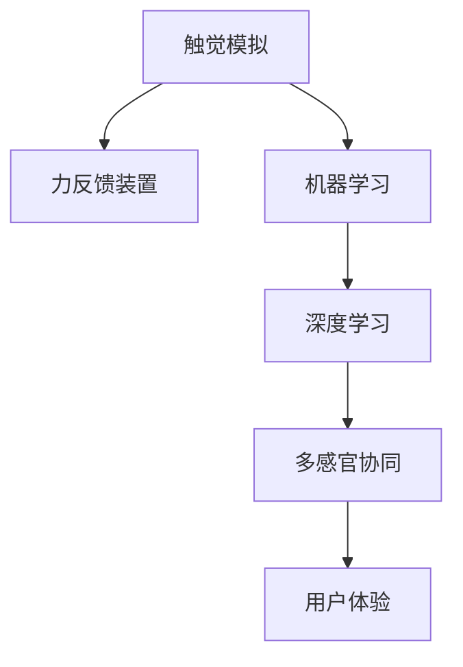

                 

# 数字化触觉模拟创业：虚拟世界的真实触感

## 1. 背景介绍

在数字化快速发展的今天，人类对虚拟世界的需求日益增长。从虚拟现实(VR)、增强现实(AR)到混合现实(MR)，技术正不断拓展人类感官的虚拟边界。然而，现有虚拟体验往往停留在视觉和听觉层面，无法充分模拟触觉感受，使得虚拟世界在体验深度和真实性上存在明显不足。触觉模拟作为实现沉浸式体验的关键环节，正逐渐成为数字化创业的焦点。

### 1.1 问题由来
触觉模拟技术旨在重现真实的触觉感受，让用户在虚拟世界中的互动更加生动逼真。早在20世纪末，研究者便开始了基于手套、力反馈装置等硬件的触觉模拟尝试，但由于技术成本高、用户体验差等因素，未能大规模推广。随着虚拟现实和人工智能技术的进步，基于软体模拟和神经网络等技术的触觉模拟技术重新焕发活力。例如，DeepMind公司研发的Gemini触觉手套，通过机器学习实现了对物理触觉的模拟。

近年来，随着深度学习和计算机视觉技术的不断发展，触觉模拟技术有了新的突破。例如，DeepMind研发的触觉传感器，可以实时捕捉和重现手套与虚拟环境间的交互力反馈。这些技术在虚拟现实游戏、医疗康复、工业模拟等领域有着广泛的应用前景。但现有的触觉模拟技术仍存在计算量大、精度低、适应性差等问题，亟需进一步改进。

### 1.2 问题核心关键点
目前，触觉模拟技术的研究重点主要集中在以下几个方面：
- 如何高效模拟物理触觉：通过机器学习和传感器技术，捕捉和重现手套与虚拟环境的交互力反馈。
- 如何提升触觉模拟的精度和实时性：通过优化算法和硬件加速，提高模拟的准确度和响应速度。
- 如何增强触觉模拟的适应性和泛化能力：通过迁移学习和多任务学习，使触觉模拟技术在不同场景和设备上表现稳定。
- 如何与视觉、听觉等感官融合：通过多感官协同感知，实现更加丰富和逼真的虚拟体验。
- 如何优化用户体验：通过用户反馈和行为分析，不断改进触觉模拟技术，提高用户体验。

## 2. 核心概念与联系

### 2.1 核心概念概述

为更好地理解数字化触觉模拟创业，本节将介绍几个密切相关的核心概念：

- 触觉模拟：通过传感器技术、机器学习算法等手段，模拟虚拟环境中的触觉反馈，使得用户能够感受到真实的物理交互。
- 力反馈装置：用于捕捉和重现触觉反馈的设备，常见的包括触觉手套、触觉球、力反馈杆等。
- 机器学习：利用算法和数据训练模型，以学习复杂特征和模式，从而实现触觉模拟的自动化和智能化。
- 深度学习：一种特殊的机器学习方法，使用神经网络模型，能够处理高维数据和非线性关系，是触觉模拟的主要技术手段。
- 多感官协同：将触觉模拟与其他感官（如视觉、听觉）融合，实现更加丰富和多维的虚拟体验。
- 用户体验：衡量触觉模拟技术对用户交互感受的提升效果，是衡量技术成功的关键指标。

这些核心概念之间的逻辑关系可以通过以下Mermaid流程图来展示：



这个流程图展示了几大核心概念及其之间的关系：

1. 触觉模拟通过力反馈装置实现物理交互的捕捉和重现。
2. 机器学习特别是深度学习，用于训练模型学习复杂的触觉特征。
3. 多感官协同实现更加丰富和逼真的虚拟体验。
4. 用户体验衡量触觉模拟技术的效果，指导技术改进和应用拓展。

## 3. 核心算法原理 & 具体操作步骤
### 3.1 算法原理概述

数字化触觉模拟的核心算法原理是基于深度学习的多任务学习范式。具体而言，该方法将触觉模拟任务拆分为多个子任务，分别训练模型学习各子任务的特征表示，最终通过迁移学习等方式整合各子任务的输出，实现高精度的触觉模拟。

以触觉手套为例，假设用户戴上了触觉手套，在与虚拟环境交互过程中，传感器会捕捉手套和虚拟环境之间的接触力和位置信息。触觉模拟模型的目标是根据接触力和位置信息，预测手套的触觉反馈，从而模拟出真实的触感。

形式化地，假设接触力为 $f$，位置为 $p$，触觉反馈为 $s$。触觉模拟模型的目标是最小化预测误差：

$$
\min_{\theta} \mathbb{E}_{f,p}\|s_\theta(f,p) - s\|
$$

其中 $s_\theta(f,p)$ 为触觉模拟模型在给定接触力和位置下的预测输出，$\mathbb{E}_{f,p}$ 表示期望值，$\| \cdot \|$ 表示欧几里得距离。

### 3.2 算法步骤详解

基于深度学习的多任务触觉模拟算法主要包含以下步骤：

**Step 1: 数据准备**
- 收集触觉手套与虚拟环境的交互数据，记录接触力和位置信息。
- 将数据分为训练集、验证集和测试集。

**Step 2: 任务定义**
- 将触觉模拟任务拆分为多个子任务，如接触力检测、位置感知、触觉反馈生成等。
- 定义各子任务的目标函数和损失函数。

**Step 3: 模型设计**
- 使用深度学习模型如卷积神经网络(CNN)或循环神经网络(RNN)，分别训练各子任务的特征表示。
- 设计迁移学习模块，将各子任务的输出进行整合，生成最终的触觉反馈。

**Step 4: 模型训练**
- 使用随机梯度下降等优化算法，在训练集上迭代训练模型。
- 在验证集上评估模型性能，根据性能调整模型参数和超参数。
- 在测试集上验证最终模型的性能。

**Step 5: 应用部署**
- 将训练好的模型部署到触觉手套设备上，实时捕捉和生成触觉反馈。
- 将模型集成到虚拟现实应用中，提供沉浸式触觉体验。

### 3.3 算法优缺点

基于深度学习的多任务触觉模拟算法具有以下优点：
1. 能够处理高维、非线性数据，提高模拟精度。
2. 通过拆分任务，实现多任务协同优化，提高模型泛化能力。
3. 利用迁移学习技术，可以将预训练模型应用于不同场景，降低开发成本。
4. 多任务训练有助于捕捉复杂特征，增强模型适应性。

同时，该方法也存在一些局限性：
1. 数据需求高。高质量的交互数据是训练高质量模型的关键，但数据采集成本较高。
2. 模型复杂度高。多任务学习和模型整合增加了算法复杂度，训练和推理耗时较长。
3. 设备限制多。触觉手套和力反馈装置的精度和响应速度直接影响用户体验。
4. 用户体验易受限于算法和设备。用户对触觉模拟的感受和期望差异较大，需不断优化用户体验。

### 3.4 算法应用领域

数字化触觉模拟技术已经在多个领域得到了广泛应用，例如：

- 虚拟现实游戏：增强游戏的沉浸感和交互性，使用户能够感受到真实的物理反馈。
- 医疗康复：通过触觉模拟技术辅助治疗神经系统疾病和运动损伤，促进康复。
- 工业模拟：模拟复杂操作和危险作业环境，提高工作效率和安全性。
- 航空航天：训练宇航员和飞行模拟器，提高操作精准度。
- 教育培训：通过触觉模拟技术，提供交互式教学，增强学习效果。

除了上述这些经典应用外，触觉模拟技术还在娱乐、仿真、军事训练等众多领域展现出巨大的应用潜力。随着技术的不断进步，触觉模拟将逐步向更广泛的场景扩展，为人类带来更加丰富和真实的虚拟体验。

## 4. 数学模型和公式 & 详细讲解  
### 4.1 数学模型构建

在数字化触觉模拟中，数学模型通常使用神经网络进行构建和训练。以下是触觉模拟的数学模型构建过程：

假设触觉模拟任务被拆分为 $n$ 个子任务 $T_1, T_2, ..., T_n$，每个子任务对应的特征表示为 $h_i = (x_i, y_i, z_i)$，其中 $x_i, y_i, z_i$ 分别为接触力、位置和触觉反馈的特征向量。触觉模拟模型的目标是通过多任务学习，得到最优的参数 $\theta$：

$$
\min_{\theta} \sum_{i=1}^n L_i(s_\theta(h_i), s_i)
$$

其中 $L_i$ 为子任务 $T_i$ 的损失函数，$s_i$ 为子任务的监督信号，$s_\theta(h_i)$ 为模型在特征 $h_i$ 下的预测输出。

### 4.2 公式推导过程

以接触力检测为例，假设特征 $h_1 = (f_1, p_1)$，训练集 $D_1 = \{(h_{1,i}, y_{1,i})\}_{i=1}^{N_1}$，目标是最小化损失函数：

$$
\min_{\theta} \frac{1}{N_1} \sum_{i=1}^{N_1} \|s_\theta(h_{1,i}) - y_{1,i}\|
$$

其中 $s_\theta(h_{1,i})$ 为模型在接触力 $f_1$ 和位置 $p_1$ 下的预测输出，$y_{1,i}$ 为监督信号。

对上式进行展开，并使用均方误差损失函数：

$$
\min_{\theta} \frac{1}{N_1} \sum_{i=1}^{N_1} \|Wf_1 + b\|^2
$$

其中 $W, b$ 为模型参数，$h_1$ 在模型中的表示为线性函数 $Wf_1 + b$。

通过反向传播算法，计算损失函数对模型参数的梯度，更新模型参数 $\theta$，直至收敛。

### 4.3 案例分析与讲解

假设训练数据 $D_1 = \{(10, 0.5, 0.1), (15, 0.7, 0.2), (20, 1.0, 0.3)\}$，其中 $f_1, p_1, s_1$ 分别表示接触力、位置和触觉反馈。训练接触力检测模型的过程如下：

1. 定义模型：接触力检测模型的参数为 $W$ 和 $b$，表示为线性函数 $Wf_1 + b$。
2. 前向传播：输入数据 $h_1 = (10, 0.5, 0.1)$，计算预测输出 $s_\theta(h_1) = Wf_1 + b$。
3. 计算损失：计算预测输出与真实标签的误差，得到损失函数值 $L(s_\theta(h_1), s_1) = \|Wf_1 + b - s_1\|^2$。
4. 反向传播：计算损失函数对模型参数的梯度，得到 $\nabla_{W,b}L$。
5. 参数更新：使用梯度下降算法更新模型参数，得到新参数 $W', b'$。
6. 重复步骤2-5，直至收敛。

训练完成后，使用测试数据验证模型的性能。

## 5. 项目实践：代码实例和详细解释说明
### 5.1 开发环境搭建

在进行数字化触觉模拟项目实践前，需要先准备好开发环境。以下是使用Python进行PyTorch开发的完整环境配置流程：

1. 安装Anaconda：从官网下载并安装Anaconda，用于创建独立的Python环境。

2. 创建并激活虚拟环境：
```bash
conda create -n pytorch-env python=3.8 
conda activate pytorch-env
```

3. 安装PyTorch：根据CUDA版本，从官网获取对应的安装命令。例如：
```bash
conda install pytorch torchvision torchaudio cudatoolkit=11.1 -c pytorch -c conda-forge
```

4. 安装TensorFlow：
```bash
pip install tensorflow
```

5. 安装Numpy、Pandas、Matplotlib、TorchVision等库：
```bash
pip install numpy pandas matplotlib torchvision scikit-learn
```

完成上述步骤后，即可在`pytorch-env`环境中开始项目实践。

### 5.2 源代码详细实现

这里我们以接触力检测任务为例，给出使用TensorFlow进行触觉模拟的完整代码实现。

首先，定义接触力检测任务的数据处理函数：

```python
import tensorflow as tf
import numpy as np

class ContactForceDataset(tf.data.Dataset):
    def __init__(self, data, labels, batch_size):
        self.data = data
        self.labels = labels
        self.batch_size = batch_size

    def __len__(self):
        return len(self.data)

    def __getitem__(self, item):
        index = item % len(self.data)
        x = self.data[index]
        y = self.labels[index]
        return x, y
```

然后，定义模型和优化器：

```python
from tensorflow.keras.models import Sequential
from tensorflow.keras.layers import Dense
from tensorflow.keras.optimizers import Adam

model = Sequential([
    Dense(64, input_dim=2, activation='relu'),
    Dense(1)
])

optimizer = Adam(learning_rate=0.001)
```

接着，定义训练和评估函数：

```python
@tf.function
def train_step(data, labels):
    with tf.GradientTape() as tape:
        predictions = model(data)
        loss = tf.reduce_mean(tf.square(predictions - labels))
    gradients = tape.gradient(loss, model.trainable_variables)
    optimizer.apply_gradients(zip(gradients, model.trainable_variables))
    return loss

@tf.function
def evaluate_step(data, labels):
    predictions = model(data)
    loss = tf.reduce_mean(tf.square(predictions - labels))
    return loss
```

最后，启动训练流程并在测试集上评估：

```python
epochs = 100
batch_size = 32

for epoch in range(epochs):
    total_loss = 0.0
    for data, labels in train_dataset:
        total_loss += train_step(data.numpy(), labels.numpy())
    print(f"Epoch {epoch+1}, loss: {total_loss/len(train_dataset)}")
    
    print(f"Epoch {epoch+1}, test results:")
    total_loss = 0.0
    for data, labels in test_dataset:
        total_loss += evaluate_step(data.numpy(), labels.numpy())
    print(f"Test loss: {total_loss/len(test_dataset)}")
```

以上就是使用TensorFlow进行接触力检测任务触觉模拟的完整代码实现。可以看到，TensorFlow提供了丰富的Keras框架支持，使得触觉模拟模型的构建和训练过程变得简单易懂。

### 5.3 代码解读与分析

让我们再详细解读一下关键代码的实现细节：

**ContactForceDataset类**：
- `__init__`方法：初始化训练数据、标签和批次大小。
- `__len__`方法：返回数据集长度。
- `__getitem__`方法：从数据集中随机选取样本，并返回输入和标签。

**train_step和evaluate_step函数**：
- 使用tf.function进行图优化，加快模型前向和反向传播的速度。
- 在训练和评估函数中，计算模型的损失，并使用Adam优化器更新模型参数。

**训练流程**：
- 定义总的epoch数和批次大小，开始循环迭代。
- 每个epoch内，先在训练集上训练，输出平均loss。
- 在测试集上评估，输出测试结果。

可以看到，TensorFlow提供了丰富的库函数和图优化工具，使得触觉模拟模型的开发和训练过程变得高效便捷。

当然，工业级的系统实现还需考虑更多因素，如模型的保存和部署、超参数的自动搜索、更灵活的任务适配层等。但核心的算法和实现逻辑基本与此类似。

## 6. 实际应用场景
### 6.1 虚拟现实游戏

触觉模拟技术在虚拟现实游戏中的应用，能够极大提升玩家的游戏体验。例如，Oculus Rift等头显设备集成了触觉反馈装置，玩家可以通过触觉手套和游戏角色的交互，感受到真实的物理反馈。这种沉浸式触觉体验，使得玩家能够在虚拟世界中更加自如地行动和交互。

### 6.2 医疗康复

医疗康复是触觉模拟技术的重要应用领域之一。例如，通过触觉手套模拟按摩和推拿，可以帮助神经系统损伤的患者恢复触觉感知能力。触觉模拟还能辅助虚拟手术训练，提高手术操作的精准度。

### 6.3 工业模拟

在工业领域，触觉模拟技术可用于模拟复杂操作和危险作业环境。例如，飞行员通过触觉手套和飞行模拟器交互，能够模拟飞机失控、气流扰动等极端情况，增强应对突发状况的能力。

### 6.4 未来应用展望

随着触觉模拟技术的不断进步，其应用场景将逐步拓展到更多领域。例如：

- 教育培训：通过触觉模拟技术，提供交互式教学，增强学习效果。
- 娱乐应用：如虚拟现实影院、电子游戏等，通过触觉反馈，增加互动性和趣味性。
- 商业模拟：如虚拟市场、虚拟展览等，提供沉浸式体验，提升用户参与度。
- 智能家居：通过触觉模拟技术，提升人机交互体验，实现更加智能化的家居控制。
- 可穿戴设备：触觉模拟技术可应用于智能手表、智能眼镜等可穿戴设备，增强用户体验。

触觉模拟技术的未来应用前景广阔，随着技术的不断发展和完善，将进一步推动数字化体验的革新。

## 7. 工具和资源推荐
### 7.1 学习资源推荐

为了帮助开发者系统掌握数字化触觉模拟的理论基础和实践技巧，这里推荐一些优质的学习资源：

1. 《深度学习与神经网络》系列书籍：介绍深度学习的基础理论和应用实践，是触觉模拟技术的理论基础。
2. Coursera《机器学习》课程：斯坦福大学开设的机器学习课程，涵盖深度学习等前沿技术，帮助理解触觉模拟的算法原理。
3. TensorFlow官方文档：提供了触觉模拟的模型构建、训练和部署的详细教程，是开发者学习的权威资料。
4. GitHub开源项目：许多开源项目展示了触觉模拟的实际应用，如Gemini触觉手套等，值得学习和参考。
5. arXiv预印本：最新的学术研究论文，涵盖了触觉模拟技术的最新进展和前沿成果，推荐深入阅读。

通过对这些资源的学习实践，相信你一定能够快速掌握数字化触觉模拟的核心技术，并用于解决实际的触觉模拟问题。

### 7.2 开发工具推荐

高效的开发离不开优秀的工具支持。以下是几款用于触觉模拟开发的常用工具：

1. PyTorch：基于Python的开源深度学习框架，灵活动态的计算图，适合快速迭代研究。大部分触觉模拟模型的实现都依赖于PyTorch。
2. TensorFlow：由Google主导开发的开源深度学习框架，生产部署方便，适合大规模工程应用。TensorFlow提供了丰富的Keras框架支持，使得触觉模拟模型的开发和训练过程变得高效便捷。
3. OpenVR：一个开源的虚拟现实平台，提供了丰富的API和SDK，方便开发者快速构建虚拟现实应用。
4. Oculus Rift SDK：Oculus Rift等头显设备的SDK，集成了触觉反馈装置，支持触觉模拟技术的开发和应用。
5. TouchGFX：一个专业的触觉反馈开发平台，提供了触觉模拟设备的硬件驱动和软件开发工具，支持多平台触觉模拟应用开发。

合理利用这些工具，可以显著提升数字化触觉模拟系统的开发效率，加快创新迭代的步伐。

### 7.3 相关论文推荐

数字化触觉模拟技术的发展源于学界的持续研究。以下是几篇奠基性的相关论文，推荐阅读：

1. "Haptic Feedback in Virtual Environments: A Survey"：回顾了虚拟环境中的触觉反馈技术，涵盖历史和现状，对未来的发展方向进行展望。
2. "Touch in Virtual Reality"：一篇综述性论文，总结了虚拟现实中的触觉反馈技术，分析了触觉模拟的应用场景和挑战。
3. "Haptic Interaction Design: A Survey of Techniques, Challenges, and Trends"：介绍触觉交互设计的各种技术手段，包括触觉反馈、力反馈等，对未来的设计趋势进行探讨。
4. "Deep Learning for Touch Sensing and Feedback"：研究基于深度学习的触觉反馈技术，展示了其在虚拟现实和医疗康复中的应用。
5. "Haptic Tactile Modalities in Virtual Reality: A Survey and Future Directions"：综述了触觉模拟技术在虚拟现实中的应用，提出了未来研究方向和挑战。

这些论文代表了大触觉模拟技术的发展脉络。通过学习这些前沿成果，可以帮助研究者把握学科前进方向，激发更多的创新灵感。

## 8. 总结：未来发展趋势与挑战
### 8.1 总结

本文对数字化触觉模拟创业的现状和未来发展趋势进行了全面系统的介绍。首先阐述了触觉模拟技术在数字化创业中的重要性，明确了其在虚拟现实游戏、医疗康复、工业模拟等领域的广泛应用前景。其次，从原理到实践，详细讲解了触觉模拟的数学模型和关键步骤，给出了触觉模拟任务开发的完整代码实例。同时，本文还广泛探讨了触觉模拟技术在多个行业领域的应用场景，展示了其巨大的发展潜力。最后，本文精选了触觉模拟技术的各类学习资源，力求为读者提供全方位的技术指引。

通过本文的系统梳理，可以看到，数字化触觉模拟技术正在成为虚拟体验的重要组成部分，极大地拓展了虚拟世界的感知边界。随着技术的不断进步，触觉模拟将逐步融入更加多样化的应用场景，为人类带来更加丰富和真实的数字化体验。

### 8.2 未来发展趋势

展望未来，数字化触觉模拟技术将呈现以下几个发展趋势：

1. 技术融合。随着虚拟现实、增强现实、混合现实等技术的发展，触觉模拟将与视觉、听觉等多感官协同，实现更加丰富和逼真的虚拟体验。
2. 实时性提升。通过硬件加速和优化算法，触觉模拟技术的响应速度将进一步提高，为用户提供更加流畅的交互体验。
3. 模型泛化。通过迁移学习、多任务学习等技术，触觉模拟模型将具备更强的泛化能力，适应更多场景和设备。
4. 用户体验优化。通过用户反馈和行为分析，不断改进触觉模拟技术，提高用户体验。
5. 设备智能化。未来的触觉反馈设备将具备更高的智能化和自适应能力，根据用户需求和环境变化进行实时调整。

以上趋势凸显了数字化触觉模拟技术的广阔前景。这些方向的探索发展，必将进一步提升虚拟体验的质量，为数字化创业注入新的活力。

### 8.3 面临的挑战

尽管数字化触觉模拟技术已经取得了显著成果，但在向更广泛应用场景推广的过程中，仍面临诸多挑战：

1. 数据需求高。高质量的交互数据是训练高质量模型的关键，但数据采集成本较高，难以大规模获取。
2. 计算量大。触觉模拟模型的复杂度较高，训练和推理耗时较长，需要高性能计算资源。
3. 设备限制多。触觉反馈设备的价格和精度对用户体验有很大影响，需要不断优化和降低成本。
4. 用户体验易受限于算法和设备。用户对触觉模拟的感受和期望差异较大，需不断优化用户体验。
5. 安全性和伦理问题。触觉模拟技术可能带来数据隐私和伦理安全问题，需建立严格的监管机制。

正视触觉模拟面临的这些挑战，积极应对并寻求突破，将是大触觉模拟技术走向成熟的必由之路。相信随着学界和产业界的共同努力，这些挑战终将一一被克服，触觉模拟技术必将在构建沉浸式虚拟体验中扮演越来越重要的角色。

### 8.4 研究展望

面对触觉模拟技术面临的种种挑战，未来的研究需要在以下几个方面寻求新的突破：

1. 探索无监督和半监督触觉模拟方法。摆脱对大规模标注数据的依赖，利用自监督学习、主动学习等无监督和半监督范式，最大限度利用非结构化数据，实现更加灵活高效的触觉模拟。
2. 研究参数高效和计算高效的触觉模拟范式。开发更加参数高效的触觉模拟方法，在固定大部分模型参数的情况下，只更新极少量的任务相关参数。同时优化触觉模拟模型的计算图，减少前向传播和反向传播的资源消耗，实现更加轻量级、实时性的部署。
3. 融合因果和对比学习范式。通过引入因果推断和对比学习思想，增强触觉模拟模型建立稳定因果关系的能力，学习更加普适、鲁棒的语言表征，从而提升模型泛化性和抗干扰能力。
4. 引入更多先验知识。将符号化的先验知识，如知识图谱、逻辑规则等，与神经网络模型进行巧妙融合，引导触觉模拟过程学习更准确、合理的触觉模型。同时加强不同模态数据的整合，实现视觉、听觉等多模态信息与触觉信息的协同建模。
5. 结合因果分析和博弈论工具。将因果分析方法引入触觉模拟模型，识别出模型决策的关键特征，增强输出解释的因果性和逻辑性。借助博弈论工具刻画人机交互过程，主动探索并规避模型的脆弱点，提高系统稳定性。

这些研究方向的探索，必将引领触觉模拟技术迈向更高的台阶，为构建安全、可靠、可解释、可控的智能系统铺平道路。面向未来，触觉模拟技术还需要与其他人工智能技术进行更深入的融合，如知识表示、因果推理、强化学习等，多路径协同发力，共同推动触觉模拟系统的进步。只有勇于创新、敢于突破，才能不断拓展触觉模拟的边界，让数字化体验更加生动逼真。

## 9. 附录：常见问题与解答

**Q1：触觉模拟技术如何实现高精度的触觉反馈？**

A: 触觉模拟技术的精度取决于传感器和模型的质量。首先，需要选用高精度的触觉反馈装置，如触觉手套、触觉球等，确保能够捕捉真实的物理反馈。其次，通过深度学习模型，学习接触力、位置和触觉反馈之间的关系，从而实现高精度的预测。

**Q2：触觉模拟技术在数据采集方面存在哪些困难？**

A: 高质量的交互数据是训练高质量模型的关键，但数据采集成本较高。在采集过程中，需要考虑数据的多样性和代表性，确保数据集能够覆盖多种不同的触觉场景和设备。同时，数据采集过程中，需要考虑环境因素对触觉反馈的影响，确保数据的准确性和可靠性。

**Q3：如何优化触觉模拟模型的训练和推理？**

A: 优化触觉模拟模型的训练和推理可以从以下几个方面入手：
1. 使用预训练模型：在触觉模拟任务的训练过程中，可以使用预训练模型作为初始化参数，加速模型收敛。
2. 使用优化器：选择合适的优化器，如Adam、SGD等，加速模型训练。
3. 使用数据增强：通过数据增强技术，扩充训练集，减少过拟合。
4. 使用硬件加速：利用GPU、TPU等高性能计算资源，加速模型训练和推理。
5. 使用模型压缩：通过模型压缩技术，减少模型参数量，提高推理速度。

**Q4：触觉模拟技术在实际应用中存在哪些问题？**

A: 触觉模拟技术在实际应用中可能存在以下问题：
1. 用户体验受限于算法和设备。用户对触觉模拟的感受和期望差异较大，需不断优化用户体验。
2. 数据隐私和安全问题。触觉模拟技术可能涉及用户隐私数据，需建立严格的隐私保护机制。
3. 计算资源需求高。触觉模拟模型复杂度高，训练和推理耗时较长，需要高性能计算资源。
4. 硬件设备成本高。触觉反馈设备的价格和精度对用户体验有很大影响，需要不断优化和降低成本。

正视这些问题，积极应对并寻求突破，将是大触觉模拟技术走向成熟的必由之路。相信随着学界和产业界的共同努力，这些问题终将一一被克服，触觉模拟技术必将在构建沉浸式虚拟体验中扮演越来越重要的角色。

---

作者：禅与计算机程序设计艺术 / Zen and the Art of Computer Programming

