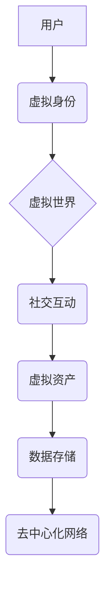

                 

## 元宇宙社交:重塑人际交往的数字平台

> 关键词：元宇宙、社交网络、虚拟现实、增强现实、数字身份、沉浸式体验、人机交互

## 1. 背景介绍

近年来，元宇宙概念的兴起掀起了科技界和社会大众的热议。元宇宙被定义为一个由虚拟现实（VR）、增强现实（AR）、区块链、人工智能等技术构建的虚拟世界，它将打破物理世界的限制，创造一个更加沉浸式、交互式和持久的人类数字空间。

社交网络作为人类连接和交流的重要平台，在元宇宙的背景下将迎来一场深刻变革。传统的社交网络主要以文本、图片和视频为媒介，用户之间的互动相对扁平和局限。而元宇宙社交则将利用VR/AR技术，构建更加逼真的虚拟环境，让用户能够以虚拟形象进行交流，体验更深层的社交互动。

## 2. 核心概念与联系

### 2.1 元宇宙社交的核心概念

元宇宙社交的核心概念包括：

* **虚拟身份：** 用户在元宇宙中拥有独特的虚拟身份，可以自定义形象、属性和社交关系。
* **沉浸式体验：** 通过VR/AR技术，用户可以身临其境地体验虚拟世界，与其他用户进行互动。
* **持久性：** 元宇宙是一个持续存在的虚拟世界，用户可以随时随地进入，并保留其虚拟资产和社交关系。
* **去中心化：** 元宇宙社交平台通常基于区块链技术，用户拥有对自身数据和虚拟资产的控制权。

### 2.2 元宇宙社交的架构



**图 2.1 元宇宙社交架构**

## 3. 核心算法原理 & 具体操作步骤

### 3.1 算法原理概述

元宇宙社交的核心算法主要包括：

* **虚拟身份生成算法：** 用于根据用户输入的信息生成独特的虚拟身份，包括形象、属性和社交关系。
* **场景渲染算法：** 用于渲染虚拟世界的场景，包括环境、物体和用户虚拟形象。
* **人机交互算法：** 用于处理用户在虚拟世界中的操作和交互，例如移动、对话、物品操作等。
* **社交关系推荐算法：** 用于根据用户的兴趣、行为和社交关系，推荐潜在的社交伙伴。

### 3.2 算法步骤详解

以虚拟身份生成算法为例，其具体步骤如下：

1. **用户数据收集：** 收集用户的个人信息、兴趣爱好、社交关系等数据。
2. **特征提取：** 从用户数据中提取关键特征，例如年龄、性别、职业、兴趣标签等。
3. **虚拟形象生成：** 根据特征信息，从预定义的虚拟形象库中选择或生成符合用户特色的虚拟形象。
4. **属性设定：** 为虚拟身份设定属性值，例如性格、能力、技能等，可以根据用户数据进行个性化设定。
5. **社交关系构建：** 根据用户兴趣和社交关系数据，构建虚拟身份之间的社交关系网络。

### 3.3 算法优缺点

**优点：**

* 可以生成更加个性化和逼真的虚拟身份。
* 可以帮助用户在虚拟世界中建立更深层的社交关系。
* 可以为用户提供更加沉浸式的社交体验。

**缺点：**

* 需要大量的用户数据进行训练和个性化设定。
* 算法的复杂度较高，需要强大的计算能力。
* 存在隐私安全和数据滥用风险。

### 3.4 算法应用领域

虚拟身份生成算法在元宇宙社交、游戏、虚拟培训等领域都有广泛的应用。

## 4. 数学模型和公式 & 详细讲解 & 举例说明

### 4.1 数学模型构建

元宇宙社交中的虚拟身份生成可以采用基于概率的数学模型，例如贝叶斯网络。贝叶斯网络是一种用于表示和推理概率关系的图模型，可以根据用户数据和预定义的知识库，计算出不同虚拟身份属性的概率分布。

### 4.2 公式推导过程

假设用户数据包括年龄、性别、职业等特征，虚拟身份属性包括形象、性格、技能等。可以使用贝叶斯公式推导出不同属性的概率分布：

$$P(A|B) = \frac{P(B|A)P(A)}{P(B)}$$

其中：

* $P(A|B)$ 是给定特征 $B$ 下属性 $A$ 的概率。
* $P(B|A)$ 是给定属性 $A$ 下特征 $B$ 的概率。
* $P(A)$ 是属性 $A$ 的先验概率。
* $P(B)$ 是特征 $B$ 的边缘概率。

### 4.3 案例分析与讲解

例如，假设用户年龄为25岁，性别为男性，职业为程序员。我们可以根据贝叶斯网络和用户数据，计算出该用户拥有不同虚拟形象的概率，例如：

* $P(形象A|年龄=25,性别=男,职业=程序员)$

通过计算公式，我们可以得到不同虚拟形象的概率分布，并根据概率选择最合适的虚拟形象。

## 5. 项目实践：代码实例和详细解释说明

### 5.1 开发环境搭建

元宇宙社交平台的开发环境通常包括：

* **编程语言：** Python、C++、Java等。
* **游戏引擎：** Unity、Unreal Engine等。
* **虚拟现实平台：** Oculus、HTC Vive等。
* **区块链平台：** Ethereum、Polygon等。

### 5.2 源代码详细实现

以下是一个简单的虚拟身份生成算法的Python代码示例：

```python
import random

class VirtualIdentity:
    def __init__(self, age, gender, occupation):
        self.age = age
        self.gender = gender
        self.occupation = occupation

        self.generate_avatar()
        self.generate_personality()
        self.generate_skills()

    def generate_avatar(self):
        # 根据年龄、性别、职业等特征，从预定义的虚拟形象库中选择或生成虚拟形象
        # ...

    def generate_personality(self):
        # 根据年龄、性别、职业等特征，设定虚拟身份的性格属性
        # ...

    def generate_skills(self):
        # 根据年龄、性别、职业等特征，设定虚拟身份的技能属性
        # ...

# 示例用法
user_data = {"age": 25, "gender": "male", "occupation": "programmer"}
virtual_identity = VirtualIdentity(**user_data)
print(virtual_identity.avatar)
print(virtual_identity.personality)
print(virtual_identity.skills)
```

### 5.3 代码解读与分析

该代码示例定义了一个`VirtualIdentity`类，用于生成虚拟身份。

* `__init__`方法初始化虚拟身份的属性，并调用其他方法生成虚拟形象、性格和技能。
* `generate_avatar`、`generate_personality`和`generate_skills`方法根据用户数据和预定义的规则，生成虚拟身份的相应属性。

### 5.4 运行结果展示

运行该代码后，会输出用户的虚拟身份信息，包括虚拟形象、性格和技能。

## 6. 实际应用场景

元宇宙社交的应用场景非常广泛，例如：

* **虚拟社交平台：** 用户可以在虚拟世界中创建虚拟形象，与其他用户进行交流、互动和娱乐。
* **虚拟会议和培训：** 利用VR/AR技术，可以创造更加沉浸式的虚拟会议和培训环境，提高学习效率和参与度。
* **虚拟旅游和体验：** 用户可以体验虚拟的旅游景点、文化活动和历史场景，感受不同的文化和生活方式。
* **虚拟游戏和娱乐：** 元宇宙社交可以为游戏和娱乐提供更加丰富的社交互动和体验。

### 6.4 未来应用展望

未来，元宇宙社交将更加深入地融入我们的生活，例如：

* **虚拟办公和协作：** 用户可以在虚拟世界中进行远程办公和协作，提高工作效率和团队协作能力。
* **虚拟教育和学习：** 元宇宙可以为教育和学习提供更加沉浸式和互动式的体验，提高学习兴趣和效果。
* **虚拟医疗和健康：** 元宇宙可以用于虚拟医疗咨询、远程手术和健康管理，提高医疗服务质量和效率。

## 7. 工具和资源推荐

### 7.1 学习资源推荐

* **书籍：** 《元宇宙：下一代互联网》
* **在线课程：** Coursera、edX等平台上的元宇宙相关课程
* **技术博客：** Hacker News、Medium等平台上的元宇宙技术博客

### 7.2 开发工具推荐

* **游戏引擎：** Unity、Unreal Engine
* **虚拟现实平台：** Oculus、HTC Vive
* **区块链平台：** Ethereum、Polygon

### 7.3 相关论文推荐

* **《元宇宙：概念、技术和应用》**
* **《元宇宙社交：未来趋势和挑战》**

## 8. 总结：未来发展趋势与挑战

### 8.1 研究成果总结

元宇宙社交是一个充满潜力的新兴领域，它将深刻地改变人类的社交方式和互动模式。

### 8.2 未来发展趋势

未来，元宇宙社交将朝着以下方向发展：

* **更加沉浸式和交互式：** VR/AR技术将更加成熟，提供更加逼真的虚拟体验。
* **更加个性化和定制化：** 用户可以更加自由地定制自己的虚拟身份和社交环境。
* **更加去中心化和安全：** 区块链技术将保障用户数据安全和隐私。

### 8.3 面临的挑战

元宇宙社交也面临着一些挑战：

* **技术难题：** 需要克服VR/AR技术、人机交互技术、数据安全技术等方面的难题。
* **社会伦理问题：** 需要解决虚拟身份的真实性、隐私保护、虚拟世界中的伦理规范等问题。
* **商业模式探索：** 需要探索新的商业模式，实现元宇宙社交的可持续发展。

### 8.4 研究展望

未来，我们需要继续深入研究元宇宙社交的理论基础、技术实现和社会影响，为构建更加安全、公平、可持续的元宇宙社交平台贡献力量。

## 9. 附录：常见问题与解答

* **什么是元宇宙？** 元宇宙是一个由虚拟现实、增强现实、区块链、人工智能等技术构建的虚拟世界，它将打破物理世界的限制，创造一个更加沉浸式、交互式和持久的人类数字空间。
* **元宇宙社交有什么优势？** 元宇宙社交可以提供更加沉浸式、交互式和个性化的社交体验，打破物理距离的限制，连接更多的人。
* **元宇宙社交有哪些应用场景？** 元宇宙社交可以应用于虚拟社交平台、虚拟会议和培训、虚拟旅游和体验、虚拟游戏和娱乐等领域。
* **元宇宙社交面临哪些挑战？** 元宇宙社交面临的技术难题、社会伦理问题和商业模式探索等挑战。


作者：禅与计算机程序设计艺术 / Zen and the Art of Computer Programming 
<end_of_turn>

