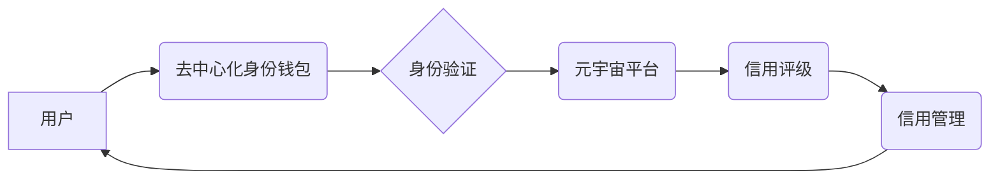

                 

## 元宇宙身份信用评级:去中心化身份验证的信用机制

> 关键词：元宇宙、身份验证、信用评级、去中心化、区块链、加密技术、数字身份、信任机制

## 1. 背景介绍

元宇宙概念的兴起，标志着人类进入一个全新的数字世界。在这个虚拟世界中，用户将拥有虚拟身份，参与各种社交、娱乐、商业等活动。然而，元宇宙的蓬勃发展也面临着诸多挑战，其中身份验证和信用体系建设尤为重要。

传统的身份验证体系依赖于中心化的机构，例如政府部门或大型科技公司，这些机构掌握着用户的身份信息，存在着数据泄露、滥用和操控的风险。此外，传统的信用体系也存在着信息孤岛、数据不透明和缺乏可信度的缺陷。

去中心化身份验证和信用评级体系的出现，为元宇宙的健康发展提供了新的解决方案。通过区块链技术、加密技术和智能合约等，可以构建一个安全、透明、可信的数字身份和信用体系，保障用户隐私和数据安全，同时建立起一个更加公平、公正的信用评价机制。

## 2. 核心概念与联系

### 2.1  去中心化身份验证

去中心化身份验证是指用户能够自主管理自己的身份信息，无需依赖于任何中心化的机构。用户可以将自己的身份信息存储在自己的数字钱包中，并通过加密技术进行保护。

当用户需要验证身份时，可以向服务提供商展示自己的身份证明，服务提供商可以验证用户的身份信息，并授权用户访问相应的服务。

### 2.2  信用评级

信用评级是指对用户的信用状况进行评估和评分，以反映用户的信用风险。信用评级可以基于用户的各种行为数据，例如交易记录、支付记录、社交行为等，通过算法模型进行计算和分析。

### 2.3  元宇宙身份信用评级体系

元宇宙身份信用评级体系是指基于去中心化身份验证和信用评级技术的，为元宇宙用户提供身份认证、信用评估和信用管理服务的系统。

该体系可以帮助用户在元宇宙中建立起可信的数字身份，并获得相应的信用评级，从而获得更多元宇宙服务的访问权限和优惠待遇。

**核心概念架构图**



## 3. 核心算法原理 & 具体操作步骤

### 3.1  算法原理概述

元宇宙身份信用评级算法的核心原理是基于用户的行为数据，通过机器学习和数据挖掘技术，构建一个信用评分模型。该模型可以对用户的行为数据进行分析，并根据预设的规则和权重，计算出用户的信用评分。

### 3.2  算法步骤详解

1. **数据收集:** 收集用户的元宇宙行为数据，例如交易记录、支付记录、社交行为、游戏行为等。
2. **数据预处理:** 对收集到的数据进行清洗、转换和格式化，去除噪声数据和无效数据。
3. **特征提取:** 从预处理后的数据中提取特征，例如交易频率、交易金额、支付延迟、社交活跃度、游戏表现等。
4. **模型训练:** 使用机器学习算法，例如逻辑回归、支持向量机、决策树等，对提取的特征进行训练，构建信用评分模型。
5. **信用评分:** 将用户的行为数据输入到训练好的模型中，计算出用户的信用评分。
6. **信用等级划分:** 将用户的信用评分映射到不同的信用等级，例如良好、一般、差等。

### 3.3  算法优缺点

**优点:**

* **客观公正:** 基于数据分析，减少人为干预，提高信用评级的客观性和公正性。
* **实时更新:** 用户行为数据实时更新，信用评分可以实时调整，更加动态和准确。
* **可扩展性强:** 可以根据不同的场景和需求，灵活调整算法模型和评分规则。

**缺点:**

* **数据依赖:** 算法的准确性依赖于数据的质量和数量，数据不足或数据偏差会导致信用评级的误差。
* **算法黑盒:** 一些复杂的机器学习算法难以解释，导致信用评级的结果难以理解和接受。
* **隐私安全:** 用户行为数据需要进行收集和分析，需要妥善处理用户隐私信息，防止数据泄露和滥用。

### 3.4  算法应用领域

元宇宙身份信用评级算法可以应用于元宇宙中的各种场景，例如：

* **虚拟资产交易:** 评估用户的信用风险，降低虚拟资产交易的欺诈风险。
* **虚拟租赁:** 评估用户的信用风险，决定是否向用户提供虚拟租赁服务。
* **虚拟贷款:** 评估用户的信用风险，决定是否向用户提供虚拟贷款服务。
* **虚拟社交:** 评估用户的信用风险，过滤恶意用户，维护虚拟社交环境的健康发展。

## 4. 数学模型和公式 & 详细讲解 & 举例说明

### 4.1  数学模型构建

元宇宙身份信用评级算法可以构建一个基于用户行为数据的线性回归模型，用于预测用户的信用评分。

**模型公式:**

$$
Score = w_1 * x_1 + w_2 * x_2 + ... + w_n * x_n + b
$$

其中:

* $Score$：用户的信用评分
* $w_1, w_2, ..., w_n$：各个特征的权重系数
* $x_1, x_2, ..., x_n$：用户的各个特征值
* $b$：模型的截距

### 4.2  公式推导过程

模型的权重系数和截距可以通过最小二乘法进行求解。最小二乘法是一种常用的回归模型参数估计方法，其目标是找到一组参数，使得模型预测值与实际值之间的误差平方和最小。

### 4.3  案例分析与讲解

假设我们想要评估用户的虚拟资产交易信用评分，我们可以选择以下特征:

* $x_1$：交易频率
* $x_2$：交易金额
* $x_3$：支付延迟

我们可以收集用户的交易数据，并使用最小二乘法训练线性回归模型。

通过训练模型，我们可以得到各个特征的权重系数和截距，例如:

* $w_1 = 0.3$
* $w_2 = 0.5$
* $w_3 = -0.2$
* $b = 60$

那么，我们可以使用以下公式来计算用户的虚拟资产交易信用评分:

$$
Score = 0.3 * x_1 + 0.5 * x_2 - 0.2 * x_3 + 60
$$

## 5. 项目实践：代码实例和详细解释说明

### 5.1  开发环境搭建

* **操作系统:** Ubuntu 20.04
* **编程语言:** Python 3.8
* **开发工具:** PyCharm
* **库依赖:** pandas, scikit-learn, numpy

### 5.2  源代码详细实现

```python
import pandas as pd
from sklearn.linear_model import LinearRegression

# 加载用户交易数据
data = pd.read_csv('user_transaction_data.csv')

# 选择特征变量和目标变量
X = data[['交易频率', '交易金额', '支付延迟']]
y = data['信用评分']

# 创建线性回归模型
model = LinearRegression()

# 训练模型
model.fit(X, y)

# 获取模型参数
coefficients = model.coef_
intercept = model.intercept_

# 打印模型参数
print('Coefficients:', coefficients)
print('Intercept:', intercept)

# 使用模型预测新的信用评分
new_data = pd.DataFrame({'交易频率': [10], '交易金额': [1000], '支付延迟': [0]})
predicted_score = model.predict(new_data)
print('Predicted Score:', predicted_score)
```

### 5.3  代码解读与分析

* 代码首先加载用户交易数据，并选择特征变量和目标变量。
* 然后创建线性回归模型，并使用训练数据训练模型。
* 训练完成后，可以获取模型的参数，例如权重系数和截距。
* 最后，可以使用模型预测新的信用评分。

### 5.4  运行结果展示

运行代码后，会输出模型参数和预测的信用评分。

## 6. 实际应用场景

元宇宙身份信用评级体系可以应用于元宇宙中的各种场景，例如：

### 6.1  虚拟资产交易

元宇宙中的虚拟资产交易平台可以利用信用评级体系，对用户的交易行为进行评估，降低交易风险。例如，信用评分高的用户可以获得更优惠的交易费用，或者更容易获得虚拟资产贷款。

### 6.2  虚拟租赁

元宇宙中的虚拟租赁平台可以利用信用评级体系，评估用户的租赁信用风险，决定是否向用户提供虚拟租赁服务。例如，信用评分高的用户可以获得更优惠的租赁价格，或者更容易获得虚拟房产租赁。

### 6.3  虚拟贷款

元宇宙中的虚拟贷款平台可以利用信用评级体系，评估用户的贷款信用风险，决定是否向用户提供虚拟贷款服务。例如，信用评分高的用户可以获得更低的贷款利率，或者更容易获得虚拟贷款。

### 6.4  未来应用展望

随着元宇宙的发展，元宇宙身份信用评级体系的应用场景将会更加广泛，例如：

* **虚拟社交:** 评估用户的社交信用风险，过滤恶意用户，维护虚拟社交环境的健康发展。
* **虚拟教育:** 评估用户的学习信用风险，提供个性化的学习资源和服务。
* **虚拟医疗:** 评估用户的医疗信用风险，提供更精准的医疗服务。

## 7. 工具和资源推荐

### 7.1  学习资源推荐

* **书籍:**
    * 《区块链技术》
    * 《人工智能》
    * 《数据挖掘》
* **在线课程:**
    * Coursera: Blockchain Specialization
    * edX: Artificial Intelligence
    * Udacity: Data Science Nanodegree

### 7.2  开发工具推荐

* **区块链开发平台:** Ethereum, Hyperledger Fabric
* **机器学习库:** scikit-learn, TensorFlow, PyTorch
* **数据库:** MongoDB, PostgreSQL

### 7.3  相关论文推荐

* **去中心化身份验证:**
    * Decentralized Identity: A Primer
    * Self-Sovereign Identity: A New Paradigm for Digital Identity
* **信用评级:**
    * Credit Scoring with Machine Learning
    * A Survey of Credit Scoring Models

## 8. 总结：未来发展趋势与挑战

### 8.1  研究成果总结

元宇宙身份信用评级体系的研究取得了显著进展，已经构建了一些基于去中心化身份验证和信用评级技术的原型系统。这些系统可以有效地评估用户的信用风险，并为元宇宙用户提供更安全、更便捷的数字服务。

### 8.2  未来发展趋势

* **更智能的信用评级模型:** 利用更先进的机器学习算法，构建更智能、更精准的信用评级模型。
* **更丰富的信用数据来源:** 探索更多元宇宙行为数据，例如游戏行为、社交行为、虚拟资产持有情况等，丰富信用评级的数据来源。
* **更完善的信用管理机制:** 建立更完善的信用管理机制，例如信用修复、信用分级、信用激励等，引导用户提升信用水平。

### 8.3  面临的挑战

* **数据隐私保护:** 如何保护用户的隐私数据，防止数据泄露和滥用，是元宇宙身份信用评级体系面临的重大挑战。
* **算法公平性:** 如何确保算法模型的公平性，避免算法歧视和偏见，也是需要解决的关键问题。
* **监管政策:** 元宇宙身份信用评级体系的监管政策尚不完善，需要政府和行业共同努力，制定相应的法律法规和标准。

### 8.4  研究展望

未来，元宇宙身份信用评级体系的研究将更加深入，将推动元宇宙的健康发展，为用户提供更安全、更便捷、更公平的数字体验。

## 9. 附录：常见问题与解答

**Q1: 元宇宙身份信用评级体系如何保证数据的安全性？**

**A1:** 元宇宙身份信用评级体系可以利用区块链技术，将用户数据存储在分布式账本中，保证数据的安全性、不可篡改性和透明性。

**Q2: 元宇宙身份信用评级体系如何避免算法歧视？**

**A2:** 在构建信用评级模型时，需要特别注意算法的公平性，避免使用可能导致歧视的特征变量，并进行充分的测试和评估，确保算法模型的公平性。

**Q3: 元宇宙身份信用评级体系的监管政策如何制定？**

**A3:** 元宇宙身份信用评级体系的监管政策需要政府和行业共同努力，制定相应的法律法规和标准，确保体系的健康发展和用户权益的保护。


作者：禅与计算机程序设计艺术 / Zen and the Art of Computer Programming 
<end_of_turn>

