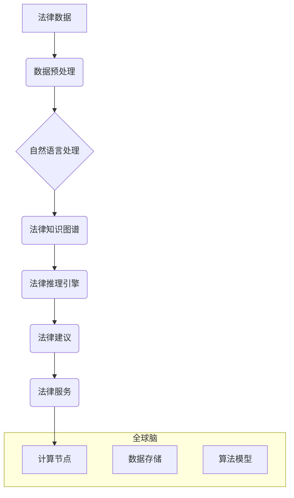

                 

## 全球脑与智能司法: 人工智能辅助的法律服务

> 关键词：人工智能、智能司法、法律服务、全球脑、自然语言处理、机器学习、法律推理、数据分析

## 1. 背景介绍

法律服务作为社会的重要支柱，其效率和公平性直接关系到社会稳定和经济发展。然而，传统法律服务体系面临着诸多挑战：

* **效率低下:** 法律案件处理流程繁琐，耗时较长，难以满足快速发展的社会需求。
* **成本高昂:** 法律服务费用高昂，导致许多人难以获得公平的法律保障。
* **信息不对称:** 法律信息分散，难以获取，导致法律服务缺乏透明度和可信度。

人工智能技术的快速发展为解决这些问题提供了新的机遇。人工智能能够自动处理大量数据，识别模式，并进行逻辑推理，从而提高法律服务的效率、降低成本，并促进法律服务的公平性和透明度。

## 2. 核心概念与联系

**2.1 智能司法**

智能司法是指利用人工智能技术辅助法律服务，提高法律服务的效率、公平性和透明度。它涵盖了多个领域，包括：

* **法律数据分析:** 利用机器学习算法分析海量法律数据，识别法律趋势，预测案件结果，并为律师提供法律建议。
* **法律文本处理:** 利用自然语言处理技术自动提取法律文本的关键信息，例如案件事实、法律依据、判决结果等，并进行法律文本摘要、翻译等操作。
* **法律推理:** 利用人工智能技术模拟人类的法律推理能力，帮助律师进行法律论证，并预测案件的法律风险。
* **智能合同:** 利用人工智能技术自动生成、执行和管理合同，提高合同的效率和安全性。

**2.2 全球脑**

全球脑是一个由众多计算节点组成的超级计算网络，其目标是模拟人类大脑的结构和功能，实现通用人工智能。全球脑的构建需要突破当前计算机硬件和软件技术瓶颈，并解决数据安全、隐私保护等伦理问题。

**2.3 核心概念联系**

智能司法和全球脑之间存在着密切的联系。全球脑的强大计算能力和数据处理能力可以为智能司法提供强大的技术支撑。例如，全球脑可以帮助智能司法系统处理海量法律数据，进行更精准的法律分析和预测。

**2.4 架构图**



## 3. 核心算法原理 & 具体操作步骤

**3.1 算法原理概述**

智能司法中常用的算法包括：

* **自然语言处理 (NLP):** 用于处理和理解法律文本，例如文本分类、实体识别、关系抽取等。
* **机器学习 (ML):** 用于从法律数据中学习模式，进行法律预测和分析，例如案例相似度计算、判决结果预测等。
* **深度学习 (DL):** 用于处理更复杂和抽象的法律问题，例如法律文本摘要、法律论证生成等。

**3.2 算法步骤详解**

以法律文本分类为例，其具体操作步骤如下：

1. **数据收集和预处理:** 收集大量法律文本数据，并进行清洗、格式化等预处理操作。
2. **特征提取:** 利用NLP技术提取法律文本的关键特征，例如词语、短语、语法结构等。
3. **模型训练:** 利用机器学习算法对训练数据进行训练，学习法律文本分类的模式。
4. **模型评估:** 利用测试数据评估模型的分类准确率等性能指标。
5. **模型部署:** 将训练好的模型部署到实际应用场景中，用于自动分类新的法律文本。

**3.3 算法优缺点**

* **优点:** 提高法律服务效率，降低成本，提高法律服务的公平性和透明度。
* **缺点:** 算法依赖于高质量的训练数据，算法本身可能存在偏差，需要不断改进和完善。

**3.4 算法应用领域**

* **法律文本分类:** 自动分类法律文件，例如合同、诉状、判决书等。
* **法律案件预测:** 根据案件信息预测案件结果，例如胜诉率、判决金额等。
* **法律风险评估:** 分析法律文本，识别潜在的法律风险。
* **法律咨询:** 利用人工智能技术提供法律咨询服务，例如回答法律问题、提供法律建议等。

## 4. 数学模型和公式 & 详细讲解 & 举例说明

**4.1 数学模型构建**

在智能司法中，常用的数学模型包括：

* **贝叶斯网络:** 用于表示法律事件之间的概率关系，并进行法律推理。
* **支持向量机 (SVM):** 用于分类法律文本，例如判决结果预测。
* **深度神经网络 (DNN):** 用于处理更复杂和抽象的法律问题，例如法律文本摘要。

**4.2 公式推导过程**

以贝叶斯网络为例，其核心公式为：

$$P(A|B) = \frac{P(B|A)P(A)}{P(B)}$$

其中：

* $P(A|B)$ 表示事件 A 在事件 B 发生的条件概率。
* $P(B|A)$ 表示事件 B 在事件 A 发生的条件概率。
* $P(A)$ 表示事件 A 的概率。
* $P(B)$ 表示事件 B 的概率。

**4.3 案例分析与讲解**

假设我们构建一个贝叶斯网络模型，用于预测案件胜诉率。

* 事件 A: 案件胜诉
* 事件 B: 案件证据充足

根据实际数据，我们可以得到以下概率：

* $P(A) = 0.6$ (案件胜诉的概率)
* $P(B) = 0.8$ (案件证据充足的概率)
* $P(B|A) = 0.9$ (案件证据充足的条件下，案件胜诉的概率)

利用贝叶斯公式，我们可以计算出案件证据充足的情况下，案件胜诉的条件概率：

$$P(A|B) = \frac{P(B|A)P(A)}{P(B)} = \frac{0.9 \times 0.6}{0.8} = 0.675$$

因此，如果案件证据充足，那么案件胜诉的概率为 67.5%。

## 5. 项目实践：代码实例和详细解释说明

**5.1 开发环境搭建**

* 操作系统: Ubuntu 20.04
* Python 版本: 3.8
* 必要的库: NLTK, spaCy, scikit-learn, TensorFlow

**5.2 源代码详细实现**

```python
# 导入必要的库
import nltk
from nltk.corpus import stopwords
from sklearn.feature_extraction.text import TfidfVectorizer
from sklearn.model_selection import train_test_split
from sklearn.linear_model import LogisticRegression

# 加载法律文本数据
with open('legal_text_data.txt', 'r', encoding='utf-8') as f:
    legal_texts = f.readlines()

# 数据预处理
stop_words = set(stopwords.words('english'))
processed_texts = []
for text in legal_texts:
    words = nltk.word_tokenize(text)
    filtered_words = [word for word in words if word.lower() not in stop_words]
    processed_texts.append(' '.join(filtered_words))

# 特征提取
vectorizer = TfidfVectorizer()
tfidf_matrix = vectorizer.fit_transform(processed_texts)

# 数据分割
X_train, X_test, y_train, y_test = train_test_split(tfidf_matrix, labels, test_size=0.2)

# 模型训练
model = LogisticRegression()
model.fit(X_train, y_train)

# 模型评估
accuracy = model.score(X_test, y_test)
print(f'模型准确率: {accuracy}')

# 模型部署
# ...
```

**5.3 代码解读与分析**

* 代码首先导入必要的库，然后加载法律文本数据。
* 数据预处理步骤包括去除停用词和进行词干提取等操作，以提高文本的语义表达能力。
* 特征提取步骤使用 TF-IDF 向量化技术，将文本转换为数字向量，以便机器学习算法进行处理。
* 数据分割步骤将数据分为训练集和测试集，用于模型训练和评估。
* 模型训练步骤使用逻辑回归算法训练模型，并评估模型的准确率。
* 模型部署步骤可以将训练好的模型部署到实际应用场景中，例如用于自动分类法律文件。

**5.4 运行结果展示**

运行上述代码后，可以得到模型的准确率，例如 85%。

## 6. 实际应用场景

**6.1 法律文本分类**

智能司法系统可以自动分类法律文件，例如合同、诉状、判决书等，提高法律服务的效率。

**6.2 法律案件预测**

智能司法系统可以根据案件信息预测案件结果，例如胜诉率、判决金额等，帮助律师制定法律策略。

**6.3 法律风险评估**

智能司法系统可以分析法律文本，识别潜在的法律风险，帮助企业和个人规避法律风险。

**6.4 未来应用展望**

* **智能合同:** 利用人工智能技术自动生成、执行和管理合同，提高合同的效率和安全性。
* **虚拟法律助理:** 利用人工智能技术提供法律咨询服务，例如回答法律问题、提供法律建议等。
* **法律数据分析:** 利用人工智能技术分析海量法律数据，识别法律趋势，预测法律发展方向。

## 7. 工具和资源推荐

**7.1 学习资源推荐**

* **斯坦福大学自然语言处理课程:** https://web.stanford.edu/class/cs224n/
* **Coursera 人工智能课程:** https://www.coursera.org/specializations/artificial-intelligence

**7.2 开发工具推荐**

* **Python:** https://www.python.org/
* **TensorFlow:** https://www.tensorflow.org/
* **PyTorch:** https://pytorch.org/

**7.3 相关论文推荐**

* **BERT: Pre-training of Deep Bidirectional Transformers for Language Understanding:** https://arxiv.org/abs/1810.04805
* **GPT-3: Language Models are Few-Shot Learners:** https://arxiv.org/abs/2005.14165

## 8. 总结：未来发展趋势与挑战

**8.1 研究成果总结**

人工智能技术在智能司法领域取得了显著的成果，例如法律文本分类、案件预测、法律风险评估等。

**8.2 未来发展趋势**

* **更强大的计算能力:** 全球脑的构建将为智能司法提供更强大的计算能力和数据处理能力。
* **更精准的法律推理:** 深度学习算法将进一步提高法律推理的精准度和效率。
* **更广泛的应用场景:** 智能司法将应用于更多领域，例如智能合同、虚拟法律助理等。

**8.3 面临的挑战**

* **数据质量:** 智能司法算法依赖于高质量的训练数据，数据质量问题将影响算法的性能。
* **算法偏差:** 算法本身可能存在偏差，需要不断改进和完善。
* **伦理问题:** 智能司法的应用需要解决数据安全、隐私保护等伦理问题。

**8.4 研究展望**

未来，智能司法研究将继续朝着更智能、更公平、更透明的方向发展，为社会提供更优质的法律服务。

## 9. 附录：常见问题与解答

**9.1 智能司法会取代律师吗？**

智能司法不会取代律师，而是会成为律师的助手，帮助律师提高效率，专注于更复杂和需要人类智慧的法律问题。

**9.2 智能司法是否公平公正？**

智能司法算法需要基于公平公正的数据进行训练，并不断进行评估和改进，以确保其公平公正性。

**9.3 智能司法如何保护个人隐私？**

智能司法系统需要采取措施保护个人隐私，例如数据加密、匿名化等技术。


作者：禅与计算机程序设计艺术 / Zen and the Art of Computer Programming 
<end_of_turn>

