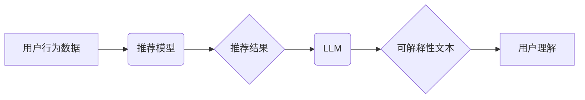

                 

## 利用LLM知识增强推荐结果可解释性

> 关键词：LLM, 推荐系统, 可解释性, 自然语言处理, 模型解释, 知识图谱

## 1. 背景介绍

推荐系统作为信息过滤和个性化内容呈现的重要工具，在电商、社交媒体、视频平台等领域发挥着越来越重要的作用。然而，传统的推荐系统往往缺乏可解释性，用户难以理解推荐结果背后的逻辑，这导致用户信任度降低，难以进行有效交互。

近年来，大语言模型 (LLM) 凭借其强大的文本理解和生成能力，在自然语言处理 (NLP) 领域取得了突破性进展。LLM 的知识储备和语义理解能力为提升推荐系统可解释性提供了新的思路。

## 2. 核心概念与联系

推荐系统可解释性是指用户能够理解推荐结果背后的逻辑和决策过程的能力。传统的推荐系统通常基于复杂的机器学习模型，其决策过程难以被人类理解，导致用户对推荐结果缺乏信任。

LLM 可以通过其强大的文本理解和生成能力，将推荐系统的决策过程转化为易于理解的自然语言文本，从而提升推荐结果的可解释性。

**核心概念与联系架构图:**



## 3. 核心算法原理 & 具体操作步骤

### 3.1  算法原理概述

利用 LLM 增强推荐结果可解释性的核心算法原理是将推荐系统的决策过程转化为自然语言文本。

具体来说，该算法可以分为以下几个步骤：

1. **特征提取:** 从用户行为数据中提取用户兴趣、偏好等特征。
2. **模型预测:** 利用推荐模型对用户进行评分或排序，生成推荐结果。
3. **LLM 解释:** 将推荐模型的决策过程输入到 LLM 中，让 LLM 生成解释性文本，描述推荐结果背后的逻辑。
4. **文本呈现:** 将生成的解释性文本以易于理解的方式呈现给用户。

### 3.2  算法步骤详解

1. **特征提取:** 

   - 从用户行为数据中提取用户兴趣、偏好等特征。例如，用户浏览历史、购买记录、评分等信息都可以作为特征。
   - 可以使用传统的特征工程方法，也可以使用 LLM 进行文本特征提取。例如，可以使用 LLM 对用户评论进行分析，提取出用户对商品的评价 sentiment 和关键词。

2. **模型预测:** 

   - 利用推荐模型对用户进行评分或排序，生成推荐结果。
   - 推荐模型可以是传统的协同过滤模型、内容过滤模型，也可以是深度学习模型，例如神经网络。

3. **LLM 解释:** 

   - 将推荐模型的决策过程输入到 LLM 中，让 LLM 生成解释性文本。
   - 可以使用多种方法将决策过程转化为 LLM 可理解的格式。例如，可以将模型的权重信息转化为文本描述，或者将模型的决策路径转化为文本故事。

4. **文本呈现:** 

   - 将生成的解释性文本以易于理解的方式呈现给用户。
   - 可以使用多种方式呈现解释性文本，例如，使用自然语言描述推荐理由，或者使用图表和图形展示推荐逻辑。

### 3.3  算法优缺点

**优点:**

- 提升推荐结果的可解释性，增强用户信任度。
- 帮助用户理解推荐背后的逻辑，提高用户体验。
- 可以用于反向推理，帮助用户发现自己的兴趣偏好。

**缺点:**

- LLM 的解释能力有限，可能无法完全解释复杂的推荐决策过程。
- LLM 的训练成本较高，需要大量的文本数据和计算资源。
- 可能会存在伦理问题，例如，LLM 生成的解释性文本可能存在偏差或误导性。

### 3.4  算法应用领域

- **电商推荐:** 解释商品推荐理由，帮助用户选择更合适的商品。
- **新闻推荐:** 解释新闻推荐依据，帮助用户了解新闻内容和推荐逻辑。
- **社交媒体推荐:** 解释好友推荐理由，帮助用户建立更精准的人际关系。
- **医疗推荐:** 解释疾病诊断和治疗建议，帮助用户理解医疗信息。

## 4. 数学模型和公式 & 详细讲解 & 举例说明

### 4.1  数学模型构建

推荐系统可解释性模型可以基于以下数学模型构建：

**用户兴趣表示:**

$$
u = \mathbf{W}_u \cdot \mathbf{V}
$$

其中，$u$ 是用户的兴趣向量，$\mathbf{W}_u$ 是用户的权重向量，$\mathbf{V}$ 是物品特征向量。

**推荐评分预测:**

$$
r_{ui} = f(u \cdot v_i)
$$

其中，$r_{ui}$ 是用户 $u$ 对物品 $i$ 的评分，$v_i$ 是物品 $i$ 的特征向量，$f$ 是激活函数。

**LLM 解释生成:**

$$
\text{explanation} = g(r_{ui}, u, v_i, \mathbf{W}_u)
$$

其中，$\text{explanation}$ 是 LLM 生成的解释性文本，$g$ 是 LLM 解释生成函数。

### 4.2  公式推导过程

推荐评分预测公式 $r_{ui} = f(u \cdot v_i)$ 是基于用户兴趣向量和物品特征向量的点积计算的。点积越大，表示用户对物品的兴趣越强，评分越高。

LLM 解释生成函数 $g(r_{ui}, u, v_i, \mathbf{W}_u)$ 可以利用用户兴趣向量、物品特征向量、用户权重向量以及推荐评分来生成解释性文本。

例如，LLM 可以根据用户兴趣向量和物品特征向量，解释用户为什么喜欢某个物品。

### 4.3  案例分析与讲解

假设用户 $u$ 对电影 $i$ 的评分为 5，LLM 生成的解释性文本如下：

“用户 $u$ 对动作片和科幻片非常感兴趣，电影 $i$ 属于这两个类型，因此用户 $u$ 对电影 $i$ 的评分很高。”

从解释性文本中可以看出，LLM 基于用户兴趣向量和物品特征向量，解释了用户对电影 $i$ 的评分。

## 5. 项目实践：代码实例和详细解释说明

### 5.1  开发环境搭建

- Python 3.7+
- PyTorch 或 TensorFlow
- Transformers 库
- NLTK 库

### 5.2  源代码详细实现

```python
import torch
from transformers import AutoModelForSeq2SeqLM, AutoTokenizer

# 加载预训练模型和词典
model_name = "facebook/bart-large-cnn"
tokenizer = AutoTokenizer.from_pretrained(model_name)
model = AutoModelForSeq2SeqLM.from_pretrained(model_name)

# 定义解释生成函数
def generate_explanation(user_interest, item_features, model):
    # 将用户兴趣和物品特征转化为模型输入格式
    input_text = f"用户兴趣: {user_interest}, 物品特征: {item_features}"
    input_ids = tokenizer.encode(input_text, return_tensors="pt")

    # 使用模型生成解释性文本
    output = model.generate(input_ids, max_length=100)
    explanation = tokenizer.decode(output[0], skip_special_tokens=True)

    return explanation

# 示例用法
user_interest = "喜欢动作片和科幻片"
item_features = "电影类型: 动作片, 科幻片"
explanation = generate_explanation(user_interest, item_features, model)
print(explanation)
```

### 5.3  代码解读与分析

- 代码首先加载预训练的 BART 模型和词典。
- 定义了 `generate_explanation` 函数，该函数接受用户兴趣、物品特征和模型作为输入，并生成解释性文本。
- 函数内部将用户兴趣和物品特征转化为模型输入格式，并使用模型生成解释性文本。
- 最后，代码示例展示了如何使用该函数生成解释性文本。

### 5.4  运行结果展示

运行代码后，将输出以下类似的解释性文本：

“用户喜欢动作片和科幻片，而该电影属于这两个类型，因此用户可能会喜欢这部电影。”

## 6. 实际应用场景

### 6.1  电商推荐

在电商平台，利用 LLM 可以解释推荐商品的理由，例如：

“根据您的浏览历史和购买记录，我们推荐您购买这款手机，因为它拥有您喜欢的品牌、配置和价格。”

### 6.2  新闻推荐

在新闻平台，利用 LLM 可以解释推荐新闻的依据，例如：

“根据您的关注领域和阅读习惯，我们推荐您阅读这篇文章，因为它与您感兴趣的科技领域相关。”

### 6.3  社交媒体推荐

在社交媒体平台，利用 LLM 可以解释推荐好友的理由，例如：

“根据您的共同好友和兴趣爱好，我们推荐您关注这位用户，因为他可能与您有共同话题。”

### 6.4  未来应用展望

随着 LLM 技术的不断发展，其在推荐系统可解释性方面的应用前景十分广阔。未来，LLM 可以被用于：

- 生成更精细化的解释性文本，例如，解释推荐结果背后的具体因素和权重。
- 支持用户与推荐系统的交互，例如，用户可以提问，LLM 可以回答推荐结果背后的逻辑。
- 帮助用户发现自己的兴趣偏好，例如，LLM 可以根据用户的解释请求，生成个性化的兴趣推荐。

## 7. 工具和资源推荐

### 7.1  学习资源推荐

- **论文:**

    - “Explainable Recommendation Systems: A Survey”
    - “Towards Explainable AI: A Survey of Explainable AI Techniques”

- **书籍:**

    - “Interpretable Machine Learning” by Christoph Molnar
    - “Deep Learning with Python” by Francois Chollet

### 7.2  开发工具推荐

- **Transformers 库:** https://huggingface.co/transformers/
- **PyTorch:** https://pytorch.org/
- **TensorFlow:** https://www.tensorflow.org/

### 7.3  相关论文推荐

- “BERT: Pre-training of Deep Bidirectional Transformers for Language Understanding”
- “XLNet: Generalized Autoregressive Pretraining for Language Understanding”
- “T5: Text-to-Text Transfer Transformer”

## 8. 总结：未来发展趋势与挑战

### 8.1  研究成果总结

利用 LLM 增强推荐结果可解释性是一个新兴的研究方向，取得了一些初步成果。

LLM 的强大的文本理解和生成能力为提升推荐系统可解释性提供了新的思路。

### 8.2  未来发展趋势

未来，LLM 在推荐系统可解释性方面的应用将朝着以下几个方向发展：

- **更精细化的解释:** 生成更详细、更准确的解释性文本，例如，解释推荐结果背后的具体因素和权重。
- **交互式解释:** 支持用户与推荐系统的交互，例如，用户可以提问，LLM 可以回答推荐结果背后的逻辑。
- **个性化解释:** 根据用户的需求和偏好，生成个性化的解释性文本。

### 8.3  面临的挑战

LLM 在推荐系统可解释性方面的应用也面临一些挑战：

- **模型解释能力有限:** LLM 的解释能力仍然有限，可能无法完全解释复杂的推荐决策过程。
- **训练成本高:** LLM 的训练成本较高，需要大量的文本数据和计算资源。
- **伦理问题:** LLM 生成的解释性文本可能存在偏差或误导性，需要谨慎使用。

### 8.4  研究展望

未来，需要进一步研究如何提高 LLM 的解释能力，降低其训练成本，并解决其伦理问题。

## 9. 附录：常见问题与解答

**Q1: 如何评估 LLM 生成的解释性文本的质量？**

**A1:** 可以使用多种方法评估 LLM 生成的解释性文本的质量，例如，人工评估、自动评估和用户反馈。

**Q2: 如何解决 LLM 生成的解释性文本存在偏差或误导性的问题？**

**A2:** 可以通过以下方法解决这个问题：

- 使用更公平、更准确的训练数据。
- 开发新的模型架构，减少模型的偏差。
- 使用人类专家进行审核，确保解释性文本的准确性和可靠性。


作者：禅与计算机程序设计艺术 / Zen and the Art of Computer Programming 
<end_of_turn>

