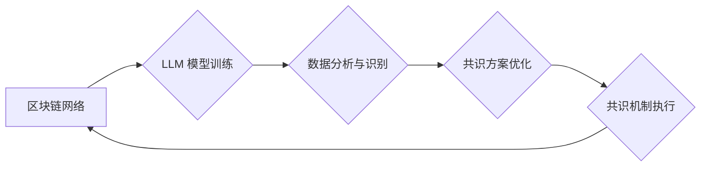

                 

## 区块链催化剂：LLM 优化共识机制

> 关键词：区块链、共识机制、LLM、人工智能、机器学习、分布式系统、网络安全

## 1. 背景介绍

区块链技术自诞生以来，凭借其去中心化、透明、安全等特性，在金融、供应链、医疗等领域展现出巨大的应用潜力。然而，区块链技术的广泛应用也面临着诸多挑战，其中共识机制是至关重要的环节。传统的共识机制，例如 Proof-of-Work (PoW) 和 Proof-of-Stake (PoS)，存在着能源消耗高、效率低、可扩展性差等问题。

近年来，人工智能（AI）技术突飞猛进，尤其是大型语言模型（LLM）的出现，为区块链共识机制的优化提供了新的思路。LLM 具备强大的语言理解和生成能力，可以用于分析区块链网络数据，识别恶意行为，并提出更有效的共识方案。

## 2. 核心概念与联系

### 2.1 区块链共识机制

区块链共识机制是区块链网络中所有节点达成一致性的机制，用于验证和确认交易的有效性，并确保区块链数据的完整性和安全性。

### 2.2 大型语言模型（LLM）

大型语言模型（LLM）是一种基于深度学习的强大人工智能模型，通过训练海量文本数据，能够理解和生成人类语言。LLM 拥有强大的文本处理能力，可以用于自然语言理解、文本生成、机器翻译等多种任务。

### 2.3 LLM 优化共识机制

将 LLM 应用于区块链共识机制，可以利用 LLM 的强大能力，提升共识机制的效率、安全性、可扩展性等方面。

**Mermaid 流程图：LLM 优化共识机制**



## 3. 核心算法原理 & 具体操作步骤

### 3.1 算法原理概述

LLM 优化共识机制的核心算法原理是利用 LLM 的文本理解和生成能力，对区块链网络中的数据进行分析和识别，并根据分析结果，优化共识方案。具体来说，该算法可以分为以下几个步骤：

1. **数据收集和预处理:** 从区块链网络中收集交易数据、区块信息等相关数据，并进行预处理，例如清洗、格式化等。
2. **LLM 模型训练:** 使用收集到的数据训练 LLM 模型，使其能够理解区块链网络的运行机制和交易行为模式。
3. **数据分析与识别:** 将新的交易数据输入到训练好的 LLM 模型中，模型会分析数据，识别潜在的恶意行为，例如双花攻击、矿池攻击等。
4. **共识方案优化:** 根据 LLM 模型的分析结果，优化共识方案，例如调整验证节点的权重、修改共识规则等，以提高共识机制的安全性、效率和可扩展性。

### 3.2 算法步骤详解

1. **数据收集和预处理:**

   - 从区块链网络中收集交易数据、区块信息、节点信息等相关数据。
   - 对收集到的数据进行清洗，去除无效数据、重复数据等。
   - 对数据进行格式化，例如将交易数据转换为结构化数据格式。

2. **LLM 模型训练:**

   - 选择合适的 LLM 模型架构，例如 Transformer、GPT 等。
   - 使用预处理后的区块链数据训练 LLM 模型，训练目标可以是识别恶意交易、预测区块生成时间等。
   - 使用交叉验证等方法评估模型的性能，并进行模型调优。

3. **数据分析与识别:**

   - 将新的交易数据输入到训练好的 LLM 模型中。
   - 模型会分析数据，识别潜在的恶意行为，例如双花攻击、矿池攻击等。
   - 模型可以输出识别结果，例如恶意交易的概率、攻击者的身份等。

4. **共识方案优化:**

   - 根据 LLM 模型的分析结果，优化共识方案。
   - 例如，可以根据恶意交易的概率调整验证节点的权重，提高对恶意交易的识别率。
   - 也可以根据攻击者的身份，采取相应的防御措施，例如封禁攻击者的节点。

### 3.3 算法优缺点

**优点:**

- **提高安全性:** LLM 可以识别更复杂的恶意行为，提高区块链网络的安全性。
- **提升效率:** LLM 可以优化共识方案，提高共识机制的效率。
- **增强可扩展性:** LLM 可以帮助区块链网络更好地处理更大量的交易数据，增强可扩展性。

**缺点:**

- **训练成本高:** 训练大型语言模型需要大量的计算资源和数据。
- **模型解释性差:** LLM 的决策过程较为复杂，难以解释其决策依据。
- **数据偏差问题:** LLM 的训练数据可能存在偏差，导致模型产生偏见。

### 3.4 算法应用领域

LLM 优化共识机制可以应用于各种区块链网络，例如：

- **公链:** 提升公链的安全性、效率和可扩展性。
- **联盟链:** 针对联盟链的特定场景，优化共识方案，提高效率和隐私性。
- **企业链:** 为企业级应用场景提供更安全、高效的共识机制。

## 4. 数学模型和公式 & 详细讲解 & 举例说明

### 4.1 数学模型构建

LLM 优化共识机制的数学模型可以基于概率论和统计学构建，例如：

- **恶意交易识别模型:** 使用贝叶斯定理构建一个识别恶意交易的概率模型，其中，先验概率代表交易为恶意交易的概率，似然概率代表给定交易数据，该交易为恶意交易的概率。

$$P(恶意交易|数据) = \frac{P(数据|恶意交易) * P(恶意交易)}{P(数据)}$$

- **共识方案优化模型:** 使用强化学习算法构建一个优化共识方案的模型，其中，奖励函数代表共识机制的性能，例如安全性、效率、可扩展性等。

### 4.2 公式推导过程

例如，在恶意交易识别模型中，我们可以使用以下公式推导识别概率：

1. **先验概率:** $P(恶意交易)$ 可以根据历史数据统计得到。
2. **似然概率:** $P(数据|恶意交易)$ 可以通过训练 LLM 模型得到，模型会学习到恶意交易的特征，并根据这些特征预测给定数据为恶意交易的概率。
3. **后验概率:** $P(恶意交易|数据)$ 可以通过贝叶斯公式计算得到，代表给定交易数据，该交易为恶意交易的概率。

### 4.3 案例分析与讲解

例如，假设我们有一个区块链网络，其中存在一种常见的恶意行为，即双花攻击。我们可以使用 LLM 训练一个识别双花攻击的模型。

1. **数据收集:** 收集历史区块链数据，包括交易数据、区块信息等。
2. **数据预处理:** 清洗数据，去除无效数据、重复数据等。
3. **LLM 模型训练:** 使用预处理后的数据训练 LLM 模型，训练目标是识别双花攻击。
4. **模型评估:** 使用交叉验证等方法评估模型的性能，例如识别双花攻击的准确率、召回率等。
5. **模型部署:** 将训练好的模型部署到区块链网络中，用于识别新的双花攻击。

## 5. 项目实践：代码实例和详细解释说明

### 5.1 开发环境搭建

- **操作系统:** Ubuntu 20.04 LTS
- **编程语言:** Python 3.8
- **深度学习框架:** TensorFlow 2.x
- **区块链框架:** Hyperledger Fabric

### 5.2 源代码详细实现

```python
# 训练 LLM 模型识别双花攻击
from tensorflow.keras.models import Sequential
from tensorflow.keras.layers import Embedding, LSTM, Dense

# 加载区块链数据
data = load_blockchain_data()

# 预处理数据
processed_data = preprocess_data(data)

# 构建 LLM 模型
model = Sequential()
model.add(Embedding(input_dim=vocab_size, output_dim=embedding_dim))
model.add(LSTM(units=lstm_units))
model.add(Dense(units=1, activation='sigmoid'))

# 编译模型
model.compile(optimizer='adam', loss='binary_crossentropy', metrics=['accuracy'])

# 训练模型
model.fit(processed_data, labels, epochs=epochs)

# 预测新交易是否为双花攻击
new_transaction_data = preprocess_data(new_transaction)
prediction = model.predict(new_transaction_data)

# 如果预测结果大于阈值，则认为该交易为双花攻击
if prediction > threshold:
    print("双花攻击检测到!")
```

### 5.3 代码解读与分析

- 代码首先加载区块链数据，并进行预处理，例如将交易数据转换为数字表示。
- 然后，构建一个 LLM 模型，使用 Embedding、LSTM 和 Dense 层。
- 模型使用 Adam 优化器，Binary Crossentropy 损失函数，并使用准确率作为评估指标。
- 训练模型后，可以用于预测新的交易是否为双花攻击。

### 5.4 运行结果展示

运行代码后，可以得到模型的训练结果，例如准确率、召回率等。

## 6. 实际应用场景

### 6.1 恶意交易检测

LLM 可以识别各种类型的恶意交易，例如双花攻击、矿池攻击、洗钱等，提高区块链网络的安全性。

### 6.2 共识规则优化

LLM 可以分析区块链网络的运行数据，识别共识机制的瓶颈，并提出优化共识规则的建议，提高共识机制的效率和可扩展性。

### 6.3 节点身份验证

LLM 可以用于验证节点的身份，防止恶意节点加入区块链网络，提高网络的安全性。

### 6.4 未来应用展望

LLM 优化共识机制在未来将有更广泛的应用场景，例如：

- **去中心化金融 (DeFi):** 提高 DeFi 应用的安全性，防止智能合约漏洞和攻击。
- **数字身份:** 为数字身份提供更安全的验证机制，防止身份盗用和欺诈。
- **供应链管理:** 提高供应链管理的透明度和安全性，防止假冒伪劣产品进入市场。

## 7. 工具和资源推荐

### 7.1 学习资源推荐

- **论文:**

    - "On the Effectiveness of Large Language Models for Blockchain Security"
    - "LLM-Based Consensus Mechanisms for Blockchain Networks"

- **博客:**

    - "LLM for Blockchain: A New Frontier"
    - "Optimizing Blockchain Consensus with Large Language Models"

### 7.2 开发工具推荐

- **TensorFlow:** 深度学习框架
- **PyTorch:** 深度学习框架
- **Hyperledger Fabric:** 区块链框架

### 7.3 相关论文推荐

- "Attention Is All You Need"
- "BERT: Pre-training of Deep Bidirectional Transformers for Language Understanding"
- "GPT-3: Language Models are Few-Shot Learners"

## 8. 总结：未来发展趋势与挑战

### 8.1 研究成果总结

LLM 优化共识机制是一个新兴的研究领域，取得了一些初步成果，例如：

- 能够识别各种类型的恶意交易，提高区块链网络的安全性。
- 可以优化共识规则，提高共识机制的效率和可扩展性。

### 8.2 未来发展趋势

未来，LLM 优化共识机制的研究将朝着以下方向发展：

- **模型性能提升:** 开发更强大的 LLMs，提高识别恶意交易和优化共识规则的能力。
- **模型解释性增强:** 研究 LLMs 的决策过程，提高模型的解释性。
- **应用场景拓展:** 将 LLM 优化共识机制应用于更多区块链网络和应用场景。

### 8.3 面临的挑战

LLM 优化共识机制也面临着一些挑战：

- **训练成本高:** 训练大型语言模型需要大量的计算资源和数据。
- **模型解释性差:** LLMs 的决策过程较为复杂，难以解释其决策依据。
- **数据偏差问题:** LLM 的训练数据可能存在偏差，导致模型产生偏见。

### 8.4 研究展望

尽管面临挑战，但 LLM 优化共识机制具有巨大的潜力，未来将成为区块链技术发展的重要方向之一。


## 9. 附录：常见问题与解答

**Q1: LLM 优化共识机制的安全性如何保证？**

**A1:** LLM 优化共识机制的安全性可以通过以下方式保证：

- 使用安全的训练数据，避免模型学习到恶意行为。
- 对模型进行攻击性测试，识别潜在的漏洞。
- 使用多重签名等机制，防止单点故障。

**Q2: LLM 优化共识机制的效率如何？**

**A2:** LLM 优化共识机制的效率取决于 LLMs 的性能和共识规则的优化程度。

**Q3: LLM 优化共识机制的成本如何？**

**A3:** LLM 优化共识机制的成本主要包括训练模型的成本和部署模型的成本。

**Q4: LLM 优化共识机制的应用场景有哪些？**

**A4:** LLM 优化共识机制可以应用于各种区块链网络和应用场景，例如：

- 恶意交易检测
- 共识规则优化
- 节点身份验证

**Q5: LLM 优化共识机制的未来发展趋势是什么？**

**A5:** LLM 优化共识机制的未来发展趋势包括：

- 模型性能提升
- 模型解释性增强
- 应用场景拓展


作者：禅与计算机程序设计艺术 / Zen and the Art of Computer Programming 
<end_of_turn>

