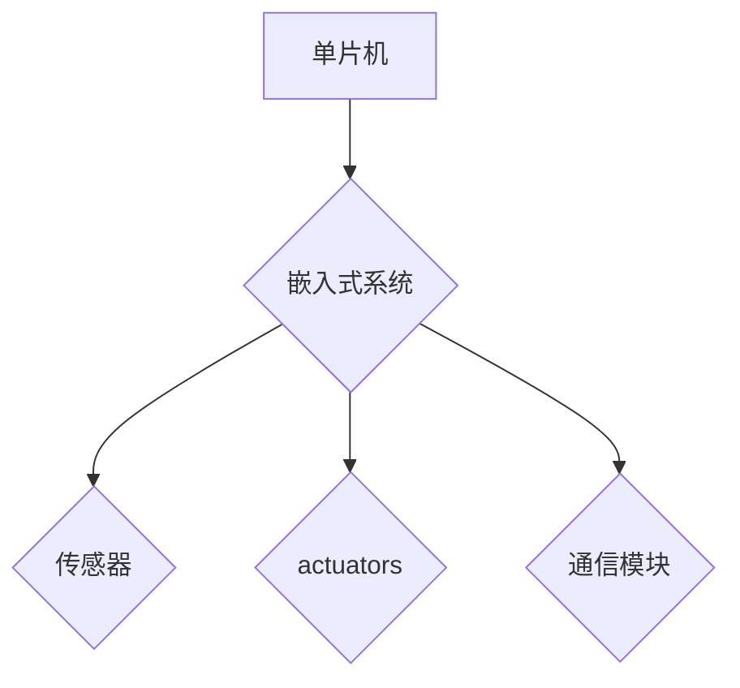

                 

## 单片机入门：微控制器应用

> 关键词：单片机、微控制器、嵌入式系统、C语言、硬件接口、应用案例

### 1. 背景介绍

随着物联网、智能家居、工业自动化等领域的蓬勃发展，嵌入式系统需求量持续增长。单片机作为嵌入式系统的核心部件，凭借其低功耗、成本低、体积小等特点，在各个领域发挥着越来越重要的作用。

单片机，也称为微控制器，是一种集微处理器、存储器、输入/输出接口等功能于一体的集成电路。它能够执行预先编写的程序，控制外部设备，实现各种功能。与通用计算机相比，单片机更侧重于特定应用场景，具有更强的实时性和可靠性。

### 2. 核心概念与联系

#### 2.1 单片机架构

单片机通常由以下几个主要部分组成：

* **CPU（中央处理器）：** 单片机的“大脑”，负责执行程序指令。
* **存储器：** 用于存储程序代码和数据。
    * **ROM（只读存储器）：** 用于存储程序代码，不可修改。
    * **RAM（随机存取存储器）：** 用于存储临时数据，可读写。
* **输入/输出接口：** 用于与外部设备进行通信和控制。
* **时钟电路：** 提供系统运行的时钟信号。

#### 2.2 嵌入式系统

嵌入式系统是指将微控制器作为核心部件，与传感器、 actuators、通信模块等硬件设备集成在一起，实现特定功能的系统。

**单片机与嵌入式系统的关系：**

单片机是嵌入式系统的核心部件，而嵌入式系统则是将单片机与其他硬件设备集成在一起，形成一个完整的系统。

**Mermaid 流程图：**



### 3. 核心算法原理 & 具体操作步骤

#### 3.1 算法原理概述

在单片机编程中，常见的算法包括：

* **状态机：** 用于描述系统在不同状态之间的转换，常用于控制逻辑的实现。
* **中断处理：** 用于响应外部事件，实现实时响应。
* **定时器：** 用于产生定时信号，实现定时控制。

#### 3.2 算法步骤详解

**状态机算法：**

1. 定义系统状态。
2. 定义状态之间的转换规则。
3. 根据输入信号和转换规则，更新系统状态。
4. 根据当前状态执行相应的动作。

**中断处理算法：**

1. 配置中断源。
2. 写入中断服务程序（ISR）。
3. 当中断发生时，系统会跳转到ISR执行。
4. ISR处理中断事件，并返回主程序。

**定时器算法：**

1. 设置定时器计数器。
2. 配置定时器中断。
3. 当定时器计数器达到设定值时，触发中断。
4. 中断服务程序执行定时任务。

#### 3.3 算法优缺点

**状态机算法：**

* **优点：** 结构清晰，易于理解和维护。
* **缺点：** 状态数量过多时，状态机可能变得复杂。

**中断处理算法：**

* **优点：** 响应速度快，能够处理实时事件。
* **缺点：** 需要仔细设计中断服务程序，避免死锁或其他问题。

**定时器算法：**

* **优点：** 实现定时控制简单易行。
* **缺点：** 精度受限于定时器硬件特性。

#### 3.4 算法应用领域

* **状态机算法：** 控制系统、游戏开发、网络协议实现。
* **中断处理算法：** 键盘输入、鼠标事件、传感器数据采集。
* **定时器算法：** 蜂鸣器控制、LED闪烁、电机控制。

### 4. 数学模型和公式 & 详细讲解 & 举例说明

#### 4.1 数学模型构建

在单片机编程中，数学模型主要用于描述硬件特性、算法行为和系统性能。例如，定时器的计数周期可以表示为：

$$T = \frac{1}{f}$$

其中：

* $T$ 为定时器计数周期。
* $f$ 为时钟频率。

#### 4.2 公式推导过程

定时器计数周期 $T$ 与时钟频率 $f$ 成反比，这意味着时钟频率越高，定时器计数周期越短。

#### 4.3 案例分析与讲解

假设单片机的时钟频率为 1MHz，则定时器计数周期为：

$$T = \frac{1}{1 \times 10^6} = 1 \mu s$$

这意味着定时器每秒会计数 100万次，每个计数周期为 1 微秒。

### 5. 项目实践：代码实例和详细解释说明

#### 5.1 开发环境搭建

常用的单片机开发环境包括：

* **Keil MDK:** 专业的单片机开发环境，支持多种单片机型号。
* **IAR Embedded Workbench:** 另一个专业的单片机开发环境，功能强大。
* **Atmel Studio:** Atmel 公司提供的单片机开发环境，支持 AVR 系列单片机。

#### 5.2 源代码详细实现

以下是一个简单的 LED 控制程序示例，使用 Keil MDK 开发环境，目标单片机为 STM32F103C8T6：

```c
#include "stm32f10x.h"

int main(void)
{
    // 使能 GPIOA 时钟
    RCC->APB2ENR |= RCC_APB2ENR_IOPAEN;

    // 设置 PA5 为输出
    GPIOA->CRL &= ~(GPIO_CRL_MODE5);
    GPIOA->CRL |= GPIO_CRL_MODE5_0;

    while (1)
    {
        // 点亮 LED
        GPIOA->ODR |= GPIO_ODR_OD5;

        // 延时 1 秒
        for (int i = 0; i < 1000000; i++);

        // 关闭 LED
        GPIOA->ODR &= ~(GPIO_ODR_OD5);

        // 延时 1 秒
        for (int i = 0; i < 1000000; i++);
    }
}
```

#### 5.3 代码解读与分析

* `#include "stm32f10x.h"`: 包含 STM32F103C8T6 的寄存器定义文件。
* `RCC->APB2ENR |= RCC_APB2ENR_IOPAEN;`: 使能 GPIOA 时钟。
* `GPIOA->CRL &= ~(GPIO_CRL_MODE5);`: 清除 PA5 的模式配置。
* `GPIOA->CRL |= GPIO_CRL_MODE5_0;`: 设置 PA5 为输出模式。
* `GPIOA->ODR |= GPIO_ODR_OD5;`: 点亮 LED。
* `GPIOA->ODR &= ~(GPIO_ODR_OD5);`: 关闭 LED。
* `for (int i = 0; i < 1000000; i++);`: 实现延时。

#### 5.4 运行结果展示

程序运行后，LED 会每隔 2 秒闪烁一次。

### 6. 实际应用场景

单片机广泛应用于各个领域，例如：

* **消费电子产品：** 智能手机、遥控器、电子游戏机。
* **工业自动化：** 机器人控制、过程控制、仪表仪器。
* **医疗设备：** 心率监测仪、血糖仪、呼吸机。
* **汽车电子：** 发动机控制单元、安全气囊控制系统、车载娱乐系统。

#### 6.4 未来应用展望

随着物联网、人工智能、大数据等技术的快速发展，单片机的应用场景将更加广泛，例如：

* **智慧家居：** 智能照明、智能空调、智能安防。
* **可穿戴设备：** 智能手表、智能眼镜、智能手环。
* **无人驾驶汽车：** 传感器数据处理、控制算法执行。
* **工业互联网：** 工厂设备监控、生产过程优化。

### 7. 工具和资源推荐

#### 7.1 学习资源推荐

* **书籍：** 《单片机原理与应用》、《嵌入式系统设计与实现》
* **网站：** STM32 官方网站、Keil 官方网站、Atmel 官方网站
* **论坛：** 嵌入式中国论坛、单片机之家论坛

#### 7.2 开发工具推荐

* **Keil MDK:** 专业的单片机开发环境，支持多种单片机型号。
* **IAR Embedded Workbench:** 另一个专业的单片机开发环境，功能强大。
* **Atmel Studio:** Atmel 公司提供的单片机开发环境，支持 AVR 系列单片机。

#### 7.3 相关论文推荐

* **嵌入式系统设计与实现**
* **单片机应用研究**
* **物联网技术与应用**

### 8. 总结：未来发展趋势与挑战

#### 8.1 研究成果总结

单片机技术发展迅速，从最初的简单控制功能，发展到如今能够实现复杂的功能，并广泛应用于各个领域。

#### 8.2 未来发展趋势

* **低功耗：** 随着物联网的发展，低功耗单片机将更加重要。
* **高性能：** 单片机性能将不断提升，能够处理更复杂的计算任务。
* **人工智能：** 单片机将集成人工智能算法，实现更智能的应用。

#### 8.3 面临的挑战

* **软件开发复杂度：** 单片机软件开发难度较高，需要掌握嵌入式系统知识和编程技巧。
* **硬件资源限制：** 单片机硬件资源有限，需要进行合理的资源分配和优化。
* **安全问题：** 单片机系统容易受到攻击，需要加强安全防护措施。

#### 8.4 研究展望

未来，单片机技术将继续发展，并与其他技术融合，例如人工智能、物联网、云计算等，为人们的生活带来更多便利和改变。

### 9. 附录：常见问题与解答

#### 9.1 什么是单片机？

单片机是一种集微处理器、存储器、输入/输出接口等功能于一体的集成电路，用于控制外部设备并执行预先编写的程序。

#### 9.2 如何选择合适的单片机？

选择单片机需要考虑以下因素：

* **处理能力：** 根据应用场景选择合适的 CPU 频率和指令集。
* **存储空间：** 根据程序和数据大小选择合适的 ROM 和 RAM 容量。
* **输入/输出接口：** 根据需要连接的设备选择合适的接口类型和数量。
* **功耗：** 根据应用场景选择合适的功耗等级。
* **价格：** 根据预算选择合适的单片机型号。

#### 9.3 如何学习单片机编程？

学习单片机编程可以参考以下步骤：

1. 了解单片机基础知识，例如架构、指令集、寄存器。
2. 选择合适的开发环境和单片机型号。
3. 学习 C 语言编程基础。
4. 练习编写简单的单片机程序，例如控制 LED 灯闪烁。
5. 逐步学习更复杂的单片机应用，例如传感器数据采集、电机控制。


作者：禅与计算机程序设计艺术 / Zen and the Art of Computer Programming<end_of_turn>

