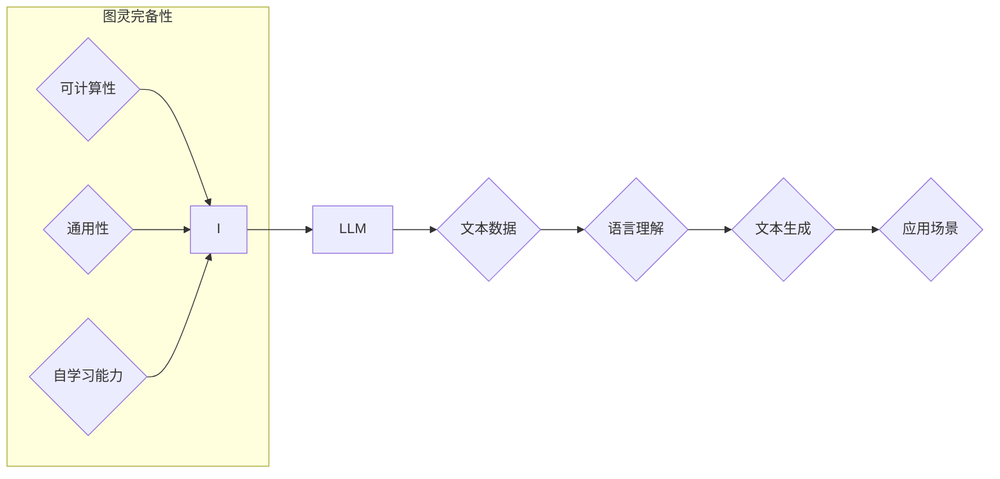

                 

## 图灵完备LLM:通向AGI的关键一步

> 关键词：图灵完备性、LLM、AGI、通用人工智能、自然语言处理、深度学习、Transformer模型

## 1. 背景介绍

人工智能（AI）的发展日新月异，近年来，大型语言模型（LLM）的兴起，为通用人工智能（AGI）的实现带来了新的希望。LLM 凭借其强大的文本生成、理解和翻译能力，在自然语言处理（NLP）领域取得了突破性的进展。然而，现有的LLM 仍然存在局限性，例如缺乏逻辑推理能力、难以处理复杂问题以及对新知识的学习能力有限。

图灵完备性是人工智能领域一个重要的概念，它指的是一个系统能够理解和生成人类语言，并能够执行任何能够被人类完成的任务。图灵完备的AI系统被认为是通向AGI的关键一步。

## 2. 核心概念与联系

### 2.1 图灵完备性

图灵完备性源于图灵机的概念，图灵机是一种理论上的计算模型，它能够模拟任何算法。一个图灵完备的系统拥有以下特性：

* **可计算性:** 能够执行任何可计算的任务。
* **通用性:**  能够处理各种类型的输入和输出，并根据输入生成不同的输出。
* **自学习能力:**  能够从数据中学习，并不断改进其性能。

### 2.2 LLM 与 图灵完备性

LLM 作为一种强大的深度学习模型，其核心是 Transformer 架构，能够捕捉文本中的长距离依赖关系，从而实现更精准的语言理解和生成。然而，现有的LLM 仍然缺乏图灵完备性，主要原因在于：

* **数据依赖性:** LLM 的训练依赖于海量文本数据，其知识和能力局限于训练数据范围。
* **缺乏逻辑推理能力:** LLM 主要依靠统计模式识别，难以进行复杂的逻辑推理和抽象思考。
* **可解释性不足:** LLM 的决策过程难以解释，缺乏透明度和可信度。

**Mermaid 流程图:**



## 3. 核心算法原理 & 具体操作步骤

### 3.1 算法原理概述

实现图灵完备LLM 需要突破现有的技术瓶颈，主要方向包括：

* **增强逻辑推理能力:**  引入逻辑推理模块，例如符号逻辑、规则推理等，增强模型的逻辑推理能力。
* **拓展知识表示:**  探索新的知识表示方法，例如知识图谱、逻辑形式化等，提升模型对知识的理解和利用能力。
* **提升可解释性:**  研究模型决策过程的可解释性方法，例如注意力机制、可视化分析等，提高模型的透明度和可信度。

### 3.2 算法步骤详解

1. **数据预处理:** 收集和预处理海量文本数据，包括清洗、分词、标记等步骤。
2. **模型架构设计:** 设计图灵完备LLM 的模型架构，包括文本编码器、逻辑推理模块、知识表示层等。
3. **模型训练:** 使用训练数据训练模型，包括参数优化、正则化等步骤。
4. **模型评估:** 使用测试数据评估模型的性能，包括准确率、召回率、F1-score等指标。
5. **模型部署:** 将训练好的模型部署到实际应用场景中。

### 3.3 算法优缺点

**优点:**

* 能够执行更复杂的任务，例如逻辑推理、问题解答、代码生成等。
* 能够更好地理解和利用知识，提升模型的泛化能力。
* 提高模型的可解释性，增强用户对模型决策的信任。

**缺点:**

* 训练成本更高，需要更多计算资源和数据。
* 模型复杂度更高，需要更复杂的算法和架构设计。
* 仍然存在一些挑战，例如如何更好地处理开放世界问题、如何提升模型的安全性等。

### 3.4 算法应用领域

图灵完备LLM 的应用领域非常广泛，包括：

* **自然语言理解:**  更精准的文本理解、情感分析、问答系统等。
* **机器翻译:**  更高质量的机器翻译，跨语言沟通更加便捷。
* **代码生成:**  自动生成代码，提高软件开发效率。
* **科学研究:**  辅助科学家进行数据分析、模型构建等工作。
* **教育领域:**  个性化学习、智能辅导等。

## 4. 数学模型和公式 & 详细讲解 & 举例说明

### 4.1 数学模型构建

图灵完备LLM 的数学模型通常基于 Transformer 架构，其核心是注意力机制和多头注意力机制。

**注意力机制:**  注意力机制允许模型关注输入序列中与当前任务相关的部分，从而提高模型的理解能力。

**公式:**

$$
Attention(Q, K, V) = \frac{exp(Q \cdot K^T / \sqrt{d_k})}{exp(Q \cdot K^T / \sqrt{d_k})} \cdot V
$$

其中：

* $Q$：查询矩阵
* $K$：键矩阵
* $V$：值矩阵
* $d_k$：键向量的维度

**多头注意力机制:**  多头注意力机制通过并行使用多个注意力头，可以捕捉到不同层次的语义信息，从而提升模型的表达能力。

### 4.2 公式推导过程

注意力机制的公式推导过程基于 softmax 函数，其目的是将输入序列中的每个元素赋予一个权重，权重高的元素被模型更加关注。

### 4.3 案例分析与讲解

例如，在机器翻译任务中，注意力机制可以帮助模型关注源语言中与目标语言单词相关的部分，从而提高翻译的准确性。

## 5. 项目实践：代码实例和详细解释说明

### 5.1 开发环境搭建

* Python 3.7+
* PyTorch 或 TensorFlow
* CUDA 和 cuDNN

### 5.2 源代码详细实现

```python
import torch
import torch.nn as nn

class Attention(nn.Module):
    def __init__(self, d_model, num_heads):
        super(Attention, self).__init__()
        self.d_model = d_model
        self.num_heads = num_heads
        self.head_dim = d_model // num_heads

        self.query = nn.Linear(d_model, d_model)
        self.key = nn.Linear(d_model, d_model)
        self.value = nn.Linear(d_model, d_model)
        self.fc_out = nn.Linear(d_model, d_model)

    def forward(self, query, key, value, mask=None):
        batch_size = query.size(0)

        # Linear projections
        Q = self.query(query).view(batch_size, -1, self.num_heads, self.head_dim).transpose(1, 2)
        K = self.key(key).view(batch_size, -1, self.num_heads, self.head_dim).transpose(1, 2)
        V = self.value(value).view(batch_size, -1, self.num_heads, self.head_dim).transpose(1, 2)

        # Scaled dot-product attention
        scores = torch.matmul(Q, K.transpose(-2, -1)) / torch.sqrt(torch.tensor(self.head_dim, dtype=torch.float))

        if mask is not None:
            scores = scores.masked_fill(mask == 0, -1e9)

        attention_weights = torch.softmax(scores, dim=-1)

        # Weighted sum of values
        context = torch.matmul(attention_weights, V)

        # Concatenate heads and project
        context = context.transpose(1, 2).contiguous().view(batch_size, -1, self.d_model)
        output = self.fc_out(context)

        return output, attention_weights
```

### 5.3 代码解读与分析

该代码实现了一个多头注意力机制模块，其中包括查询、键、值线性投影层，以及 softmax 函数计算注意力权重。

### 5.4 运行结果展示

运行该代码可以得到注意力权重矩阵，可以直观地观察模型关注哪些部分。

## 6. 实际应用场景

图灵完备LLM 的应用场景非常广泛，例如：

### 6.1 智能客服

图灵完备LLM 可以理解用户自然语言问题，并提供准确、自然的回复，提升客户服务体验。

### 6.2 个性化教育

图灵完备LLM 可以根据学生的学习情况和需求，提供个性化的学习内容和辅导，提高学习效率。

### 6.3 代码生成

图灵完备LLM 可以根据用户需求生成代码，提高软件开发效率。

### 6.4 未来应用展望

随着图灵完备LLM 技术的不断发展，其应用场景将会更加广泛，例如：

* **科学发现:**  辅助科学家进行数据分析、模型构建等工作，加速科学发现。
* **艺术创作:**  生成新的音乐、绘画、文学作品等，推动艺术创作的创新。
* **人机交互:**  实现更加自然、流畅的人机交互，例如虚拟助手、智能家居等。

## 7. 工具和资源推荐

### 7.1 学习资源推荐

* **书籍:**

    * 《深度学习》
    * 《自然语言处理》
    * 《Transformer模型》

* **在线课程:**

    * Coursera
    * edX
    * fast.ai

### 7.2 开发工具推荐

* **PyTorch:**  开源深度学习框架
* **TensorFlow:**  开源深度学习框架
* **HuggingFace Transformers:**  预训练 Transformer 模型库

### 7.3 相关论文推荐

* **Attention Is All You Need:**  Transformer 模型的开创性论文
* **BERT: Pre-training of Deep Bidirectional Transformers for Language Understanding:**  BERT 模型的论文
* **GPT-3: Language Models are Few-Shot Learners:**  GPT-3 模型的论文

## 8. 总结：未来发展趋势与挑战

### 8.1 研究成果总结

图灵完备LLM 是人工智能领域一个重要的研究方向，其发展取得了显著成果，例如 Transformer 模型、BERT 模型、GPT-3 模型等。

### 8.2 未来发展趋势

未来图灵完备LLM 的发展趋势包括：

* **模型规模更大:**  更大的模型参数量可以提升模型的性能。
* **训练数据更丰富:**  更丰富的训练数据可以帮助模型学习更广泛的知识。
* **算法更加高效:**  更有效的训练算法可以降低训练成本，提高训练效率。
* **可解释性更强:**  研究更有效的模型可解释性方法，提高模型的透明度和可信度。

### 8.3 面临的挑战

图灵完备LLM 仍然面临一些挑战，例如：

* **训练成本高:**  训练大型模型需要大量的计算资源和时间。
* **数据安全问题:**  模型训练需要使用大量数据，如何保证数据安全是一个重要问题。
* **伦理问题:**  图灵完备LLM 的应用可能会带来一些伦理问题，例如算法偏见、信息操纵等。

### 8.4 研究展望

未来研究方向包括：

* **探索新的模型架构:**  设计更有效的模型架构，提升模型的性能和效率。
* **研究新的训练算法:**  开发更有效的训练算法，降低训练成本，提高训练效率。
* **提升模型的可解释性:**  研究更有效的模型可解释性方法，提高模型的透明度和可信度。
* **解决伦理问题:**  研究图灵完备LLM 的伦理问题，制定相应的规范和制度。

## 9. 附录：常见问题与解答

### 9.1 什么是图灵完备性？

图灵完备性是指一个系统能够执行任何能够被人类完成的任务。

### 9.2 图灵完备LLM 的优势是什么？

图灵完备LLM 能够执行更复杂的任务，例如逻辑推理、问题解答、代码生成等，并能够更好地理解和利用知识。

### 9.3 图灵完备LLM 的应用场景有哪些？

图灵完备LLM 的应用场景非常广泛，例如智能客服、个性化教育、代码生成等。

### 9.4 图灵完备LLM 的未来发展趋势是什么？

未来图灵完备LLM 的发展趋势包括模型规模更大、训练数据更丰富、算法更加高效、可解释性更强等。


作者：禅与计算机程序设计艺术 / Zen and the Art of Computer Programming 
<end_of_turn>

