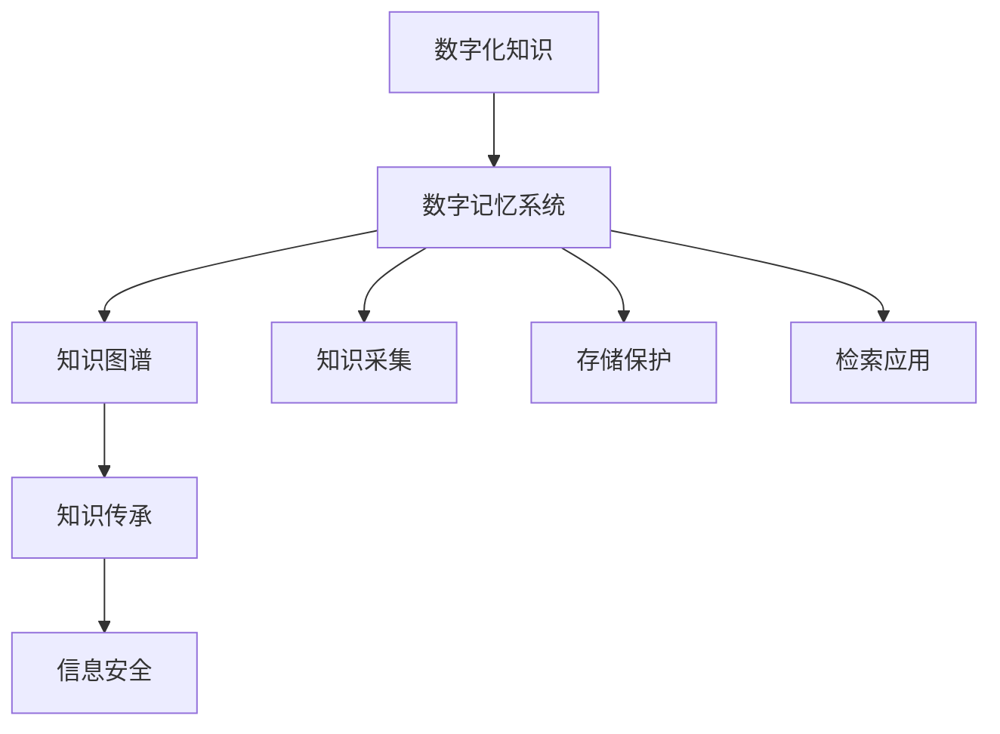

                 

# 数字化记忆：全球脑时代的知识传承

## 1. 背景介绍

### 1.1 问题由来

随着数字化技术的不断进步，我们正处于一个信息爆炸的时代。大数据、云计算、人工智能等技术的发展，极大地改变了人类的生产生活方式。在这样的大背景下，知识传承的方式也正在发生深刻变革。人类文明的历史和经验，正以前所未有的速度和规模被数字化，转化为可存储、可检索、可传递的数字信息。

这种数字化知识传承的方式，既带来了极大的便利和效率，也带来了新的挑战和问题。如何在海量的数字化信息中，更好地保存、传递和利用知识，成为当前和未来亟待解决的重要课题。

### 1.2 问题核心关键点

数字化记忆的核心关键点在于：

- **数字化**：将人类的知识和经验，通过数字化手段记录、存储和传播，打破时间和空间的限制，实现知识的无障碍流通。
- **记忆**：将知识从短期记忆转化为长期记忆，确保其在不同时间和空间中可以被持续访问和使用。
- **传承**：通过数字化记忆的方式，将知识传承给下一代，推动人类文明的进步和发展。

实现这些目标，需要构建一个高效、安全、可扩展的数字记忆系统，涵盖数据采集、存储、检索、保护、传承等多个环节，支撑人类知识的传承和应用。

### 1.3 问题研究意义

数字化记忆的研究和应用，具有重要而深远的意义：

- **知识保存**：数字化记忆系统可以长期保存人类的知识和经验，避免因人为或自然灾害等原因造成的知识丢失。
- **知识传承**：通过数字化记忆，知识可以在全球范围内迅速传播，提升全人类的知识和智慧水平。
- **知识创新**：数字化记忆系统能够存储海量的历史和现实知识，为科学家、工程师、艺术家等提供丰富的数据资源，加速知识创新和技术进步。
- **文化保护**：数字化记忆系统可以记录和保护人类的文化遗产，为后世提供研究和学习的重要资源。
- **社会公平**：数字化记忆系统可以打破知识获取的地域和阶层限制，促进教育公平和社会公正。

## 2. 核心概念与联系

### 2.1 核心概念概述

在数字化记忆的研究中，涉及多个核心概念：

- **数字化知识**：通过数字化技术记录和存储的知识，包括文本、图像、音频、视频等多种形式。
- **数字记忆系统**：实现知识采集、存储、检索、保护、传承的数字平台，涵盖数据湖、知识图谱、云存储等多种技术。
- **知识图谱**：将知识转化为结构化的语义网络，便于检索、推理和应用。
- **知识传承**：通过数字化记忆系统，将知识传递给下一代，推动社会进步和文化发展。
- **信息安全**：保护数字化记忆中的敏感信息，防止数据泄露和滥用。

这些核心概念之间相互关联，共同构成了数字化记忆的理论基础和实践框架。

### 2.2 核心概念原理和架构的 Mermaid 流程图



## 3. 核心算法原理 & 具体操作步骤

### 3.1 算法原理概述

数字化记忆的核心算法原理，主要包括以下几个方面：

- **数据采集与预处理**：通过数字化手段，将各类知识和经验转化为结构化数据，并进行初步清洗和标准化处理。
- **知识表示与存储**：将数据存储到分布式系统中，构建知识图谱，实现知识的有序化和结构化存储。
- **知识检索与推理**：构建高效的知识检索系统，支持基于关键词、语义等的多维度查询，并结合推理机制，实现知识的有序化检索和应用。
- **知识保护与传承**：通过加密、权限控制等手段，保护知识的安全性，并通过数字化记忆系统，实现知识的全球传承。

### 3.2 算法步骤详解

#### 3.2.1 数据采集与预处理

1. **数据采集**：通过网络爬虫、传感器、传感器网络等方式，采集各类知识数据，包括文本、图像、音频、视频等。
2. **数据预处理**：对采集的数据进行去重、清洗、标准化处理，去除噪声和无用信息，确保数据的质量和可用性。

#### 3.2.2 知识表示与存储

1. **知识图谱构建**：将采集的数据转化为知识图谱，将知识表示为节点和边，构建语义网络。
2. **分布式存储**：将知识图谱存储到分布式数据库中，如Hadoop、Spark等，实现知识的分布式存储和管理。

#### 3.2.3 知识检索与推理

1. **索引构建**：对知识图谱进行索引，构建倒排索引和语义索引，支持高效的检索和推理。
2. **检索与推理**：基于检索索引和推理机制，实现多维度、多层次的知识检索和推理，支持基于关键词、语义、实体等的多维度查询。

#### 3.2.4 知识保护与传承

1. **加密保护**：对存储在分布式系统中的知识进行加密处理，防止数据泄露和滥用。
2. **权限控制**：通过访问控制机制，实现知识的安全访问和管理。
3. **全球传承**：通过数字化记忆系统，将知识在全球范围内传播和传承，支持跨地域、跨文化的知识共享和交流。

### 3.3 算法优缺点

数字化记忆系统的算法优点主要包括以下几点：

- **高效存储**：通过分布式存储和知识图谱，实现知识的有效存储和组织。
- **多维度检索**：支持基于关键词、语义、实体等多种维度的查询，实现高效的知识检索。
- **全球传承**：通过数字化记忆系统，实现知识的全球传播和传承，打破地域和文化的限制。

然而，该算法也存在一些缺点：

- **数据量大**：存储和处理海量数据，对计算资源和存储资源的需求较高。
- **复杂性高**：知识图谱构建和分布式存储管理，需要高水平的工程实践和技术支持。
- **隐私风险**：知识加密和权限控制，需要有效的技术手段和管理机制，防止数据泄露和滥用。

### 3.4 算法应用领域

数字化记忆系统在多个领域都有广泛的应用，包括：

- **科学研究**：通过数字化记忆系统，存储和检索各类科研数据和文献，支持科研人员的研究工作。
- **教育培训**：提供海量的数字化教材和课程资源，支持全球教育培训和在线学习。
- **医疗健康**：存储和检索各类医疗数据和知识，支持医疗研究和临床实践。
- **文化保护**：记录和保护各类文化遗产，为后世提供研究和学习的重要资源。
- **公共服务**：提供各类公共服务数据，支持政府决策和公共管理。

## 4. 数学模型和公式 & 详细讲解 & 举例说明

### 4.1 数学模型构建

数字化记忆系统的数学模型，主要包括以下几个方面：

- **知识图谱表示**：将知识表示为节点和边的形式，构建语义网络。
- **分布式存储模型**：将知识存储到分布式数据库中，实现分布式存储和管理。
- **知识检索模型**：构建知识检索系统，支持多维度查询和推理。

### 4.2 公式推导过程

#### 4.2.1 知识图谱表示

知识图谱可以表示为三元组的形式：`(实体, 关系, 实体)`，其中实体和关系可以进一步细化为节点和边。

例如，对于知识图谱中的一个人类节点，可以表示为：

$$
\text{节点} = (\text{姓名}, \text{出生年份}, \text{去世年份}, \text{职业}, \text{作品}, \ldots)
$$

#### 4.2.2 分布式存储模型

分布式存储模型可以通过Hadoop、Spark等技术实现，知识图谱的存储可以通过如下公式表示：

$$
\text{存储} = (\text{节点}, \text{边}, \text{元组}, \ldots)
$$

其中，节点和边可以分别存储在不同的节点上，实现分布式存储。

#### 4.2.3 知识检索模型

知识检索模型可以通过倒排索引和语义索引实现，检索公式如下：

$$
\text{检索} = (\text{查询}, \text{索引}, \text{匹配结果}, \ldots)
$$

通过倒排索引，可以快速定位到包含查询词的节点和边，实现高效的查询。

### 4.3 案例分析与讲解

以医疗知识图谱为例，介绍如何构建和应用数字化记忆系统。

#### 4.3.1 数据采集与预处理

1. **数据采集**：通过医院、诊所等医疗机构的数据接口，采集病人的病历、诊断和治疗信息。
2. **数据预处理**：对采集的数据进行清洗和标准化处理，去除噪声和无用信息。

#### 4.3.2 知识图谱构建

1. **节点表示**：将病历、诊断、治疗等数据转化为节点，如`病人`、`疾病`、`治疗`等。
2. **边表示**：定义节点之间的关系，如`病人-疾病`、`疾病-治疗`等。
3. **图谱存储**：将知识图谱存储到分布式数据库中，如Hadoop、Spark等。

#### 4.3.3 知识检索与推理

1. **索引构建**：对知识图谱进行索引，构建倒排索引和语义索引，支持高效的检索和推理。
2. **检索与推理**：通过检索索引和推理机制，实现多维度、多层次的知识检索和推理，支持基于疾病、治疗、病情等的多维度查询。

## 5. 项目实践：代码实例和详细解释说明

### 5.1 开发环境搭建

在开始实践前，需要搭建好开发环境。以下是使用Python进行Hadoop开发的环境配置流程：

1. 安装Anaconda：从官网下载并安装Anaconda，用于创建独立的Python环境。

2. 创建并激活虚拟环境：
```bash
conda create -n hadoop-env python=3.8 
conda activate hadoop-env
```

3. 安装Hadoop：根据CUDA版本，从官网获取对应的安装命令。例如：
```bash
conda install hadoop -c conda-forge
```

4. 安装PySpark：
```bash
pip install pyspark
```

5. 安装各类工具包：
```bash
pip install numpy pandas scikit-learn matplotlib tqdm jupyter notebook ipython
```

完成上述步骤后，即可在`hadoop-env`环境中开始实践。

### 5.2 源代码详细实现

下面我们以医疗知识图谱为例，给出使用Hadoop和PySpark进行知识图谱构建和检索的PySpark代码实现。

首先，定义数据处理函数：

```python
from pyspark.sql import SparkSession
from pyspark.sql.functions import col, struct
from pyspark.sql.types import StructType, StructField, StringType

spark = SparkSession.builder.appName("MedicalKG").getOrCreate()

def preprocess_data(data):
    # 对采集的数据进行清洗和标准化处理
    return data.select("id", "name", "birth_year", "death_year", "occupation", "work", "disease", "treatment").dropDuplicates()
```

然后，构建知识图谱：

```python
from pyspark.sql.functions import create_map

def build_knowledge_graph(spark, data):
    # 定义节点和边
    nodes = data.select("id", "name", "birth_year", "death_year", "occupation", "work", "disease", "treatment")
    edges = nodes.select("id", "disease", "treatment")
    
    # 将节点和边转换为RDD，构建知识图谱
    graph = spark.sparkContext.parallelize(edges).toDF("source", "destination", "relation", "type")
    graph = graph.map(lambda row: (row["source"], row["destination"], row["relation"], row["type"]))
    graph = graph.toDF()

    # 将知识图谱存储到分布式系统中
    graph.write.format("parquet").save("hdfs://localhost:9000/user/medical_kg/graph")
```

最后，实现知识检索：

```python
from pyspark.sql.functions import map_entries

def search_knowledge(spark, query):
    # 构建倒排索引和语义索引
    graph = spark.read.parquet("hdfs://localhost:9000/user/medical_kg/graph")
    index = graph.select("id", "name", "birth_year", "death_year", "occupation", "work", "disease", "treatment")
    index = index.rdd.map(lambda row: (row["id"], (row["name"], row["birth_year"], row["death_year"], row["occupation"], row["work"], row["disease"], row["treatment"])).collectAsMap()
    
    # 进行知识检索
    results = []
    for q in query:
        for (id, values) in index.items():
            if q in values:
                results.append(id)
    return results
```

### 5.3 代码解读与分析

让我们再详细解读一下关键代码的实现细节：

**preprocess_data函数**：
- 对采集的数据进行清洗和标准化处理，去除噪声和无用信息。

**build_knowledge_graph函数**：
- 定义节点和边，将知识图谱存储到分布式系统中。

**search_knowledge函数**：
- 构建倒排索引和语义索引，进行知识检索，返回匹配结果。

可以看到，通过PySpark的强大分布式计算能力，我们可以高效地构建和管理知识图谱，实现快速的知识检索和应用。

## 6. 实际应用场景

### 6.1 医疗知识图谱

在医疗领域，数字化记忆系统可以通过知识图谱的方式，实现对各类医疗数据的存储和检索。例如，构建病人-疾病-治疗的知识图谱，可以实现：

- 基于症状的疾病诊断：通过检索病人症状，推荐可能存在的疾病。
- 基于治疗的疗效评估：通过检索病人的治疗方案，评估疗效。
- 基于病史的个性化治疗：通过检索病人的病史，推荐个性化治疗方案。

### 6.2 教育知识图谱

在教育领域，数字化记忆系统可以通过知识图谱的方式，实现对各类教育数据的存储和检索。例如，构建课程-教材-教师的知识图谱，可以实现：

- 基于课程的教材推荐：通过检索课程，推荐适合的教材。
- 基于教师的教学风格：通过检索教师的教学风格，推荐适合的教学方式。
- 基于学生的学习需求：通过检索学生的学习需求，推荐适合的学习资源。

### 6.3 公共服务知识图谱

在公共服务领域，数字化记忆系统可以通过知识图谱的方式，实现对各类公共数据的存储和检索。例如，构建事件-地点-人物的知识图谱，可以实现：

- 基于地点的公共事件：通过检索地点，推荐公共事件。
- 基于人物的公共信息：通过检索人物，推荐公共信息。
- 基于事件的社会影响：通过检索事件，评估社会影响。

## 7. 工具和资源推荐

### 7.1 学习资源推荐

为了帮助开发者系统掌握数字化记忆的理论基础和实践技巧，这里推荐一些优质的学习资源：

1. 《Hadoop from the Ground Up》书籍：详细介绍了Hadoop的基本概念和使用方法，适合初学者入门。
2. 《Spark: The Definitive Guide》书籍：全面介绍了Spark的核心特性和高级用法，适合中级开发者。
3. 《深度学习与大数据》课程：由斯坦福大学开设的课程，涵盖了深度学习和大数据的基本概念和前沿技术。
4. Kaggle：数据科学竞赛平台，提供了大量数据集和实际应用场景，适合实践学习。
5. GitHub：代码托管平台，提供了大量开源项目和代码示例，适合参考学习。

通过对这些资源的学习实践，相信你一定能够快速掌握数字化记忆的精髓，并用于解决实际的NLP问题。

### 7.2 开发工具推荐

高效的开发离不开优秀的工具支持。以下是几款用于数字化记忆开发的常用工具：

1. Hadoop：基于Java的开源分布式计算框架，支持海量数据的分布式存储和处理。
2. Spark：基于Java和Scala的开源分布式计算框架，支持快速迭代和大规模数据处理。
3. Jupyter Notebook：交互式编程环境，支持Python、R等多种语言，适合数据分析和可视化。
4. PySpark：基于Python的Spark API，支持分布式计算和数据处理。
5. Apache Kafka：分布式消息系统，支持数据流处理和实时计算。

合理利用这些工具，可以显著提升数字化记忆任务的开发效率，加快创新迭代的步伐。

### 7.3 相关论文推荐

数字化记忆的研究和应用，源于学界的持续研究。以下是几篇奠基性的相关论文，推荐阅读：

1. "The Knowledge Graph Challenge"论文：介绍了知识图谱的基本概念和构建方法，是知识图谱研究的奠基之作。
2. "A Survey on Knowledge Graph Embeddings and Their Applications"论文：全面介绍了知识图谱嵌入技术的研究进展和应用场景。
3. "Knowledge Graphs: Concepts, Approaches, and Challenges"论文：详细介绍了知识图谱的研究现状和未来方向，是知识图谱研究的权威文献。
4. "Semantic Technologies: An Overview"论文：介绍了语义技术的基本概念和应用场景，是语义技术研究的奠基之作。
5. "Knowledge Graphs for Big Data"论文：介绍了知识图谱在处理大规模数据中的应用方法和挑战。

这些论文代表了大语言模型微调技术的发展脉络。通过学习这些前沿成果，可以帮助研究者把握学科前进方向，激发更多的创新灵感。

## 8. 总结：未来发展趋势与挑战

### 8.1 总结

本文对数字化记忆的研究和应用进行了全面系统的介绍。首先阐述了数字化记忆的背景和意义，明确了知识传承方式转变的必然性和紧迫性。其次，从原理到实践，详细讲解了知识图谱构建、分布式存储、知识检索等关键技术，给出了数字化记忆任务开发的完整代码实例。同时，本文还探讨了数字化记忆系统在多个领域的应用前景，展示了数字化记忆技术的广阔前景。最后，本文精选了数字化记忆技术的学习资源和开发工具，力求为读者提供全方位的技术指引。

通过本文的系统梳理，可以看到，数字化记忆系统在多个领域中有着广泛的应用前景，为知识传承和应用提供了新的技术路径。未来，伴随数字化记忆技术的持续演进，知识传承的方式将变得更加便捷和高效，为社会进步和文化发展提供更加坚实的基础。

### 8.2 未来发展趋势

展望未来，数字化记忆技术的发展趋势主要包括以下几个方面：

1. **技术融合**：数字化记忆系统将与其他人工智能技术进行更深入的融合，如自然语言处理、知识推理、深度学习等，提升系统的智能化水平。
2. **数据多样化**：数字化记忆系统将支持更多类型的数据，包括文本、图像、音频、视频等，实现更加全面和丰富的知识表示。
3. **知识共享**：数字化记忆系统将支持全球范围内的知识共享和协作，促进跨地域、跨文化的知识交流。
4. **安全保护**：数字化记忆系统将加强数据安全保护，防止数据泄露和滥用，确保知识的安全性和隐私性。
5. **用户体验**：数字化记忆系统将提升用户体验，提供更加友好和便捷的知识获取方式。
6. **多模态融合**：数字化记忆系统将支持多模态数据的融合，提升对现实世界的理解和建模能力。

### 8.3 面临的挑战

尽管数字化记忆技术已经取得了显著成果，但在迈向更加智能化、普适化应用的过程中，仍面临诸多挑战：

1. **数据质量**：数据采集和预处理过程中，如何确保数据的质量和可用性，避免噪声和偏差。
2. **计算资源**：大规模数据的存储和处理，需要高水平的计算资源和存储资源，如何高效地利用计算资源是一个重要挑战。
3. **知识更新**：数字化记忆系统需要实时更新知识库，保持知识的时效性和准确性，如何高效地更新和维护知识库是一个重要挑战。
4. **隐私保护**：数字化记忆系统需要保护数据隐私和用户隐私，防止数据泄露和滥用，如何建立有效的隐私保护机制是一个重要挑战。
5. **跨领域应用**：数字化记忆系统需要支持跨领域的知识应用，如何实现不同领域知识的无缝衔接是一个重要挑战。

### 8.4 研究展望

未来数字化记忆技术的研究方向主要包括以下几个方面：

1. **多模态知识表示**：将不同模态的知识进行融合，提升对现实世界的理解和建模能力。
2. **知识图谱嵌入**：通过知识图谱嵌入技术，提升知识图谱的语义表示能力，增强系统的推理和检索能力。
3. **知识推理与发现**：结合知识图谱和人工智能技术，实现知识的推理与发现，支持更深入的知识应用。
4. **知识协同与协作**：通过数字化记忆系统，支持全球范围内的知识协同与协作，促进跨地域、跨文化的知识交流。
5. **知识安全与隐私**：建立有效的知识安全与隐私保护机制，确保知识的安全性和隐私性。
6. **知识智能化**：结合深度学习、自然语言处理等技术，提升系统的智能化水平，实现更高效的知识应用。

这些研究方向将进一步推动数字化记忆技术的发展，为知识的传承和应用提供更加坚实的技术基础。

## 9. 附录：常见问题与解答

**Q1：如何构建高效的数字化记忆系统？**

A: 构建高效的数字化记忆系统，需要从数据采集、知识表示、分布式存储、知识检索等多个环节进行全面优化。以下是几个关键步骤：

1. **数据采集与预处理**：通过网络爬虫、传感器、传感器网络等方式，采集各类知识数据，并进行清洗和标准化处理，去除噪声和无用信息。
2. **知识表示与存储**：将数据转化为知识图谱，存储到分布式系统中，构建倒排索引和语义索引，支持高效的检索和推理。
3. **分布式存储与管理**：选择合适的分布式存储系统，如Hadoop、Spark等，实现知识的分布式存储和管理。
4. **知识检索与推理**：通过倒排索引和推理机制，实现多维度、多层次的知识检索和推理，支持基于关键词、语义、实体等的多维度查询。
5. **隐私保护与安全**：采用加密、权限控制等手段，保护知识的安全性，防止数据泄露和滥用。

**Q2：如何优化知识图谱的构建？**

A: 优化知识图谱的构建，需要从以下几个方面入手：

1. **数据源选择**：选择高质量的数据源，确保数据的质量和准确性。
2. **数据清洗与预处理**：对采集的数据进行清洗和标准化处理，去除噪声和无用信息。
3. **实体关系抽取**：使用实体关系抽取技术，自动提取实体和关系，减少人工标注的繁琐工作。
4. **知识表示**：选择合适的知识表示方式，如三元组、图谱等，确保知识的有序化和结构化。
5. **知识更新与维护**：实时更新知识库，保持知识的时效性和准确性，建立有效的知识更新机制。

**Q3：如何提升知识检索的效率？**

A: 提升知识检索的效率，需要从以下几个方面入手：

1. **倒排索引构建**：构建高效的倒排索引，支持基于关键词的多维度查询。
2. **语义索引构建**：构建语义索引，支持基于语义的查询，提高检索的准确性和效率。
3. **分布式存储管理**：选择合适的分布式存储系统，实现高效的检索和推理。
4. **多维查询支持**：支持基于关键词、语义、实体等多维度的查询，提高检索的全面性和准确性。
5. **检索算法优化**：使用高效的检索算法，如向量检索、神经网络检索等，提升检索的效率和效果。

**Q4：如何确保数字化记忆系统的安全性？**

A: 确保数字化记忆系统的安全性，需要从以下几个方面入手：

1. **加密保护**：对存储在分布式系统中的知识进行加密处理，防止数据泄露和滥用。
2. **权限控制**：通过访问控制机制，实现知识的安全访问和管理，防止非法访问。
3. **审计与监控**：实时监控系统状态，记录和分析异常行为，确保系统的安全性。
4. **灾难恢复**：建立灾难恢复机制，确保系统在故障情况下能够快速恢复，减少数据损失。
5. **隐私保护**：采用隐私保护技术，如数据匿名化、差分隐私等，确保用户的隐私安全。

通过以上措施，可以构建一个高效、安全、可扩展的数字记忆系统，实现知识的长期保存、传承和应用。

**Q5：如何提升数字化记忆系统的用户体验？**

A: 提升数字化记忆系统的用户体验，需要从以下几个方面入手：

1. **友好界面**：设计友好的用户界面，提高系统的易用性和可操作性。
2. **多设备支持**：支持多种设备，如手机、平板、电脑等，提高系统的普及度和便捷性。
3. **多语言支持**：支持多语言，提高系统的国际化水平。
4. **交互式体验**：通过交互式界面，提供丰富的交互体验，增强用户的参与感和满意度。
5. **个性化推荐**：通过推荐系统，个性化推荐用户感兴趣的内容，提升用户体验。

通过以上措施，可以构建一个更加友好、便捷、个性化的数字化记忆系统，满足用户的多样化需求。

---

作者：禅与计算机程序设计艺术 / Zen and the Art of Computer Programming

