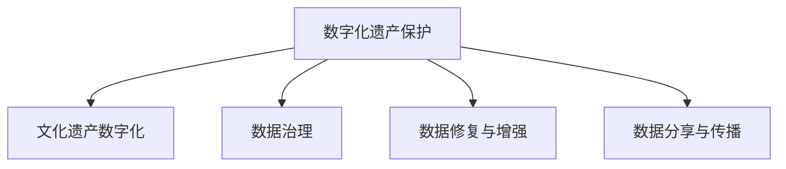

                 

# 数字化遗产保护创业：文化传承的科技支持

> 关键词：数字化遗产保护, 文化传承, 数据治理, 数字修复, 人工智能, 机器学习, 大数据

## 1. 背景介绍

### 1.1 问题由来
随着科技的迅猛发展和社会的不断进步，人类社会的物质和精神财富不断积累，许多珍贵的文化遗产正面临着被时间流逝所侵蚀的危险。传统文化的保护工作通常依赖人工修复和物理媒介保存，耗费大量人力物力且难以长期保存。数字化遗产保护技术的出现，为文化遗产的传承和保护提供了新的可能。

数字化遗产保护包括对历史文献、艺术作品、录音、影像等多类型文化遗产的数字化采集、存储、整理、分析和传播。通过数字化技术，可以高效地将文化资源数字化，并将其以标准化的形式存储和传播，实现长久保存和文化传承。

### 1.2 问题核心关键点
数字化遗产保护技术的研究重点在于：
1. **高效的数据采集与处理**：自动化、批量化地将物理或数字介质上的文化资源进行数字化采集。
2. **数据治理与质量控制**：确保数字化数据的完整性、准确性和可靠性，实现数据的长久保存。
3. **数据修复与增强**：利用AI和大数据技术，对数字化遗产进行去损、去噪和增强，恢复其原有的表现力。
4. **数据分享与传播**：通过互联网技术，实现数字化遗产的全球共享和传播，促进文化的交流与融合。

## 2. 核心概念与联系

### 2.1 核心概念概述

为更好地理解数字化遗产保护技术的核心概念，本节将介绍几个密切相关的核心概念：

- **数字化遗产保护**：指利用数字化技术对文化遗产进行采集、存储、整理、分析和传播的过程。包括数字化的前期准备、数据处理、数据治理和数据利用等环节。
- **文化遗产数字化**：指通过数字技术手段，将物理介质上的文化遗产转化为可存储、可检索、可展示的数字格式的过程。
- **数据治理**：指对数字化数据进行规划、设计、组织、维护、评估和改进的一系列活动，旨在确保数据的完整性、可用性和安全性。
- **数据修复与增强**：指利用AI技术，对数字化遗产进行去损、去噪和增强，以恢复其原有的表现力。
- **数据分享与传播**：指通过互联网技术，实现数字化遗产的全球共享和传播，促进文化的交流与融合。

这些核心概念之间的逻辑关系可以通过以下Mermaid流程图来展示：



这个流程图展示了大语言模型的核心概念及其之间的关系：

1. 数字化遗产保护是整个数字化工作的前提。
2. 文化遗产数字化是数字化保护的具体实施过程。
3. 数据治理和数据修复是数字化遗产保护的关键环节，确保数据的质量和完整性。
4. 数据分享与传播是数字化遗产保护的重要目标，促进文化的全球交流。

## 3. 核心算法原理 & 具体操作步骤
### 3.1 算法原理概述

数字化遗产保护技术的核心在于数据采集、数据治理、数据修复与增强，以及数据分享与传播。其算法原理主要涉及以下几个方面：

1. **数据采集**：包括图像采集、语音采集、文本采集等。利用光学字符识别技术(OCR)、扫描仪、摄像机等设备对文化遗产进行数字化采集。
2. **数据治理**：包括数据清洗、数据标准化、数据归档等。通过数据清洗去除噪声和错误，确保数据的准确性；通过数据标准化统一格式，便于后续处理；通过数据归档保证数据的安全和长久保存。
3. **数据修复与增强**：包括图像去损、去噪、图像增强等。利用图像处理技术对采集到的图像进行去损、去噪和增强，恢复其原有的表现力。
4. **数据分享与传播**：包括数据索引、数据展示、数据传播等。通过互联网技术，实现数字化遗产的全球共享和传播，促进文化的交流与融合。

### 3.2 算法步骤详解

数字化遗产保护技术的实施通常包括以下几个关键步骤：

**Step 1: 前期准备与数据采集**
- 确定数字化遗产的类别和范围，选择合适的数字化工具。
- 进行数据采集，采集图像、文本、声音等多媒体数据。
- 对采集到的数据进行初步检查和预处理。

**Step 2: 数据清洗与标准化**
- 去除采集数据中的噪声、错误和冗余信息。
- 统一数据格式和标准，确保数据的一致性和互操作性。
- 对数据进行分类、标记和归档，便于后续处理和利用。

**Step 3: 数据修复与增强**
- 利用图像处理技术对图像进行去损、去噪和增强，恢复其原有的表现力。
- 利用语音处理技术对声音进行去噪和增强，提升音质和清晰度。
- 利用文本处理技术对文本进行纠错和归一化，确保文本的准确性和可读性。

**Step 4: 数据治理与质量控制**
- 建立数据治理框架，确保数据的完整性、可用性和安全性。
- 进行数据质量控制，定期进行数据审计和检查，发现和修复问题。
- 建立数据备份和恢复机制，保证数据的长久保存和可靠性。

**Step 5: 数据分享与传播**
- 将数字化遗产上传到互联网平台，如博物馆官网、数字图书馆等。
- 通过API接口、搜索引擎等技术，实现数字化遗产的全球共享和传播。
- 利用虚拟现实(VR)、增强现实(AR)等技术，提供沉浸式体验，增强用户的文化体验。

### 3.3 算法优缺点

数字化遗产保护技术具有以下优点：
1. 高效便捷。自动化、批量化地进行数据采集和处理，大幅提高工作效率。
2. 信息保存。数字化数据可以长期保存，不受物理媒介的限制。
3. 传播便捷。数字化遗产可以通过互联网广泛传播，实现全球共享。
4. 便于利用。数字化遗产可以方便地进行检索、分析和展示，便于后续研究利用。

同时，该方法也存在一定的局限性：
1. 数据质量。数据采集和处理的准确性和完整性直接影响数字化遗产的质量。
2. 技术门槛。数字化保护技术需要专业的技术和工具，对用户的技术水平有一定要求。
3. 版权问题。数字化遗产的版权保护和权益分配需要法律和政策的支持。
4. 隐私安全。数字化数据的存储和传播需要考虑隐私和安全性，防止数据泄露。

尽管存在这些局限性，但就目前而言，数字化遗产保护技术仍是大规模文化遗产保护的重要手段。未来相关研究的重点在于如何进一步提升数据质量、降低技术门槛，同时兼顾版权和隐私安全等因素。

### 3.4 算法应用领域

数字化遗产保护技术已经在博物馆、图书馆、档案馆等文化机构得到了广泛应用，具体包括：

1. **博物馆数字化**：对展品进行数字化采集和处理，制作虚拟展馆，提供虚拟导览和互动体验。
2. **图书馆数字化**：对古籍、手稿、照片等进行数字化扫描和修复，建立数字化档案馆，提供在线阅读和搜索功能。
3. **档案馆数字化**：对历史文档、信件、照片等进行数字化采集和处理，建立数字化档案，便于研究利用。
4. **艺术品数字化**：对绘画、雕塑、陶瓷等艺术品进行数字化扫描和增强，提供高清展示和虚拟修复功能。
5. **声音遗产数字化**：对录音、音乐、口述历史等声音遗产进行数字化采集和处理，建立数字化档案，提供在线收听和分析功能。

## 4. 数学模型和公式 & 详细讲解  
### 4.1 数学模型构建

本节将使用数学语言对数字化遗产保护技术的核心算法进行更加严格的刻画。

### 4.2 公式推导过程

假设数字化遗产为 $H$，包括图像、文本、声音等多种类型。数字化保护过程主要分为数据采集、数据处理、数据修复、数据分享等多个环节。设 $F$ 为数据采集函数，$P$ 为数据处理函数，$R$ 为数据修复函数，$S$ 为数据分享函数。则数字化保护过程的数学模型可表示为：

$$
H' = R(P(F(H)))
$$

其中 $H'$ 为处理后的数字化遗产。

### 4.3 案例分析与讲解

以博物馆数字化为例，具体分析其数字化保护过程。假设博物馆有若干展品，每个展品包括文字说明、图片、音视频等多媒体数据。首先，通过扫描仪和摄像机对展品进行数字化采集，得到原始数字数据 $H$。然后，对采集到的数据进行清洗和标准化，去除噪声和错误，统一格式，得到处理后的数据 $H_1$。接着，对处理后的数据进行图像去损、去噪和增强，恢复其原有的表现力，得到修复后的数据 $H_2$。最后，将修复后的数据上传到互联网平台，建立虚拟展馆，通过API接口和搜索引擎等技术，实现数字化遗产的全球共享和传播。

## 5. 项目实践：代码实例和详细解释说明
### 5.1 开发环境搭建

在进行数字化遗产保护技术开发前，我们需要准备好开发环境。以下是使用Python进行OpenCV开发的环境配置流程：

1. 安装Anaconda：从官网下载并安装Anaconda，用于创建独立的Python环境。

2. 创建并激活虚拟环境：
```bash
conda create -n cv-env python=3.8 
conda activate cv-env
```

3. 安装OpenCV：根据CUDA版本，从官网获取对应的安装命令。例如：
```bash
conda install opencv opencv-python opencv-contrib-python -c conda-forge
```

4. 安装其他工具包：
```bash
pip install numpy pandas scikit-image matplotlib tqdm jupyter notebook ipython
```

完成上述步骤后，即可在`cv-env`环境中开始数字化遗产保护实践。

### 5.2 源代码详细实现

这里我们以博物馆数字化为例，给出使用OpenCV库对数字化遗产进行修复的PyTorch代码实现。

首先，定义数字化遗产的数据结构和预处理函数：

```python
import cv2
import numpy as np

class DigitalHeritage:
    def __init__(self, path):
        self.image = cv2.imread(path)
        self.height, self.width, self.channels = self.image.shape

    def preprocess(self):
        # 图像去损
        self.image = self.image[self.image != 0]
        # 图像去噪
        self.image = cv2.medianBlur(self.image, 3)
        # 图像增强
        self.image = cv2.adaptiveThreshold(self.image, 255, cv2.ADAPTIVE_THRESH_GAUSSIAN_C, cv2.THRESH_BINARY_INV+cv2.THRESH_OTSU)
        return self.image

# 读取图片数据
heritage = DigitalHeritage('image.jpg')
processed_image = heritage.preprocess()
```

然后，定义图像修复函数：

```python
def restore_image(image):
    # 图像去损
    image = image[image != 0]
    # 图像去噪
    image = cv2.medianBlur(image, 3)
    # 图像增强
    image = cv2.adaptiveThreshold(image, 255, cv2.ADAPTIVE_THRESH_GAUSSIAN_C, cv2.THRESH_BINARY_INV+cv2.THRESH_OTSU)
    return image

# 修复图片
processed_image = restore_image(processed_image)
```

最后，保存修复后的图片：

```python
cv2.imwrite('processed_image.jpg', processed_image)
```

以上就是使用OpenCV库对数字化遗产进行修复的完整代码实现。可以看到，通过OpenCV库的强大封装，我们可以用相对简洁的代码完成图像的预处理和修复。

### 5.3 代码解读与分析

让我们再详细解读一下关键代码的实现细节：

**DigitalHeritage类**：
- `__init__`方法：初始化图像数据，读取图片路径。
- `preprocess`方法：对图像进行去损、去噪和增强，提升图像质量。

**restore_image函数**：
- 定义了三个主要处理步骤：去损、去噪和增强。
- 使用OpenCV库的函数实现这些步骤，简单易懂。

**代码实现**：
- 通过创建DigitalHeritage类实例，读取图片数据。
- 调用preprocess方法进行预处理和修复。
- 将修复后的图片保存到本地文件。

可以看到，OpenCV库使得图像修复的代码实现变得简洁高效。开发者可以将更多精力放在预处理和修复算法的优化上，而不必过多关注底层的实现细节。

当然，工业级的系统实现还需考虑更多因素，如图片的批处理、多线程并发、并行处理等。但核心的修复范式基本与此类似。

## 6. 实际应用场景
### 6.1 智能博物馆

数字化遗产保护技术可以广泛应用于智能博物馆的建设。传统博物馆主要依靠人工讲解和实物展示，信息传播效率较低，用户体验较差。通过数字化遗产保护技术，博物馆可以实现以下几点：

1. **虚拟导览**：利用虚拟现实(VR)和增强现实(AR)技术，用户可以通过虚拟导览了解展品的详细信息，增强沉浸式体验。
2. **在线展览**：将数字化遗产上传到博物馆官网或虚拟展览平台，用户可以通过互联网随时访问和浏览。
3. **互动展览**：通过触摸屏等交互设备，用户可以与展品进行互动，例如点击图片获取更多信息、听声音了解历史背景等。
4. **个性化推荐**：利用AI技术，根据用户浏览历史和兴趣偏好，推荐相关展品，提高用户粘性和满意度。

### 6.2 数字图书馆

数字化遗产保护技术同样可以应用于数字图书馆的建设。传统图书馆主要依靠纸质书籍和卡片，信息检索效率较低，用户获取信息较慢。通过数字化遗产保护技术，图书馆可以实现以下几点：

1. **在线搜索**：将数字化遗产上传到图书馆官网或数字图书馆平台，用户可以通过搜索快速获取所需信息。
2. **电子阅读**：提供PDF、EPUB等电子格式，用户可以随时随地在线阅读。
3. **自动化管理**：利用OCR技术自动扫描和提取文本信息，建立电子档案，便于管理。
4. **个性化推荐**：根据用户阅读历史和兴趣偏好，推荐相关书籍和文献，提升用户阅读体验。

### 6.3 数字档案馆

数字化遗产保护技术也可以应用于数字档案馆的建设。传统档案馆主要依靠纸质文件和录音带，信息管理效率较低，用户获取信息较慢。通过数字化遗产保护技术，档案馆可以实现以下几点：

1. **数字化扫描**：对历史文件、信件、照片等进行数字化扫描和处理，建立电子档案。
2. **档案管理**：利用数据治理技术，对数字化档案进行分类、标记和归档，便于检索和利用。
3. **在线展示**：将数字化档案上传到档案馆官网或数字档案馆平台，用户可以通过互联网随时访问和浏览。
4. **个性化展示**：利用虚拟现实(VR)和增强现实(AR)技术，提供沉浸式展示体验，增强用户兴趣。

## 7. 工具和资源推荐
### 7.1 学习资源推荐

为了帮助开发者系统掌握数字化遗产保护技术的理论基础和实践技巧，这里推荐一些优质的学习资源：

1. **《计算机视觉：算法与应用》**：李航等著，全面介绍了计算机视觉的基本概念和算法，包括图像处理、目标检测、人脸识别等。
2. **《数字文化遗产保护与利用》**：李斌等著，涵盖了数字文化遗产保护的基本理论和技术，包括数据采集、数据处理、数据治理等。
3. **Coursera《计算机视觉与深度学习》课程**：斯坦福大学开设的计算机视觉课程，涵盖计算机视觉的基本概念和深度学习算法，适合初学者入门。
4. **Udacity《机器学习工程师》课程**：Udacity开设的机器学习课程，涵盖机器学习的基本概念和算法，适合进阶学习。
5. **GitHub上的数字文化遗产保护项目**：如HuggingFace的MUSE（文化遗产保护库），提供了丰富的数字文化遗产保护算法和模型。

通过对这些资源的学习实践，相信你一定能够快速掌握数字化遗产保护技术的精髓，并用于解决实际的数字化保护问题。
###  7.2 开发工具推荐

高效的开发离不开优秀的工具支持。以下是几款用于数字化遗产保护开发的常用工具：

1. **OpenCV**：开源计算机视觉库，提供了丰富的图像处理函数，适合进行图像去损、去噪和增强等操作。
2. **TensorFlow**：由Google主导开发的深度学习框架，适合进行复杂模型训练和推理，支持大规模图像修复。
3. **PyTorch**：基于Python的开源深度学习框架，灵活高效，适合进行深度学习算法的实验和部署。
4. **Keras**：由François Chollet开发的深度学习框架，简单易用，适合进行快速原型设计和验证。
5. **HuggingFace Transformers**：提供多种预训练语言模型，适合进行文本处理和增强。

合理利用这些工具，可以显著提升数字化遗产保护任务的开发效率，加快创新迭代的步伐。

### 7.3 相关论文推荐

数字化遗产保护技术的发展源于学界的持续研究。以下是几篇奠基性的相关论文，推荐阅读：

1. **Image Restoration Using Deep Convolutional Neural Networks**：Jian et al. 提出使用卷积神经网络进行图像去损和增强的方法。
2. **Adaptive Thresholding Technique for Enhancing Historical Text Images**：Agrawal et al. 提出使用自适应阈值技术对历史文本图像进行增强的方法。
3. **Denoising and Enhancement of Historical Images**：Li et al. 提出使用非局部均值滤波和直方图均衡化等方法对历史图像进行去噪和增强。
4. **Textual Data Management and Processing in Digital Heritages**：Jain et al. 讨论了数字文化遗产中文本数据的采集、处理和存储。
5. **Digital Heritage Protection and Utilization**：Wang et al. 综述了数字文化遗产保护的基本理论和实践技术。

这些论文代表了大语言模型微调技术的发展脉络。通过学习这些前沿成果，可以帮助研究者把握学科前进方向，激发更多的创新灵感。

## 8. 总结：未来发展趋势与挑战
### 8.1 总结

本文对数字化遗产保护技术进行了全面系统的介绍。首先阐述了数字化遗产保护的背景和意义，明确了数字化保护在文化遗产传承和保护中的重要作用。其次，从原理到实践，详细讲解了数字化保护的核心算法和关键步骤，给出了数字化保护任务开发的完整代码实例。同时，本文还广泛探讨了数字化保护技术在博物馆、图书馆、档案馆等文化机构的应用前景，展示了数字化保护技术的巨大潜力。

通过本文的系统梳理，可以看到，数字化遗产保护技术正在成为文化遗产保护的重要手段，极大地拓展了文化遗产保护的范围和深度，推动了文化资源的数字化和全球共享。未来，伴随数字化技术的发展和应用场景的拓展，数字化遗产保护技术必将进一步提升文化遗产保护的效果和应用范围，为文化传承提供新的解决方案。

### 8.2 未来发展趋势

展望未来，数字化遗产保护技术将呈现以下几个发展趋势：

1. **技术融合**：数字化遗产保护将与人工智能、物联网、区块链等技术深度融合，实现智能化、个性化、安全化的保护。
2. **数据共享**：数字化遗产保护将构建全球数据共享平台，促进不同国家和地区的文化交流与合作。
3. **多方协作**：数字化遗产保护将建立多方协作机制，包括政府、企业、社区、学术界等，共同推动文化遗产保护的发展。
4. **可持续性**：数字化遗产保护将注重可持续发展，避免对环境和文化的影响，实现文化遗产保护与生态保护的平衡。
5. **智能维护**：数字化遗产保护将采用智能维护技术，实现对数字化遗产的实时监控和维护，延长其使用寿命。

以上趋势凸显了数字化遗产保护技术的广阔前景。这些方向的探索发展，必将进一步提升文化遗产保护的效果和应用范围，为文化传承提供新的解决方案。

### 8.3 面临的挑战

尽管数字化遗产保护技术已经取得了瞩目成就，但在迈向更加智能化、普适化应用的过程中，它仍面临着诸多挑战：

1. **数据质量**：数字化遗产的质量和完整性直接影响保护效果，如何提高数据采集和处理的准确性和可靠性，将是重要挑战。
2. **技术门槛**：数字化保护技术需要专业的技术和工具，如何降低技术门槛，提高用户体验，将是关键课题。
3. **版权问题**：数字化遗产的版权保护和权益分配需要法律和政策的支持，如何建立有效的版权保护机制，将是重要问题。
4. **隐私安全**：数字化数据的存储和传播需要考虑隐私和安全性，防止数据泄露，保障文化遗产的安全。
5. **成本问题**：数字化保护需要大量的资金投入，如何降低成本，提高效率，将是重要挑战。

尽管存在这些挑战，但数字化遗产保护技术无疑是大规模文化遗产保护的重要手段。未来相关研究的重点在于如何进一步提升数据质量、降低技术门槛，同时兼顾版权和隐私安全等因素。

### 8.4 研究展望

面对数字化遗产保护所面临的种种挑战，未来的研究需要在以下几个方面寻求新的突破：

1. **多模态数据融合**：将图像、声音、文本等多种类型的数据进行融合处理，实现全面、精确的保护效果。
2. **智能数据治理**：利用AI技术，对数字化遗产进行自动分类、标记和归档，提高数据治理的效率和精度。
3. **增强现实技术**：利用增强现实技术，提供沉浸式展示体验，增强用户对文化遗产的认知和兴趣。
4. **区块链技术**：利用区块链技术，实现数字化遗产的透明、安全和不可篡改，确保文化遗产的完整性和安全性。
5. **跨领域协作**：推动数字化遗产保护技术与医疗、旅游、教育等领域的深度融合，实现多领域协同创新。

这些研究方向的探索，必将引领数字化遗产保护技术迈向更高的台阶，为文化传承提供更加全面、智能、安全、可持续的解决方案。

## 9. 附录：常见问题与解答

**Q1：数字化遗产保护是否适用于所有文化遗产？**

A: 数字化遗产保护技术适用于大多数文化遗产，特别是那些具有数字化可操作性的遗产，如纸质文件、照片、视频等。对于那些难以数字化的遗产，如实物遗物、手工艺品等，需要结合数字化和物理保护相结合的方式。

**Q2：数字化遗产保护是否需要大量资金投入？**

A: 数字化遗产保护需要一定的资金投入，但相对于传统保护方式，数字化保护技术可以大幅降低成本，提高保护效果。此外，通过政府、企业、社区等多方合作，可以有效分散资金压力。

**Q3：数字化遗产保护技术是否容易学习和应用？**

A: 数字化遗产保护技术相对复杂，需要一定的技术背景。但通过系统的学习和实践，可以逐步掌握其核心思想和实现方法。目前，已有许多开源工具和示例代码，方便开发者上手实践。

**Q4：数字化遗产保护技术如何保障数据的隐私和安全？**

A: 数字化遗产保护技术需要采用数据加密、访问控制等措施，保障数据的隐私和安全。同时，建立数据备份和恢复机制，确保数据的长久保存和可靠性。

**Q5：数字化遗产保护技术是否会带来环境影响？**

A: 数字化遗产保护技术对环境的影响较小，但需要注意设备和材料的环保性，以及数据存储和传输的节能减排。合理规划数字化保护方案，可以最大程度减少环境影响。

通过回答这些常见问题，相信你一定能够更加全面地理解数字化遗产保护技术的本质和实践，为文化遗产的保护和传承做出积极贡献。

---

作者：禅与计算机程序设计艺术 / Zen and the Art of Computer Programming

