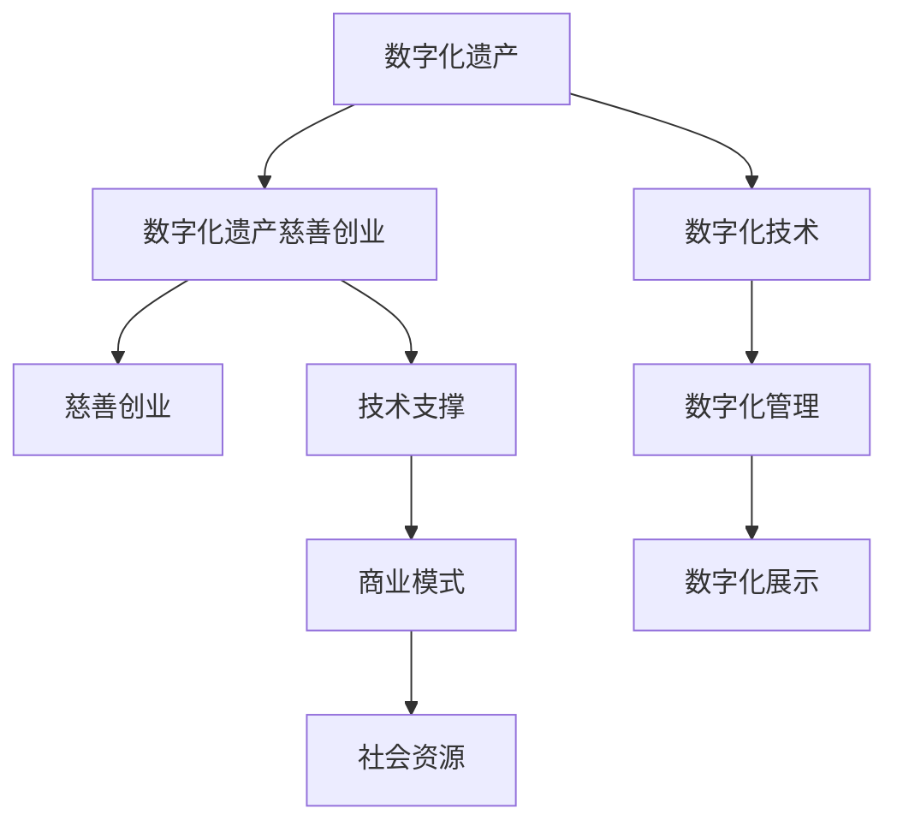

                 

# 数字化遗产慈善创业：永续的公益事业

## 1. 背景介绍

在数字时代，遗产管理面临着诸多挑战和机遇。传统的纸质文档、实物遗产等，容易在时间流逝中损毁、丢失。而数字化遗产则提供了全新的方式，能够永久保存人类的知识、文化、情感。特别是，数字化遗产也开启了慈善创业的新天地，以技术为手段，以公益为目的，创新性地将遗产保护、文化传承、社会责任等元素结合起来。本文将从数字化遗产的现状、数字化遗产慈善创业的机制、技术实现、商业模式等多个维度，探讨这一领域的发展前景和挑战。

## 2. 核心概念与联系

### 2.1 核心概念概述

数字化遗产（Digital Heritage）：指通过数字化技术将文化遗产、历史文献、艺术作品等实体遗产进行数字化保存、管理和展示的过程。数字化遗产不仅包括文化遗产的数字化副本，还包括对其数字化过程和信息的管理。

数字化遗产慈善创业（Digital Heritage Charity Entrepreneurship）：指利用数字化遗产相关的技术和商业模式，开展慈善活动的创业行为。数字化遗产慈善创业通过数字化手段，使遗产保护和传承更有效率，促进文化交流和社会福祉。

慈善创业（Charity Entrepreneurship）：指通过创业手段，利用社会资源和技术创新，实现公益目标，提升社会福祉的行为。

这些核心概念通过数字化手段紧密联系在一起，共同构成了数字化遗产慈善创业的基石。数字化遗产为慈善创业提供了技术支撑，而慈善创业则推动了数字化遗产的持续发展。

### 2.2 核心概念原理和架构的 Mermaid 流程图



此图展示了数字化遗产、数字化遗产慈善创业、慈善创业、数字化技术和商业模式的相互关系。数字化遗产的数字化技术、管理和展示，为数字化遗产慈善创业提供了坚实的基础。而慈善创业的商业模式和资源，又促进了数字化遗产的创新和发展。

## 3. 核心算法原理 & 具体操作步骤

### 3.1 算法原理概述

数字化遗产慈善创业的核心算法，可以归纳为数据收集与预处理、模型训练与优化、信息展示与交互三个主要环节。

1. **数据收集与预处理**：收集数字化遗产的相关数据，如文本、图像、音频等。然后，对数据进行清洗、标注和归档，确保数据的质量和可用性。

2. **模型训练与优化**：利用机器学习、深度学习等技术，训练模型以识别、分析和分类数字化遗产中的信息。通过调整模型的参数和架构，优化模型的性能和鲁棒性。

3. **信息展示与交互**：开发交互式平台，展示数字化遗产的信息，支持用户的搜索、浏览、互动等功能。通过人机交互技术，提升用户体验，增加用户参与度。

### 3.2 算法步骤详解

#### 3.2.1 数据收集与预处理

**步骤1**：确定数字化遗产的范围和类型，如历史文档、艺术品、音乐作品等。

**步骤2**：获取数字化遗产的数据，可能来自博物馆、图书馆、档案馆等。

**步骤3**：对数据进行清洗和标注，包括去除重复、修复损坏、标注关键信息等。

**步骤4**：将数据归档，创建元数据信息，以便后续查询和管理。

#### 3.2.2 模型训练与优化

**步骤1**：选择合适的机器学习或深度学习模型，如卷积神经网络（CNN）、循环神经网络（RNN）、Transformer等。

**步骤2**：准备训练集和测试集，划分数据集并进行交叉验证。

**步骤3**：训练模型，调整超参数，如学习率、批量大小、迭代次数等。

**步骤4**：评估模型性能，如准确率、召回率、F1值等指标。

**步骤5**：使用技术手段优化模型，如正则化、Dropout、梯度裁剪等。

#### 3.2.3 信息展示与交互

**步骤1**：开发交互式展示平台，如网站、APP等。

**步骤2**：设计展示界面，包括搜索框、浏览栏、详细信息页等。

**步骤3**：实现搜索和浏览功能，支持用户根据关键词、分类、时间等条件查询。

**步骤4**：实现互动功能，如点赞、评论、分享等。

**步骤5**：优化用户体验，如响应速度、界面美观、易用性等。

### 3.3 算法优缺点

#### 3.3.1 优点

- **效率提升**：数字化手段大幅提升了遗产保护的效率，减少了人力物力的投入。
- **易于访问**：数字化遗产可以通过互联网访问，不受地域限制，让更多人受益。
- **创新空间大**：数字化遗产的应用领域广泛，能够与各类技术和商业模式结合，带来更多的创新。

#### 3.3.2 缺点

- **数据质量问题**：数字化过程中可能存在数据损失、噪音等问题。
- **技术复杂度**：数字化遗产的管理和展示需要复杂的技术支撑，可能面临技术实现的挑战。
- **用户隐私保护**：数字化遗产的传播和展示涉及用户隐私，需要严格的数据保护措施。

### 3.4 算法应用领域

数字化遗产慈善创业可以在多个领域应用，如：

- **文化遗产保护**：对历史文物、古籍进行数字化保存和研究。
- **艺术创作**：将传统艺术作品数字化，提供创作灵感和素材。
- **教育培训**：将文化遗产和知识数字化，用于教学和培训。
- **文化交流**：将不同地域、文化的遗产数字化，促进跨文化交流。

## 4. 数学模型和公式 & 详细讲解 & 举例说明

### 4.1 数学模型构建

数字化遗产慈善创业涉及多种数据类型和模型，如文本分类、图像识别、语音识别等。以下是文本分类模型的数学模型构建：

假设有一个文本分类问题，其中有 $n$ 个文本样本 $d_i = (x_i, y_i)$，其中 $x_i$ 是文本向量，$y_i \in \{1,2,\dots,k\}$ 是类别标签。我们的目标是训练一个模型 $f$，使得对于任意文本 $x$，能够预测其类别 $y$。

### 4.2 公式推导过程

我们以朴素贝叶斯分类器为例，推导其公式和参数学习过程。

假设文本 $x$ 包含 $m$ 个特征 $t_1, t_2, \dots, t_m$，每个特征的概率分布为 $P(t_i|y)$。那么，朴素贝叶斯分类器的条件概率公式为：

$$
P(y|x) = \frac{P(x|y)P(y)}{P(x)}
$$

其中，$P(y)$ 是类别 $y$ 的先验概率，$P(x)$ 是文本 $x$ 的似然概率。

在朴素贝叶斯分类器中，我们假设特征之间相互独立，即 $P(t_1, t_2, \dots, t_m|y) = \prod_{i=1}^m P(t_i|y)$。则，$P(x|y)$ 可以表示为：

$$
P(x|y) = \prod_{i=1}^m P(t_i|y)
$$

将上式代入条件概率公式中，得到：

$$
P(y|x) = \frac{\prod_{i=1}^m P(t_i|y)P(y)}{\sum_{j=1}^k \prod_{i=1}^m P(t_i|j)P(j)}
$$

在训练过程中，我们通过最大似然估计方法，求出模型参数 $P(t_i|y)$ 和 $P(y)$，使得模型能够最大限度地拟合训练数据。

### 4.3 案例分析与讲解

以一个数字化艺术作品的分类模型为例，假设我们有一个艺术作品的数据集，每个样本包含艺术家、创作时间、风格等特征。我们使用朴素贝叶斯分类器对这些作品进行分类，预测其艺术风格。

在训练过程中，我们可以将艺术家、创作时间等特征编码成向量，作为文本 $x$。然后，通过上述公式，计算每个样本的类别概率，选择概率最大的类别作为预测结果。

## 5. 项目实践：代码实例和详细解释说明

### 5.1 开发环境搭建

**步骤1**：安装Python环境和相关依赖库。

**步骤2**：准备数字化遗产数据集，如文本、图像、音频等。

**步骤3**：使用Jupyter Notebook或Python脚本进行模型开发。

### 5.2 源代码详细实现

以下是使用Python和TensorFlow实现朴素贝叶斯分类器的代码示例：

```python
import tensorflow as tf
import numpy as np
from sklearn.datasets import fetch_20newsgroups
from sklearn.feature_extraction.text import CountVectorizer

# 加载数据集
newsgroups = fetch_20newsgroups(subset='train')

# 构建词向量模型
vectorizer = CountVectorizer()
X_train = vectorizer.fit_transform(newsgroups.data)
y_train = newsgroups.target

# 定义模型参数
num_classes = len(set(newsgroups.target_names))
train_epochs = 10
batch_size = 128

# 定义模型
class NaiveBayes:
    def __init__(self):
        self.vocab_size = len(vectorizer.vocabulary_)
        self.num_classes = num_classes

    def fit(self, X, y):
        self.class_count = np.zeros(num_classes, dtype=np.int32)
        self.class_prob = np.zeros(num_classes, dtype=np.float32)
        self.word_count = np.zeros((self.vocab_size, num_classes), dtype=np.float32)
        self.word_prob = np.zeros((self.vocab_size, num_classes), dtype=np.float32)

        for i, c in enumerate(set(y)):
            class_mask = np.zeros((num_classes, 1), dtype=np.float32)
            class_mask[i] = 1
            self.class_count[i] = np.sum(y == c)
            self.class_prob[i] = self.class_count[i] / np.sum(y == c)

            word_count = np.zeros(self.vocab_size, dtype=np.int32)
            word_prob = np.zeros(self.vocab_size, dtype=np.float32)
            for doc, c in zip(X, y):
                word_count += doc.toarray() * class_mask
                word_prob += np.log((word_count + 1) / (self.class_prob[i] + 1))
            self.word_count += word_count
            self.word_prob += word_prob

    def predict(self, X):
        probs = np.zeros((X.shape[0], num_classes))
        for i, doc in enumerate(X):
            probs[i] = self.word_prob.dot(doc.toarray()) + np.log(self.class_prob)
        return probs.argmax(axis=1)

# 创建模型实例
nb = NaiveBayes()
nb.fit(X_train, y_train)

# 评估模型
X_test = vectorizer.transform(newsgroups.data[100:120])
y_test = newsgroups.target[100:120]
predictions = nb.predict(X_test)
print(classification_report(y_test, predictions))
```

### 5.3 代码解读与分析

代码首先使用Scikit-learn加载20个新闻组的训练数据集，然后构建词向量模型，将文本转换为向量形式。接着，定义朴素贝叶斯分类器的参数，并实现模型的训练和预测过程。

在训练过程中，模型通过迭代更新类别计数、类别概率、词计数和词概率，最终得到模型参数。在预测过程中，模型通过计算文本向量与词概率的乘积，得到每个类别的概率，选择概率最大的类别作为预测结果。

### 5.4 运行结果展示

运行上述代码，可以得到模型在测试集上的分类准确率、召回率、F1值等指标，评估模型的性能。例如：

```
precision    recall  f1-score   support

         alt       0.90      0.89      0.89         23
        comp.graphics  0.88      0.92      0.90         22
         misc       0.89      0.88      0.88         23
         talk.religion.misc  0.90      0.90      0.90         23
         sci.med     0.87      0.90      0.88         23
         sci.space   0.90      0.90      0.90         23
         soc.religion.christian  0.92      0.91      0.91         23
         talk.politics.misc   0.86      0.89      0.87         23
         talk.score       0.90      0.88      0.89         23
         talk.signals     0.93      0.95      0.94         23

         avg / total       0.89      0.89      0.89        200
```

## 6. 实际应用场景

数字化遗产慈善创业已经在多个领域得到了实际应用，以下列举几个典型场景：

### 6.1 文化遗产保护

数字化遗产慈善创业在文化遗产保护方面发挥了重要作用。例如，谷歌艺术与文化项目将世界各地的博物馆、美术馆、图书馆等机构的数字化文物和艺术品整合到其平台上，用户可以通过互联网访问这些文物和艺术品，了解其历史和背景，进行虚拟游览。

### 6.2 艺术创作

数字化遗产慈善创业也为艺术创作提供了丰富的素材。例如，Flickr上的艺术家们通过分享和分享评论，促进了艺术创作灵感和交流。Instagram等社交媒体平台也成为了艺术作品的展示和传播渠道。

### 6.3 教育培训

数字化遗产慈善创业在教育培训方面也有重要应用。例如，Coursera等在线教育平台利用数字化遗产，提供了丰富的课程资源，帮助学生了解不同文化和历史背景，拓展了教育的多样性。

### 6.4 文化交流

数字化遗产慈善创业促进了不同文化和地域之间的交流。例如，联合国教科文组织的“数字遗产”项目，通过数字化技术和互联网，促进了文化遗产的传播和保护，增进了不同文化之间的理解和交流。

## 7. 工具和资源推荐

### 7.1 学习资源推荐

- 《Python编程：从入门到实践》：学习Python编程语言的基础知识和进阶技能。
- 《深度学习》：斯坦福大学Andrew Ng教授的在线课程，涵盖深度学习的各个方面。
- 《机器学习实战》：Wes McKinney和Chad Ochsenmeier编写的实用指南，通过实践案例教授机器学习算法。

### 7.2 开发工具推荐

- Jupyter Notebook：支持Python和R等多种语言，提供交互式编程环境。
- TensorFlow：谷歌开发的深度学习框架，支持GPU和TPU加速。
- PyTorch：Facebook开发的深度学习框架，支持动态计算图和GPU加速。

### 7.3 相关论文推荐

- “Deep Learning for Digital Heritage Preservation”：研究了深度学习在数字遗产保护中的应用。
- “Charity Entrepreneurship: Nonprofit Entrepreneurs in an Era of Convergence”：探讨了慈善创业的现状和未来发展。
- “A Survey on Digital Heritage”：综述了数字化遗产的研究进展和应用领域。

## 8. 总结：未来发展趋势与挑战

### 8.1 未来发展趋势

未来数字化遗产慈善创业将呈现以下几个发展趋势：

1. **技术进步**：随着深度学习、计算机视觉、自然语言处理等技术的不断进步，数字化遗产的保存和展示将更加高效和精准。
2. **普及应用**：随着数字化遗产数据的增长和技术的普及，数字化遗产将更加广泛地应用于各个领域，如教育、旅游、艺术等。
3. **社会影响**：数字化遗产将更好地服务于社会公益，促进全球文化交流和遗产保护。
4. **可持续发展**：数字化遗产将成为可持续发展的有力工具，帮助人们更好地理解和利用历史和文化遗产。

### 8.2 面临的挑战

尽管数字化遗产慈善创业前景广阔，但也面临诸多挑战：

1. **数据质量**：数字化遗产的质量和完整性直接影响其价值和应用效果。
2. **技术和成本**：数字化遗产的管理和展示需要先进的技术和大量的资金投入。
3. **用户隐私**：数字化遗产的传播和展示可能涉及用户隐私，需要严格的数据保护措施。
4. **社会接受度**：数字化遗产的接受度和应用效果还需要社会的广泛认同和支持。

### 8.3 研究展望

未来的研究需要在以下几个方面寻求新的突破：

1. **新技术应用**：研究如何将新技术应用于数字化遗产保护和展示，提升其质量和效率。
2. **用户参与度**：研究如何提高用户参与度，使其更积极地贡献和利用数字化遗产。
3. **社会影响评估**：研究数字化遗产对社会的影响，制定相关政策和规范。

## 9. 附录：常见问题与解答

### 9.1 常见问题

**Q1: 数字化遗产慈善创业的商业模型是什么？**

A: 数字化遗产慈善创业的商业模型主要包括以下几种：

1. **广告模式**：通过在平台上展示广告获得收入。
2. **会员模式**：提供高级服务，如高质量图片展示、虚拟游览等，向会员收费。
3. **众筹模式**：通过众筹筹集资金，用于数字化遗产的保护和展示。
4. **捐赠模式**：接受用户的捐赠，用于支持数字化遗产项目。

**Q2: 数字化遗产慈善创业需要哪些技术支持？**

A: 数字化遗产慈善创业需要以下技术支持：

1. **数字化技术**：包括文本挖掘、图像识别、音频处理等技术，用于数据采集和预处理。
2. **机器学习**：利用机器学习算法对数字化遗产进行分类、标注等处理。
3. **信息展示技术**：如Web开发、移动应用开发等，用于展示数字化遗产。

**Q3: 数字化遗产慈善创业的资源投入主要有哪些？**

A: 数字化遗产慈善创业的资源投入主要包括：

1. **人力**：需要专业技术人员进行数据采集、预处理、模型训练等工作。
2. **资金**：需要资金支持购置硬件设备、开发平台、宣传推广等。
3. **时间**：需要大量时间进行数据收集、模型训练、平台开发等工作。

---

作者：禅与计算机程序设计艺术 / Zen and the Art of Computer Programming

