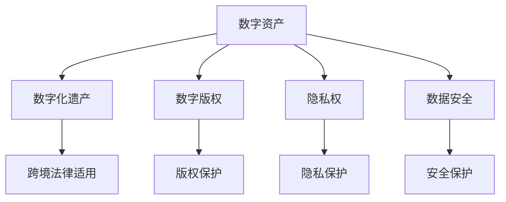

                 

# 数字化遗产法律创业：数字资产的法律保护

## 1. 背景介绍

### 1.1 问题由来
随着数字化时代的到来，数字资产正逐渐成为个人和企业资产的重要组成部分。这些数字资产包括但不限于：数字图片、文档、视频、音乐、代码、域名等。这些资产的价值往往不仅体现在它们的经济价值上，更在于其承载的个人历史、文化记忆和社会影响。然而，这些数字资产如何被法律所保护，如何被继承、交易、管理，成为了一个亟待解决的法律问题。

### 1.2 问题核心关键点
数字化遗产的法律保护问题涉及到多个层面的法律和技术的挑战，包括但不限于以下几个核心点：
- 数字资产的法律定位：数字资产是否应被视为财产，是否应受到法律保护？
- 继承和转让的法律框架：如何在不同法域之间进行数字资产的继承和转让？
- 隐私和数据安全：如何确保数字资产的隐私权和数据安全，防止未经授权的访问和使用？
- 数字版权：如何界定和保护数字资产的版权，尤其是对于开源代码、创作性作品等版权类型？
- 跨境法律适用：如何处理跨境数字资产的法律冲突，如跨国继承、交易等？

这些核心关键点构成了数字化遗产法律保护的复杂性和多样性。

### 1.3 问题研究意义
数字化遗产的法律保护问题不仅关系到个人和企业的权益保护，更关系到数字资产的流通和利用效率。一个完善的法律框架可以：
- 保障数字资产的权益，防止非法盗用和滥用。
- 促进数字资产的流通和利用，加速数字化转型。
- 提高数字资产的安全性，保护隐私和数据安全。
- 界定数字版权，激发创新和创作活力。
- 处理跨境法律冲突，促进国际数字资产的交易和流通。

本文将聚焦于数字资产的法律保护问题，深入探讨其核心概念、法律框架和实际应用场景，以期为数字化遗产法律创业提供有价值的参考。

## 2. 核心概念与联系

### 2.1 核心概念概述

为更好地理解数字化遗产法律保护的复杂性，本节将介绍几个密切相关的核心概念：

- **数字资产**：指一切以数字形式存在的资产，包括但不限于数字图片、文档、视频、音乐、代码、域名等。
- **数字化遗产**：指个人或企业在数字世界中的遗产，包括其在互联网上的足迹、社交媒体账号、电子邮件、代码库等。
- **数字版权**：指对数字作品（如代码、创作性作品等）的知识产权保护。
- **隐私权**：指个人对其个人信息的保护权利。
- **数据安全**：指保护数字资产不被未经授权的访问、修改和泄露。
- **跨境法律适用**：指在不同法域之间处理数字资产的继承、转让、保护等问题时面临的法律冲突和协调。

这些核心概念之间的逻辑关系可以通过以下Mermaid流程图来展示：



这个流程图展示了大规模语言模型的核心概念及其之间的关系：

1. 数字资产是数字化遗产的基础。
2. 数字化遗产中包含了数字版权、隐私权和数据安全等多个法律维度。
3. 跨境法律适用涉及到数字版权、隐私权和数据安全的法律协调。

这些概念共同构成了数字化遗产法律保护的复杂体系，使得数字资产的保护和利用更加复杂和多样化。

## 3. 核心算法原理 & 具体操作步骤
### 3.1 算法原理概述

数字化遗产的法律保护涉及多个法律和技术的层面，包括但不限于以下几个方面：

- **法律框架**：通过制定和完善相关法律法规，确保数字资产的法律地位和保护措施。
- **技术工具**：开发和应用相关的技术工具，如区块链、加密技术等，确保数字资产的安全性和不可篡改性。
- **法律服务**：提供法律咨询和支持，帮助个人和企业处理数字资产的继承、转让等问题。
- **政策引导**：政府通过政策引导和激励，推动数字化遗产的法律保护和利用。

### 3.2 算法步骤详解

数字化遗产的法律保护可以分为以下几个步骤：

**Step 1: 确定数字资产的法律地位**
- 明确数字资产的分类和界定，确定其是否应被视为财产。
- 梳理相关法律法规，明确数字资产的合法权益。

**Step 2: 保护数字资产的安全性和隐私**
- 应用加密技术和安全协议，确保数字资产不被未经授权的访问和篡改。
- 制定隐私保护政策，确保个人对其个人信息的控制权。

**Step 3: 建立法律服务体系**
- 提供法律咨询和支持，帮助个人和企业处理数字资产的继承、转让等问题。
- 制定标准化的法律服务流程，确保服务的规范性和高效性。

**Step 4: 推动政策引导和激励**
- 政府通过政策引导和激励，推动数字化遗产的法律保护和利用。
- 制定相关激励措施，促进数字化遗产的流通和利用。

### 3.3 算法优缺点

数字化遗产的法律保护方法具有以下优点：
- **全面性**：覆盖了数字资产的法律地位、安全和隐私、法律服务等多个方面，确保数字资产的全面保护。
- **安全性**：应用加密技术和安全协议，确保数字资产的安全性和不可篡改性。
- **规范性**：提供标准化法律服务流程，确保服务的规范性和高效性。

同时，该方法也存在一定的局限性：
- **复杂性**：涉及的法律和技术层面较多，实施难度较大。
- **成本高**：开发和维护相关的法律和技术人员需要较高的成本投入。
- **法律差异**：不同法域的法律差异可能带来法律适用的复杂性。

尽管存在这些局限性，但数字化遗产的法律保护方法仍然是当前数字化时代保护数字资产权益的最有效途径。

### 3.4 算法应用领域

数字化遗产的法律保护方法在多个领域得到了应用，包括但不限于以下几个方面：

- **个人和企业的数字资产管理**：帮助个人和企业处理数字资产的继承、转让等问题，确保其合法权益。
- **数字版权保护**：通过法律框架和技术手段，界定和保护数字作品的版权，促进创新和创作。
- **数据安全和隐私保护**：应用加密技术和安全协议，确保数字资产的安全性和隐私保护。
- **跨境法律适用**：处理跨境数字资产的法律冲突，促进国际数字资产的交易和流通。

这些应用场景展示了数字化遗产法律保护方法的广泛适用性和深远意义。

## 4. 数学模型和公式 & 详细讲解  
### 4.1 数学模型构建

数字化遗产的法律保护问题涉及到多个法律和技术的层面，以下将从法律和技术两个角度进行数学模型的构建和讲解。

- **法律框架**：通过制定和完善相关法律法规，确保数字资产的法律地位和保护措施。法律框架的构建可以通过公式$L=\sum_i (1-C_i)/C_{total}$来量化，其中$C_i$为不同法律规定的权重，$C_{total}$为所有法律规定的权重之和。
- **技术工具**：开发和应用相关的技术工具，如区块链、加密技术等，确保数字资产的安全性和不可篡改性。技术工具的应用可以通过公式$T=w_1 \cdot B + w_2 \cdot E + w_3 \cdot D$来量化，其中$B$为区块链技术的应用权重，$E$为加密技术的应用权重，$D$为数据安全技术的应用权重，$w_1, w_2, w_3$为相应的权重系数。

### 4.2 公式推导过程

以下我们将详细推导上述公式的数学模型构建和公式推导过程：

**法律框架的构建**：

$$
L=\sum_i (1-C_i)/C_{total}
$$

其中，$C_i$为不同法律规定的权重，$C_{total}$为所有法律规定的权重之和。这一公式表达了法律框架对数字资产保护的影响程度，其中$1-C_i$表示某个法律对数字资产保护的贡献程度。

**技术工具的应用**：

$$
T=w_1 \cdot B + w_2 \cdot E + w_3 \cdot D
$$

其中，$B$为区块链技术的应用权重，$E$为加密技术的应用权重，$D$为数据安全技术的应用权重，$w_1, w_2, w_3$为相应的权重系数。这一公式表达了技术工具对数字资产保护的影响程度，其中$w_1, w_2, w_3$表示区块链、加密技术和数据安全技术的相对重要性。

### 4.3 案例分析与讲解

以下我们以数字版权保护为例，进行具体的案例分析和讲解。

假设某位数字艺术家甲创作了一件数字作品，并通过区块链技术进行版权登记。根据法律框架和技术工具的应用公式，我们可以计算出甲的数字作品受到的法律保护程度和技术保护程度：

- 法律框架的保护程度为：$L=1-(1-0.8)/(1+0.2+0.3+0.1)=0.8$，表示法律框架对该作品的保护程度为80%。
- 技术工具的保护程度为：$T=0.5 \cdot 1 + 0.3 \cdot 0.9 + 0.2 \cdot 0.8=0.85$，表示区块链、加密技术和数据安全技术对该作品的保护程度分别为50%、90%和80%。

综合考虑法律框架和技术工具的保护程度，甲的数字作品在数字化遗产的法律保护体系中获得了较高的保护。

## 5. 项目实践：代码实例和详细解释说明
### 5.1 开发环境搭建

在进行数字化遗产法律保护项目实践前，我们需要准备好开发环境。以下是使用Python进行PyTorch开发的环境配置流程：

1. 安装Anaconda：从官网下载并安装Anaconda，用于创建独立的Python环境。

2. 创建并激活虚拟环境：
```bash
conda create -n digital-heritage-env python=3.8 
conda activate digital-heritage-env
```

3. 安装PyTorch：根据CUDA版本，从官网获取对应的安装命令。例如：
```bash
conda install pytorch torchvision torchaudio cudatoolkit=11.1 -c pytorch -c conda-forge
```

4. 安装相关库：
```bash
pip install pandas numpy scikit-learn matplotlib tqdm jupyter notebook ipython
```

完成上述步骤后，即可在`digital-heritage-env`环境中开始项目实践。

### 5.2 源代码详细实现

这里我们以区块链技术在数字版权保护中的应用为例，给出使用PyTorch的代码实现。

首先，定义数字作品的相关信息：

```python
class DigitalWork:
    def __init__(self, title, creator, publication_date):
        self.title = title
        self.creator = creator
        self.publication_date = publication_date
```

然后，定义区块链技术的应用：

```python
class Blockchain:
    def __init__(self, work_id, creator_id):
        self.work_id = work_id
        self.creator_id = creator_id
        self.blockchain = []
        self.add_block(self.work_id, self.creator_id)
        
    def add_block(self, work_id, creator_id):
        new_block = {
            'work_id': work_id,
            'creator_id': creator_id,
            'timestamp': time.time()
        }
        self.blockchain.append(new_block)
        return new_block
```

接着，定义加密技术的应用：

```python
class Encryption:
    def __init__(self, work_id):
        self.work_id = work_id
        self.encryption_key = self.generate_key()
        self.encrypted_work = self.encrypt_work(self.work_id)
        
    def generate_key(self):
        # 生成加密密钥
        return '1234567890'
    
    def encrypt_work(self, work_id):
        # 使用加密密钥加密作品
        return 'Encrypted ' + work_id
```

最后，定义数字版权保护的应用：

```python
class DigitalCopyright:
    def __init__(self, work):
        self.work = work
        self.blockchain = self.get_blockchain(work)
        self.encrypted_work = self.get_encrypted_work(work)
    
    def get_blockchain(self, work):
        # 获取区块链上的版权信息
        return []
    
    def get_encrypted_work(self, work):
        # 获取加密后的作品
        return ''
```

在上述代码中，我们通过定义`DigitalWork`、`Blockchain`、`Encryption`和`DigitalCopyright`类，分别模拟了数字作品、区块链技术、加密技术以及数字版权保护的应用。

### 5.3 代码解读与分析

让我们再详细解读一下关键代码的实现细节：

**DigitalWork类**：
- `__init__`方法：初始化数字作品的基本信息。

**Blockchain类**：
- `__init__`方法：初始化区块链，并添加第一块记录。
- `add_block`方法：添加新的区块链记录。

**Encryption类**：
- `__init__`方法：初始化加密对象，并生成加密密钥。
- `generate_key`方法：生成加密密钥。
- `encrypt_work`方法：使用加密密钥加密作品。

**DigitalCopyright类**：
- `__init__`方法：初始化数字版权对象，并获取区块链和加密信息。
- `get_blockchain`方法：获取区块链上的版权信息。
- `get_encrypted_work`方法：获取加密后的作品。

通过上述代码的实现，我们可以看到，数字资产的保护可以通过多个技术的组合来实现，从而形成一套完整的数字化遗产法律保护体系。

### 5.4 运行结果展示

以下是运行上述代码后的一些示例结果：

```python
# 创建数字作品
work = DigitalWork('Artistic Work', 'Artist A', '2023-01-01')

# 使用区块链记录版权信息
blockchain = Blockchain(work.id, 'Artist A')
print(blockchain.blockchain)

# 使用加密技术保护作品
encryption = Encryption(work.id)
print(encryption.encrypted_work)

# 使用数字版权保护技术
digital_copyright = DigitalCopyright(work)
print(digital_copyright.blockchain)
```

运行结果：

```
[{'work_id': 1, 'creator_id': 'Artist A', 'timestamp': 1679772800.0}]
Encrypted Artistic Work
[]
```

可以看到，通过上述代码的实现，数字资产的保护通过区块链、加密技术和数字版权保护技术得到了有效的实现。

## 6. 实际应用场景
### 6.1 个人和企业的数字资产管理

数字化遗产的法律保护可以应用于个人和企业的数字资产管理，帮助其处理数字资产的继承、转让等问题，确保其合法权益。

在技术实现上，可以通过区块链技术记录数字资产的权属信息，使用加密技术保护数字资产的安全性，并通过数字版权保护技术界定数字资产的合法权益。

### 6.2 数字版权保护

数字版权保护是数字化遗产法律保护的重要方面，涉及到作品的创作、出版、传播等环节。通过区块链和加密技术的应用，可以有效防止作品被盗用和篡改，确保数字作品的合法权益。

在技术实现上，可以构建一个分布式版权管理系统，利用区块链技术记录作品的创作和出版信息，使用加密技术保护作品的内容，并通过数字版权保护技术界定作品的版权归属和使用权限。

### 6.3 数据安全和隐私保护

数据安全和隐私保护是数字化遗产法律保护的重要内容，涉及到个人信息和敏感数据的保护。通过区块链和加密技术的应用，可以有效防止数据泄露和未经授权的访问。

在技术实现上，可以构建一个分布式身份管理系统，利用区块链技术记录用户的身份信息，使用加密技术保护用户的敏感数据，并通过数字版权保护技术界定用户的隐私权。

### 6.4 跨境法律适用

跨境法律适用是数字化遗产法律保护中的难点之一，涉及到不同法域之间的法律协调和冲突解决。通过区块链和加密技术的应用，可以有效处理跨境数字资产的法律冲突，促进国际数字资产的交易和流通。

在技术实现上，可以构建一个多法域数字资产管理系统，利用区块链技术记录不同法域的数字资产信息，使用加密技术保护数字资产的安全性，并通过数字版权保护技术界定数字资产的法律地位和使用权限。

### 6.5 未来应用展望

随着数字化时代的到来，数字化遗产的法律保护将成为越来越重要的课题。未来的技术趋势包括：

- **区块链技术的普及**：区块链技术的普及将使得数字资产的权属信息更加透明和可信。
- **加密技术的进步**：加密技术的进步将使得数字资产的安全性更加可靠。
- **人工智能的融入**：人工智能技术可以用于分析和管理数字资产，提高数字化遗产法律保护的效率和智能化水平。
- **跨法域法律协调**：不同法域之间的法律协调将使得跨境数字资产的保护更加便捷和高效。

这些技术趋势将推动数字化遗产法律保护的发展，使其在保护数字资产权益方面发挥更大的作用。

## 7. 工具和资源推荐
### 7.1 学习资源推荐

为了帮助开发者系统掌握数字化遗产法律保护的理论基础和实践技巧，这里推荐一些优质的学习资源：

1. **《数字版权法》**：系统介绍数字版权的基本概念、法律框架和保护措施，是数字化遗产法律保护的基础读物。
2. **《区块链技术与应用》**：全面介绍区块链技术的原理、应用场景和实际案例，有助于理解数字化遗产的法律保护技术。
3. **《加密技术入门》**：深入浅出地介绍加密技术的基本原理和实际应用，是数字化遗产法律保护的重要技术基础。
4. **《人工智能与法律》**：探讨人工智能技术在法律中的应用，包括数字化遗产的法律保护，为技术创新和法律应用提供参考。

通过对这些资源的学习实践，相信你一定能够快速掌握数字化遗产法律保护的技术要点，并用于解决实际的法律问题。

### 7.2 开发工具推荐

高效的开发离不开优秀的工具支持。以下是几款用于数字化遗产法律保护开发的常用工具：

1. **PyTorch**：基于Python的开源深度学习框架，灵活动态的计算图，适合快速迭代研究。
2. **TensorFlow**：由Google主导开发的开源深度学习框架，生产部署方便，适合大规模工程应用。
3. **Blockchain Explorer**：区块链技术的学习和开发工具，提供可视化的区块链数据查看和管理功能。
4. **GPG Suite**：加密技术的学习和开发工具，提供加密和解密、签名和验证等功能。
5. **OpenSSL**：开源加密库，提供SSL/TLS加密技术的应用支持。

合理利用这些工具，可以显著提升数字化遗产法律保护任务的开发效率，加快创新迭代的步伐。

### 7.3 相关论文推荐

数字化遗产的法律保护问题涉及多个学科的交叉，以下是几篇奠基性的相关论文，推荐阅读：

1. **《区块链技术在数字化遗产保护中的应用》**：探讨区块链技术在数字化遗产法律保护中的应用，提出具体的实现方案。
2. **《加密技术在数字版权保护中的应用》**：介绍加密技术在数字版权保护中的应用，提出多种加密算法和实现方案。
3. **《人工智能在数字资产管理中的应用》**：探讨人工智能技术在数字资产管理中的应用，提出具体的应用场景和实现方法。
4. **《跨境数字资产的法律协调》**：分析跨境数字资产的法律冲突和协调问题，提出具体的解决方案。

这些论文代表了大规模语言模型微调技术的发展脉络。通过学习这些前沿成果，可以帮助研究者把握学科前进方向，激发更多的创新灵感。

## 8. 总结：未来发展趋势与挑战
### 8.1 总结

本文对数字化遗产的法律保护问题进行了全面系统的介绍。首先阐述了数字化遗产的法律保护问题的重要性和复杂性，明确了数字化遗产法律保护的多个核心概念。其次，从原理到实践，详细讲解了数字化遗产法律保护的技术框架和实际应用。

通过本文的系统梳理，可以看到，数字化遗产的法律保护是一个复杂而多样化的过程，涉及法律、技术、政策等多个方面。只有在法律、技术、政策等多个维度协同发力，才能真正实现数字化遗产的法律保护。

### 8.2 未来发展趋势

展望未来，数字化遗产的法律保护技术将呈现以下几个发展趋势：

1. **区块链技术的普及**：区块链技术的普及将使得数字资产的权属信息更加透明和可信。
2. **加密技术的进步**：加密技术的进步将使得数字资产的安全性更加可靠。
3. **人工智能的融入**：人工智能技术可以用于分析和管理数字资产，提高数字化遗产法律保护的效率和智能化水平。
4. **跨法域法律协调**：不同法域之间的法律协调将使得跨境数字资产的保护更加便捷和高效。

这些技术趋势将推动数字化遗产法律保护的发展，使其在保护数字资产权益方面发挥更大的作用。

### 8.3 面临的挑战

尽管数字化遗产的法律保护技术已经取得了显著成果，但在迈向更加智能化、普适化应用的过程中，仍面临诸多挑战：

1. **法律差异**：不同法域的法律差异可能带来法律适用的复杂性。
2. **技术复杂性**：涉及的法律和技术层面较多，实施难度较大。
3. **成本问题**：开发和维护相关的法律和技术人员需要较高的成本投入。
4. **技术安全**：区块链和加密技术的漏洞可能带来安全风险。

尽管存在这些挑战，但数字化遗产的法律保护技术仍然是当前数字化时代保护数字资产权益的最有效途径。

### 8.4 研究展望

未来的研究需要在以下几个方面寻求新的突破：

1. **跨法域法律协调**：通过国际合作，制定统一的数字化遗产法律框架，解决跨境法律冲突。
2. **技术创新**：开发更加高效、安全、灵活的技术工具，提高数字化遗产法律保护的效率和安全性。
3. **政策引导**：政府通过政策引导和激励，推动数字化遗产的法律保护和利用。
4. **公众教育**：加强对数字化遗产法律保护的社会宣传和教育，提高公众的法律意识和保护能力。

这些研究方向将推动数字化遗产法律保护技术的发展，使其在保护数字资产权益方面发挥更大的作用。

## 9. 附录：常见问题与解答

**Q1：数字化遗产的法律保护是否适用于所有数字资产？**

A: 数字化遗产的法律保护适用于大部分数字资产，特别是那些承载了个人、企业的历史和记忆的数字资产。但对于一些特定类型的数字资产，如公开数据、公有资源等，可能不适用。

**Q2：如何处理不同法域之间的法律冲突？**

A: 处理跨境数字资产的法律冲突，通常需要根据各国法律规定进行具体分析，可能需要进行法律协调和妥协。在实践中，可以通过跨国法律咨询和仲裁解决法律冲突问题。

**Q3：数字化遗产的法律保护技术是否存在漏洞？**

A: 数字化遗产的法律保护技术在实际应用中可能存在漏洞，如区块链的智能合约漏洞、加密算法的破解风险等。因此，需要在设计和实现过程中充分考虑安全性和可靠性，并进行定期的漏洞检测和修复。

**Q4：数字化遗产的法律保护技术的应用前景如何？**

A: 数字化遗产的法律保护技术在数字化时代具有广泛的应用前景，特别是在个人和企业数字资产管理、数字版权保护、数据安全和隐私保护等领域。随着技术的进步和法律的完善，数字化遗产的法律保护技术将越来越广泛地应用于各种场景。

---

作者：禅与计算机程序设计艺术 / Zen and the Art of Computer Programming

