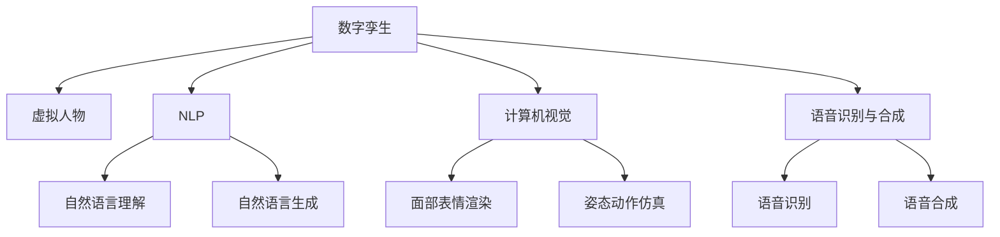

                 

# 数字孪生人创业：虚拟人物的商业应用

> 关键词：数字孪生,虚拟人物,人工智能,商业应用,数据驱动

## 1. 背景介绍

### 1.1 问题由来

随着数字化转型的不断深入，各行各业对于利用数字技术提升业务运营效率、降低成本、增强用户体验的需求日益增长。虚拟人物作为数字化时代的重要应用形式，在智能客服、虚拟主播、虚拟导购、虚拟偶像等多个领域展现出巨大的商业潜力。数字孪生技术为虚拟人物的创建与运营提供了新的途径，通过构建与现实人物高度一致的数字模型，能够在虚拟世界中实现从视觉、语音、行为到认知的全方位模拟，为商业应用带来了广阔前景。

### 1.2 问题核心关键点

虚拟人物的核心技术包括数字孪生、自然语言处理(NLP)、计算机视觉、语音识别与合成等。其中，数字孪生技术是实现虚拟人物的关键。数字孪生将现实世界中的人物模型映射到虚拟空间，通过持续的数据同步与更新，保持虚拟人物与现实人物的同步。虚拟人物在商业应用中，需要具备以下关键能力：

1. **视觉仿真**：能够精确还原人物的外观特征，支持动态表情和动作。
2. **语音交互**：能够实现自然的语音识别与合成，支持多语种交互。
3. **行为理解**：具备高度智能的对话系统，能够理解用户意图并做出响应。
4. **数据驱动**：能够通过数据分析优化自身行为，提升用户体验。

这些核心能力构成了虚拟人物的商业应用基础，为虚拟人物在多个场景中的落地提供了可能。

### 1.3 问题研究意义

虚拟人物的应用不仅能够提升用户体验，还能有效降低运营成本，提高业务效率。例如，虚拟导购可以通过自然语言理解用户需求，提供个性化推荐；虚拟客服能够24小时在线，提升客户满意度；虚拟偶像则能够在音乐、影视等领域创造新的价值。因此，虚拟人物的商业应用对于推动数字化转型、提升企业竞争力具有重要意义。

## 2. 核心概念与联系

### 2.1 核心概念概述

为更好地理解虚拟人物的创建与商业应用，本节将介绍几个密切相关的核心概念：

- **数字孪生**：通过虚拟与现实世界的双向映射，构建一个与现实世界高度一致的虚拟空间模型。数字孪生技术涉及数据同步、模型渲染、交互仿真等多个方面。
- **虚拟人物**：在虚拟空间中创建的人工智能驱动的虚拟角色，具备视觉、语音、行为等能力，能够执行特定任务。
- **自然语言处理(NLP)**：研究如何让计算机理解、处理和生成人类语言，是虚拟人物对话系统的核心技术。
- **计算机视觉**：研究如何让计算机从图像中提取信息，支持虚拟人物面部表情、姿态动作的渲染。
- **语音识别与合成**：通过语音识别技术将语音转换为文字，通过语音合成技术将文字转换为语音，实现虚拟人物的语音交互。

这些核心概念之间的逻辑关系可以通过以下Mermaid流程图来展示：



这个流程图展示了几大核心概念之间的关系：

1. 数字孪生通过双向映射，为虚拟人物提供现实世界的参考。
2. 虚拟人物结合NLP、计算机视觉、语音识别与合成技术，具备多模态交互能力。
3. NLP技术支持自然语言理解与生成，是虚拟人物对话系统的核心。
4. 计算机视觉技术用于面部表情渲染和姿态动作仿真，增强虚拟人物的可视化效果。
5. 语音识别与合成技术支持虚拟人物的语音交互，提升用户体验。

这些概念共同构成了虚拟人物的创建与商业应用的框架，使其能够在多个场景中发挥重要作用。

## 3. 核心算法原理 & 具体操作步骤
### 3.1 算法原理概述

虚拟人物的创建与商业应用，通常涉及多个技术的集成应用。核心算法原理主要包括：

- **数字孪生算法**：用于构建现实世界与虚拟世界的双向映射，实现数据同步与更新。
- **自然语言处理算法**：用于实现虚拟人物的自然语言理解与生成，支持虚拟人物的对话功能。
- **计算机视觉算法**：用于实现虚拟人物的面部表情和姿态动作的渲染，提升虚拟人物的可视化效果。
- **语音识别与合成算法**：用于实现虚拟人物的语音交互，支持多语种交流。

### 3.2 算法步骤详解

虚拟人物的创建与商业应用一般包括以下几个关键步骤：

**Step 1: 数字孪生模型构建**
- 收集现实人物的高质量三维建模数据，如面部、身体、衣物等。
- 使用数字孪生算法将建模数据映射到虚拟空间，创建数字孪生模型。
- 通过实时传感器数据同步，保持数字孪生模型与现实人物的实时同步。

**Step 2: 自然语言处理模块集成**
- 在数字孪生模型中集成自然语言处理模块，支持自然语言的输入与输出。
- 使用预训练语言模型，如BERT、GPT等，作为自然语言处理的基础。
- 通过微调等技术，优化自然语言处理模块，使其能够适应特定任务。

**Step 3: 计算机视觉模块集成**
- 在数字孪生模型中集成计算机视觉模块，支持面部表情和姿态动作的渲染。
- 使用开源库，如OpenCV、PyTorch等，进行面部表情识别与合成。
- 通过实时渲染技术，实现虚拟人物的姿态动作仿真。

**Step 4: 语音识别与合成模块集成**
- 在数字孪生模型中集成语音识别与合成模块，支持虚拟人物的语音交互。
- 使用开源库，如SpeechRecognition、pyttsx3等，进行语音识别与合成。
- 通过多语种模型训练，支持虚拟人物的跨语言交流。

**Step 5: 商业应用集成**
- 将虚拟人物集成到具体的商业应用场景中，如智能客服、虚拟主播、虚拟导购等。
- 通过API接口，实现虚拟人物与业务系统的交互。
- 实时采集用户反馈，持续优化虚拟人物的行为表现。

### 3.3 算法优缺点

数字孪生和虚拟人物技术具有以下优点：
1. 逼真度高：通过高质量的3D建模和实时渲染技术，能够创建高度逼真的虚拟人物。
2. 互动性强：支持多模态交互，能够实现自然语言、面部表情、姿态动作的综合处理。
3. 灵活性强：能够根据不同的商业需求，定制虚拟人物的行为和对话逻辑。
4. 可扩展性好：可以轻松集成到多个业务系统中，实现广泛的应用。

同时，该技术也存在一定的局限性：
1. 数据依赖性高：虚拟人物的创建与优化需要高质量的3D建模数据和标注数据。
2. 计算资源需求大：高质量的3D渲染和自然语言处理需要较强的计算资源支持。
3. 用户接受度低：虚拟人物的互动性需要经过用户的接受与信任过程，短期内难以广泛普及。

尽管存在这些局限性，但就目前而言，数字孪生和虚拟人物技术仍是大规模应用的热点方向。未来相关研究的重点在于如何进一步降低计算资源需求，提升用户体验，同时兼顾虚拟人物的逼真度和智能度。

### 3.4 算法应用领域

数字孪生和虚拟人物技术已经在多个领域得到了广泛的应用，例如：

- **智能客服**：通过虚拟人物实现自然语言理解和生成，提升客户服务质量。
- **虚拟主播**：通过语音识别与合成技术，创建可互动的虚拟主播，提供直播、视频内容。
- **虚拟导购**：通过面部表情渲染和姿态动作仿真，创建逼真的虚拟导购，提供个性化推荐服务。
- **虚拟偶像**：通过多模态交互和情感仿真技术，创建具有高度互动性的虚拟偶像，提供音乐、影视等内容。
- **虚拟助教**：通过自然语言处理和计算机视觉技术，创建虚拟助教，辅助在线教育和学习。

除了上述这些应用外，数字孪生和虚拟人物技术还被创新性地应用于游戏、影视、医疗等多个领域，为相关产业带来了新的发展机遇。

## 4. 数学模型和公式 & 详细讲解 & 举例说明
### 4.1 数学模型构建

本节将使用数学语言对数字孪生和虚拟人物技术的核心算法进行更加严格的刻画。

假设虚拟人物的行为模型为 $M$，其状态表示为 $x \in \mathbb{R}^n$。根据数字孪生模型，虚拟人物的状态 $x$ 与现实人物的状态 $y$ 存在以下映射关系：

$$
x = f(y, \theta)
$$

其中 $f$ 为数字孪生模型的映射函数，$\theta$ 为数字孪生模型的参数。虚拟人物的行为模型 $M$ 需要满足以下两个条件：

1. **状态更新**：在给定当前状态 $x$ 和行为 $u$ 的情况下，状态 $x$ 按照行为 $u$ 进行更新，即：

$$
x' = g(x, u, \theta')
$$

其中 $g$ 为状态更新函数，$\theta'$ 为行为模型 $M$ 的参数。

2. **行为输出**：在给定当前状态 $x$ 的情况下，行为模型 $M$ 输出行为 $u$，即：

$$
u = h(x, \theta)
$$

其中 $h$ 为行为输出函数，$\theta$ 为行为模型 $M$ 的参数。

### 4.2 公式推导过程

以下是虚拟人物行为模型在数字孪生环境中的推导过程：

假设虚拟人物的行为模型为 $M$，其状态表示为 $x \in \mathbb{R}^n$。根据数字孪生模型，虚拟人物的状态 $x$ 与现实人物的状态 $y$ 存在以下映射关系：

$$
x = f(y, \theta)
$$

其中 $f$ 为数字孪生模型的映射函数，$\theta$ 为数字孪生模型的参数。虚拟人物的行为模型 $M$ 需要满足以下两个条件：

1. **状态更新**：在给定当前状态 $x$ 和行为 $u$ 的情况下，状态 $x$ 按照行为 $u$ 进行更新，即：

$$
x' = g(x, u, \theta')
$$

其中 $g$ 为状态更新函数，$\theta'$ 为行为模型 $M$ 的参数。

2. **行为输出**：在给定当前状态 $x$ 的情况下，行为模型 $M$ 输出行为 $u$，即：

$$
u = h(x, \theta)
$$

其中 $h$ 为行为输出函数，$\theta$ 为行为模型 $M$ 的参数。

通过将行为模型 $M$ 映射到数字孪生模型中，可以实现虚拟人物在虚拟空间中的行为模拟。在实际应用中，需要对行为模型 $M$ 进行训练和优化，以使其能够适应特定的应用场景。

### 4.3 案例分析与讲解

下面以智能客服系统中的虚拟人物为例，分析其行为模型的构建与优化。

假设智能客服系统中的虚拟人物 $M$ 用于处理用户的自然语言请求。其状态 $x$ 包括当前对话轮数、用户情绪、客服状态等信息。行为 $u$ 包括当前轮次应答的内容和情绪调整策略。

假设数字孪生模型 $f$ 将现实人物的状态 $y$ 映射到虚拟人物的状态 $x$，则状态更新方程为：

$$
x' = g(x, u, \theta')
$$

其中 $g$ 为状态更新函数，$\theta'$ 为行为模型 $M$ 的参数。状态更新函数 $g$ 包括用户行为分析和情绪调整等过程，以确保虚拟人物的行为与用户需求一致。

行为输出方程为：

$$
u = h(x, \theta)
$$

其中 $h$ 为行为输出函数，$\theta$ 为行为模型 $M$ 的参数。行为输出函数 $h$ 包括自然语言理解和生成等过程，以确保虚拟人物能够理解用户意图并做出适当回应。

在实际应用中，需要根据具体任务和数据特点，选择合适的方法进行状态更新和行为输出的优化。例如，在智能客服系统中，可以通过强化学习、神经网络等技术，不断调整行为模型的参数，提升虚拟人物的智能程度和用户体验。

## 5. 项目实践：代码实例和详细解释说明
### 5.1 开发环境搭建

在进行数字孪生和虚拟人物技术的开发实践前，需要先准备好开发环境。以下是使用Python进行PyTorch开发的环境配置流程：

1. 安装Anaconda：从官网下载并安装Anaconda，用于创建独立的Python环境。

2. 创建并激活虚拟环境：
```bash
conda create -n pytorch-env python=3.8 
conda activate pytorch-env
```

3. 安装PyTorch：根据CUDA版本，从官网获取对应的安装命令。例如：
```bash
conda install pytorch torchvision torchaudio cudatoolkit=11.1 -c pytorch -c conda-forge
```

4. 安装PyTorchSpeech、torchaudio、pyttsx3等库：
```bash
pip install pytorch-speech torchaudio pyttsx3 SpeechRecognition
```

5. 安装OpenCV、Pillow等库：
```bash
pip install opencv-python pillow
```

完成上述步骤后，即可在`pytorch-env`环境中开始开发实践。

### 5.2 源代码详细实现

下面我们以智能客服系统中的虚拟人物为例，给出使用PyTorch进行虚拟人物开发的PyTorch代码实现。

首先，定义虚拟人物的行为模型：

```python
import torch
import torch.nn as nn
import torch.nn.functional as F

class BehaviorModel(nn.Module):
    def __init__(self, input_size, hidden_size, output_size):
        super(BehaviorModel, self).__init__()
        self.rnn = nn.RNN(input_size, hidden_size, 1, batch_first=True, nonlinearity='relu')
        self.fc = nn.Linear(hidden_size, output_size)
        
    def forward(self, x):
        out, _ = self.rnn(x)
        out = self.fc(out[:, -1, :])
        return out
```

然后，定义数字孪生模型：

```python
import torch
import torchvision.transforms as transforms
from torchvision.models import resnet50

class DigitalTwinModel(nn.Module):
    def __init__(self):
        super(DigitalTwinModel, self).__init__()
        self.encoder = resnet50(pretrained=True)
        self.fc = nn.Linear(2048, 128)
        
    def forward(self, x):
        x = self.encoder(x)
        x = self.fc(x)
        return x
```

接着，定义虚拟人物的状态更新函数：

```python
import torch
import torch.nn as nn
import torch.optim as optim

class StateUpdate(nn.Module):
    def __init__(self, input_size, hidden_size, output_size):
        super(StateUpdate, self).__init__()
        self.rnn = nn.RNN(input_size, hidden_size, 1, batch_first=True, nonlinearity='relu')
        self.fc = nn.Linear(hidden_size, output_size)
        
    def forward(self, x):
        out, _ = self.rnn(x)
        out = self.fc(out[:, -1, :])
        return out
```

最后，定义虚拟人物的训练函数：

```python
import torch
import torchvision.transforms as transforms
from torchvision.models import resnet50

class VirtualCharacter:
    def __init__(self):
        self.state_model = DigitalTwinModel()
        self.behavior_model = BehaviorModel(128, 64, 2)
        self.state_update = StateUpdate(128, 64, 2)
        self.optimizer = optim.Adam(self.state_model.parameters(), lr=0.001)
        self.criterion = nn.CrossEntropyLoss()
    
    def train(self, data_loader, num_epochs):
        for epoch in range(num_epochs):
            for batch in data_loader:
                x, y = batch
                x = x.to(device)
                y = y.to(device)
                self.optimizer.zero_grad()
                state = self.state_model(x)
                output = self.behavior_model(state)
                loss = self.criterion(output, y)
                loss.backward()
                self.optimizer.step()
```

以上就是使用PyTorch对智能客服系统中的虚拟人物进行训练的完整代码实现。可以看到，通过将数字孪生模型和行为模型结合，可以构建虚拟人物的行为模拟系统，并通过训练不断优化其行为表现。

### 5.3 代码解读与分析

让我们再详细解读一下关键代码的实现细节：

**BehaviorModel类**：
- `__init__`方法：初始化行为模型，使用RNN网络进行状态更新和行为输出。
- `forward`方法：将输入状态 $x$ 输入RNN网络，输出行为 $u$。

**DigitalTwinModel类**：
- `__init__`方法：初始化数字孪生模型，使用ResNet50作为编码器，线性层进行状态映射。
- `forward`方法：将输入图像 $x$ 输入ResNet50，输出状态 $x$。

**StateUpdate类**：
- `__init__`方法：初始化状态更新模型，使用RNN网络进行状态更新。
- `forward`方法：将输入状态 $x$ 输入RNN网络，输出更新后的状态 $x'$。

**VirtualCharacter类**：
- `__init__`方法：初始化虚拟人物模型，包括数字孪生模型、行为模型和状态更新模型。
- `train`方法：使用数据集进行模型训练，不断更新模型参数以优化行为表现。

这些代码实现了虚拟人物在智能客服系统中的行为模拟和训练过程。通过数字孪生模型和行为模型，可以实现虚拟人物的状态更新和行为输出，并通过训练不断优化其行为表现，提升用户体验。

当然，工业级的系统实现还需考虑更多因素，如模型的保存和部署、超参数的自动搜索、更灵活的任务适配层等。但核心的行为模拟和训练流程基本与此类似。

## 6. 实际应用场景
### 6.1 智能客服系统

智能客服系统中的虚拟人物可以通过数字孪生技术，实现与用户的实时交互。虚拟人物能够理解用户意图，并根据不同场景做出适当回应，极大提升客户服务效率和满意度。例如，在银行客服系统中，虚拟人物可以处理用户的账户查询、交易操作等问题，并在处理过程中不断优化其服务策略，提升用户满意度。

### 6.2 虚拟主播

虚拟主播通过数字孪生技术和计算机视觉技术，可以实现高度逼真的语音和面部表情。虚拟主播可以应用于新闻播报、直播节目、虚拟主持人等多个场景，提升用户互动性和观看体验。例如，虚拟主播在直播节目中，可以实时渲染面部表情，增强互动效果，吸引更多观众。

### 6.3 虚拟导购

虚拟导购通过数字孪生技术和自然语言处理技术，可以实现与用户的自然语言交互。虚拟导购可以应用于电商、旅游、餐饮等多个场景，提供个性化的产品推荐和咨询服务。例如，在电商平台上，虚拟导购可以根据用户的浏览记录和购买历史，推荐相关产品，提升用户体验和转化率。

### 6.4 未来应用展望

随着数字孪生和虚拟人物技术的不断进步，未来在更多领域将出现新的应用场景。例如，虚拟人物可以应用于教育、医疗、游戏等多个领域，为相关行业带来新的变革。以下是几个可能的应用场景：

- **虚拟教师**：通过数字孪生技术，创建虚拟教师，辅助在线教育和学习。虚拟教师可以实时回答学生问题，提供个性化教学，提升教育效果。
- **虚拟医生**：通过数字孪生技术和自然语言处理技术，创建虚拟医生，辅助医疗诊断和治疗。虚拟医生可以实时分析患者症状，提供初步诊断和治疗建议，提升医疗服务质量。
- **虚拟教练**：通过数字孪生技术和计算机视觉技术，创建虚拟教练，辅助运动训练和健身指导。虚拟教练可以实时分析运动员的动作和表现，提供个性化训练方案，提升训练效果。
- **虚拟助手**：通过数字孪生技术和自然语言处理技术，创建虚拟助手，辅助日常生活和工作。虚拟助手可以实时处理用户的指令，提供语音助手、智能家居控制等功能，提升用户生活便利性。

这些应用场景展示了数字孪生和虚拟人物技术的巨大潜力，相信未来在更多领域将迎来新的发展机遇。

## 7. 工具和资源推荐
### 7.1 学习资源推荐

为了帮助开发者系统掌握数字孪生和虚拟人物技术，这里推荐一些优质的学习资源：

1. 《数字孪生：从概念到实践》系列博文：由数字孪生领域专家撰写，深入浅出地介绍了数字孪生的概念、技术和应用。

2. 《虚拟人物技术与应用》课程：由虚拟人物技术专家开设的线上课程，涵盖虚拟人物的创建、优化和商业应用。

3. 《Python深度学习》书籍：全面介绍了使用PyTorch进行深度学习的技术和方法，包括自然语言处理、计算机视觉、语音识别与合成等。

4. GitHub上的开源项目：提供了大量的虚拟人物和数字孪生应用的代码实现，包括智能客服、虚拟主播、虚拟导购等。

5. ArXiv上的相关论文：提供了最新的数字孪生和虚拟人物研究进展，涵盖多模态交互、自然语言理解与生成等前沿技术。

通过对这些资源的学习实践，相信你一定能够快速掌握数字孪生和虚拟人物的精髓，并用于解决实际的商业问题。
###  7.2 开发工具推荐

高效的开发离不开优秀的工具支持。以下是几款用于数字孪生和虚拟人物开发的常用工具：

1. PyTorch：基于Python的开源深度学习框架，灵活动态的计算图，适合快速迭代研究。

2. TensorFlow：由Google主导开发的开源深度学习框架，生产部署方便，适合大规模工程应用。

3. PyTorchSpeech：用于语音识别与合成的开源库，支持多语种交流。

4. torchaudio：用于音频处理的开源库，支持多种音频格式和处理技术。

5. SpeechRecognition：用于语音识别和文本转写的开源库，支持多种语音引擎。

6. pyttsx3：用于语音合成的开源库，支持多种语言和语音引擎。

7. OpenCV：用于计算机视觉的开源库，支持图像处理和面部表情渲染。

8. Pillow：用于图像处理的开源库，支持多种图像格式和处理技术。

合理利用这些工具，可以显著提升数字孪生和虚拟人物开发的速度和效率，加快创新迭代的步伐。

### 7.3 相关论文推荐

数字孪生和虚拟人物技术的发展源于学界的持续研究。以下是几篇奠基性的相关论文，推荐阅读：

1. Digital Twins: Overview of the State of the Art and Research Challenges：提供了数字孪生技术的全面综述，涵盖数字孪生的概念、技术框架和应用场景。

2. A Survey of Virtual Characters in Entertainment Applications：介绍了虚拟人物在娱乐领域的应用和研究进展，涵盖虚拟主播、虚拟偶像等。

3. Virtual Characters for Personalized Medical Education：探讨了虚拟人物在医学教育中的应用，如何辅助医生和学生进行医学知识的教学和理解。

4. Virtual Character for Interactive Advertising：介绍了虚拟人物在广告领域的应用，如何提升广告效果和用户互动性。

5. Virtual Characters in Therapy：探讨了虚拟人物在心理治疗中的应用，如何辅助患者进行心理健康治疗和康复。

这些论文代表了大规模应用的研究趋势，通过学习这些前沿成果，可以帮助研究者把握学科前进方向，激发更多的创新灵感。

## 8. 总结：未来发展趋势与挑战
### 8.1 总结

本文对数字孪生和虚拟人物技术进行了全面系统的介绍。首先阐述了虚拟人物的创建与商业应用的研究背景和意义，明确了虚拟人物在多个场景中的价值和潜力。其次，从原理到实践，详细讲解了数字孪生和虚拟人物技术的数学模型和算法步骤，给出了完整的代码实例。同时，本文还探讨了数字孪生和虚拟人物在多个领域的应用场景，展示了其广阔的前景。

通过本文的系统梳理，可以看到，数字孪生和虚拟人物技术正在成为数字化转型中的重要工具，为各行业带来了新的发展机遇。未来，随着技术进步和应用拓展，数字孪生和虚拟人物将迎来更加广泛的应用，成为数字化时代的重要基础设施。

### 8.2 未来发展趋势

展望未来，数字孪生和虚拟人物技术将呈现以下几个发展趋势：

1. **多模态融合**：数字孪生和虚拟人物技术将进一步融合多模态数据，实现视觉、语音、触觉等多种感官的协同工作，提升用户体验。

2. **实时渲染**：数字孪生技术将进一步提升渲染效率，实现实时渲染和动态更新，支持虚拟人物在真实世界中的实时交互。

3. **智能推理**：通过引入机器学习和深度学习技术，提升虚拟人物的智能推理能力，使其具备更高的决策水平和交互能力。

4. **跨领域应用**：数字孪生和虚拟人物技术将拓展到更多领域，如教育、医疗、交通等，为相关行业带来新的应用价值。

5. **伦理与安全**：数字孪生和虚拟人物技术将进一步关注伦理与安全问题，确保虚拟人物的互动过程符合用户期望和法律法规要求。

这些趋势将推动数字孪生和虚拟人物技术不断进步，带来更多创新应用和商业机会。

### 8.3 面临的挑战

尽管数字孪生和虚拟人物技术已经取得了一定的进展，但在其大规模应用过程中，仍面临一些挑战：

1. **数据隐私和安全**：虚拟人物需要处理大量的用户数据，数据隐私和安全问题需要得到妥善处理，确保用户信息不被滥用。

2. **技术标准化**：数字孪生和虚拟人物技术目前还缺乏统一的标准和规范，不同技术平台之间的兼容性问题需要解决。

3. **伦理与社会接受度**：虚拟人物的智能交互和决策可能带来伦理和社会问题，如虚假信息传播、歧视性对话等，需要从技术和社会角度共同应对。

4. **资源消耗**：高质量的3D渲染和智能推理需要较强的计算资源支持，如何降低计算成本，提升资源利用效率，是技术发展的关键。

5. **用户体验**：虚拟人物与用户的互动体验需要不断优化，提升自然性和流畅性，增强用户的信任感。

这些挑战需要学界和产业界共同努力，通过技术创新和政策引导，推动数字孪生和虚拟人物技术的可持续发展。

### 8.4 研究展望

面对数字孪生和虚拟人物技术所面临的挑战，未来的研究需要在以下几个方面寻求新的突破：

1. **数据隐私保护**：研究如何确保数据在数字孪生和虚拟人物中的应用过程中得到妥善保护，防止数据泄露和滥用。

2. **技术标准化**：制定统一的技术标准和规范，提升数字孪生和虚拟人物技术的兼容性，推动行业发展。

3. **伦理与法规研究**：加强对虚拟人物行为和决策的伦理和安全研究，制定相关法规和指南，确保技术的合法合规使用。

4. **资源优化**：研究如何通过优化算法和模型结构，降低数字孪生和虚拟人物技术的计算资源需求，提升资源利用效率。

5. **用户体验提升**：研究如何通过改进交互设计和技术手段，提升虚拟人物与用户的互动体验，增强用户信任感和满意度。

这些研究方向将推动数字孪生和虚拟人物技术迈向更高的台阶，为构建更加智能、安全的数字化社会提供新的技术路径。面向未来，数字孪生和虚拟人物技术需要与其他AI技术进行更深入的融合，共同推动人工智能技术的进步。

## 9. 附录：常见问题与解答

**Q1：数字孪生和虚拟人物技术是否适用于所有商业应用？**

A: 数字孪生和虚拟人物技术在多个领域都有广泛的应用前景，但对于一些特殊领域，如医疗、金融等，仍需进一步的研究和优化。例如，在医疗领域，虚拟人物需要具备高度的隐私保护和伦理合规能力，才能应用于患者咨询和治疗中。

**Q2：如何确保数字孪生和虚拟人物技术的安全性和隐私保护？**

A: 确保数字孪生和虚拟人物技术的安全性和隐私保护，需要从数据、算法和系统设计等多个层面进行综合考虑。具体措施包括：
1. 数据匿名化和去标识化处理，防止用户数据被滥用。
2. 采用安全加密技术，保护数据在传输和存储过程中的安全性。
3. 设计隐私保护算法，限制数据使用的范围和目的。
4. 制定隐私保护政策，确保数据使用的合法合规。
5. 进行伦理和安全研究，评估技术应用的风险和影响。

**Q3：数字孪生和虚拟人物技术的计算资源需求大，如何降低资源消耗？**

A: 降低数字孪生和虚拟人物技术的计算资源需求，可以从以下几个方面进行优化：
1. 优化算法和模型结构，减少计算复杂度。
2. 使用高效的数据压缩和存储技术，减小数据存储和传输的资源消耗。
3. 采用分布式计算和云计算，实现计算资源的弹性扩展和共享。
4. 引入模型压缩和量化技术，减小模型参数和内存占用。
5. 研究基于硬件加速的技术，提升计算效率。

这些措施将有助于降低数字孪生和虚拟人物技术的资源需求，推动其在更多场景中的广泛应用。

**Q4：数字孪生和虚拟人物技术的伦理与社会接受度问题如何解决？**

A: 解决数字孪生和虚拟人物技术的伦理与社会接受度问题，需要从技术和社会两个层面进行综合考虑：
1. 技术层面：研究虚拟人物的智能推理和决策过程，确保其行为符合伦理和安全标准。
2. 社会层面：制定相关法规和政策，规范虚拟人物的应用和行为，确保其符合法律法规和社会规范。
3. 用户层面：加强对虚拟人物技术的宣传和教育，提高用户对其的认知和接受度。
4. 伦理层面：研究虚拟人物的伦理和社会影响，评估其对用户和社会的潜在风险和影响。

通过综合多方面的措施，可以逐步解决数字孪生和虚拟人物技术的伦理与社会接受度问题，推动其在更多场景中的应用。

**Q5：数字孪生和虚拟人物技术的未来发展方向是什么？**

A: 数字孪生和虚拟人物技术的未来发展方向主要包括以下几个方面：
1. 多模态融合：实现视觉、语音、触觉等多种感官的协同工作，提升用户体验。
2. 实时渲染：提升渲染效率，实现实时渲染和动态更新，支持虚拟人物在真实世界中的实时交互。
3. 智能推理：提升虚拟人物的智能推理能力，使其具备更高的决策水平和交互能力。
4. 跨领域应用：拓展到更多领域，如教育、医疗、交通等，为相关行业带来新的应用价值。
5. 伦理与法规研究：加强对虚拟人物行为和决策的伦理和安全研究，制定相关法规和指南，确保技术的合法合规使用。

这些方向将推动数字孪生和虚拟人物技术的不断进步，为构建更加智能、安全的数字化社会提供新的技术路径。

