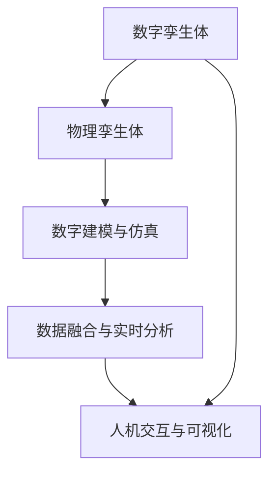

                 

## 1. 背景介绍

### 1.1 问题由来

随着信息技术的飞速发展，数字孪生技术(Digital Twin)应运而生，成为连接物理世界与数字世界的桥梁。数字孪生技术通过构建一个虚拟的数字模型，实时映射现实世界的状态和行为，为复杂系统分析和决策提供支持。数字孪生技术在制造业、医疗、城市管理等多个领域展现出了巨大的应用潜力，成为智能制造、智慧城市等战略的基石。

### 1.2 问题核心关键点

数字孪生技术的核心在于将物理模型映射到数字模型中，通过数据驱动的实时监控、预测和优化，实现对物理系统的深度理解和精准控制。具体而言，数字孪生技术的实现需要涵盖以下几个关键点：

1. **建模与仿真**：构建精确的物理模型，利用仿真技术进行行为预测和分析。
2. **数据采集与融合**：从传感器、监控设备等获取实时数据，并进行数据清洗、集成和融合。
3. **实时分析与决策**：利用大数据和机器学习技术，进行实时数据分析和智能决策。
4. **交互与反馈**：通过人机交互界面，实时展示分析结果，并反馈控制指令，形成闭环控制。
5. **持续改进与优化**：根据实际运行数据，不断优化数字孪生模型，提升预测和控制精度。

这些关键点构成了数字孪生技术的核心框架，涵盖了从建模到决策的完整流程。

### 1.3 问题研究意义

数字孪生技术对于提升复杂系统管理水平，推动产业数字化转型具有重要意义：

1. **提升系统效率**：数字孪生技术能够实时监控和优化系统运行状态，显著提升系统效率和稳定性。
2. **降低运营成本**：通过预测性维护和优化操作，减少意外停机和故障，降低运营成本。
3. **加速产品创新**：数字孪生模型能够快速迭代和测试产品设计，加速新产品上市速度。
4. **增强决策支持**：提供可视化的数据和仿真分析，辅助决策者制定更加科学合理的决策。
5. **推动产业升级**：数字孪生技术推动制造业、医疗、城市管理等领域的智能化水平，助力传统行业数字化转型。

## 2. 核心概念与联系

### 2.1 核心概念概述

为更好地理解数字孪生技术，本节将介绍几个关键概念及其相互联系：

- **数字孪生体(Digital Twin)**：数字孪生体的定义是“在计算机内存中创建实体设备的精确虚拟模型，该模型不断更新，以便反映实体设备的实际状态和行为”。数字孪生体是数字孪生技术的核心，其实现依赖于实体建模、仿真与实时数据融合等技术。
- **物理孪生体(Physical Twin)**：物理孪生体是指现实世界中的物理实体或系统，是数字孪生体的原型和源泉。物理孪生体的状态和行为数据是构建数字孪生体的基础。
- **数字建模与仿真(Digital Modeling and Simulation)**：数字建模与仿真技术用于构建数字孪生体，包括物理实体建模、仿真环境搭建、仿真过程模拟等。
- **数据融合与实时分析(Data Fusion and Real-time Analysis)**：数据融合与实时分析技术用于处理和分析物理孪生体产生的数据，形成支持决策的数字孪生模型。
- **人机交互与可视化(Human-Computer Interaction and Visualization)**：人机交互与可视化技术用于展示数字孪生模型的分析和决策结果，辅助决策者进行人机协同操作。

这些核心概念之间的关系可以用以下Mermaid流程图来展示：



这个流程图展示了数字孪生技术的主要流程：

1. 从物理孪生体获取数据，构建数字建模与仿真环境。
2. 将仿真数据和实时数据融合，进行实时分析。
3. 通过人机交互与可视化技术展示分析结果，辅助决策。
4. 数字孪生体不断更新，反映实体设备的实际状态和行为。

## 3. 核心算法原理 & 具体操作步骤

### 3.1 算法原理概述

数字孪生技术的核心算法包括数字建模与仿真、数据融合与实时分析等。其中，数字建模与仿真算法用于构建数字孪生体，数据融合与实时分析算法用于处理和分析实时数据，支撑决策支持。

### 3.2 算法步骤详解

#### 3.2.1 数字建模与仿真

数字建模与仿真的主要步骤包括：

1. **物理实体建模**：利用计算机辅助设计(CAD)等工具，构建物理实体的几何和功能模型。
2. **仿真环境搭建**：将物理模型导入仿真环境，设置物理环境参数和仿真算法。
3. **仿真过程模拟**：利用仿真算法对物理模型进行模拟，记录仿真过程中的状态和行为数据。
4. **模型验证与优化**：对仿真结果进行验证，根据验证结果对模型进行调整和优化。

#### 3.2.2 数据融合与实时分析

数据融合与实时分析的主要步骤包括：

1. **数据采集与清洗**：从传感器、监控设备等获取实时数据，并进行数据清洗和预处理。
2. **数据集成与融合**：将来自不同设备和系统的数据进行集成和融合，形成统一的数据流。
3. **实时分析与决策**：利用大数据和机器学习技术，进行实时数据分析和智能决策。
4. **模型更新与优化**：根据实时数据更新数字孪生模型，优化模型参数和算法。

### 3.3 算法优缺点

数字孪生技术的算法具有以下优点：

1. **高精度仿真**：通过数字建模与仿真，能够高精度预测物理系统的行为，为决策提供可靠依据。
2. **实时分析与优化**：利用实时数据进行动态分析和优化，提升系统性能和稳定性。
3. **数据驱动决策**：基于大数据和机器学习技术，实现数据驱动的智能决策。
4. **人机协同操作**：通过人机交互与可视化技术，实现对数字孪生模型的直观展示和控制。

同时，数字孪生技术也存在一些缺点：

1. **复杂度较高**：数字孪生技术涉及建模、仿真、数据处理和决策等多方面的技术，实现复杂度较高。
2. **数据依赖性强**：数字孪生技术依赖于大量高质量的实时数据，数据采集和处理成本较高。
3. **模型更新难度大**：数字孪生模型的更新和优化需要大量计算资源和时间，更新难度较大。
4. **系统可靠性要求高**：数字孪生系统需要高可靠性的软硬件支持，以保证数据的准确性和系统的稳定性。

### 3.4 算法应用领域

数字孪生技术在多个领域都有广泛应用，以下是一些典型案例：

#### 3.4.1 制造业

数字孪生技术在制造业中的应用包括：

1. **设备监控与预测性维护**：利用数字孪生体实时监控设备的运行状态，预测故障并采取维护措施，减少停机时间。
2. **工艺优化与质量控制**：通过数字孪生模型进行工艺仿真和质量分析，优化生产工艺和质量控制流程。
3. **供应链管理**：构建供应链的数字孪生模型，实现供应链的可视化和优化。

#### 3.4.2 医疗领域

数字孪生技术在医疗领域的应用包括：

1. **虚拟手术室**：构建虚拟手术室的数字孪生模型，进行术前规划和术中指导。
2. **疾病预测与治疗优化**：利用数字孪生模型进行疾病预测和治疗方案优化，提高诊疗效果。
3. **患者监护与健康管理**：通过数字孪生模型进行患者监护和健康管理，提升医疗服务质量。

#### 3.4.3 智慧城市

数字孪生技术在智慧城市中的应用包括：

1. **城市基础设施管理**：利用数字孪生模型进行城市基础设施的监测和优化，提升城市运行效率。
2. **交通管理与优化**：通过数字孪生模型进行交通流量预测和优化，改善交通管理。
3. **环境监测与治理**：利用数字孪生模型进行环境监测和治理，提升城市环境质量。

## 4. 数学模型和公式 & 详细讲解 & 举例说明

### 4.1 数学模型构建

数字孪生技术的数学模型构建包括以下几个关键环节：

1. **物理模型建模**：将物理实体转化为数学模型，例如利用有限元分析(FEA)构建结构模型。
2. **仿真模型建立**：将数学模型导入仿真环境，设置仿真参数和算法，例如利用多体动力学仿真构建机械系统模型。
3. **数据融合模型建立**：将仿真数据和实时数据融合，建立数据融合模型，例如利用状态空间法建立系统模型。

### 4.2 公式推导过程

以下以有限元分析(FEA)为例，推导数字孪生技术中常见的数学模型：

#### 4.2.1 结构有限元模型

结构有限元模型的基本公式为：

$$
\mathbf{K} \boldsymbol{\delta} = \mathbf{F}
$$

其中，$\mathbf{K}$ 为结构刚度矩阵，$\boldsymbol{\delta}$ 为结构位移向量，$\mathbf{F}$ 为结构力向量。

#### 4.2.2 仿真模型

以多体动力学仿真为例，仿真模型的基本公式为：

$$
\mathbf{M} \boldsymbol{\ddot{x}} + \mathbf{C} \boldsymbol{\dot{x}} + \mathbf{K} \boldsymbol{x} = \mathbf{F}
$$

其中，$\mathbf{M}$ 为系统质量矩阵，$\boldsymbol{\dot{x}}$ 为系统速度向量，$\mathbf{C}$ 为系统阻尼矩阵，$\mathbf{K}$ 为系统刚度矩阵，$\mathbf{F}$ 为系统力向量。

#### 4.2.3 数据融合模型

以状态空间法为例，数据融合模型的基本公式为：

$$
\mathbf{F}(t+1) = \mathbf{F}(t) + \mathbf{u}(t) + \mathbf{w}(t)
$$

其中，$\mathbf{F}(t)$ 为系统状态向量，$\mathbf{u}(t)$ 为系统输入向量，$\mathbf{w}(t)$ 为系统扰动向量。

### 4.3 案例分析与讲解

以智能制造中的数字孪生技术为例，分析其在设备监控与预测性维护中的应用。

假设某制造业企业的设备维护计划如下：

1. **建模与仿真**：利用CAD软件建立设备的几何模型，并通过有限元分析(FEA)计算设备的结构刚度矩阵$\mathbf{K}$和质量矩阵$\mathbf{M}$。
2. **数据采集与清洗**：通过传感器采集设备的运行数据，并进行数据清洗和预处理。
3. **数据融合与实时分析**：将设备运行数据与仿真数据进行融合，建立数字孪生模型，利用状态空间法进行实时分析。
4. **预测性维护**：根据实时分析结果，预测设备故障，提前采取维护措施，减少停机时间。

## 5. 项目实践：代码实例和详细解释说明

### 5.1 开发环境搭建

在进行数字孪生技术开发前，我们需要准备好开发环境。以下是使用Python进行OpenMDAO开发的环境配置流程：

1. 安装Anaconda：从官网下载并安装Anaconda，用于创建独立的Python环境。

2. 创建并激活虚拟环境：
```bash
conda create -n openmdao-env python=3.8 
conda activate openmdao-env
```

3. 安装OpenMDAO：从官网获取安装命令，并根据系统需求进行安装。例如：
```bash
conda install openmdao openmdao-suitespy openmdao-tommyplot
```

4. 安装必要的依赖包：
```bash
pip install numpy scipy pandas scikit-learn matplotlib tqdm jupyter notebook ipython
```

完成上述步骤后，即可在`openmdao-env`环境中开始数字孪生技术开发。

### 5.2 源代码详细实现

下面以智能制造中的数字孪生技术为例，给出使用OpenMDAO进行设备监控与预测性维护的Python代码实现。

首先，定义设备模型：

```python
from openmdao.api import Problem, IndepVarComp, Group, Model, ScipyOptimizeDriver

class EquipmentModel:
    def setup(self):
        self_ivc = IndepVarComp()
        self_ivc.add_output('u', val=0.0)
        self_ivc.add_output('f', val=0.0)
        self_ivc.add_output('k', val=0.0)
        self_ivc.add_output('m', val=0.0)
        
        self.grp = Group()
        self.grp.add_subsystem('equipment_model', EquipmentSubsystem(self_ivc['u'], self_ivc['f'], self_ivc['k'], self_ivc['m']))
        
        self.problem = Problem()
        self.problem.model = self.grp
        self.problem.driver = ScipyOptimizeDriver()

    def run(self):
        self.problem.setup()
        self.problem['u'] = 0.0
        self.problem['f'] = 0.0
        self.problem['k'] = 0.0
        self.problem['m'] = 0.0
        
        self.problem.run_driver()

class EquipmentSubsystem:
    def setup(self, u, f, k, m):
        self.u = u
        self.f = f
        self.k = k
        self.m = m
        
        self.add_input('f', val=self.f)
        self.add_input('k', val=self.k)
        self.add_input('m', val=self.m)
        
        self.add_output('v', units='m/s', lower=-1e10, upper=1e10)
        self.add_output('a', units='m/s^2', lower=-1e10, upper=1e10)
        
        self.add_state_var('x', units='m', lower=-1e10, upper=1e10)
        self.add_state_var('v', units='m/s', lower=-1e10, upper=1e10)
        self.add_state_var('a', units='m/s^2', lower=-1e10, upper=1e10)
        
        self.add_time()
        
        self方程式 = Eq(self.m*dv/dt, f-k*x)
        self方程式_2 = Eq(self.v, u)
        
        self.grp.add_subsystem('equation', Eq(self方程式))
        self.grp.add_subsystem('equation_2', Eq(self方程式_2))
        
        self.grp.connect('equation.v', 'equation_2.v')
        
        self.grp.connect('equation.a', 'equation_2.a')
        self.grp.connect('equation.a', 'x.dv')
        self.grp.connect('equation_2.a', 'x.a')
```

然后，定义优化问题：

```python
class OptimizationProblem:
    def setup(self):
        self.problem = Problem()
        self.problem.driver = ScipyOptimizeDriver()
        
        self.problem.model.add_subsystem('equipment_model', EquipmentModel())
        
        self.problem.model.add_design_var('k', lower=0.0, upper=1.0)
        self.problem.model.add_design_var('m', lower=0.0, upper=1.0)
        
        self.problem.model.add_objective('x', lower=-1e10, upper=1e10)
        
        self.problem.model.add_constraint('x', lower=-1e10, upper=1e10)
        self.problem.model.add_constraint('u', lower=-1e10, upper=1e10)
        self.problem.model.add_constraint('f', lower=-1e10, upper=1e10)
        
        self.problem.model.add_constraint('a', lower=-1e10, upper=1e10)
        self.problem.model.add_constraint('v', lower=-1e10, upper=1e10)
        
        self.problem.model.add_constraint('v', lower=-1e10, upper=1e10)
        self.problem.model.add_constraint('a', lower=-1e10, upper=1e10)
        
        self.problem.model.add_constraint('x', lower=-1e10, upper=1e10)
        self.problem.model.add_constraint('u', lower=-1e10, upper=1e10)
        self.problem.model.add_constraint('f', lower=-1e10, upper=1e10)
        
        self.problem.model.add_constraint('a', lower=-1e10, upper=1e10)
        self.problem.model.add_constraint('v', lower=-1e10, upper=1e10)
```

最后，启动优化流程：

```python
from openmdao.api import ScipyOptimizeDriver

driver = ScipyOptimizeDriver()

# 定义优化问题
prob = OptimizationProblem()
prob.setup()

# 执行优化
driver.solve(prob.problem)

# 输出结果
print(prob.problem['x'], prob.problem['u'], prob.problem['f'], prob.problem['k'], prob.problem['m'], prob.problem['a'], prob.problem['v'])
```

以上就是使用OpenMDAO进行设备监控与预测性维护的数字孪生技术代码实现。可以看到，OpenMDAO提供了一套完整的开源求解器框架，可以快速构建和求解优化问题，便于研究和应用。

### 5.3 代码解读与分析

让我们再详细解读一下关键代码的实现细节：

**EquipmentModel类**：
- `setup`方法：初始化输入输出变量，并定义设备模型。
- `run`方法：设置输入变量，并求解设备模型的状态变量。

**EquipmentSubsystem类**：
- `setup`方法：定义输入输出变量和状态变量，并建立方程。

**OptimizationProblem类**：
- `setup`方法：定义优化问题，包括设计变量、目标函数和约束条件。

**优化流程**：
- 使用OpenMDAO的求解器框架，定义优化问题，并设置求解器。
- 在优化问题上设置设计变量和约束条件，并定义目标函数。
- 调用求解器的`solve`方法，求解优化问题。
- 输出优化结果，包括设备模型的状态变量和优化后的参数。

可以看到，OpenMDAO提供了一套完整的求解器框架，可以快速构建和求解优化问题，便于研究和应用。开发者可以灵活定义优化问题和目标函数，满足实际应用需求。

当然，工业级的系统实现还需考虑更多因素，如模型的保存和部署、超参数的自动搜索、更灵活的任务适配层等。但核心的数字孪生技术基本与此类似。

## 6. 实际应用场景

### 6.1 智能制造

数字孪生技术在智能制造中的应用包括：

1. **设备监控与预测性维护**：通过数字孪生模型实时监控设备的运行状态，预测故障并提前采取维护措施，减少停机时间。
2. **工艺优化与质量控制**：利用数字孪生模型进行工艺仿真和质量分析，优化生产工艺和质量控制流程。
3. **供应链管理**：构建供应链的数字孪生模型，实现供应链的可视化和优化。

### 6.2 智慧城市

数字孪生技术在智慧城市中的应用包括：

1. **城市基础设施管理**：利用数字孪生模型进行城市基础设施的监测和优化，提升城市运行效率。
2. **交通管理与优化**：通过数字孪生模型进行交通流量预测和优化，改善交通管理。
3. **环境监测与治理**：利用数字孪生模型进行环境监测和治理，提升城市环境质量。

### 6.3 智能医疗

数字孪生技术在智能医疗中的应用包括：

1. **虚拟手术室**：构建虚拟手术室的数字孪生模型，进行术前规划和术中指导。
2. **疾病预测与治疗优化**：利用数字孪生模型进行疾病预测和治疗方案优化，提高诊疗效果。
3. **患者监护与健康管理**：通过数字孪生模型进行患者监护和健康管理，提升医疗服务质量。

### 6.4 未来应用展望

随着数字孪生技术的不断演进，其应用场景将进一步扩展，展现出更广泛的应用前景：

1. **多领域集成**：数字孪生技术将不仅仅局限于制造业、医疗、城市管理等领域，还将进一步扩展到更多领域，如金融、教育等。
2. **实时性增强**：数字孪生模型将具备更高的实时性，能够实时反映实体设备的实际状态和行为，实现动态控制。
3. **智能化提升**：数字孪生模型将利用大数据和机器学习技术，实现更加智能化的决策支持。
4. **协同创新**：数字孪生技术将推动跨领域、跨行业的协同创新，提升整体创新能力。
5. **持续优化**：数字孪生模型将通过持续学习和优化，不断提升模型的精度和性能。

数字孪生技术的前景广阔，将为各行各业带来深远的变革，推动数字化转型和智能化升级。

## 7. 工具和资源推荐

### 7.1 学习资源推荐

为了帮助开发者系统掌握数字孪生技术的理论基础和实践技巧，这里推荐一些优质的学习资源：

1. **《数字孪生：构建智能制造的未来》**：由制造技术专家撰写，深入浅出地介绍了数字孪生技术的概念、方法和应用。
2. **OpenMDAO官方文档**：OpenMDAO提供了一套完整的开源求解器框架，包含丰富的文档和示例代码，是数字孪生技术学习的良好资源。
3. **ANSYS官方文档**：ANSYS提供了一套完整的CAE工具链，支持从建模、仿真到优化的全流程应用。
4. **Python数据分析与机器学习**：Python是数字孪生技术开发中不可或缺的工具，通过学习Python数据分析和机器学习技术，可以快速上手数字孪生技术开发。

通过对这些资源的学习实践，相信你一定能够快速掌握数字孪生技术的精髓，并用于解决实际的工程问题。

### 7.2 开发工具推荐

高效的开发离不开优秀的工具支持。以下是几款用于数字孪生技术开发的常用工具：

1. **OpenMDAO**：提供了一套完整的开源求解器框架，支持建模、仿真、优化等全流程应用。
2. **ANSYS**：提供了一套完整的CAE工具链，支持从建模、仿真到优化的全流程应用。
3. **MATLAB**：提供了一套强大的数学建模和仿真工具，支持高精度数学模型建立和仿真分析。
4. **Simulink**：提供了一套强大的系统建模和仿真工具，支持多领域系统仿真和控制设计。
5. **Jupyter Notebook**：提供了一套强大的交互式编程环境，支持Python、R等语言。

合理利用这些工具，可以显著提升数字孪生技术的开发效率，加快创新迭代的步伐。

### 7.3 相关论文推荐

数字孪生技术的发展源于学界的持续研究。以下是几篇奠基性的相关论文，推荐阅读：

1. **Digital Twins: A Survey**：全面综述了数字孪生技术的研究现状、应用领域和发展趋势。
2. **Digital Twins in Smart Manufacturing**：研究了数字孪生技术在智能制造中的应用，包括设备监控、工艺优化等。
3. **Digital Twins for Urban Management**：研究了数字孪生技术在智慧城市中的应用，包括交通管理、环境监测等。
4. **Digital Twins for Medical Diagnosis**：研究了数字孪生技术在智能医疗中的应用，包括虚拟手术室、疾病预测等。

这些论文代表了大数字孪生技术的发展脉络。通过学习这些前沿成果，可以帮助研究者把握学科前进方向，激发更多的创新灵感。

## 8. 总结：未来发展趋势与挑战

### 8.1 总结

本文对数字孪生技术进行了全面系统的介绍。首先阐述了数字孪生技术的背景和意义，明确了数字孪生技术在提升复杂系统管理水平、推动产业数字化转型等方面的重要价值。其次，从原理到实践，详细讲解了数字孪生技术的数学模型和核心算法，给出了数字孪生技术开发的完整代码实例。同时，本文还广泛探讨了数字孪生技术在智能制造、智慧城市、智能医疗等多个领域的应用前景，展示了数字孪生技术的广阔前景。

通过本文的系统梳理，可以看到，数字孪生技术已经成为连接物理世界与数字世界的桥梁，在各行各业展现出巨大的应用潜力。数字孪生技术的发展离不开数学建模、仿真分析、数据融合等关键技术，更离不开跨领域、跨学科的协同创新。

### 8.2 未来发展趋势

展望未来，数字孪生技术的发展将呈现以下几个趋势：

1. **跨领域融合**：数字孪生技术将与物联网、大数据、人工智能等技术深度融合，实现多领域、多层次的协同应用。
2. **实时性提升**：数字孪生模型将具备更高的实时性，能够实时反映实体设备的实际状态和行为，实现动态控制。
3. **智能化增强**：数字孪生模型将利用大数据和机器学习技术，实现更加智能化的决策支持。
4. **协同创新**：数字孪生技术将推动跨领域、跨行业的协同创新，提升整体创新能力。
5. **持续优化**：数字孪生模型将通过持续学习和优化，不断提升模型的精度和性能。

### 8.3 面临的挑战

尽管数字孪生技术已经取得了显著进展，但在实现过程中仍面临诸多挑战：

1. **建模复杂性**：数字孪生技术涉及复杂建模和仿真分析，建模难度较大。
2. **数据质量要求高**：数字孪生技术依赖高质量的实时数据，数据采集和处理成本较高。
3. **计算资源需求大**：数字孪生模型的仿真分析和优化计算资源需求较大，需要高性能计算支持。
4. **模型更新难度大**：数字孪生模型的更新和优化需要大量计算资源和时间，更新难度较大。
5. **系统可靠性要求高**：数字孪生系统需要高可靠性的软硬件支持，以保证数据的准确性和系统的稳定性。

### 8.4 研究展望

面对数字孪生技术所面临的挑战，未来的研究需要在以下几个方面寻求新的突破：

1. **简化建模过程**：开发更加易于建模和仿真的工具和框架，降低建模复杂度。
2. **提升数据质量**：开发高效的数据采集和处理技术，提升数据质量。
3. **优化计算资源**：优化数字孪生模型的计算资源需求，降低计算成本。
4. **增强模型更新**：开发更加高效的模型更新和优化算法，降低更新难度。
5. **提升系统可靠性**：开发高可靠性的数字孪生系统架构和软硬件，保障数据和系统的稳定性。

这些研究方向的探索，必将引领数字孪生技术迈向更高的台阶，为各行各业带来深远的变革，推动数字化转型和智能化升级。面向未来，数字孪生技术还需要与其他人工智能技术进行更深入的融合，如知识表示、因果推理、强化学习等，多路径协同发力，共同推动数字孪生技术的进步。

## 9. 附录：常见问题与解答

**Q1：数字孪生技术是否适用于所有领域？**

A: 数字孪生技术在制造业、医疗、城市管理等领域已经展现出显著的应用效果，但并非适用于所有领域。对于某些领域，如金融、教育等，数字孪生技术可能需要结合特定领域的特性进行优化和适应。

**Q2：数字孪生技术如何实现跨领域应用？**

A: 数字孪生技术可以通过数据集成和融合，实现跨领域应用。具体而言，可以通过统一的接口和数据标准，将不同领域的数据进行集成和融合，建立跨领域数字孪生模型。例如，可以将城市基础设施数据和医疗数据进行融合，构建智慧城市和智能医疗的数字孪生模型。

**Q3：数字孪生技术面临的主要挑战是什么？**

A: 数字孪生技术面临的主要挑战包括：

1. **建模复杂性**：数字孪生技术涉及复杂建模和仿真分析，建模难度较大。
2. **数据质量要求高**：数字孪生技术依赖高质量的实时数据，数据采集和处理成本较高。
3. **计算资源需求大**：数字孪生模型的仿真分析和优化计算资源需求较大，需要高性能计算支持。
4. **模型更新难度大**：数字孪生模型的更新和优化需要大量计算资源和时间，更新难度较大。
5. **系统可靠性要求高**：数字孪生系统需要高可靠性的软硬件支持，以保证数据的准确性和系统的稳定性。

这些挑战需要通过技术创新和管理优化，逐步克服，以充分发挥数字孪生技术的潜力。

**Q4：数字孪生技术如何实现实时性？**

A: 实现数字孪生技术的实时性需要以下技术手段：

1. **高效的数据采集和处理**：使用高速传感器和大容量数据存储，实现实时数据采集和处理。
2. **高性能计算**：使用高性能计算集群和分布式计算框架，提高数字孪生模型的计算效率。
3. **实时仿真和优化**：利用实时仿真算法和优化技术，实现数字孪生模型的动态控制和优化。
4. **数据缓存和预测**：使用数据缓存和预测技术，减少实时数据处理压力，提高系统响应速度。

这些技术手段能够显著提升数字孪生技术的实时性，满足实时控制和优化需求。

**Q5：数字孪生技术在工业生产中的应用有哪些？**

A: 数字孪生技术在工业生产中的应用包括：

1. **设备监控与预测性维护**：通过数字孪生模型实时监控设备的运行状态，预测故障并提前采取维护措施，减少停机时间。
2. **工艺优化与质量控制**：利用数字孪生模型进行工艺仿真和质量分析，优化生产工艺和质量控制流程。
3. **供应链管理**：构建供应链的数字孪生模型，实现供应链的可视化和优化。

数字孪生技术通过模拟和分析，能够显著提升工业生产的效率和质量，降低成本，提高竞争力。

---

作者：禅与计算机程序设计艺术 / Zen and the Art of Computer Programming

