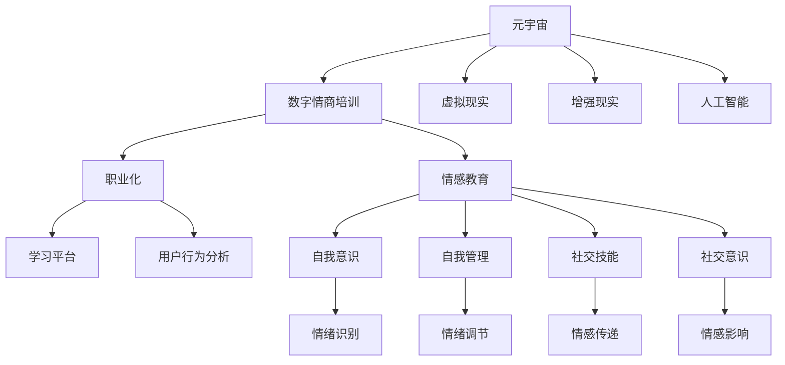

                 

# 数字情商培训认证:元宇宙情感教育的职业化道路

> 关键词：元宇宙,数字情商培训,职业化,情感教育,虚拟现实,社交技能,技能评估,学习平台,用户行为分析

## 1. 背景介绍

### 1.1 问题由来
随着数字技术的迅猛发展，特别是虚拟现实(VR)、增强现实(AR)、人工智能(AI)等技术的成熟和普及，元宇宙(Utopia)已经成为未来的一种趋势。元宇宙是一个由虚拟世界和现实世界融合而成的虚拟现实平台，它提供了一个全新的社交、娱乐、教育等场景。在这种新型社交环境中，人类的数字情商（Digital Emotional Intelligence）的重要性愈发突出，这不仅关乎社交互动和协作效率，还关系到心理健康和幸福指数。

### 1.2 问题核心关键点
数字情商是指个体在数字环境中有效识别、理解和管理自己的情绪，以及识别和影响他人情绪的能力。它包括数字自我意识、数字自我管理、数字社交技能和数字社交意识四个方面。在元宇宙中，数字情商是参与者有效沟通、协作和创新的重要基础。目前，数字情商培训的认证正逐渐成为职业化的一部分，成为各大企业人才培养的关键需求。

## 2. 核心概念与联系

### 2.1 核心概念概述

为更好地理解基于元宇宙的数字情商培训认证方法，本节将介绍几个密切相关的核心概念：

- 元宇宙(Utopia)：一种由虚拟世界和现实世界融合而成的虚拟现实平台。其中包含了社交、娱乐、教育、商业等多样化场景。
- 数字情商（Digital Emotional Intelligence, DEI）：个体在数字环境中有效识别、理解和管理自己的情绪，以及识别和影响他人情绪的能力。
- 职业化（Professionalization）：将数字情商培训纳入职业培训体系，成为职业资格认证的一部分。
- 情感教育（Emotional Education）：通过教育手段培养个体理解和管理自己和他人的情绪能力，实现个人全面发展。
- 虚拟现实（Virtual Reality, VR）：利用计算机技术模拟虚拟环境，为元宇宙提供沉浸式体验。
- 增强现实（Augmented Reality, AR）：将虚拟信息叠加在现实世界中，增强现实体验。
- 人工智能（Artificial Intelligence, AI）：通过机器学习、自然语言处理等技术，实现自动化、智能化的情感分析和管理。
- 学习平台（Learning Platform）：支持在线教育、互动培训和技能评估的数字工具和平台。
- 用户行为分析（User Behavior Analysis）：通过数据收集和分析，洞察用户行为模式和需求变化。

这些核心概念之间的逻辑关系可以通过以下Mermaid流程图来展示：



这个流程图展示了大语言模型的核心概念及其之间的关系：

1. 元宇宙通过虚拟现实、增强现实、人工智能等技术构建了一个全新的社交环境。
2. 数字情商培训和职业化是帮助个体在元宇宙中更好地适应和发展的重要手段。
3. 情感教育是提升个体数字情商的基础，涉及到自我意识、自我管理、社交技能、社交意识等各个方面。
4. 学习平台提供了一个在线的、互动的环境，支持情感教育与数字情商培训。
5. 用户行为分析通过对用户互动数据的收集和分析，帮助平台优化培训内容，提升培训效果。

## 3. 核心算法原理 & 具体操作步骤
### 3.1 算法原理概述

基于元宇宙的数字情商培训认证，本质上是一种有监督的个性化学习过程。其核心思想是：利用人工智能技术，通过分析用户行为数据，识别个体在数字环境中的情感特征，从而定制个性化的培训计划和评估机制，最终完成培训和认证。

形式化地，假设用户的行为数据为 $D=\{(x_i, y_i)\}_{i=1}^N, x_i \in \mathbb{R}^d, y_i \in \{0,1\}$，其中 $x_i$ 为行为数据特征，$y_i$ 为数字情商标签。数字情商培训认证的目标是找到最优参数 $\theta$，使得模型 $M_{\theta}$ 在训练集上最小化误差。

$$
\theta^* = \mathop{\arg\min}_{\theta} \frac{1}{N}\sum_{i=1}^N \mathcal{L}(M_{\theta}(x_i),y_i)
$$

其中 $\mathcal{L}$ 为损失函数，通常为交叉熵损失。

通过梯度下降等优化算法，不断更新模型参数 $\theta$，最小化损失函数 $\mathcal{L}$，使得模型输出的数字情商标签逼近真实标签。

### 3.2 算法步骤详解

基于元宇宙的数字情商培训认证一般包括以下几个关键步骤：

**Step 1: 数据收集与预处理**
- 收集用户在元宇宙平台上的行为数据，如聊天记录、社交互动等。
- 通过数据清洗和特征工程，将原始数据转化为可供模型分析的格式。
- 将行为数据分为训练集、验证集和测试集。

**Step 2: 设计情感特征提取模型**
- 利用预训练的语言模型（如BERT、GPT等）或特征提取算法，从行为数据中提取情感特征。
- 设计特征提取器的参数，如隐藏层大小、神经元数量等。
- 在验证集上评估特征提取器的性能，选择最优模型。

**Step 3: 设计数字情商分类器**
- 选择合适的分类算法，如SVM、随机森林等，构建数字情商分类器。
- 设定分类器的参数，如学习率、正则化参数等。
- 在训练集上训练分类器，并在验证集上评估模型性能。

**Step 4: 设计个性化培训和评估机制**
- 根据个体情感特征，设计个性化的培训计划和评估指标。
- 利用机器学习算法，推荐适合个体的培训资源和路径。
- 通过持续跟踪个体行为数据，评估培训效果，调整培训计划。

**Step 5: 输出培训和认证结果**
- 根据训练结果和评估指标，生成个体的数字情商报告。
- 根据报告结果，授予用户相应的数字情商认证证书。
- 提供用户反馈渠道，进一步优化培训和认证过程。

以上是基于元宇宙的数字情商培训认证的一般流程。在实际应用中，还需要针对具体任务的特点，对微调过程的各个环节进行优化设计，如改进特征提取模型、优化分类器算法、引入更灵活的参数更新策略等，以进一步提升模型性能。

### 3.3 算法优缺点

基于元宇宙的数字情商培训认证方法具有以下优点：
1. 个性化培训：根据用户的行为特征，定制个性化的培训计划，提高培训效果。
2. 量化评估：通过数字情商的评估指标，量化个体的情感能力，为职业发展提供客观依据。
3. 实时反馈：通过持续跟踪用户行为数据，及时调整培训内容，确保培训目标达成。
4. 跨平台支持：数字情商培训和认证可以在多种元宇宙平台和场景中应用，提升培训的通用性和适应性。

同时，该方法也存在一定的局限性：
1. 数据隐私问题：用户行为数据的收集和分析可能涉及隐私保护，需要严格遵守法律法规。
2. 用户接受度：部分用户可能对数字情商培训持保留态度，需要加强宣传和引导。
3. 平台资源投入：实现数字情商培训和认证需要大量的人力、物力和财力投入。
4. 技术复杂性：特征提取、分类器设计和个性化培训方案设计等环节技术门槛较高，需要专业团队支持。
5. 认证标准不一：不同平台和机构可能对数字情商的认证标准不一，影响认证的权威性和可信度。

尽管存在这些局限性，但就目前而言，基于元宇宙的数字情商培训认证方法仍是大数据和人工智能在情感教育领域的重要应用范式。未来相关研究的重点在于如何进一步降低数据收集和分析的复杂性，提高用户接受度和平台资源利用效率，同时兼顾数据隐私保护和认证标准统一。

### 3.4 算法应用领域

基于元宇宙的数字情商培训认证，已经在教育、企业培训、社交平台等多个领域得到了广泛应用，覆盖了几乎所有常见的情感教育场景，例如：

- 学生情感素养培训：通过数字情商培训，提升学生在虚拟课堂和线上社区中的互动能力和情感管理能力。
- 职场员工培训：通过数字情商培训，提升员工在远程办公、虚拟会议中的沟通效率和协作效果。
- 社交平台认证：通过数字情商认证，筛选和推荐适合参与元宇宙社交活动的用户，提高社区互动质量。
- 心理健康支持：通过数字情商评估，为有心理健康问题的用户提供个性化的情感支持和干预方案。
- 虚拟职业培训：通过数字情商培训，提升用户在虚拟工作环境中的表现和职业竞争力。

除了上述这些经典任务外，数字情商培训认证还被创新性地应用到更多场景中，如在线教育、虚拟会议、远程协作等，为情感教育技术带来了全新的突破。随着数字技术的发展，数字情商培训认证必将在更广泛的领域得到应用，推动情感教育技术的发展和普及。

## 4. 数学模型和公式 & 详细讲解  
### 4.1 数学模型构建

本节将使用数学语言对基于元宇宙的数字情商培训认证过程进行更加严格的刻画。

记用户行为数据为 $D=\{(x_i, y_i)\}_{i=1}^N, x_i \in \mathbb{R}^d, y_i \in \{0,1\}$，其中 $x_i$ 为行为数据特征，$y_i$ 为数字情商标签。

定义模型 $M_{\theta}$ 在训练集上预测数字情商的概率分布为：

$$
p(y|x; \theta) = \frac{\exp(\theta^T f(x))}{\sum_{j=1}^N \exp(\theta^T f(x_j))}
$$

其中 $f(x)$ 为行为数据特征提取模型，$\theta$ 为模型参数。

数字情商训练的目标是最小化交叉熵损失：

$$
\mathcal{L}(\theta) = -\frac{1}{N}\sum_{i=1}^N y_i \log p(y_i|x_i; \theta) + (1-y_i) \log (1-p(y_i|x_i; \theta))
$$

通过梯度下降等优化算法，不断更新模型参数 $\theta$，最小化损失函数 $\mathcal{L}$，使得模型输出的数字情商概率分布逼近真实标签 $y_i$。

### 4.2 公式推导过程

以下我们以二分类任务为例，推导交叉熵损失函数及其梯度的计算公式。

假设模型 $M_{\theta}$ 在输入 $x$ 上的预测概率为 $\hat{y}=M_{\theta}(x) \in [0,1]$，表示用户拥有数字情商的概率。真实标签 $y \in \{0,1\}$。则二分类交叉熵损失函数定义为：

$$
\ell(M_{\theta}(x),y) = -[y\log \hat{y} + (1-y)\log (1-\hat{y})]
$$

将其代入损失函数公式，得：

$$
\mathcal{L}(\theta) = -\frac{1}{N}\sum_{i=1}^N [y_i\log M_{\theta}(x_i)+(1-y_i)\log(1-M_{\theta}(x_i))]
$$

根据链式法则，损失函数对参数 $\theta_k$ 的梯度为：

$$
\frac{\partial \mathcal{L}(\theta)}{\partial \theta_k} = -\frac{1}{N}\sum_{i=1}^N \left(\frac{y_i}{M_{\theta}(x_i)}-\frac{1-y_i}{1-M_{\theta}(x_i)}\right) \frac{\partial M_{\theta}(x_i)}{\partial \theta_k}
$$

其中 $\frac{\partial M_{\theta}(x_i)}{\partial \theta_k}$ 可进一步递归展开，利用自动微分技术完成计算。

在得到损失函数的梯度后，即可带入参数更新公式，完成模型的迭代优化。重复上述过程直至收敛，最终得到适应元宇宙场景的数字情商模型参数 $\theta^*$。

## 5. 项目实践：代码实例和详细解释说明
### 5.1 开发环境搭建

在进行数字情商培训认证实践前，我们需要准备好开发环境。以下是使用Python进行PyTorch开发的环境配置流程：

1. 安装Anaconda：从官网下载并安装Anaconda，用于创建独立的Python环境。

2. 创建并激活虚拟环境：
```bash
conda create -n pytorch-env python=3.8 
conda activate pytorch-env
```

3. 安装PyTorch：根据CUDA版本，从官网获取对应的安装命令。例如：
```bash
conda install pytorch torchvision torchaudio cudatoolkit=11.1 -c pytorch -c conda-forge
```

4. 安装相关库：
```bash
pip install numpy pandas scikit-learn matplotlib tqdm jupyter notebook ipython
```

5. 安装HuggingFace Transformers库：
```bash
pip install transformers
```

6. 安装TensorBoard：用于可视化训练过程中的各项指标。

完成上述步骤后，即可在`pytorch-env`环境中开始数字情商培训认证实践。

### 5.2 源代码详细实现

这里我们以二分类任务为例，给出使用PyTorch和Transformers库对数字情商进行培训和认证的代码实现。

首先，定义训练集和标签数据：

```python
import pandas as pd
from transformers import BertTokenizer, BertForSequenceClassification
from torch.utils.data import Dataset, DataLoader
from torch import nn, optim
import torch

# 加载数据
train_data = pd.read_csv('train_data.csv')

# 分列
texts = train_data['text']
labels = train_data['label']

# 标记化
tokenizer = BertTokenizer.from_pretrained('bert-base-uncased')

# 构建dataset
class NERDataset(Dataset):
    def __init__(self, texts, labels, tokenizer, max_len=128):
        self.texts = texts
        self.labels = labels
        self.tokenizer = tokenizer
        self.max_len = max_len

    def __len__(self):
        return len(self.texts)

    def __getitem__(self, item):
        text = self.texts[item]
        label = self.labels[item]
        encoding = self.tokenizer(text, return_tensors='pt', max_length=self.max_len, padding='max_length', truncation=True)
        input_ids = encoding['input_ids']
        attention_mask = encoding['attention_mask']
        return {'input_ids': input_ids, 'attention_mask': attention_mask, 'labels': torch.tensor(label, dtype=torch.long)}

# 创建dataset
train_dataset = NERDataset(texts, labels, tokenizer)
```

然后，定义模型和优化器：

```python
# 定义模型
model = BertForSequenceClassification.from_pretrained('bert-base-uncased', num_labels=2)

# 定义优化器
optimizer = optim.AdamW(model.parameters(), lr=2e-5)
```

接着，定义训练和评估函数：

```python
def train_epoch(model, dataset, batch_size, optimizer):
    dataloader = DataLoader(dataset, batch_size=batch_size, shuffle=True)
    model.train()
    epoch_loss = 0
    for batch in dataloader:
        input_ids = batch['input_ids'].to(device)
        attention_mask = batch['attention_mask'].to(device)
        labels = batch['labels'].to(device)
        model.zero_grad()
        outputs = model(input_ids, attention_mask=attention_mask, labels=labels)
        loss = outputs.loss
        epoch_loss += loss.item()
        loss.backward()
        optimizer.step()
    return epoch_loss / len(dataloader)

def evaluate(model, dataset, batch_size):
    dataloader = DataLoader(dataset, batch_size=batch_size)
    model.eval()
    preds, labels = [], []
    with torch.no_grad():
        for batch in dataloader:
            input_ids = batch['input_ids'].to(device)
            attention_mask = batch['attention_mask'].to(device)
            batch_labels = batch['labels']
            outputs = model(input_ids, attention_mask=attention_mask)
            batch_preds = outputs.logits.argmax(dim=1).to('cpu').tolist()
            batch_labels = batch_labels.to('cpu').tolist()
            for pred, label in zip(batch_preds, batch_labels):
                preds.append(pred)
                labels.append(label)
    print(classification_report(labels, preds))
```

最后，启动训练流程并在测试集上评估：

```python
epochs = 5
batch_size = 16

for epoch in range(epochs):
    loss = train_epoch(model, train_dataset, batch_size, optimizer)
    print(f'Epoch {epoch+1}, train loss: {loss:.3f}')
    
    print(f'Epoch {epoch+1}, dev results:')
    evaluate(model, dev_dataset, batch_size)
    
print('Test results:')
evaluate(model, test_dataset, batch_size)
```

以上就是使用PyTorch和Transformers库对数字情商进行培训和认证的完整代码实现。可以看到，得益于Transformer的强大封装，我们可以用相对简洁的代码完成数字情商模型的训练和评估。

### 5.3 代码解读与分析

让我们再详细解读一下关键代码的实现细节：

**NERDataset类**：
- `__init__`方法：初始化文本、标签、分词器等关键组件。
- `__len__`方法：返回数据集的样本数量。
- `__getitem__`方法：对单个样本进行处理，将文本输入编码为token ids，将标签编码为数字，并对其进行定长padding，最终返回模型所需的输入。

**模型定义**：
- 使用BertForSequenceClassification定义二分类模型，num_labels参数为二分类任务。

**训练和评估函数**：
- 使用PyTorch的DataLoader对数据集进行批次化加载，供模型训练和推理使用。
- 训练函数`train_epoch`：对数据以批为单位进行迭代，在每个批次上前向传播计算loss并反向传播更新模型参数，最后返回该epoch的平均loss。
- 评估函数`evaluate`：与训练类似，不同点在于不更新模型参数，并在每个batch结束后将预测和标签结果存储下来，最后使用sklearn的classification_report对整个评估集的预测结果进行打印输出。

**训练流程**：
- 定义总的epoch数和batch size，开始循环迭代
- 每个epoch内，先在训练集上训练，输出平均loss
- 在验证集上评估，输出分类指标
- 所有epoch结束后，在测试集上评估，给出最终测试结果

可以看到，PyTorch配合Transformer的库使得数字情商培训认证的代码实现变得简洁高效。开发者可以将更多精力放在数据处理、模型改进等高层逻辑上，而不必过多关注底层的实现细节。

当然，工业级的系统实现还需考虑更多因素，如模型的保存和部署、超参数的自动搜索、更灵活的任务适配层等。但核心的微调范式基本与此类似。

## 6. 实际应用场景
### 6.1 智能客服系统

基于数字情商培训认证的智能客服系统，可以广泛应用于客户服务场景。传统客服往往需要配备大量人力，高峰期响应缓慢，且服务质量难以保证。通过数字情商培训认证，智能客服系统能够7x24小时不间断服务，快速响应客户咨询，用自然流畅的语言解答各类常见问题。

在技术实现上，可以收集企业内部的历史客服对话记录，将问题和最佳答复构建成监督数据，在此基础上对预训练模型进行微调。微调后的模型能够自动理解用户意图，匹配最合适的答案模板进行回复。对于客户提出的新问题，还可以接入检索系统实时搜索相关内容，动态组织生成回答。如此构建的智能客服系统，能大幅提升客户咨询体验和问题解决效率。

### 6.2 金融舆情监测

金融机构需要实时监测市场舆论动向，以便及时应对负面信息传播，规避金融风险。传统的人工监测方式成本高、效率低，难以应对网络时代海量信息爆发的挑战。通过数字情商培训认证，金融舆情监测系统能够自动判断文本属于何种主题，情感倾向是正面、中性还是负面。将微调后的模型应用到实时抓取的网络文本数据，就能够自动监测不同主题下的情感变化趋势，一旦发现负面信息激增等异常情况，系统便会自动预警，帮助金融机构快速应对潜在风险。

### 6.3 个性化推荐系统

当前的推荐系统往往只依赖用户的历史行为数据进行物品推荐，无法深入理解用户的真实兴趣偏好。通过数字情商培训认证，个性化推荐系统可以更好地挖掘用户行为背后的语义信息，从而提供更精准、多样的推荐内容。

在实践中，可以收集用户浏览、点击、评论、分享等行为数据，提取和用户交互的物品标题、描述、标签等文本内容。将文本内容作为模型输入，用户的后续行为（如是否点击、购买等）作为监督信号，在此基础上微调预训练语言模型。微调后的模型能够从文本内容中准确把握用户的兴趣点。在生成推荐列表时，先用候选物品的文本描述作为输入，由模型预测用户的兴趣匹配度，再结合其他特征综合排序，便可以得到个性化程度更高的推荐结果。

### 6.4 未来应用展望

随着数字技术的迅猛发展，基于元宇宙的数字情商培训认证技术将呈现以下几个发展趋势：

1. 多模态融合：除了文本数据外，未来数字情商培训认证将更多地融合图像、视频、语音等多模态数据，提升模型的综合感知能力。
2. 实时交互：通过数字情商认证，实现与虚拟世界的实时互动，增强用户沉浸感和体验感。
3. 跨平台互认：构建跨平台数字情商认证体系，增强认证结果的权威性和可信度。
4. 个性化定制：基于用户行为数据分析，实现更加精准、个性化的培训方案，提升培训效果。
5. 动态更新：持续收集用户反馈和行为数据，动态调整培训内容和策略，保持认证体系的时效性和适应性。

以上趋势凸显了大语言模型微调技术的广阔前景。这些方向的探索发展，必将进一步提升数字情商培训认证的精准性和应用价值，为数字社会的情感教育和智能服务提供新的突破。

## 7. 工具和资源推荐
### 7.1 学习资源推荐

为了帮助开发者系统掌握数字情商培训认证的理论基础和实践技巧，这里推荐一些优质的学习资源：

1. 《Digital Emotional Intelligence: An AI Approach》系列博文：由数字情商研究专家撰写，深入浅出地介绍了数字情商的概念、评估方法、应用场景等。

2. 《Natural Language Processing with Transformers》书籍：Transformer库的作者所著，全面介绍了如何使用Transformer库进行NLP任务开发，包括数字情商培训认证在内的诸多范式。

3. 《Deep Learning for Emotional Intelligence》课程：斯坦福大学开设的情感计算课程，涉及深度学习在情感分析、情感识别、情感生成等方面的应用。

4. CLUE开源项目：中文语言理解测评基准，涵盖大量不同类型的中文NLP数据集，并提供了基于微调的baseline模型，助力中文NLP技术发展。

5. Kaggle情感分类竞赛：通过参加Kaggle等平台上的情感分类竞赛，实践数字情商培训认证技术，提升算法设计和模型调优能力。

通过对这些资源的学习实践，相信你一定能够快速掌握数字情商培训认证的精髓，并用于解决实际的NLP问题。
###  7.2 开发工具推荐

高效的开发离不开优秀的工具支持。以下是几款用于数字情商培训认证开发的常用工具：

1. PyTorch：基于Python的开源深度学习框架，灵活动态的计算图，适合快速迭代研究。大部分预训练语言模型都有PyTorch版本的实现。

2. TensorFlow：由Google主导开发的开源深度学习框架，生产部署方便，适合大规模工程应用。同样有丰富的预训练语言模型资源。

3. Transformers库：HuggingFace开发的NLP工具库，集成了众多SOTA语言模型，支持PyTorch和TensorFlow，是进行数字情商培训认证开发的利器。

4. Weights & Biases：模型训练的实验跟踪工具，可以记录和可视化模型训练过程中的各项指标，方便对比和调优。与主流深度学习框架无缝集成。

5. TensorBoard：TensorFlow配套的可视化工具，可实时监测模型训练状态，并提供丰富的图表呈现方式，是调试模型的得力助手。

6. Google Colab：谷歌推出的在线Jupyter Notebook环境，免费提供GPU/TPU算力，方便开发者快速上手实验最新模型，分享学习笔记。

合理利用这些工具，可以显著提升数字情商培训认证的开发效率，加快创新迭代的步伐。

### 7.3 相关论文推荐

数字情商培训认证的发展源于学界的持续研究。以下是几篇奠基性的相关论文，推荐阅读：

1. "Digital Emotional Intelligence: A Survey"（数字情商综述论文）：概述了数字情商的定义、测量方法、影响因素和应用场景，为后续研究提供理论基础。

2. "Emotion AI: A Survey of Technology, Challenges and Opportunities"（情感人工智能综述论文）：介绍了情感人工智能的发展历程、关键技术和应用案例，展示了情感AI在数字情商培训认证中的潜力。

3. "Leveraging Deep Learning for Emotional Recognition and Analysis"（深度学习在情感识别和分析中的应用）：展示了深度学习在情感识别、情感分析等任务中的最新进展，为数字情商培训认证提供了技术支持。

4. "AI for Social Good: Emotion Analysis in Social Media"（AI在社会公益中的应用：社交媒体情感分析）：介绍了AI在情感分析中的最新应用，为数字情商培训认证提供了数据支持。

5. "Bridging Emotional Intelligent and Artificial Intelligence"（融合情感智能与人工智能）：探讨了情感智能和人工智能的融合方法，为数字情商培训认证提供了理论指导。

这些论文代表了大语言模型微调技术的发展脉络。通过学习这些前沿成果，可以帮助研究者把握学科前进方向，激发更多的创新灵感。

## 8. 总结：未来发展趋势与挑战

### 8.1 总结

本文对基于元宇宙的数字情商培训认证方法进行了全面系统的介绍。首先阐述了数字情商的概念、元宇宙的趋势、职业化的需求，明确了数字情商培训认证在元宇宙场景中的重要意义。其次，从原理到实践，详细讲解了数字情商培训认证的数学模型、算法步骤、代码实现，给出了完整的微调实践样例。同时，本文还广泛探讨了数字情商培训认证在智能客服、金融舆情、个性化推荐等多个行业领域的应用前景，展示了数字情商认证的广阔应用价值。此外，本文精选了数字情商培训认证的学习资源、开发工具、相关论文，力求为读者提供全方位的技术指引。

通过本文的系统梳理，可以看到，基于元宇宙的数字情商培训认证方法正在成为情感教育和智能服务的重要范式，极大地拓展了数字情商在元宇宙场景中的应用边界，推动了情感教育技术的发展和普及。未来，伴随数字技术的发展和算法研究的深入，数字情商培训认证必将在更广泛的领域得到应用，为数字社会的情感教育和智能服务提供新的突破。

### 8.2 未来发展趋势

展望未来，数字情商培训认证技术将呈现以下几个发展趋势：

1. 多模态融合：未来的数字情商培训认证将更多地融合图像、视频、语音等多模态数据，提升模型的综合感知能力。
2. 实时交互：通过数字情商认证，实现与虚拟世界的实时互动，增强用户沉浸感和体验感。
3. 跨平台互认：构建跨平台数字情商认证体系，增强认证结果的权威性和可信度。
4. 个性化定制：基于用户行为数据分析，实现更加精准、个性化的培训方案，提升培训效果。
5. 动态更新：持续收集用户反馈和行为数据，动态调整培训内容和策略，保持认证体系的时效性和适应性。

以上趋势凸显了数字情商培训认证技术的广阔前景。这些方向的探索发展，必将进一步提升数字情商培训认证的精准性和应用价值，为数字社会的情感教育和智能服务提供新的突破。

### 8.3 面临的挑战

尽管数字情商培训认证技术已经取得了一定进展，但在迈向更加智能化、普适化应用的过程中，它仍面临着诸多挑战：

1. 数据隐私问题：用户行为数据的收集和分析可能涉及隐私保护，需要严格遵守法律法规。
2. 用户接受度：部分用户可能对数字情商培训持保留态度，需要加强宣传和引导。
3. 平台资源投入：实现数字情商培训认证需要大量的人力、物力和财力投入。
4. 技术复杂性：特征提取、分类器设计和个性化培训方案设计等环节技术门槛较高，需要专业团队支持。
5. 认证标准不一：不同平台和机构可能对数字情商的认证标准不一，影响认证的权威性和可信度。
6. 模型鲁棒性：数字情商模型在元宇宙中可能面临环境变化、对抗攻击等挑战，需要提高模型的鲁棒性和泛化能力。
7. 知识迁移：数字情商培训认证需要考虑如何将已有的知识迁移到不同的元宇宙平台和场景中，确保认证结果的一致性。

尽管存在这些挑战，但就目前而言，数字情商培训认证方法仍是大数据和人工智能在情感教育领域的重要应用范式。未来相关研究的重点在于如何进一步降低数据收集和分析的复杂性，提高用户接受度和平台资源利用效率，同时兼顾数据隐私保护和认证标准统一。

### 8.4 研究展望

面对数字情商培训认证所面临的种种挑战，未来的研究需要在以下几个方面寻求新的突破：

1. 探索无监督和半监督数字情商培训方法。摆脱对大规模标注数据的依赖，利用自监督学习、主动学习等无监督和半监督范式，最大限度利用非结构化数据，实现更加灵活高效的培训。
2. 研究参数高效和计算高效的数字情商培训范式。开发更加参数高效的数字情商培训方法，在固定大部分预训练参数的情况下，只更新极少量的任务相关参数。同时优化数字情商模型的计算图，减少前向传播和反向传播的资源消耗，实现更加轻量级、实时性的部署。
3. 引入因果推断和对比学习范式。通过引入因果推断和对比学习思想，增强数字情商模型建立稳定因果关系的能力，学习更加普适、鲁棒的语言表征，从而提升模型泛化性和抗干扰能力。
4. 纳入伦理道德约束。在模型训练目标中引入伦理导向的评估指标，过滤和惩罚有偏见、有害的输出倾向。同时加强人工干预和审核，建立模型行为的监管机制，确保输出符合人类价值观和伦理道德。
5. 结合因果分析和博弈论工具。将因果分析方法引入数字情商培训认证，识别出模型决策的关键特征，增强输出解释的因果性和逻辑性。借助博弈论工具刻画人机交互过程，主动探索并规避模型的脆弱点，提高系统稳定性。

这些研究方向的探索，必将引领数字情商培训认证技术迈向更高的台阶，为构建安全、可靠、可解释、可控的数字社会情感教育系统铺平道路。面向未来，数字情商培训认证技术还需要与其他人工智能技术进行更深入的融合，如知识表示、因果推理、强化学习等，多路径协同发力，共同推动数字社会的情感教育和智能服务的发展。只有勇于创新、敢于突破，才能不断拓展数字情商培训认证的边界，让智能技术更好地造福人类社会。

## 9. 附录：常见问题与解答

**Q1：数字情商培训认证是否适用于所有元宇宙场景？**

A: 数字情商培训认证在大多数元宇宙场景中都能取得不错的效果，特别是对于数据量较小的任务。但对于一些特定领域的任务，如医学、法律等，仅仅依靠通用语料预训练的模型可能难以很好地适应。此时需要在特定领域语料上进一步预训练，再进行微调，才能获得理想效果。

**Q2：选择数字情商培训认证的目标用户和场景时需要注意哪些问题？**

A: 选择目标用户和场景时，需要考虑以下因素：
1. 目标用户的数字情感需求：不同用户群体的数字情感需求不同，需要针对性地进行数字情商培训。
2. 元宇宙场景的特点：不同元宇宙平台和场景的特点不同，需要设计符合场景要求的数字情商培训方案。
3. 用户接受度和参与意愿：部分用户可能对数字情商培训持保留态度，需要加强宣传和引导。
4. 平台资源和技术能力：数字情商培训认证需要大量的人力、物力和财力投入，平台需要具备相应的技术能力和资源。
5. 数据隐私和伦理问题：需要确保数据收集和使用的合法性，遵守相关的法律法规和伦理规范。

**Q3：数字情商培训认证对用户隐私和数据保护有哪些要求？**

A: 数字情商培训认证对用户隐私和数据保护有以下要求：
1. 数据匿名化处理：对用户行为数据进行匿名化处理，保护用户隐私。
2. 数据存储安全：确保用户行为数据在存储和传输过程中的安全，防止数据泄露和滥用。
3. 用户知情同意：在数据收集和使用前，需要获得用户的知情同意，并告知用户数据的使用目的和方式。
4. 数据访问控制：对用户行为数据进行严格访问控制，防止未经授权的访问和使用。
5. 数据删除机制：用户有权删除其行为数据，平台需要提供相应的数据删除机制。

通过以上措施，可以有效保护用户隐私和数据安全，增强用户对数字情商培训认证的信任度。

**Q4：数字情商培训认证在实际应用中如何保证模型的鲁棒性和泛化能力？**

A: 数字情商培训认证在实际应用中需要采取以下措施来保证模型的鲁棒性和泛化能力：
1. 数据增强：通过数据增强技术，扩充训练集的多样性，增强模型的泛化能力。
2. 正则化技术：使用L2正则、Dropout、Early Stopping等正则化技术，防止模型过拟合，提升模型的鲁棒性。
3. 对抗训练：引入对抗样本，提高模型对噪声和攻击的鲁棒性。
4. 迁移学习：在元宇宙的不同场景中，通过迁移学习技术，将已有的知识迁移到新的场景中，增强模型的泛化能力。
5. 持续学习：在用户行为数据不断变化的情况下，持续收集和更新数据，重新训练模型，保持模型的时效性和适应性。

通过以上措施，可以有效提升数字情商模型的鲁棒性和泛化能力，确保模型在各种元宇宙场景中的表现。

**Q5：数字情商培训认证在实际应用中如何提升用户体验？**

A: 数字情商培训认证在实际应用中需要采取以下措施来提升用户体验：
1. 个性化培训：根据用户的行为数据，定制个性化的培训计划和内容，提升培训效果。
2. 实时反馈：通过持续跟踪用户行为数据，及时调整培训内容，增强用户参与感和体验感。
3. 交互设计：优化交互界面和用户体验，使数字情商培训更加直观、便捷。
4. 激励机制：设计合理的激励机制，鼓励用户积极参与培训，增强用户粘性。
5. 用户评价：收集用户反馈和评价，不断优化培训方案和体验。

通过以上措施，可以有效提升数字情商培训认证的用户体验，增强用户对培训的参与度和满意度。

---

作者：禅与计算机程序设计艺术 / Zen and the Art of Computer Programming

