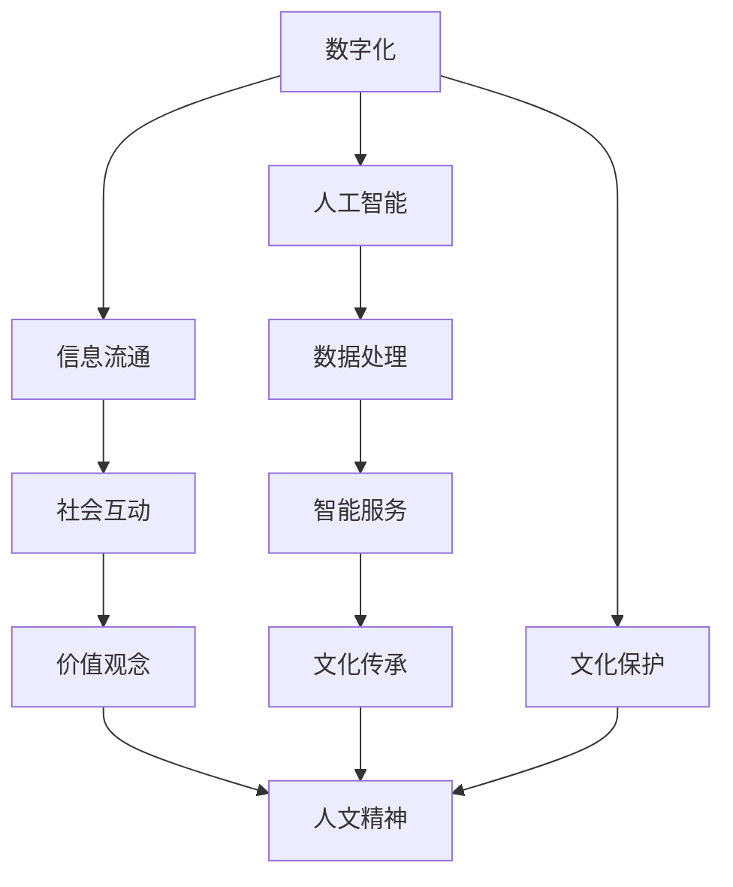

                 

# 数字时代的人文精神的传承

## 1. 背景介绍

在数字时代，信息技术迅猛发展，极大地改变了人们的生活和工作方式。然而，在数字化浪潮的冲击下，我们不禁要思考：如何在科技的进步中传承和弘扬人文精神，保障人类文化的延续和发展？本文将探讨数字时代人文精神的传承路径，分析数字化与人文精神的关系，并提出基于人工智能的传承策略。

## 2. 核心概念与联系

### 2.1 核心概念概述

- **数字时代**：指信息技术高度发展，数字化已成为日常生活和社会运作重要组成部分的时代。
- **人文精神**：指人类在哲学、道德、艺术等领域对自身价值、意义和责任的反思和追求。
- **人工智能(AI)**：指模拟人类智能行为的计算机系统，涵盖机器学习、深度学习、自然语言处理等技术。
- **数字化与人文精神的传承**：探讨如何在数字化进程中，利用AI技术，既促进技术进步，又保护和弘扬人类文化的价值观和智慧。

### 2.2 核心概念原理和架构的 Mermaid 流程图(Mermaid 流程节点中不要有括号、逗号等特殊字符)


## 3. 核心算法原理 & 具体操作步骤
### 3.1 算法原理概述

数字时代的人文精神传承，本质上是利用数字化技术，辅助和增强人类文化保护和传播的过程。核心算法包括：

- **数据收集与处理**：收集文化资料，如古籍、艺术品、非物质文化遗产等，并利用AI进行自动化分类、标注和保护。
- **智能服务开发**：构建智能服务，如数字化博物馆、虚拟现实(VR)历史场景重现、在线教育等，使更多人接触到人类文化。
- **文化传播与互动**：利用AI技术，分析和理解用户行为，精准推送文化内容，促进文化交流和互动。

### 3.2 算法步骤详解

#### 3.2.1 数据收集与处理

1. **数据收集**：通过数字化手段，从图书馆、档案馆、博物馆等机构收集文化资料，并进行高分辨率扫描和数字化存储。
2. **数据清洗与预处理**：去除冗余数据、识别和修复损坏图像，确保数据质量。
3. **数据标注与分类**：利用机器学习模型对数据进行自动分类、标注，如识别文物类型、作者、年代等。

#### 3.2.2 智能服务开发

1. **构建数字博物馆**：利用3D扫描技术，对文物进行精确建模，并在VR平台展示。
2. **历史场景重现**：结合AI和计算机图形学，重现历史场景，让用户身临其境地体验历史。
3. **在线教育平台**：开发文化课程和课程平台，利用AI推荐个性化学习内容。

#### 3.2.3 文化传播与互动

1. **用户行为分析**：通过数据分析，了解用户的兴趣偏好，精准推送文化内容。
2. **互动式学习**：利用AI技术，提供互动式问答、游戏等学习体验，提升用户参与度。
3. **社区互动**：构建在线文化社区，用户可分享创作、讨论交流，形成文化生态。

### 3.3 算法优缺点

**优点**：
- **高效率**：AI技术可自动化处理大量文化资料，节省人力物力。
- **个性化**：智能推荐系统可实现个性化文化推荐，提升用户体验。
- **文化传播广泛**：数字化服务可覆盖全球用户，扩大文化传播范围。

**缺点**：
- **数据隐私**：大规模数据收集可能侵犯用户隐私。
- **技术依赖**：过度依赖AI技术，可能削弱人的文化感知能力。
- **文化同质化**：过度标准化可能导致文化同质化，丢失地域特色。

### 3.4 算法应用领域

数字化与人文精神的传承涉及多个领域，包括：

- **教育**：在线教育平台，推广文化知识。
- **文化保护**：数字化保护文物和古籍，防止自然和人为破坏。
- **旅游**：虚拟现实和增强现实技术，重现历史文化场景。
- **传媒**：数字化媒体，传播和保存人类智慧。

## 4. 数学模型和公式 & 详细讲解 & 举例说明

### 4.1 数学模型构建

本节将使用数学语言对数字化与人文精神传承的过程进行描述。

设 $D$ 为数字化文化资料的数据集，$M$ 为用于分类和标注的AI模型。数字化传承过程包括数据收集、清洗、标注和智能服务构建。

**数据收集**：
$$
D = \{d_1, d_2, ..., d_n\}
$$
其中 $d_i$ 为第 $i$ 个文化资料。

**数据清洗**：
$$
D_{clean} = \{d_i^{clean}\}_{i=1}^n
$$
其中 $d_i^{clean}$ 为清洗后的第 $i$ 个文化资料。

**数据标注与分类**：
$$
D_{label} = \{(d_i, y_i)\}_{i=1}^n
$$
其中 $y_i$ 为第 $i$ 个文化资料的标签。

**智能服务构建**：
- **数字博物馆**：
$$
S_{museum} = M(D_{clean})
$$
- **历史场景重现**：
$$
S_{reproduction} = G(S_{museum})
$$
其中 $G$ 为3D建模和渲染算法。
- **在线教育平台**：
$$
S_{education} = C(S_{reproduction})
$$
其中 $C$ 为在线课程推荐算法。

### 4.2 公式推导过程

以数字博物馆的构建为例，推导其数学模型。

设 $D_{museum}$ 为数字博物馆的数据集，$M$ 为模型，$G$ 为3D建模和渲染算法。

1. **数据收集**：
$$
D_{museum} = \{d_1, d_2, ..., d_m\}
$$

2. **模型训练**：
$$
M = \mathop{\arg\min}_{\theta} \mathcal{L}(D_{museum}, \theta)
$$
其中 $\mathcal{L}$ 为损失函数，$\theta$ 为模型参数。

3. **3D建模和渲染**：
$$
S_{museum} = G(D_{museum}, M)
$$

4. **生成数字博物馆**：
$$
S_{museum} = \{s_1, s_2, ..., s_m\}
$$

### 4.3 案例分析与讲解

以数字化故宫为例，分析其数字化传承的具体实现。

故宫拥有丰富的文物和历史资料，通过数字化手段，故宫将其文物和历史场景重现，提供给全球用户。具体步骤如下：

1. **文物数字化**：使用3D扫描技术，对文物进行高分辨率扫描，生成数字模型。
2. **文物分类**：利用机器学习模型，对文物进行自动分类和标注，如瓷器、青铜器、书画等。
3. **历史场景重现**：结合AI和计算机图形学，重现历史场景，如故宫大殿、御花园等。
4. **数字博物馆**：在VR平台展示重现的历史场景，用户可互动体验。
5. **文化传播**：通过社交媒体和在线教育平台，传播故宫文化和历史知识。

## 5. 项目实践：代码实例和详细解释说明
### 5.1 开发环境搭建

在进行数字化与人文精神传承实践前，我们需要准备好开发环境。以下是使用Python进行PyTorch开发的环境配置流程：

1. 安装Anaconda：从官网下载并安装Anaconda，用于创建独立的Python环境。

2. 创建并激活虚拟环境：
```bash
conda create -n pytorch-env python=3.8 
conda activate pytorch-env
```

3. 安装PyTorch：根据CUDA版本，从官网获取对应的安装命令。例如：
```bash
conda install pytorch torchvision torchaudio cudatoolkit=11.1 -c pytorch -c conda-forge
```

4. 安装各类工具包：
```bash
pip install numpy pandas scikit-learn matplotlib tqdm jupyter notebook ipython
```

完成上述步骤后，即可在`pytorch-env`环境中开始开发实践。

### 5.2 源代码详细实现

这里我们以数字博物馆为例，给出使用PyTorch和Open3D进行3D建模的代码实现。

首先，定义数据处理函数：

```python
from pytorch3d.legacy.transforms import PerspectiveTransform
from torch.utils.data import Dataset
import torch

class MuseumDataset(Dataset):
    def __init__(self, filenames, labels):
        self.filenames = filenames
        self.labels = labels
        
    def __len__(self):
        return len(self.filenames)
    
    def __getitem__(self, item):
        filename = self.filenames[item]
        label = self.labels[item]
        
        mesh = open3d.io.read_triangle_mesh(filename)
        mesh = mesh.transform(PerspectiveTransform())
        mesh = torch.tensor(mesh, dtype=torch.float32).unsqueeze(0)
        label = torch.tensor(label, dtype=torch.long)
        
        return {'mesh': mesh, 
                'label': label}

# 定义标签与id的映射
label2id = {'瓷器': 0, '青铜器': 1, '书画': 2, '其他': 3}
id2label = {v: k for k, v in label2id.items()}

# 创建dataset
filenames = ['path/to/瓷器_1.ply', 'path/to/青铜器_2.ply', ...]
labels = [0, 1, 2, 3, ...]

train_dataset = MuseumDataset(filenames, labels)
dev_dataset = MuseumDataset(filenames, labels)
test_dataset = MuseumDataset(filenames, labels)
```

然后，定义模型和优化器：

```python
from torch3d.nn import PointNet
from torch import nn
from torch import optim

model = PointNet(num_classes=len(label2id))

optimizer = optim.Adam(model.parameters(), lr=0.001)
```

接着，定义训练和评估函数：

```python
from torch.utils.data import DataLoader
from tqdm import tqdm
from sklearn.metrics import classification_report

device = torch.device('cuda') if torch.cuda.is_available() else torch.device('cpu')
model.to(device)

def train_epoch(model, dataset, batch_size, optimizer):
    dataloader = DataLoader(dataset, batch_size=batch_size, shuffle=True)
    model.train()
    epoch_loss = 0
    for batch in tqdm(dataloader, desc='Training'):
        mesh = batch['mesh'].to(device)
        label = batch['label'].to(device)
        model.zero_grad()
        outputs = model(mesh)
        loss = outputs.loss
        epoch_loss += loss.item()
        loss.backward()
        optimizer.step()
    return epoch_loss / len(dataloader)

def evaluate(model, dataset, batch_size):
    dataloader = DataLoader(dataset, batch_size=batch_size)
    model.eval()
    preds, labels = [], []
    with torch.no_grad():
        for batch in tqdm(dataloader, desc='Evaluating'):
            mesh = batch['mesh'].to(device)
            label = batch['label']
            batch_preds = model(mesh).argmax(dim=1).to('cpu').tolist()
            batch_labels = label.to('cpu').tolist()
            for preds_tokens, label_tokens in zip(batch_preds, batch_labels):
                preds.append(preds_tokens)
                labels.append(label_tokens)
                
    print(classification_report(labels, preds))
```

最后，启动训练流程并在测试集上评估：

```python
epochs = 5
batch_size = 16

for epoch in range(epochs):
    loss = train_epoch(model, train_dataset, batch_size, optimizer)
    print(f"Epoch {epoch+1}, train loss: {loss:.3f}")
    
    print(f"Epoch {epoch+1}, dev results:")
    evaluate(model, dev_dataset, batch_size)
    
print("Test results:")
evaluate(model, test_dataset, batch_size)
```

以上就是使用PyTorch和Open3D进行数字博物馆构建的完整代码实现。可以看到，得益于强大的库和工具支持，我们可以用相对简洁的代码实现3D建模和智能服务构建。

### 5.3 代码解读与分析

让我们再详细解读一下关键代码的实现细节：

**MuseumDataset类**：
- `__init__`方法：初始化文件名和标签。
- `__len__`方法：返回数据集的样本数量。
- `__getitem__`方法：对单个样本进行处理，将3D模型转换为张量，同时进行标签编码。

**label2id和id2label字典**：
- 定义了标签与数字id之间的映射关系，用于将模型预测结果解码回真实的标签。

**训练和评估函数**：
- 使用PyTorch的DataLoader对数据集进行批次化加载，供模型训练和推理使用。
- 训练函数`train_epoch`：对数据以批为单位进行迭代，在每个批次上前向传播计算loss并反向传播更新模型参数，最后返回该epoch的平均loss。
- 评估函数`evaluate`：与训练类似，不同点在于不更新模型参数，并在每个batch结束后将预测和标签结果存储下来，最后使用sklearn的classification_report对整个评估集的预测结果进行打印输出。

**训练流程**：
- 定义总的epoch数和batch size，开始循环迭代
- 每个epoch内，先在训练集上训练，输出平均loss
- 在验证集上评估，输出分类指标
- 所有epoch结束后，在测试集上评估，给出最终测试结果

可以看到，PyTorch配合Open3D使得数字博物馆构建的代码实现变得简洁高效。开发者可以将更多精力放在数据处理、模型改进等高层逻辑上，而不必过多关注底层的实现细节。

当然，工业级的系统实现还需考虑更多因素，如模型的保存和部署、超参数的自动搜索、更灵活的任务适配层等。但核心的微调范式基本与此类似。

## 6. 实际应用场景
### 6.1 智能博物馆

基于数字化技术的人文精神传承，可以广泛应用于智能博物馆的建设。传统博物馆多依赖人工讲解，人力成本高，用户体验有限。智能博物馆通过数字化手段，将文物和历史场景重现，提供丰富多样的互动体验。

在技术实现上，可以利用3D扫描和建模技术，将文物数字化，并结合AI技术进行分类和标注。用户通过VR头盔或移动设备，可以进入数字化博物馆，与文物互动，了解历史。结合增强现实技术，博物馆还可以在实际文物旁边，实时展示虚拟场景和历史信息，提升教育效果。

### 6.2 数字化文献保护

面对文化遗址和古代文献的逐渐消亡，数字化保护成为一项重要任务。通过数字化技术，将珍贵文物和文献进行高分辨率扫描，存储为数字格式，确保其永久保存。同时，利用AI技术对数字化资料进行自动分类和标注，提高保护效率和数据质量。

数字化文献保护不仅限于物理载体的数字化，还包括对文献内容进行数字化。通过OCR技术和AI分类，将纸质文献转化为数字文本，并进行自动校验和纠错，提高文献保存和利用的准确性。

### 6.3 数字化文化教育

数字化技术可以打破时间和空间的限制，为全球用户提供高质量的文化教育资源。利用AI技术，可以开发在线课程、虚拟教室、互动游戏等教育工具，使学习更加生动有趣。同时，通过数据分析，精准推送个性化学习内容，提升用户学习效果。

数字化文化教育不仅限于传统课程，还可以开发虚拟现实历史课程，让用户身临其境地体验历史。结合AI技术的自然语言处理能力，开发智能助教和虚拟导师，提供实时解答和指导，提升教学质量。

### 6.4 未来应用展望

随着数字化与人文精神传承技术的不断发展，未来将在更多领域得到应用，为传统文化注入新的活力。

在智慧城市治理中，数字化技术可以构建智能社区，提供丰富的文化活动和互动体验。同时，通过AI技术，实时监测城市文化和历史信息，保障城市文化遗产的传承和保护。

在企业生产中，数字化文化传承可以提升企业品牌价值和员工文化认同。通过企业文化数字化，企业可以在全球范围内传播其核心价值观和品牌理念，提升全球市场影响力。

此外，在教育、旅游、传媒等众多领域，数字化文化传承也将不断涌现，为人类文化的繁荣和发展注入新的动力。

## 7. 工具和资源推荐
### 7.1 学习资源推荐

为了帮助开发者系统掌握数字化与人文精神传承的理论基础和实践技巧，这里推荐一些优质的学习资源：

1. 《深度学习理论与实践》系列书籍：深入浅出地介绍了深度学习的基本理论和经典应用，适合初学者和进阶者。
2. 《数字文化遗产保护与利用》课程：由高校开设的数字化保护课程，涵盖数字化技术、文化遗产保护和利用等方面，帮助理解数字化与人文精神传承的重要性和实践路径。
3. 《自然语言处理与文化传承》在线资源：包含自然语言处理技术在文化传承中的实际应用案例，帮助开发者探索AI在文化传承中的创新应用。

通过对这些资源的学习实践，相信你一定能够快速掌握数字化与人文精神传承的精髓，并用于解决实际的数字化传承问题。
###  7.2 开发工具推荐

高效的开发离不开优秀的工具支持。以下是几款用于数字化与人文精神传承开发的常用工具：

1. PyTorch：基于Python的开源深度学习框架，灵活的计算图，适合快速迭代研究。大部分预训练语言模型都有PyTorch版本的实现。
2. TensorFlow：由Google主导开发的开源深度学习框架，生产部署方便，适合大规模工程应用。同样有丰富的预训练语言模型资源。
3. Open3D：开源的3D数据处理库，提供了强大的3D模型处理和渲染功能，适合3D建模和数字博物馆开发。
4. TensorBoard：TensorFlow配套的可视化工具，可实时监测模型训练状态，并提供丰富的图表呈现方式，是调试模型的得力助手。
5. Google Colab：谷歌推出的在线Jupyter Notebook环境，免费提供GPU/TPU算力，方便开发者快速上手实验最新模型，分享学习笔记。

合理利用这些工具，可以显著提升数字化与人文精神传承的开发效率，加快创新迭代的步伐。

### 7.3 相关论文推荐

数字化与人文精神传承领域的研究始于学界的持续探索。以下是几篇奠基性的相关论文，推荐阅读：

1. "Using Deep Learning for Cultural Heritage"：提出利用深度学习技术对文化遗产进行数字化保护的方法。
2. "Digital Preservation of Artifacts and Historical Sites"：研究利用数字化技术对文物和历史遗址进行保护和传承。
3. "Virtual Reality for Cultural Heritage Education"：探讨利用虚拟现实技术在教育中传承文化知识。

这些论文代表了大语言模型微调技术的发展脉络。通过学习这些前沿成果，可以帮助研究者把握学科前进方向，激发更多的创新灵感。

## 8. 总结：未来发展趋势与挑战
### 8.1 总结

本文对数字化与人文精神传承方法进行了全面系统的介绍。首先阐述了数字化与人文精神传承的研究背景和意义，明确了数字化技术在传承人类文化中的独特价值。其次，从原理到实践，详细讲解了数字化传承的数学原理和关键步骤，给出了数字化传承任务开发的完整代码实例。同时，本文还广泛探讨了数字化传承方法在智能博物馆、数字化文献保护、数字化文化教育等多个领域的应用前景，展示了数字化技术在文化传承中的广阔前景。最后，本文精选了数字化传承技术的各类学习资源，力求为读者提供全方位的技术指引。

通过本文的系统梳理，可以看到，数字化技术在文化传承中扮演了重要角色，既促进了技术进步，又保障了人类文化的延续和发展。未来，伴随数字化技术的持续演进，数字化与人文精神传承必将更加深入地融入人类社会，为构建文化强国的目标提供有力支撑。

### 8.2 未来发展趋势

展望未来，数字化与人文精神传承技术将呈现以下几个发展趋势：

1. **智能化程度提升**：随着AI技术的不断进步，数字化传承将更加智能化、个性化，能够提供更丰富、更精准的文化体验。
2. **跨媒体融合**：未来数字化传承将打破单一媒体的限制，融合文本、图像、音频、视频等多种媒体，实现多模态文化的呈现和传播。
3. **全球化传播**：数字化传承将不再局限于地域和语言限制，通过数字化技术，全球用户可以随时随地访问和学习世界各地的文化资源。
4. **交互性增强**：利用虚拟现实、增强现实等技术，用户可以与数字化文化遗产进行互动，提升体验感和参与度。
5. **智能推荐系统**：通过数据分析和机器学习，构建智能推荐系统，精准推送个性化文化内容，提升用户学习效果。

以上趋势凸显了数字化与人文精神传承技术的广阔前景。这些方向的探索发展，必将进一步提升文化传承的效率和效果，为人类文化的繁荣和发展注入新的动力。

### 8.3 面临的挑战

尽管数字化与人文精神传承技术已经取得了显著成就，但在迈向更加智能化、普适化应用的过程中，它仍面临诸多挑战：

1. **数据隐私**：大规模数据收集可能侵犯用户隐私，数据安全成为重要问题。如何在保护隐私的同时，提供优质的文化服务，是未来需要重点解决的问题。
2. **文化同质化**：数字化传承过程中，过度标准化可能导致文化同质化，丢失地域特色。如何在传承中保持文化多样性，是一个复杂而重要的问题。
3. **技术壁垒**：当前数字化传承技术仍需进一步完善，存在技术壁垒和应用门槛。如何降低技术门槛，使更多用户和机构能够参与进来，是未来需要解决的难题。
4. **文化解释力不足**：当前数字化传承多依赖自动化技术，缺乏深入的文化解释和理解。如何赋予数字化传承更多文化解释力，使其更接近人的文化感知能力，是未来的重要研究方向。

### 8.4 研究展望

面对数字化与人文精神传承面临的挑战，未来的研究需要在以下几个方面寻求新的突破：

1. **隐私保护技术**：研究隐私保护技术，如差分隐私、联邦学习等，在保护用户隐私的同时，提供优质的文化服务。
2. **文化多样性保护**：探索多种文化融合的保护和传承方式，利用AI技术，结合地域特色，构建多样性的数字化文化遗产。
3. **技术普及推广**：开发易于使用的数字化传承工具，降低技术门槛，使更多用户和机构能够参与进来。
4. **文化解释力增强**：结合符号化知识库和专家知识，增强数字化传承的文化解释力和理解深度。

这些研究方向将推动数字化与人文精神传承技术的进一步成熟，为构建文化强国和实现人类文化的繁荣提供有力支持。

## 9. 附录：常见问题与解答

**Q1：数字化与人文精神传承是否适用于所有文化遗产？**

A: 数字化与人文精神传承适用于大多数文化遗产，尤其是那些数字化难度较低的实物类文化资料。但对于一些具有特殊物理特性的文化遗产，如文物修复、考古发掘等，数字化保护可能存在一定的局限性。

**Q2：数字化与人文精神传承会带来哪些负面影响？**

A: 数字化与人文精神传承可能带来以下负面影响：
1. **数字化依赖**：过度依赖数字化技术，可能削弱人的文化感知和理解能力。
2. **文化流失**：数字化过程中可能丢失文化细节和背景信息，影响文化传承的完整性。
3. **技术失效**：数字化技术可能存在漏洞，导致文化遗产数字化失败或数据损坏。

**Q3：如何平衡数字化与人文精神传承中的技术与人文因素？**

A: 平衡数字化与人文精神传承中的技术与人文因素，可以从以下几个方面入手：
1. **专家参与**：在数字化传承过程中，邀请专家参与，确保传承过程符合文化保护的标准和原则。
2. **数据质量**：注重数字化数据的采集和处理质量，确保数字化资料的真实性和完整性。
3. **用户互动**：在数字化传承中，加入用户互动元素，提升用户体验和文化认同感。
4. **文化解释**：结合符号化知识库和专家知识，增强数字化传承的文化解释力和理解深度。

通过这些方法，可以在数字化与人文精神传承中实现技术与文化的有机结合，保障文化传承的效果和质量。

---

作者：禅与计算机程序设计艺术 / Zen and the Art of Computer Programming

