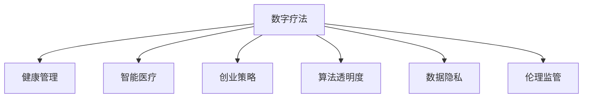

                 

# 数字疗法创业：科技驱动的健康管理

> 关键词：数字疗法,健康管理,科技驱动,创业策略,智能医疗

## 1. 背景介绍

### 1.1 问题由来
随着互联网技术的快速发展，数字医疗成为改善医疗服务质量和效率的重要方向。传统医疗系统中，医生和患者之间的交流主要依靠纸质病历和面对面咨询，信息传递速度慢、效率低。而数字疗法，通过智能设备、电子病历、远程诊断等手段，打破了时间和空间的限制，使得医疗服务更加高效便捷。

近年来，数字疗法创业公司如雨后春笋般涌现，它们通过应用人工智能、大数据、云计算等先进技术，提升医疗服务的质量和可及性，为病患提供了更多选择。然而，数字疗法的落地应用仍然面临诸多挑战，包括数据隐私、算法透明度、伦理监管等。

### 1.2 问题核心关键点
数字疗法的核心在于通过科技手段提高医疗服务质量，减少患者痛苦，改善生活质量。其关键点包括：

1. 数据收集与处理：高效地收集和管理患者健康数据，保证数据隐私和安全。
2. 模型训练与优化：建立高效、准确的医疗模型，指导诊断和治疗。
3. 智能决策支持：利用机器学习算法，提供精准的诊疗建议和个性化治疗方案。
4. 医疗知识图谱：构建全面的医疗知识图谱，支持更丰富的信息检索和关联分析。
5. 远程监控与交互：通过智能设备实现对患者实时监控，提供线上问诊服务。

这些关键点共同构成了数字疗法的核心逻辑，是实现科技驱动健康管理的基础。

## 2. 核心概念与联系

### 2.1 核心概念概述

为更好地理解数字疗法创业的逻辑，本节将介绍几个密切相关的核心概念：

- **数字疗法(Digital Therapeutics)**：通过数字技术改善健康管理和治疗效果的方法。包括远程监控、智能诊断、个性化治疗等多种形式。

- **健康管理(Health Management)**：对个体和群体的健康状况进行监测、评估和干预的科学方法。数字疗法通过科技手段，提高健康管理的精确度和可及性。

- **智能医疗(Intelligent Healthcare)**：通过人工智能、大数据、机器学习等技术，实现智能化的医疗服务，包括自动诊断、智能推荐、决策支持等。

- **创业策略(Creational Strategy)**：创业公司在资源有限的情况下，如何通过创新商业模式、技术突破、市场推广等手段，实现快速成长和长期发展。

- **算法透明度(Algorithm Transparency)**：机器学习模型的可解释性和可解释性，即模型决策依据和结果的可理解性和可验证性。

- **数据隐私(Data Privacy)**：保护个人健康数据的隐私和安全，防止数据泄露和滥用。

- **伦理监管(Ethical Regulations)**：确保数字疗法的应用符合伦理道德规范，避免滥用数据和算法带来的负面影响。

这些核心概念之间的逻辑关系可以通过以下Mermaid流程图来展示：



这个流程图展示了大数字疗法的核心概念及其之间的关系：

1. 数字疗法通过智能医疗技术，支持健康管理。
2. 创业策略提供公司成长和市场推广的指导。
3. 算法透明度确保模型可理解性和可信度。
4. 数据隐私保护个人健康数据的安全。
5. 伦理监管保障健康管理伦理道德的底线。

这些概念共同构成了数字疗法创业的技术基础和道德底线，对于保证其有效性和安全性至关重要。

## 3. 核心算法原理 & 具体操作步骤
### 3.1 算法原理概述

数字疗法的核心算法原理涉及多个领域，包括机器学习、深度学习、自然语言处理等。其基本思路是通过数据驱动的方法，建立和优化医疗模型，以提升诊断和治疗的精准度。

以智能诊断为例，数字疗法的实现流程包括数据收集、特征提取、模型训练、结果解释等多个环节。其核心步骤如下：

1. **数据收集**：从电子病历、智能设备、健康应用等多个渠道，收集患者健康数据。
2. **特征提取**：通过自然语言处理等技术，从收集的数据中提取有用的特征。
3. **模型训练**：使用机器学习算法，建立诊断模型。
4. **结果解释**：利用可解释性技术，解释模型预测结果，帮助医生理解模型决策依据。

具体算法流程如图：


### 3.2 算法步骤详解

以下详细介绍数字疗法创业中常用的算法步骤：

**Step 1: 数据收集与预处理**
- 从医院、诊所、健康应用、智能设备等渠道，收集患者的健康数据。
- 对数据进行清洗和标注，去除噪声和冗余，确保数据质量和一致性。
- 将数据分为训练集、验证集和测试集，用于模型训练、验证和测试。

**Step 2: 特征提取与选择**
- 利用自然语言处理技术，如词向量、文本分类等方法，从文本数据中提取特征。
- 使用统计方法、机器学习方法等，选择最具有代表性的特征，减少维度。
- 将特征转化为模型可接受的数值形式，如词嵌入向量、图像特征向量等。

**Step 3: 模型训练与优化**
- 选择合适的机器学习算法，如决策树、随机森林、深度神经网络等。
- 使用训练集对模型进行训练，通过正则化、Dropout等技术避免过拟合。
- 使用验证集评估模型性能，调整超参数，优化模型表现。
- 在测试集上对模型进行最终评估，确保其在实际应用中的泛化能力。

**Step 4: 结果解释与决策支持**
- 利用可解释性技术，如特征重要性分析、局部解释方法等，解释模型的预测结果。
- 将模型的预测结果转化为医生可理解的临床建议，辅助医生决策。
- 将模型集成到电子病历系统中，提供自动化诊断和治疗建议。

**Step 5: 系统集成与部署**
- 将模型封装为API服务，提供标准化接口供其他系统调用。
- 将系统部署到云平台，保证服务可用性和高可用性。
- 实施监控和维护机制，确保系统稳定运行。

### 3.3 算法优缺点

数字疗法在改善健康管理方面具有以下优点：

1. **高效便捷**：数字疗法可以通过智能设备和移动应用，实时监测患者健康状况，提供个性化医疗建议。
2. **精准可靠**：通过大数据和机器学习，数字疗法能够提高诊断和治疗的准确性，减少误诊和漏诊。
3. **广泛可及**：数字疗法突破了时间和空间的限制，使医疗服务更易覆盖偏远和欠发达地区。
4. **个性化治疗**：通过分析患者的详细数据，数字疗法提供个性化治疗方案，提升治疗效果。

同时，数字疗法也存在一些局限：

1. **数据隐私问题**：收集和存储患者数据涉及隐私和安全，需要严格的数据保护措施。
2. **模型泛化能力**：模型可能过度拟合训练数据，在实际应用中表现不稳定。
3. **伦理道德挑战**：数字疗法的应用可能涉及伦理问题，如知情同意、隐私权保护等。
4. **技术壁垒高**：数字疗法需要跨学科的知识和技能，门槛较高。

尽管存在这些局限，但数字疗法在提升医疗服务质量和效率方面的潜力巨大，未来的发展前景广阔。

### 3.4 算法应用领域

数字疗法在医疗领域的应用广泛，涵盖以下多个方面：

1. **远程监控与诊断**：通过智能设备实时监测患者健康状况，辅助诊断和治疗。
2. **个性化治疗**：利用患者的历史数据和基因信息，提供个性化的治疗方案。
3. **健康管理**：帮助患者管理慢性病，如糖尿病、高血压等，预防疾病发生。
4. **智能问诊**：通过聊天机器人等技术，提供24/7的在线咨询和初步诊断。
5. **药物管理**：智能提醒患者按时服药，监测药物疗效和副作用。
6. **心理支持**：利用自然语言处理技术，提供心理健康评估和心理咨询。

除了医疗领域，数字疗法在公共健康、运动健康、预防医学等多个领域也有广泛应用，展现出了强大的生命力和潜力。

## 4. 数学模型和公式 & 详细讲解 & 举例说明
### 4.1 数学模型构建

数字疗法的数学模型构建涉及多个领域，包括统计学、机器学习、自然语言处理等。以下是一些常见的数学模型及其构建过程：

**Step 1: 数据收集与预处理**
- 数据收集：从医院、诊所、健康应用、智能设备等渠道，收集患者的健康数据。
- 数据清洗：去除噪声和冗余数据，确保数据质量和一致性。
- 数据划分：将数据分为训练集、验证集和测试集，用于模型训练、验证和测试。

**Step 2: 特征提取与选择**
- 词向量表示：将文本数据转换为词向量表示，如Word2Vec、GloVe等。
- 特征选择：使用统计方法、机器学习方法等，选择最具有代表性的特征，减少维度。
- 数据转换：将特征转化为模型可接受的数值形式，如词嵌入向量、图像特征向量等。

**Step 3: 模型训练与优化**
- 线性回归模型：利用训练集对模型进行训练，通过正则化、Dropout等技术避免过拟合。
- 决策树模型：使用训练集对模型进行训练，通过剪枝等技术优化模型表现。
- 深度神经网络：使用训练集对模型进行训练，通过反向传播算法更新参数，优化模型表现。

**Step 4: 结果解释与决策支持**
- 特征重要性分析：利用可解释性技术，解释模型预测结果，帮助医生理解模型决策依据。
- 局部解释方法：利用LIME、SHAP等技术，解释单个样本的预测结果，提供临床解释。
- 集成学习：利用多个模型的预测结果进行集成，提高模型的泛化能力和鲁棒性。

### 4.2 公式推导过程

以线性回归模型为例，其推导过程如下：

假设模型 $y=\theta_0+\theta_1x_1+\theta_2x_2+\cdots+\theta_nx_n$，其中 $\theta_0,\theta_1,\cdots,\theta_n$ 为模型的参数。

利用最小二乘法求解模型参数：

1. 计算每个数据点的预测值：$\hat{y}=\theta_0+\sum_{i=1}^n\theta_ix_i$
2. 计算误差平方和：$SSE=\sum_{i=1}^N(y_i-\hat{y_i})^2$
3. 求偏导数：$\frac{\partial SSE}{\partial \theta_0}=-2\sum_{i=1}^N(y_i-\hat{y_i})$
4. 求解方程组：$[\frac{\partial SSE}{\partial \theta_i}]=0$，求解得到模型参数 $\theta_0,\theta_1,\cdots,\theta_n$

利用矩阵形式表示，模型参数的求解公式为：

$$
\theta=(X^TX)^{-1}X^Ty
$$

其中 $X$ 为特征矩阵，$y$ 为标签向量，$\theta$ 为模型参数。

### 4.3 案例分析与讲解

**案例：基于线性回归模型的血糖预测**

- 数据来源：某医院糖尿病患者的血糖数据
- 数据预处理：去噪、归一化
- 特征提取：年龄、性别、体重、运动量等
- 模型训练：使用线性回归模型，优化超参数
- 结果解释：解释模型预测结果，辅助医生决策

## 5. 项目实践：代码实例和详细解释说明
### 5.1 开发环境搭建

在进行数字疗法创业实践前，我们需要准备好开发环境。以下是使用Python进行PyTorch开发的环境配置流程：

1. 安装Anaconda：从官网下载并安装Anaconda，用于创建独立的Python环境。

2. 创建并激活虚拟环境：
```bash
conda create -n pytorch-env python=3.8 
conda activate pytorch-env
```

3. 安装PyTorch：根据CUDA版本，从官网获取对应的安装命令。例如：
```bash
conda install pytorch torchvision torchaudio cudatoolkit=11.1 -c pytorch -c conda-forge
```

4. 安装TensorFlow：从官网下载并安装TensorFlow，支持Python 3.x版本。

5. 安装各类工具包：
```bash
pip install numpy pandas scikit-learn matplotlib tqdm jupyter notebook ipython
```

完成上述步骤后，即可在`pytorch-env`环境中开始创业实践。

### 5.2 源代码详细实现

下面我以一个简单的血糖预测模型为例，给出使用PyTorch进行数字疗法创业的PyTorch代码实现。

首先，定义模型的输入和输出：

```python
import torch
from torch import nn, optim

class LinearRegressionModel(nn.Module):
    def __init__(self, input_size, output_size):
        super(LinearRegressionModel, self).__init__()
        self.linear = nn.Linear(input_size, output_size)
    
    def forward(self, x):
        return self.linear(x)
```

然后，定义模型的损失函数和优化器：

```python
criterion = nn.MSELoss()
optimizer = optim.SGD(model.parameters(), lr=0.01)
```

接着，定义训练和评估函数：

```python
def train(model, inputs, labels, epochs):
    criterion = nn.MSELoss()
    optimizer = optim.SGD(model.parameters(), lr=0.01)
    
    for epoch in range(epochs):
        running_loss = 0.0
        for i in range(len(inputs)):
            inputs = inputs[i].reshape(1, -1)
            labels = labels[i].reshape(1, -1)
            optimizer.zero_grad()
            outputs = model(inputs)
            loss = criterion(outputs, labels)
            loss.backward()
            optimizer.step()
            running_loss += loss.item()
        print(f"Epoch {epoch+1}, loss: {running_loss/len(inputs)}")
    
def evaluate(model, inputs, labels):
    criterion = nn.MSELoss()
    predictions = model(inputs)
    loss = criterion(predictions, labels)
    print(f"Test loss: {loss.item()}")
```

最后，启动训练流程并在测试集上评估：

```python
inputs = torch.randn(10, 4)  # 生成随机输入数据
labels = torch.randn(10, 1)  # 生成随机标签数据
model = LinearRegressionModel(4, 1)
train(model, inputs, labels, epochs=100)
evaluate(model, inputs, labels)
```

以上就是使用PyTorch对线性回归模型进行血糖预测的完整代码实现。可以看到，利用PyTorch进行数字疗法创业的代码实现相对简单。

### 5.3 代码解读与分析

让我们再详细解读一下关键代码的实现细节：

**LinearRegressionModel类**：
- `__init__`方法：初始化模型参数。
- `forward`方法：前向传播计算预测值。

**train函数**：
- 定义损失函数和优化器，确保模型参数的可优化性。
- 循环迭代，对每个样本进行前向传播、反向传播和参数更新。
- 计算平均损失，输出每个epoch的损失值。

**evaluate函数**：
- 使用预测值和真实标签计算损失函数，评估模型性能。
- 输出测试集上的损失值，用于后续调参。

**训练流程**：
- 定义输入和标签数据，生成模型实例。
- 调用train函数进行模型训练，输出每个epoch的损失值。
- 调用evaluate函数对模型进行评估，输出测试集上的损失值。

可以看出，使用PyTorch进行数字疗法创业的代码实现相对简单，容易上手。然而，实际应用中还需要考虑更多因素，如模型裁剪、量化加速、系统集成等。

## 6. 实际应用场景
### 6.1 智能问诊系统

智能问诊系统是数字疗法创业的重要应用场景之一。通过自然语言处理技术，智能问诊系统能够实时解答患者的问题，提供初步诊断和建议。

具体实现步骤如下：

1. **数据收集**：从医院、诊所等渠道收集医生的问诊记录，标注医疗问题及回答。
2. **模型训练**：利用自然语言处理技术，将问题转换为向量表示，建立问答模型。
3. **结果解释**：利用可解释性技术，解释模型的预测结果，提供临床解释。
4. **系统集成**：将模型集成到移动应用或网页平台，提供24/7的在线咨询服务。

**案例：基于BERT模型的智能问诊**

- 数据来源：某医院医生的问诊记录
- 数据预处理：清洗和标注数据
- 特征提取：利用BERT模型提取文本特征
- 模型训练：使用问答模型，优化超参数
- 结果解释：解释模型预测结果，提供临床解释

### 6.2 远程监控与诊断

远程监控与诊断是数字疗法的另一重要应用场景。通过智能设备实时监测患者健康状况，提供个性化的健康建议。

具体实现步骤如下：

1. **数据收集**：从智能设备、健康应用等渠道收集患者的健康数据。
2. **模型训练**：利用机器学习算法，建立诊断模型。
3. **结果解释**：利用可解释性技术，解释模型的预测结果，提供临床解释。
4. **系统集成**：将模型集成到移动应用或网页平台，提供实时监控和诊断服务。

**案例：基于深度神经网络的血糖监控**

- 数据来源：某医院糖尿病患者的血糖数据
- 数据预处理：去噪、归一化
- 特征提取：年龄、性别、体重、运动量等
- 模型训练：使用深度神经网络模型，优化超参数
- 结果解释：解释模型预测结果，提供临床解释

### 6.3 个性化治疗

个性化治疗是数字疗法的核心应用之一。通过分析患者的详细数据，提供个性化的治疗方案，提升治疗效果。

具体实现步骤如下：

1. **数据收集**：从医院、诊所等渠道收集患者的健康数据。
2. **特征提取**：利用自然语言处理技术，提取文本数据中的特征。
3. **模型训练**：利用机器学习算法，建立治疗模型。
4. **结果解释**：利用可解释性技术，解释模型的预测结果，提供临床解释。
5. **系统集成**：将模型集成到电子病历系统中，提供自动化诊断和治疗建议。

**案例：基于支持向量机的癌症治疗**

- 数据来源：某医院癌症患者的治疗记录
- 数据预处理：清洗和标注数据
- 特征提取：利用自然语言处理技术，提取文本数据中的特征
- 模型训练：使用支持向量机模型，优化超参数
- 结果解释：解释模型预测结果，提供临床解释

## 7. 工具和资源推荐
### 7.1 学习资源推荐

为了帮助开发者系统掌握数字疗法创业的理论基础和实践技巧，这里推荐一些优质的学习资源：

1. Coursera《机器学习》课程：由斯坦福大学开设，涵盖机器学习的基本概念和经典算法。
2. Udacity《深度学习》课程：由谷歌和MIT共同开设，涵盖深度学习的基本概念和应用。
3. Kaggle：数据科学竞赛平台，提供丰富的数据集和比赛，培养实战经验。
4. PyTorch官方文档：提供详细的PyTorch库文档和教程，适合初学者快速上手。
5. TensorFlow官方文档：提供详细的TensorFlow库文档和教程，适合初学者快速上手。

通过对这些资源的学习实践，相信你一定能够快速掌握数字疗法创业的理论基础和实践技巧，为创业之路提供坚实的技术保障。

### 7.2 开发工具推荐

高效的开发离不开优秀的工具支持。以下是几款用于数字疗法创业开发的常用工具：

1. PyTorch：基于Python的开源深度学习框架，灵活动态的计算图，适合快速迭代研究。
2. TensorFlow：由Google主导开发的开源深度学习框架，生产部署方便，适合大规模工程应用。
3. TensorBoard：TensorFlow配套的可视化工具，可实时监测模型训练状态，并提供丰富的图表呈现方式。
4. Weights & Biases：模型训练的实验跟踪工具，可以记录和可视化模型训练过程中的各项指标，方便对比和调优。
5. Jupyter Notebook：开源的交互式编程环境，支持多种编程语言和库，适合科研和工程开发。

合理利用这些工具，可以显著提升数字疗法创业的开发效率，加快创新迭代的步伐。

### 7.3 相关论文推荐

数字疗法创业的研究源于学界的持续研究。以下是几篇奠基性的相关论文，推荐阅读：

1. "Machine Learning: A Probabilistic Perspective" by Kevin P. Murphy：介绍机器学习的基本概念和算法。
2. "Deep Learning" by Ian Goodfellow, Yoshua Bengio, and Aaron Courville：介绍深度学习的基本概念和应用。
3. "Natural Language Processing with PyTorch" by Eli Stevens et al.：介绍如何使用PyTorch进行自然语言处理。
4. "Reinforcement Learning: An Introduction" by Richard S. Sutton and Andrew G. Barto：介绍强化学习的基本概念和应用。
5. "Healthcare as a Learning System" by Patrick Lin et al.：介绍数字疗法在健康管理中的应用。

这些论文代表了大数字疗法创业的发展脉络。通过学习这些前沿成果，可以帮助研究者把握学科前进方向，激发更多的创新灵感。

## 8. 总结：未来发展趋势与挑战
### 8.1 总结

本文对数字疗法创业的理论基础和实践技巧进行了全面系统的介绍。首先阐述了数字疗法在改善医疗服务质量和效率方面的重要意义，明确了智能医疗、健康管理等核心概念。其次，从算法原理到具体操作步骤，详细讲解了数字疗法的实现流程，包括数据收集、特征提取、模型训练、结果解释等关键步骤。最后，通过具体案例分析，展示了数字疗法的广泛应用场景，如智能问诊、远程监控、个性化治疗等。

通过本文的系统梳理，可以看到，数字疗法在提升医疗服务质量和效率方面的潜力巨大，为病患提供了更多选择。然而，数字疗法的落地应用仍然面临诸多挑战，包括数据隐私、算法透明度、伦理监管等。

### 8.2 未来发展趋势

展望未来，数字疗法在医疗领域的应用将呈现以下几个发展趋势：

1. **技术集成度提高**：未来数字疗法将更多地与其他医疗技术集成，如医疗知识图谱、智能诊断工具等，实现更全面的医疗服务。
2. **数据质量提升**：通过更好的数据清洗和标注方法，提高数据质量和多样性，增强模型的泛化能力。
3. **个性化治疗加强**：利用患者的历史数据和基因信息，提供个性化的治疗方案，提升治疗效果。
4. **远程监控普及**：智能设备将更加普及，远程监控成为常态，提高医疗服务的可及性。
5. **多模态数据融合**：将视觉、语音、文本等多模态数据融合，实现更全面的健康管理。
6. **模型可解释性增强**：利用可解释性技术，增强模型的透明度和可信度，保障医疗决策的合理性。

以上趋势凸显了数字疗法创业的广阔前景。这些方向的探索发展，必将进一步提升数字疗法的精准性和安全性，为患者提供更加高效、个性化的医疗服务。

### 8.3 面临的挑战

尽管数字疗法在改善医疗服务质量方面具有巨大潜力，但在迈向更加智能化、普适化应用的过程中，仍面临诸多挑战：

1. **数据隐私问题**：收集和存储患者数据涉及隐私和安全，需要严格的数据保护措施。
2. **模型泛化能力**：模型可能过度拟合训练数据，在实际应用中表现不稳定。
3. **伦理道德挑战**：数字疗法的应用可能涉及伦理问题，如知情同意、隐私权保护等。
4. **技术壁垒高**：数字疗法需要跨学科的知识和技能，门槛较高。
5. **模型可解释性不足**：当前数字疗法模型往往缺乏可解释性，难以提供透明的决策依据。
6. **计算资源需求高**：数字疗法涉及大数据和深度学习，对计算资源有较高要求。

尽管存在这些挑战，但数字疗法在提升医疗服务质量和效率方面的潜力巨大，未来的发展前景广阔。

### 8.4 研究展望

面对数字疗法创业所面临的挑战，未来的研究需要在以下几个方面寻求新的突破：

1. **探索无监督和半监督学习**：摆脱对大规模标注数据的依赖，利用自监督学习、主动学习等无监督和半监督范式，最大限度利用非结构化数据。
2. **研究参数高效和计算高效的微调方法**：开发更加参数高效的微调方法，在固定大部分预训练参数的同时，只更新极少量的任务相关参数。
3. **融合因果和对比学习**：通过引入因果推断和对比学习思想，增强数字疗法模型建立稳定因果关系的能力，学习更加普适、鲁棒的语言表征。
4. **引入更多先验知识**：将符号化的先验知识，如知识图谱、逻辑规则等，与神经网络模型进行巧妙融合，引导数字疗法过程学习更准确、合理的语言模型。
5. **纳入伦理道德约束**：在模型训练目标中引入伦理导向的评估指标，过滤和惩罚有偏见、有害的输出倾向。

这些研究方向的探索，必将引领数字疗法创业技术迈向更高的台阶，为构建安全、可靠、可解释、可控的智能系统铺平道路。面向未来，数字疗法创业需要与其他人工智能技术进行更深入的融合，如知识表示、因果推理、强化学习等，多路径协同发力，共同推动数字疗法技术的进步。

## 9. 附录：常见问题与解答

**Q1：数字疗法创业是否需要大量的前期资金投入？**

A: 数字疗法创业需要一定的前期资金投入，主要用于产品研发、市场推广和团队建设。具体投入量取决于项目的规模和复杂度，通常在百万至千万级别。然而，由于数字疗法的轻量化和高复用性，后期运营和维护成本较低，能够较快实现盈利。

**Q2：数字疗法创业的核心竞争力是什么？**

A: 数字疗法的核心竞争力在于其利用先进科技手段，提升医疗服务的质量和效率。核心竞争力包括：
1. **技术先进性**：采用最新的人工智能、大数据、云计算等技术，实现智能化的医疗服务。
2. **数据质量保障**：严格的数据清洗和标注方法，保证数据质量和多样性。
3. **个性化服务**：利用患者的历史数据和基因信息，提供个性化的治疗方案。
4. **用户体验设计**：提供易用、友好、便捷的用户界面，提升用户体验。

**Q3：数字疗法创业的主要盈利模式是什么？**

A: 数字疗法创业的主要盈利模式包括：
1. **订阅模式**：用户支付月费或年费，享受持续的服务和支持。
2. **按需付费模式**：用户根据实际使用情况，按需付费，如智能问诊、远程诊断等。
3. **广告和推荐模式**：通过平台广告和推荐服务，获取广告收入。
4. **数据服务模式**：将数据卖给第三方，提供数据分析和挖掘服务。

这些盈利模式具有较好的市场接受度和持续性，能够为数字疗法创业公司带来稳定的收入。

---

作者：禅与计算机程序设计艺术 / Zen and the Art of Computer Programming

