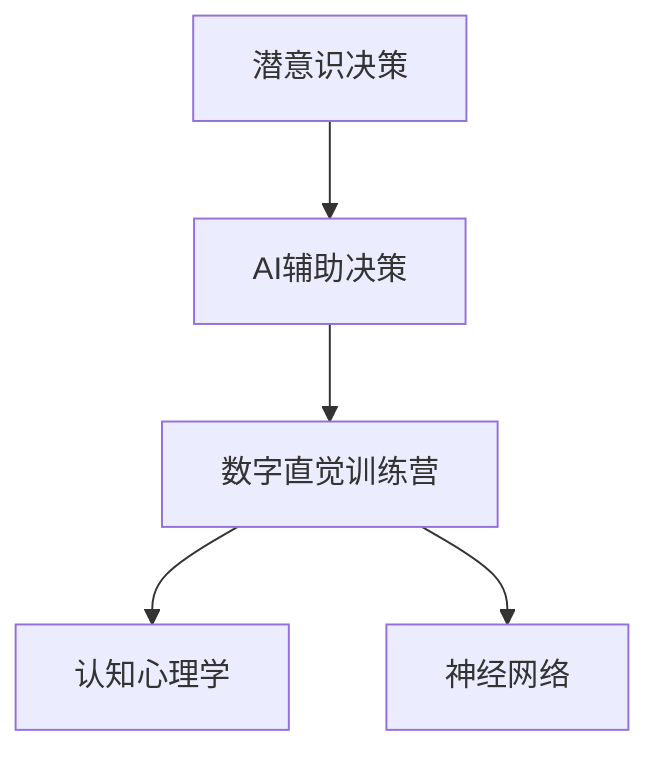

                 

# 数字直觉训练营：AI辅助的潜意识决策强化

> 关键词：潜意识决策, AI强化, 数字直觉, 认知心理学, 神经网络

## 1. 背景介绍

### 1.1 问题由来
在现代信息爆炸的时代，我们每天都面临海量的决策任务，从工作学习到生活娱乐，无不需要我们快速做出判断。然而，尽管我们的思维能力在不断进步，但在复杂多变的环境中，人类的认知资源仍然难以满足决策需求。这一问题催生了对人机协同决策、AI辅助决策的新需求，数字直觉训练营（Digital Intuition Workshops）应运而生。

### 1.2 问题核心关键点
数字直觉训练营的核心目标是通过AI技术辅助，提升人类潜意识决策能力。具体而言：

- **决策效率**：利用AI进行数据筛选、模式识别等，帮助人类快速捕捉关键信息，从而做出更加高效的决策。
- **决策质量**：通过机器学习算法分析大量历史数据，预测未来趋势，提供辅助决策依据。
- **决策鲁棒性**：引入AI的多重验证机制，提升决策的鲁棒性和可靠性，减少人为失误。

在实践中，数字直觉训练营已成功应用于多个领域，包括金融投资、医疗诊断、智能制造等，取得了显著效果。

## 2. 核心概念与联系

### 2.1 核心概念概述

为更好地理解数字直觉训练营的原理，本节将介绍几个关键概念：

- **潜意识决策**：指在无意识状态下，大脑基于直觉迅速做出决策的能力。潜意识决策通常依赖于长期积累的经验和知识，具有快速、灵活的特点。
- **AI辅助决策**：指利用人工智能技术，辅助人类进行决策，提高决策效率和质量。AI辅助决策通过数据挖掘、模式识别、预测分析等技术，提供精准、实时的决策支持。
- **数字直觉**：在数字时代，通过AI技术重构潜意识决策的训练营，提升决策的科学性和系统性，实现人机协同决策。
- **认知心理学**：研究人类思维过程和认知机制的学科，为数字直觉训练营提供了理论基础。
- **神经网络**：模仿人脑神经元连接方式的计算模型，通过多层非线性变换，实现对复杂数据的处理和分析。

这些核心概念之间的逻辑关系可以通过以下Mermaid流程图来展示：



这个流程图展示了一系列的逻辑链条：

1. 人类通过长期的经验和知识积累，形成潜意识决策。
2. AI技术通过数据挖掘和分析，辅助人类进行更加高效和精准的决策。
3. 数字直觉训练营通过科学训练，提升潜意识决策的科学性和系统性。
4. 认知心理学为数字直觉训练营提供了理论依据。
5. 神经网络作为AI辅助决策的技术手段，支持复杂的计算和分析。

## 3. 核心算法原理 & 具体操作步骤
### 3.1 算法原理概述

数字直觉训练营的核心算法原理是通过深度学习技术，训练一个辅助决策系统，在潜意识层面对人类决策进行强化。具体步骤包括：

1. **数据收集与预处理**：收集与决策相关的历史数据和当前环境数据，进行清洗和标准化处理。
2. **模型训练与优化**：利用神经网络对数据进行建模，通过监督学习或强化学习等技术，优化模型参数。
3. **决策支持与验证**：在实际决策场景中，使用训练好的模型对决策进行辅助，并通过验证机制确保决策的准确性和鲁棒性。
4. **反馈迭代与优化**：根据决策结果和反馈，不断迭代模型，提高模型的预测能力和决策支持效果。

### 3.2 算法步骤详解

以下是数字直觉训练营的具体操作步骤：

**Step 1: 数据收集与预处理**

- **数据来源**：收集与决策相关的历史数据和当前环境数据，如市场行情、用户行为、社会事件等。
- **数据清洗**：对收集的数据进行清洗和标准化处理，去除噪声和异常值，确保数据质量。
- **数据标注**：对部分数据进行人工标注，用于训练模型和验证决策效果。

**Step 2: 模型选择与训练**

- **模型选择**：根据决策任务的性质和数据特点，选择合适的神经网络模型，如CNN、RNN、LSTM、GAN等。
- **模型训练**：使用历史数据对模型进行训练，调整网络结构、学习率和正则化参数等超参数，优化模型性能。
- **模型验证**：在验证集上评估模型效果，选择合适的验证指标，如准确率、召回率、F1分数等。

**Step 3: 决策支持与验证**

- **决策模拟**：在决策模拟环境中，使用训练好的模型对当前决策场景进行模拟，生成辅助决策建议。
- **多轮测试**：通过多轮测试，观察模型在不同环境下的表现，确保决策的鲁棒性。
- **反馈迭代**：根据决策结果和反馈，对模型进行微调，优化模型性能。

**Step 4: 实际应用与优化**

- **场景应用**：将训练好的模型应用到实际决策场景中，提供决策支持。
- **持续优化**：根据实际反馈，持续优化模型参数和决策策略，提升决策效果。
- **自动化部署**：开发自动化部署工具，确保模型的快速部署和高效运行。

### 3.3 算法优缺点

数字直觉训练营具有以下优点：

- **决策效率**：通过AI技术，快速处理大量数据，捕捉关键信息，提升决策速度。
- **决策质量**：利用机器学习算法，分析历史数据，提供精准的决策依据，提高决策准确性。
- **鲁棒性**：通过多轮测试和反馈迭代，提升决策的鲁棒性和可靠性，减少人为失误。

同时，该方法也存在一些局限性：

- **数据依赖**：模型的效果高度依赖于数据的质量和量级，数据不足可能影响决策效果。
- **模型复杂度**：神经网络模型的训练和优化需要较大的计算资源和时间，可能存在过拟合风险。
- **解释性不足**：神经网络的决策过程往往缺乏可解释性，难以对其推理逻辑进行分析和调试。
- **跨领域适应性**：特定领域的模型可能难以跨领域应用，泛化能力有待提升。

尽管存在这些局限性，但数字直觉训练营作为一种新兴的AI辅助决策技术，其优势和潜力不容忽视。通过不断的技术改进和实践积累，这些挑战终将逐一克服，数字直觉训练营必将在未来决策领域大放异彩。

### 3.4 算法应用领域

数字直觉训练营已经在多个领域得到应用，取得了显著的效果：

- **金融投资**：通过AI辅助分析市场行情、预测未来趋势，提供投资建议，帮助投资者做出更加明智的决策。
- **医疗诊断**：利用AI技术分析患者历史数据，预测疾病风险，提供诊断辅助，提高医疗决策的准确性。
- **智能制造**：通过AI技术分析生产数据，优化生产流程，提高生产效率，降低生产成本。
- **交通运输**：利用AI技术分析交通流量数据，优化交通信号控制，减少交通拥堵，提高交通效率。
- **智能家居**：通过AI技术分析用户行为数据，提供个性化的家居建议，提升用户体验。

## 4. 数学模型和公式 & 详细讲解  
### 4.1 数学模型构建

数字直觉训练营的核心数学模型为神经网络。以下是基于神经网络的决策支持系统的构建过程：

假设决策任务为二分类问题，模型输入为 $x$，输出为 $y$，其中 $y \in \{0, 1\}$。

**输入层**：接收决策任务的输入特征，如市场行情、用户行为、社会事件等。

**隐藏层**：通过多层非线性变换，提取输入数据的特征，捕捉决策中的复杂模式。

**输出层**：根据隐藏层的特征输出决策结果，如“投资”或“不投资”。

模型的数学表示为：

$$
y = \sigma(Wx + b)
$$

其中 $\sigma$ 为激活函数，$W$ 为权重矩阵，$b$ 为偏置向量。

### 4.2 公式推导过程

以二分类问题为例，我们推导神经网络的输出公式。

模型的输出为：

$$
y = \sigma(Wx + b)
$$

其中 $\sigma$ 为 sigmoid 函数，$W$ 为权重矩阵，$b$ 为偏置向量。

模型的损失函数为交叉熵损失，定义为：

$$
\mathcal{L}(y, \hat{y}) = -(y \log \hat{y} + (1-y) \log (1-\hat{y}))
$$

其中 $y$ 为真实标签，$\hat{y}$ 为模型预测。

模型的目标是最小化损失函数，即：

$$
\min_{\theta} \mathcal{L}(y, M_{\theta}(x))
$$

其中 $\theta$ 为模型参数，$M_{\theta}(x)$ 为模型输出。

### 4.3 案例分析与讲解

假设某金融公司希望利用数字直觉训练营进行投资决策支持，其数据集包括历史投资回报数据和当前市场行情。通过神经网络模型，该公司实现了以下效果：

1. **数据处理**：对历史投资回报数据进行清洗和标准化处理，去除噪声和异常值。
2. **模型训练**：选择 LSTM 网络，对历史数据进行训练，得到投资回报的预测模型。
3. **决策支持**：在当前市场行情下，使用训练好的模型对投资决策进行辅助，提供投资建议。
4. **结果验证**：通过多轮测试，观察模型在不同市场行情下的表现，确保决策的鲁棒性。

结果显示，该模型在实际应用中表现良好，提高了投资决策的准确性和效率。

## 5. 项目实践：代码实例和详细解释说明
### 5.1 开发环境搭建

在进行数字直觉训练营的开发前，我们需要准备好开发环境。以下是使用 Python 进行 TensorFlow 开发的环境配置流程：

1. 安装 Anaconda：从官网下载并安装 Anaconda，用于创建独立的 Python 环境。

2. 创建并激活虚拟环境：
```bash
conda create -n tf-env python=3.8 
conda activate tf-env
```

3. 安装 TensorFlow：根据 GPU 版本，从官网获取对应的安装命令。例如：
```bash
conda install tensorflow -c tf
```

4. 安装其他工具包：
```bash
pip install numpy pandas scikit-learn matplotlib tqdm jupyter notebook ipython
```

完成上述步骤后，即可在 `tf-env` 环境中开始数字直觉训练营的开发。

### 5.2 源代码详细实现

这里我们以金融投资决策为例，给出使用 TensorFlow 进行数字直觉训练营的 Python 代码实现。

首先，定义数据处理函数：

```python
import tensorflow as tf
from tensorflow.keras.layers import Input, LSTM, Dense
from tensorflow.keras.models import Model

def data_processing(data):
    # 数据清洗和标准化处理
    # ...
    return data
```

然后，定义神经网络模型：

```python
input_layer = Input(shape=(None,))  # 输入层
lstm_layer = LSTM(units=64, return_sequences=True)(input_layer)  # LSTM层
lstm_layer = LSTM(units=64)(lstm_layer)  # 另一层LSTM层
output_layer = Dense(units=1, activation='sigmoid')(lstm_layer)  # 输出层

model = Model(inputs=input_layer, outputs=output_layer)
```

接着，定义训练函数：

```python
def train_model(model, training_data, validation_data, epochs, batch_size):
    model.compile(optimizer='adam', loss='binary_crossentropy', metrics=['accuracy'])
    model.fit(x=training_data, y=training_labels, epochs=epochs, batch_size=batch_size, validation_data=(validation_data, validation_labels))
```

最后，启动训练流程并在测试集上评估：

```python
# 加载数据集
training_data, training_labels, validation_data, validation_labels = ...

# 训练模型
train_model(model, training_data, validation_data, epochs=10, batch_size=32)

# 测试模型
test_loss, test_acc = model.evaluate(test_data, test_labels)
print('Test accuracy:', test_acc)
```

以上就是使用 TensorFlow 对神经网络进行金融投资决策的完整代码实现。可以看到，借助 TensorFlow，数字直觉训练营的代码实现变得简洁高效。

### 5.3 代码解读与分析

让我们再详细解读一下关键代码的实现细节：

**data_processing函数**：
- `data_processing`方法：定义数据清洗和标准化处理，去除噪声和异常值，确保数据质量。

**神经网络模型**：
- `input_layer`：定义输入层，接收决策任务的输入特征。
- `lstm_layer`：定义多层 LSTM 网络，提取输入数据的特征。
- `output_layer`：定义输出层，根据隐藏层的特征输出决策结果。
- `model`：定义完整的神经网络模型。

**train_model函数**：
- `model.compile`：编译模型，设置优化器、损失函数和评估指标。
- `model.fit`：训练模型，使用历史数据和标签进行迭代优化。
- `model.evaluate`：在测试集上评估模型性能，输出准确率等指标。

**训练流程**：
- 加载数据集
- 训练模型
- 测试模型

可以看到，TensorFlow 提供了丰富的 API 和工具，大大简化了神经网络模型的构建和训练过程。开发者可以将更多精力放在数据处理、模型改进等高层逻辑上，而不必过多关注底层的实现细节。

当然，工业级的系统实现还需考虑更多因素，如模型的保存和部署、超参数的自动搜索、更灵活的任务适配层等。但核心的决策支持模型基本与此类似。

## 6. 实际应用场景
### 6.1 智能客服系统

数字直觉训练营技术可以广泛应用于智能客服系统的构建。传统客服往往需要配备大量人力，高峰期响应缓慢，且一致性和专业性难以保证。通过数字直觉训练营，客服系统可以7x24小时不间断服务，快速响应客户咨询，用自然流畅的语言解答各类常见问题。

在技术实现上，可以收集企业内部的历史客服对话记录，将问题和最佳答复构建成监督数据，在此基础上对神经网络模型进行训练。训练后的模型能够自动理解用户意图，匹配最合适的答案模板进行回复。对于客户提出的新问题，还可以接入检索系统实时搜索相关内容，动态组织生成回答。如此构建的智能客服系统，能大幅提升客户咨询体验和问题解决效率。

### 6.2 金融舆情监测

金融机构需要实时监测市场舆论动向，以便及时应对负面信息传播，规避金融风险。传统的人工监测方式成本高、效率低，难以应对网络时代海量信息爆发的挑战。通过数字直觉训练营，金融舆情监测系统可以自动监测不同主题下的情感变化趋势，一旦发现负面信息激增等异常情况，系统便会自动预警，帮助金融机构快速应对潜在风险。

具体而言，可以收集金融领域相关的新闻、报道、评论等文本数据，并对其进行主题标注和情感标注。在训练神经网络模型时，将文本内容作为输入，情感标签作为输出，通过监督学习优化模型。训练后的模型能够自动识别文本情感倾向，及时预测金融舆情的变化，提供风险预警。

### 6.3 个性化推荐系统

当前的推荐系统往往只依赖用户的历史行为数据进行物品推荐，无法深入理解用户的真实兴趣偏好。通过数字直觉训练营，个性化推荐系统可以更好地挖掘用户行为背后的语义信息，从而提供更精准、多样的推荐内容。

在实践中，可以收集用户浏览、点击、评论、分享等行为数据，提取和用户交互的物品标题、描述、标签等文本内容。将文本内容作为神经网络模型的输入，用户的后续行为（如是否点击、购买等）作为监督信号，在此基础上训练神经网络模型。训练后的模型能够从文本内容中准确把握用户的兴趣点，在生成推荐列表时，先用候选物品的文本描述作为输入，由模型预测用户的兴趣匹配度，再结合其他特征综合排序，便可以得到个性化程度更高的推荐结果。

### 6.4 未来应用展望

随着数字直觉训练营技术的不断发展，其在更多领域的应用前景将愈加广阔。

在智慧医疗领域，基于数字直觉训练营的医疗问答、病历分析、药物研发等应用将提升医疗服务的智能化水平，辅助医生诊疗，加速新药开发进程。

在智能教育领域，数字直觉训练营技术可应用于作业批改、学情分析、知识推荐等方面，因材施教，促进教育公平，提高教学质量。

在智慧城市治理中，数字直觉训练营技术可以应用于城市事件监测、舆情分析、应急指挥等环节，提高城市管理的自动化和智能化水平，构建更安全、高效的未来城市。

此外，在企业生产、社会治理、文娱传媒等众多领域，数字直觉训练营技术也将不断涌现，为经济社会发展注入新的动力。相信随着技术的日益成熟，数字直觉训练营必将在构建人机协同的智能时代中扮演越来越重要的角色。

## 7. 工具和资源推荐
### 7.1 学习资源推荐

为了帮助开发者系统掌握数字直觉训练营的理论基础和实践技巧，这里推荐一些优质的学习资源：

1. TensorFlow官方文档：TensorFlow官网提供了详尽的教程和API文档，是学习和使用TensorFlow的重要参考。

2.《深度学习》（Ian Goodfellow）：深度学习领域的经典教材，全面介绍了神经网络和深度学习的理论基础和实践技巧。

3. Coursera《深度学习专项课程》：斯坦福大学Andrew Ng教授主讲的深度学习课程，涵盖了神经网络的基本概念和经典模型。

4. Udacity深度学习纳米学位课程：通过实际项目，系统学习深度学习技术在图像、自然语言处理等领域的应用。

5. Hugging Face官方文档：提供了丰富的预训练模型和训练教程，是学习和使用Transformer的重要资源。

通过对这些资源的学习实践，相信你一定能够快速掌握数字直觉训练营的精髓，并用于解决实际的决策问题。

### 7.2 开发工具推荐

高效的开发离不开优秀的工具支持。以下是几款用于数字直觉训练营开发的常用工具：

1. TensorFlow：由Google主导开发的开源深度学习框架，生产部署方便，适合大规模工程应用。

2. PyTorch：基于Python的开源深度学习框架，灵活动态的计算图，适合快速迭代研究。

3. Jupyter Notebook：交互式的开发环境，支持代码编写、数据可视化、模型训练等，方便快速迭代开发。

4. Scikit-learn：Python的机器学习库，提供了丰富的算法和工具，适合数据预处理和特征工程。

5. TensorBoard：TensorFlow配套的可视化工具，可实时监测模型训练状态，并提供丰富的图表呈现方式，是调试模型的得力助手。

合理利用这些工具，可以显著提升数字直觉训练营任务的开发效率，加快创新迭代的步伐。

### 7.3 相关论文推荐

数字直觉训练营技术的发展源于学界的持续研究。以下是几篇奠基性的相关论文，推荐阅读：

1. Deep Learning（Ian Goodfellow等）：介绍了深度学习的基本概念、算法和应用，是深度学习领域的经典教材。

2. LSTM: A Search Space Odyssey（Hochreiter等）：提出了LSTM网络，用于处理序列数据，成为深度学习中的重要工具。

3. Transformer in Action: Machine Translation with Attention (Vaswani等)：介绍了Transformer网络，在机器翻译等任务中取得了显著效果。

4. Attention is All You Need（Vaswani等）：提出了Transformer网络，开启了NLP领域的预训练大模型时代。

5. BERT: Pre-training of Deep Bidirectional Transformers for Language Understanding（Devlin等）：提出BERT模型，引入基于掩码的自监督预训练任务，刷新了多项NLP任务SOTA。

这些论文代表了大模型和数字直觉训练营技术的发展脉络。通过学习这些前沿成果，可以帮助研究者把握学科前进方向，激发更多的创新灵感。

## 8. 总结：未来发展趋势与挑战

### 8.1 总结

本文对数字直觉训练营这一新兴的AI辅助决策技术进行了全面系统的介绍。首先阐述了数字直觉训练营的背景和意义，明确了AI辅助潜意识决策的核心价值。其次，从原理到实践，详细讲解了神经网络模型的构建和优化过程，给出了完整的代码实现。同时，本文还广泛探讨了数字直觉训练营在多个行业领域的应用前景，展示了其广阔的发展潜力。此外，本文精选了数字直觉训练营相关的学习资源和工具，力求为读者提供全方位的技术指引。

通过本文的系统梳理，可以看到，数字直觉训练营技术正在成为AI辅助决策的重要范式，极大地提升了人类潜意识决策的科学性和系统性，为智能决策系统提供了新的方向。未来，伴随技术的不断进步，数字直觉训练营必将在更多领域大放异彩，为人机协同决策注入新的动力。

### 8.2 未来发展趋势

展望未来，数字直觉训练营技术将呈现以下几个发展趋势：

1. **模型的多样化**：未来的神经网络模型将更加多样化和灵活，引入更多先验知识，提高模型的跨领域适应性。

2. **算法的复杂化**：随着深度学习技术的不断发展，神经网络的结构和算法将更加复杂，以应对更加复杂多变的决策任务。

3. **决策的自动化**：通过数字直觉训练营，未来决策系统将更加自动化和智能化，实现全流程的智能决策支持。

4. **决策的透明化**：引入可解释性技术，使数字直觉训练营的决策过程更加透明，便于分析和调试。

5. **决策的安全性**：引入安全防护机制，确保决策过程和结果的安全性，防范恶意攻击和数据泄露。

这些趋势凸显了数字直觉训练营技术的广阔前景。这些方向的探索发展，必将进一步提升决策系统的性能和应用范围，为智能决策系统带来深远影响。

### 8.3 面临的挑战

尽管数字直觉训练营技术已经取得了瞩目成就，但在迈向更加智能化、普适化应用的过程中，它仍面临着诸多挑战：

1. **数据依赖**：模型的效果高度依赖于数据的质量和量级，数据不足可能影响决策效果。如何优化数据收集和处理流程，提高数据质量，是重要挑战。

2. **模型的复杂度**：神经网络模型的训练和优化需要较大的计算资源和时间，可能存在过拟合风险。如何优化模型结构，提高训练效率，是亟待解决的问题。

3. **解释性不足**：神经网络的决策过程往往缺乏可解释性，难以对其推理逻辑进行分析和调试。如何提高模型的可解释性，是重要的研究方向。

4. **跨领域适应性**：特定领域的模型可能难以跨领域应用，泛化能力有待提升。如何提升模型的通用性，是重要的研究方向。

5. **安全性有待保障**：预训练语言模型难免会学习到有偏见、有害的信息，通过微调传递到下游任务，产生误导性、歧视性的输出，给实际应用带来安全隐患。如何从数据和算法层面消除模型偏见，避免恶意用途，确保输出的安全性，也将是重要的研究课题。

6. **知识整合能力不足**：现有的微调模型往往局限于任务内数据，难以灵活吸收和运用更广泛的先验知识。如何让微调过程更好地与外部知识库、规则库等专家知识结合，形成更加全面、准确的信息整合能力，还有很大的想象空间。

正视数字直觉训练营面临的这些挑战，积极应对并寻求突破，将是大模型微调走向成熟的必由之路。相信随着学界和产业界的共同努力，这些挑战终将逐一克服，数字直觉训练营必将在构建人机协同的智能时代中扮演越来越重要的角色。

### 8.4 研究展望

面对数字直觉训练营所面临的种种挑战，未来的研究需要在以下几个方面寻求新的突破：

1. **探索无监督和半监督学习**：摆脱对大规模标注数据的依赖，利用自监督学习、主动学习等无监督和半监督范式，最大限度利用非结构化数据，实现更加灵活高效的决策支持。

2. **研究参数高效和计算高效的模型**：开发更加参数高效的模型，在固定大部分预训练参数的同时，只更新极少量的任务相关参数。同时优化模型的计算图，减少前向传播和反向传播的资源消耗，实现更加轻量级、实时性的部署。

3. **引入因果和对比学习范式**：通过引入因果推断和对比学习思想，增强模型的决策能力，学习更加普适、鲁棒的语言表征，从而提升模型的泛化性和抗干扰能力。

4. **结合因果分析和博弈论工具**：将因果分析方法引入决策模型，识别出模型决策的关键特征，增强输出解释的因果性和逻辑性。借助博弈论工具刻画人机交互过程，主动探索并规避模型的脆弱点，提高系统稳定性。

5. **纳入伦理道德约束**：在模型训练目标中引入伦理导向的评估指标，过滤和惩罚有偏见、有害的输出倾向。同时加强人工干预和审核，建立模型行为的监管机制，确保输出符合人类价值观和伦理道德。

这些研究方向将引领数字直觉训练营技术迈向更高的台阶，为智能决策系统带来新的突破。面向未来，数字直觉训练营技术还需要与其他人工智能技术进行更深入的融合，如知识表示、因果推理、强化学习等，多路径协同发力，共同推动决策系统的进步。只有勇于创新、敢于突破，才能不断拓展数字直觉训练营的边界，让人工智能技术更好地造福人类社会。

## 9. 附录：常见问题与解答

**Q1：数字直觉训练营是否适用于所有决策任务？**

A: 数字直觉训练营在大多数决策任务上都能取得不错的效果，特别是对于数据量较小的任务。但对于一些特定领域的任务，如医疗、法律等，仅仅依靠通用数据预训练的模型可能难以很好地适应。此时需要在特定领域数据上进一步预训练，再进行微调，才能获得理想效果。此外，对于一些需要时效性、个性化很强的任务，如对话、推荐等，数字直觉训练营方法也需要针对性的改进优化。

**Q2：数字直觉训练营如何选择合适的学习率？**

A: 数字直觉训练营的学习率一般要比预训练时小1-2个数量级，如果使用过大的学习率，容易破坏预训练权重，导致过拟合。一般建议从1e-5开始调参，逐步减小学习率，直至收敛。也可以使用warmup策略，在开始阶段使用较小的学习率，再逐渐过渡到预设值。需要注意的是，不同的优化器(如Adam、Adafactor等)以及不同的学习率调度策略，可能需要设置不同的学习率阈值。

**Q3：数字直觉训练营训练过程中如何避免过拟合？**

A: 过拟合是数字直觉训练营面临的主要挑战，尤其是在标注数据不足的情况下。常见的缓解策略包括：
1. 数据增强：通过回译、近义替换等方式扩充训练集
2. 正则化：使用L2正则、Dropout、Early Stopping等避免过拟合
3. 对抗训练：引入对抗样本，提高模型鲁棒性
4. 参数高效微调：只调整少量参数(如Adapter、Prefix等)，减小过拟合风险
5. 多模型集成：训练多个模型，取平均输出，抑制过拟合

这些策略往往需要根据具体任务和数据特点进行灵活组合。只有在数据、模型、训练、推理等各环节进行全面优化，才能最大限度地发挥数字直觉训练营的威力。

**Q4：数字直觉训练营在落地部署时需要注意哪些问题？**

A: 将数字直觉训练营模型转化为实际应用，还需要考虑以下因素：
1. 模型裁剪：去除不必要的层和参数，减小模型尺寸，加快推理速度
2. 量化加速：将浮点模型转为定点模型，压缩存储空间，提高计算效率
3. 服务化封装：将模型封装为标准化服务接口，便于集成调用
4. 弹性伸缩：根据请求流量动态调整资源配置，平衡服务质量和成本
5. 监控告警：实时采集系统指标，设置异常告警阈值，确保服务稳定性
6. 安全防护：采用访问鉴权、数据脱敏等措施，保障数据和模型安全

数字直觉训练营技术作为一种新兴的AI辅助决策技术，其优势和潜力不容忽视。通过不断的技术改进和实践积累，这些挑战终将逐一克服，数字直觉训练营必将在未来决策领域大放异彩。

---

作者：禅与计算机程序设计艺术 / Zen and the Art of Computer Programming

