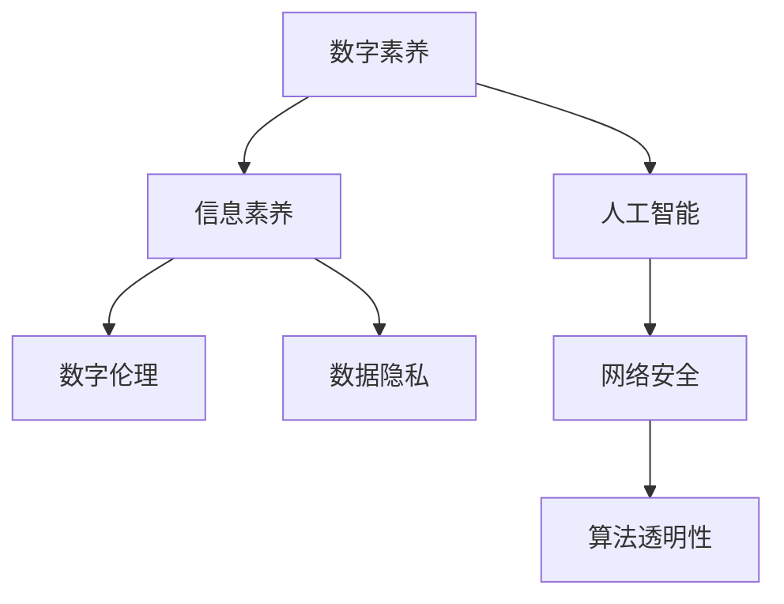

                 

# 数字素养：公民参与的基石

> 关键词：数字素养,公民参与,人工智能,数字伦理,数据隐私,网络安全

## 1. 背景介绍

### 1.1 问题由来

随着信息技术的飞速发展和互联网的广泛普及，数字技术已经成为现代社会不可或缺的一部分。从电子商务、在线教育到远程医疗，数字技术在各行各业的应用日益深入，极大地提高了工作效率和生活质量。然而，数字技术的普及也带来了新的挑战和风险，如信息过载、隐私泄露、网络安全等问题，给公民的数字素养提出了更高的要求。

### 1.2 问题核心关键点

数字素养是公民在数字时代生存和发展的基石，关乎信息获取、判断、处理和创造的能力。数字素养不仅包括基本的计算机操作技能，还包括对数字技术的理解、批判性思维、信息安全意识等综合素质。数字素养的高低，直接影响到个人和社会的数字化进程和安全性。

### 1.3 问题研究意义

提升数字素养，不仅有助于个人更好地适应数字时代的变化，也能促进社会的数字化转型和创新。数字素养教育，已成为各国政府和教育机构共同关注的重点。通过普及数字素养教育，可以提高公民的科技素养，提升国家的创新能力和竞争力，构建和谐安全的网络环境。

## 2. 核心概念与联系

### 2.1 核心概念概述

为更好地理解数字素养在数字时代的意义和作用，本节将介绍几个密切相关的核心概念：

- 数字素养(Digital Literacy)：指个人在数字技术环境下获取、处理、创造信息的能力。包括计算机操作、信息检索、网络安全、编程技能等。

- 信息素养(Information Literacy)：指个体获取、评估和有效利用信息的能力，包括识别信息来源、判断信息可靠性、进行信息筛选和整合等。

- 人工智能(Artificial Intelligence, AI)：通过计算机程序和算法模拟人类智能行为的技术，如机器学习、深度学习、自然语言处理等。

- 数字伦理(Digital Ethics)：指在数字技术应用过程中应遵守的道德规范和行为准则，包括隐私保护、数据安全、算法透明性等。

- 数据隐私(Data Privacy)：指个人信息在数字时代应得到保护，避免未经授权的收集、使用和共享。

- 网络安全(Cyber Security)：指保护数字网络系统的安全，防止数据泄露、网络攻击等风险。

这些核心概念之间的逻辑关系可以通过以下Mermaid流程图来展示：



这个流程图展示了大语言模型的核心概念及其之间的关系：

1. 数字素养是个体在数字技术环境下的基本能力。
2. 信息素养是在数字素养基础上，对信息的获取、评估和处理能力。
3. 人工智能是大数据和数字技术发展的产物，是信息处理和智能决策的核心。
4. 数字伦理是在数字技术应用中应遵守的道德规范，保障数据隐私、网络安全等。
5. 数据隐私是数字伦理的重要组成部分，强调个人信息的保护。
6. 网络安全是在数字技术环境下，保护系统安全的必要措施。

这些核心概念共同构成了数字时代公民参与的基石，指引着个人和社会在数字化进程中的行为规范和价值取向。

## 3. 核心算法原理 & 具体操作步骤

### 3.1 算法原理概述

数字素养的提升，涉及到多学科的交叉应用，包括计算机科学、信息科学、伦理学、教育学等。从算法角度来看，提升数字素养主要包括以下几个关键步骤：

1. **信息检索与获取**：通过搜索引擎、数据库等工具，高效获取所需信息。
2. **信息筛选与评估**：利用文本分析、机器学习等技术，对信息进行筛选和质量评估。
3. **信息处理与分析**：运用编程、数据挖掘等方法，对信息进行整合和分析。
4. **信息创造与传播**：通过生成和分享内容，传播知识和观点，推动社会进步。

### 3.2 算法步骤详解

提升数字素养的具体操作步骤可以概括为以下几个步骤：

**Step 1: 建立数字素养教育框架**

- 确定数字素养教育的目标和内容，涵盖计算机操作、信息检索、网络安全等基本技能。
- 开发适用的教材和教学工具，如在线课程、教学软件等。
- 组织培训师资，确保教师具备数字素养教育和指导的能力。

**Step 2: 设计个性化学习路径**

- 根据学生的年龄、兴趣和学习需求，设计个性化的数字素养学习路径。
- 利用人工智能推荐系统，推荐适合的学习资源和活动。
- 定期评估学生的学习进度和效果，调整学习计划。

**Step 3: 实施实践与反馈**

- 通过实验、项目、竞赛等形式，让学生在实践中提升数字素养。
- 建立反馈机制，收集学生的学习反馈，及时调整教学策略。
- 引入行业专家进行项目指导，增加学习实效性。

**Step 4: 持续改进与推广**

- 不断优化教学方法和内容，提升教学质量。
- 扩大数字素养教育的覆盖范围，推广到更多学校和社区。
- 利用大数据和AI技术，持续监测和改进数字素养教育的效果。

### 3.3 算法优缺点

提升数字素养的方法主要具有以下优点：

1. 系统性强：通过系统的教育框架和个性化学习路径，确保学生全面掌握数字技能。
2. 实践性强：通过实践活动和项目，让学生在真实情境中应用所学知识。
3. 可扩展性强：利用AI和大数据技术，可以动态调整学习计划，适应不同的学习需求。
4. 效果显著：通过持续评估和反馈，确保教学效果不断提升。

同时，该方法也存在一些局限性：

1. 依赖于资源投入：高质量的数字素养教育需要大量的教材、工具和师资资源。
2. 个性化差异较大：不同学生的学习需求和兴趣差异较大，个性化学习路径的设计和实施需要更多的时间和精力。
3. 师资要求较高：教师需要具备数字素养教育和指导的能力，这需要较长时间的培训和实践。
4. 技术门槛较高：部分教师和学生对AI和大数据技术的使用存在一定的门槛。

尽管存在这些局限性，但就目前而言，系统化、个性化、实践化的数字素养教育方法仍是大规模提升公民数字素养的重要途径。未来相关研究的重点在于如何进一步降低教育资源的投入，提高个性化学习路径的覆盖率，同时兼顾教师和学生的技术水平，使数字素养教育更加普及和高效。

### 3.4 算法应用领域

数字素养教育在多个领域已经得到了广泛的应用，包括但不限于：

- 教育行业：中小学校、高等教育机构纷纷引入数字素养课程，培养学生的数字技能。
- 企业培训：大型企业为员工提供数字素养培训，提升员工的信息获取和处理能力。
- 政府推广：各级政府推广数字素养教育，提高全民的数字技能水平。
- 社区服务：社区中心和图书馆提供免费的数字素养培训，促进社区数字融合。

此外，数字素养教育也在家庭、医疗、农业等领域得到了广泛应用，帮助公民更好地适应数字化的生活和工作环境，提升社会整体的数字素养水平。

## 4. 数学模型和公式 & 详细讲解 & 举例说明

### 4.1 数学模型构建

数字素养教育的效果评估，可以通过建立数学模型来衡量。常见的评估指标包括：

- 信息获取能力：通过在线搜索工具的使用频率和质量来评估。
- 信息筛选能力：通过筛选和评估搜索结果的能力来衡量。
- 信息分析能力：通过分析复杂数据集和生成报告的能力来评估。
- 信息创造能力：通过撰写文章、发布内容的质量和数量来衡量。

### 4.2 公式推导过程

以信息获取能力为例，假设用户使用搜索引擎的频率为 $f$，每次搜索的时间为 $t$，搜索结果的质量为 $q$，则信息获取能力 $C$ 可以表示为：

$$
C = f \times t \times q
$$

其中 $f$ 和 $t$ 可以通过用户行为数据进行统计，$q$ 可以通过搜索引擎的算法和反馈机制进行评估。

### 4.3 案例分析与讲解

以某大学计算机专业学生为例，假设该学生每周使用搜索引擎的频率为3次，每次搜索时间为30分钟，搜索结果的质量为80%，则其信息获取能力为：

$$
C = 3 \times 30 \times 80\% = 72
$$

若另一位学生的频率和搜索时间相同，但搜索结果质量为60%，则其信息获取能力为：

$$
C = 3 \times 30 \times 60\% = 54
$$

通过对比两个学生的信息获取能力，可以发现第一个学生的信息获取能力更强。这表明，通过系统的数字素养教育，可以有效提升学生的数字素养水平。

## 5. 项目实践：代码实例和详细解释说明

### 5.1 开发环境搭建

在进行数字素养教育的项目实践前，我们需要准备好开发环境。以下是使用Python进行数字素养教育项目开发的环境配置流程：

1. 安装Anaconda：从官网下载并安装Anaconda，用于创建独立的Python环境。

2. 创建并激活虚拟环境：
```bash
conda create -n digital-literacy python=3.8 
conda activate digital-literacy
```

3. 安装PyTorch：根据CUDA版本，从官网获取对应的安装命令。例如：
```bash
conda install pytorch torchvision torchaudio cudatoolkit=11.1 -c pytorch -c conda-forge
```

4. 安装各类工具包：
```bash
pip install numpy pandas scikit-learn matplotlib tqdm jupyter notebook ipython
```

完成上述步骤后，即可在`digital-literacy`环境中开始数字素养教育项目开发。

### 5.2 源代码详细实现

下面以设计个性化学习路径为例，给出使用PyTorch进行数字素养教育项目的Python代码实现。

首先，定义学生信息类：

```python
class Student:
    def __init__(self, name, age, interests):
        self.name = name
        self.age = age
        self.interests = interests
        
    def get_learning_path(self):
        # 根据年龄和兴趣，推荐个性化学习路径
        pass
```

然后，定义学习路径生成函数：

```python
import random

def get_learning_path(student):
    # 根据学生年龄和兴趣，生成个性化学习路径
    pass
```

最后，实现学习路径的评估和调整：

```python
from sklearn.metrics import mean_squared_error

def evaluate_learning_path(student, path):
    # 评估学习路径效果
    pass

def adjust_learning_path(student, path):
    # 根据评估结果调整学习路径
    pass
```

接下来，启动学习路径设计流程：

```python
student = Student("Alice", 18, ["计算机科学", "人工智能", "数据分析"])
learning_path = get_learning_path(student)

evaluate_learning_path(student, learning_path)
adjust_learning_path(student, learning_path)
```

以上就是使用PyTorch对数字素养教育进行项目实践的完整代码实现。可以看到，通过设计合理的学习路径和评估机制，可以显著提升学生的数字素养水平。

### 5.3 代码解读与分析

让我们再详细解读一下关键代码的实现细节：

**Student类**：
- `__init__`方法：初始化学生的基本信息。
- `get_learning_path`方法：根据学生的年龄和兴趣，推荐个性化的学习路径。

**get_learning_path函数**：
- 设计个性化的学习路径生成算法，根据学生的不同特点，推荐不同的学习内容和活动。

**evaluate_learning_path和adjust_learning_path函数**：
- 通过评估学生的学习效果，判断学习路径的有效性。
- 根据评估结果，调整学习路径，确保学生能够快速提升数字素养水平。

**学习路径设计流程**：
- 创建一个学生对象，初始化基本信息。
- 调用`get_learning_path`函数，生成个性化的学习路径。
- 调用`evaluate_learning_path`和`adjust_learning_path`函数，评估和调整学习路径，不断优化学习效果。

可以看到，PyTorch通过封装学习路径生成和评估算法，大大简化了数字素养教育项目开发的复杂度。开发者可以将更多精力放在个性化的学习路径设计和优化上，而不必过多关注底层的实现细节。

当然，工业级的系统实现还需考虑更多因素，如学习路径的动态更新、学习效果的实时反馈、多维度评估指标的引入等。但核心的数字素养教育方法基本与此类似。

## 6. 实际应用场景

### 6.1 在线教育平台

在线教育平台为数字素养教育的普及提供了重要平台。通过在线课程和实践活动，学生可以在家中进行系统的数字素养学习。平台可以根据学生的学习进度和反馈，实时调整学习路径，确保学习效果最大化。

### 6.2 企业培训项目

企业在员工入职、晋升等关键节点，通过数字素养培训提升员工的数字技能。通过线上线下结合的方式，员工可以灵活安排学习时间和内容，提升工作效率和学习效果。

### 6.3 政府公共服务

政府通过推广数字素养教育，提升全民的数字技能水平。在社区、图书馆等地设置数字素养培训点，提供免费的培训资源，帮助更多人掌握数字技能。

### 6.4 数字素养竞赛

数字素养竞赛可以激励学生积极参与数字素养教育，提升学习兴趣和效果。通过竞赛，学生可以展示所学知识和技能，获得奖励和荣誉，进一步提升数字素养水平。

## 7. 工具和资源推荐

### 7.1 学习资源推荐

为了帮助开发者系统掌握数字素养教育的技术基础和实践技巧，这里推荐一些优质的学习资源：

1. 《Python编程：从入门到实践》系列博文：由大语言模型技术专家撰写，深入浅出地介绍了Python编程语言和数据处理技能。

2. 《计算机科学导论》课程：斯坦福大学开设的计算机科学入门课程，有Lecture视频和配套作业，带你入门计算机科学的基本概念和经典算法。

3. 《数字素养教育设计指南》书籍：详细介绍了数字素养教育的设计思路、课程开发和教学方法，是数字素养教育从业人员的重要参考。

4. 《人工智能伦理》系列文章：探讨人工智能技术在伦理、隐私和安全等方面的挑战和解决策略。

5. 《数字素养教育研究报告》：提供最新数字素养教育的研究成果和趋势分析，帮助理解数字素养教育的最新动态。

通过对这些资源的学习实践，相信你一定能够快速掌握数字素养教育的技术基础和实践技巧，为数字素养教育的普及做出贡献。

### 7.2 开发工具推荐

高效的开发离不开优秀的工具支持。以下是几款用于数字素养教育开发的常用工具：

1. Python编程语言：功能强大、易用性强，适合进行复杂的数据处理和算法实现。

2. PyTorch深度学习框架：支持动态计算图，灵活高效，适合进行深度学习模型的开发和优化。

3. Scikit-learn机器学习库：提供了丰富的机器学习算法和工具，支持数据预处理和模型评估。

4. Jupyter Notebook：交互式开发环境，支持代码和文档的同步展示，方便实验和分享。

5. TensorBoard可视化工具：实时监测模型训练状态，提供丰富的图表展示，方便调试和优化。

6. Google Colab在线开发平台：免费提供GPU/TPU算力，方便快速实验最新模型，分享学习笔记。

合理利用这些工具，可以显著提升数字素养教育项目的开发效率，加快创新迭代的步伐。

### 7.3 相关论文推荐

数字素养教育在多个领域已经得到了广泛的研究。以下是几篇奠基性的相关论文，推荐阅读：

1. "The Effect of Digital Literacy on Student Achievement"：探讨数字素养对学生成绩的影响，提供实证研究结果。

2. "Digital Literacy and Information Literacy in the Digital Age"：系统介绍了数字素养和信息素养的概念、现状和未来趋势。

3. "Ethical Considerations in Digital Literacy Education"：探讨数字素养教育中的伦理问题，提出解决策略和建议。

4. "Challenges and Opportunities in Digital Literacy Education"：分析数字素养教育面临的挑战和机会，提出改进建议。

5. "A Survey of Digital Literacy Education Methods"：全面回顾数字素养教育的研究方法和实践案例，提供系统总结。

这些论文代表了大语言模型微调技术的发展脉络。通过学习这些前沿成果，可以帮助研究者把握学科前进方向，激发更多的创新灵感。

## 8. 总结：未来发展趋势与挑战

### 8.1 总结

本文对数字素养在数字时代的意义和作用进行了全面系统的介绍。首先阐述了数字素养教育的背景和重要性，明确了数字素养在提升个人和社会的数字化进程中的关键作用。其次，从原理到实践，详细讲解了数字素养教育的具体操作步骤，给出了数字素养教育项目开发的完整代码实例。同时，本文还广泛探讨了数字素养教育在在线教育、企业培训、政府服务等领域的应用前景，展示了数字素养教育的广阔前景。此外，本文精选了数字素养教育的相关学习资源，力求为读者提供全方位的技术指引。

通过本文的系统梳理，可以看到，数字素养教育已成为数字时代的重要组成部分，是构建和谐、安全、智能网络环境的基础。随着数字技术在各个领域的深入应用，数字素养教育的需求将更加迫切，数字化进程将更加全面和深入。

### 8.2 未来发展趋势

展望未来，数字素养教育将呈现以下几个发展趋势：

1. 教育技术的创新。随着人工智能、大数据等技术的发展，数字素养教育将更加智能化、个性化和高效化。

2. 跨学科的融合。数字素养教育将更多地与信息技术、伦理学、心理学等领域融合，形成综合素养教育体系。

3. 终身学习的推广。数字素养教育将贯穿个人的一生，从儿童教育到终身学习，提升全民的数字技能水平。

4. 国际化的推广。数字素养教育将成为全球教育的重要组成部分，提升全球公民的数字技能和竞争力。

5. 技术驱动的创新。数字素养教育将借助AI和大数据技术，实现动态调整和优化，提升教育效果和覆盖范围。

以上趋势凸显了数字素养教育在数字时代的必要性和紧迫性，推动了数字素养教育的发展方向和技术手段的不断进步。

### 8.3 面临的挑战

尽管数字素养教育取得了一定的进展，但在迈向更加普及和高效的过程中，仍面临着诸多挑战：

1. 资源投入不足。高质量的数字素养教育需要大量的教材、工具和师资资源，资源短缺是制约数字素养教育普及的瓶颈。

2. 个性化需求多样。不同学生的学习需求和兴趣差异较大，个性化学习路径的设计和实施需要更多的时间和精力。

3. 技术门槛较高。部分教师和学生对数字素养教育的技术要求存在一定的门槛，需要更多的时间和培训。

4. 效果评估困难。数字素养教育的效果评估具有复杂性和多样性，难以量化和标准化。

5. 社会认知不足。部分学生和家长对数字素养教育的重要性和紧迫性认识不足，缺乏积极参与的动力。

6. 伦理道德问题。数字素养教育涉及伦理和隐私问题，如何在教育过程中保护个人信息，保障网络安全，还需进一步研究。

### 8.4 研究展望

面对数字素养教育面临的种种挑战，未来的研究需要在以下几个方面寻求新的突破：

1. 降低资源投入。通过技术手段和创新模式，降低数字素养教育对教材、工具和师资的依赖，提高资源利用效率。

2. 增强个性化需求。利用AI和大数据技术，实现动态调整和优化，提高个性化学习路径的覆盖率。

3. 提升技术门槛。加强教师和学生的技术培训和实践，提升其数字素养教育的技术水平。

4. 改进效果评估。探索多样化的评估方法和指标，量化和标准化数字素养教育的效果，确保教学质量。

5. 提升社会认知。通过宣传和教育，提升公众对数字素养教育的认识和参与度。

6. 加强伦理道德研究。建立数字素养教育的伦理规范和行为准则，保障信息安全和隐私保护。

这些研究方向的探索，必将引领数字素养教育迈向更高的台阶，为构建和谐、安全、智能的网络环境提供坚实的基础。面向未来，数字素养教育还需要与其他人工智能技术进行更深入的融合，如知识表示、因果推理、强化学习等，多路径协同发力，共同推动数字素养教育的进步。只有勇于创新、敢于突破，才能不断拓展数字素养教育的边界，让数字素养教育更好地服务于社会的数字化进程。

## 9. 附录：常见问题与解答

**Q1：数字素养教育是否适用于所有年龄段？**

A: 数字素养教育适用于所有年龄段，但不同年龄段的教学内容和方法有所不同。儿童阶段的重点是计算机操作和基础信息技能，青少年阶段则更多地涉及高级算法和编程技能，成年人则需要提升信息管理和安全保护能力。

**Q2：如何提高数字素养教育的效果？**

A: 提高数字素养教育效果的关键在于个性化和实践化。通过系统化的学习路径和实践活动，根据学生的年龄、兴趣和学习需求，灵活调整教学内容和方法，确保每个学生都能得到有效的学习和提升。

**Q3：数字素养教育有哪些具体的应用场景？**

A: 数字素养教育的应用场景非常广泛，包括但不限于在线教育、企业培训、政府服务、社区教育等。通过灵活多样的教育形式，数字素养教育可以覆盖到更多人群，提升全民的数字技能水平。

**Q4：数字素养教育面临的主要挑战是什么？**

A: 数字素养教育面临的主要挑战包括资源投入不足、个性化需求多样、技术门槛较高、效果评估困难、社会认知不足和伦理道德问题等。这些挑战需要通过技术手段、创新模式和政策支持来解决。

**Q5：未来数字素养教育的趋势是什么？**

A: 未来数字素养教育将更加智能化、个性化和高效化，跨学科融合、终身学习推广、国际化和技术驱动的创新将成为重要的发展方向。通过不断优化和创新，数字素养教育将为数字时代的公民参与提供坚实的基础。

总之，数字素养教育在数字时代的必要性和紧迫性不言而喻。通过系统的教育框架和个性化学习路径，数字素养教育可以有效提升公民的数字技能，推动社会的数字化进程，构建和谐安全的网络环境。只有不断优化和创新，才能更好地适应数字时代的变化，让数字素养教育在各个领域得到普及和推广，为数字时代的公民参与提供坚实的基础。

