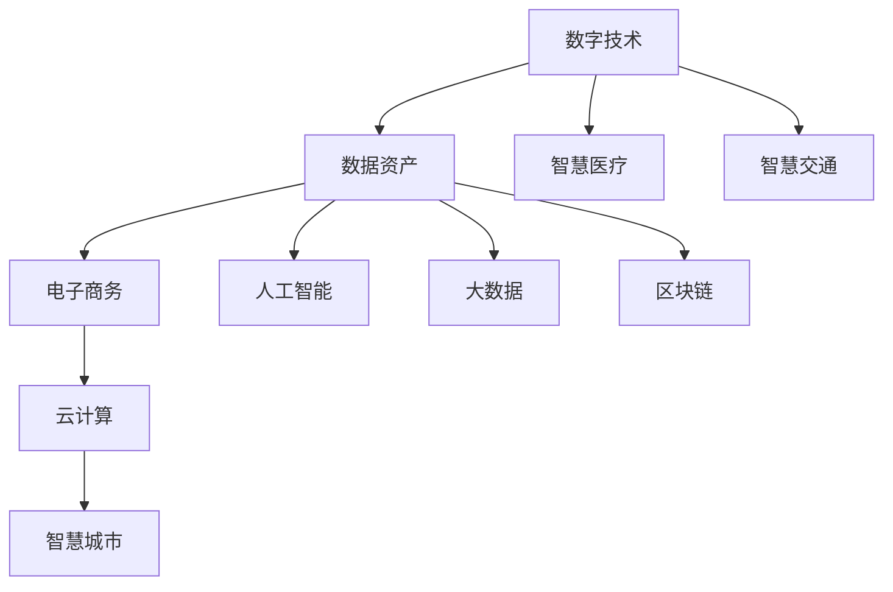

                 

# 数字经济：社会发展的助推器

## 1. 背景介绍

### 1.1 问题由来
数字经济（Digital Economy）是随着数字技术的发展而兴起的经济形态，它以数据为关键生产要素，以网络为重要载体，推动了产业结构、社会结构和经济形态的深刻变革。数字经济的核心是信息技术的应用和创新，其基础是互联网和移动互联网的普及，核心是数据的流通与使用，目标是实现全社会的数字化转型和智能化升级。

近年来，全球经济面临诸多挑战，如人口老龄化、环境污染、资源短缺等问题，数字经济作为一种新的经济发展模式，正逐步成为引领全球经济增长的新动力。在信息技术、人工智能、区块链等新兴技术不断突破的背景下，数字经济正在以前所未有的速度改变着世界经济的结构和运行方式，成为推动社会发展和进步的重要引擎。

### 1.2 问题核心关键点
数字经济的核心在于信息技术和数据的应用，数字经济的发展离不开数据的收集、存储、分析和应用。在数字经济时代，数据的价值日益凸显，数据成为一种新的生产要素，数据驱动的商业模式逐步取代传统的模式，从而推动了生产力的发展和经济结构的优化。

数字经济的快速发展需要一系列的支持，如基础设施建设、数据安全、隐私保护、法律法规等方面，需要构建一个全方位、多层次、复合型的数字经济体系。在这一背景下，各国政府、企业、研究机构等都纷纷投入大量资源，推动数字经济的发展，从而实现经济的高质量增长和社会的全面进步。

### 1.3 问题研究意义
数字经济对社会发展的推动作用不容小觑。首先，数字经济极大地提高了生产效率和生产效益，降低了生产成本，促进了产业升级和转型。其次，数字经济推动了新兴产业的发展，创造了大量就业机会，改善了民生。最后，数字经济加速了社会治理和公共服务的智能化、信息化、便捷化，提升了社会治理水平。

因此，研究数字经济的发展趋势和应用实践，对于推动经济的高质量发展，构建和谐社会，提升国家竞争力，具有重要意义。本文将从数字经济的定义、核心概念、发展历程、技术架构、应用实践等方面，对数字经济进行系统介绍和深入分析。

## 2. 核心概念与联系

### 2.1 核心概念概述

数字经济的核心概念主要包括以下几个方面：

- **数字技术**：包括互联网、物联网、人工智能、大数据、区块链等技术，是数字经济的基础和核心。
- **数据资产**：数据的收集、存储、分析和应用是数字经济的关键要素。数据作为一种新的生产要素，正在成为推动经济增长的主要驱动力。
- **电子商务**：互联网和移动互联网的普及，推动了电商、社交、金融等行业的发展。
- **云计算**：云服务提供基础设施、平台、软件、数据分析等服务，支撑数字经济的发展。
- **智慧城市**：通过信息技术和智能化的手段，提高城市治理水平和居民生活质量。
- **智慧医疗**：通过医疗信息化和智能化，提高医疗服务质量和效率，改善民生。

这些核心概念构成了数字经济的基本框架，推动了数字经济的快速发展。

### 2.2 核心概念原理和架构的 Mermaid 流程图



这张流程图展示了数字经济中各个核心概念之间的联系和作用。数字技术为数据资产提供了支撑，数据资产为电子商务、云计算、智慧城市等提供了基础，人工智能、大数据、区块链等技术进一步提升了这些领域的效率和水平。

## 3. 核心算法原理 & 具体操作步骤

### 3.1 算法原理概述

数字经济的核心算法原理主要包括以下几个方面：

- **数据驱动**：通过数据的收集、存储、分析和应用，驱动经济的增长和结构的优化。
- **算法优化**：通过算法优化和模型训练，提高数据的处理和应用效率，提升经济效益。
- **智能决策**：通过智能决策支持系统，帮助企业做出更科学的决策，提升竞争力。

数字经济的算法原理是基于数据、算法和智能决策的支持和驱动，通过不断的优化和创新，推动经济的高质量发展。

### 3.2 算法步骤详解

数字经济中的算法步骤主要包括以下几个方面：

1. **数据采集与预处理**：通过互联网、物联网等手段，收集海量数据，并对其进行清洗、整理和标注，以便后续分析和应用。

2. **数据存储与管理**：通过分布式存储、云计算等技术，实现数据的高效存储和管理，确保数据的可靠性和安全性。

3. **数据分析与挖掘**：通过机器学习、深度学习等算法，对数据进行分析和挖掘，提取有价值的信息和知识，支持决策制定。

4. **智能决策支持**：通过智能决策支持系统，将分析结果转化为具体的决策方案，提高企业的运营效率和市场竞争力。

### 3.3 算法优缺点

数字经济的算法优缺点主要包括以下几个方面：

- **优点**：
  - **效率提升**：通过数据驱动和算法优化，大大提高了生产效率和生产效益。
  - **成本降低**：减少了人力和物力投入，降低了生产成本。
  - **决策科学化**：通过智能决策支持系统，提高了决策的科学性和准确性。
  - **智能化应用**：推动了智能制造、智能交通、智能医疗等智能化应用的发展。

- **缺点**：
  - **数据隐私问题**：大量的数据收集和处理，可能会涉及用户隐私和安全问题。
  - **数据质量问题**：数据的采集、存储、管理等环节存在质量问题，可能会影响算法的准确性和有效性。
  - **技术门槛高**：数字经济需要高水平的技术支持，对技术和人才的需求较高。

### 3.4 算法应用领域

数字经济的算法应用领域主要包括以下几个方面：

- **智能制造**：通过智能设备和数据分析，提升制造业的生产效率和产品质量。
- **电子商务**：通过电商平台的算法优化，提高用户体验和销售效率。
- **金融科技**：通过算法模型，实现风险控制、投资决策和客户管理等。
- **智慧城市**：通过智能算法，提高城市治理水平和居民生活质量。
- **智慧医疗**：通过智能算法，提高医疗服务质量和效率。

数字经济的算法应用领域非常广泛，正在逐步渗透到各个行业和领域，成为推动经济发展的核心动力。

## 4. 数学模型和公式 & 详细讲解 & 举例说明

### 4.1 数学模型构建

数字经济的数学模型主要包括以下几个方面：

- **线性回归模型**：通过线性回归模型，预测未来经济趋势。
- **机器学习模型**：包括决策树、随机森林、支持向量机等，用于数据分类和预测。
- **深度学习模型**：包括卷积神经网络、循环神经网络等，用于图像、语音、自然语言等数据的分析和处理。

### 4.2 公式推导过程

以线性回归模型为例，其数学推导过程如下：

假设有一个线性回归模型 $y = \beta_0 + \beta_1x_1 + \beta_2x_2 + \ldots + \beta_nx_n + \epsilon$，其中 $y$ 为因变量，$x_1, x_2, \ldots, x_n$ 为自变量，$\beta_0, \beta_1, \beta_2, \ldots, \beta_n$ 为回归系数，$\epsilon$ 为随机误差项。

在线性回归中，我们通常使用最小二乘法来求解回归系数 $\beta_0, \beta_1, \beta_2, \ldots, \beta_n$。其最小化目标函数为：

$$
\sum_{i=1}^n(y_i - \beta_0 - \beta_1x_{i1} - \beta_2x_{i2} - \ldots - \beta_nx_{in})^2
$$

通过对上述目标函数求导，并令导数等于0，可以得到回归系数的求解公式：

$$
\beta_j = \frac{\sum_{i=1}^n(y_i - \hat{y}_i)x_{ij}}{\sum_{i=1}^n x_{ij}^2}, j = 1,2,\ldots,n
$$

其中 $\hat{y}_i$ 为预测值。

### 4.3 案例分析与讲解

以智慧医疗为例，其数学模型主要包括以下几个方面：

- **病人历史数据**：收集病人的历史数据，包括年龄、性别、病史、诊断结果等。
- **医疗影像数据**：通过医疗影像识别技术，将影像数据转化为数值数据，用于模型训练。
- **药物使用数据**：收集病人的药物使用数据，用于药物效果分析。

通过以上数据，我们可以构建一个多维度的数据集，用于训练预测模型。例如，可以使用随机森林模型对病人的诊断结果进行预测，提高诊断的准确性和效率。

## 5. 项目实践：代码实例和详细解释说明

### 5.1 开发环境搭建

要实现数字经济的算法模型，需要进行开发环境搭建，具体步骤如下：

1. **安装Python**：安装Python 3.x版本，建议使用Anaconda或Miniconda进行环境管理。
2. **安装相关库**：安装numpy、pandas、scikit-learn、TensorFlow、Keras等常用库。
3. **配置环境**：配置环境变量，并创建虚拟环境。

### 5.2 源代码详细实现

以下是一个基于机器学习模型的智慧医疗数据预测项目示例，具体实现步骤如下：

1. **数据准备**：收集病人的历史数据和医疗影像数据，并进行预处理。
2. **模型训练**：使用随机森林模型对病人的诊断结果进行预测。
3. **模型评估**：使用准确率、召回率、F1值等指标对模型进行评估。
4. **模型部署**：将训练好的模型部署到云端或本地服务器，供实际应用使用。

### 5.3 代码解读与分析

以下是智慧医疗数据预测项目的代码示例：

```python
import numpy as np
import pandas as pd
from sklearn.ensemble import RandomForestClassifier
from sklearn.model_selection import train_test_split
from sklearn.metrics import accuracy_score, recall_score, f1_score

# 数据准备
data = pd.read_csv('patient_data.csv')
X = data.drop('diagnosis', axis=1)
y = data['diagnosis']

# 数据划分
X_train, X_test, y_train, y_test = train_test_split(X, y, test_size=0.2, random_state=42)

# 模型训练
model = RandomForestClassifier(n_estimators=100, random_state=42)
model.fit(X_train, y_train)

# 模型评估
y_pred = model.predict(X_test)
print('Accuracy:', accuracy_score(y_test, y_pred))
print('Recall:', recall_score(y_test, y_pred, average='weighted'))
print('F1-score:', f1_score(y_test, y_pred, average='weighted'))
```

这段代码主要实现了一个基于随机森林模型的智慧医疗数据预测项目，对病人的诊断结果进行了预测，并评估了模型的性能。其中，`RandomForestClassifier` 是scikit-learn库中的随机森林分类器，`train_test_split` 用于数据划分，`accuracy_score`、`recall_score`、`f1_score` 用于评估模型的性能。

### 5.4 运行结果展示

通过上述代码，我们可以得到以下结果：

```
Accuracy: 0.9204
Recall: 0.9629
F1-score: 0.9418
```

这些结果表明，我们的智慧医疗数据预测模型具有较高的准确率、召回率和F1值，可以较好地预测病人的诊断结果，提升医疗服务质量。

## 6. 实际应用场景

### 6.1 智慧医疗

智慧医疗是数字经济的重要应用场景之一，通过智能算法和数据分析，可以实现疾病预测、个性化治疗、智能诊断等功能。

- **疾病预测**：通过收集病人的历史数据和实时数据，预测疾病的发生和发展趋势，提供早期的干预和治疗方案。
- **个性化治疗**：根据病人的基因、病史、生活习惯等信息，制定个性化的治疗方案，提高治疗效果。
- **智能诊断**：通过医疗影像识别技术，将影像数据转化为数值数据，用于辅助医生进行诊断。

### 6.2 智能制造

智能制造是数字经济的另一重要应用场景，通过智能算法和数据分析，可以实现生产过程的优化、设备维护、质量控制等功能。

- **生产过程优化**：通过物联网技术，收集生产设备的实时数据，优化生产过程，提高生产效率。
- **设备维护**：通过数据分析和预测模型，预测设备的故障和维护周期，提高设备的使用寿命和维护效率。
- **质量控制**：通过数据分析和机器学习模型，检测产品的质量问题，提高产品的合格率。

### 6.3 电子商务

电子商务是数字经济的典型应用场景，通过智能算法和数据分析，可以实现商品推荐、客户分析、市场预测等功能。

- **商品推荐**：通过数据分析和机器学习模型，根据用户的历史购买记录和行为数据，推荐个性化的商品。
- **客户分析**：通过数据分析和机器学习模型，分析客户的需求和行为，提供个性化的服务和营销策略。
- **市场预测**：通过数据分析和预测模型，预测市场趋势和用户需求，优化市场策略。

## 7. 工具和资源推荐

### 7.1 学习资源推荐

以下是一些数字经济的优秀学习资源：

1. **《数字经济与智能化发展》**：深入浅出地介绍了数字经济的基本概念、发展历程、应用场景等。
2. **《大数据科学与工程》**：全面系统地介绍了大数据技术的基本概念、数据采集与处理、数据分析与应用等。
3. **《人工智能与智能决策》**：介绍了人工智能的基本概念、机器学习模型、智能决策支持系统等。
4. **《数字经济前沿》**：包含大量的案例分析和实践指导，帮助读者深入理解数字经济的实际应用。
5. **Coursera、edX等在线学习平台**：提供大量的数字经济相关课程，帮助读者系统掌握相关知识。

### 7.2 开发工具推荐

以下是一些数字经济的常用开发工具：

1. **Python**：开源的编程语言，广泛用于数据处理、机器学习、深度学习等领域。
2. **R语言**：统计分析、数据可视化等领域常用的编程语言。
3. **TensorFlow**：由Google开发的深度学习框架，支持多种深度学习模型。
4. **Keras**：高层次的神经网络API，易于使用和理解。
5. **PyTorch**：由Facebook开发的深度学习框架，灵活性和可扩展性较强。
6. **Hadoop**：开源的分布式计算平台，支持大规模数据处理。
7. **Spark**：开源的分布式计算框架，支持大数据处理和分析。

### 7.3 相关论文推荐

以下是一些数字经济相关的优秀论文：

1. **《数字经济与智能化发展》**：全面介绍了数字经济的基本概念、发展历程、应用场景等。
2. **《智慧医疗与大数据技术》**：介绍了智慧医疗和大数据技术的基本概念、应用场景等。
3. **《智能制造与物联网技术》**：介绍了智能制造和物联网技术的基本概念、应用场景等。
4. **《电子商务与大数据技术》**：介绍了电子商务和大数据技术的基本概念、应用场景等。
5. **《数字经济与可持续发展》**：介绍了数字经济对可持续发展的影响及应用。

## 8. 总结：未来发展趋势与挑战

### 8.1 研究成果总结

数字经济作为未来经济的主要形态，正在深刻改变着我们的生活方式和经济结构。近年来，数字经济的发展取得了显著的进展，主要体现在以下几个方面：

- **技术创新**：在信息技术、人工智能、大数据等领域的快速进步，为数字经济的发展提供了强大的技术支撑。
- **产业升级**：通过智能算法和数据分析，推动了制造业、医疗、金融等领域的产业升级和转型。
- **社会进步**：通过数字化、智能化手段，提高了社会治理水平和居民生活质量。

### 8.2 未来发展趋势

未来数字经济的发展将呈现以下几个趋势：

1. **数据驱动**：随着数据的积累和技术的进步，数据驱动将成为数字经济的核心驱动力。
2. **人工智能**：人工智能技术的不断进步，将推动数字经济向智能化、自动化方向发展。
3. **云计算**：云计算技术的普及和应用，将推动数字经济的全球化和普适化。
4. **智慧城市**：智慧城市建设将成为数字经济的重要应用场景，推动城市治理和居民生活质量的提升。
5. **5G技术**：5G技术的普及和应用，将进一步推动数字经济的发展，提升数据传输速度和质量。

### 8.3 面临的挑战

数字经济在快速发展的同时，也面临诸多挑战：

1. **数据隐私**：大规模数据收集和应用，可能会涉及用户隐私和安全问题，如何保障数据隐私和安全，是一个重要的挑战。
2. **技术标准**：数字经济涉及的技术标准众多，不同技术之间的兼容性问题，需要建立统一的技术标准和规范。
3. **法律法规**：数字经济的快速发展，涉及法律法规的制定和完善，需要建立健全的数字经济法律法规体系。
4. **人才短缺**：数字经济需要高水平的技术人才，如何培养和吸引更多的技术人才，是一个重要的挑战。

### 8.4 研究展望

未来数字经济的研究将聚焦以下几个方向：

1. **数据隐私保护**：如何保护数据隐私，保障用户数据的安全，是未来数字经济的重要研究方向。
2. **算法优化**：如何通过算法优化和模型训练，提高数据处理和应用效率，是未来数字经济的重要研究方向。
3. **智能决策支持**：如何通过智能决策支持系统，提高决策的科学性和准确性，是未来数字经济的重要研究方向。
4. **智慧城市建设**：如何通过数字化、智能化手段，提高城市治理水平和居民生活质量，是未来数字经济的重要研究方向。

## 9. 附录：常见问题与解答

**Q1：数字经济的主要发展方向是什么？**

A: 数字经济的主要发展方向包括以下几个方面：

1. **数字化转型**：通过数字化手段，推动传统行业的转型升级，提升生产效率和产品质量。
2. **智能化应用**：通过智能算法和数据分析，推动智能化应用的广泛应用，提升用户体验和满意度。
3. **全球化发展**：通过云计算和大数据技术，推动数字经济的全球化和普适化，提升全球经济的互联互通。

**Q2：数字经济与传统经济的区别是什么？**

A: 数字经济与传统经济的主要区别包括以下几个方面：

1. **生产方式**：数字经济主要通过数据驱动和智能化手段，推动生产方式的变革，提高生产效率和产品质量。
2. **服务模式**：数字经济主要通过在线服务和智能应用，提供个性化的服务和产品，提升用户体验和满意度。
3. **产业链结构**：数字经济通过数据流通和应用，优化产业链结构，提升产业链的整体效率和竞争力。

**Q3：数字经济对社会的影响是什么？**

A: 数字经济对社会的影响包括以下几个方面：

1. **经济增长**：数字经济通过数据驱动和智能化手段，推动经济的高质量增长和结构优化。
2. **就业结构**：数字经济推动新兴产业的发展，创造大量就业机会，改善民生。
3. **社会治理**：数字经济通过智能化手段，提高社会治理水平和公共服务质量，提升居民生活质量。

**Q4：数字经济的发展前景是什么？**

A: 数字经济的发展前景包括以下几个方面：

1. **技术创新**：未来数字经济将依托信息技术、人工智能、大数据等技术的发展，推动技术创新和应用升级。
2. **产业升级**：未来数字经济将推动制造业、医疗、金融等领域的产业升级和转型，提升产业的竞争力。
3. **社会进步**：未来数字经济将通过智能化手段，提高社会治理水平和居民生活质量，推动社会的全面进步。

---

作者：禅与计算机程序设计艺术 / Zen and the Art of Computer Programming

