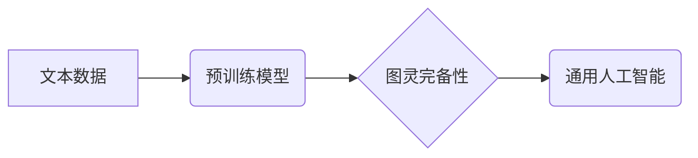

                 

## 图灵完备的LLM:通向通用人工智能之路

> 关键词：图灵完备性、LLM、通用人工智能、自然语言处理、深度学习、Transformer、算法原理、数学模型、代码实现、应用场景

### 1. 背景介绍

近年来，深度学习技术取得了飞速发展，特别是Transformer模型的出现，为自然语言处理（NLP）领域带来了革命性的变革。大型语言模型（LLM）作为深度学习的产物，展现出强大的文本生成、理解和翻译能力，在各个领域都得到了广泛应用。然而，现有的LLM仍然局限于特定的任务，缺乏通用性。

图灵完备性是人工智能领域一个重要的概念，它指的是一个系统能够执行任何能够被有效地计算的任务。图灵完备的LLM能够像人类一样理解和生成任意形式的文本，并具备解决各种复杂问题的能力，这将是通向通用人工智能（AGI）的关键一步。

### 2. 核心概念与联系

**2.1 图灵完备性**

图灵完备性是指一个系统能够模拟任何图灵机，从而能够执行任何能够被有效地计算的任务。图灵机是一种理论上的计算模型，它通过一系列的规则来处理符号，并能够模拟任何算法。

**2.2 LLM**

大型语言模型（LLM）是指拥有大量参数的深度学习模型，通过训练海量文本数据，能够理解和生成人类语言。常见的LLM架构包括Transformer、GPT、BERT等。

**2.3 连接**

图灵完备性是LLM实现通用人工智能的关键目标。通过设计能够模拟图灵机的LLM架构，并训练足够大的数据集，LLM能够具备解决各种复杂问题的能力，最终实现通用人工智能。

**Mermaid 流程图**



### 3. 核心算法原理 & 具体操作步骤

**3.1 算法原理概述**

图灵完备的LLM通常基于Transformer架构，并结合了自监督学习和强化学习等技术。

* **Transformer架构:** Transformer是一种基于注意力机制的深度学习模型，能够有效地处理长序列数据，并捕捉文本中的长距离依赖关系。

* **自监督学习:** 通过训练模型预测文本序列中的下一个词，或掩盖部分词并预测缺失部分，从而学习语言的语法和语义。

* **强化学习:** 通过设计奖励机制，训练模型生成符合特定目标的文本，例如对话系统、文本摘要等。

**3.2 算法步骤详解**

1. **数据预处理:** 收集海量文本数据，并进行清洗、分词、标记等预处理操作。

2. **模型训练:** 使用预训练模型，例如BERT或GPT，对文本数据进行自监督学习，训练模型的语言表示能力。

3. **微调:** 根据具体的应用场景，对预训练模型进行微调，例如训练对话系统，需要微调模型生成对话文本的能力。

4. **评估:** 使用测试数据集评估模型的性能，例如准确率、流畅度、多样性等。

5. **部署:** 将训练好的模型部署到实际应用场景中，例如聊天机器人、文本生成工具等。

**3.3 算法优缺点**

**优点:**

* 强大的文本理解和生成能力
* 可迁移性强，可以应用于多种任务
* 持续学习和改进的能力

**缺点:**

* 训练成本高，需要大量计算资源和数据
* 存在偏见和错误的可能性
* 缺乏可解释性，难以理解模型的决策过程

**3.4 算法应用领域**

* **自然语言理解:** 文本分类、情感分析、问答系统
* **自然语言生成:** 文本摘要、机器翻译、对话系统
* **代码生成:** 自动生成代码、代码修复
* **创意写作:** 生成诗歌、小说、剧本

### 4. 数学模型和公式 & 详细讲解 & 举例说明

**4.1 数学模型构建**

图灵完备的LLM通常基于概率模型，例如语言模型或马尔可夫链。这些模型通过计算文本序列中每个词出现的概率，来预测下一个词。

**4.2 公式推导过程**

假设我们有一个文本序列 $x = (x_1, x_2, ..., x_n)$，其中 $x_i$ 表示第 $i$ 个词。语言模型的目标是预测下一个词 $x_{n+1}$ 的概率，即 $P(x_{n+1}|x_1, x_2, ..., x_n)$。

可以使用贝叶斯定理来计算这个概率：

$$P(x_{n+1}|x_1, x_2, ..., x_n) = \frac{P(x_1, x_2, ..., x_n, x_{n+1})}{P(x_1, x_2, ..., x_n)}$$

其中，$P(x_1, x_2, ..., x_n, x_{n+1})$ 是整个文本序列的概率，$P(x_1, x_2, ..., x_n)$ 是前 $n$ 个词的概率。

**4.3 案例分析与讲解**

例如，假设我们有一个文本序列 "The cat sat on the"，我们想要预测下一个词。可以使用语言模型来计算每个词出现的概率，例如 "mat"、"chair"、"table" 等。

根据语言模型的训练数据，"mat" 可能是最有可能出现的词，因此语言模型会预测下一个词为 "mat"。

### 5. 项目实践：代码实例和详细解释说明

**5.1 开发环境搭建**

* Python 3.7+
* PyTorch 或 TensorFlow
* CUDA 和 cuDNN (可选，用于GPU加速)

**5.2 源代码详细实现**

```python
import torch
import torch.nn as nn

class Transformer(nn.Module):
    def __init__(self, vocab_size, embedding_dim, num_heads, num_layers):
        super(Transformer, self).__init__()
        self.embedding = nn.Embedding(vocab_size, embedding_dim)
        self.transformer_layers = nn.ModuleList([
            nn.TransformerEncoderLayer(embedding_dim, num_heads)
            for _ in range(num_layers)
        ])
        self.linear = nn.Linear(embedding_dim, vocab_size)

    def forward(self, x):
        x = self.embedding(x)
        for layer in self.transformer_layers:
            x = layer(x)
        x = self.linear(x)
        return x
```

**5.3 代码解读与分析**

* `Transformer` 类定义了一个Transformer模型。
* `embedding` 层将词索引转换为词向量。
* `transformer_layers` 是一个模块列表，包含多个Transformer编码器层。
* `linear` 层将编码后的文本向量映射到词汇表大小。
* `forward` 方法定义了模型的正向传播过程。

**5.4 运行结果展示**

训练好的模型可以用于预测下一个词，生成文本，或进行其他自然语言处理任务。

### 6. 实际应用场景

**6.1 图灵完备的LLM在各个领域的应用**

* **教育:** 智能辅导系统、个性化学习平台
* **医疗:** 疾病诊断、药物研发
* **金融:** 风险评估、欺诈检测
* **法律:** 法律文本分析、合同审查

**6.2 未来应用展望**

* **通用人工智能:** 图灵完备的LLM将是通向通用人工智能的关键一步，能够解决更复杂的任务，并具备更强的学习和适应能力。
* **人机交互:** 更自然、更智能的人机交互体验，例如虚拟助手、聊天机器人。
* **创意产业:** 辅助创作，例如生成音乐、绘画、剧本等。

### 7. 工具和资源推荐

**7.1 学习资源推荐**

* **书籍:**
    * 《深度学习》
    * 《自然语言处理》
* **在线课程:**
    * Coursera: 自然语言处理
    * edX: 深度学习

**7.2 开发工具推荐**

* **框架:** PyTorch, TensorFlow
* **库:** HuggingFace Transformers, NLTK

**7.3 相关论文推荐**

* 《Attention Is All You Need》
* 《BERT: Pre-training of Deep Bidirectional Transformers for Language Understanding》

### 8. 总结：未来发展趋势与挑战

**8.1 研究成果总结**

近年来，图灵完备的LLM取得了显著进展，展现出强大的文本理解和生成能力，并应用于多个领域。

**8.2 未来发展趋势**

* **模型规模:** 模型规模将继续扩大，训练数据将更加丰富。
* **算法创新:** 新的算法和架构将不断涌现，提升模型的性能和效率。
* **可解释性:** 研究模型的决策过程，提高模型的可解释性和可信任性。

**8.3 面临的挑战**

* **计算资源:** 训练大型模型需要大量的计算资源，成本高昂。
* **数据偏见:** 模型训练数据可能存在偏见，导致模型输出结果不公平。
* **安全风险:** 图灵完备的LLM可能被用于恶意目的，例如生成虚假信息、进行网络攻击。

**8.4 研究展望**

未来研究将重点关注解决上述挑战，提升模型的性能、效率、可解释性和安全性，最终实现通用人工智能的目标。

### 9. 附录：常见问题与解答

* **什么是图灵完备性？**

图灵完备性是指一个系统能够模拟任何图灵机，从而能够执行任何能够被有效地计算的任务。

* **如何训练图灵完备的LLM？**

训练图灵完备的LLM需要海量文本数据和强大的计算资源，通常使用自监督学习和强化学习等技术。

* **图灵完备的LLM有哪些应用场景？**

图灵完备的LLM可以应用于各个领域，例如教育、医疗、金融、法律等。

* **图灵完备的LLM有哪些挑战？**

图灵完备的LLM面临着计算资源、数据偏见、安全风险等挑战。


作者：禅与计算机程序设计艺术 / Zen and the Art of Computer Programming 
<end_of_turn>

