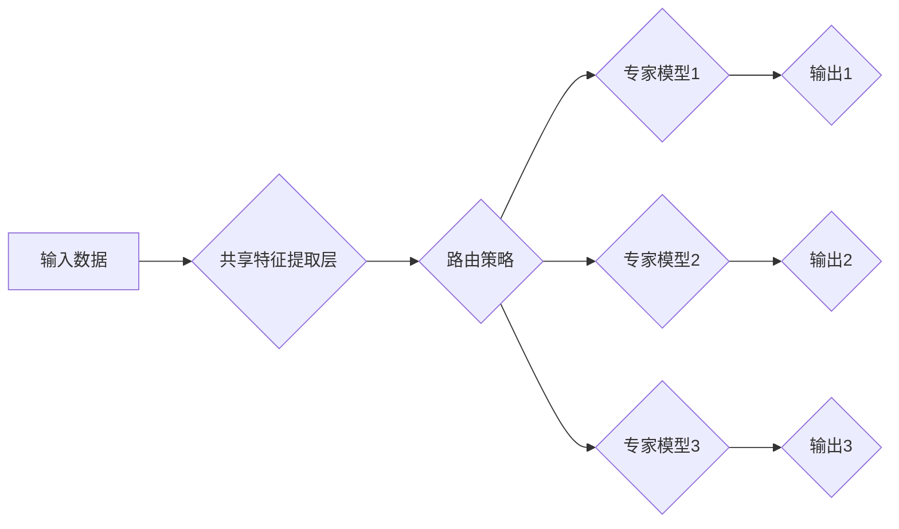

                 

## 多任务深度神经网络（MoE）：管理复杂任务

> 关键词：多任务学习，深度神经网络，专家模型，路由策略，模型效率，参数共享

## 1. 背景介绍

随着深度学习技术的蓬勃发展，深度神经网络（DNN）在图像识别、自然语言处理、语音识别等领域取得了显著的成就。然而，当面对多个相互关联的任务时，训练单个模型来处理所有任务往往效率低下，甚至可能导致模型泛化能力下降。

多任务学习（Multi-Task Learning，MTL）应运而生，它旨在训练一个共享参数的模型来同时学习多个相关任务。这种共享参数的机制可以有效地利用任务之间的相关性，提高模型的整体性能。然而，当任务数量众多且任务之间相关性较低时，传统的MTL方法可能会遇到以下问题：

* **过拟合:** 模型可能会过度拟合某些任务，导致在其他任务上的性能下降。
* **任务冲突:** 不同任务的目标函数可能相互冲突，导致模型难以兼顾所有任务的性能。
* **参数冗余:** 模型参数可能包含不必要的冗余信息，导致模型规模过大，训练成本高昂。

为了解决这些问题，**多任务深度神经网络（MoE）**应运而生。MoE是一种更灵活的MTL方法，它通过将多个专家模型进行组合，并使用路由策略动态地分配输入到不同的专家模型中，从而有效地管理复杂任务。

## 2. 核心概念与联系

MoE的核心概念是将多个专家模型进行组合，每个专家模型专注于学习特定的任务子集。这些专家模型共享底层特征提取层，但各自拥有独立的输出层，用于预测不同的任务。

**MoE的架构主要包含以下几个部分：**

* **共享特征提取层:** 用于提取输入数据的通用特征。
* **专家模型:** 每个专家模型专注于学习特定的任务子集。
* **路由策略:** 用于根据输入数据动态地分配到不同的专家模型。

**MoE架构流程图:**



**MoE的优势:**

* **提高模型效率:** 通过共享底层特征提取层，MoE可以有效地减少模型参数量，降低训练成本。
* **增强模型泛化能力:** 通过将多个专家模型进行组合，MoE可以更好地学习任务之间的相关性，从而提高模型的泛化能力。
* **灵活应对复杂任务:** 通过动态地分配输入到不同的专家模型中，MoE可以灵活地应对不同类型和复杂程度的任务。

## 3. 核心算法原理 & 具体操作步骤

### 3.1  算法原理概述

MoE的核心算法原理是将多个专家模型进行组合，并使用路由策略动态地分配输入到不同的专家模型中。

**路由策略**可以根据输入数据的特征进行选择，将数据分配到最合适的专家模型进行处理。常见的路由策略包括：

* **基于软路由:** 使用softmax函数将输入数据分配到不同专家模型的概率分布。
* **基于硬路由:** 根据输入数据的特征直接将数据分配到特定的专家模型。

**MoE的训练过程:**

1. **初始化:** 初始化共享特征提取层和每个专家模型的参数。
2. **前向传播:** 将输入数据输入到共享特征提取层，提取特征，然后根据路由策略将特征分配到不同的专家模型中。每个专家模型进行前向传播，输出预测结果。
3. **损失函数计算:** 计算每个专家模型的损失函数，并根据路由策略进行加权平均，得到最终的损失函数值。
4. **反向传播:** 使用梯度下降算法反向传播损失函数，更新共享特征提取层和每个专家模型的参数。
5. **重复步骤2-4:** 迭代训练模型，直到损失函数收敛。

### 3.2  算法步骤详解

1. **数据预处理:** 将输入数据进行预处理，例如归一化、编码等。
2. **构建MoE模型:** 定义共享特征提取层、专家模型和路由策略。
3. **初始化模型参数:** 使用随机初始化或预训练模型参数。
4. **训练模型:** 使用训练数据进行模型训练，迭代更新模型参数。
5. **评估模型性能:** 使用测试数据评估模型性能，例如准确率、召回率等。
6. **部署模型:** 将训练好的模型部署到实际应用场景中。

### 3.3  算法优缺点

**优点:**

* **提高模型效率:** 通过共享底层特征提取层，MoE可以有效地减少模型参数量，降低训练成本。
* **增强模型泛化能力:** 通过将多个专家模型进行组合，MoE可以更好地学习任务之间的相关性，从而提高模型的泛化能力。
* **灵活应对复杂任务:** 通过动态地分配输入到不同的专家模型中，MoE可以灵活地应对不同类型和复杂程度的任务。

**缺点:**

* **训练复杂度较高:** MoE的训练过程比传统的MTL方法更加复杂，需要考虑路由策略的优化。
* **模型规模较大:** 尽管MoE可以共享底层特征提取层，但多个专家模型的组合仍然会导致模型规模较大。
* **路由策略的选择:** 选择合适的路由策略对于MoE的性能至关重要，需要根据具体任务进行调整。

### 3.4  算法应用领域

MoE在以下领域具有广泛的应用前景:

* **自然语言处理:** 文本分类、情感分析、机器翻译等。
* **计算机视觉:** 图像识别、目标检测、图像分割等。
* **语音识别:** 语音转文本、语音合成等。
* **医疗诊断:** 病理图像分析、疾病预测等。
* **金融分析:** 欺诈检测、风险评估等。

## 4. 数学模型和公式 & 详细讲解 & 举例说明

### 4.1  数学模型构建

MoE的数学模型可以表示为一个多层神经网络，其中包含共享特征提取层和多个专家模型。

**共享特征提取层:** 使用卷积层、池化层和全连接层等构建，用于提取输入数据的通用特征。

**专家模型:** 每个专家模型都包含一个独立的输出层，用于预测特定的任务。

**路由策略:** 使用softmax函数或其他策略将输入数据分配到不同的专家模型。

### 4.2  公式推导过程

MoE的损失函数可以表示为所有专家模型损失函数的加权平均。

$$
L = \sum_{i=1}^{N} \alpha_i L_i
$$

其中:

* $L$ 是MoE的总损失函数。
* $N$ 是专家模型的数量。
* $\alpha_i$ 是第 $i$ 个专家模型的权重。
* $L_i$ 是第 $i$ 个专家模型的损失函数。

### 4.3  案例分析与讲解

假设我们有一个MoE模型，包含三个专家模型，分别用于预测文本分类、情感分析和机器翻译任务。

* **文本分类:** 专家模型1使用softmax函数将文本分类到不同的类别。
* **情感分析:** 专家模型2使用回归模型预测文本的情感倾向。
* **机器翻译:** 专家模型3使用序列到序列模型将文本翻译成另一种语言。

在训练过程中，MoE模型会根据输入文本的特征，使用路由策略将文本分配到不同的专家模型进行处理。例如，如果输入文本是一个新闻文章，则可能会分配到专家模型1进行文本分类，并分配到专家模型2进行情感分析。

## 5. 项目实践：代码实例和详细解释说明

### 5.1  开发环境搭建

MoE的开发环境搭建需要以下软件和工具:

* Python 3.x
* TensorFlow 或 PyTorch 深度学习框架
* CUDA 和 cuDNN GPU加速库

### 5.2  源代码详细实现

以下是一个使用TensorFlow实现MoE模型的简单代码示例:

```python
import tensorflow as tf

# 定义共享特征提取层
shared_features = tf.keras.Sequential([
    tf.keras.layers.Conv2D(32, (3, 3), activation='relu'),
    tf.keras.layers.MaxPooling2D((2, 2)),
    tf.keras.layers.Flatten()
])

# 定义专家模型
expert_model1 = tf.keras.Sequential([
    tf.keras.layers.Dense(64, activation='relu'),
    tf.keras.layers.Dense(10, activation='softmax')
])

expert_model2 = tf.keras.Sequential([
    tf.keras.layers.Dense(64, activation='relu'),
    tf.keras.layers.Dense(1, activation='sigmoid')
])

# 定义路由策略
def routing_strategy(features):
    # 使用softmax函数将输入分配到不同的专家模型
    probs = tf.nn.softmax(tf.keras.layers.Dense(2, activation='softmax')(features))
    return probs

# 定义MoE模型
def create_moe_model(input_shape):
    inputs = tf.keras.Input(shape=input_shape)
    shared_features = shared_features(inputs)
    probs = routing_strategy(shared_features)
    output1 = expert_model1(probs[0] * shared_features)
    output2 = expert_model2(probs[1] * shared_features)
    return tf.keras.Model(inputs=inputs, outputs=[output1, output2])

# 构建MoE模型
model = create_moe_model(input_shape=(28, 28, 1))

# 编译模型
model.compile(optimizer='adam', loss=['sparse_categorical_crossentropy', 'binary_crossentropy'])

# 训练模型
model.fit(x_train, [y_train_1, y_train_2], epochs=10)

# 评估模型性能
loss, accuracy1, accuracy2 = model.evaluate(x_test, [y_test_1, y_test_2])
```

### 5.3  代码解读与分析

* **共享特征提取层:** 使用卷积层、池化层和全连接层构建，用于提取输入数据的通用特征。
* **专家模型:** 每个专家模型都包含一个独立的输出层，用于预测特定的任务。
* **路由策略:** 使用softmax函数将输入数据分配到不同的专家模型。
* **MoE模型:** 将共享特征提取层和多个专家模型进行组合，并使用路由策略进行动态分配。

### 5.4  运行结果展示

训练完成后，可以评估MoE模型的性能，例如文本分类的准确率、情感分析的AUC值等。

## 6. 实际应用场景

MoE在实际应用场景中具有广泛的应用前景，例如:

* **医疗诊断:** MoE可以用于分析病理图像、预测疾病风险等。
* **金融分析:** MoE可以用于欺诈检测、风险评估等。
* **自然语言处理:** MoE可以用于文本分类、情感分析、机器翻译等。

### 6.4  未来应用展望

随着深度学习技术的不断发展，MoE的应用场景将会更加广泛。未来，MoE可能会应用于以下领域:

* **个性化推荐:** MoE可以根据用户的历史行为和偏好，推荐个性化的商品或服务。
* **自动驾驶:** MoE可以用于处理自动驾驶车辆的感知、决策和控制任务。
* **机器人学习:** MoE可以用于训练机器人进行复杂的任务，例如导航、抓取和交互。

## 7. 工具和资源推荐

### 7.1  学习资源推荐

* **书籍:**
    * Deep Learning by Ian Goodfellow, Yoshua Bengio, and Aaron Courville
    * Hands-On Machine Learning with Scikit-Learn, Keras & TensorFlow by Aurélien Géron
* **在线课程:**
    * Deep Learning Specialization by Andrew Ng (Coursera)
    * Fast.ai Practical Deep Learning for Coders

### 7.2  开发工具推荐

* **深度学习框架:** TensorFlow, PyTorch, Keras
* **编程语言:** Python
* **GPU加速库:** CUDA, cuDNN

### 7.3  相关论文推荐

* **Multi-Task Learning with Multi-Gate Networks**
* **Exploring the Limits of Transfer Learning with a Unified Text-to-Image Transformer**
* **BERT: Pre-training of Deep Bidirectional Transformers for Language Understanding**

## 8. 总结：未来发展趋势与挑战

### 8.1  研究成果总结

MoE是一种有效的多任务学习方法，它可以有效地管理复杂任务，提高模型效率和泛化能力。

### 8.2  未来发展趋势

* **更灵活的路由策略:** 研究更灵活、更有效的路由策略，例如基于注意力机制的路由策略。
* **动态专家模型:** 研究动态调整专家模型数量和结构的MoE模型。
* **跨模态MoE:** 研究跨模态数据的MoE模型，例如将文本、图像和音频等多种数据类型进行联合学习。

### 8.3  面临的挑战

* **训练复杂度:** MoE的训练过程比传统的MTL方法更加复杂，需要考虑路由策略的优化。
* **模型规模:** 尽管MoE可以共享底层特征提取层，但多个专家模型的组合仍然会导致模型规模较大。
* **数据需求:** MoE需要大量的多任务数据进行训练，这在某些领域可能难以获得。

### 8.4  研究展望

MoE在未来将继续是一个重要的研究方向，随着深度学习技术的不断发展，MoE的应用场景将会更加广泛，并取得更显著的成果。

## 9. 附录：常见问题与解答

**Q1: MoE与传统的MTL方法有什么区别？**

**A1:** MoE与传统的MTL方法的主要区别在于，MoE使用多个专家模型进行组合，并使用路由策略动态地分配输入到不同的专家模型中，而传统的MTL方法通常使用一个共享参数的模型来学习所有任务。

**Q2: 如何选择合适的路由策略？**

**A2:** 选择合适的路由策略取决于具体的任务和数据。常见的路由策略包括基于软路由和基于硬路由，需要根据实际情况进行选择。

**Q3: MoE的训练复杂度较高，如何降低训练复杂度？**

**A3:** 可以使用一些技巧来降低MoE的训练复杂度，例如使用预训练模型、使用梯度裁剪、使用异步更新等。

**作者：禅与计算机程序设计艺术 / Zen and the Art of Computer Programming**<end_of_turn>

