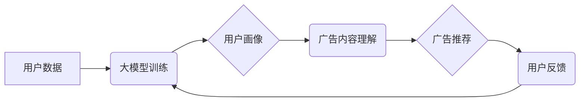

                 

## 大模型在个性化广告推荐中的潜力

> 关键词：大模型、个性化广告推荐、深度学习、Transformer、自然语言处理、推荐系统、用户画像

## 1. 背景介绍

在数字经济时代，广告营销已成为企业获取用户和提升品牌知名度的关键手段。然而，传统的广告投放方式往往缺乏针对性，导致广告效果不佳，资源浪费严重。个性化广告推荐技术应运而生，旨在根据用户的兴趣、行为、偏好等信息，精准推送与其相关的广告，从而提升广告点击率、转化率和用户体验。

近年来，深度学习技术取得了长足进步，特别是大模型的出现，为个性化广告推荐带来了新的机遇。大模型，指的是参数规模庞大、训练数据海量的人工智能模型，其强大的学习能力和泛化能力使其能够更好地理解用户需求和广告内容，从而实现更精准的广告推荐。

## 2. 核心概念与联系

### 2.1 个性化广告推荐

个性化广告推荐是指根据用户的个人特征和行为数据，为其推荐最相关的广告，以提高广告的点击率、转化率和用户体验。

### 2.2 大模型

大模型是指参数规模庞大、训练数据海量的人工智能模型。其强大的学习能力和泛化能力使其能够处理复杂的任务，例如自然语言处理、图像识别、语音合成等。

### 2.3 核心概念联系

大模型在个性化广告推荐中发挥着关键作用。其强大的学习能力能够从海量用户数据中挖掘出用户的兴趣偏好、行为模式等信息，构建精准的用户画像。同时，大模型也能理解广告内容的语义和情感，从而匹配用户需求，实现精准的广告推荐。

**Mermaid 流程图**



## 3. 核心算法原理 & 具体操作步骤

### 3.1 算法原理概述

大模型在个性化广告推荐中常用的算法主要包括：

* **深度神经网络 (DNN):** DNN 可以学习用户和广告之间的复杂关系，并根据学习到的特征进行推荐。
* **Transformer:** Transformer 是一种基于注意力机制的深度神经网络，能够更好地捕捉用户和广告之间的长距离依赖关系，从而实现更精准的推荐。
* **协同过滤 (CF):** CF 算法基于用户的历史行为数据，推荐与用户相似用户的喜好或与用户交互过的广告。

### 3.2 算法步骤详解

以 Transformer 为例，其在个性化广告推荐中的具体操作步骤如下：

1. **数据预处理:** 将用户数据和广告数据进行清洗、转换和编码，使其能够被 Transformer 模型理解。
2. **模型构建:** 根据 Transformer 的架构，构建一个包含多个编码器和解码器的模型。
3. **模型训练:** 使用训练数据训练 Transformer 模型，使其能够学习用户和广告之间的关系。
4. **模型评估:** 使用测试数据评估模型的性能，例如点击率、转化率等指标。
5. **模型部署:** 将训练好的模型部署到线上环境，用于实时进行广告推荐。

### 3.3 算法优缺点

**Transformer 算法的优点:**

* 能够捕捉用户和广告之间的长距离依赖关系。
* 训练效果优于传统的深度神经网络算法。

**Transformer 算法的缺点:**

* 训练成本高，需要大量的计算资源和训练数据。
* 模型复杂度高，部署和维护难度较大。

### 3.4 算法应用领域

Transformer 算法在个性化广告推荐领域有着广泛的应用，例如：

* **搜索广告推荐:** 根据用户的搜索关键词，推荐相关的广告。
* **内容广告推荐:** 根据用户的阅读历史和兴趣，推荐相关的广告。
* **社交媒体广告推荐:** 根据用户的社交关系和行为，推荐相关的广告。

## 4. 数学模型和公式 & 详细讲解 & 举例说明

### 4.1 数学模型构建

在个性化广告推荐中，常用的数学模型包括：

* **用户-广告交互矩阵:** 用来表示用户对不同广告的交互行为，例如点击、浏览、购买等。
* **用户特征向量:** 用来表示用户的兴趣、偏好、行为等特征。
* **广告特征向量:** 用来表示广告的内容、语义、目标受众等特征。

### 4.2 公式推导过程

以协同过滤算法为例，其目标是预测用户对广告的评分。假设用户 $u$ 对广告 $i$ 的评分为 $r_{ui}$，则可以使用以下公式进行预测:

$$
r_{ui} = \hat{r}_{ui} = \frac{\sum_{j \in N(u)} \frac{r_{uj} \cdot sim(u, j)}{\sum_{k \in N(u)} sim(u, k)}}{\sum_{j \in N(i)} \frac{r_{ij} \cdot sim(i, j)}{\sum_{k \in N(i)} sim(i, k)}}
$$

其中:

* $N(u)$ 和 $N(i)$ 分别表示用户 $u$ 和广告 $i$ 的邻居集合。
* $sim(u, j)$ 和 $sim(i, j)$ 分别表示用户 $u$ 和用户 $j$ 之间的相似度，以及广告 $i$ 和广告 $j$ 之间的相似度。

### 4.3 案例分析与讲解

假设用户 $u$ 和用户 $v$ 都对广告 $a$ 和广告 $b$ 进行了交互，并且 $sim(u, v)$ 为 0.8。则根据上述公式，我们可以预测用户 $u$ 对广告 $c$ 的评分，其中广告 $c$ 与广告 $a$ 和广告 $b$ 具有相似性。

## 5. 项目实践：代码实例和详细解释说明

### 5.1 开发环境搭建

* **操作系统:** Linux 或 macOS
* **编程语言:** Python
* **深度学习框架:** TensorFlow 或 PyTorch
* **其他工具:** Git、Jupyter Notebook

### 5.2 源代码详细实现

```python
import tensorflow as tf

# 定义用户-广告交互矩阵
user_item_matrix = tf.constant([[1, 0, 1, 0],
                                 [0, 1, 1, 1],
                                 [1, 1, 0, 1],
                                 [0, 1, 1, 0]])

# 定义用户特征向量
user_features = tf.constant([[0.5, 0.3, 0.2],
                            [0.2, 0.5, 0.3],
                            [0.3, 0.2, 0.5],
                            [0.2, 0.3, 0.5]])

# 定义广告特征向量
item_features = tf.constant([[0.4, 0.6, 0.2],
                            [0.6, 0.2, 0.2],
                            [0.2, 0.4, 0.4],
                            [0.3, 0.3, 0.4]])

# 定义模型
model = tf.keras.Sequential([
    tf.keras.layers.Dense(16, activation='relu'),
    tf.keras.layers.Dense(1, activation='sigmoid')
])

# 编译模型
model.compile(optimizer='adam', loss='binary_crossentropy', metrics=['accuracy'])

# 训练模型
model.fit(tf.concat([user_features, item_features], axis=1), user_item_matrix, epochs=10)

# 预测用户对广告的评分
predictions = model.predict(tf.concat([user_features, item_features], axis=1))
```

### 5.3 代码解读与分析

* 代码首先定义了用户-广告交互矩阵、用户特征向量和广告特征向量。
* 然后，定义了一个简单的深度神经网络模型，包含两个全连接层和一个 sigmoid 激活函数。
* 模型使用 Adam 优化器、二分类交叉熵损失函数和准确率作为评估指标进行训练。
* 训练完成后，可以使用模型预测用户对广告的评分。

### 5.4 运行结果展示

训练完成后，可以查看模型的训练日志和评估指标，例如准确率、损失函数值等。

## 6. 实际应用场景

### 6.1 搜索引擎广告推荐

搜索引擎广告推荐系统根据用户的搜索关键词，推荐与关键词相关的广告。大模型能够更好地理解用户的搜索意图，并推荐更精准的广告。

### 6.2 内容平台广告推荐

内容平台广告推荐系统根据用户的阅读历史和兴趣，推荐与用户相关的内容广告。大模型能够分析用户的阅读偏好，并推荐更符合用户兴趣的广告。

### 6.3 社交媒体广告推荐

社交媒体广告推荐系统根据用户的社交关系和行为，推荐与用户相关的广告。大模型能够分析用户的社交网络和行为模式，并推荐更精准的广告。

### 6.4 未来应用展望

大模型在个性化广告推荐领域的应用前景广阔，未来可能在以下方面得到进一步发展:

* **更精准的广告推荐:** 大模型能够更好地理解用户的需求和广告内容，从而实现更精准的广告推荐。
* **更个性化的广告体验:** 大模型能够根据用户的个性化需求，定制个性化的广告体验。
* **更有效的广告投放:** 大模型能够帮助广告主更有效地投放广告，提高广告效果。

## 7. 工具和资源推荐

### 7.1 学习资源推荐

* **书籍:**
    * Deep Learning by Ian Goodfellow, Yoshua Bengio, and Aaron Courville
    * Natural Language Processing with Python by Steven Bird, Ewan Klein, and Edward Loper
* **在线课程:**
    * TensorFlow Tutorials: https://www.tensorflow.org/tutorials
    * PyTorch Tutorials: https://pytorch.org/tutorials/

### 7.2 开发工具推荐

* **深度学习框架:** TensorFlow, PyTorch
* **数据处理工具:** Pandas, NumPy
* **机器学习库:** scikit-learn

### 7.3 相关论文推荐

* Attention Is All You Need (Vaswani et al., 2017)
* BERT: Pre-training of Deep Bidirectional Transformers for Language Understanding (Devlin et al., 2018)
* Transformer-XL: Attentive Language Modeling Beyond Millions of Tokens (Dai et al., 2019)

## 8. 总结：未来发展趋势与挑战

### 8.1 研究成果总结

大模型在个性化广告推荐领域取得了显著的成果，能够实现更精准、更个性化的广告推荐，提升广告效果和用户体验。

### 8.2 未来发展趋势

未来，大模型在个性化广告推荐领域将朝着以下方向发展:

* **模型规模和能力的提升:** 大模型的规模和能力将继续提升，能够更好地理解用户的需求和广告内容。
* **多模态广告推荐:** 大模型将融合文本、图像、视频等多模态数据，实现更全面的广告推荐。
* **隐私保护:** 大模型将更加注重用户隐私保护，实现隐私安全的广告推荐。

### 8.3 面临的挑战

大模型在个性化广告推荐领域也面临一些挑战:

* **训练成本:** 大模型的训练成本很高，需要大量的计算资源和训练数据。
* **模型复杂度:** 大模型的复杂度高，部署和维护难度较大。
* **数据质量:** 大模型的性能依赖于数据质量，需要高质量的数据进行训练。

### 8.4 研究展望

未来，需要进一步研究大模型在个性化广告推荐领域的应用，解决其面临的挑战，并探索其新的应用场景。


## 9. 附录：常见问题与解答

### 9.1 如何选择合适的深度学习框架？

选择深度学习框架需要根据具体项目需求进行考虑。TensorFlow 和 PyTorch 是目前最流行的深度学习框架，各有优缺点。

* **TensorFlow:** 
    * 优点: 
        * 稳定性高，社区活跃度高。
        * 支持多种硬件平台，包括 CPU、GPU 和 TPU。
    * 缺点: 
        * 学习曲线相对陡峭。
        * 代码可读性相对较差。
* **PyTorch:** 
    * 优点: 
        * 代码简洁易读，调试方便。
        * 支持动态计算图，更灵活。
    * 缺点: 
        * 稳定性相对较低。
        * 社区规模相对较小。

### 9.2 如何处理大规模的数据？

处理大规模的数据需要使用分布式训练技术，例如数据并行、模型并行等。

* **数据并行:** 将数据分割成多个部分，分别在不同的机器上进行训练。
* **模型并行:** 将模型分割成多个部分，分别在不同的机器上进行训练，然后将结果合并。

### 9.3 如何评估大模型的性能？

评估大模型的性能需要使用相应的指标，例如准确率、召回率、F1-score 等。

* **准确率:** 指的是模型正确预测的样本数占总样本数的比例。
* **召回率:** 指的是模型正确预测的正样本数占所有正样本数的比例。
* **F1-score:** 是准确率和召回率的调和平均数，综合考虑了模型的准确性和召回率。


作者：禅与计算机程序设计艺术 / Zen and the Art of Computer Programming 
<end_of_turn>

