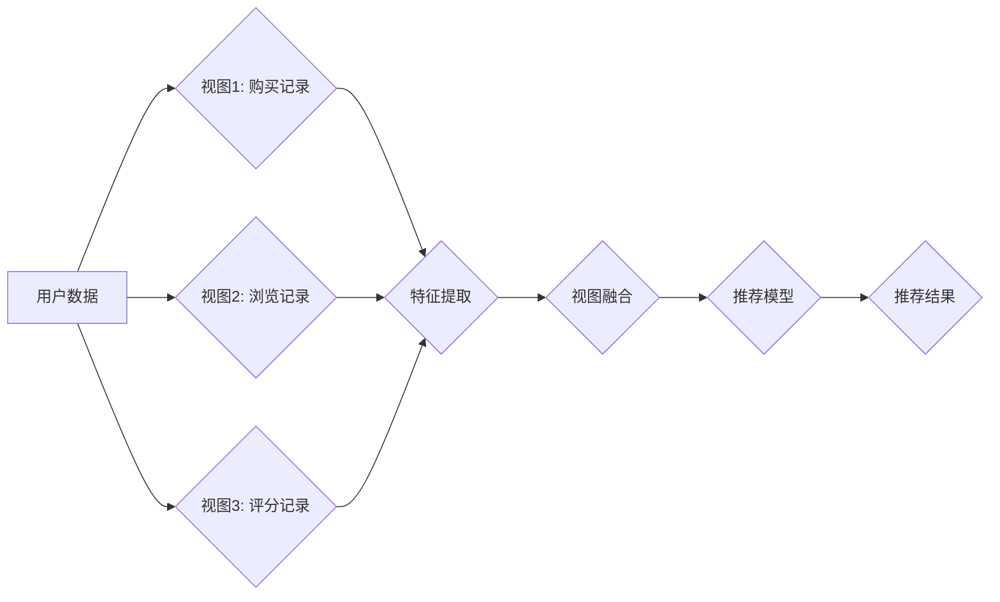

                 

## 大模型在推荐系统中的多视图学习应用

> 关键词：大模型、推荐系统、多视图学习、深度学习、用户行为、协同过滤、内容过滤

## 1. 背景介绍

推荐系统是信息时代的核心技术之一，旨在根据用户的历史行为、偏好和上下文信息，预测用户对特定物品的兴趣，并提供个性化的推荐结果。传统的推荐系统主要依赖于协同过滤和内容过滤等方法，但这些方法存在一些局限性，例如数据稀疏性、冷启动问题和数据单一性。

近年来，随着深度学习技术的快速发展，大模型在推荐系统领域展现出巨大的潜力。大模型具有海量参数和强大的学习能力，能够从海量数据中提取更丰富的特征和潜在关系，从而提升推荐系统的准确性和个性化程度。

多视图学习是近年来兴起的一种机器学习方法，它利用多个不同视角的数据源来训练模型，从而获得更全面的用户画像和更准确的推荐结果。例如，在推荐系统中，可以利用用户的历史购买记录、浏览记录、评分记录、社交关系等多视角数据来训练模型。

将大模型与多视图学习相结合，可以有效解决传统推荐系统面临的挑战，构建更智能、更精准的推荐系统。

## 2. 核心概念与联系

### 2.1 多视图学习

多视图学习是指利用多个不同视角的数据源来训练模型，从而获得更全面的用户画像和更准确的推荐结果。

**核心概念：**

* **视图：** 指不同视角的数据源，例如用户的历史购买记录、浏览记录、评分记录、社交关系等。
* **视图融合：** 指将多个视图的数据进行融合，形成更完整的用户特征。
* **多视图模型：** 指专门针对多视图数据的训练模型，能够有效利用不同视图之间的互补性。

**架构：**



### 2.2 大模型

大模型是指参数量巨大、训练数据量庞大的深度学习模型。

**核心概念：**

* **参数量：** 指模型中可学习的参数数量，通常以亿或十亿计。
* **训练数据量：** 指用于训练模型的数据量，通常以 TB 或 PB 计。
* **泛化能力：** 指模型在未见过的数据上也能表现良好的能力。

**优势：**

* 强大的学习能力，能够从海量数据中提取更丰富的特征和潜在关系。
* 泛化能力强，能够应用于多种不同的任务。
* 可迁移学习，可以将预训练模型应用于新的任务，降低训练成本。

## 3. 核心算法原理 & 具体操作步骤

### 3.1 算法原理概述

大模型在推荐系统中的多视图学习应用主要基于以下算法原理：

* **深度神经网络：** 利用多层神经网络结构，学习用户和物品之间的复杂关系。
* **视图融合：** 将不同视图的数据进行融合，形成更完整的用户特征。
* **注意力机制：** 赋予不同视图数据不同的权重，突出重要信息。

### 3.2 算法步骤详解

1. **数据预处理：** 将不同视图的数据进行清洗、转换和编码，使其能够被模型理解。
2. **特征提取：** 利用深度神经网络提取每个视图的数据特征。
3. **视图融合：** 将不同视图的特征进行融合，形成更完整的用户特征。
4. **模型训练：** 利用训练数据训练推荐模型，优化模型参数。
5. **模型评估：** 利用测试数据评估模型性能，并进行调参优化。
6. **推荐结果输出：** 根据用户的特征和模型预测，输出个性化的推荐结果。

### 3.3 算法优缺点

**优点：**

* 能够利用多个视图的数据，获得更全面的用户画像。
* 深度学习模型具有强大的学习能力，能够学习到更复杂的特征关系。
* 能够提升推荐系统的准确性和个性化程度。

**缺点：**

* 数据预处理和特征提取较为复杂。
* 模型训练需要大量的计算资源和时间。
* 需要大量的训练数据才能保证模型性能。

### 3.4 算法应用领域

大模型在推荐系统中的多视图学习应用广泛应用于以下领域：

* **电商推荐：** 根据用户的购买记录、浏览记录、评分记录等数据，推荐商品。
* **内容推荐：** 根据用户的阅读记录、观看记录、点赞记录等数据，推荐文章、视频、音乐等内容。
* **社交推荐：** 根据用户的社交关系、兴趣爱好等数据，推荐好友、群组等。
* **个性化教育推荐：** 根据学生的学习记录、考试成绩等数据，推荐学习资源和课程。

## 4. 数学模型和公式 & 详细讲解 & 举例说明

### 4.1 数学模型构建

假设我们有 $N$ 个用户，$M$ 个物品，以及 $K$ 个视图。每个用户 $u$ 在每个视图 $v$ 上都有一个特征向量 $x_{u,v}$。

**用户特征向量：**

$$
x_{u,v} = [x_{u,v,1}, x_{u,v,2}, ..., x_{u,v,d}]
$$

其中 $d$ 是特征向量的维度。

**推荐模型：**

$$
\hat{r}_{u,i} = f(x_{u,1}, x_{u,2}, ..., x_{u,K}, x_{i})
$$

其中 $\hat{r}_{u,i}$ 是模型预测的用户 $u$ 对物品 $i$ 的评分， $f$ 是一个神经网络模型。

### 4.2 公式推导过程

**视图融合：**

可以使用多种方法将不同视图的特征进行融合，例如：

* **简单平均：**

$$
x_{u} = \frac{1}{K} \sum_{v=1}^{K} x_{u,v}
$$

* **加权平均：**

$$
x_{u} = \sum_{v=1}^{K} w_{v} x_{u,v}
$$

其中 $w_{v}$ 是每个视图的权重。

**注意力机制：**

可以使用注意力机制来赋予不同视图数据不同的权重，突出重要信息。

$$
\alpha_{u,v} = \frac{exp(s_{u,v})}{\sum_{k=1}^{K} exp(s_{u,k})}
$$

$$
x_{u} = \sum_{v=1}^{K} \alpha_{u,v} x_{u,v}
$$

其中 $s_{u,v}$ 是用户 $u$ 在视图 $v$ 上的得分。

### 4.3 案例分析与讲解

假设我们有一个电商推荐系统，需要利用用户的购买记录、浏览记录和评分记录来推荐商品。

* **购买记录视图：** 用户购买过的商品ID。
* **浏览记录视图：** 用户浏览过的商品ID。
* **评分记录视图：** 用户对商品的评分。

我们可以使用上述算法原理和公式来构建一个多视图学习推荐模型。

首先，我们将每个视图的数据进行特征提取，例如将商品ID转换为商品embedding向量。然后，我们将不同视图的特征进行融合，形成更完整的用户特征。最后，我们将用户特征和商品特征输入到神经网络模型中，预测用户对商品的评分。

## 5. 项目实践：代码实例和详细解释说明

### 5.1 开发环境搭建

* Python 3.7+
* TensorFlow/PyTorch
* Jupyter Notebook

### 5.2 源代码详细实现

```python
import tensorflow as tf

# 定义用户特征向量
user_features = tf.keras.Input(shape=(10,))

# 定义商品特征向量
item_features = tf.keras.Input(shape=(10,))

# 定义视图融合层
merged_features = tf.keras.layers.Concatenate()([user_features, item_features])

# 定义推荐模型
prediction = tf.keras.layers.Dense(1, activation='sigmoid')(merged_features)

# 定义模型
model = tf.keras.Model(inputs=[user_features, item_features], outputs=prediction)

# 编译模型
model.compile(optimizer='adam', loss='binary_crossentropy', metrics=['accuracy'])

# 训练模型
model.fit(
    x=[user_train_features, item_train_features],
    y=train_labels,
    epochs=10,
    batch_size=32
)

# 预测结果
predictions = model.predict(
    x=[user_test_features, item_test_features]
)
```

### 5.3 代码解读与分析

* 代码首先定义了用户特征向量和商品特征向量。
* 然后，使用 `Concatenate` 层将不同视图的特征进行融合。
* 最后，使用 `Dense` 层构建推荐模型，并使用 `adam` 优化器、 `binary_crossentropy` 损失函数和 `accuracy` 指标进行训练。

### 5.4 运行结果展示

训练完成后，可以使用测试数据评估模型性能，例如计算准确率、召回率等指标。

## 6. 实际应用场景

### 6.1 电商推荐

大模型在电商推荐中的应用场景非常广泛，例如：

* **商品推荐：** 根据用户的购买记录、浏览记录、评分记录等数据，推荐商品。
* **个性化促销：** 根据用户的消费习惯和偏好，推送个性化的促销信息。
* **新品推荐：** 根据用户的兴趣爱好，推荐新品上市信息。

### 6.2 内容推荐

大模型在内容推荐中的应用场景也越来越广泛，例如：

* **新闻推荐：** 根据用户的阅读记录、点赞记录等数据，推荐新闻文章。
* **视频推荐：** 根据用户的观看记录、点赞记录等数据，推荐视频内容。
* **音乐推荐：** 根据用户的播放记录、收藏记录等数据，推荐音乐作品。

### 6.3 社交推荐

大模型在社交推荐中的应用场景主要包括：

* **好友推荐：** 根据用户的社交关系、兴趣爱好等数据，推荐新的好友。
* **群组推荐：** 根据用户的兴趣爱好、社交关系等数据，推荐合适的群组。
* **话题推荐：** 根据用户的兴趣爱好、社交关系等数据，推荐相关的热门话题。

### 6.4 未来应用展望

随着大模型技术的不断发展，其在推荐系统中的应用场景将会更加广泛，例如：

* **多模态推荐：** 利用文本、图像、音频等多模态数据进行推荐。
* **跨域推荐：** 将不同领域的知识和数据进行融合，实现跨域推荐。
* **个性化解释：** 为用户提供推荐结果的个性化解释，提升用户体验。

## 7. 工具和资源推荐

### 7.1 学习资源推荐

* **书籍：**
    * Deep Learning by Ian Goodfellow, Yoshua Bengio, and Aaron Courville
    * Hands-On Machine Learning with Scikit-Learn, Keras & TensorFlow by Aurélien Géron
* **课程：**
    * Deep Learning Specialization by Andrew Ng (Coursera)
    * Fast.ai Practical Deep Learning for Coders

### 7.2 开发工具推荐

* **TensorFlow:** https://www.tensorflow.org/
* **PyTorch:** https://pytorch.org/
* **Keras:** https://keras.io/

### 7.3 相关论文推荐

* **BERT: Pre-training of Deep Bidirectional Transformers for Language Understanding**
* **GPT-3: Language Models are Few-Shot Learners**
* **Multi-View Learning: A Survey**

## 8. 总结：未来发展趋势与挑战

### 8.1 研究成果总结

大模型在推荐系统中的多视图学习应用取得了显著的成果，能够有效提升推荐系统的准确性和个性化程度。

### 8.2 未来发展趋势

* **模型规模和能力的提升：** 随着计算资源的不断发展，大模型的规模和能力将会进一步提升，能够学习到更复杂的特征关系。
* **多模态学习的融合：** 将文本、图像、音频等多模态数据进行融合，构建更全面的用户画像。
* **跨域推荐的探索：** 将不同领域的知识和数据进行融合，实现跨域推荐。
* **个性化解释的增强：** 为用户提供推荐结果的个性化解释，提升用户体验。

### 8.3 面临的挑战

* **数据稀疏性和冷启动问题：** 许多推荐场景的数据是稀疏的，并且存在冷启动问题，需要开发新的算法和方法来解决这些问题。
* **模型训练成本和效率：** 大模型的训练成本和时间非常高，需要开发更有效的训练方法和硬件平台。
* **模型可解释性和公平性：** 大模型的决策过程往往是复杂的，难以解释，需要开发新的方法来提高模型的可解释性和公平性。

### 8.4 研究展望

未来，大模型在推荐系统中的应用将会更加广泛和深入，为用户提供更智能、更个性化的推荐体验。


## 9. 附录：常见问题与解答

**Q1：大模型的训练需要大量的计算资源，如何降低训练成本？**

A1：

* 使用预训练模型：利用现有的预训练模型，减少模型训练所需的时间和资源。
* 采用分布式训练：将模型训练任务分发到多个机器上进行并行训练，加速训练速度。
* 优化模型结构：设计更轻量级的模型结构，减少模型参数量，降低训练成本。

**Q2：大模型的决策过程难以解释，如何提高模型的可解释性？**

A2：

* 使用可解释性模型：选择可解释性更好的模型，例如线性模型或决策树。
* 结合注意力机制：利用注意力机制分析模型对哪些输入特征更加关注，从而解释模型的决策过程。
* 使用局部解释方法：对单个预测结果进行解释，例如使用LIME或SHAP等方法。


作者：禅与计算机程序设计艺术 / Zen and the Art of Computer Programming<end_of_turn>

