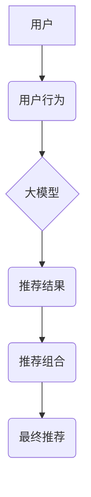

                 

## 大模型在推荐结果生成组合中的应用探索

> 关键词：大模型、推荐系统、结果组合、生成模型、Transformer、个性化推荐

## 1. 背景介绍

推荐系统作为信息过滤和个性化内容呈现的重要工具，在电商、社交媒体、视频平台等领域发挥着越来越重要的作用。传统的推荐系统主要依赖于协同过滤、内容过滤等方法，但这些方法在面对冷启动问题、数据稀疏性等挑战时表现有限。近年来，大模型的兴起为推荐系统带来了新的机遇。大模型凭借其强大的语义理解和文本生成能力，能够更好地捕捉用户偏好和内容特征，从而提升推荐结果的准确性和多样性。

大模型在推荐结果生成组合中的应用，旨在通过融合多源信息、生成多样化结果集，为用户提供更精准、更个性化的推荐体验。

## 2. 核心概念与联系

### 2.1  推荐结果生成组合

推荐结果生成组合是指将多个推荐模型的输出结果进行融合，生成最终的推荐结果集。通过组合不同模型的优势，可以弥补单个模型的不足，提升推荐结果的整体质量。

### 2.2  大模型

大模型是指参数规模庞大、训练数据海量的人工智能模型。大模型通常基于Transformer架构，能够学习到复杂的语义关系和模式，在自然语言处理、图像识别等领域表现出色。

### 2.3  关系图



**图 1：大模型在推荐结果生成组合中的应用关系图**

## 3. 核心算法原理 & 具体操作步骤

### 3.1  算法原理概述

大模型在推荐结果生成组合中的应用主要基于以下原理：

* **多模态融合:** 将文本、图像、视频等多模态数据输入大模型，学习到更丰富的用户和内容特征。
* **生成式推荐:** 利用大模型的文本生成能力，生成个性化的推荐描述、标题等，提升推荐结果的吸引力。
* **结果多样化:** 通过训练多个不同类型的推荐模型，并对模型输出进行组合，生成更具多样性的推荐结果集。

### 3.2  算法步骤详解

1. **数据预处理:** 收集用户行为数据、商品信息等数据，并进行清洗、转换、特征提取等预处理操作。
2. **模型训练:** 训练多个不同类型的推荐模型，例如基于用户的协同过滤模型、基于内容的推荐模型、基于图神经网络的推荐模型等。
3. **结果融合:** 将多个模型的输出结果进行融合，可以使用加权平均、投票机制、排序等方法。
4. **结果组合:** 对融合后的结果进行组合，生成最终的推荐结果集。可以根据用户偏好、场景需求等因素进行组合策略的调整。
5. **评估与优化:** 使用指标如准确率、召回率、NDCG等对推荐结果进行评估，并根据评估结果对模型参数、融合策略等进行优化。

### 3.3  算法优缺点

**优点:**

* 能够融合多源信息，提升推荐结果的准确性和多样性。
* 生成式推荐能够提升推荐结果的吸引力。
* 能够应对冷启动问题和数据稀疏性等挑战。

**缺点:**

* 训练大模型需要大量的计算资源和时间。
* 模型融合策略的选取需要经验和技巧。
* 评估指标的选取和优化需要深入的理解和分析。

### 3.4  算法应用领域

大模型在推荐结果生成组合中的应用可以应用于以下领域：

* **电商推荐:** 为用户推荐商品、优惠券、促销活动等。
* **社交媒体推荐:** 为用户推荐好友、话题、文章等。
* **视频平台推荐:** 为用户推荐视频、直播、节目等。
* **新闻推荐:** 为用户推荐新闻、资讯、博客等。

## 4. 数学模型和公式 & 详细讲解 & 举例说明

### 4.1  数学模型构建

假设我们有N个用户，M个商品，每个用户对每个商品的评分记为$r_{ui}$。我们的目标是构建一个模型，能够预测用户$u$对商品$i$的评分。

我们可以使用以下数学模型来表示用户对商品的评分预测：

$$
\hat{r}_{ui} = \mathbf{u}^T \mathbf{v}_i + b
$$

其中：

* $\hat{r}_{ui}$ 是模型预测的用户$u$对商品$i$的评分。
* $\mathbf{u}$ 是用户$u$的特征向量。
* $\mathbf{v}_i$ 是商品$i$的特征向量。
* $b$ 是一个偏差项。

### 4.2  公式推导过程

这个模型的推导过程基于矩阵分解的思想。我们假设用户特征向量和商品特征向量都存在于一个低维空间中，通过计算它们的内积，可以得到用户对商品的评分预测。

### 4.3  案例分析与讲解

例如，假设我们有一个电商平台，有1000个用户和10000个商品。我们可以使用大模型训练用户和商品的特征向量，然后使用上述公式来预测用户对商品的评分。

## 5. 项目实践：代码实例和详细解释说明

### 5.1  开发环境搭建

* Python 3.7+
* TensorFlow 2.x 或 PyTorch 1.x
* CUDA 和 cuDNN (可选，用于GPU加速)

### 5.2  源代码详细实现

```python
import tensorflow as tf

# 定义用户和商品的特征向量
user_embedding = tf.Variable(tf.random.normal([1000, 64]))
item_embedding = tf.Variable(tf.random.normal([10000, 64]))

# 定义评分预测函数
def predict_rating(user_id, item_id):
  user_vector = user_embedding[user_id]
  item_vector = item_embedding[item_id]
  return tf.reduce_sum(user_vector * item_vector)

# 使用训练数据训练模型
# ...

# 使用训练好的模型预测用户对商品的评分
user_id = 0
item_id = 100
predicted_rating = predict_rating(user_id, item_id)
print(f"Predicted rating for user {user_id} and item {item_id}: {predicted_rating}")
```

### 5.3  代码解读与分析

* 我们使用TensorFlow库定义了用户和商品的特征向量，并使用矩阵乘法来计算用户对商品的评分预测。
* 训练模型的过程需要使用训练数据，并通过优化算法来调整模型参数，使得模型的预测结果与实际评分尽可能接近。
* 运行结果展示了模型预测的用户对商品的评分。

### 5.4  运行结果展示

运行结果将显示模型预测的用户对商品的评分。

## 6. 实际应用场景

### 6.1  电商推荐

大模型在电商推荐中可以用于个性化商品推荐、跨界推荐、新品推荐等场景。例如，可以根据用户的浏览历史、购买记录、评价等信息，推荐用户可能感兴趣的商品。

### 6.2  社交媒体推荐

大模型可以用于社交媒体推荐好友、话题、文章等。例如，可以根据用户的兴趣爱好、社交关系等信息，推荐用户可能感兴趣的朋友或话题。

### 6.3  视频平台推荐

大模型可以用于视频平台推荐视频、直播、节目等。例如，可以根据用户的观看历史、点赞记录、评论等信息，推荐用户可能感兴趣的视频。

### 6.4  未来应用展望

随着大模型技术的不断发展，其在推荐结果生成组合中的应用将更加广泛和深入。例如，可以利用大模型生成更个性化的推荐描述、标题等，提升推荐结果的吸引力。还可以利用大模型进行多模态融合，例如将文本、图像、视频等多模态数据融合在一起，生成更精准的推荐结果。

## 7. 工具和资源推荐

### 7.1  学习资源推荐

* **书籍:**
    * 《深度学习》
    * 《自然语言处理》
    * 《推荐系统》
* **在线课程:**
    * Coursera: 深度学习
    * Udacity: 自然语言处理
    * fast.ai: 深度学习

### 7.2  开发工具推荐

* **TensorFlow:** 开源深度学习框架
* **PyTorch:** 开源深度学习框架
* **Hugging Face Transformers:** 大模型库

### 7.3  相关论文推荐

* **BERT: Pre-training of Deep Bidirectional Transformers for Language Understanding**
* **GPT-3: Language Models are Few-Shot Learners**
* **DALL-E: Creating Images from Text**

## 8. 总结：未来发展趋势与挑战

### 8.1  研究成果总结

大模型在推荐结果生成组合中的应用取得了显著的成果，能够提升推荐结果的准确性和多样性。

### 8.2  未来发展趋势

* **模型规模和能力的提升:** 未来大模型的规模和能力将继续提升，能够学习到更复杂的语义关系和模式。
* **多模态融合的深入研究:** 将文本、图像、视频等多模态数据融合在一起，生成更精准的推荐结果。
* **个性化推荐的增强:** 利用大模型生成更个性化的推荐描述、标题等，提升推荐结果的吸引力。

### 8.3  面临的挑战

* **计算资源和训练成本:** 训练大模型需要大量的计算资源和时间，成本较高。
* **模型解释性和可解释性:** 大模型的内部机制复杂，难以解释其推荐结果的生成过程。
* **数据隐私和安全:** 大模型的训练需要大量用户数据，如何保护用户数据隐私和安全是一个重要的挑战。

### 8.4  研究展望

未来，大模型在推荐结果生成组合中的应用将继续深入发展，为用户提供更精准、更个性化的推荐体验。


## 9. 附录：常见问题与解答

**Q1: 大模型的训练需要多少计算资源？**

A1: 大模型的训练需要大量的计算资源，例如数百甚至数千个GPU。

**Q2: 如何评估大模型的推荐效果？**

A2: 可以使用指标如准确率、召回率、NDCG等来评估大模型的推荐效果。

**Q3: 如何解决大模型的解释性和可解释性问题？**

A3: 可以使用可解释机器学习方法，例如LIME、SHAP等，来解释大模型的推荐结果。


作者：禅与计算机程序设计艺术 / Zen and the Art of Computer Programming 
<end_of_turn>

