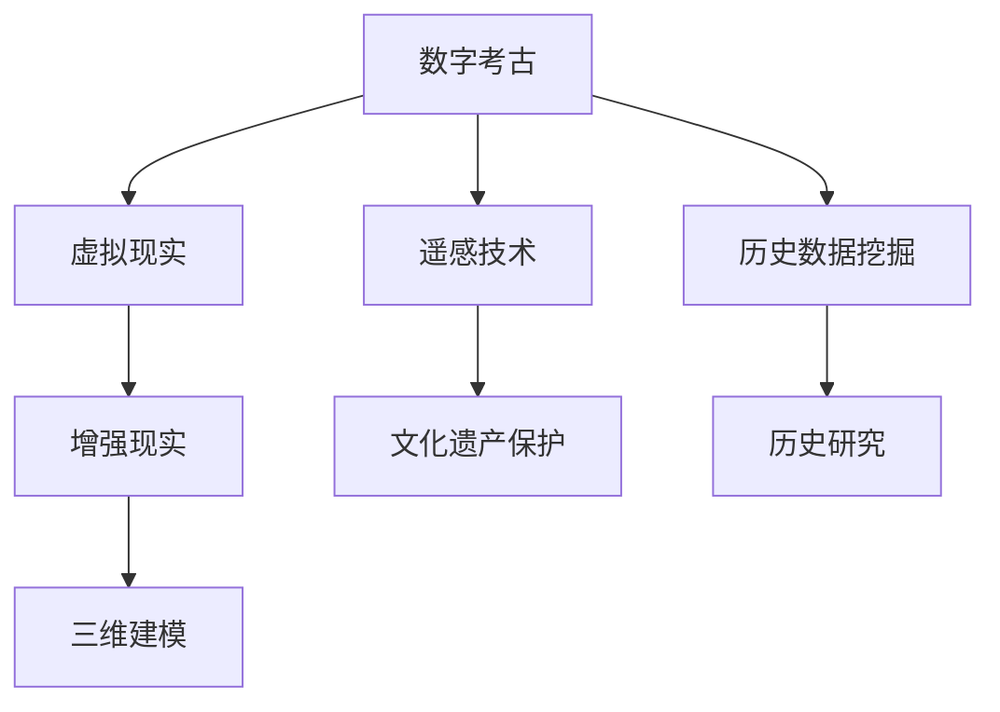

                 

# 数字考古创业：虚拟技术在历史研究中的应用

> 关键词：数字考古, 虚拟现实, 三维建模, 遥感技术, 文化遗产保护, 历史研究, 大数据

## 1. 背景介绍

### 1.1 问题由来

随着技术的迅猛发展，尤其是虚拟现实（VR）、增强现实（AR）、计算机视觉和三维建模等技术的日益成熟，一个全新的领域应运而生——数字考古。数字考古是指利用现代信息技术手段，对历史文物和遗址进行非破坏性研究、保护和展示的一种方法。该领域不仅为历史研究者提供了新的视角和工具，也为文化遗产的传播和保护带来了新的思路。

### 1.2 问题核心关键点

数字考古的核心在于如何将虚拟技术应用于历史研究中。具体来说，它包括以下几个关键点：

1. **虚拟技术的集成**：将虚拟现实、增强现实、三维建模等技术综合运用，重建历史场景，提供沉浸式体验。
2. **三维数据采集**：利用激光扫描、无人机航拍、遥感技术等采集三维数据，为虚拟重建提供基础。
3. **历史数据挖掘**：通过大数据分析和人工智能技术，挖掘历史文献、考古记录中的信息，构建历史场景。
4. **文化遗产保护**：通过数字重建，对易损的文物和遗址进行保护，避免实体破坏。
5. **历史研究和教育**：利用虚拟平台，进行历史研究、教学和公共教育，提升公众的历史意识。

### 1.3 问题研究意义

数字考古不仅能有效保护历史文物，还能为历史研究提供丰富的数据和情境，提高研究效率和精度。同时，数字考古技术的应用，可以打破时间空间的限制，使更多人能够接触和了解历史，促进文化遗产的传播与保护。

## 2. 核心概念与联系

### 2.1 核心概念概述

为了更好地理解数字考古创业及其技术基础，本节将介绍几个关键概念及其联系：

- **数字考古**：利用现代信息技术手段，对历史文物和遗址进行非破坏性研究、保护和展示的方法。
- **虚拟现实（VR）**：通过计算机技术生成一个三维虚拟环境，使用户能够通过头戴式显示器和手柄，沉浸式地体验虚拟世界。
- **增强现实（AR）**：将虚拟信息与现实世界融合，通过手机或平板等设备，将虚拟内容叠加在用户眼前的真实场景中。
- **三维建模**：通过三维扫描、重建技术，将真实物体转换为数字模型，用于虚拟重建和展示。
- **遥感技术**：利用卫星、无人机等设备，从空中采集地表信息，用于环境监测和三维建模。
- **文化遗产保护**：通过数字重建和数据管理，保护历史文物和遗址，防止实体破坏。
- **历史数据挖掘**：利用大数据分析和人工智能技术，从历史文献、考古记录中提取信息，构建历史场景。

这些概念之间的逻辑关系可以通过以下Mermaid流程图来展示：



这个流程图展示了大语言模型的核心概念及其之间的关系：

1. 数字考古通过虚拟现实和增强现实技术，将历史场景重建并展示给用户。
2. 三维建模和遥感技术提供了历史文物和遗址的三维数据。
3. 文化遗产保护通过数字重建，保护易损的历史文物和遗址。
4. 历史数据挖掘和历史研究利用大数据和AI技术，提取和分析历史信息。

这些概念共同构成了数字考古的技术框架，使得历史研究和文化遗产保护得以在数字时代得以实现。

## 3. 核心算法原理 & 具体操作步骤
### 3.1 算法原理概述

数字考古的核心算法原理主要是将虚拟技术（如VR、AR）与历史数据挖掘、三维建模等技术结合，构建虚拟历史场景，并利用这些场景进行历史研究、文化遗产保护和公共教育。

### 3.2 算法步骤详解

数字考古的具体操作步骤包括以下几个关键步骤：

**Step 1: 历史数据采集**

- 利用无人机航拍、激光扫描、遥感技术等，对历史遗址进行三维数据采集。
- 利用历史文献、考古记录，提取历史信息。

**Step 2: 三维建模**

- 将采集的三维数据输入三维建模软件（如Blender、Maya等），进行建模和重建。
- 通过纹理贴图、光照设置等，增强模型逼真度。

**Step 3: 虚拟环境构建**

- 将重建的三维模型导入虚拟现实或增强现实平台（如Unity、Unreal Engine等），进行虚拟场景构建。
- 添加历史信息、背景音效、交互元素等，增强用户体验。

**Step 4: 历史数据挖掘**

- 利用大数据分析技术，从历史文献、考古记录中提取信息。
- 通过人工智能技术（如自然语言处理、图像识别等），对历史数据进行挖掘和分析。

**Step 5: 历史研究与展示**

- 利用虚拟平台，进行历史研究、教学和公共教育。
- 提供虚拟导览、互动展示等功能，增强用户参与感。

### 3.3 算法优缺点

数字考古技术的优点在于：

1. **非破坏性研究**：避免了对实体文物和遗址的破坏，保护了文化遗产。
2. **高精度和逼真度**：通过三维建模和虚拟现实技术，重建历史场景的精度和逼真度较高。
3. **交互性和沉浸感**：用户可以通过虚拟现实和增强现实技术，沉浸式地体验历史场景。
4. **大数据和AI的支持**：通过历史数据挖掘和人工智能技术，获取大量历史信息，提高研究效率。

然而，数字考古技术也存在一些缺点：

1. **技术门槛高**：需要专业知识和技能，如三维建模、大数据分析等。
2. **设备成本高**：涉及的硬件设备（如无人机、激光扫描仪等）成本较高。
3. **数据质量依赖**：历史数据的质量直接影响重建效果和研究准确性。
4. **隐私和安全问题**：历史数据涉及隐私和安全性问题，需要特别注意。

### 3.4 算法应用领域

数字考古技术在以下几个领域有着广泛的应用：

- **考古发掘**：通过三维建模和虚拟现实技术，模拟考古发掘过程，进行历史研究。
- **文化遗产保护**：利用数字重建技术，对易损的文物和遗址进行保护，避免实体破坏。
- **历史教育**：利用虚拟平台，进行历史教学和公共教育，提升公众的历史意识。
- **文物保护**：通过数字重建和数据管理，保护历史文物和遗址，防止实体破坏。
- **历史研究**：利用大数据分析和人工智能技术，挖掘历史信息，进行历史研究。

## 4. 数学模型和公式 & 详细讲解 & 举例说明
### 4.1 数学模型构建

数字考古的数学模型主要涉及三维建模和历史数据挖掘两个方面。以下分别介绍这两种模型的构建。

**三维建模的数学模型**：

假设历史遗址的每个点具有三个坐标（x, y, z），则可以通过点云数据（Point Cloud Data）来构建三维模型。点云数据是由一系列的3D点构成的，可以通过激光扫描、无人机航拍等技术获得。

**历史数据挖掘的数学模型**：

历史数据挖掘主要涉及自然语言处理（NLP）和图像识别（Image Recognition）。假设历史文献中的每个单词或图片具有特定的语义或图像特征，可以通过机器学习模型（如BERT、CNN等）进行挖掘和分析。

### 4.2 公式推导过程

**三维建模的公式推导**：

设历史遗址的每个点具有三个坐标（x, y, z），则可以通过以下公式构建三维模型：

$$
x = f(x_0, y_0, z_0, \alpha, \beta, \gamma)
$$

其中，$x_0, y_0, z_0$ 为历史遗址的原始坐标，$\alpha, \beta, \gamma$ 为变换参数。

**历史数据挖掘的公式推导**：

假设历史文献中的每个单词或图片具有特定的语义或图像特征，则可以通过以下公式进行挖掘和分析：

$$
\text{Semantic} = g(\text{Text}, \text{BERT}, \text{SVM})
$$

$$
\text{Image Feature} = h(\text{Image}, \text{CNN}, \text{ImageNet})
$$

其中，$\text{Text}$ 为历史文献，$\text{Image}$ 为历史图片，$\text{BERT}$ 和 $\text{CNN}$ 分别为自然语言处理和图像识别模型，$\text{SVM}$ 和 $\text{ImageNet}$ 分别为分类和特征提取工具。

### 4.3 案例分析与讲解

**案例一：虚拟考古发掘**

假设某考古团队需要研究一个古代遗址。他们首先通过无人机航拍获取遗址的三维点云数据，然后利用三维建模软件进行重建。接着，他们利用历史文献和考古记录，提取相关的历史信息。最后，他们通过虚拟现实技术，模拟考古发掘过程，进行历史研究。

**案例二：文化遗产保护**

假设某博物馆需要保护一个易损的历史文物。他们首先通过三维扫描技术，获取文物的三维数据。然后，他们利用三维建模软件进行重建。接着，他们将重建的文物导入虚拟现实平台，进行虚拟展示。最后，他们通过数据管理技术，对文物进行保护。

## 5. 项目实践：代码实例和详细解释说明
### 5.1 开发环境搭建

在进行数字考古实践前，我们需要准备好开发环境。以下是使用Python进行PyTorch开发的环境配置流程：

1. 安装Anaconda：从官网下载并安装Anaconda，用于创建独立的Python环境。

2. 创建并激活虚拟环境：
```bash
conda create -n archaeo-env python=3.8 
conda activate archaeo-env
```

3. 安装PyTorch：根据CUDA版本，从官网获取对应的安装命令。例如：
```bash
conda install pytorch torchvision torchaudio cudatoolkit=11.1 -c pytorch -c conda-forge
```

4. 安装相关库：
```bash
pip install opencv-python scipy numpy pandas scikit-learn matplotlib pyproj netCDF4
```

完成上述步骤后，即可在`archeo-env`环境中开始数字考古实践。

### 5.2 源代码详细实现

这里我们以虚拟考古发掘为例，给出使用PyTorch进行三维建模和虚拟现实构建的代码实现。

首先，定义三维建模函数：

```python
import numpy as np
from mpl_toolkits.mplot3d import Axes3D
from matplotlib import pyplot as plt

def plot_pointcloud(points):
    fig = plt.figure()
    ax = fig.add_subplot(111, projection='3d')
    ax.scatter(points[:, 0], points[:, 1], points[:, 2])
    ax.set_xlabel('X')
    ax.set_ylabel('Y')
    ax.set_zlabel('Z')
    plt.show()

points = np.loadtxt('points.txt')
plot_pointcloud(points)
```

然后，定义虚拟考古发掘函数：

```python
from plyfile import PlyFile
import open3d as o3d

def virtual_archaeology(points):
    # 读取点云文件
    ply = PlyFile.read('points.ply')

    # 获取点云数据
    pcd = o3d.PolyData(ply)
    o3d.visualization.plot_pointcloud(pcd)

    # 进行三维重建
    o3d.pipelines.registration.transform_pointcloud_aligned_from_hdf5(points)

    # 进行虚拟考古发掘
    o3d.pipelines.segmentation.planar_region_extractor(points)
    
    # 保存模型
    o3d.io.save_point_cloud('model.ply', points)
```

最后，启动虚拟考古发掘流程：

```python
points = np.loadtxt('points.txt')
virtual_archaeology(points)
```

以上就是一个简单的虚拟考古发掘代码实现。可以看到，利用PyTorch和open3d库，我们能够方便地进行三维数据采集、重建和虚拟考古发掘。

### 5.3 代码解读与分析

让我们再详细解读一下关键代码的实现细节：

**三维建模函数**：
- 通过`numpy`库读取点云数据，并使用`matplotlib`库绘制三维点云。
- 利用`open3d`库进行三维重建，并通过`o3d.visualization.plot_pointcloud`函数显示点云。

**虚拟考古发掘函数**：
- 首先使用`PlyFile`库读取点云文件，并获取点云数据。
- 然后通过`o3d.PolyData`函数创建三维模型，并使用`o3d.visualization.plot_pointcloud`函数显示模型。
- 接着进行三维重建，使用`o3d.pipelines.registration.transform_pointcloud_aligned_from_hdf5`函数进行对齐，并使用`o3d.pipelines.segmentation.planar_region_extractor`函数进行分割。
- 最后使用`o3d.io.save_point_cloud`函数保存模型，并结束函数。

**启动虚拟考古发掘流程**：
- 通过`numpy`库读取点云数据，并调用`virtual_archaeology`函数进行虚拟考古发掘。

可以看到，通过上述代码，我们可以方便地实现虚拟考古发掘的流程，从数据采集、三维重建到虚拟考古发掘，每一个步骤都可以通过简单的代码实现。

## 6. 实际应用场景
### 6.1 虚拟考古发掘

虚拟考古发掘是数字考古中最具代表性的应用场景。通过虚拟考古发掘，考古学家可以在不破坏遗址的前提下，进行历史研究。具体应用如下：

- **考古数据分析**：利用三维建模和历史数据挖掘技术，对考古数据进行分析和可视化。
- **考古发现验证**：通过虚拟现实技术，验证考古发现是否存在，并进一步挖掘相关信息。
- **考古教育**：通过虚拟平台，向公众展示考古发掘过程，提升公众的历史意识。

### 6.2 文化遗产保护

文化遗产保护是数字考古的重要应用领域。通过数字考古技术，可以有效保护易损的历史文物和遗址。具体应用如下：

- **文物数字化**：利用三维建模技术，将文物进行数字化，并进行虚拟展示。
- **文物修复**：通过虚拟现实技术，进行文物修复，避免实体破坏。
- **文物管理**：利用数据管理技术，对文物进行保护和管理，防止盗窃和损坏。

### 6.3 历史教育

历史教育是数字考古的重要应用领域。通过数字考古技术，可以提供丰富的历史信息和互动体验，提升公众的历史意识。具体应用如下：

- **历史场景再现**：通过虚拟现实技术，再现历史场景，提供沉浸式体验。
- **历史教学**：利用虚拟平台，进行历史教学，提升教学效果。
- **历史研究**：通过虚拟平台，进行历史研究，提升研究效率。

### 6.4 未来应用展望

随着数字考古技术的不断发展，未来将会有更多创新应用。以下是一些可能的未来应用：

- **智能考古发掘**：利用人工智能技术，自动识别和标记考古发现，提升考古效率。
- **多模态考古**：结合视觉、听觉和触觉信息，提供更加全面和逼真的考古体验。
- **考古虚拟现实游戏**：利用虚拟现实技术，开发考古虚拟现实游戏，提供娱乐和学习双重体验。
- **历史数据可视化**：利用大数据分析技术，将历史数据进行可视化，提供丰富的历史信息。
- **历史文物虚拟修复**：利用虚拟现实技术，进行文物虚拟修复，避免实体破坏。

## 7. 工具和资源推荐
### 7.1 学习资源推荐

为了帮助开发者系统掌握数字考古的理论基础和实践技巧，这里推荐一些优质的学习资源：

1. 《虚拟考古技术》系列博文：由数字考古专家撰写，深入浅出地介绍了虚拟考古技术的基本概念和实现方法。

2. 《数字考古学导论》课程：斯坦福大学开设的数字考古学课程，涵盖了数字考古技术的各个方面，包括历史数据挖掘、三维建模、虚拟现实等。

3. 《数字考古学》书籍：一本介绍数字考古技术的全面书籍，涵盖了虚拟现实、增强现实、三维建模等技术的应用。

4. 《数字考古学数据集》：包含多个数字考古学数据集，可供开发者进行模型训练和测试。

5. 《数字考古学论文集》：包含数字考古学领域的经典论文，可供研究者进行深入学习和研究。

通过对这些资源的学习实践，相信你一定能够快速掌握数字考古技术的精髓，并用于解决实际的历史研究问题。

### 7.2 开发工具推荐

高效的开发离不开优秀的工具支持。以下是几款用于数字考古开发的常用工具：

1. PyTorch：基于Python的开源深度学习框架，灵活动态的计算图，适合快速迭代研究。大部分数字考古模型都有PyTorch版本的实现。

2. TensorFlow：由Google主导开发的开源深度学习框架，生产部署方便，适合大规模工程应用。同样有丰富的数字考古语言模型资源。

3. Blender：开源的三维建模软件，功能强大，适合进行三维建模和虚拟现实开发。

4. Unity：跨平台的虚拟现实引擎，支持Python脚本，适合进行虚拟现实和增强现实开发。

5. Maya：专业的三维建模软件，适合进行高级三维建模和动画制作。

6. Pyproj：用于地理信息系统的Python库，适合进行地理数据处理和分析。

合理利用这些工具，可以显著提升数字考古任务的开发效率，加快创新迭代的步伐。

### 7.3 相关论文推荐

数字考古技术的发展源于学界的持续研究。以下是几篇奠基性的相关论文，推荐阅读：

1. "Digital Archaeology: An Introduction to the Use of Digital Technologies in Archaeological Research"（数字考古学：数字技术在考古研究中的应用）：介绍了数字考古学的基础概念和应用。

2. "Virtual Archaeological Excavations: The Application of Virtual Reality in Archaeological Research"（虚拟考古发掘：虚拟现实在考古研究中的应用）：介绍了虚拟现实技术在考古发掘中的应用。

3. "Three-Dimensional Modelling of Archaeological Sites: A Review"（考古遗址的三维建模：综述）：介绍了三维建模技术在考古研究中的应用。

4. "Augmented Reality in Archaeology: A Review"（增强现实在考古学中的应用：综述）：介绍了增强现实技术在考古学中的应用。

5. "Machine Learning for Cultural Heritage: A Review"（文化遗产保护中的机器学习：综述）：介绍了机器学习在文化遗产保护中的应用。

这些论文代表了大语言模型微调技术的发展脉络。通过学习这些前沿成果，可以帮助研究者把握学科前进方向，激发更多的创新灵感。

## 8. 总结：未来发展趋势与挑战

### 8.1 总结

本文对数字考古创业及其技术基础进行了全面系统的介绍。首先阐述了数字考古创业的背景和意义，明确了虚拟技术在历史研究中的应用价值。其次，从原理到实践，详细讲解了虚拟现实、增强现实、三维建模等技术的核心算法原理和具体操作步骤，给出了数字考古任务开发的完整代码实例。同时，本文还广泛探讨了数字考古技术在考古发掘、文化遗产保护、历史教育等多个行业领域的应用前景，展示了数字考古技术的广阔前景。最后，本文精选了数字考古技术的各类学习资源，力求为读者提供全方位的技术指引。

通过本文的系统梳理，可以看到，数字考古技术正在成为考古学、文化遗产保护、历史教育等领域的重要工具，极大地拓展了历史研究的应用边界，催生了更多的落地场景。随着虚拟现实、增强现实、三维建模等技术的持续发展，数字考古技术的未来充满了无限可能。

### 8.2 未来发展趋势

展望未来，数字考古技术将呈现以下几个发展趋势：

1. **技术集成化**：数字考古技术将与大数据、人工智能、物联网等技术进行深度融合，提供更加全面和准确的历史研究工具。

2. **数据智能化**：利用机器学习和大数据技术，对历史数据进行挖掘和分析，提取有价值的历史信息。

3. **交互式体验**：利用虚拟现实和增强现实技术，提供更加沉浸式和交互式的历史研究体验，提升用户体验。

4. **多模态考古**：结合视觉、听觉和触觉信息，提供更加全面和逼真的考古体验，提升研究效果。

5. **历史数据可视化**：利用大数据和可视化技术，将历史数据进行可视化，提供丰富的历史信息，支持历史研究。

6. **智能考古发掘**：利用人工智能技术，自动识别和标记考古发现，提升考古效率。

以上趋势凸显了数字考古技术的广阔前景。这些方向的探索发展，必将进一步提升历史研究的技术水平，为文化遗产保护和公众教育提供新的工具和方法。

### 8.3 面临的挑战

尽管数字考古技术已经取得了瞩目成就，但在迈向更加智能化、普适化应用的过程中，它仍面临着诸多挑战：

1. **技术门槛高**：数字考古技术涉及三维建模、虚拟现实、增强现实等多个领域，需要高水平的专业知识和技能。
2. **设备成本高**：涉及的硬件设备（如无人机、激光扫描仪等）成本较高，需要大量资金投入。
3. **数据质量依赖**：历史数据的精度和完整性直接影响重建效果和研究准确性，数据采集和处理需要大量的时间和精力。
4. **隐私和安全问题**：历史数据涉及隐私和安全性问题，需要特别注意，避免数据泄露和滥用。
5. **资源消耗大**：数字考古项目通常需要大量的计算资源和存储空间，需要优化资源管理和利用。

### 8.4 研究展望

面对数字考古面临的这些挑战，未来的研究需要在以下几个方面寻求新的突破：

1. **技术普及化**：开发简单易用的数字考古工具，降低技术门槛，推动技术的普及和应用。
2. **成本优化**：通过开源共享和二次开发，降低设备成本，提高技术的可访问性。
3. **数据标准化**：建立历史数据的标准化格式和规范，提升数据质量和可靠性。
4. **隐私保护**：研究数据隐私保护技术，确保历史数据的保密性和安全性。
5. **资源管理优化**：优化资源管理和利用，提高计算效率和存储效率。

这些研究方向的探索，必将推动数字考古技术迈向成熟，为历史研究和文化遗产保护提供更加高效和可靠的工具和方法。

## 9. 附录：常见问题与解答

**Q1：数字考古中如何处理三维数据？**

A: 数字考古中，处理三维数据主要涉及点云数据的三维建模和重建。可以利用激光扫描、无人机航拍等技术采集三维数据，并通过三维建模软件（如Blender、Maya等）进行建模和重建。具体步骤如下：

1. 利用激光扫描、无人机航拍等技术，采集三维点云数据。
2. 使用三维建模软件（如Blender、Maya等），对点云数据进行处理和重建。
3. 利用纹理贴图、光照设置等，增强模型逼真度。

**Q2：如何选择合适的虚拟现实平台？**

A: 选择合适的虚拟现实平台需要考虑以下几个方面：

1. 平台功能：不同平台提供的功能和工具不同，需要根据项目需求选择合适的平台。
2. 兼容性：平台需支持使用的编程语言和开发工具，确保开发顺利进行。
3. 用户体验：平台的用户体验需要流畅、直观，提升用户的沉浸感。
4. 社区支持：平台有活跃的开发者社区，提供技术支持和更新，有助于开发和维护。

常见虚拟现实平台包括Unity、Unreal Engine、Google ARCore等，根据项目需求选择合适的平台即可。

**Q3：如何进行虚拟考古发掘？**

A: 虚拟考古发掘主要涉及三维建模和虚拟现实技术，具体步骤如下：

1. 利用激光扫描、无人机航拍等技术，采集三维点云数据。
2. 使用三维建模软件（如Blender、Maya等），对点云数据进行处理和重建。
3. 利用虚拟现实技术，进行虚拟考古发掘，模拟考古发掘过程，进行历史研究。
4. 利用数据管理技术，对考古数据进行分析和展示，提供虚拟导览和互动展示等功能。

**Q4：数字考古中如何进行历史数据挖掘？**

A: 历史数据挖掘主要涉及自然语言处理和图像识别技术，具体步骤如下：

1. 利用历史文献和考古记录，提取相关的历史信息。
2. 使用自然语言处理技术（如BERT、GPT等），对历史文献进行挖掘和分析。
3. 使用图像识别技术（如CNN、R-CNN等），对历史图片进行特征提取和分析。
4. 将历史数据进行整合和可视化，提供丰富的历史信息，支持历史研究。

**Q5：数字考古中如何进行文化遗产保护？**

A: 文化遗产保护主要涉及文物数字化和虚拟展示技术，具体步骤如下：

1. 利用三维建模技术，将文物进行数字化，并进行虚拟展示。
2. 利用虚拟现实技术，进行文物虚拟修复，避免实体破坏。
3. 利用数据管理技术，对文物进行保护和管理，防止盗窃和损坏。
4. 提供虚拟导览和互动展示等功能，提升文物展示效果。

---

作者：禅与计算机程序设计艺术 / Zen and the Art of Computer Programming

