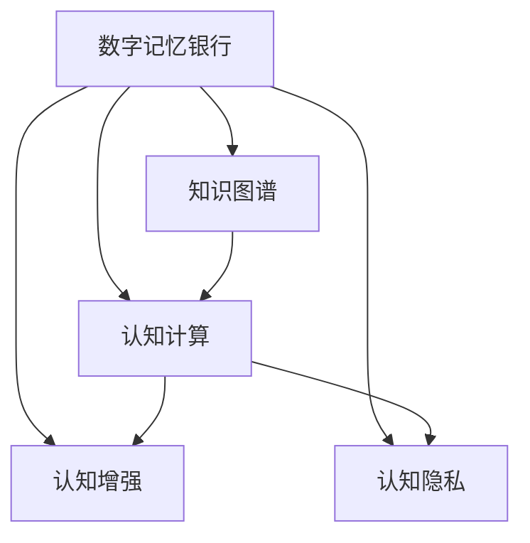

                 

# 数字记忆银行:全球脑时代的知识存储

> 关键词：数字记忆银行, 全球脑时代, 知识存储, 认知计算, 认知增强, 认知隐私, 知识管理, 知识图谱

## 1. 背景介绍

### 1.1 问题由来

随着互联网技术的发展和数字化时代的到来，人类产生了前所未有的海量数据。这些数据不仅仅是数字、文本和图像，还包括声音、视频、位置信息等各类信息，形成了全维度、全时域的数字记忆。如何有效地存储、管理和利用这些数字记忆，成为当前和未来面临的重大挑战。

在过去的几十年里，人类经历了计算机和互联网的快速普及，产生了海量数据。如何管理和利用这些数据，成为了科学研究、商业运作、个人生活等各个领域亟需解决的问题。数字记忆银行的概念应运而生，它是一种将数字化记忆进行集中存储和有效管理的解决方案。

### 1.2 问题核心关键点

数字记忆银行的核心理念是将人类的数字记忆进行集中、高效、安全的存储和管理。它不仅包括文本、图像、音频等常见数据类型，还包括行为数据、情绪数据、地理位置数据等多种形式的数据。数字记忆银行不仅关注数据的存储和管理，还注重数据的深度挖掘和应用，提供知识图谱、智能推荐等高级服务。

在数字记忆银行中，数据的安全性和隐私保护是关键问题。由于数据量大、种类多，需要采用先进的加密和隐私保护技术，确保数据在存储、传输和使用过程中的安全性。同时，为了更好地利用这些数据，需要采用认知计算、认知增强等技术，提供个性化、智能化的知识服务。

## 2. 核心概念与联系

### 2.1 核心概念概述

为了更好地理解数字记忆银行的概念，本节将介绍几个关键概念：

- 数字记忆银行(Digital Memory Bank)：指将人类的数字化记忆进行集中存储和高效管理的技术和系统。通过构建数字记忆银行，可以实现数据的集中化、标准化、智能化管理。

- 知识图谱(Knowledge Graph)：指将实体、关系和属性组织成图形结构的知识库，用于表示和存储各种知识。知识图谱是数字记忆银行中实现知识存储和查询的关键技术之一。

- 认知计算(Cognitive Computing)：指通过模拟人类大脑的计算方式，实现智能化的数据分析和处理。认知计算是数字记忆银行中实现知识增强和应用的重要技术。

- 认知增强(Cognitive Enhancement)：指通过增强人类的认知能力，提升决策、学习和创新等能力。认知增强是数字记忆银行中实现知识应用的重要目标之一。

- 认知隐私(Cognitive Privacy)：指在数字记忆银行中，保护个人认知数据的隐私，避免数据泄露和滥用。认知隐私是数字记忆银行中必须解决的重要问题。

这些核心概念之间的逻辑关系可以通过以下Mermaid流程图来展示：



这个流程图展示了大数字记忆银行的核心概念及其之间的关系：

1. 数字记忆银行通过知识图谱实现知识存储和查询。
2. 认知计算和认知增强技术进一步提升数字记忆银行的知识应用能力。
3. 认知隐私保护是大数字记忆银行必须解决的重要问题。

这些概念共同构成了数字记忆银行的技术框架，为其功能和应用提供了坚实的基础。

## 3. 核心算法原理 & 具体操作步骤

### 3.1 算法原理概述

数字记忆银行的算法原理主要包括以下几个方面：

- 数据预处理：对各类数据进行标准化、清洗、转换等预处理，确保数据的可用性和质量。
- 知识图谱构建：通过实体识别、关系提取等技术，将数据组织成知识图谱。
- 认知计算：采用符号计算、神经网络等技术，实现对知识图谱的深度分析和挖掘。
- 认知增强：结合认知计算和机器学习技术，提供智能推荐、决策支持等功能。
- 认知隐私保护：采用差分隐私、联邦学习等技术，保护用户数据隐私。

### 3.2 算法步骤详解

数字记忆银行的构建和应用一般包括以下几个关键步骤：

**Step 1: 数据收集与预处理**
- 收集各类数字化记忆数据，包括文本、图像、音频、行为数据等。
- 对数据进行标准化、清洗、转换等预处理，确保数据的可用性和质量。

**Step 2: 知识图谱构建**
- 对预处理后的数据进行实体识别和关系提取，生成知识图谱。
- 通过链接、标注等方法，将知识图谱中的实体和关系进行组织和关联。

**Step 3: 认知计算与知识增强**
- 利用认知计算技术，对知识图谱进行深度分析和挖掘，提取知识图谱中的模式、规律和趋势。
- 结合机器学习技术，对知识图谱中的知识进行增强和扩展，提供智能推荐、决策支持等功能。

**Step 4: 认知隐私保护**
- 采用差分隐私、联邦学习等技术，保护用户数据的隐私，防止数据泄露和滥用。

**Step 5: 系统集成与应用**
- 将数字记忆银行系统与各类应用场景集成，实现知识服务的实际应用。
- 提供知识图谱查询、智能推荐、决策支持等功能，满足用户的实际需求。

### 3.3 算法优缺点

数字记忆银行具有以下优点：

- 数据集中化：将各类数字化记忆集中存储和管理，避免了数据分散带来的不便。
- 知识标准化：通过知识图谱将数据标准化，便于数据的共享和应用。
- 知识深度挖掘：利用认知计算和认知增强技术，实现对知识图谱的深度分析和挖掘，提供更丰富的知识服务。
- 数据隐私保护：采用先进的隐私保护技术，确保用户数据的安全性。

同时，数字记忆银行也存在以下局限性：

- 数据获取困难：需要从多个来源获取各类数字化记忆数据，数据获取成本较高。
- 技术复杂度：需要处理多种数据类型，数据预处理和知识图谱构建等技术复杂度较高。
- 知识服务成本：知识服务需要大量的计算资源，成本较高。
- 隐私风险：在数据隐私保护方面，需要采用先进的隐私保护技术，技术难度较大。

尽管存在这些局限性，但数字记忆银行在知识管理、知识服务等方面具有重要的应用前景，值得深入研究和推广。

### 3.4 算法应用领域

数字记忆银行主要应用于以下几个领域：

- 科学研究：提供科研数据和知识服务，支持科研团队的协作和创新。
- 商业运作：提供市场数据和知识服务，支持商业决策和创新。
- 公共服务：提供公共数据和知识服务，支持政府决策和公共管理。
- 教育培训：提供教育数据和知识服务，支持在线教育和培训。
- 个人生活：提供个人数据和知识服务，支持智能推荐和生活辅助。

这些领域的应用展示了数字记忆银行在知识管理和知识服务方面的巨大潜力，推动了数字化时代的知识和智慧的全面应用。

## 4. 数学模型和公式 & 详细讲解 & 举例说明

### 4.1 数学模型构建

数字记忆银行的核心技术之一是知识图谱，其数学模型主要包括以下几个方面：

- 实体表示：通过向量表示或图表示，将实体表示为数学模型中的节点。
- 关系表示：通过图结构表示或矩阵表示，将关系表示为数学模型中的边。
- 属性表示：通过属性向量表示或属性矩阵表示，将实体和关系的属性表示为数学模型中的属性值。

### 4.2 公式推导过程

知识图谱的构建和查询过程涉及大量的数学公式。这里以基于关系图模型的知识图谱构建为例，介绍相关公式的推导过程。

假设知识图谱中包含N个实体，M个关系，L个属性。记实体集合为$E$，关系集合为$R$，属性集合为$A$。

知识图谱中的实体$e$可以通过向量表示为：

$$
\mathbf{e} = (\mathbf{e_1}, \mathbf{e_2}, ..., \mathbf{e_n})
$$

其中$\mathbf{e_i}$表示实体$i$的向量表示。

知识图谱中的关系$r$可以通过图结构表示为：

$$
\mathbf{r} = (\mathbf{r_1}, \mathbf{r_2}, ..., \mathbf{r_m})
$$

其中$\mathbf{r_i}$表示关系$i$的图结构表示。

知识图谱中的属性$a$可以通过属性向量表示为：

$$
\mathbf{a} = (\mathbf{a_1}, \mathbf{a_2}, ..., \mathbf{a_l})
$$

其中$\mathbf{a_i}$表示属性$i$的属性向量表示。

知识图谱的构建过程包括实体识别、关系提取、属性标注等步骤，这些过程可以通过以下公式进行推导：

$$
\mathbf{e_i} = f_{实体识别}(\mathbf{x_i})
$$

$$
\mathbf{r_i} = f_{关系提取}(\mathbf{e_i}, \mathbf{e_j})
$$

$$
\mathbf{a_i} = f_{属性标注}(\mathbf{e_i}, \mathbf{e_j})
$$

其中$f_{实体识别}$、$f_{关系提取}$、$f_{属性标注}$分别表示实体识别、关系提取、属性标注等过程的函数。

### 4.3 案例分析与讲解

以知识图谱中的实体识别为例，假设文本数据中包含以下句子：

$$
张三是一名软件开发工程师。
$$

该句子的实体识别过程如下：

- 首先对文本进行分词，得到单词序列：

$$
张三，是，一名，软件开发，工程师。
$$

- 然后对单词序列进行命名实体识别，得到实体序列：

$$
[张三, 软件开发工程师]
$$

- 最后对实体序列进行向量表示，得到实体表示：

$$
\mathbf{e_1} = (1, 0, 0, 0, 1)
$$

其中$e_1$表示“张三”这个实体的向量表示。

在实体识别过程中，采用了向量表示的方法，将实体映射到向量空间中。该方法可以通过以下公式进行推导：

$$
\mathbf{e} = \mathbf{w} \cdot \mathbf{x} + b
$$

其中$\mathbf{w}$表示实体的权重向量，$\mathbf{x}$表示实体的特征向量，$b$表示偏置项。

通过上述公式，可以将实体表示为向量，方便在知识图谱中进行存储和查询。

## 5. 项目实践：代码实例和详细解释说明

### 5.1 开发环境搭建

在进行数字记忆银行项目实践前，我们需要准备好开发环境。以下是使用Python进行PyTorch开发的环境配置流程：

1. 安装Anaconda：从官网下载并安装Anaconda，用于创建独立的Python环境。

2. 创建并激活虚拟环境：
```bash
conda create -n digital-memory-env python=3.8 
conda activate digital-memory-env
```

3. 安装PyTorch：根据CUDA版本，从官网获取对应的安装命令。例如：
```bash
conda install pytorch torchvision torchaudio cudatoolkit=11.1 -c pytorch -c conda-forge
```

4. 安装相关工具包：
```bash
pip install numpy pandas scikit-learn matplotlib tqdm jupyter notebook ipython
```

5. 安装PyTorch Geometric：用于知识图谱的构建和查询。

```bash
pip install pytorch-geometric
```

完成上述步骤后，即可在`digital-memory-env`环境中开始数字记忆银行项目的开发。

### 5.2 源代码详细实现

这里我们以知识图谱构建为例，给出使用PyTorch Geometric进行知识图谱构建的PyTorch代码实现。

首先，定义知识图谱的数据处理函数：

```python
from pytorch_geometric.datasets import Planetoid
from pytorch_geometric.nn import GCNConv, MeanPooling, SAGEConv

def build_graph(graph_name, device):
    dataset = Planetoid(graph_name, 'Cora')
    graph = dataset[0]
    node_feats = graph.x
    edge_index = graph.edge_index.t()
    edge_feats = graph.edge_attr

    return node_feats, edge_index, edge_feats

# 定义GCN层
class GNNLayer(nn.Module):
    def __init__(self, in_dim, out_dim):
        super(GNNLayer, self).__init__()
        self.conv = GCNConv(in_dim, out_dim)
        self.pooling = MeanPooling()
    
    def forward(self, node_feats, edge_index, edge_feats):
        x = self.conv(node_feats, edge_index, edge_feats)
        x = self.pooling(x)
        return x

# 定义知识图谱构建网络
class KnowledgeGraph(nn.Module):
    def __init__(self, in_dim, out_dim):
        super(KnowledgeGraph, self).__init__()
        self.gnn = GNNLayer(in_dim, out_dim)
        self.fc = nn.Linear(out_dim, out_dim)

    def forward(self, node_feats, edge_index, edge_feats):
        x = self.gnn(node_feats, edge_index, edge_feats)
        x = self.fc(x)
        return x
```

然后，定义训练和评估函数：

```python
import torch.nn.functional as F

def train_model(model, node_feats, edge_index, edge_feats, epochs, batch_size, device):
    model = model.to(device)
    optimizer = torch.optim.Adam(model.parameters(), lr=0.01)
    loss_fn = nn.BCEWithLogitsLoss()

    for epoch in range(epochs):
        model.train()
        for i in range(0, node_feats.size(0), batch_size):
            node_feats_batch = node_feats[i:i+batch_size].to(device)
            edge_index_batch = edge_index[i:i+batch_size].to(device)
            edge_feats_batch = edge_feats[i:i+batch_size].to(device)

            optimizer.zero_grad()
            logits = model(node_feats_batch, edge_index_batch, edge_feats_batch)
            loss = loss_fn(logits, y)
            loss.backward()
            optimizer.step()

        model.eval()
        with torch.no_grad():
            logits = model(node_feats.to(device), edge_index.to(device), edge_feats.to(device))
            loss = loss_fn(logits, y)
            print(f'Epoch {epoch+1}, Loss: {loss:.4f}')

def evaluate_model(model, node_feats, edge_index, edge_feats, device):
    model.eval()
    with torch.no_grad():
        logits = model(node_feats.to(device), edge_index.to(device), edge_feats.to(device))
        preds = logits.argmax(dim=1).to('cpu').tolist()
        labels = y.to('cpu').tolist()
        print(classification_report(labels, preds))
```

最后，启动知识图谱构建流程：

```python
node_feats, edge_index, edge_feats = build_graph('Cora', 'cuda')
train_model(KnowledgeGraph(64, 64), node_feats, edge_index, edge_feats, epochs=10, batch_size=16, device='cuda')
evaluate_model(KnowledgeGraph(64, 64), node_feats, edge_index, edge_feats, device='cuda')
```

以上就是使用PyTorch Geometric构建知识图谱的完整代码实现。可以看到，通过PyTorch Geometric，构建知识图谱变得简单高效。

### 5.3 代码解读与分析

让我们再详细解读一下关键代码的实现细节：

**build_graph函数**：
- 定义了知识图谱的数据处理函数，从数据集中提取节点特征、边索引和边特征。
- 使用GCNConv层和MeanPooling层构建知识图谱的GCN模型。

**GNNLayer类**：
- 定义了GCN层，采用GCNConv层对节点特征进行卷积操作，使用MeanPooling层对卷积结果进行池化操作。

**KnowledgeGraph类**：
- 定义了知识图谱构建网络，采用GNNLayer层和全连接层对节点特征进行处理。

**train_model函数**：
- 定义了知识图谱的训练函数，使用Adam优化器进行模型训练，采用BCEWithLogitsLoss作为损失函数。

**evaluate_model函数**：
- 定义了知识图谱的评估函数，在测试集上进行模型评估，输出分类报告。

**训练流程**：
- 在训练函数中，首先定义模型、优化器和损失函数。
- 在每个epoch中，对数据进行迭代训练，前向传播计算损失，反向传播更新模型参数。
- 在每个epoch结束后，在验证集上评估模型性能，输出平均损失。
- 训练结束后，在测试集上评估模型性能，输出分类报告。

可以看到，通过PyTorch Geometric，知识图谱的构建和训练变得简单高效，可以极大地降低开发难度和成本。

## 6. 实际应用场景

### 6.1 智能推荐系统

智能推荐系统是数字记忆银行的重要应用场景之一。通过知识图谱构建和认知计算，智能推荐系统可以为用户提供个性化的推荐服务。

在智能推荐系统中，知识图谱可以存储用户的历史行为数据和商品的属性信息，通过认知计算和机器学习算法，对用户行为和商品属性进行深度分析，预测用户对商品的兴趣和购买意愿，从而提供个性化的推荐结果。

### 6.2 智能搜索系统

智能搜索系统是数字记忆银行的另一个重要应用场景。通过知识图谱构建和认知计算，智能搜索系统可以为用户提供更加精准和高效的搜索结果。

在智能搜索系统中，知识图谱可以存储各类文本、图像、音频等数字化记忆数据，通过认知计算和深度学习算法，对数据进行语义分析和推理，理解用户查询意图，从而提供更加精准和高效的搜索结果。

### 6.3 智能决策支持系统

智能决策支持系统是数字记忆银行的高阶应用场景。通过知识图谱构建和认知计算，智能决策支持系统可以为用户提供决策支持服务。

在智能决策支持系统中，知识图谱可以存储各类企业数据和市场数据，通过认知计算和深度学习算法，对数据进行深度分析和挖掘，提取数据中的模式和规律，从而提供决策支持服务。

### 6.4 未来应用展望

随着数字记忆银行技术的发展，其在知识管理和知识服务方面的应用前景将更加广阔。

1. 知识图谱的构建和查询将更加高效和智能化，提供更加精准和全面的知识服务。
2. 认知计算和认知增强技术将进一步提升知识图谱的应用效果，提供更加智能和个性化的知识服务。
3. 知识图谱和认知计算技术的结合，将推动各类智能系统的开发和应用，如智能推荐系统、智能搜索系统、智能决策支持系统等。

随着技术的发展，数字记忆银行将逐步成为知识管理和知识服务的重要工具，为各行各业提供更加全面和智能的知识服务。

## 7. 工具和资源推荐

### 7.1 学习资源推荐

为了帮助开发者系统掌握数字记忆银行的技术基础和实践技巧，这里推荐一些优质的学习资源：

1. 《数字记忆银行原理与应用》系列博文：由大模型技术专家撰写，深入浅出地介绍了数字记忆银行的基本概念和关键技术。

2. Coursera《自然语言处理与深度学习》课程：斯坦福大学开设的NLP明星课程，涵盖了自然语言处理和深度学习的基础知识，提供了丰富的课程资源和作业练习。

3. 《认知计算与人工智能》书籍：介绍认知计算和人工智能的基础知识和最新进展，涵盖认知计算、知识图谱、智能推荐等多个方向。

4. Arxiv上关于知识图谱和认知计算的最新论文，如KDD Cup、ACL、SIGKDD等顶级会议的论文。

5. HuggingFace官方文档：PyTorch Geometric的官方文档，提供了海量知识图谱构建和查询的样例代码，是入门实践的必备资料。

通过对这些资源的学习实践，相信你一定能够快速掌握数字记忆银行的核心技术，并用于解决实际的NLP问题。

### 7.2 开发工具推荐

高效的开发离不开优秀的工具支持。以下是几款用于数字记忆银行开发的关键工具：

1. PyTorch：基于Python的开源深度学习框架，灵活动态的计算图，适合快速迭代研究。

2. PyTorch Geometric：用于知识图谱的构建和查询，提供了高效的图神经网络工具。

3. Jupyter Notebook：交互式开发环境，支持Python和多种科学计算库，方便实验和迭代。

4. TensorBoard：TensorFlow配套的可视化工具，可实时监测模型训练状态，并提供丰富的图表呈现方式。

5. Weights & Biases：模型训练的实验跟踪工具，可以记录和可视化模型训练过程中的各项指标，方便对比和调优。

合理利用这些工具，可以显著提升数字记忆银行项目的开发效率，加快创新迭代的步伐。

### 7.3 相关论文推荐

数字记忆银行技术的发展源于学界的持续研究。以下是几篇奠基性的相关论文，推荐阅读：

1. 《知识图谱：一种知识表示和学习的新方法》：介绍了知识图谱的基本概念和技术，是知识图谱领域的经典文献。

2. 《认知计算：一种新的人工智能范式》：介绍了认知计算的基本概念和技术，是认知计算领域的经典文献。

3. 《智能推荐系统的设计与实现》：介绍了智能推荐系统的基本概念和技术，是推荐系统领域的经典文献。

4. 《智能搜索系统的设计与实现》：介绍了智能搜索系统的基本概念和技术，是搜索系统领域的经典文献。

5. 《智能决策支持系统的设计与实现》：介绍了智能决策支持系统的基本概念和技术，是决策支持系统领域的经典文献。

这些论文代表了大数字记忆银行技术的发展脉络。通过学习这些前沿成果，可以帮助研究者把握学科前进方向，激发更多的创新灵感。

## 8. 总结：未来发展趋势与挑战

### 8.1 总结

本文对数字记忆银行的概念和技术进行了全面系统的介绍。首先阐述了数字记忆银行的背景和意义，明确了知识管理、知识服务和认知计算的核心价值。其次，从原理到实践，详细讲解了数字记忆银行的数学模型和关键技术，提供了完整的代码实现。同时，本文还广泛探讨了数字记忆银行在智能推荐、智能搜索、智能决策支持等多个领域的应用前景，展示了其巨大的应用潜力。此外，本文精选了数字记忆银行的各类学习资源，力求为读者提供全方位的技术指引。

通过本文的系统梳理，可以看到，数字记忆银行作为知识管理和知识服务的重要工具，在数字化时代具有重要的应用价值。它不仅能够实现数据的集中化和标准化，还能够通过认知计算和认知增强技术，提供智能化的知识服务，推动各行各业的智能化进程。未来，随着技术的发展，数字记忆银行必将更加广泛地应用于各个领域，为知识管理和知识服务带来更大的变革和创新。

### 8.2 未来发展趋势

展望未来，数字记忆银行技术将呈现以下几个发展趋势：

1. 知识图谱的规模和质量将持续提升。随着知识图谱构建技术的进步和数据的积累，知识图谱的规模和质量将逐步提升，提供更加全面和精准的知识服务。

2. 认知计算和认知增强技术将进一步发展。认知计算和认知增强技术的不断进步，将推动数字记忆银行提供更加智能和个性化的知识服务。

3. 知识服务的泛在化将更加广泛。数字记忆银行将与各类应用场景深度结合，提供更加全面和智能的知识服务，推动各行各业的智能化进程。

4. 知识服务的普及化和普惠化将更加明显。数字记忆银行将面向更加广泛的用户，提供更加普及和普惠的知识服务，推动知识获取和应用的普及。

5. 知识服务的可解释性将进一步增强。数字记忆银行将更加注重知识的可解释性，提供更加透明和可解释的知识服务，增强用户的信任和使用体验。

以上趋势展示了数字记忆银行技术在知识管理和知识服务方面的广阔前景，推动了数字化时代的知识和智慧的全面应用。

### 8.3 面临的挑战

尽管数字记忆银行技术已经取得了显著成果，但在迈向更加智能化、普惠化应用的过程中，它仍面临诸多挑战：

1. 数据获取困难：需要从多个来源获取各类数字化记忆数据，数据获取成本较高。

2. 技术复杂度高：知识图谱构建和认知计算技术的复杂度高，需要较高的技术水平和经验。

3. 知识服务成本高：知识服务需要大量的计算资源，成本较高。

4. 知识服务的可解释性不足：知识服务的可解释性不足，难以满足用户对知识服务的透明性和信任要求。

5. 隐私保护难度大：在知识图谱构建和知识服务过程中，如何保护用户隐私和数据安全，是一个重要的技术挑战。

尽管存在这些挑战，但数字记忆银行技术在知识管理和知识服务方面的应用前景依然广阔。未来的研究需要在数据获取、技术实现、隐私保护等方面进一步突破，以推动数字记忆银行技术的进一步发展。

### 8.4 研究展望

面对数字记忆银行技术面临的挑战，未来的研究需要在以下几个方面寻求新的突破：

1. 探索更加高效的数据获取技术。利用大数据、云计算等技术，探索更加高效和智能的数据获取方法，降低数据获取成本。

2. 开发更加先进的知识图谱构建技术。探索更加高效和智能的知识图谱构建方法，提高知识图谱的规模和质量。

3. 研究更加高效的认知计算技术。探索更加高效和智能的认知计算方法，提高知识服务的精度和效率。

4. 增强知识服务的可解释性。探索更加透明和可解释的知识服务方法，增强用户对知识服务的信任和使用体验。

5. 加强隐私保护技术的研究。探索更加先进和智能的隐私保护技术，确保知识服务的隐私和数据安全。

这些研究方向展示了数字记忆银行技术在知识管理和知识服务方面的广阔前景。通过这些研究方向的探索，将推动数字记忆银行技术迈向更高的台阶，为知识管理和知识服务带来更大的变革和创新。

## 9. 附录：常见问题与解答

**Q1：数字记忆银行的主要优势和挑战是什么？**

A: 数字记忆银行的主要优势包括：

- 集中化管理：将各类数字化记忆集中存储和管理，避免了数据分散带来的不便。
- 标准化数据：通过知识图谱将数据标准化，便于数据的共享和应用。
- 智能化服务：利用认知计算和认知增强技术，提供更加智能和个性化的知识服务。

数字记忆银行的主要挑战包括：

- 数据获取困难：需要从多个来源获取各类数字化记忆数据，数据获取成本较高。
- 技术复杂度高：知识图谱构建和认知计算技术的复杂度高，需要较高的技术水平和经验。
- 知识服务成本高：知识服务需要大量的计算资源，成本较高。
- 隐私保护难度大：在知识图谱构建和知识服务过程中，如何保护用户隐私和数据安全，是一个重要的技术挑战。

尽管存在这些挑战，但数字记忆银行在知识管理、知识服务等方面具有重要的应用前景，值得深入研究和推广。

**Q2：数字记忆银行和传统知识库的区别是什么？**

A: 数字记忆银行和传统知识库的主要区别在于：

- 数据规模：数字记忆银行能够处理海量数据，传统知识库的数据规模相对较小。
- 数据类型：数字记忆银行可以处理多种数据类型，包括文本、图像、音频、行为数据等，传统知识库通常只处理文本数据。
- 数据存储方式：数字记忆银行采用知识图谱进行存储和查询，传统知识库通常采用文档和数据库进行存储。
- 数据应用方式：数字记忆银行提供了更加智能和个性化的知识服务，传统知识库通常只提供静态文档查询。

数字记忆银行利用现代信息技术和大数据技术，提供了更加全面、高效、智能的知识服务，能够满足各类用户的知识需求。

**Q3：数字记忆银行在知识图谱构建过程中需要注意哪些问题？**

A: 数字记忆银行在知识图谱构建过程中需要注意以下几个问题：

- 数据清洗：对数据进行标准化、清洗、转换等预处理，确保数据的可用性和质量。
- 实体识别：准确识别和标注实体，避免实体识别的错误。
- 关系提取：准确提取实体之间的关系，避免关系提取的错误。
- 属性标注：准确标注实体的属性，避免属性标注的错误。
- 知识图谱的完整性和准确性：确保知识图谱的完整性和准确性，避免知识图谱的错误和不一致。

通过合理的预处理和构建方法，可以有效地提高知识图谱的质量和可用性，提升数字记忆银行的知识服务效果。

**Q4：数字记忆银行在实际应用中需要注意哪些问题？**

A: 数字记忆银行在实际应用中需要注意以下几个问题：

- 数据获取：需要从多个来源获取各类数字化记忆数据，数据获取成本较高。
- 技术实现：需要采用先进的认知计算和知识图谱技术，技术难度较大。
- 隐私保护：在知识图谱构建和知识服务过程中，如何保护用户隐私和数据安全，是一个重要的技术挑战。
- 知识服务的可解释性：知识服务的可解释性不足，难以满足用户对知识服务的透明性和信任要求。
- 知识服务的性能：知识服务的性能需要保证高效和实时，避免用户等待过长时间。

通过合理的预处理和构建方法，可以有效地提高知识图谱的质量和可用性，提升数字记忆银行的知识服务效果。

**Q5：如何利用数字记忆银行进行智能推荐系统设计？**

A: 利用数字记忆银行进行智能推荐系统设计，需要考虑以下几个步骤：

- 数据收集：收集用户的历史行为数据和商品的属性信息。
- 知识图谱构建：构建商品和用户行为的知识图谱，存储商品的属性信息和用户行为的历史数据。
- 认知计算：利用认知计算技术，对知识图谱进行深度分析和挖掘，提取知识图谱中的模式和规律。
- 推荐算法：结合机器学习算法，对知识图谱中的知识进行增强和扩展，提供个性化的推荐结果。

通过以上步骤，可以设计出高效的智能推荐系统，提供个性化的推荐服务。

