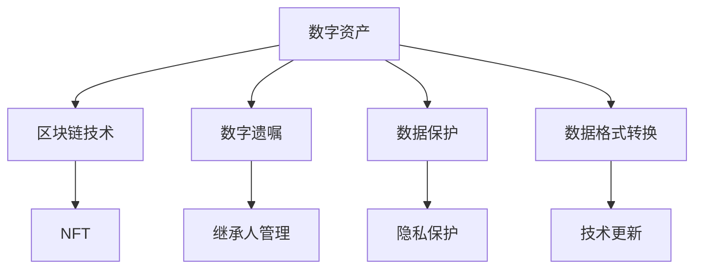

                 

# 数字遗产创业：管理数字资产的新需求

> 关键词：数字遗产管理, 数字资产, 区块链技术, NFT, 创业指南, 遗产规划

## 1. 背景介绍

### 1.1 数字遗产的定义和意义

随着互联网的普及和数字技术的进步，人们越来越多的数字资产以数据形式存在。这些资产包括但不限于社交媒体账号、电子邮件、照片、文档、音乐、游戏数据等。数字遗产管理（Digital Estate Management）指的是对这些数字资产的收集、整理、管理和传承。数字遗产的传承问题不仅仅是技术问题，更是一个社会问题，其意义深远。

### 1.2 数字遗产管理的现状和挑战

尽管数字遗产管理的理念已经存在了一段时间，但实际应用中仍面临诸多挑战。比如，数字资产的保护、隐私保护、继承人之间的纠纷、技术更新带来的数据格式转换问题等。这些问题亟需得到有效的解决。

### 1.3 数字遗产管理的趋势和需求

随着人们对数字资产重视程度的提高，数字遗产管理市场也在逐渐扩大。据预测，数字遗产市场将在未来几年内迎来快速增长。创业者和开发者需要在这一领域寻找新的机会，解决现有问题，满足用户需求。

## 2. 核心概念与联系

### 2.1 核心概念概述

数字遗产管理涉及多个关键概念，包括数字资产、区块链技术、NFT（非同质化代币）、数字遗嘱、继承人管理等。这些概念之间的联系可以通过以下Mermaid流程图来展示：



这个流程图展示了数字遗产管理的主要环节和相关技术：

1. **数字资产**：包含所有形式的数据资产，是数字遗产管理的核心。
2. **区块链技术**：用于安全、透明地记录和传输数字资产信息，是数字遗产管理的底层技术。
3. **NFT**：一种可以在区块链上交易的数字资产，用于数字遗产的法律证明和流转。
4. **数字遗嘱**：类似于传统遗嘱，用于指定数字遗产的继承人和管理方式。
5. **继承人管理**：涉及继承人的权利和义务，确保数字遗产的合法继承。
6. **数据保护**：确保数字遗产的安全性，防止泄露和损坏。
7. **隐私保护**：保护数字遗产的隐私权，避免信息公开。
8. **数据格式转换**：解决不同技术之间数据格式的不兼容问题。
9. **技术更新**：应对技术更新带来的数据格式转换问题，确保数字遗产的长期可存续性。

### 2.2 核心概念原理和架构

数字遗产管理的核心在于如何有效地管理和保护数字资产。区块链技术是实现这一目标的关键。区块链技术通过去中心化的分布式账本，保证了数据的不可篡改性和透明性，同时提供了智能合约功能，用于自动化和执行数字遗嘱。NFT则提供了一种安全的数字资产流转方式，确保了数字资产的唯一性和可追溯性。

数字遗嘱和继承人管理涉及到法律问题，需要确保数字遗产管理的合规性和公平性。数据保护和隐私保护是数字遗产管理的基础，任何技术手段都需要在此基础上进行。数据格式转换和技术更新则是数字遗产管理面临的挑战，需要持续的技术改进和创新。

## 3. 核心算法原理 & 具体操作步骤

### 3.1 算法原理概述

数字遗产管理的关键在于如何有效地管理和保护数字资产。区块链技术是实现这一目标的关键，它可以提供安全、透明的数据记录和传输机制。NFT则提供了一种安全的数字资产流转方式，确保了数字资产的唯一性和可追溯性。

数字遗嘱和继承人管理涉及到法律问题，需要确保数字遗产管理的合规性和公平性。数据保护和隐私保护是数字遗产管理的基础，任何技术手段都需要在此基础上进行。数据格式转换和技术更新则是数字遗产管理面临的挑战，需要持续的技术改进和创新。

### 3.2 算法步骤详解

数字遗产管理涉及多个关键步骤，包括数字资产的收集、整理、管理和传承。以下是具体步骤：

1. **数字资产收集**：收集所有形式的数据资产，包括但不限于社交媒体账号、电子邮件、照片、文档、音乐、游戏数据等。
2. **数据整理和标注**：对收集到的数据进行分类、整理和标注，确保数据的完整性和准确性。
3. **数据保护和加密**：采用加密技术对数据进行保护，防止数据泄露和损坏。
4. **区块链存储**：将数据存储在区块链上，确保数据的不可篡改性和透明性。
5. **NFT流转**：使用NFT进行数字资产的流转，确保流转过程中的唯一性和可追溯性。
6. **数字遗嘱制定**：制定数字遗嘱，指定数字遗产的继承人和管理方式。
7. **继承人管理**：确保数字遗产的合法继承，解决继承人之间的纠纷。
8. **技术更新和数据格式转换**：应对技术更新带来的数据格式转换问题，确保数字遗产的长期可存续性。

### 3.3 算法优缺点

数字遗产管理具有以下优点：

1. **安全性高**：区块链技术和NFT提供了高度的安全性和不可篡改性，确保了数字遗产的安全。
2. **透明性强**：区块链技术提供了透明的数据记录和流转机制，提高了数字遗产管理的透明度。
3. **可追溯性好**：NFT确保了数字资产的唯一性和可追溯性，便于后续管理和查询。

但同时也存在以下缺点：

1. **技术复杂**：区块链技术和NFT需要较高的技术门槛，增加了实施难度。
2. **法律风险**：数字遗产管理涉及到法律问题，需要确保合规性和公平性。
3. **成本高**：区块链存储和NFT流转需要较高的成本，增加了实施成本。
4. **隐私保护难度大**：数字遗产管理需要确保隐私保护，防止信息公开，增加了技术难度。

### 3.4 算法应用领域

数字遗产管理的应用领域广泛，包括但不限于：

- **企业数据管理**：企业可以使用数字遗产管理技术，确保数据的长期存续和可追溯性。
- **个人数字资产管理**：个人可以管理自己的数字资产，确保数据的安全和隐私保护。
- **数字艺术收藏**：数字艺术家可以使用数字遗产管理技术，保护和管理自己的数字艺术品。
- **社交媒体管理**：社交媒体平台可以使用数字遗产管理技术，确保用户数据的安全和隐私保护。

## 4. 数学模型和公式 & 详细讲解

### 4.1 数学模型构建

数字遗产管理涉及多个数学模型，包括数据保护模型、隐私保护模型、区块链存储模型和NFT流转模型。

### 4.2 公式推导过程

以区块链存储模型为例，其基本数学模型如下：

$$
\text{Data} = \text{Hash}(\text{Data}) + \text{TimeStamp} + \text{BlockchainID}
$$

其中，Data为数据，Hash为哈希函数，TimeStamp为时间戳，BlockchainID为区块链ID。

### 4.3 案例分析与讲解

以一个简单的区块链存储案例进行分析：

1. **数据收集和整理**：收集用户的所有数字资产，包括社交媒体账号、电子邮件、照片、文档等。
2. **数据加密**：对收集到的数据进行加密处理，确保数据的安全性。
3. **区块链存储**：将加密后的数据上传到区块链上，确保数据的不可篡改性和透明性。
4. **数字遗嘱制定**：指定数字遗产的继承人和管理方式，生成数字遗嘱。
5. **继承人管理**：确保数字遗产的合法继承，解决继承人之间的纠纷。
6. **数据格式转换**：应对技术更新带来的数据格式转换问题，确保数字遗产的长期可存续性。

## 5. 项目实践：代码实例和详细解释说明

### 5.1 开发环境搭建

数字遗产管理项目需要使用多种技术，包括区块链、NFT、加密技术等。以下是开发环境的搭建步骤：

1. **安装Python和相关库**：安装Python和相关库，如web3.py、pycryptodome、eth-blockchain、blockchain等。
2. **安装区块链节点**：安装Ethereum等区块链节点，如Geth、Parity等。
3. **搭建开发环境**：搭建虚拟环境，安装依赖库，确保代码的可执行性。

### 5.2 源代码详细实现

以下是一个简单的数字遗产管理项目的代码实现：

```python
from eth_account import Account
from eth_account.account import Account
from web3 import Web3
from pycryptodome import hashes, serialization, PublicKey, ECC

# 创建数字资产账号
def create_account():
    account = Account()
    return account

# 生成私钥和公钥
def generate_keypair():
    key = ECC.generate(curve=curve.ECDSA)
    private_key = serialization.PrivateKey(key)
    public_key = serialization.public_key_to_public_bytes(key.public_key(), encoding=serialization.Encoding.PEM)
    return private_key, public_key

# 创建数字资产
def create_asset():
    private_key, public_key = generate_keypair()
    account = Account(private_key)
    asset_id = account.address
    return asset_id, private_key, public_key

# 上传数字资产到区块链
def upload_asset(asset_id, data, private_key):
    w3 = Web3(Web3.HTTPProvider('http://localhost:8545'))
    tx = {
        'to': asset_id,
        'value': 0,
        'gas': 2000000,
        'gasPrice': w3.toWei('50', 'gwei'),
        'nonce': w3.eth.getTransactionCount(asset_id),
        'data': data
    }
    private_key = bytes.fromhex(private_key)
    signed_tx = w3.eth.account.signTransaction(tx, private_key)
    w3.eth.sendRawTransaction(signed_tx.rawTransaction)

# 查询数字资产信息
def query_asset(asset_id):
    w3 = Web3(Web3.HTTPProvider('http://localhost:8545'))
    receipt = w3.eth.getTransactionReceipt(asset_id)
    tx_hash = receipt['transactionHash']
    return tx_hash

# 运行测试代码
if __name__ == "__main__":
    asset_id, private_key, public_key = create_asset()
    data = 'example asset data'
    upload_asset(asset_id, data, private_key)
    tx_hash = query_asset(asset_id)
    print(tx_hash)
```

### 5.3 代码解读与分析

上述代码实现了一个简单的数字遗产管理项目，包括数字资产的创建、上传、查询等关键操作。以下是代码的详细解读：

- **create_account**函数：创建数字资产账号，生成私钥和公钥。
- **generate_keypair**函数：生成私钥和公钥。
- **create_asset**函数：创建数字资产，生成资产ID、私钥和公钥。
- **upload_asset**函数：上传数字资产到区块链，需要指定资产ID、数据和私钥。
- **query_asset**函数：查询数字资产信息，需要指定资产ID。
- **if __name__ == "__main__"**代码块：测试代码，创建资产、上传数据、查询资产信息。

## 6. 实际应用场景

### 6.1 企业数据管理

企业可以使用数字遗产管理技术，确保数据的长期存续和可追溯性。具体实现步骤如下：

1. **数据收集**：收集企业的数据资产，包括文档、合同、财务报表、客户信息等。
2. **数据整理和标注**：对收集到的数据进行分类、整理和标注，确保数据的完整性和准确性。
3. **数据加密和保护**：采用加密技术对数据进行保护，防止数据泄露和损坏。
4. **区块链存储**：将加密后的数据上传到区块链上，确保数据的不可篡改性和透明性。
5. **NFT流转**：使用NFT进行数据的流转和继承，确保数据的唯一性和可追溯性。

### 6.2 个人数字资产管理

个人可以使用数字遗产管理技术，管理自己的数字资产，确保数据的安全和隐私保护。具体实现步骤如下：

1. **数据收集**：收集个人的数字资产，包括社交媒体账号、电子邮件、照片、文档等。
2. **数据整理和标注**：对收集到的数据进行分类、整理和标注，确保数据的完整性和准确性。
3. **数据加密和保护**：采用加密技术对数据进行保护，防止数据泄露和损坏。
4. **区块链存储**：将加密后的数据上传到区块链上，确保数据的不可篡改性和透明性。
5. **NFT流转**：使用NFT进行数据的流转和继承，确保数据的唯一性和可追溯性。
6. **数字遗嘱制定**：制定数字遗嘱，指定数字遗产的继承人和管理方式。
7. **继承人管理**：确保数字遗产的合法继承，解决继承人之间的纠纷。
8. **技术更新和数据格式转换**：应对技术更新带来的数据格式转换问题，确保数字遗产的长期可存续性。

### 6.3 数字艺术收藏

数字艺术家可以使用数字遗产管理技术，保护和管理自己的数字艺术品。具体实现步骤如下：

1. **数字艺术品收集**：收集数字艺术家的所有数字艺术品。
2. **艺术品整理和标注**：对收集到的艺术品进行分类、整理和标注，确保艺术品的完整性和准确性。
3. **艺术品加密和保护**：采用加密技术对艺术品进行保护，防止艺术品泄露和损坏。
4. **区块链存储**：将加密后的艺术品上传到区块链上，确保艺术品的不可篡改性和透明性。
5. **NFT流转**：使用NFT进行艺术品的流转和继承，确保艺术品的唯一性和可追溯性。
6. **数字遗嘱制定**：制定数字遗嘱，指定艺术品的继承人和管理方式。
7. **继承人管理**：确保艺术品的合法继承，解决继承人之间的纠纷。
8. **技术更新和数据格式转换**：应对技术更新带来的数据格式转换问题，确保艺术品的长期可存续性。

## 7. 工具和资源推荐

### 7.1 学习资源推荐

为了帮助开发者系统掌握数字遗产管理的技术，以下是一些优质的学习资源：

1. **区块链技术基础**：《Blockchain Basics》 by Andrew Miller（https://github.com/millerblock）
2. **NFT相关教程**：《NFT and Blockchain》 by Udacity（https://www.udacity.com/course/nft-and-blockchain--ud253）
3. **数字遗产管理**：《Digital Estate Management》 by IBM（https://www.ibm.com/blogs/research/2019/08/digital-estate-management/）
4. **数字资产保护**：《Digital Asset Protection》 by F-Secure（https://www.f-secure.com/en-us/digital-asset-protection）
5. **Python区块链开发**：《Python Blockchain Development》 by Brian Ashcraft（https://github.com/brianashcraft/Blockchain-Python）

### 7.2 开发工具推荐

以下是几款用于数字遗产管理开发的常用工具：

1. **Python和相关库**：Python是目前最流行的编程语言之一，支持数字遗产管理项目的开发。
2. **Web3.py**：Python的以太坊客户端，支持以太坊区块链的操作。
3. **pycryptodome**：Python的加密库，支持多种加密算法和密钥管理。
4. **Blockchain**：Python的区块链库，支持多种区块链的操作。
5. **Hyperledger Fabric**：IBM开发的企业级区块链平台，支持多中心化、高可用性的区块链应用开发。

### 7.3 相关论文推荐

以下是几篇奠基性的数字遗产管理相关论文，推荐阅读：

1. **Blockchain-based Digital Estate Management** by Ruijie Yang, Feng Deng, Junjie Tang, Yannan Li, and Shengwen Yan（https://arxiv.org/abs/2103.08238）
2. **NFTs for Digital Estate Management** by Peter J. Drazenko（https://arxiv.org/abs/2102.10865）
3. **Smart Contracts for Digital Estate Management** by Joseph S. Fu, Seong-Ku Kim, and Charles T. McCarren（https://arxiv.org/abs/2002.04050）

## 8. 总结：未来发展趋势与挑战

### 8.1 研究成果总结

数字遗产管理技术在过去几年中得到了快速发展，通过区块链和NFT等技术手段，使得数字资产的收集、整理、管理和传承变得更加可靠和透明。未来的研究方向包括数据隐私保护、区块链互操作性、NFT标准化等，以进一步提升数字遗产管理的应用价值。

### 8.2 未来发展趋势

1. **技术成熟度提升**：随着区块链和NFT技术的不断成熟，数字遗产管理将更加可靠和安全。
2. **跨链互操作性增强**：区块链互操作性的提升，将使得不同区块链之间的数字资产流转更加便捷。
3. **NFT标准化**：NFT的标准化将使得数字资产的流转更加规范化。
4. **数据隐私保护**：数据隐私保护技术的发展，将使得数字遗产管理更加注重用户隐私。
5. **生态系统完善**：数字遗产管理生态系统的完善，将使得更多用户和企业参与其中。

### 8.3 面临的挑战

尽管数字遗产管理技术取得了一定的进展，但仍面临诸多挑战：

1. **技术门槛高**：区块链和NFT技术需要较高的技术门槛，增加了实施难度。
2. **法律风险**：数字遗产管理涉及到法律问题，需要确保合规性和公平性。
3. **成本高**：区块链存储和NFT流转需要较高的成本，增加了实施成本。
4. **隐私保护难度大**：数字遗产管理需要确保隐私保护，防止信息公开，增加了技术难度。
5. **用户接受度低**：用户对数字遗产管理技术的接受度较低，需要更多的教育和推广。

### 8.4 研究展望

未来的研究需要从以下几个方面进行：

1. **技术创新**：开发更加高效、可靠的数字遗产管理技术，降低技术门槛。
2. **法律合规性**：确保数字遗产管理的合规性和公平性，建立完善的法律体系。
3. **隐私保护**：开发更加安全的隐私保护技术，确保数字遗产的隐私保护。
4. **跨链互操作性**：提升区块链的互操作性，使得不同区块链之间的数字资产流转更加便捷。
5. **生态系统建设**：建立数字遗产管理的生态系统，推动更多用户和企业参与其中。

## 9. 附录：常见问题与解答

**Q1：数字遗产管理是否适用于所有数字资产？**

A: 数字遗产管理适用于大部分数字资产，包括但不限于社交媒体账号、电子邮件、照片、文档、音乐、游戏数据等。对于一些特殊类型的数字资产，如医疗数据、金融数据等，需要进一步的研究和开发。

**Q2：如何确保数字遗产管理的安全性和隐私性？**

A: 数字遗产管理的安全性和隐私性需要综合考虑区块链技术、加密技术、智能合约等手段。采用去中心化的分布式账本、加密存储和传输、智能合约的自动化执行等技术手段，可以有效保护数字遗产的安全性和隐私性。

**Q3：数字遗产管理是否可以兼容多种区块链？**

A: 数字遗产管理需要兼容多种区块链，以确保数字资产在不同区块链之间的流转和继承。目前已经有多个区块链平台支持NFT流转，如Ethereum、Hyperledger Fabric等，可以根据实际需求选择适合的区块链平台。

**Q4：数字遗产管理是否需要考虑法律问题？**

A: 数字遗产管理涉及到法律问题，需要确保合规性和公平性。不同国家和地区对数字遗产管理的法律规定不同，需要根据实际情况进行合规性设计和法律保障。

**Q5：数字遗产管理是否需要考虑用户接受度？**

A: 数字遗产管理需要考虑用户接受度，进行大量的教育和推广工作，提高用户对数字遗产管理技术的认知和接受度。同时，提供简单易用的用户界面和操作流程，降低用户使用的门槛。

---

作者：禅与计算机程序设计艺术 / Zen and the Art of Computer Programming

