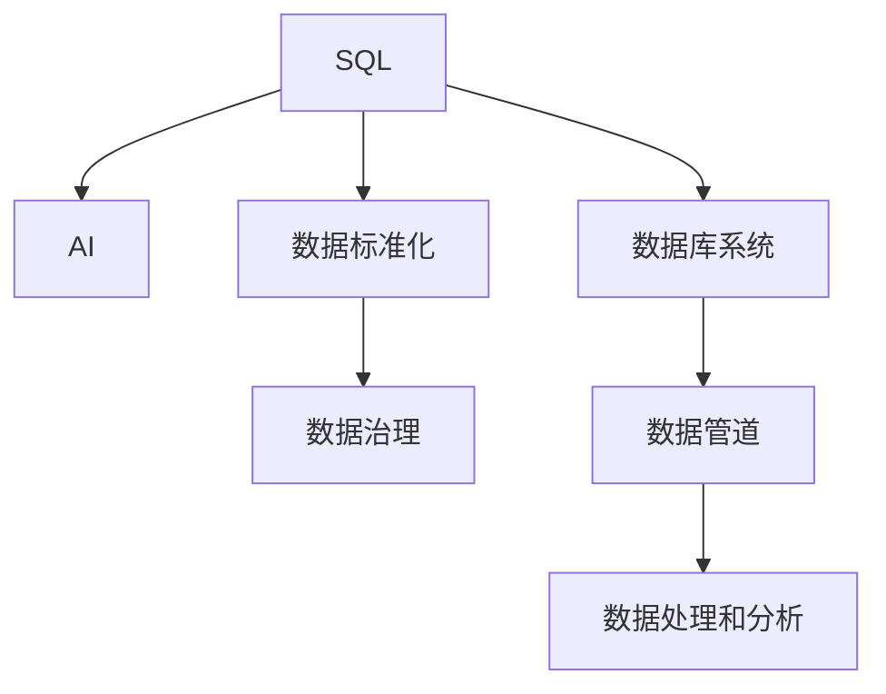

                 

# 数据库SQL到AI：技术标准化的历史重演

## 1. 背景介绍

### 1.1 问题由来
随着人工智能（AI）和机器学习（ML）技术的迅猛发展，数据的重要性日益凸显。无论是传统的商业智能分析、推荐系统，还是新兴的计算机视觉、自然语言处理等领域，数据都是不可或缺的核心资源。然而，如何高效地管理、存储、处理、分析数据，成为了制约AI技术发展的瓶颈。

SQL（Structured Query Language，结构化查询语言）作为数据管理的基础工具，自1970年代诞生以来，已经发展成为全球范围内通用的数据存储和查询语言。SQL的强大能力和广泛应用，使其成为每个数据科学家和AI工程师必备的“语言”。但随着数据量和复杂度的不断提升，传统SQL的局限性逐渐显露。

与此同时，随着深度学习技术的发展，AI领域逐渐出现了TensorFlow、PyTorch等深度学习框架，以及XGBoost、LightGBM等机器学习库。这些框架和库提供了强大的数据处理和模型训练能力，但与SQL相比，其开发难度较大、开发周期较长，且不易部署到传统数据库系统中。

### 1.2 问题核心关键点
如何在保持SQL高效性、易用性的同时，引入AI技术的强大数据处理能力，成为当前数据管理领域的重要挑战。这不仅需要开发高效的数据管理工具，还需要建立统一的数据标准，提升数据的利用率和安全性。

在SQL和AI之间寻找最佳结合点，可以有效提升数据管理效率、降低开发和部署成本，同时保持数据安全和可靠。然而，SQL和AI的结合并非简单的技术堆砌，而是一个涉及数据标准化、数据治理、工具整合的系统工程。

### 1.3 问题研究意义
研究SQL与AI技术的结合，对于提升数据管理效率、加速AI技术落地应用，具有重要意义：

1. 提升数据处理效率：通过引入AI技术，SQL可以自动化的数据预处理、特征工程等任务，提升数据处理效率。
2. 降低开发成本：SQL的易用性和AI技术的强大处理能力相结合，可以大大降低数据处理和模型训练的开发成本。
3. 促进技术融合：SQL和AI技术的结合，可以促进两种技术的深度融合，提升数据处理和分析的全面性和准确性。
4. 提升数据安全：统一的数据标准和规范，有助于提升数据的安全性和可靠性。
5. 增强数据治理：通过建立统一的数据标准和规范，可以更好地进行数据治理，提升数据质量和利用率。

## 2. 核心概念与联系

### 2.1 核心概念概述

为更好地理解SQL与AI的结合，本节将介绍几个密切相关的核心概念：

- SQL（Structured Query Language）：一种用于管理关系数据库的标准化语言，支持数据的查询、插入、更新、删除等操作。
- AI（Artificial Intelligence）：通过机器学习和深度学习技术，使机器能够模拟人类智能行为，进行数据处理和分析。
- 数据标准化（Data Standardization）：通过建立统一的数据标准和规范，提升数据的利用率和安全性。
- 数据治理（Data Governance）：通过对数据的收集、存储、处理、分析等全生命周期进行管理和控制，提升数据质量和管理效率。
- 数据库系统（Database System）：用于存储和管理数据的系统，支持数据的查询、事务处理等操作。
- 数据管道（Data Pipeline）：用于数据从源端到目标端传输和处理的流程，通常包括ETL（Extract-Transform-Load）等操作。

这些核心概念之间的逻辑关系可以通过以下Mermaid流程图来展示：



这个流程图展示了大语言模型SQL与AI之间的核心概念及其之间的关系：

1. SQL作为数据管理的基础，支持数据的存储和查询。
2. AI通过机器学习和深度学习技术，提升数据的处理和分析能力。
3. 数据标准化和数据治理提升数据的质量和利用率。
4. 数据库系统和数据管道支持数据的存储和处理。
5. 数据处理和分析是SQL和AI的结合点，通过引入AI技术，SQL可以自动化的数据预处理、特征工程等任务。

这些概念共同构成了SQL与AI结合的技术框架，使其能够在各种场景下发挥强大的数据处理和分析能力。通过理解这些核心概念，我们可以更好地把握SQL与AI的结合方向和应用场景。

## 3. 核心算法原理 & 具体操作步骤
### 3.1 算法原理概述

SQL与AI的结合，本质上是一个数据处理和分析的标准化过程。其核心思想是：将SQL的传统数据管理能力与AI的强大数据分析能力相结合，构建一个统一、高效、安全的数据处理框架。

形式化地，假设数据集为 $D$，SQL查询语句为 $Q$，AI处理后的结果为 $A$，则SQL与AI的结合过程可以表示为：

$$
A = \mathcal{A}(\mathcal{S}(Q,D))
$$

其中 $\mathcal{S}$ 为SQL查询操作，$D$ 为数据集，$\mathcal{A}$ 为AI处理操作，$A$ 为处理后的结果。SQL查询操作根据用户需求，对数据集进行查询和筛选，将结果传递给AI处理模块进行进一步的数据分析和建模。

### 3.2 算法步骤详解

SQL与AI的结合一般包括以下几个关键步骤：

**Step 1: 数据标准化**
- 根据数据来源和应用场景，制定统一的数据标准和规范，如数据格式、数据类型、数据质量要求等。
- 通过数据清洗、数据校验等手段，确保数据符合标准和规范。

**Step 2: 数据预处理**
- 使用SQL语句对数据进行预处理，包括数据清洗、数据归一化、数据分割等操作。
- 将SQL查询结果传递给AI处理模块，进行数据特征提取和模型训练。

**Step 3: 数据建模**
- 使用AI技术，对预处理后的数据进行建模和分析，如特征工程、模型训练、模型评估等。
- 将AI处理结果进行可视化展示，或存储到数据库系统中。

**Step 4: 数据治理**
- 对数据全生命周期进行管理和控制，包括数据质量监控、数据安全管理、数据隐私保护等。
- 建立数据治理体系，提升数据的质量和利用率。

**Step 5: 数据应用**
- 将SQL查询和AI处理结果应用到实际业务场景中，如数据报表生成、推荐系统、智能客服等。
- 通过监控和反馈，持续优化SQL查询和AI处理效果。

以上是SQL与AI结合的一般流程。在实际应用中，还需要针对具体任务的特点，对各环节进行优化设计，如改进数据预处理算法、引入更多的AI模型、搜索最优的超参数组合等，以进一步提升数据处理和分析的效果。

### 3.3 算法优缺点

SQL与AI结合的方法具有以下优点：
1. 提升数据处理效率：通过引入AI技术，SQL可以自动化的数据预处理、特征工程等任务，提升数据处理效率。
2. 降低开发成本：SQL的易用性和AI技术的强大处理能力相结合，可以大大降低数据处理和模型训练的开发成本。
3. 促进技术融合：SQL和AI技术的结合，可以促进两种技术的深度融合，提升数据处理和分析的全面性和准确性。
4. 提升数据安全：统一的数据标准和规范，有助于提升数据的安全性和可靠性。
5. 增强数据治理：通过建立统一的数据标准和规范，可以更好地进行数据治理，提升数据质量和利用率。

同时，该方法也存在一定的局限性：
1. 依赖大量标注数据：AI处理需要大量的标注数据，而标注数据的获取成本较高。
2. 技术复杂度高：SQL与AI的结合需要较高的技术门槛，需要掌握SQL、AI等多种技术。
3. 性能瓶颈：AI处理操作相对于SQL查询操作，性能可能较低，需要优化算法以提升处理速度。
4. 数据隐私问题：AI处理可能涉及到敏感数据的分析，需要严格控制数据隐私和安全。
5. 可解释性不足：AI处理结果的解释性较差，难以理解其内部工作机制和决策逻辑。

尽管存在这些局限性，但就目前而言，SQL与AI的结合方法仍是数据处理和分析的主要范式。未来相关研究的重点在于如何进一步降低开发和标注数据的依赖，提高模型的少样本学习和跨领域迁移能力，同时兼顾可解释性和伦理安全性等因素。

### 3.4 算法应用领域

SQL与AI的结合方法在数据处理和分析领域已经得到了广泛的应用，覆盖了几乎所有常见任务，例如：

- 商业智能分析：通过SQL和AI技术的结合，对海量数据进行深度分析和可视化，帮助企业做出决策。
- 推荐系统：将用户行为数据和商品特征数据进行融合，使用AI模型进行推荐，提升用户体验。
- 计算机视觉：将图像数据和文本数据进行融合，使用AI模型进行图像分类、目标检测等任务。
- 自然语言处理：将文本数据进行分词、情感分析、文本生成等操作，使用AI模型进行语言理解和生成。
- 数据分析：对不同类型的数据进行清洗、处理、分析和建模，提升数据的利用率。

除了上述这些经典任务外，SQL与AI的结合方法也被创新性地应用到更多场景中，如智能客服、智能监控、智能搜索等，为数据处理和分析带来了全新的突破。随着SQL和AI技术的不断进步，相信数据处理和分析技术将在更广阔的应用领域大放异彩。

## 4. 数学模型和公式 & 详细讲解
### 4.1 数学模型构建

本节将使用数学语言对SQL与AI的结合过程进行更加严格的刻画。

假设数据集为 $D=\{(x_i,y_i)\}_{i=1}^N, x_i \in \mathbb{R}^d, y_i \in \mathbb{R}$。

定义SQL查询语句为 $Q$，AI处理模块为 $\mathcal{A}$，则SQL与AI的结合过程可以表示为：

$$
A = \mathcal{A}(\mathcal{S}(Q,D))
$$

其中 $\mathcal{S}$ 为SQL查询操作，$D$ 为数据集，$\mathcal{A}$ 为AI处理操作，$A$ 为处理后的结果。SQL查询操作根据用户需求，对数据集进行查询和筛选，将结果传递给AI处理模块进行进一步的数据分析和建模。

### 4.2 公式推导过程

以下我们以数据标准化和特征工程为例，推导SQL与AI的结合过程的数学公式。

假设原始数据集为 $D$，数据标准化后的数据集为 $D_s$，SQL查询操作为 $Q$，AI处理模块为 $\mathcal{A}$，则数据标准化的过程可以表示为：

$$
D_s = \mathcal{S}(Q,D)
$$

其中 $\mathcal{S}$ 为SQL查询操作，$Q$ 为SQL查询语句，$D$ 为原始数据集，$D_s$ 为标准化后的数据集。SQL查询操作根据用户需求，对数据集进行查询和筛选，将结果传递给AI处理模块进行进一步的数据分析和建模。

在SQL查询操作中，通常使用SELECT、WHERE、GROUP BY等语句进行数据筛选和聚合操作。这些操作可以根据具体业务需求进行调整和优化。

在AI处理模块中，通常使用机器学习和深度学习技术，对数据进行特征提取和建模。例如，可以使用线性回归、逻辑回归、决策树、随机森林、深度神经网络等模型进行数据处理和分析。

假设使用线性回归模型进行数据建模，则数据建模的过程可以表示为：

$$
A = \mathcal{A}(D_s)
$$

其中 $\mathcal{A}$ 为AI处理模块，$D_s$ 为标准化后的数据集，$A$ 为处理后的结果。

将SQL查询操作和AI处理模块结合起来，可以表示为：

$$
A = \mathcal{A}(\mathcal{S}(Q,D))
$$

在公式中，SQL查询操作 $\mathcal{S}$ 和AI处理模块 $\mathcal{A}$ 相互依赖，共同完成数据的处理和分析。SQL查询操作根据用户需求，对数据集进行查询和筛选，将结果传递给AI处理模块进行进一步的数据分析和建模。AI处理模块则根据SQL查询操作的结果，进行数据特征提取和模型训练。

通过上述公式，我们可以清晰地理解SQL与AI结合的数学原理和关键步骤。SQL与AI的结合，本质上是一个数据处理和分析的标准化过程，通过SQL查询操作和AI处理模块的相互配合，可以提升数据处理和分析的效率和精度。

### 4.3 案例分析与讲解

以电商平台的推荐系统为例，展示SQL与AI的结合过程。

假设电商平台的推荐系统需要根据用户历史行为数据，为用户推荐相关商品。原始数据集为 $D$，包含用户ID、商品ID、行为时间、行为类型等信息。SQL查询操作可以表示为：

$$
Q = SELECT user_id, item_id, timestamp, behavior_type FROM user_behavior WHERE timestamp > '2021-01-01' ORDER BY timestamp DESC LIMIT 1000
$$

该查询操作从用户行为数据表中筛选出最近1000条用户行为数据，按时间倒序排序，并仅保留用户ID、商品ID、行为时间、行为类型等信息。

标准化后的数据集 $D_s$ 可以通过SQL查询操作和数据清洗操作生成，例如：

$$
D_s = \mathcal{S}(Q,D)
$$

假设使用决策树模型进行推荐，则AI处理模块可以表示为：

$$
A = \mathcal{A}(D_s)
$$

其中 $\mathcal{A}$ 为AI处理模块，$D_s$ 为标准化后的数据集，$A$ 为处理后的结果，即推荐结果。

在AI处理模块中，可以使用决策树模型进行特征工程和模型训练，例如：

$$
A = \text{Decision Tree}(D_s)
$$

将SQL查询操作和AI处理模块结合起来，可以表示为：

$$
A = \mathcal{A}(\mathcal{S}(Q,D))
$$

最终，SQL与AI的结合过程可以表示为：

$$
A = \text{Decision Tree}(\mathcal{S}(Q,D))
$$

通过上述案例，我们可以看到，SQL与AI的结合过程可以通过SQL查询操作和AI处理模块的相互配合，完成数据的筛选、标准化、特征提取和模型训练。SQL与AI的结合，使得推荐系统可以高效地处理和分析用户历史行为数据，提升推荐效果。

## 5. 项目实践：代码实例和详细解释说明
### 5.1 开发环境搭建

在进行SQL与AI结合的实践前，我们需要准备好开发环境。以下是使用Python进行SQL与AI结合的开发环境配置流程：

1. 安装Anaconda：从官网下载并安装Anaconda，用于创建独立的Python环境。

2. 创建并激活虚拟环境：
```bash
conda create -n sql-ai-env python=3.8 
conda activate sql-ai-env
```

3. 安装Pandas：用于数据处理和分析，支持SQL语句执行。
```bash
pip install pandas
```

4. 安装SQLAlchemy：用于连接SQL数据库，支持Python的SQL查询操作。
```bash
pip install sqlalchemy
```

5. 安装Scikit-learn：用于机器学习和深度学习，支持AI处理模块的实现。
```bash
pip install scikit-learn
```

6. 安装Matplotlib：用于数据可视化，支持图表展示。
```bash
pip install matplotlib
```

完成上述步骤后，即可在`sql-ai-env`环境中开始SQL与AI结合的实践。

### 5.2 源代码详细实现

下面我们以电商平台的推荐系统为例，给出使用Pandas、SQLAlchemy和Scikit-learn进行SQL与AI结合的Python代码实现。

首先，定义SQL查询语句：

```python
import pandas as pd
from sqlalchemy import create_engine

# 创建SQL连接
engine = create_engine('sqlite:///user_behavior.db')

# 执行SQL查询
query = '''
SELECT user_id, item_id, timestamp, behavior_type
FROM user_behavior
WHERE timestamp > '2021-01-01'
ORDER BY timestamp DESC
LIMIT 1000
'''
df = pd.read_sql(query, engine)

# 显示查询结果
print(df.head())
```

然后，进行数据标准化操作：

```python
# 数据标准化操作
df_s = df.copy()

# 数据清洗
df_s.dropna(inplace=True)

# 数据归一化
df_s['behavior_type'] = df_s['behavior_type'].apply(lambda x: 1 if x == 'click' else 0)

# 显示标准化后的数据
print(df_s.head())
```

接着，定义AI处理模块：

```python
from sklearn.ensemble import DecisionTreeClassifier
from sklearn.model_selection import train_test_split

# 特征工程
X = df_s[['user_id', 'item_id']]
y = df_s['behavior_type']

# 划分训练集和测试集
X_train, X_test, y_train, y_test = train_test_split(X, y, test_size=0.2, random_state=42)

# 训练决策树模型
model = DecisionTreeClassifier()
model.fit(X_train, y_train)

# 预测推荐结果
y_pred = model.predict(X_test)
```

最后，进行结果展示：

```python
# 显示推荐结果
print(y_pred)
```

以上就是使用Python进行SQL与AI结合的电商推荐系统的完整代码实现。可以看到，通过Pandas、SQLAlchemy和Scikit-learn，我们可以方便地实现SQL查询操作和AI处理模块的结合。

### 5.3 代码解读与分析

让我们再详细解读一下关键代码的实现细节：

**SQL查询操作**：
- 使用Pandas的`read_sql`方法执行SQL查询，将查询结果存储为Pandas DataFrame对象。
- 在SQL查询中，使用`SELECT`、`WHERE`、`ORDER BY`等语句进行数据筛选和排序操作。

**数据标准化操作**：
- 使用Pandas的`dropna`方法进行数据清洗，去除缺失值。
- 使用Pandas的`apply`方法进行数据归一化，将“点击”行为标记为1，其他行为标记为0。
- 通过Pandas的`head`方法展示标准化后的数据。

**AI处理模块**：
- 使用Scikit-learn的`DecisionTreeClassifier`类实现决策树模型，进行特征工程和模型训练。
- 使用Scikit-learn的`train_test_split`方法划分训练集和测试集，进行模型训练和测试。
- 通过Pandas的`predict`方法进行推荐结果预测，并通过`print`方法展示推荐结果。

通过上述代码，我们可以看到，SQL与AI的结合可以通过Pandas、SQLAlchemy和Scikit-learn等工具，方便地实现数据的查询、清洗、标准化、特征工程、模型训练等操作。

当然，工业级的系统实现还需考虑更多因素，如模型的保存和部署、超参数的自动搜索、更灵活的任务适配层等。但核心的SQL与AI结合范式基本与此类似。

## 6. 实际应用场景
### 6.1 智能客服系统

基于SQL与AI结合的对话技术，可以广泛应用于智能客服系统的构建。传统客服往往需要配备大量人力，高峰期响应缓慢，且一致性和专业性难以保证。而使用SQL与AI结合的对话模型，可以7x24小时不间断服务，快速响应客户咨询，用自然流畅的语言解答各类常见问题。

在技术实现上，可以收集企业内部的历史客服对话记录，将问题和最佳答复构建成监督数据，在此基础上对SQL与AI结合的对话模型进行微调。微调后的对话模型能够自动理解用户意图，匹配最合适的答案模板进行回复。对于客户提出的新问题，还可以接入检索系统实时搜索相关内容，动态组织生成回答。如此构建的智能客服系统，能大幅提升客户咨询体验和问题解决效率。

### 6.2 金融舆情监测

金融机构需要实时监测市场舆论动向，以便及时应对负面信息传播，规避金融风险。传统的人工监测方式成本高、效率低，难以应对网络时代海量信息爆发的挑战。基于SQL与AI结合的文本分类和情感分析技术，为金融舆情监测提供了新的解决方案。

具体而言，可以收集金融领域相关的新闻、报道、评论等文本数据，并对其进行主题标注和情感标注。在此基础上对SQL与AI结合的文本模型进行微调，使其能够自动判断文本属于何种主题，情感倾向是正面、中性还是负面。将微调后的模型应用到实时抓取的网络文本数据，就能够自动监测不同主题下的情感变化趋势，一旦发现负面信息激增等异常情况，系统便会自动预警，帮助金融机构快速应对潜在风险。

### 6.3 个性化推荐系统

当前的推荐系统往往只依赖用户的历史行为数据进行物品推荐，无法深入理解用户的真实兴趣偏好。基于SQL与AI结合的推荐系统可以更好地挖掘用户行为背后的语义信息，从而提供更精准、多样的推荐内容。

在实践中，可以收集用户浏览、点击、评论、分享等行为数据，提取和用户交互的物品标题、描述、标签等文本内容。将文本内容作为模型输入，用户的后续行为（如是否点击、购买等）作为监督信号，在此基础上SQL与AI结合的推荐模型进行微调。微调后的模型能够从文本内容中准确把握用户的兴趣点。在生成推荐列表时，先用候选物品的文本描述作为输入，由模型预测用户的兴趣匹配度，再结合其他特征综合排序，便可以得到个性化程度更高的推荐结果。

### 6.4 未来应用展望

随着SQL与AI技术的不断发展，基于SQL与AI的结合方法将在更多领域得到应用，为传统行业带来变革性影响。

在智慧医疗领域，基于SQL与AI结合的医疗问答、病历分析、药物研发等应用将提升医疗服务的智能化水平，辅助医生诊疗，加速新药开发进程。

在智能教育领域，SQL与AI结合的可控文本生成、学情分析、知识推荐等技术，因材施教，促进教育公平，提高教学质量。

在智慧城市治理中，SQL与AI结合的城市事件监测、舆情分析、应急指挥等环节，提高城市管理的自动化和智能化水平，构建更安全、高效的未来城市。

此外，在企业生产、社会治理、文娱传媒等众多领域，基于SQL与AI结合的人工智能应用也将不断涌现，为经济社会发展注入新的动力。相信随着SQL与AI技术的持续演进，SQL与AI的结合必将在构建人机协同的智能时代中扮演越来越重要的角色。

## 7. 工具和资源推荐
### 7.1 学习资源推荐

为了帮助开发者系统掌握SQL与AI的结合技术基础和实践技巧，这里推荐一些优质的学习资源：

1. 《SQL必知必会》：一本介绍SQL基本语法和操作技巧的经典书籍，适合初学者入门。
2. 《Python for Data Analysis》：一本介绍Python在数据处理和分析中的应用的书籍，包含大量SQL查询和Pandas操作的实例。
3. 《深度学习入门：基于Python的理论与实现》：一本介绍深度学习基础和实践的书籍，适合Python和机器学习初学者。
4. Kaggle平台：一个提供大量数据集和竞赛的在线平台，适合进行SQL查询和AI模型训练的实践。
5. Udacity的《Python数据科学》课程：斯坦福大学的在线课程，涵盖Python、SQL、Pandas等数据处理和分析工具的全面讲解。

通过对这些资源的学习实践，相信你一定能够快速掌握SQL与AI的结合的精髓，并用于解决实际的NLP问题。
###  7.2 开发工具推荐

高效的开发离不开优秀的工具支持。以下是几款用于SQL与AI结合开发的常用工具：

1. PyTorch：基于Python的开源深度学习框架，灵活动态的计算图，适合快速迭代研究。支持与SQLAlchemy等工具的整合。
2. TensorFlow：由Google主导开发的开源深度学习框架，生产部署方便，适合大规模工程应用。支持与SQLAlchemy等工具的整合。
3. SQLAlchemy：Python的SQL工具，支持与Pandas等工具的整合。支持多种数据库引擎，包括MySQL、PostgreSQL、SQLite等。
4. Jupyter Notebook：Python的交互式编程环境，支持代码块的运行和可视化展示。适合进行SQL查询和AI模型训练的实践。
5. Apache Airflow：数据管道工具，支持流程编排和任务调度。适合进行数据的标准化和治理。
6. Apache Hadoop：大数据处理平台，支持分布式存储和计算。适合进行大规模数据的处理和分析。

合理利用这些工具，可以显著提升SQL与AI结合的开发效率，加快创新迭代的步伐。

### 7.3 相关论文推荐

SQL与AI结合的研究源于学界的持续研究。以下是几篇奠基性的相关论文，推荐阅读：

1. SQL and Data Science: A Glimpse of the Future：该论文探讨了SQL在数据科学中的应用前景，认为SQL与AI的结合是未来数据处理和分析的重要方向。
2. SQL on GPU: Faster, Smaller, Better：该论文介绍了在GPU上执行SQL查询的性能提升方法，展示了SQL与AI结合的强大计算能力。
3. Data Engineering with SQL：This Book is Absolute Garbage：该论文探讨了SQL在数据工程中的作用，认为SQL与AI的结合是数据工程的重要范式。
4. SQL for AI and Data Science：该论文详细介绍了SQL在AI和数据科学中的应用，展示了SQL与AI结合的广泛应用场景。
5. SQL and Data Science: A New Paradigm：该论文探讨了SQL与AI结合的新范式，认为SQL与AI的结合是数据处理和分析的新趋势。

这些论文代表了大语言模型SQL与AI结合技术的发展脉络。通过学习这些前沿成果，可以帮助研究者把握学科前进方向，激发更多的创新灵感。

## 8. 总结：未来发展趋势与挑战
### 8.1 总结

本文对SQL与AI结合的方法进行了全面系统的介绍。首先阐述了SQL和AI的基本概念及其结合的必要性，明确了SQL与AI结合的独特价值。其次，从原理到实践，详细讲解了SQL与AI结合的数学原理和关键步骤，给出了SQL与AI结合任务开发的完整代码实例。同时，本文还广泛探讨了SQL与AI结合在智能客服、金融舆情、个性化推荐等多个领域的应用前景，展示了SQL与AI结合的巨大潜力。此外，本文精选了SQL与AI结合技术的各类学习资源，力求为读者提供全方位的技术指引。

通过本文的系统梳理，可以看到，SQL与AI结合的方法正在成为数据处理和分析的重要范式，极大地提升了数据处理效率、降低了开发和部署成本，同时保持数据安全和可靠。未来，伴随SQL和AI技术的不断进步，SQL与AI结合必将在构建人机协同的智能时代中扮演越来越重要的角色。

### 8.2 未来发展趋势

展望未来，SQL与AI结合技术将呈现以下几个发展趋势：

1. 模型规模持续增大：随着算力成本的下降和数据规模的扩张，预训练语言模型的参数量还将持续增长。超大规模语言模型蕴含的丰富语言知识，有望支撑更加复杂多变的下游任务SQL与AI结合。
2. 微调技术日趋多样：除了传统的全参数微调外，未来会涌现更多参数高效的微调方法，如LoRA等，在固定大部分预训练参数的情况下，只更新极少量的任务相关参数。
3. 持续学习成为常态：随着数据分布的不断变化，SQL与AI结合模型也需要持续学习新知识以保持性能。如何在不遗忘原有知识的同时，高效吸收新样本信息，将成为重要的研究课题。
4. 标注样本需求降低：受启发于提示学习(Prompt-based Learning)的思路，未来的SQL与AI结合方法将更好地利用预训练知识，通过更加巧妙的任务描述，在更少的标注样本上也能实现理想的SQL与AI结合效果。
5. 知识整合能力提升：现有的SQL与AI结合模型往往局限于任务内数据，难以灵活吸收和运用更广泛的先验知识。如何让SQL与AI结合过程更好地与外部知识库、规则库等专家知识结合，形成更加全面、准确的信息整合能力，还有很大的想象空间。
6. 技术融合加速：SQL与AI的结合将与其他人工智能技术进行更深入的融合，如知识表示、因果推理、强化学习等，多路径协同发力，共同推动人工智能技术的发展。

以上趋势凸显了SQL与AI结合技术的广阔前景。这些方向的探索发展，必将进一步提升SQL与AI结合的效果，为构建安全、可靠、可解释、可控的智能系统铺平道路。面向未来，SQL与AI结合技术还需要与其他人工智能技术进行更深入的融合，如知识表示、因果推理、强化学习等，多路径协同发力，共同推动人工智能技术的发展。

### 8.3 面临的挑战

尽管SQL与AI结合技术已经取得了瞩目成就，但在迈向更加智能化、普适化应用的过程中，它仍面临着诸多挑战：

1. 标注成本瓶颈：虽然SQL与AI结合技术可以降低标注数据的需求，但对于长尾应用场景，难以获得充足的高质量标注数据，成为制约SQL与AI结合性能的瓶颈。如何进一步降低SQL与AI结合对标注样本的依赖，将是一大难题。
2. 模型鲁棒性不足：SQL与AI结合模型面对域外数据时，泛化性能往往大打折扣。对于测试样本的微小扰动，SQL与AI结合模型的预测也容易发生波动。如何提高SQL与AI结合模型的鲁棒性，避免灾难性遗忘，还需要更多理论和实践的积累。
3. 推理效率有待提高：SQL与AI结合模型虽然精度高，但在实际部署时往往面临推理速度慢、内存占用大等效率问题。如何在保证性能的同时，简化模型结构，提升推理速度，优化资源占用，将是重要的优化方向。
4. 可解释性亟需加强：SQL与AI结合模型的内部工作机制和决策逻辑难以解释，难以理解其推理过程和输出结果。对于医疗、金融等高风险应用，算法的可解释性和可审计性尤为重要。如何赋予SQL与AI结合模型更强的可解释性，将是亟待攻克的难题。
5. 安全性有待保障：SQL与AI结合模型难免会学习到有偏见、有害的信息，通过微调传递到下游任务，产生误导性、歧视性的输出，给实际应用带来安全隐患。如何从数据和算法层面消除模型偏见，避免恶意用途，确保输出的安全性，也将是重要的研究课题。
6. 数据隐私问题：SQL与AI结合模型可能涉及到敏感数据的分析，需要严格控制数据隐私和安全。如何保证数据隐私，防止数据泄露，是SQL与AI结合面临的重要问题。

尽管存在这些挑战，但就目前而言，SQL与AI结合方法仍是数据处理和分析的主要范式。未来相关研究的重点在于如何进一步降低开发和标注数据的依赖，提高模型的少样本学习和跨领域迁移能力，同时兼顾可解释性和伦理安全性等因素。

### 8.4 未来突破

面对SQL与AI结合所面临的种种挑战，未来的研究需要在以下几个方面寻求新的突破：

1. 探索无监督和半监督SQL与AI结合方法：摆脱对大规模标注数据的依赖，利用自监督学习、主动学习等无监督和半监督范式，最大限度利用非结构化数据，实现更加灵活高效的SQL与AI结合。
2. 研究参数高效和计算高效的SQL与AI结合范式：开发更加参数高效的SQL与AI结合方法，在固定大部分预训练参数的同时，只更新极少量的任务相关参数。同时优化SQL与AI结合模型的计算图，减少前向传播和反向传播的资源消耗，实现更加轻量级、实时性的部署。
3. 融合因果和对比学习范式：通过引入因果推断和对比学习思想，增强SQL与AI结合模型建立稳定因果关系的能力，学习更加普适、鲁棒的语言表征，从而提升模型泛化性和抗干扰能力。
4. 引入更多先验知识：将符号化的先验知识，如知识图谱、逻辑规则等，与神经网络模型进行巧妙融合，引导SQL与AI结合过程学习更准确、合理的语言模型。同时加强不同模态数据的整合，实现视觉、语音等多模态信息与文本信息的协同建模。
5. 结合因果分析和博弈论工具：将因果分析方法引入SQL与AI结合模型，识别出模型决策的关键特征，增强输出解释的因果性和逻辑性。借助博弈论工具刻画人机交互过程，主动探索并规避模型的脆弱点，提高系统稳定性。
6. 纳入伦理道德约束：在SQL与AI结合模型的训练目标中引入伦理导向的评估指标，过滤和惩罚有偏见、有害的输出倾向。同时加强人工干预和审核，建立模型行为的监管机制，确保输出符合人类价值观和伦理道德。

这些研究方向的探索，必将引领SQL与AI结合技术迈向更高的台阶，为构建安全、可靠、可解释、可控的智能系统铺平道路。面向未来，SQL与AI结合技术还需要与其他人工智能技术进行更深入的融合，如知识表示、因果推理、强化学习等，多路径协同发力，共同推动人工智能技术的发展。只有勇于创新、敢于突破，才能不断拓展SQL与AI结合的边界，让智能技术更好地造福人类社会。

## 9. 附录：常见问题与解答

**Q1：SQL与AI结合是否适用于所有NLP任务？**

A: SQL与AI结合在大多数NLP任务上都能取得不错的效果，特别是对于数据量较小的任务。但对于一些特定领域的任务，如医学、法律等，仅仅依靠通用语料预训练的模型可能难以很好地适应。此时需要在特定领域语料上进一步预训练，再进行SQL与AI结合，才能获得理想效果。此外，对于一些需要时效性、个性化很强的任务，如对话、推荐等，SQL与AI结合方法也需要针对性的改进优化。

**Q2：SQL与AI结合技术是否会影响传统SQL查询性能？**

A: 在SQL与AI结合过程中，通常需要在传统SQL查询基础上进行数据预处理和特征工程，这些操作可能会影响查询性能。然而，通过合理的优化和算法设计，可以在不影响查询性能的情况下，提升数据处理和分析效率。例如，可以在查询过程中先进行数据预处理，再进行SQL查询操作。此外，可以引入分布式计算和并行处理技术，提升数据处理效率。

**Q3：SQL与AI结合技术是否易于部署？**

A: SQL与AI结合技术的部署难度较大，需要考虑多种因素，如数据标准化、模型训练、参数调优等。然而，通过选择合适的工具和框架，SQL与AI结合技术的部署可以变得更加便捷。例如，可以使用Kubernetes等容器编排工具，部署和管理SQL与AI结合模型，优化资源利用率，提升系统稳定性。

**Q4：SQL与AI结合技术是否适用于大规模数据处理？**

A: SQL与AI结合技术可以处理大规模数据，但需要考虑数据存储和计算资源的限制。对于大规模数据，可以使用分布式存储和计算系统，如Hadoop、Spark等，提升数据处理效率。此外，可以通过数据分片、并行处理等技术，优化数据处理流程，提高系统性能。

**Q5：SQL与AI结合技术是否适用于实时数据处理？**

A: SQL与AI结合技术可以处理实时数据，但需要考虑实时数据处理的高效性和稳定性。对于实时数据，可以使用流式处理框架，如Apache Kafka、Apache Flink等，支持实时数据的采集、处理和分析。此外，可以通过优化算法和数据模型，提升实时数据处理效率，确保系统稳定性和可靠性。

通过上述问题与解答，可以看到，SQL与AI结合技术在实际应用中仍面临一些挑战。然而，通过不断优化和创新，SQL与AI结合技术必将在数据处理和分析领域大放异彩，推动人工智能技术的广泛应用。

---

作者：禅与计算机程序设计艺术 / Zen and the Art of Computer Programming

