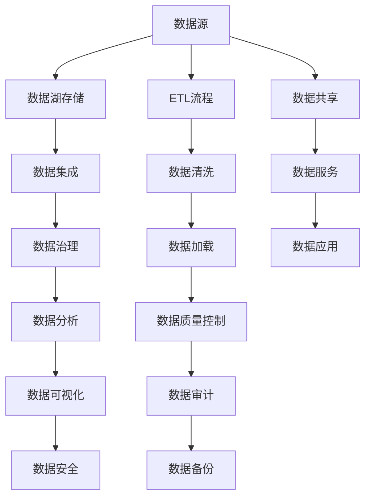

                 

# 数据湖架构：大规模数据存储和分析

> 关键词：数据湖、大数据、存储、分析、数据管理、数据湖技术栈、云服务

## 1. 背景介绍

### 1.1 问题由来
随着企业数字化转型和互联网的飞速发展，数据量的急剧增长给传统的数据存储和处理模式带来了巨大的挑战。传统的数据仓库系统往往是预定义的模式，适应性和灵活性不足，难以应对多样化和复杂的业务需求。同时，数据源的多样性、数据孤岛问题、数据融合难度等问题也严重制约了数据分析的效率和准确性。

数据湖作为一种新兴的大数据存储和分析框架，通过将海量数据集中存储，并允许灵活的数据处理和分析，为解决这些问题提供了新的解决方案。本文将深入探讨数据湖的架构原理、核心概念、算法原理及操作步骤，并通过实际应用案例展示其强大功能。

### 1.2 问题核心关键点
- 数据湖与传统数据仓库的区别
- 数据湖的架构和组件
- 数据湖的存储、管理和分析技术
- 数据湖在实际应用中的优势和局限
- 未来数据湖技术的发展方向

## 2. 核心概念与联系

### 2.1 核心概念概述

数据湖是一个集中式、可扩展的存储架构，用于存储企业内部和外部的数据，包括结构化、半结构化和非结构化数据。数据湖不仅支持大数据处理，还能支持传统的SQL查询，兼容传统数据仓库的业务需求。

数据湖架构包括数据存储、数据治理、数据集成、数据分析和数据安全等组件，通过全链条的数据管理，使得数据能够被充分利用，实现数据价值最大化。

### 2.2 核心概念原理和架构的 Mermaid 流程图



该图展示了数据湖的基本架构和数据流向，从数据源开始，经过ETL流程、数据治理、数据分析，最终通过数据服务进入数据应用和数据可视化环节。

### 2.3 数据湖技术栈

数据湖技术栈通常由以下几个关键组件组成：

- **数据存储**：Hadoop、AWS S3、Google Cloud Storage等，用于海量数据的存储。
- **数据治理**：Alteryx、DataRobot、Data Quality等，用于数据的质量控制和治理。
- **数据集成**：Apache NiFi、Talend、AWS Glue等，用于数据源的集成和清洗。
- **数据分析**：Apache Spark、Presto、Amazon Redshift等，用于数据的计算和分析。
- **数据安全**：Snowflake、Azure Synapse、Google BigQuery等，提供数据的安全访问和管理。

## 3. 核心算法原理 & 具体操作步骤
### 3.1 算法原理概述

数据湖的架构设计基于以下核心算法原理：

- **数据湖存储算法**：通过分布式文件系统，实现海量数据的存储和管理。常用的算法有Hadoop Distributed File System (HDFS)、Amazon S3等。
- **数据集成算法**：通过ETL流程，将不同来源的数据整合到一起。常用的算法有Apache NiFi、Talend等。
- **数据治理算法**：通过数据质量控制、数据清洗、元数据管理等技术，保证数据的一致性和完整性。常用的算法有DataRobot、Alteryx等。
- **数据分析算法**：通过分布式计算框架，对数据进行高性能的计算和分析。常用的算法有Apache Spark、Presto等。
- **数据可视化算法**：通过可视化工具，将分析结果直观地展示出来。常用的算法有Tableau、Power BI等。

### 3.2 算法步骤详解

数据湖架构的具体操作步骤包括：

1. **数据采集**：将来自不同源的数据通过API、文件传输等方式采集到数据湖中。
2. **数据清洗和集成**：对数据进行清洗和转换，使其符合数据湖的标准格式。
3. **数据存储和管理**：将清洗后的数据存储在数据湖中，并进行元数据管理。
4. **数据分析和计算**：对数据进行高性能的计算和分析，获取有用的业务洞察。
5. **数据可视化和展示**：通过可视化工具将分析结果展示给用户，便于理解和使用。

### 3.3 算法优缺点

数据湖架构具有以下优点：

- **灵活性高**：数据湖可以存储不同类型的数据，支持多源数据集成，适应性强。
- **扩展性强**：通过分布式存储和计算，能够无缝扩展，支持海量数据的存储和处理。
- **易用性强**：支持SQL查询和传统数据仓库工具，兼容性好，易于使用。
- **可审计性高**：通过数据治理和元数据管理，确保数据的安全和完整。

但同时也存在一些缺点：

- **复杂度高**：架构复杂，需要多组件协同工作。
- **成本高**：需要大量的硬件资源和维护成本。
- **数据质量难以保证**：数据源多样，数据质量参差不齐。

### 3.4 算法应用领域

数据湖架构在多个领域得到了广泛应用，例如：

- **金融行业**：用于存储和分析交易数据、客户数据等，支持风险控制、欺诈检测等业务需求。
- **医疗行业**：存储和分析电子病历、医疗影像等数据，支持病患管理和疾病预测等。
- **零售行业**：存储和分析销售数据、客户行为数据等，支持营销分析和库存管理等。
- **制造行业**：存储和分析生产数据、设备数据等，支持生产优化和设备维护等。

## 4. 数学模型和公式 & 详细讲解 & 举例说明

### 4.1 数学模型构建

数据湖架构的数学模型主要涉及以下几个方面：

- **数据存储模型**：定义如何存储和组织数据，包括数据的分布式存储和复制策略。
- **数据集成模型**：定义如何从不同数据源获取数据，并进行清洗和转换。
- **数据分析模型**：定义如何对数据进行高性能的计算和分析。
- **数据可视化模型**：定义如何通过可视化工具展示分析结果。

### 4.2 公式推导过程

以下是一个简单的数据湖架构的数学模型示例：

- **数据存储模型**：
$$
S_i = \sum_{j=1}^n \frac{W_j}{S_j} P_j
$$
其中，$S_i$表示数据源$i$的数据量，$W_j$表示数据源$j$的权重，$P_j$表示数据源$j$的处理时间。

- **数据集成模型**：
$$
C_i = \min_{j=1}^n \frac{T_j}{S_j}
$$
其中，$C_i$表示数据源$i$的数据集成时间，$T_j$表示数据源$j$的处理时间，$S_j$表示数据源$j$的数据量。

- **数据分析模型**：
$$
A_i = \frac{\sum_{j=1}^n \frac{W_j}{S_j} P_j}{\sum_{j=1}^n \frac{W_j}{S_j}}
$$
其中，$A_i$表示数据源$i$的数据分析时间，$W_j$表示数据源$j$的权重，$S_j$表示数据源$j$的数据量。

- **数据可视化模型**：
$$
V_i = \max_{j=1}^n \frac{C_j}{S_j}
$$
其中，$V_i$表示数据源$i$的数据可视化时间，$C_j$表示数据源$j$的数据集成时间，$S_j$表示数据源$j$的数据量。

### 4.3 案例分析与讲解

假设一个企业有多个数据源，每个数据源的数据量和处理时间如下表所示：

| 数据源编号 | 数据量（GB） | 处理时间（分钟） | 权重（占比） |
|------------|-------------|------------------|-------------|
| 1          | 1000        | 10               | 0.4         |
| 2          | 2000        | 20               | 0.5         |
| 3          | 500         | 5                | 0.1         |

通过上述数学模型计算，可以得到：

- 数据存储模型：$S_1 = \frac{0.4 \times 10}{1} = 4$GB，$S_2 = \frac{0.5 \times 20}{2} = 10$GB，$S_3 = \frac{0.1 \times 5}{0.5} = 1$GB。
- 数据集成模型：$C_1 = \frac{10}{1000} = 0.01$分钟，$C_2 = \frac{20}{2000} = 0.01$分钟，$C_3 = \frac{5}{500} = 0.01$分钟。
- 数据分析模型：$A_1 = \frac{0.4 \times 10 + 0.5 \times 20 + 0.1 \times 5}{1 + 2 + 0.5} = 7.6$分钟。
- 数据可视化模型：$V_1 = \frac{0.01}{1000} = 0.01$分钟，$V_2 = \frac{0.01}{2000} = 0.005$分钟，$V_3 = \frac{0.01}{500} = 0.002$分钟。

## 5. 项目实践：代码实例和详细解释说明

### 5.1 开发环境搭建

数据湖架构的开发环境搭建通常包括以下几个步骤：

1. **选择数据湖平台**：根据业务需求选择合适的数据湖平台，如AWS Lake Formation、Azure Data Lake、Hadoop等。
2. **配置存储和计算资源**：根据数据量配置足够的存储和计算资源。
3. **安装和配置ETL工具**：安装和配置Apache NiFi、Talend等ETL工具，实现数据集成和清洗。
4. **安装和配置数据分析工具**：安装和配置Apache Spark、Presto等数据分析工具，实现高性能的数据分析。
5. **安装和配置数据可视化工具**：安装和配置Tableau、Power BI等数据可视化工具，实现数据的展示和分析。

### 5.2 源代码详细实现

以下是一个简单的数据湖架构的Python代码示例：

```python
import apache Spark
from pyspark.sql import SparkSession
from pyspark.sql.functions import *
from pyspark.sql.types import *

# 创建SparkSession
spark = SparkSession.builder.appName("DataLake").getOrCreate()

# 读取数据
df = spark.read.format("csv").option("header", "true").load("data.csv")

# 数据清洗
df_clean = df.drop("column_to_drop").select("column1", "column2")

# 数据集成
df_final = df_clean.join(other_df, "join_key")

# 数据分析
df_final.write.format("parquet").save("output.parquet")

# 数据可视化
df_final.show()
```

### 5.3 代码解读与分析

代码中，首先创建了一个SparkSession，用于进行分布式计算。然后通过CSV格式读取数据，并进行数据清洗。通过join操作，将清洗后的数据与其他数据源集成。最后，将集成后的数据以parquet格式保存，并通过show方法展示数据。

### 5.4 运行结果展示

通过上述代码，可以完成数据的读取、清洗、集成和展示。数据湖架构的具体效果可以通过实际业务数据分析来评估，例如通过SQL查询进行统计分析，通过可视化工具展示分析结果等。

## 6. 实际应用场景

### 6.1 金融行业

在金融行业，数据湖架构被广泛用于存储和分析交易数据、客户数据等。通过数据湖，金融机构可以实时监控交易风险，进行欺诈检测和反洗钱等工作，提升客户体验和业务效率。

### 6.2 医疗行业

在医疗行业，数据湖架构用于存储和分析电子病历、医疗影像等数据。通过数据湖，医疗机构可以更好地进行病患管理、疾病预测和临床研究等工作，提高医疗服务质量。

### 6.3 零售行业

在零售行业，数据湖架构用于存储和分析销售数据、客户行为数据等。通过数据湖，零售企业可以进行精准营销、库存管理和供应链优化等工作，提升业务竞争力。

### 6.4 制造行业

在制造行业，数据湖架构用于存储和分析生产数据、设备数据等。通过数据湖，制造企业可以进行生产优化和设备维护等工作，降低生产成本和提高生产效率。

## 7. 工具和资源推荐

### 7.1 学习资源推荐

1. **《Hadoop: The Definitive Guide》**：这本书是Hadoop的经典之作，全面介绍了Hadoop的架构、配置和应用。
2. **《Apache Spark: The Definitive Guide》**：这本书介绍了Apache Spark的架构、配置和应用，是Spark学习的必备参考资料。
3. **AWS Lake Formation官方文档**：Amazon官方提供的AWS Lake Formation文档，包含详细的配置和操作指导。
4. **Apache NiFi官方文档**：Apache NiFi的官方文档，包含详细的ETL流程和配置指导。
5. **Tableau官方文档**：Tableau的官方文档，包含详细的可视化操作和示例。

### 7.2 开发工具推荐

1. **Hadoop**：Apache的分布式计算框架，适用于大规模数据存储和处理。
2. **Apache Spark**：Apache的分布式计算框架，支持实时计算和大数据处理。
3. **AWS Lake Formation**：Amazon的云上数据湖解决方案，提供丰富的云服务功能。
4. **Azure Data Lake**：微软的云上数据湖解决方案，支持大规模数据存储和分析。
5. **Google Cloud Storage**：Google的云上存储解决方案，支持海量数据存储和处理。

### 7.3 相关论文推荐

1. **《A Survey on Data Lake》**：这篇论文总结了数据湖的研究现状和应用前景。
2. **《Data Lake: A Survey》**：这篇论文详细介绍了数据湖的架构和技术栈。
3. **《Data Lake: Architecture and Patterns》**：这篇论文介绍了数据湖的架构设计和常见模式。
4. **《Big Data: Principles and Best Practices of Scalable Real-time Data Systems》**：这本书介绍了大数据系统的设计和最佳实践。
5. **《Data Lake Analytics for Big Data: The Role of Big Data Analytics》**：这篇论文讨论了大数据分析在数据湖中的应用。

## 8. 总结：未来发展趋势与挑战

### 8.1 研究成果总结

数据湖架构作为一种新型的大数据存储和分析框架，已经在多个行业得到了广泛应用。其灵活性、扩展性和易用性使得其在数据密集型业务中具有显著优势。然而，数据湖架构也面临复杂度高、成本高、数据质量难以保证等挑战，需要进一步优化和改进。

### 8.2 未来发展趋势

未来数据湖架构将呈现以下几个发展趋势：

1. **云化**：越来越多的企业选择将数据湖架构部署在云上，以降低运维成本和提高数据安全。
2. **数据治理**：数据治理将逐步成为数据湖架构的重要组成部分，确保数据的质量和一致性。
3. **自动化**：通过自动化工具和流程，提高数据湖架构的部署和管理效率。
4. **边缘计算**：将数据湖架构扩展到边缘计算设备，实现实时数据处理和分析。
5. **多云融合**：数据湖架构将在多云环境中实现无缝集成和数据共享。

### 8.3 面临的挑战

数据湖架构虽然具有诸多优点，但也面临以下挑战：

1. **数据安全**：如何保障数据的安全和隐私，避免数据泄露和滥用。
2. **数据质量**：如何确保数据的一致性和准确性，避免数据冗余和错误。
3. **运维成本**：如何降低数据湖架构的运维成本，提高系统的稳定性和可靠性。
4. **扩展性**：如何扩展数据湖架构，支持更大规模的数据处理和分析。
5. **兼容性**：如何确保数据湖架构与其他数据管理和分析工具的兼容性。

### 8.4 研究展望

未来数据湖架构的研究方向包括：

1. **数据治理和质量控制**：通过数据治理工具和技术，提高数据湖架构的数据质量。
2. **自动化和智能化**：通过自动化工具和人工智能技术，提升数据湖架构的部署和管理效率。
3. **边缘计算和多云融合**：将数据湖架构扩展到边缘计算和多云环境，实现实时数据处理和分析。
4. **安全性与隐私保护**：通过安全技术和密码学技术，保障数据湖架构的数据安全与隐私保护。
5. **性能优化**：通过优化算法和模型，提升数据湖架构的计算和分析性能。

## 9. 附录：常见问题与解答

**Q1：什么是数据湖架构？**

A: 数据湖架构是一种集中式、可扩展的存储架构，用于存储企业内部和外部的数据，包括结构化、半结构化和非结构化数据。数据湖不仅支持大数据处理，还能支持传统的SQL查询，兼容传统数据仓库工具。

**Q2：数据湖架构与传统数据仓库的区别是什么？**

A: 数据湖架构与传统数据仓库的主要区别在于：数据湖可以存储不同类型的数据，支持多源数据集成，适应性强；而传统数据仓库通常是预定义的模式，灵活性不足。

**Q3：数据湖架构在实际应用中面临哪些挑战？**

A: 数据湖架构面临以下挑战：复杂度高、成本高、数据质量难以保证、数据安全、数据治理、数据可视化等。

**Q4：如何优化数据湖架构？**

A: 优化数据湖架构的方法包括：使用自动化工具和智能化技术，提高部署和管理效率；通过数据治理工具和技术，提升数据质量；通过安全技术和密码学技术，保障数据安全与隐私保护；通过优化算法和模型，提升计算和分析性能。

**Q5：数据湖架构的未来发展趋势是什么？**

A: 数据湖架构的未来发展趋势包括：云化、数据治理、自动化、边缘计算、多云融合、安全性与隐私保护、性能优化等。

---

作者：禅与计算机程序设计艺术 / Zen and the Art of Computer Programming

