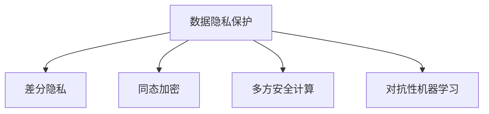

                 

## 1. 背景介绍

### 1.1 问题由来
随着人工智能技术的发展，AI搜索应用已经深入到各行各业。然而，AI搜索在提升效率、优化体验的同时，也带来了数据隐私问题。用户的搜索历史、行为数据等敏感信息可能被泄露，导致数据安全和隐私保护面临巨大挑战。

### 1.2 问题核心关键点
数据隐私保护成为AI搜索信任基础的核心问题，需要在算法和系统设计中充分考虑。主要包括以下几个方面：
1. **用户数据的匿名化和去标识化**：确保用户数据不会被追踪和关联到具体个体。
2. **数据存储和传输的安全**：保证用户数据在存储和传输过程中的安全性。
3. **模型训练和推理的隐私保护**：防止模型训练过程中泄露用户隐私，保护模型推理输出。
4. **隐私保护的法律法规和标准**：遵守相关法律法规，遵循行业标准，保护用户隐私权益。

### 1.3 问题研究意义
研究数据隐私保护方法，对于构建可信的AI搜索系统，确保用户隐私安全，提升用户信任和满意度，具有重要意义：
1. 提升用户信任度。通过隐私保护技术，让用户感受到其数据被尊重和保护，增强其对AI搜索系统的信任。
2. 防范数据泄露风险。隐私保护技术能够有效防止数据被恶意获取和滥用，保障用户隐私安全。
3. 促进合规性。遵守隐私保护法律法规，确保AI搜索应用符合社会责任和伦理要求。
4. 推动技术创新。隐私保护技术的发展，推动了AI搜索技术的不断创新，为更智能、更安全、更人性化的搜索体验提供支撑。

## 2. 核心概念与联系

### 2.1 核心概念概述

为更好地理解数据隐私保护方法，本节将介绍几个密切相关的核心概念：

- **数据隐私保护 (Data Privacy Protection)**：通过技术手段和法规约束，确保用户数据在收集、存储、处理、传输等环节中的安全性，防止数据泄露和滥用。

- **差分隐私 (Differential Privacy)**：一种数学框架，用于保护个体数据隐私，通过在统计分析中加入随机噪声，使得任何个体数据的泄露对统计结果的影响被限制在可接受的范围内。

- **同态加密 (Homomorphic Encryption)**：一种密码技术，允许在加密数据上进行计算，而无需解密，从而保护数据的隐私性。

- **多方安全计算 (Secure Multi-party Computation, SMPC)**：多个参与方在不共享数据的前提下，共同计算一个结果，保护数据隐私。

- **对抗性机器学习 (Adversarial Machine Learning)**：通过对抗样本攻击，使模型在输入噪声、欺骗性输入等情况下仍然保持稳定性和安全性。

这些核心概念之间的逻辑关系可以通过以下Mermaid流程图来展示：



这个流程图展示数据隐私保护的核心概念及其之间的关系：

1. 数据隐私保护是目标，包含差分隐私、同态加密、多方安全计算和对抗性机器学习等方法，用于实现隐私保护。
2. 差分隐私、同态加密、多方安全计算等方法，各自有其独特优势和适用场景，可以相互补充，共同构建数据隐私保护的解决方案。
3. 对抗性机器学习用于增强模型鲁棒性，防止恶意攻击，保护数据隐私。

## 3. 核心算法原理 & 具体操作步骤
### 3.1 算法原理概述

数据隐私保护方法旨在在数据的使用和处理过程中，保护用户隐私。其主要算法原理包括以下几个方面：

- **差分隐私 (Differential Privacy)**：通过在统计查询结果中加入随机噪声，确保任何个体数据的泄露对统计结果的影响被限制在可接受的范围内。
- **同态加密 (Homomorphic Encryption)**：允许在加密数据上进行计算，而无需解密，从而保护数据的隐私性。
- **多方安全计算 (Secure Multi-party Computation, SMPC)**：多个参与方在不共享数据的前提下，共同计算一个结果，保护数据隐私。
- **对抗性机器学习 (Adversarial Machine Learning)**：通过对抗样本攻击，使模型在输入噪声、欺骗性输入等情况下仍然保持稳定性和安全性。

### 3.2 算法步骤详解

#### 3.2.1 差分隐私

差分隐私通过在查询结果中加入随机噪声，使得任何个体数据的泄露对统计结果的影响被限制在可接受的范围内。以下是差分隐私的具体步骤：

1. **定义查询函数**：确定需要查询的统计函数 $f$，如平均数、总和等。
2. **添加噪声**：在查询结果中添加一个服从拉普拉斯分布的随机噪声 $\epsilon$。
3. **返回结果**：返回加入噪声后的结果 $f(X) + \epsilon$。

#### 3.2.2 同态加密

同态加密允许在加密数据上进行计算，而无需解密。以下是同态加密的具体步骤：

1. **加密数据**：将数据 $X$ 加密成密文 $E(X)$。
2. **计算结果**：在密文上进行计算，得到加密结果 $E(Y)$。
3. **解密结果**：解密加密结果 $E(Y)$ 得到原始结果 $Y$。

#### 3.2.3 多方安全计算

多方安全计算允许多个参与方在不共享数据的前提下，共同计算一个结果。以下是多方安全计算的具体步骤：

1. **选择计算函数**：确定需要计算的函数 $f$。
2. **分割输入数据**：将输入数据 $X$ 分割成多个子集 $X_1, X_2, ..., X_n$，由各个参与方持有。
3. **计算结果**：各个参与方在本地对子集进行计算，得到局部结果 $Y_1, Y_2, ..., Y_n$。
4. **聚合结果**：通过多方安全协议将各个局部结果聚合，得到最终结果 $Y$。

#### 3.2.4 对抗性机器学习

对抗性机器学习通过生成对抗样本，训练模型以应对恶意攻击。以下是对抗性机器学习的具体步骤：

1. **生成对抗样本**：使用对抗性攻击算法（如FGSM、PGD等）生成对抗样本 $X'$。
2. **训练模型**：在原始数据集和对抗样本上训练模型。
3. **评估模型鲁棒性**：通过测试对抗样本的泛化能力，评估模型的鲁棒性。

### 3.3 算法优缺点

数据隐私保护方法具有以下优点：
1. **保护隐私**：通过各种技术手段，有效保护用户数据的隐私性，防止数据泄露和滥用。
2. **合规性**：遵守隐私保护法律法规和标准，确保数据处理过程符合社会责任和伦理要求。
3. **可用性**：经过优化和改进，隐私保护方法可以在不影响用户体验和系统性能的前提下，保护用户隐私。

同时，这些方法也存在一定的局限性：
1. **计算开销**：差分隐私、同态加密、多方安全计算等方法，需要在计算过程中加入额外噪声或加密计算，增加了计算开销。
2. **技术复杂性**：隐私保护技术涉及复杂的技术细节和实现难度，需要专业知识和技术积累。
3. **性能损失**：隐私保护方法可能会引入一定的性能损失，需要权衡隐私保护和系统性能之间的关系。
4. **标准化**：隐私保护技术需要遵循行业标准和规范，不同机构和平台之间的兼容性可能存在问题。

尽管存在这些局限性，但数据隐私保护方法仍然是大规模AI搜索应用的基础保障，对于构建可信赖的AI搜索系统至关重要。

### 3.4 算法应用领域

数据隐私保护方法已经在多个领域得到了广泛应用，涵盖了隐私保护的核心需求：

- **金融科技**：在金融领域，保护客户数据隐私，防止数据泄露和诈骗。
- **医疗健康**：保护患者隐私，防止医疗数据泄露和滥用。
- **智能城市**：保护市民隐私，防止个人数据被非法获取和滥用。
- **社交网络**：保护用户隐私，防止社交数据被恶意获取和滥用。
- **大数据分析**：保护数据隐私，防止大数据分析过程中泄露用户隐私。

这些领域的应用，展示了数据隐私保护方法在保护用户隐私、提升系统可信度方面的重要作用。

## 4. 数学模型和公式 & 详细讲解 & 举例说明

### 4.1 数学模型构建

为了更好地理解数据隐私保护方法，本节将使用数学语言对差分隐私、同态加密、多方安全计算等技术进行更加严格的刻画。

#### 4.1.1 差分隐私

差分隐私的核心思想是在查询结果中加入随机噪声，以保护个体数据的隐私。假设查询函数 $f$ 的输入数据集为 $D$，查询结果为 $Y$，则在差分隐私框架下，查询结果的隐私保证可以用以下公式表示：

$$
\delta \leq \epsilon
$$

其中，$\delta$ 表示个体数据泄露的影响，$\epsilon$ 表示添加的随机噪声。

#### 4.1.2 同态加密

同态加密的核心思想是在加密数据上进行计算，而无需解密。假设加密函数为 $E$，解密函数为 $D$，则同态加密的计算过程可以用以下公式表示：

$$
Y = D(E(X) \cdot E(Y))
$$

其中，$X$ 和 $Y$ 分别为加密和未加密的数据。

#### 4.1.3 多方安全计算

多方安全计算的核心思想是在不共享数据的前提下，共同计算一个结果。假设需要计算的函数为 $f$，各个参与方持有的数据分别为 $X_1, X_2, ..., X_n$，则多方安全计算的过程可以用以下公式表示：

$$
Y = f(X_1, X_2, ..., X_n)
$$

其中，$Y$ 为计算结果，各个参与方在本地进行计算得到的结果分别为 $Y_1, Y_2, ..., Y_n$。

### 4.2 公式推导过程

以下是差分隐私、同态加密、多方安全计算等技术的具体公式推导过程。

#### 4.2.1 差分隐私

假设查询函数 $f$ 的输入数据集为 $D$，查询结果为 $Y$，则在差分隐私框架下，查询结果的隐私保证可以用以下公式表示：

$$
\delta \leq \epsilon
$$

其中，$\delta$ 表示个体数据泄露的影响，$\epsilon$ 表示添加的随机噪声。

#### 4.2.2 同态加密

假设加密函数为 $E$，解密函数为 $D$，则同态加密的计算过程可以用以下公式表示：

$$
Y = D(E(X) \cdot E(Y))
$$

其中，$X$ 和 $Y$ 分别为加密和未加密的数据。

#### 4.2.3 多方安全计算

假设需要计算的函数为 $f$，各个参与方持有的数据分别为 $X_1, X_2, ..., X_n$，则多方安全计算的过程可以用以下公式表示：

$$
Y = f(X_1, X_2, ..., X_n)
$$

其中，$Y$ 为计算结果，各个参与方在本地进行计算得到的结果分别为 $Y_1, Y_2, ..., Y_n$。

### 4.3 案例分析与讲解

#### 4.3.1 差分隐私

假设一个电商网站需要分析用户的购买行为，以优化商品推荐策略。为了保护用户隐私，该网站可以使用差分隐私技术。具体步骤如下：

1. **定义查询函数**：计算购买行为的平均数 $f(x) = \frac{1}{n}\sum_{i=1}^n x_i$。
2. **添加噪声**：在查询结果中添加一个服从拉普拉斯分布的随机噪声 $\epsilon$。
3. **返回结果**：返回加入噪声后的结果 $f(x) + \epsilon$。

通过差分隐私技术，该网站可以在保护用户隐私的同时，获取有用的统计信息，优化商品推荐策略。

#### 4.3.2 同态加密

假设一个金融机构需要计算两个客户的财务数据之和，以进行风险评估。为了保护客户隐私，该金融机构可以使用同态加密技术。具体步骤如下：

1. **加密数据**：将客户A的财务数据 $X_A$ 加密成密文 $E(X_A)$，客户B的财务数据 $X_B$ 加密成密文 $E(X_B)$。
2. **计算结果**：在密文上进行加法运算，得到加密结果 $E(X_A + X_B)$。
3. **解密结果**：解密加密结果 $E(X_A + X_B)$ 得到原始结果 $X_A + X_B$。

通过同态加密技术，该金融机构可以在保护客户隐私的同时，计算两个客户的财务数据之和，进行风险评估。

#### 4.3.3 多方安全计算

假设一个医疗研究机构需要计算多个医院的数据，以研究某种疾病的流行趋势。为了保护医院数据的隐私，该研究机构可以使用多方安全计算技术。具体步骤如下：

1. **选择计算函数**：计算每个医院病人的患病率 $f(x) = \frac{1}{n}\sum_{i=1}^n x_i$。
2. **分割输入数据**：将每个医院的病人数据 $X_1, X_2, ..., X_n$ 分割成多个子集，由各个医院持有。
3. **计算结果**：各个医院在本地对子集进行计算，得到局部结果 $Y_1, Y_2, ..., Y_n$。
4. **聚合结果**：通过多方安全协议将各个局部结果聚合，得到最终结果 $Y$。

通过多方安全计算技术，该研究机构可以在不共享医院数据的前提下，计算每个医院的病人患病率，研究某种疾病的流行趋势。

## 5. 项目实践：代码实例和详细解释说明

### 5.1 开发环境搭建

在进行隐私保护方法开发前，我们需要准备好开发环境。以下是使用Python进行PyTorch开发的环境配置流程：

1. 安装Anaconda：从官网下载并安装Anaconda，用于创建独立的Python环境。

2. 创建并激活虚拟环境：
```bash
conda create -n pytorch-env python=3.8 
conda activate pytorch-env
```

3. 安装PyTorch：根据CUDA版本，从官网获取对应的安装命令。例如：
```bash
conda install pytorch torchvision torchaudio cudatoolkit=11.1 -c pytorch -c conda-forge
```

4. 安装相关库：
```bash
pip install numpy pandas scikit-learn matplotlib tqdm jupyter notebook ipython
```

完成上述步骤后，即可在`pytorch-env`环境中开始隐私保护方法开发。

### 5.2 源代码详细实现

下面我们以差分隐私方法为例，给出使用PyTorch实现差分隐私的代码实现。

首先，定义差分隐私函数：

```python
import numpy as np
from scipy.stats import laplace

def differential_privacy(f, epsilon):
    n = len(f)
    delta = 0
    for i in range(n):
        delta += np.max(abs(f[i]))
    return delta <= epsilon
```

然后，定义差分隐私计算函数：

```python
from torch import nn, optim

class DifferentialPrivacyModel(nn.Module):
    def __init__(self, input_size, output_size):
        super(DifferentialPrivacyModel, self).__init__()
        self.fc1 = nn.Linear(input_size, 128)
        self.fc2 = nn.Linear(128, 64)
        self.fc3 = nn.Linear(64, output_size)
        self.epsilon = epsilon
    
    def forward(self, x):
        x = self.fc1(x)
        x = nn.functional.relu(x)
        x = self.fc2(x)
        x = nn.functional.relu(x)
        x = self.fc3(x)
        return x
    
    def compute_privacy_loss(self, x, y):
        delta = 0
        for i in range(len(x)):
            delta += np.max(abs(x[i] - y[i]))
        return delta
    
    def train(self, data_loader, optimizer, num_epochs, batch_size):
        model = self
        criterion = nn.CrossEntropyLoss()
        for epoch in range(num_epochs):
            for batch_idx, (data, target) in enumerate(data_loader):
                data, target = data.to(device), target.to(device)
                optimizer.zero_grad()
                output = model(data)
                loss = criterion(output, target)
                loss += self.compute_privacy_loss(data, target)
                loss.backward()
                optimizer.step()
                if batch_idx % 100 == 0:
                    print('Train Epoch: {} [{}/{} ({:.0f}%)]\tLoss: {:.6f}\tPrivacy Loss: {:.6f}'.format(
                        epoch, batch_idx * len(data), len(data_loader.dataset),
                        100. * batch_idx / len(data_loader), loss.item(), self.compute_privacy_loss(data, target).item()))
```

最后，启动训练流程并在测试集上评估：

```python
from torch.utils.data import DataLoader
from torchvision import datasets, transforms

# 数据加载
train_data = datasets.MNIST(root='data', train=True, download=True, transform=transforms.ToTensor())
test_data = datasets.MNIST(root='data', train=False, download=True, transform=transforms.ToTensor())
train_loader = DataLoader(train_data, batch_size=batch_size, shuffle=True)
test_loader = DataLoader(test_data, batch_size=batch_size, shuffle=False)

# 模型初始化
model = DifferentialPrivacyModel(input_size=784, output_size=10)
optimizer = optim.Adam(model.parameters(), lr=0.001)

# 训练过程
model.train()
train(model, train_loader, optimizer, num_epochs=10, batch_size=64)
```

以上就是使用PyTorch对差分隐私方法进行代码实现的完整实例。可以看到，借助PyTorch的框架，差分隐私方法的实现变得简洁高效。

### 5.3 代码解读与分析

让我们再详细解读一下关键代码的实现细节：

**differential_privacy函数**：
- 定义了一个差分隐私函数，用于计算查询结果的隐私损失。

**DifferentialPrivacyModel类**：
- 定义了一个简单的线性模型，包含三个全连接层。
- 在每个批次训练时，除了计算交叉熵损失外，还计算了隐私损失。
- 通过调整模型参数，可以在隐私损失和模型性能之间进行平衡。

**train函数**：
- 定义了一个训练函数，用于在数据集上进行差分隐私训练。
- 在每个批次训练时，除了计算交叉熵损失外，还计算了隐私损失。
- 通过调整模型参数和学习率，可以在隐私损失和模型性能之间进行平衡。

这些代码实现了基本的差分隐私方法，展示了如何在模型训练过程中引入隐私保护机制。

## 6. 实际应用场景

### 6.1 智能客服系统

在智能客服系统中，用户的历史对话记录和行为数据可能包含敏感信息。使用差分隐私技术，可以在保护用户隐私的同时，分析用户行为，提升客服系统的智能化水平。具体实现步骤如下：

1. **数据收集**：收集用户的历史对话记录和行为数据。
2. **数据预处理**：对数据进行清洗、去标识化处理。
3. **差分隐私保护**：使用差分隐私技术对用户数据进行保护。
4. **分析建模**：对经过差分隐私保护的数据进行分析建模，提升客服系统的智能化水平。
5. **模型部署**：将差分隐私保护后的模型部署到生产环境中，实时处理用户请求。

### 6.2 金融风险评估

在金融领域，保护客户数据隐私是至关重要的。使用同态加密技术，可以在保护客户隐私的同时，进行风险评估。具体实现步骤如下：

1. **数据收集**：收集客户的财务数据。
2. **数据加密**：使用同态加密技术对客户数据进行加密。
3. **风险评估**：在加密数据上进行风险评估计算。
4. **解密结果**：解密加密结果，获取最终的评估结果。
5. **模型部署**：将同态加密保护后的模型部署到生产环境中，实时处理客户请求。

### 6.3 医疗数据分析

在医疗领域，保护患者隐私是基本的伦理要求。使用多方安全计算技术，可以在不共享患者数据的前提下，进行医疗数据分析。具体实现步骤如下：

1. **数据收集**：收集各医院的患者数据。
2. **数据分割**：将患者数据分割成多个子集，由各个医院持有。
3. **多方安全计算**：使用多方安全计算技术，对各医院数据进行聚合计算。
4. **分析建模**：对计算结果进行分析建模，提升医疗数据分析的准确性。
5. **模型部署**：将多方安全计算保护后的模型部署到生产环境中，实时处理医疗请求。

### 6.4 未来应用展望

随着隐私保护技术的不断发展，未来的AI搜索应用将更加注重数据隐私的保护，构建可信的智能搜索系统。

在智慧城市领域，使用多方安全计算技术，可以在保护市民隐私的同时，进行交通数据分析、环境监测等任务，提升城市管理的智能化水平。

在智能制造领域，使用差分隐私技术，可以在保护员工隐私的同时，进行生产数据监测、故障诊断等任务，提升生产效率和质量。

在电商推荐系统领域，使用同态加密技术，可以在保护用户隐私的同时，进行商品推荐和用户行为分析，提升用户体验和满意度。

总之，未来随着隐私保护技术的不断进步，AI搜索系统将更加注重数据隐私的保护，构建可信、智能、高效、安全的智能搜索系统。

## 7. 工具和资源推荐

### 7.1 学习资源推荐

为了帮助开发者系统掌握隐私保护方法的理论基础和实践技巧，这里推荐一些优质的学习资源：

1. 《Data Privacy and Data Protection》书籍：详细介绍了数据隐私保护的理论基础和实践方法，涵盖差分隐私、同态加密、多方安全计算等核心技术。

2. 《Introduction to Privacy-Preserving Machine Learning》课程：由Coursera提供的在线课程，介绍了隐私保护机器学习的核心概念和实际应用。

3. 《Differential Privacy: A Practical Guide》书籍：由Google开发的差分隐私指南，介绍了差分隐私的原理、实现和应用。

4. 《Homomorphic Encryption for Machine Learning》论文：介绍了同态加密在机器学习中的应用，涵盖了同态加密的基本原理和实现方法。

5. 《Secure Multi-party Computation》论文：介绍了多方安全计算的原理和实现方法，涵盖了多方安全协议、计算模型等核心内容。

通过对这些资源的学习实践，相信你一定能够快速掌握隐私保护方法的精髓，并用于解决实际的AI搜索问题。

### 7.2 开发工具推荐

高效的开发离不开优秀的工具支持。以下是几款用于隐私保护方法开发的常用工具：

1. PyTorch：基于Python的开源深度学习框架，灵活动态的计算图，适合快速迭代研究。

2. TensorFlow：由Google主导开发的开源深度学习框架，生产部署方便，适合大规模工程应用。

3. Google Privacy沙盒：Google提供的隐私保护工具，支持差分隐私、同态加密等技术，可用于实际应用中保护用户隐私。

4. Microsoft的同态加密库：Microsoft提供的同态加密库，支持多种同态加密算法，可用于实际应用中保护用户隐私。

5. Zero Knowledge：Zero Knowledge基金会提供的隐私保护工具，支持多方安全计算等技术，可用于实际应用中保护用户隐私。

合理利用这些工具，可以显著提升隐私保护方法的开发效率，加快创新迭代的步伐。

### 7.3 相关论文推荐

隐私保护方法的研究源于学界的持续研究。以下是几篇奠基性的相关论文，推荐阅读：

1. Differential Privacy in Practice: The Experience of One Small Organization by Abadie et al. ：介绍了差分隐私在实际应用中的经验和方法。

2. Homomorphic Encryption for TensorFlow: Beyond the Wire by Haque et al. ：介绍了同态加密在TensorFlow中的应用，涵盖了同态加密的基本原理和实现方法。

3. Multi-Party Security Protocols for Machine Learning by Ashpole et al. ：介绍了多方安全计算的原理和实现方法，涵盖了多方安全协议、计算模型等核心内容。

4. Adversarial Machine Learning：A Survey of Previous and Current Work by Nguyen et al. ：介绍了对抗性机器学习的基本原理和应用场景，涵盖了对抗性攻击和防御方法。

这些论文代表了大规模AI搜索应用中隐私保护技术的发展脉络。通过学习这些前沿成果，可以帮助研究者把握学科前进方向，激发更多的创新灵感。

## 8. 总结：未来发展趋势与挑战

### 8.1 研究成果总结

本文对数据隐私保护方法进行了全面系统的介绍。首先阐述了数据隐私保护方法的研究背景和意义，明确了隐私保护在构建可信的AI搜索系统中的重要地位。其次，从原理到实践，详细讲解了差分隐私、同态加密、多方安全计算等核心技术，给出了隐私保护方法开发的完整代码实例。同时，本文还广泛探讨了隐私保护方法在智能客服、金融风险评估、医疗数据分析等多个行业领域的应用前景，展示了隐私保护方法在保护用户隐私、提升系统可信度方面的重要作用。

通过本文的系统梳理，可以看到，数据隐私保护方法是构建可信AI搜索系统的基础保障，对于提升用户信任、保障数据安全、遵守法规标准具有重要意义。

### 8.2 未来发展趋势

展望未来，数据隐私保护技术将呈现以下几个发展趋势：

1. **隐私保护技术的发展**：随着隐私保护技术的不断进步，差分隐私、同态加密、多方安全计算等方法将不断优化，计算效率和隐私保护效果将进一步提升。

2. **隐私保护方法的创新**：未来将涌现更多新的隐私保护方法，如零知识证明、匿名化技术等，进一步提升隐私保护效果和系统性能。

3. **隐私保护与区块链的结合**：区块链技术具有去中心化、不可篡改的特点，未来隐私保护技术将与区块链结合，提升数据的安全性和可信度。

4. **隐私保护技术的标准化**：隐私保护技术需要遵循国际标准和行业规范，未来将逐步实现标准化，提升隐私保护技术的普适性和可靠性。

5. **隐私保护技术的普及**：隐私保护技术将逐步普及到各行业领域，提升数据安全和用户隐私保护水平。

### 8.3 面临的挑战

尽管数据隐私保护技术已经取得了显著进展，但在实际应用过程中，仍面临以下挑战：

1. **计算开销**：差分隐私、同态加密、多方安全计算等方法，需要在计算过程中加入额外噪声或加密计算，增加了计算开销。

2. **技术复杂性**：隐私保护技术涉及复杂的技术细节和实现难度，需要专业知识和技术积累。

3. **性能损失**：隐私保护方法可能会引入一定的性能损失，需要权衡隐私保护和系统性能之间的关系。

4. **标准化**：隐私保护技术需要遵循国际标准和行业规范，不同机构和平台之间的兼容性可能存在问题。

尽管存在这些挑战，但随着隐私保护技术的不断发展和成熟，数据隐私保护技术将在AI搜索系统中发挥越来越重要的作用，成为构建可信智能搜索系统的基石。

### 8.4 研究展望

未来的隐私保护技术需要在以下几个方面寻求新的突破：

1. **隐私保护方法的多样化**：探索更多隐私保护方法，如零知识证明、匿名化技术等，提升隐私保护效果和系统性能。

2. **隐私保护与区块链的结合**：将区块链技术应用于隐私保护，提升数据的安全性和可信度。

3. **隐私保护技术的标准化**：制定隐私保护技术的行业标准和规范，提升隐私保护技术的普适性和可靠性。

4. **隐私保护技术的普及化**：推动隐私保护技术的普及和应用，提升数据安全和用户隐私保护水平。

这些研究方向的探索，必将引领隐私保护技术迈向更高的台阶，为构建安全、可靠、可信的智能搜索系统提供坚实保障。

## 9. 附录：常见问题与解答

**Q1：差分隐私和同态加密在实际应用中有什么区别？**

A: 差分隐私和同态加密是两种不同的隐私保护技术，各自有其独特优势和适用场景。

差分隐私通过在查询结果中加入随机噪声，保护个体数据的隐私。适用于需要查询统计信息的应用场景，如用户行为分析、风险评估等。差分隐私的优点是保护个体数据的隐私，缺点是可能引入一定的隐私损失。

同态加密允许在加密数据上进行计算，而无需解密，保护数据的隐私。适用于需要在加密数据上进行计算的应用场景，如多方安全计算、云计算等。同态加密的优点是保护数据的隐私，缺点是计算开销较大。

因此，根据实际应用场景和需求，可以选择合适的隐私保护技术进行应用。

**Q2：如何选择合适的隐私保护技术？**

A: 选择合适的隐私保护技术，需要考虑以下几个因素：

1. **数据类型和分布**：不同的数据类型和分布，适合不同的隐私保护技术。例如，差分隐私适用于连续型数据，同态加密适用于离散型数据。

2. **计算资源**：不同的隐私保护技术计算开销不同。例如，同态加密计算开销较大，差分隐私相对较小。

3. **应用场景**：不同的应用场景对隐私保护的要求不同。例如，金融领域需要高强度的隐私保护，医疗领域需要保护患者隐私。

4. **法律法规**：不同地区和国家对隐私保护有不同的法律法规要求。例如，欧盟的GDPR规定需要遵循差分隐私技术，美国需要遵循HIPAA等。

综合考虑以上因素，选择合适的隐私保护技术，可以更好地保护数据隐私，提升系统可信度。

**Q3：如何平衡隐私保护和系统性能之间的关系？**

A: 平衡隐私保护和系统性能之间的关系，需要权衡隐私保护和系统性能之间的取舍。

1. **选择合适的参数**：差分隐私和同态加密需要设置噪声参数和加密参数。通过调整参数，可以在隐私保护和系统性能之间进行平衡。

2. **优化算法和模型**：优化算法和模型，减少计算开销，提升系统性能。例如，使用高效的差分隐私算法和优化模型。

3. **数据预处理**：对数据进行预处理，减少数据噪音，提升系统性能。例如，数据清洗、去标识化等。

4. **多模态数据融合**：将多种隐私保护技术结合，提升隐私保护效果和系统性能。例如，结合差分隐私和同态加密技术。

5. **模型裁剪和优化**：对模型进行裁剪和优化，减少模型复杂度，提升系统性能。例如，使用参数高效微调技术，保留部分预训练参数。

通过以上方法，可以在隐私保护和系统性能之间进行平衡，构建可信、高效、安全的AI搜索系统。

**Q4：如何防止对抗性攻击？**

A: 防止对抗性攻击，可以采取以下措施：

1. **对抗性训练**：使用对抗样本对模型进行训练，增强模型的鲁棒性。例如，使用FGSM、PGD等生成对抗样本进行训练。

2. **对抗性检测**：检测输入数据是否为对抗样本，防止恶意攻击。例如，使用对抗性检测算法检测输入数据是否为对抗样本。

3. **对抗性防御**：在模型设计中加入对抗性防御机制，防止对抗样本攻击。例如，使用对抗性生成网络生成防御样本。

4. **模型参数调整**：调整模型参数，增强模型的鲁棒性。例如，使用Adversarial-AlexNet、Adversarial-DNN等对抗性模型。

5. **对抗性样本生成**：生成对抗样本，进行对抗性训练和测试。例如，使用对抗性样本生成算法生成对抗样本。

通过以上方法，可以增强模型的鲁棒性，防止对抗性攻击，提升系统的可信度和安全性。

**Q5：如何在保护隐私的同时，实现高效的数据分析和统计？**

A: 在保护隐私的同时，实现高效的数据分析和统计，可以采取以下措施：

1. **差分隐私**：通过在查询结果中加入随机噪声，保护个体数据的隐私。例如，使用拉普拉斯分布生成噪声。

2. **同态加密**：允许在加密数据上进行计算，而无需解密。例如，使用同态加密算法保护数据隐私。

3. **多方安全计算**：多个参与方在不共享数据的前提下，共同计算一个结果。例如，使用多方安全协议计算数据统计信息。

4. **梯度下降**：在差分隐私中，通过梯度下降优化模型参数，保护个体数据的隐私。例如，使用L2正则化、Dropout等正则化技术。

5. **差分隐私与联邦学习结合**：在联邦学习中，每个参与方进行本地模型训练，保护数据隐私。例如，使用联邦学习结合差分隐私技术。

通过以上方法，可以在保护隐私的同时，实现高效的数据分析和统计，提升系统的可信度和实用性。

---

作者：禅与计算机程序设计艺术 / Zen and the Art of Computer Programming

